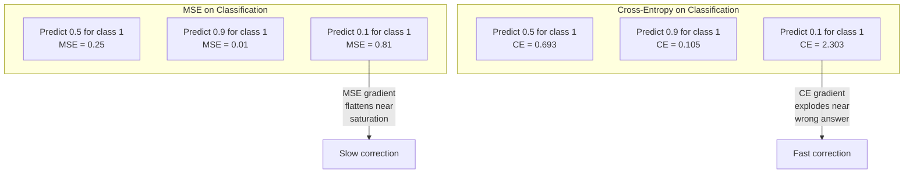
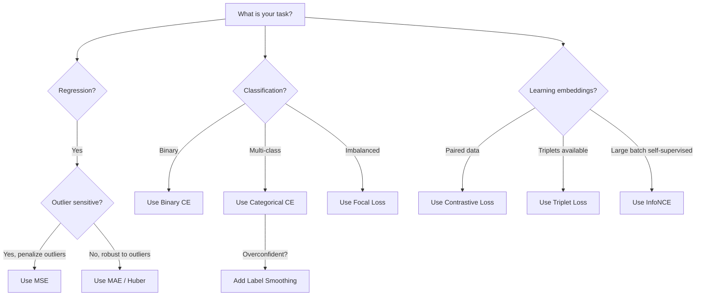
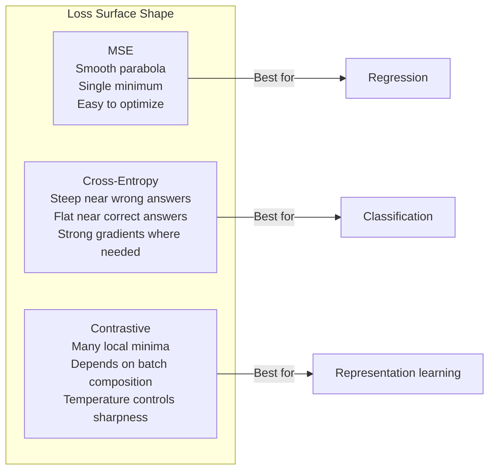

# 손실 함수 (Loss Functions)

> 신경망이 예측을 한다. 정답(ground truth)은 다르다고 말한다. 얼마나 틀렸는가? 그 숫자가 손실(loss)이다. 잘못된 손실 함수(loss function)를 고르면 모델은 완전히 엉뚱한 것을 최적화한다.

**Type:** Build
**Languages:** Python
**Prerequisites:** Lesson 03.04 (Activation Functions)
**Time:** ~75분

## 학습 목표 (Learning Objectives)

- MSE, 이진 교차 엔트로피(binary cross-entropy), 범주형 교차 엔트로피(categorical cross-entropy), 대조 손실(contrastive loss, InfoNCE)을 그 그래디언트(gradient)와 함께 밑바닥부터 구현하기
- "모든 것에 0.5를 예측하는" 실패 모드를 시연하여 MSE가 분류(classification)에서 왜 실패하는지 설명하기
- 교차 엔트로피에 레이블 스무딩(label smoothing)을 적용하고, 그것이 어떻게 과신(overconfident) 예측을 막는지 기술하기
- 회귀(regression), 이진 분류, 다중 클래스 분류, 임베딩(embedding) 학습 과제에 맞는 올바른 손실 함수 고르기

## 문제 (The Problem)

분류 문제에서 MSE를 최소화하는 모델은 모든 것에 대해 0.5를 자신 있게 예측한다. 손실을 최소화하고 있다. 그러면서도 쓸모가 없다.

손실 함수는 모델이 실제로 최적화하는 유일한 것이다. 정확도가 아니다. F1 점수가 아니다. 매니저에게 보고하는 그 어떤 지표(metric)도 아니다. 옵티마이저(optimizer)는 손실 함수의 그래디언트를 받아 그 숫자를 더 작게 만들도록 가중치(weight)를 조정한다. 손실 함수가 우리가 신경 쓰는 것을 포착하지 못하면, 모델은 그것을 만족시키는 수학적으로 가장 값싼 방법을 찾아내고, 그 방법은 거의 항상 우리가 원했던 것이 아니다.

구체적인 예가 여기 있다. 이진 분류 과제가 있다. 두 클래스, 50/50 분할. 손실로 MSE를 쓴다. 모델은 모든 단일 입력에 대해 0.5를 예측한다. 평균 MSE는 0.25인데, 이는 실제로 아무것도 학습하지 않고 얻을 수 있는 최솟값이다. 모델은 변별력이 전혀 없지만 기술적으로는 손실 함수를 최소화했다. 교차 엔트로피로 바꾸면 같은 모델이 예측을 0이나 1 쪽으로 밀도록 강제된다. 왜냐하면 -log(0.5) = 0.693은 끔찍한 손실인 반면, -log(0.99) = 0.01은 자신 있고 올바른 예측에 보상을 주기 때문이다. 손실 함수의 선택은 학습하는 모델과 지표를 악용하는 모델의 차이다.

더 나빠진다. 자기 지도 학습(self-supervised learning)에서는 레이블(label)조차 없다. 대조 손실은 학습 신호를 전적으로 정의한다. 무엇이 유사한 것으로 간주되는지, 무엇이 다른 것으로 간주되는지, 그리고 모델이 그것들을 얼마나 세게 떼어 놓아야 하는지를 정한다. 대조 손실을 잘못 다루면 임베딩이 한 점으로 붕괴한다. 모든 입력이 같은 벡터로 매핑되는 것이다. 기술적으로는 손실이 0이다. 완전히 무가치하다.

## 개념 (The Concept)

### 평균 제곱 오차 (Mean Squared Error, MSE)

회귀의 기본값이다. 예측과 목표(target)의 제곱 차이를 계산하고, 모든 샘플에 대해 평균한다.

```
MSE = (1/n) * sum((y_pred - y_true)^2)
```

제곱이 왜 중요한가. 큰 오차를 2차로 벌한다. 오차 2는 오차 1의 4배만큼 비싸다. 오차 10은 100배다. 이 때문에 MSE는 이상치(outlier)에 민감하다. 단 하나의 터무니없이 틀린 예측이 손실을 지배한다.

실제 숫자로: 모델이 주택 가격을 예측하는데 대부분의 집에서 $10,000씩 빗나가지만 한 저택에서 $200,000 빗나간다면, MSE는 그 한 저택을 공격적으로 고치려 하다가 나머지 99채의 성능을 해칠 수 있다.

예측에 대한 MSE의 그래디언트는 이렇다.

```
dMSE/dy_pred = (2/n) * (y_pred - y_true)
```

오차에 선형이다. 더 큰 오차는 더 큰 그래디언트를 받는다. 이것은 회귀에는 장점이고(큰 오차는 큰 보정이 필요하다), 분류에는 단점이다(자신 있게 틀린 답을 선형이 아니라 지수적으로 벌하고 싶다).

### 교차 엔트로피 손실 (Cross-Entropy Loss)

분류를 위한 손실 함수다. 정보 이론에 뿌리를 둔다. 예측된 확률 분포(probability distribution)와 참 분포 사이의 발산(divergence)을 측정한다.

**이진 교차 엔트로피 (Binary Cross-Entropy, BCE):**

```
BCE = -(y * log(p) + (1 - y) * log(1 - p))
```

여기서 y는 참 레이블(0 또는 1)이고 p는 예측된 확률이다.

-log(p)가 작동하는 이유: 참 레이블이 1이고 p = 0.99로 예측하면, 손실은 -log(0.99) = 0.01이다. p = 0.01로 예측하면, 손실은 -log(0.01) = 4.6이다. 그 460배 차이가 교차 엔트로피가 작동하는 이유다. 자신 있게 틀린 예측을 가혹하게 벌하면서 자신 있게 맞은 예측은 거의 벌하지 않는다.

그래디언트도 같은 이야기를 한다.

```
dBCE/dp = -(y/p) + (1-y)/(1-p)
```

y = 1이고 p가 0에 가까울 때, 그래디언트는 -1/p이며 음의 무한대로 다가간다. 모델은 실수를 고치라는 엄청난 신호를 받는다. p가 1에 가까울 때, 그래디언트는 아주 작다. 이미 맞았으니 고칠 것이 없다.

**범주형 교차 엔트로피 (Categorical Cross-Entropy):**

원-핫 인코딩된 목표를 가진 다중 클래스 분류용이다.

```
CCE = -sum(y_i * log(p_i))
```

오직 참 클래스만 손실에 기여한다(다른 모든 y_i가 0이기 때문에). 10개 클래스가 있고 올바른 클래스가 확률 0.1(무작위 추측)을 받으면, 손실은 -log(0.1) = 2.3이다. 올바른 클래스가 확률 0.9를 받으면, 손실은 -log(0.9) = 0.105이다. 모델은 확률 질량을 정답에 집중시키는 법을 배운다.

### 왜 MSE가 분류에서 실패하는가



예측이 0이나 1에 가까울 때 MSE 그래디언트는 평평해진다(시그모이드 포화(saturation) 때문에). 교차 엔트로피 그래디언트는 이를 보상한다. -log가 시그모이드의 평평한 영역을 상쇄하여, 가장 필요한 바로 그곳에서 강한 그래디언트를 준다.

### 레이블 스무딩 (Label Smoothing)

표준 원-핫 레이블은 "이것은 100% 클래스 3이고 나머지 모두 0%다"라고 말한다. 그것은 강한 주장이다. 레이블 스무딩은 그것을 부드럽게 만든다.

```
smooth_label = (1 - alpha) * one_hot + alpha / num_classes
```

alpha = 0.1과 10개 클래스일 때: [0, 0, 1, 0, ...] 대신, 목표가 [0.01, 0.01, 0.91, 0.01, ...]이 된다. 모델은 1.0 대신 0.91을 목표로 한다.

이것이 작동하는 이유: 소프트맥스(softmax)를 통해 정확히 1.0을 출력하려는 모델은 로짓(logit)을 무한대로 밀어야 한다. 이는 과신을 일으키고, 일반화를 해치며, 모델을 분포 이동(distribution shift)에 취약하게 만든다. 레이블 스무딩은 목표를 0.9로 제한하여(alpha=0.1일 때), 로짓을 합리적인 범위로 유지한다. GPT와 대부분의 현대 모델은 레이블 스무딩이나 그에 상응하는 것을 사용한다.

### 대조 손실 (Contrastive Loss)

레이블이 없다. 클래스가 없다. 그저 입력의 쌍과 질문 하나: 이것들은 유사한가 다른가?

**SimCLR 스타일 대조 손실 (NT-Xent / InfoNCE):**

이미지 하나를 가져온다. 그것의 증강된 두 뷰(자르기, 회전, 색 지터)를 만든다. 이것이 "양성 쌍(positive pair)"이다. 유사한 임베딩을 가져야 한다. 배치(batch) 안의 다른 모든 이미지는 "음성 쌍(negative pair)"을 이룬다. 다른 임베딩을 가져야 한다.

```
L = -log(exp(sim(z_i, z_j) / tau) / sum(exp(sim(z_i, z_k) / tau)))
```

여기서 sim()은 코사인 유사도(cosine similarity)이고, z_i와 z_j는 양성 쌍이며, 합은 모든 음성에 대한 것이고, tau(온도(temperature))는 분포가 얼마나 날카로운지를 제어한다. 낮은 온도 = 더 어려운 음성 = 더 공격적인 분리.

실제 숫자로: 배치 크기 256은 양성 쌍당 255개의 음성을 뜻한다. 온도 tau = 0.07(SimCLR 기본값). 손실은 유사도에 대한 소프트맥스처럼 보인다. 양성 쌍의 유사도가 256개 선택지 중 가장 높기를 원한다.

**삼중항 손실 (Triplet Loss):**

세 개의 입력을 받는다: 앵커(anchor), 양성(positive, 같은 클래스), 음성(negative, 다른 클래스).

```
L = max(0, d(anchor, positive) - d(anchor, negative) + margin)
```

마진(margin, 보통 0.2-1.0)은 양성과 음성 거리 사이에 최소 간격을 강제한다. 음성이 이미 충분히 멀리 떨어져 있으면, 손실은 0이다. 그래디언트도 없고, 갱신도 없다. 이는 학습을 효율적으로 만들지만 세심한 삼중항 마이닝(triplet mining, 앵커에 가까운 어려운 음성을 고르는 것)을 요구한다.

### 포컬 손실 (Focal Loss)

불균형 데이터셋용이다. 표준 교차 엔트로피는 올바르게 분류된 모든 예제를 동등하게 다룬다. 포컬 손실은 쉬운 예제의 가중치를 낮춘다.

```
FL = -alpha * (1 - p_t)^gamma * log(p_t)
```

여기서 p_t는 참 클래스의 예측 확률이고 gamma는 집중을 제어한다. gamma = 0이면 이것은 표준 교차 엔트로피다. gamma = 2(기본값)일 때:

- 쉬운 예제 (p_t = 0.9): 가중치 = (0.1)^2 = 0.01. 사실상 무시됨.
- 어려운 예제 (p_t = 0.1): 가중치 = (0.9)^2 = 0.81. 완전한 그래디언트 신호.

포컬 손실은 Lin 등이 객체 탐지(object detection)를 위해 도입했는데, 거기서는 후보 영역의 99%가 배경(쉬운 음성)이다. 포컬 손실이 없으면, 모델은 쉬운 배경 예제에 빠져 익사하고 객체 탐지를 절대 배우지 못한다. 그것이 있으면, 모델은 중요한 어렵고 모호한 경우에 용량을 집중한다.

### 손실 함수 결정 트리



### 손실 지형 (Loss Landscape)



## 직접 만들기 (Build It)

### 1단계: MSE와 그 그래디언트

```python
def mse(predictions, targets):
    n = len(predictions)
    total = 0.0
    for p, t in zip(predictions, targets):
        total += (p - t) ** 2
    return total / n

def mse_gradient(predictions, targets):
    n = len(predictions)
    grads = []
    for p, t in zip(predictions, targets):
        grads.append(2.0 * (p - t) / n)
    return grads
```

### 2단계: 이진 교차 엔트로피

log(0) 문제는 실재한다. 모델이 양성 예제에 대해 정확히 0을 예측하면, log(0) = 음의 무한대다. 클리핑(clipping)이 이를 막는다.

```python
import math

def binary_cross_entropy(predictions, targets, eps=1e-15):
    n = len(predictions)
    total = 0.0
    for p, t in zip(predictions, targets):
        p_clipped = max(eps, min(1 - eps, p))
        total += -(t * math.log(p_clipped) + (1 - t) * math.log(1 - p_clipped))
    return total / n

def bce_gradient(predictions, targets, eps=1e-15):
    grads = []
    for p, t in zip(predictions, targets):
        p_clipped = max(eps, min(1 - eps, p))
        grads.append(-(t / p_clipped) + (1 - t) / (1 - p_clipped))
    return grads
```

### 3단계: 소프트맥스를 가진 범주형 교차 엔트로피

소프트맥스는 원시 로짓을 확률로 변환한다. 그다음 우리는 원-핫 목표에 대한 교차 엔트로피를 계산한다.

```python
def softmax(logits):
    max_val = max(logits)
    exps = [math.exp(x - max_val) for x in logits]
    total = sum(exps)
    return [e / total for e in exps]

def categorical_cross_entropy(logits, target_index, eps=1e-15):
    probs = softmax(logits)
    p = max(eps, probs[target_index])
    return -math.log(p)

def cce_gradient(logits, target_index):
    probs = softmax(logits)
    grads = list(probs)
    grads[target_index] -= 1.0
    return grads
```

소프트맥스 + 교차 엔트로피의 그래디언트는 아름답게 단순해진다: 참 클래스에 대해서는 그저 (예측 확률 - 1)이고, 다른 모든 클래스에 대해서는 (예측 확률)이다. 이 우아한 단순화는 우연이 아니다. 그것이 소프트맥스와 교차 엔트로피가 짝지어지는 이유다.

### 4단계: 레이블 스무딩

```python
def label_smoothed_cce(logits, target_index, num_classes, alpha=0.1, eps=1e-15):
    probs = softmax(logits)
    loss = 0.0
    for i in range(num_classes):
        if i == target_index:
            smooth_target = 1.0 - alpha + alpha / num_classes
        else:
            smooth_target = alpha / num_classes
        p = max(eps, probs[i])
        loss += -smooth_target * math.log(p)
    return loss
```

### 5단계: 대조 손실 (단순화된 InfoNCE)

```python
def cosine_similarity(a, b):
    dot = sum(x * y for x, y in zip(a, b))
    norm_a = math.sqrt(sum(x * x for x in a))
    norm_b = math.sqrt(sum(x * x for x in b))
    if norm_a < 1e-10 or norm_b < 1e-10:
        return 0.0
    return dot / (norm_a * norm_b)

def contrastive_loss(anchor, positive, negatives, temperature=0.07):
    sim_pos = cosine_similarity(anchor, positive) / temperature
    sim_negs = [cosine_similarity(anchor, neg) / temperature for neg in negatives]

    max_sim = max(sim_pos, max(sim_negs)) if sim_negs else sim_pos
    exp_pos = math.exp(sim_pos - max_sim)
    exp_negs = [math.exp(s - max_sim) for s in sim_negs]
    total_exp = exp_pos + sum(exp_negs)

    return -math.log(max(1e-15, exp_pos / total_exp))
```

### 6단계: 분류에서의 MSE 대 교차 엔트로피

lesson 04와 같은 신경망(원 데이터셋)을 두 손실 함수로 학습시킨다. 교차 엔트로피가 더 빠르게 수렴(convergence)하는 것을 지켜본다.

```python
import random

def sigmoid(x):
    x = max(-500, min(500, x))
    return 1.0 / (1.0 + math.exp(-x))

def make_circle_data(n=200, seed=42):
    random.seed(seed)
    data = []
    for _ in range(n):
        x = random.uniform(-2, 2)
        y = random.uniform(-2, 2)
        label = 1.0 if x * x + y * y < 1.5 else 0.0
        data.append(([x, y], label))
    return data


class LossComparisonNetwork:
    def __init__(self, loss_type="bce", hidden_size=8, lr=0.1):
        random.seed(0)
        self.loss_type = loss_type
        self.lr = lr
        self.hidden_size = hidden_size

        self.w1 = [[random.gauss(0, 0.5) for _ in range(2)] for _ in range(hidden_size)]
        self.b1 = [0.0] * hidden_size
        self.w2 = [random.gauss(0, 0.5) for _ in range(hidden_size)]
        self.b2 = 0.0

    def forward(self, x):
        self.x = x
        self.z1 = []
        self.h = []
        for i in range(self.hidden_size):
            z = self.w1[i][0] * x[0] + self.w1[i][1] * x[1] + self.b1[i]
            self.z1.append(z)
            self.h.append(max(0.0, z))

        self.z2 = sum(self.w2[i] * self.h[i] for i in range(self.hidden_size)) + self.b2
        self.out = sigmoid(self.z2)
        return self.out

    def backward(self, target):
        if self.loss_type == "mse":
            d_loss = 2.0 * (self.out - target)
        else:
            eps = 1e-15
            p = max(eps, min(1 - eps, self.out))
            d_loss = -(target / p) + (1 - target) / (1 - p)

        d_sigmoid = self.out * (1 - self.out)
        d_out = d_loss * d_sigmoid

        for i in range(self.hidden_size):
            d_relu = 1.0 if self.z1[i] > 0 else 0.0
            d_h = d_out * self.w2[i] * d_relu
            self.w2[i] -= self.lr * d_out * self.h[i]
            for j in range(2):
                self.w1[i][j] -= self.lr * d_h * self.x[j]
            self.b1[i] -= self.lr * d_h
        self.b2 -= self.lr * d_out

    def compute_loss(self, pred, target):
        if self.loss_type == "mse":
            return (pred - target) ** 2
        else:
            eps = 1e-15
            p = max(eps, min(1 - eps, pred))
            return -(target * math.log(p) + (1 - target) * math.log(1 - p))

    def train(self, data, epochs=200):
        losses = []
        for epoch in range(epochs):
            total_loss = 0.0
            correct = 0
            for x, y in data:
                pred = self.forward(x)
                self.backward(y)
                total_loss += self.compute_loss(pred, y)
                if (pred >= 0.5) == (y >= 0.5):
                    correct += 1
            avg_loss = total_loss / len(data)
            accuracy = correct / len(data) * 100
            losses.append((avg_loss, accuracy))
            if epoch % 50 == 0 or epoch == epochs - 1:
                print(f"    Epoch {epoch:3d}: loss={avg_loss:.4f}, accuracy={accuracy:.1f}%")
        return losses
```

## 라이브러리로 써보기 (Use It)

PyTorch는 수치 안정성(numerical stability)을 내장한 모든 표준 손실 함수를 제공한다.

```python
import torch
import torch.nn as nn
import torch.nn.functional as F

predictions = torch.tensor([0.9, 0.1, 0.7], requires_grad=True)
targets = torch.tensor([1.0, 0.0, 1.0])

mse_loss = F.mse_loss(predictions, targets)
bce_loss = F.binary_cross_entropy(predictions, targets)

logits = torch.randn(4, 10)
labels = torch.tensor([3, 7, 1, 9])
ce_loss = F.cross_entropy(logits, labels)
ce_smooth = F.cross_entropy(logits, labels, label_smoothing=0.1)
```

`F.cross_entropy`를 써라(`F.nll_loss`에 수동 소프트맥스를 더하지 마라). 그것은 log-softmax와 음의 로그 우도(negative log-likelihood)를 하나의 수치적으로 안정적인 연산으로 결합한다. 소프트맥스를 따로 적용한 뒤 로그를 취하는 것은 덜 안정적이다. 큰 지수들의 뺄셈에서 정밀도를 잃는다.

대조 학습의 경우, 대부분의 팀은 커스텀 구현이나 `lightly`, `pytorch-metric-learning` 같은 라이브러리를 쓴다. 핵심 루프는 언제나 같다: 쌍별 유사도를 계산하고, 양성과 음성에 대한 소프트맥스를 만들고, 역전파(backpropagate)한다.

## 산출물 (Ship It)

이 레슨은 다음을 산출한다.
- `outputs/prompt-loss-function-selector.md` -- 올바른 손실 함수를 고르기 위한 재사용 가능한 프롬프트
- `outputs/prompt-loss-debugger.md` -- 손실 곡선이 이상해 보일 때를 위한 진단 프롬프트

## 연습 문제 (Exercises)

1. 작은 오차에는 MSE이고 큰 오차에는 MAE인 Huber 손실(smooth L1 손실)을 구현하라. 학습 목표의 5%에 무작위 노이즈가 더해졌을 때(이상치) y = sin(x)를 예측하는 회귀 신경망을 MSE 대 Huber로 학습시켜라. 최종 테스트 오차를 비교하라.

2. 이진 분류 학습 루프에 포컬 손실을 추가하라. 불균형 데이터셋(클래스 0이 90%, 클래스 1이 10%)을 만들어라. 200 에폭 후 소수 클래스 재현율(recall)에 대해 표준 BCE 대 포컬 손실(gamma=2)을 비교하라.

3. 세미-하드 음성 마이닝(semi-hard negative mining)을 가진 삼중항 손실을 구현하라. 5개 클래스에 대한 2차원 임베딩 데이터를 생성하라. 각 앵커에 대해, 여전히 양성보다 먼 가장 어려운 음성(세미-하드)을 찾아라. 무작위 삼중항 선택과 수렴을 비교하라.

4. MSE 대 교차 엔트로피 비교를 실행하되 학습 중 각 층에서의 그래디언트 크기를 추적하라. 에폭당 평균 그래디언트 노름(norm)을 그려라. 모델이 가장 불확실한 초기 에폭에서 교차 엔트로피가 더 큰 그래디언트를 만드는지 검증하라.

5. KL 발산(divergence) 손실을 구현하고, 참 분포가 원-핫일 때 KL(true || predicted)을 최소화하는 것이 교차 엔트로피와 같은 그래디언트를 주는지 검증하라. 그다음 "참" 분포가 교사 모델의 소프트맥스 출력에서 오는 소프트 타겟(soft target, 지식 증류(knowledge distillation)처럼)을 시도하라.

## 핵심 용어 (Key Terms)

| 용어 | 흔히 하는 말 | 실제 의미 |
|------|----------------|----------------------|
| 손실 함수(Loss function) | "모델이 얼마나 틀렸는지" | 예측과 목표를, 옵티마이저가 최소화하는 스칼라로 매핑하는 미분 가능한 함수 |
| MSE | "평균 제곱 오차" | 예측과 목표 사이 제곱 차이의 평균; 큰 오차를 2차로 벌함 |
| 교차 엔트로피(Cross-entropy) | "분류 손실" | -log(p)를 사용해 예측 확률 분포와 참 분포 사이의 발산을 측정함 |
| 이진 교차 엔트로피(Binary cross-entropy) | "BCE" | 두 클래스를 위한 교차 엔트로피: -(y*log(p) + (1-y)*log(1-p)) |
| 레이블 스무딩(Label smoothing) | "목표를 부드럽게 함" | 딱딱한 0/1 목표를 소프트 값(예: 0.1/0.9)으로 바꿔 과신을 막고 일반화를 개선함 |
| 대조 손실(Contrastive loss) | "함께 당기고, 떼어 밀기" | 유사한 쌍을 임베딩 공간에서 가깝게, 다른 쌍을 멀게 만들어 표현을 학습하는 손실 |
| InfoNCE | "CLIP/SimCLR 손실" | 유사도 점수에 대한 정규화된 온도 조정 교차 엔트로피; 대조 학습을 분류로 다룸 |
| 포컬 손실(Focal loss) | "불균형 데이터 해결책" | (1-p_t)^gamma로 가중된 교차 엔트로피로, 쉬운 예제의 가중치를 낮추고 어려운 것에 집중함 |
| 삼중항 손실(Triplet loss) | "앵커-양성-음성" | 임베딩 공간에서 앵커를 음성보다 최소 마진만큼 양성에 더 가깝게 밂 |
| 온도(Temperature) | "날카로움 손잡이" | 로짓/유사도에 대한 스칼라 제수로, 결과 분포가 얼마나 뾰족한지 제어함; 낮을수록 날카로움 |

## 더 읽을거리 (Further Reading)

- Lin et al., "Focal Loss for Dense Object Detection" (2017) -- 객체 탐지에서 극단적인 클래스 불균형을 다루기 위해 포컬 손실을 도입함 (RetinaNet)
- Chen et al., "A Simple Framework for Contrastive Learning of Visual Representations" (SimCLR, 2020) -- NT-Xent 손실로 현대 대조 학습 파이프라인을 정의함
- Szegedy et al., "Rethinking the Inception Architecture" (2016) -- 레이블 스무딩을 정규화(regularization) 기법으로 도입했고, 이제 대부분의 대형 모델에서 표준임
- Hinton et al., "Distilling the Knowledge in a Neural Network" (2015) -- 소프트 타겟과 KL 발산을 사용한 지식 증류로, 모델 압축의 토대
