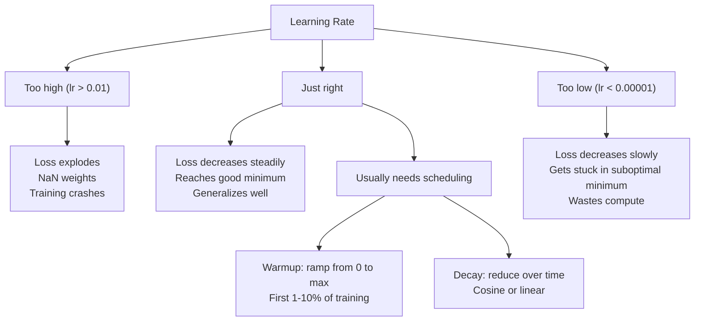
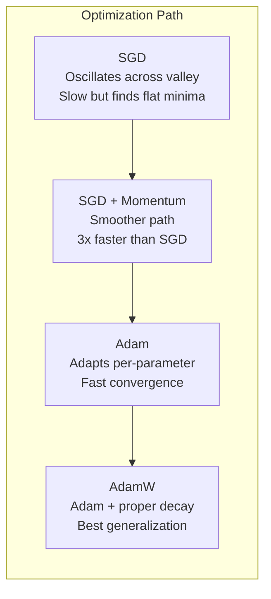
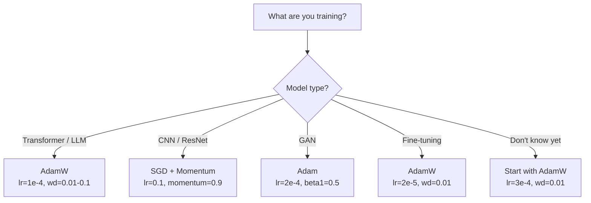

# 옵티마이저 (Optimizers)

> 경사 하강법(gradient descent)은 어느 방향으로 움직일지 알려 준다. 얼마나 멀리, 얼마나 빨리는 전혀 말해 주지 않는다. SGD는 나침반이다. Adam은 교통 데이터가 있는 GPS다.

**Type:** Build
**Languages:** Python
**Prerequisites:** Lesson 03.05 (Loss Functions)
**Time:** ~75분

## 학습 목표 (Learning Objectives)

- SGD, 모멘텀(momentum)을 가진 SGD, Adam, AdamW 옵티마이저(optimizer)를 Python으로 밑바닥부터 구현하기
- Adam의 편향 보정(bias correction)이 초기 학습 스텝에서 0으로 초기화된 모멘트 추정치를 어떻게 보상하는지 설명하기
- 같은 과제에서 AdamW가 왜 L2 정규화(regularization)를 쓴 Adam보다 더 나은 일반화를 만드는지 시연하기
- 트랜스포머(transformer), CNN, GAN, 파인튜닝(fine-tuning)에 맞는 적절한 옵티마이저와 기본 하이퍼파라미터(hyperparameter) 선택하기

## 문제 (The Problem)

당신은 그래디언트(gradient)를 계산했다. 손실(loss)을 줄이려면 가중치(weight) #4,721이 0.003만큼 줄어야 한다는 것을 안다. 그런데 0.003은 어떤 단위인가? 무엇으로 스케일된 것인가? 그리고 스텝 1에서 스텝 1,000과 같은 양만큼 움직여야 하는가?

순수 경사 하강법은 모든 스텝에서 모든 파라미터(parameter)에 같은 학습률(learning rate)을 적용한다: w = w - lr * gradient. 이는 실제로 신경망(neural network) 학습을 고통스럽게 만드는 세 가지 문제를 일으킨다.

첫째, 진동이다. 손실 지형(loss landscape)은 매끄러운 그릇 모양인 경우가 드물다. 그것은 길고 좁은 골짜기에 더 가깝다. 그래디언트는 골짜기를 가로지르는(가파른) 방향을 가리키지, 골짜기를 따라가는(완만한) 방향을 가리키지 않는다. 경사 하강법은 좁은 차원을 가로질러 앞뒤로 튕기면서 유용한 차원에서는 미미한 진전만 낸다. 당신은 이것을 본 적이 있다: 손실이 빠르게 떨어진 뒤 정체된다 -- 모델이 수렴(convergence)해서가 아니라 진동하고 있기 때문이다.

둘째, 모든 파라미터에 하나의 학습률은 잘못이다. 어떤 가중치는 큰 갱신이 필요하다(초기의 과소적합(underfitting) 단계에 있다). 다른 것들은 아주 작은 갱신이 필요하다(최적값 근처에 있다). 전자에 맞는 학습률은 후자를 망가뜨리고, 그 반대도 마찬가지다.

셋째, 안장점(saddle point)이다. 고차원에서 손실 지형은 그래디언트가 0에 가까운 광대한 평평한 영역을 가진다. 순수 SGD는 이 영역을 그래디언트의 속도로 기어가는데, 그 속도는 사실상 0이다. 모델은 멈춘 것처럼 보인다. 멈춘 게 아니다 -- 반대편에 유용한 하강이 있는 평평한 영역에 있는 것이다. 하지만 SGD는 뚫고 나갈 메커니즘이 없다.

Adam은 셋 다 해결한다. 파라미터마다 두 개의 이동 평균을 유지한다 -- 평균 그래디언트(모멘텀, 진동 처리)와 평균 제곱 그래디언트(적응적 학습률, 서로 다른 스케일 처리). 처음 몇 스텝에 대한 편향 보정과 결합하면, 기본 하이퍼파라미터로 80%의 문제에서 작동하는 단일 옵티마이저를 준다. 이 레슨은 그것을 밑바닥부터 만들어, 나머지 20%에서 언제 왜 실패하는지를 정확히 이해하게 한다.

## 개념 (The Concept)

### 확률적 경사 하강법 (Stochastic Gradient Descent, SGD)

가장 단순한 옵티마이저다. 미니배치(mini-batch)에서 그래디언트를 계산하고 반대 방향으로 한 스텝 나아간다.

```
w = w - lr * gradient
```

"확률적(stochastic)"이라는 말은 전체 데이터셋(dataset) 대신 데이터의 무작위 부분집합(미니배치)을 써서 그래디언트를 추정한다는 뜻이다. 이 노이즈는 사실 유용하다 -- 날카로운 지역 최솟값(local minima)을 탈출하는 데 도움을 준다. 하지만 노이즈는 진동도 일으킨다.

학습률이 유일한 손잡이다. 너무 높으면: 손실이 발산한다. 너무 낮으면: 학습이 끝없이 걸린다. 최적값은 아키텍처, 데이터, 배치(batch) 크기, 그리고 학습의 현재 단계에 달려 있다. 현대 신경망에서의 순수 SGD에 대해, 전형적인 값은 0.01에서 0.1 사이다. 하지만 단 한 번의 학습 실행 안에서도, 이상적인 학습률은 변한다.

### 모멘텀 (Momentum)

언덕을 굴러 내려가는 공 비유는 과하게 쓰이지만 정확하다. 그래디언트만으로 한 스텝 나아가는 대신, 과거 그래디언트를 누적하는 속도(velocity)를 유지한다.

```
m_t = beta * m_{t-1} + gradient
w = w - lr * m_t
```

베타(beta, 보통 0.9)는 얼마나 많은 이력을 유지할지를 제어한다. beta = 0.9일 때, 모멘텀은 대략 마지막 10개 그래디언트의 평균이다(1 / (1 - 0.9) = 10).

이것이 진동을 고치는 이유: 같은 방향을 가리키는 그래디언트는 누적된다. 방향을 뒤집는 그래디언트는 상쇄된다. 그 좁은 골짜기에서, "가로지르는" 성분은 매 스텝 부호를 뒤집어 감쇠된다. "따라가는" 성분은 일관되게 유지되어 증폭된다. 결과는 유용한 방향으로의 매끄러운 가속이다.

실제 숫자로: 조건이 나쁜 손실 지형에서 SGD 단독은 10,000 스텝이 걸릴 수 있다. 모멘텀을 가진 SGD(beta=0.9)는 같은 문제에서 보통 3,000-5,000 스텝이 걸린다. 그 속도 향상은 미미한 게 아니다.

### RMSProp

실제로 작동한 최초의 파라미터별 적응적 학습률 방법이다. Hinton이 Coursera 강의에서 제안했다(정식으로 출판된 적 없음).

```
s_t = beta * s_{t-1} + (1 - beta) * gradient^2
w = w - lr * gradient / (sqrt(s_t) + epsilon)
```

s_t는 제곱 그래디언트의 이동 평균을 추적한다. 일관되게 큰 그래디언트를 가진 파라미터는 큰 수로 나뉜다(더 작은 유효 학습률). 작은 그래디언트를 가진 파라미터는 작은 수로 나뉜다(더 큰 유효 학습률).

이것은 "모든 파라미터에 하나의 학습률" 문제를 해결한다. 이미 큰 갱신을 받아 온 가중치는 아마 목표 근처에 있다 -- 늦춰라. 아주 작은 갱신을 받아 온 가중치는 학습이 덜 된 것일 수 있다 -- 빠르게 하라.

엡실론(epsilon, 보통 1e-8)은 파라미터가 갱신되지 않았을 때 0으로 나누는 것을 막는다.

### Adam: 모멘텀 + RMSProp

Adam은 두 아이디어를 결합한다. 파라미터마다 두 개의 지수 이동 평균을 유지한다.

```
m_t = beta1 * m_{t-1} + (1 - beta1) * gradient        (first moment: mean)
v_t = beta2 * v_{t-1} + (1 - beta2) * gradient^2       (second moment: variance)
```

**편향 보정(bias correction)**은 대부분의 설명이 건너뛰는 핵심 세부 사항이다. 스텝 1에서, m_1 = (1 - beta1) * gradient. beta1 = 0.9일 때, 그것은 0.1 * gradient -- 열 배 너무 작다. 이동 평균이 아직 데워지지 않았다. 편향 보정이 이를 보상한다.

```
m_hat = m_t / (1 - beta1^t)
v_hat = v_t / (1 - beta2^t)
```

beta1 = 0.9인 스텝 1에서: m_hat = m_1 / (1 - 0.9) = m_1 / 0.1 = 실제 그래디언트. 스텝 100에서: (1 - 0.9^100)은 대략 1.0이므로, 보정이 사라진다. 편향 보정은 처음 ~10 스텝에 중요하고 ~50 스텝 이후로는 무관하다.

갱신은 이렇다.

```
w = w - lr * m_hat / (sqrt(v_hat) + epsilon)
```

Adam 기본값: lr = 0.001, beta1 = 0.9, beta2 = 0.999, epsilon = 1e-8. 이 기본값은 80%의 문제에서 작동한다. 안 될 때는, lr을 먼저 바꿔라. 그다음 beta2. beta1이나 epsilon은 거의 절대 바꾸지 마라.

### AdamW: 제대로 된 가중치 감쇠

L2 정규화는 손실에 lambda * w^2을 더한다. 순수 SGD에서는, 이것이 가중치 감쇠(weight decay, 매 스텝 가중치에서 lambda * w를 빼는 것)와 동등하다. Adam에서는, 이 동등성이 깨진다.

Loshchilov & Hutter의 통찰: 손실에 L2를 더한 뒤 Adam이 그래디언트를 처리하면, 적응적 학습률이 정규화 항도 스케일한다. 큰 그래디언트 분산을 가진 파라미터는 정규화를 덜 받는다. 작은 분산을 가진 파라미터는 더 받는다. 이것은 당신이 원하는 게 아니다 -- 그래디언트 통계와 무관하게 균일한 정규화를 원한다.

AdamW는 Adam 갱신 이후에 가중치 감쇠를 가중치에 직접 적용하여 이를 고친다.

```
w = w - lr * m_hat / (sqrt(v_hat) + epsilon) - lr * lambda * w
```

가중치 감쇠 항(lr * lambda * w)은 Adam의 적응적 인자로 스케일되지 않는다. 모든 파라미터가 같은 비례 수축을 받는다.

이것은 사소한 세부 사항처럼 보인다. 아니다. AdamW는 사실상 모든 과제에서 Adam + L2 정규화보다 더 나은 해로 수렴한다. 트랜스포머, 디퓨전(diffusion) 모델, 그리고 대부분의 현대 아키텍처를 학습하는 PyTorch의 기본 옵티마이저다. BERT, GPT, LLaMA, Stable Diffusion -- 모두 AdamW로 학습되었다.

### 학습률: 가장 중요한 하이퍼파라미터



하이퍼파라미터를 하나만 조정한다면, 학습률을 조정하라. 학습률의 10배 변화는 당신이 내릴 어떤 아키텍처 결정보다 더 중요하다. 흔한 기본값:

- SGD: lr = 0.01에서 0.1
- Adam/AdamW: lr = 1e-4에서 3e-4
- 사전 학습(pretrained)된 모델의 파인튜닝: lr = 1e-5에서 5e-5
- 학습률 웜업(warmup): 처음 1-10% 스텝에 걸친 선형 램프

### 옵티마이저 비교



### 각 옵티마이저가 이기는 때



## 직접 만들기 (Build It)

### 1단계: 순수 SGD

```python
class SGD:
    def __init__(self, lr=0.01):
        self.lr = lr

    def step(self, params, grads):
        for i in range(len(params)):
            params[i] -= self.lr * grads[i]
```

### 2단계: 모멘텀을 가진 SGD

```python
class SGDMomentum:
    def __init__(self, lr=0.01, beta=0.9):
        self.lr = lr
        self.beta = beta
        self.velocities = None

    def step(self, params, grads):
        if self.velocities is None:
            self.velocities = [0.0] * len(params)
        for i in range(len(params)):
            self.velocities[i] = self.beta * self.velocities[i] + grads[i]
            params[i] -= self.lr * self.velocities[i]
```

### 3단계: Adam

```python
import math

class Adam:
    def __init__(self, lr=0.001, beta1=0.9, beta2=0.999, epsilon=1e-8):
        self.lr = lr
        self.beta1 = beta1
        self.beta2 = beta2
        self.epsilon = epsilon
        self.m = None
        self.v = None
        self.t = 0

    def step(self, params, grads):
        if self.m is None:
            self.m = [0.0] * len(params)
            self.v = [0.0] * len(params)

        self.t += 1

        for i in range(len(params)):
            self.m[i] = self.beta1 * self.m[i] + (1 - self.beta1) * grads[i]
            self.v[i] = self.beta2 * self.v[i] + (1 - self.beta2) * grads[i] ** 2

            m_hat = self.m[i] / (1 - self.beta1 ** self.t)
            v_hat = self.v[i] / (1 - self.beta2 ** self.t)

            params[i] -= self.lr * m_hat / (math.sqrt(v_hat) + self.epsilon)
```

### 4단계: AdamW

```python
class AdamW:
    def __init__(self, lr=0.001, beta1=0.9, beta2=0.999, epsilon=1e-8, weight_decay=0.01):
        self.lr = lr
        self.beta1 = beta1
        self.beta2 = beta2
        self.epsilon = epsilon
        self.weight_decay = weight_decay
        self.m = None
        self.v = None
        self.t = 0

    def step(self, params, grads):
        if self.m is None:
            self.m = [0.0] * len(params)
            self.v = [0.0] * len(params)

        self.t += 1

        for i in range(len(params)):
            self.m[i] = self.beta1 * self.m[i] + (1 - self.beta1) * grads[i]
            self.v[i] = self.beta2 * self.v[i] + (1 - self.beta2) * grads[i] ** 2

            m_hat = self.m[i] / (1 - self.beta1 ** self.t)
            v_hat = self.v[i] / (1 - self.beta2 ** self.t)

            params[i] -= self.lr * m_hat / (math.sqrt(v_hat) + self.epsilon)
            params[i] -= self.lr * self.weight_decay * params[i]
```

### 5단계: 학습 비교

lesson 05의 원 데이터셋에 대해 같은 2층 신경망을 네 옵티마이저 모두로 학습시킨다. 수렴을 비교한다.

```python
import random

def sigmoid(x):
    x = max(-500, min(500, x))
    return 1.0 / (1.0 + math.exp(-x))

def make_circle_data(n=200, seed=42):
    random.seed(seed)
    data = []
    for _ in range(n):
        x = random.uniform(-2, 2)
        y = random.uniform(-2, 2)
        label = 1.0 if x * x + y * y < 1.5 else 0.0
        data.append(([x, y], label))
    return data


class OptimizerTestNetwork:
    def __init__(self, optimizer, hidden_size=8):
        random.seed(0)
        self.hidden_size = hidden_size
        self.optimizer = optimizer

        self.w1 = [[random.gauss(0, 0.5) for _ in range(2)] for _ in range(hidden_size)]
        self.b1 = [0.0] * hidden_size
        self.w2 = [random.gauss(0, 0.5) for _ in range(hidden_size)]
        self.b2 = 0.0

    def get_params(self):
        params = []
        for row in self.w1:
            params.extend(row)
        params.extend(self.b1)
        params.extend(self.w2)
        params.append(self.b2)
        return params

    def set_params(self, params):
        idx = 0
        for i in range(self.hidden_size):
            for j in range(2):
                self.w1[i][j] = params[idx]
                idx += 1
        for i in range(self.hidden_size):
            self.b1[i] = params[idx]
            idx += 1
        for i in range(self.hidden_size):
            self.w2[i] = params[idx]
            idx += 1
        self.b2 = params[idx]

    def forward(self, x):
        self.x = x
        self.z1 = []
        self.h = []
        for i in range(self.hidden_size):
            z = self.w1[i][0] * x[0] + self.w1[i][1] * x[1] + self.b1[i]
            self.z1.append(z)
            self.h.append(max(0.0, z))

        self.z2 = sum(self.w2[i] * self.h[i] for i in range(self.hidden_size)) + self.b2
        self.out = sigmoid(self.z2)
        return self.out

    def compute_grads(self, target):
        eps = 1e-15
        p = max(eps, min(1 - eps, self.out))
        d_loss = -(target / p) + (1 - target) / (1 - p)
        d_sigmoid = self.out * (1 - self.out)
        d_out = d_loss * d_sigmoid

        grads = [0.0] * (self.hidden_size * 2 + self.hidden_size + self.hidden_size + 1)
        idx = 0
        for i in range(self.hidden_size):
            d_relu = 1.0 if self.z1[i] > 0 else 0.0
            d_h = d_out * self.w2[i] * d_relu
            grads[idx] = d_h * self.x[0]
            grads[idx + 1] = d_h * self.x[1]
            idx += 2

        for i in range(self.hidden_size):
            d_relu = 1.0 if self.z1[i] > 0 else 0.0
            grads[idx] = d_out * self.w2[i] * d_relu
            idx += 1

        for i in range(self.hidden_size):
            grads[idx] = d_out * self.h[i]
            idx += 1

        grads[idx] = d_out
        return grads

    def train(self, data, epochs=300):
        losses = []
        for epoch in range(epochs):
            total_loss = 0.0
            correct = 0
            for x, y in data:
                pred = self.forward(x)
                grads = self.compute_grads(y)
                params = self.get_params()
                self.optimizer.step(params, grads)
                self.set_params(params)

                eps = 1e-15
                p = max(eps, min(1 - eps, pred))
                total_loss += -(y * math.log(p) + (1 - y) * math.log(1 - p))
                if (pred >= 0.5) == (y >= 0.5):
                    correct += 1
            avg_loss = total_loss / len(data)
            accuracy = correct / len(data) * 100
            losses.append((avg_loss, accuracy))
            if epoch % 75 == 0 or epoch == epochs - 1:
                print(f"    Epoch {epoch:3d}: loss={avg_loss:.4f}, accuracy={accuracy:.1f}%")
        return losses
```

## 라이브러리로 써보기 (Use It)

PyTorch 옵티마이저는 파라미터 그룹, 그래디언트 클리핑(gradient clipping), 학습률 스케줄링을 다룬다.

```python
import torch
import torch.optim as optim

model = torch.nn.Sequential(
    torch.nn.Linear(784, 256),
    torch.nn.ReLU(),
    torch.nn.Linear(256, 10),
)

optimizer = optim.AdamW(model.parameters(), lr=3e-4, weight_decay=0.01)

scheduler = optim.lr_scheduler.CosineAnnealingLR(optimizer, T_max=100)

for epoch in range(100):
    optimizer.zero_grad()
    output = model(torch.randn(32, 784))
    loss = torch.nn.functional.cross_entropy(output, torch.randint(0, 10, (32,)))
    loss.backward()
    torch.nn.utils.clip_grad_norm_(model.parameters(), max_norm=1.0)
    optimizer.step()
    scheduler.step()
```

패턴은 언제나: zero_grad, forward, loss, backward, (clip), step, (schedule). 이 순서를 외워라. 틀리면(예: optimizer.step() 전에 scheduler.step()을 호출하면) 미묘한 버그의 흔한 원인이 된다.

CNN의 경우, 많은 실무자들은 여전히 모멘텀을 가진 SGD(lr=0.1, momentum=0.9, weight_decay=1e-4)에 스텝이나 코사인 스케줄을 곁들인 것을 선호한다. SGD는 더 평평한 최솟값을 찾는데, 이는 종종 더 잘 일반화한다. 트랜스포머와 LLM의 경우, 웜업 + 코사인 감쇠를 가진 AdamW가 보편적인 기본값이다. 측정된 이유 없이 합의에 맞서지 마라.

## 산출물 (Ship It)

이 레슨은 다음을 산출한다.
- `outputs/prompt-optimizer-selector.md` -- 어떤 아키텍처에든 올바른 옵티마이저와 학습률을 고르기 위한 결정 프롬프트

## 연습 문제 (Exercises)

1. 현재 위치 대신 "미리보기(lookahead)" 위치(w - lr * beta * v)에서 그래디언트를 계산하는 Nesterov 모멘텀을 구현하라. 원 데이터셋에서 표준 모멘텀과 수렴을 비교하라.

2. 학습률 웜업 스케줄을 구현하라: 처음 10% 학습 스텝에 걸쳐 0에서 max_lr로 선형 램프한 뒤, 0으로 코사인 감쇠한다. Adam + 웜업 대 웜업 없는 Adam으로 학습하라. 원 데이터셋에서 90% 정확도에 도달하는 데 몇 에폭이 걸리는지 측정하라.

3. Adam 학습 중 각 파라미터의 유효 학습률을 추적하라. 유효 학습률은 lr * m_hat / (sqrt(v_hat) + eps)다. 10, 50, 200 스텝 후 유효 학습률의 분포를 그려라. 모든 파라미터가 같은 속도로 갱신되고 있는가?

4. 그래디언트 클리핑(전역 노름으로 클리핑)을 구현하라. 최대 그래디언트 노름을 1.0으로 설정하라. 높은 학습률(Adam의 경우 lr=0.01)을 써서 클리핑이 있을 때와 없을 때로 학습하라. 10개의 무작위 시드에 걸쳐 클리핑이 있을 때와 없을 때 몇 번의 실행이 발산하는지(손실이 NaN이 되는지) 세어라.

5. 큰 가중치를 가진 신경망에서 Adam 대 AdamW를 비교하라. 모든 가중치를 [-5, 5] 범위의 무작위 값(보통보다 훨씬 큰)으로 초기화하라. weight_decay=0.1로 200 에폭 학습하라. 두 옵티마이저에 대해 학습 동안 가중치의 L2 노름을 그려라. AdamW가 더 빠른 가중치 수축을 보여야 한다.

## 핵심 용어 (Key Terms)

| 용어 | 흔히 하는 말 | 실제 의미 |
|------|----------------|----------------------|
| 학습률(Learning rate) | "스텝 크기" | 그래디언트 갱신에 대한 스칼라 승수; 학습에서 가장 영향력 큰 단일 하이퍼파라미터 |
| SGD | "기본 경사 하강법" | 확률적 경사 하강법: 미니배치에서 계산된 lr * gradient를 빼서 가중치를 갱신함 |
| 모멘텀(Momentum) | "굴러가는 공 비유" | 과거 그래디언트의 지수 이동 평균; 진동을 감쇠하고 일관된 방향을 가속함 |
| RMSProp | "적응적 학습률" | 각 파라미터의 그래디언트를 최근 그래디언트의 RMS 이동 평균으로 나눔; 학습률을 균등화함 |
| Adam | "기본 옵티마이저" | 모멘텀(1차 모멘트)과 RMSProp(2차 모멘트)을 초기 스텝의 편향 보정과 함께 결합함 |
| AdamW | "제대로 된 Adam" | 분리된 가중치 감쇠를 가진 Adam; 그래디언트가 아니라 가중치에 직접 정규화를 적용함 |
| 편향 보정(Bias correction) | "이동 평균을 위한 웜업" | Adam 모멘트 추정치의 0-초기화를 보상하기 위해 (1 - beta^t)로 나눔 |
| 가중치 감쇠(Weight decay) | "가중치를 줄이기" | 매 스텝 가중치 값의 일부를 뺌; 큰 가중치를 벌하는 정규화기 |
| 학습률 스케줄(Learning rate schedule) | "시간에 따라 lr 변경" | 학습 동안 학습률을 조정하는 함수; 웜업 + 코사인 감쇠가 현대의 기본값 |
| 그래디언트 클리핑(Gradient clipping) | "그래디언트 노름 제한" | 그래디언트 벡터의 노름이 임계값을 초과할 때 축소함; 그래디언트 폭발 갱신을 막음 |

## 더 읽을거리 (Further Reading)

- Kingma & Ba, "Adam: A Method for Stochastic Optimization" (2014) -- 수렴 분석과 편향 보정 유도를 담은 원조 Adam 논문
- Loshchilov & Hutter, "Decoupled Weight Decay Regularization" (2017) -- Adam에서 L2 정규화와 가중치 감쇠가 동등하지 않음을 증명하고 AdamW를 제안함
- Smith, "Cyclical Learning Rates for Training Neural Networks" (2017) -- 고정 학습률 조정의 필요성을 없애는 LR 범위 테스트와 순환 스케줄을 도입함
- Ruder, "An Overview of Gradient Descent Optimization Algorithms" (2016) -- 명료한 비교와 직관을 담은, 모든 옵티마이저 변형에 대한 최고의 단일 개관
