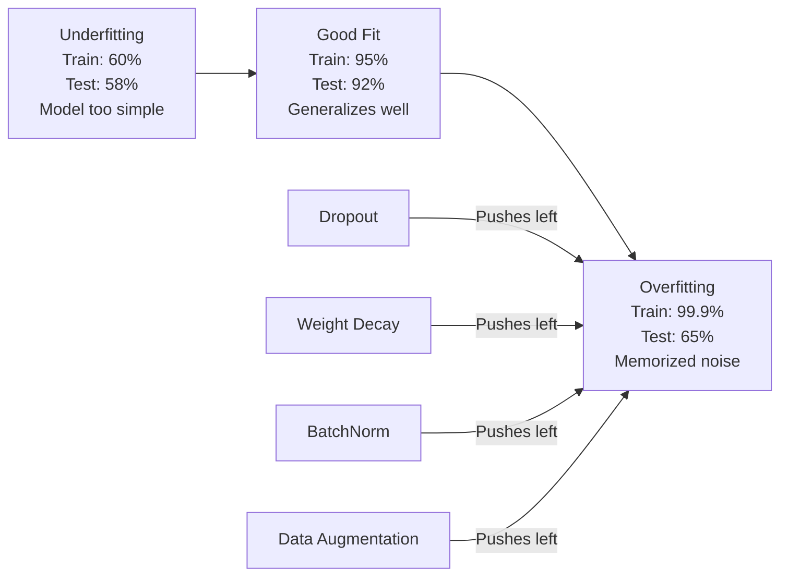
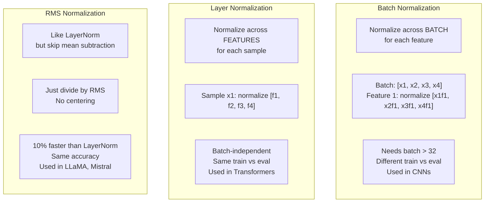
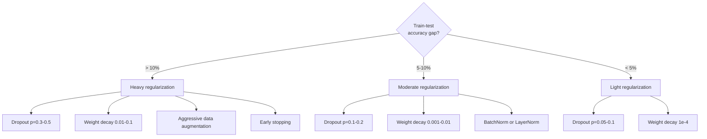

# 정규화 (Regularization)

> 당신의 모델이 학습 데이터에서 99%, 테스트 데이터에서 60%를 받는다. 학습한 게 아니라 암기한 것이다. 정규화(regularization)는 일반화를 강제하기 위해 복잡도에 부과하는 세금이다.

**Type:** Build
**Languages:** Python
**Prerequisites:** Lesson 03.06 (Optimizers)
**Time:** ~75분

## 학습 목표 (Learning Objectives)

- 역스케일링(inverted scaling)을 가진 드롭아웃(dropout), L2 가중치 감쇠(weight decay), 배치 정규화(batch normalization), 층 정규화(layer normalization), RMSNorm을 밑바닥부터 구현하기
- 학습-테스트 정확도 격차를 측정하고 정규화 실험으로 과적합(overfitting)을 진단하기
- 왜 트랜스포머(transformer)가 BatchNorm 대신 LayerNorm을 쓰는지, 왜 현대 LLM이 RMSNorm을 선호하는지 설명하기
- 과적합의 심각도에 따라 올바른 정규화 기법 조합을 적용하기

## 문제 (The Problem)

충분한 파라미터(parameter)를 가진 신경망(neural network)은 어떤 데이터셋(dataset)이든 암기할 수 있다. 이것은 가정이 아니다 -- Zhang 등(2017)은 ImageNet에 무작위 레이블(label)을 붙여 표준 신경망을 학습시켜 이를 증명했다. 신경망은 완전히 무작위한 레이블 배정에서 거의 0에 가까운 학습 손실(loss)에 도달했다. 학습할 패턴이 없는 백만 개의 무작위 입력-출력 쌍을 암기한 것이다. 학습 손실은 완벽했다. 테스트 정확도는 0이었다.

이것이 과적합 문제이며, 모델이 커질수록 더 나빠진다. GPT-3는 1,750억 개의 파라미터를 가진다. 학습 집합은 약 5,000억 개의 토큰(token)을 가진다. 그렇게 많은 파라미터로, 모델은 학습 데이터의 상당 부분을 토씨 하나 안 틀리고 암기할 용량이 있다. 정규화가 없으면, 일반화 가능한 패턴을 학습하는 대신 그냥 학습 예제를 토해 낼 것이다.

학습 성능과 테스트 성능 사이의 격차가 과적합 격차(overfitting gap)다. 이 레슨의 모든 기법은 그 격차를 서로 다른 각도에서 공략한다. 드롭아웃은 신경망이 어떤 단일 뉴런(neuron)에도 의존하지 않게 만든다. 가중치 감쇠는 어떤 단일 가중치(weight)도 너무 커지지 않게 막는다. 배치 정규화는 손실 지형(loss landscape)을 매끄럽게 만들어 옵티마이저(optimizer)가 더 평평하고 더 일반화 가능한 최솟값을 찾게 한다. 층 정규화는 같은 일을 하지만 배치 정규화가 실패하는 곳(작은 배치, 가변 길이 시퀀스)에서 작동한다. RMSNorm은 평균 계산을 빼서 10% 더 빠르게 그것을 한다. 각 기법은 단순하다. 함께 쓰면, 암기하는 모델과 일반화하는 모델의 차이가 된다.

## 개념 (The Concept)

### 과적합 스펙트럼

모든 모델은 과소적합(underfitting, 패턴을 포착하기에 너무 단순)에서 과적합(노이즈를 포착할 만큼 복잡)까지의 스펙트럼 어딘가에 놓인다. 최적 지점은 그 사이에 있고, 정규화는 모델을 과적합 쪽에서 그쪽으로 민다.



### 드롭아웃 (Dropout)

가장 단순한 정규화 기법이면서 가장 우아한 해석을 가진다. 학습 중에, 각 뉴런의 출력을 확률 p로 무작위하게 0으로 설정한다.

```
output = activation(z) * mask    where mask[i] ~ Bernoulli(1 - p)
```

p = 0.5일 때, 매 순방향 패스(forward pass)에서 뉴런의 절반이 0이 된다. 신경망은 어떤 뉴런이 사용 가능할지 예측할 수 없으므로 중복된 표현을 학습해야 한다. 이것은 공동 적응(co-adaptation) -- 뉴런들이 특정 다른 뉴런들의 존재에 의존하는 법을 배우는 것 -- 을 막는다.

앙상블 해석: N개의 뉴런과 드롭아웃을 가진 신경망은 2^N개의 가능한 부분 신경망(어떤 뉴런이 켜지거나 꺼지는 모든 조합)을 만든다. 드롭아웃으로 학습하는 것은 대략 2^N개의 부분 신경망을 동시에, 각각 다른 미니배치(mini-batch)에서 학습하는 것이다. 테스트 시에는, 모든 뉴런을 쓰고(드롭아웃 없음) 학습 중의 기댓값에 맞추기 위해 출력을 (1 - p)로 스케일한다. 이것은 2^N개의 부분 신경망의 예측을 평균하는 것과 동등하다 -- 단일 모델에서 나온 거대한 앙상블이다.

실제로는, 스케일링이 테스트가 아니라 학습 중에 적용된다(역드롭아웃(inverted dropout)).

```
During training:  output = activation(z) * mask / (1 - p)
During testing:   output = activation(z)   (no change needed)
```

이것이 더 깔끔한데, 테스트 코드가 드롭아웃에 대해 전혀 알 필요가 없기 때문이다.

기본 비율: 트랜스포머는 p = 0.1, MLP는 p = 0.5, CNN은 p = 0.2-0.3. 더 높은 드롭아웃 = 더 강한 정규화 = 더 큰 과소적합 위험.

### 가중치 감쇠 (Weight Decay, L2 정규화)

모든 가중치의 제곱 크기를 손실에 더한다.

```
total_loss = task_loss + (lambda / 2) * sum(w_i^2)
```

정규화 항의 그래디언트(gradient)는 lambda * w다. 이는 매 스텝마다 각 가중치가 그 크기에 비례하는 분량만큼 0 쪽으로 수축한다는 뜻이다. 큰 가중치는 더 벌받는다. 모델은 어떤 단일 가중치도 지배하지 않는 해 쪽으로 밀린다.

이것이 일반화를 돕는 이유: 과적합된 모델은 학습 데이터의 노이즈를 증폭하는 큰 가중치를 갖는 경향이 있다. 가중치 감쇠는 가중치를 작게 유지하여, 모델의 유효 용량을 제한하고 암기된 잔재가 아니라 견고하고 일반화 가능한 특성(feature)에 의존하도록 강제한다.

lambda 하이퍼파라미터(hyperparameter)가 강도를 제어한다. 전형적인 값:

- 트랜스포머의 AdamW에는 0.01
- CNN의 SGD에는 1e-4
- 심하게 과적합된 모델에는 0.1

lesson 06에서 논의했듯이: 가중치 감쇠와 L2 정규화는 SGD에서는 동등하지만 Adam에서는 그렇지 않다. Adam으로 학습할 때는 항상 AdamW(분리된 가중치 감쇠)를 써라.

### 배치 정규화 (Batch Normalization)

각 층(layer)의 출력을 다음 층으로 넘기기 전에 미니배치 전체에 걸쳐 정규화한다.

어떤 층에서의 활성값(activation) 미니배치에 대해:

```
mu = (1/B) * sum(x_i)           (batch mean)
sigma^2 = (1/B) * sum((x_i - mu)^2)   (batch variance)
x_hat = (x_i - mu) / sqrt(sigma^2 + eps)   (normalize)
y = gamma * x_hat + beta        (scale and shift)
```

감마(gamma)와 베타(beta)는 학습 가능한 파라미터로, 그것이 최적이라면 신경망이 정규화를 되돌릴 수 있게 해 준다. 그것들이 없으면, 모든 층의 출력을 평균 0, 분산 1로 강제하게 되는데, 이는 신경망이 원하는 것이 아닐 수 있다.

**학습 대 추론의 분리:** 학습 중에는, mu와 sigma가 현재 미니배치에서 온다. 추론(inference) 중에는, 학습 중에 누적된 이동 평균(running average, 모멘텀(momentum) = 0.1인 지수 이동 평균, 즉 옛것 90% + 새것 10%)을 쓴다.

BatchNorm이 왜 작동하는지는 여전히 논쟁 중이다. 원조 논문은 "내부 공변량 이동(internal covariate shift)"(앞쪽 층이 갱신되면서 층 입력의 분포가 변하는 것)을 줄인다고 주장했다. Santurkar 등(2018)은 이 설명이 틀렸음을 보였다. 실제 이유는: BatchNorm이 손실 지형을 더 매끄럽게 만든다는 것이다. 그래디언트가 더 예측적이고, 립시츠 상수(Lipschitz constant)가 더 작으며, 옵티마이저가 안전하게 더 큰 스텝을 밟을 수 있다. 이것이 BatchNorm이 더 높은 학습률(learning rate)을 쓰고 더 빠르게 수렴(convergence)하게 하는 이유다.

BatchNorm에는 근본적인 한계가 있다: 배치 통계량에 의존한다. 배치 크기가 1이면, 평균과 분산이 무의미하다. 작은 배치(< 32)에서는, 통계량이 노이지하고 성능을 해친다. 이것은 객체 탐지(메모리가 배치 크기를 제한하는)나 언어 모델링(시퀀스 길이가 변하는) 같은 과제에 중요하다.

### 층 정규화 (Layer Normalization)

배치 전체 대신 특성 전체에 걸쳐 정규화한다. 단일 샘플에 대해:

```
mu = (1/D) * sum(x_j)           (feature mean)
sigma^2 = (1/D) * sum((x_j - mu)^2)   (feature variance)
x_hat = (x_j - mu) / sqrt(sigma^2 + eps)
y = gamma * x_hat + beta
```

D는 특성 차원이다. 각 샘플이 독립적으로 정규화된다 -- 배치 크기에 의존하지 않는다. 이것이 트랜스포머가 BatchNorm 대신 LayerNorm을 쓰는 이유다. 시퀀스는 가변 길이를 가지고, 배치 크기는 종종 작으며(생성 중에는 1), 계산이 학습과 추론 사이에서 동일하다.

트랜스포머의 LayerNorm은 각 셀프 어텐션(self-attention) 블록과 각 피드포워드 블록 이후에(Post-LN), 또는 그 이전에(Pre-LN, 학습에 더 안정적임) 적용된다.

### RMSNorm

평균 빼기가 없는 LayerNorm이다. Zhang & Sennrich(2019)가 제안했다.

```
rms = sqrt((1/D) * sum(x_j^2))
y = gamma * x / rms
```

그게 전부다. 평균 계산도, beta 파라미터도 없다. 관찰은 이렇다: LayerNorm에서의 재중심화(re-centering, 평균 빼기)는 모델 성능에 거의 기여하지 않지만, 계산을 소모한다. 그것을 제거하면 약 10% 적은 오버헤드로 같은 정확도를 준다.

LLaMA, LLaMA 2, LLaMA 3, Mistral, 그리고 대부분의 현대 LLM은 LayerNorm 대신 RMSNorm을 쓴다. 수십억 개의 파라미터와 수조 개의 토큰 규모에서, 그 10% 절약은 상당하다.

### 정규화 비교



### 정규화로서의 데이터 증강 (Data Augmentation)

모델 수정이 아니라 데이터 수정이다. 레이블을 보존하면서 학습 입력을 변환한다.

- 이미지: 무작위 자르기, 뒤집기, 회전, 색 지터, 컷아웃(cutout)
- 텍스트: 동의어 치환, 역번역(back-translation), 무작위 삭제
- 오디오: 시간 늘이기, 음높이 이동, 노이즈 추가

효과는 정규화와 동일하다: 학습 집합의 유효 크기를 늘려, 모델이 특정 예제를 암기하기 더 어렵게 만든다. 각 이미지를 원래 형태로 한 번만 보는 모델은 그것을 암기할 수 있다. 각 이미지의 50개 증강 버전을 보는 모델은 불변(invariant) 구조를 학습하도록 강제된다.

### 조기 종료 (Early Stopping)

가장 단순한 정규화기다: 검증 손실이 증가하기 시작하면 학습을 멈춘다. 그 시점에 모델은 아직 과적합되지 않았다. 실제로는, 에폭(epoch)마다 검증 손실을 추적하고, 최선의 모델을 저장하며, "인내(patience)" 구간(보통 5-20 에폭) 동안 학습을 계속한다. 인내 구간 안에 검증 손실이 개선되지 않으면, 멈추고 저장된 최선의 모델을 불러온다.

### 언제 무엇을 적용할까



## 직접 만들기 (Build It)

### 1단계: 드롭아웃 (학습 및 평가 모드)

```python
import random
import math


class Dropout:
    def __init__(self, p=0.5):
        self.p = p
        self.training = True
        self.mask = None

    def forward(self, x):
        if not self.training:
            return list(x)
        self.mask = []
        output = []
        for val in x:
            if random.random() < self.p:
                self.mask.append(0)
                output.append(0.0)
            else:
                self.mask.append(1)
                output.append(val / (1 - self.p))
        return output

    def backward(self, grad_output):
        grads = []
        for g, m in zip(grad_output, self.mask):
            if m == 0:
                grads.append(0.0)
            else:
                grads.append(g / (1 - self.p))
        return grads
```

### 2단계: L2 가중치 감쇠

```python
def l2_regularization(weights, lambda_reg):
    penalty = 0.0
    for w in weights:
        penalty += w * w
    return lambda_reg * 0.5 * penalty

def l2_gradient(weights, lambda_reg):
    return [lambda_reg * w for w in weights]
```

### 3단계: 배치 정규화

```python
class BatchNorm:
    def __init__(self, num_features, momentum=0.1, eps=1e-5):
        self.gamma = [1.0] * num_features
        self.beta = [0.0] * num_features
        self.eps = eps
        self.momentum = momentum
        self.running_mean = [0.0] * num_features
        self.running_var = [1.0] * num_features
        self.training = True
        self.num_features = num_features

    def forward(self, batch):
        batch_size = len(batch)
        if self.training:
            mean = [0.0] * self.num_features
            for sample in batch:
                for j in range(self.num_features):
                    mean[j] += sample[j]
            mean = [m / batch_size for m in mean]

            var = [0.0] * self.num_features
            for sample in batch:
                for j in range(self.num_features):
                    var[j] += (sample[j] - mean[j]) ** 2
            var = [v / batch_size for v in var]

            for j in range(self.num_features):
                self.running_mean[j] = (1 - self.momentum) * self.running_mean[j] + self.momentum * mean[j]
                self.running_var[j] = (1 - self.momentum) * self.running_var[j] + self.momentum * var[j]
        else:
            mean = list(self.running_mean)
            var = list(self.running_var)

        self.x_hat = []
        output = []
        for sample in batch:
            normalized = []
            out_sample = []
            for j in range(self.num_features):
                x_h = (sample[j] - mean[j]) / math.sqrt(var[j] + self.eps)
                normalized.append(x_h)
                out_sample.append(self.gamma[j] * x_h + self.beta[j])
            self.x_hat.append(normalized)
            output.append(out_sample)
        return output
```

### 4단계: 층 정규화

```python
class LayerNorm:
    def __init__(self, num_features, eps=1e-5):
        self.gamma = [1.0] * num_features
        self.beta = [0.0] * num_features
        self.eps = eps
        self.num_features = num_features

    def forward(self, x):
        mean = sum(x) / len(x)
        var = sum((xi - mean) ** 2 for xi in x) / len(x)

        self.x_hat = []
        output = []
        for j in range(self.num_features):
            x_h = (x[j] - mean) / math.sqrt(var + self.eps)
            self.x_hat.append(x_h)
            output.append(self.gamma[j] * x_h + self.beta[j])
        return output
```

### 5단계: RMSNorm

```python
class RMSNorm:
    def __init__(self, num_features, eps=1e-6):
        self.gamma = [1.0] * num_features
        self.eps = eps
        self.num_features = num_features

    def forward(self, x):
        rms = math.sqrt(sum(xi * xi for xi in x) / len(x) + self.eps)
        output = []
        for j in range(self.num_features):
            output.append(self.gamma[j] * x[j] / rms)
        return output
```

### 6단계: 정규화가 있을 때와 없을 때의 학습

```python
def sigmoid(x):
    x = max(-500, min(500, x))
    return 1.0 / (1.0 + math.exp(-x))


def make_circle_data(n=200, seed=42):
    random.seed(seed)
    data = []
    for _ in range(n):
        x = random.uniform(-2, 2)
        y = random.uniform(-2, 2)
        label = 1.0 if x * x + y * y < 1.5 else 0.0
        data.append(([x, y], label))
    return data


class RegularizedNetwork:
    def __init__(self, hidden_size=16, lr=0.05, dropout_p=0.0, weight_decay=0.0):
        random.seed(0)
        self.hidden_size = hidden_size
        self.lr = lr
        self.dropout_p = dropout_p
        self.weight_decay = weight_decay
        self.dropout = Dropout(p=dropout_p) if dropout_p > 0 else None

        self.w1 = [[random.gauss(0, 0.5) for _ in range(2)] for _ in range(hidden_size)]
        self.b1 = [0.0] * hidden_size
        self.w2 = [random.gauss(0, 0.5) for _ in range(hidden_size)]
        self.b2 = 0.0

    def forward(self, x, training=True):
        self.x = x
        self.z1 = []
        self.h = []
        for i in range(self.hidden_size):
            z = self.w1[i][0] * x[0] + self.w1[i][1] * x[1] + self.b1[i]
            self.z1.append(z)
            self.h.append(max(0.0, z))

        if self.dropout and training:
            self.dropout.training = True
            self.h = self.dropout.forward(self.h)
        elif self.dropout:
            self.dropout.training = False
            self.h = self.dropout.forward(self.h)

        self.z2 = sum(self.w2[i] * self.h[i] for i in range(self.hidden_size)) + self.b2
        self.out = sigmoid(self.z2)
        return self.out

    def backward(self, target):
        eps = 1e-15
        p = max(eps, min(1 - eps, self.out))
        d_loss = -(target / p) + (1 - target) / (1 - p)
        d_sigmoid = self.out * (1 - self.out)
        d_out = d_loss * d_sigmoid

        for i in range(self.hidden_size):
            d_relu = 1.0 if self.z1[i] > 0 else 0.0
            d_h = d_out * self.w2[i] * d_relu
            self.w2[i] -= self.lr * (d_out * self.h[i] + self.weight_decay * self.w2[i])
            for j in range(2):
                self.w1[i][j] -= self.lr * (d_h * self.x[j] + self.weight_decay * self.w1[i][j])
            self.b1[i] -= self.lr * d_h
        self.b2 -= self.lr * d_out

    def evaluate(self, data):
        correct = 0
        total_loss = 0.0
        for x, y in data:
            pred = self.forward(x, training=False)
            eps = 1e-15
            p = max(eps, min(1 - eps, pred))
            total_loss += -(y * math.log(p) + (1 - y) * math.log(1 - p))
            if (pred >= 0.5) == (y >= 0.5):
                correct += 1
        return total_loss / len(data), correct / len(data) * 100

    def train_model(self, train_data, test_data, epochs=300):
        history = []
        for epoch in range(epochs):
            total_loss = 0.0
            correct = 0
            for x, y in train_data:
                pred = self.forward(x, training=True)
                self.backward(y)
                eps = 1e-15
                p = max(eps, min(1 - eps, pred))
                total_loss += -(y * math.log(p) + (1 - y) * math.log(1 - p))
                if (pred >= 0.5) == (y >= 0.5):
                    correct += 1
            train_loss = total_loss / len(train_data)
            train_acc = correct / len(train_data) * 100
            test_loss, test_acc = self.evaluate(test_data)
            history.append((train_loss, train_acc, test_loss, test_acc))
            if epoch % 75 == 0 or epoch == epochs - 1:
                gap = train_acc - test_acc
                print(f"    Epoch {epoch:3d}: train_acc={train_acc:.1f}%, test_acc={test_acc:.1f}%, gap={gap:.1f}%")
        return history
```

## 라이브러리로 써보기 (Use It)

PyTorch는 모든 정규화와 규제를 모듈로 제공한다.

```python
import torch
import torch.nn as nn

model = nn.Sequential(
    nn.Linear(784, 256),
    nn.BatchNorm1d(256),
    nn.ReLU(),
    nn.Dropout(0.3),
    nn.Linear(256, 128),
    nn.BatchNorm1d(128),
    nn.ReLU(),
    nn.Dropout(0.3),
    nn.Linear(128, 10),
)

model.train()
out_train = model(torch.randn(32, 784))

model.eval()
out_test = model(torch.randn(1, 784))
```

`model.train()` / `model.eval()` 토글이 결정적이다. 드롭아웃을 켜고/끄며, BatchNorm에게 배치 통계량과 이동 통계량 중 무엇을 쓸지 알려 준다. 추론 전에 `model.eval()`을 잊는 것은 딥러닝에서 가장 흔한 버그 중 하나다. 드롭아웃이 여전히 활성화되어 있고 BatchNorm이 미니배치 통계량을 쓰기 때문에 테스트 정확도가 무작위로 요동칠 것이다.

트랜스포머의 경우, 패턴이 다르다.

```python
class TransformerBlock(nn.Module):
    def __init__(self, d_model=512, nhead=8, dropout=0.1):
        super().__init__()
        self.attention = nn.MultiheadAttention(d_model, nhead, dropout=dropout)
        self.norm1 = nn.LayerNorm(d_model)
        self.ff = nn.Sequential(
            nn.Linear(d_model, d_model * 4),
            nn.GELU(),
            nn.Linear(d_model * 4, d_model),
            nn.Dropout(dropout),
        )
        self.norm2 = nn.LayerNorm(d_model)
        self.dropout = nn.Dropout(dropout)

    def forward(self, x):
        attended, _ = self.attention(x, x, x)
        x = self.norm1(x + self.dropout(attended))
        x = self.norm2(x + self.ff(x))
        return x
```

BatchNorm이 아니라 LayerNorm이다. p=0.5가 아니라 드롭아웃 p=0.1이다. 이것이 트랜스포머 기본값이다.

## 산출물 (Ship It)

이 레슨은 다음을 산출한다.
- `outputs/prompt-regularization-advisor.md` -- 과적합을 진단하고 올바른 정규화 전략을 추천하는 프롬프트

## 연습 문제 (Exercises)

1. 2차원 데이터를 위한 공간적 드롭아웃(spatial dropout)을 구현하라: 개별 뉴런을 떨어뜨리는 대신, 전체 특성 채널을 떨어뜨린다. 연속된 특성 그룹을 채널로 취급하고 전체 그룹을 떨어뜨려 이를 시뮬레이션하라. hidden_size=32인 원 데이터셋에서 표준 드롭아웃과 학습-테스트 격차를 비교하라.

2. lesson 05의 레이블 스무딩(label smoothing)을 이 레슨의 드롭아웃과 결합하여 구현하라. 네 가지 구성으로 학습하라: 둘 다 없음, 드롭아웃만, 레이블 스무딩만, 둘 다. 각각의 최종 학습-테스트 정확도 격차를 측정하라. 어느 조합이 가장 작은 격차를 주는가?

3. 원-데이터셋 신경망에서 은닉층과 활성화 사이에 BatchNorm 층을 추가하라. 학습률 0.01, 0.05, 0.1에서 BatchNorm이 있을 때와 없을 때로 학습하라. BatchNorm은 순수 신경망이 발산하는 더 높은 학습률에서 안정적인 학습을 허용해야 한다.

4. 조기 종료를 구현하라: 에폭마다 테스트 손실을 추적하고, 최선의 가중치를 저장하며, 테스트 손실이 20 에폭 동안 개선되지 않으면 멈춘다. 정규화된 신경망을 1000 에폭 동안 실행하라. 어느 에폭이 최선의 테스트 정확도를 가졌는지, 그리고 몇 에폭의 계산을 절약했는지 보고하라.

5. 4층 신경망(2층이 아니라)에서 LayerNorm 대 RMSNorm을 비교하라. 둘을 같은 가중치로 초기화하라. 200 에폭 학습하고 최종 정확도, 학습 속도(에폭당 시간), 첫 번째 층에서의 그래디언트 크기를 비교하라. RMSNorm이 같은 정확도로 더 빠른지 검증하라.

## 핵심 용어 (Key Terms)

| 용어 | 흔히 하는 말 | 실제 의미 |
|------|----------------|----------------------|
| 과적합(Overfitting) | "모델이 데이터를 암기했다" | 모델의 학습 성능이 테스트 성능을 크게 능가할 때, 신호가 아니라 노이즈를 학습했음을 나타냄 |
| 정규화(Regularization) | "과적합 방지" | 일반화를 개선하기 위해 모델 복잡도를 제약하는 모든 기법: 드롭아웃, 가중치 감쇠, 정규화, 증강 |
| 드롭아웃(Dropout) | "무작위 뉴런 삭제" | 학습 중 확률 p로 무작위 뉴런을 0으로 만들어 중복 표현을 강제함; 앙상블을 학습하는 것과 동등 |
| 가중치 감쇠(Weight decay) | "L2 페널티" | 매 스텝 lambda * w를 빼서 모든 가중치를 0 쪽으로 수축함; 가중치 크기를 통해 복잡도를 벌함 |
| 배치 정규화(Batch normalization) | "배치별 정규화" | 학습 중 배치 통계량을, 추론 중 이동 평균을 써서 층 출력을 배치 차원에 걸쳐 정규화함 |
| 층 정규화(Layer normalization) | "샘플별 정규화" | 각 샘플 내 특성에 걸쳐 정규화함; 배치 독립적이며, 배치 크기가 변하는 트랜스포머에서 사용됨 |
| RMSNorm | "평균 없는 LayerNorm" | 제곱평균제곱근 정규화; LayerNorm에서 평균 빼기를 제거하여 같은 정확도로 10% 속도 향상 |
| 조기 종료(Early stopping) | "과적합 전에 멈추기" | 검증 손실이 개선을 멈추면 학습을 중단함; 가장 단순한 정규화기로, 종종 다른 것들과 함께 쓰임 |
| 데이터 증강(Data augmentation) | "적은 데이터에서 더 많은 데이터" | 학습 입력을 변환(뒤집기, 자르기, 노이즈)하여 유효 데이터셋 크기를 늘리고 불변 학습을 강제함 |
| 일반화 격차(Generalization gap) | "학습-테스트 격차" | 학습 성능과 테스트 성능의 차이; 정규화는 이 격차를 최소화하는 것을 목표로 함 |

## 더 읽을거리 (Further Reading)

- Srivastava et al., "Dropout: A Simple Way to Prevent Neural Networks from Overfitting" (2014) -- 앙상블 해석과 광범위한 실험을 담은 원조 드롭아웃 논문
- Ioffe & Szegedy, "Batch Normalization: Accelerating Deep Network Training by Reducing Internal Covariate Shift" (2015) -- BatchNorm과 그 학습 절차를 도입한, 가장 많이 인용된 딥러닝 논문 중 하나
- Zhang & Sennrich, "Root Mean Square Layer Normalization" (2019) -- RMSNorm이 줄어든 계산으로 LayerNorm 정확도와 맞먹음을 보임; LLaMA와 Mistral이 채택함
- Zhang et al., "Understanding Deep Learning Requires Rethinking Generalization" (2017) -- 신경망이 무작위 레이블을 암기할 수 있음을 보여 전통적 일반화 관점에 도전한 기념비적 논문
