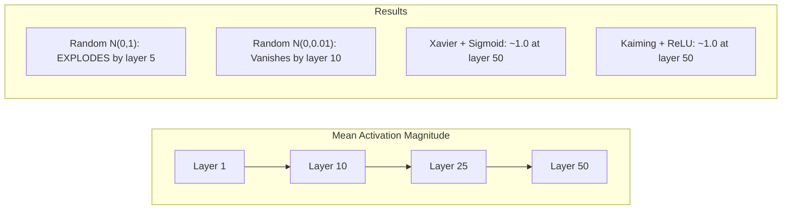
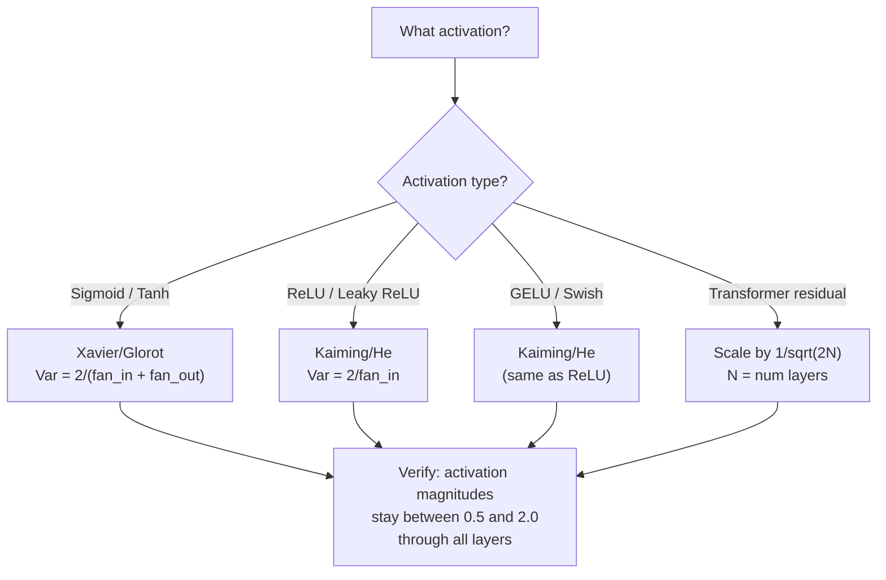

# 가중치 초기화와 학습 안정성 (Weight Initialization and Training Stability)

> 잘못 초기화하면 학습이 아예 시작되지 않는다. 제대로 초기화하면 50개 층이 3개 층만큼 매끄럽게 학습된다.

**Type:** Build
**Languages:** Python
**Prerequisites:** Lesson 03.04 (Activation Functions), Lesson 03.07 (Regularization)
**Time:** ~90분

## 학습 목표 (Learning Objectives)

- 0, 무작위, Xavier/Glorot, Kaiming/He 초기화 전략을 구현하고 50개 층을 거치며 활성값(activation) 크기에 미치는 효과를 측정하기
- Xavier 초기화가 왜 Var(w) = 2/(fan_in + fan_out)를 쓰고 Kaiming이 왜 Var(w) = 2/fan_in을 쓰는지 유도하기
- 0 초기화로 인한 대칭성(symmetry) 문제를 시연하고, 왜 무작위 스케일만으로는 부족한지 설명하기
- 활성화 함수에 올바른 초기화 전략 짝짓기: 시그모이드(sigmoid)/tanh에는 Xavier, ReLU/GELU에는 Kaiming

## 문제 (The Problem)

모든 가중치(weight)를 0으로 초기화하라. 아무것도 학습되지 않는다. 모든 뉴런(neuron)이 같은 함수를 계산하고, 같은 그래디언트(gradient)를 받으며, 동일하게 갱신된다. 10,000 에폭(epoch) 후에도, 512개 뉴런짜리 은닉층(hidden layer)은 여전히 같은 뉴런의 512개 복사본이다. 512개의 파라미터(parameter)에 값을 치르고 1개를 얻은 것이다.

너무 크게 초기화하라. 활성값이 신경망(neural network)을 거치며 폭발한다. 10번째 층에서 값이 1e15에 도달한다. 20번째 층에서는 무한대로 오버플로(overflow)한다. 그래디언트는 같은 궤적을 거꾸로 따른다.

표준 정규 분포에서 무작위로 초기화하라. 3개 층에서는 작동한다. 50개 층에서는 무작위 스케일이 약간 너무 작았는지 약간 너무 컸는지에 따라 신호가 0으로 붕괴하거나 무한대로 폭발한다. "작동함"과 "고장남" 사이의 경계는 면도날처럼 얇다.

가중치 초기화는 딥러닝에서 가장 과소평가된 결정이다. 아키텍처는 논문으로 다뤄진다. 옵티마이저(optimizer)는 블로그 글로 다뤄진다. 초기화는 각주에 머문다. 하지만 잘못하면 다른 어떤 것도 의미가 없다. 신경망은 학습이 시작되기도 전에 죽어 있다.

## 개념 (The Concept)

### 대칭성 문제 (The Symmetry Problem)

층(layer) 안의 모든 뉴런은 같은 구조를 가진다. 입력에 가중치를 곱하고, 편향(bias)을 더하고, 활성화를 적용한다. 모든 가중치가 같은 값(0이 극단적인 경우)에서 시작하면 모든 뉴런이 같은 출력을 계산한다. 역전파(backpropagation) 중에는 모든 뉴런이 같은 그래디언트를 받는다. 갱신 스텝 중에는 모든 뉴런이 같은 양만큼 변한다.

막혀 버린다. 신경망은 수백 개의 파라미터를 가지지만 모두 발맞춰 움직인다. 이것을 대칭성(symmetry)이라 부르고, 무작위 초기화는 이를 깨는 무차별 대입 방식이다. 각 뉴런이 가중치 공간의 다른 지점에서 시작하므로 각각 다른 특성(feature)을 학습한다.

하지만 "무작위"만으로는 부족하다. 무작위성의 *스케일*이 신경망이 학습하느냐를 결정한다.

### 층을 통한 분산 전파

fan_in개의 입력을 가진 단일 층을 생각하자.

```
z = w1*x1 + w2*x2 + ... + w_n*x_n
```

각 가중치 wi가 분산 Var(w)를 가진 분포에서 뽑히고 각 입력 xi가 분산 Var(x)를 가지면, 출력 분산은 이렇다.

```
Var(z) = fan_in * Var(w) * Var(x)
```

Var(w) = 1이고 fan_in = 512이면 출력 분산은 입력 분산의 512배다. 10개 층 후: 512^10 = 1.2e27. 신호가 폭발했다.

Var(w) = 0.001이면 출력 분산이 층당 0.001 * 512 = 0.512씩 줄어든다. 10개 층 후: 0.512^10 = 0.00013. 신호가 소실되었다.

목표는 Var(z) = Var(x)가 되도록 Var(w)를 고르는 것이다. 그러면 신호 크기가 층을 거쳐도 일정하게 유지된다.

### Xavier/Glorot 초기화

Glorot와 Bengio(2010)는 시그모이드와 tanh 활성화에 대한 해를 유도했다. 순방향 패스(forward pass)와 역방향 패스(backward pass) 모두에서 분산을 일정하게 유지하려면:

```
Var(w) = 2 / (fan_in + fan_out)
```

실제로는, 가중치를 다음에서 뽑는다.

```
w ~ Uniform(-limit, limit)  where limit = sqrt(6 / (fan_in + fan_out))
```

또는:

```
w ~ Normal(0, sqrt(2 / (fan_in + fan_out)))
```

이것이 작동하는 이유는 시그모이드와 tanh가 0 근처에서 대략 선형이고, 제대로 초기화된 활성값이 거기에 살기 때문이다. 분산은 수십 개의 층을 거쳐도 안정적으로 유지된다.

### Kaiming/He 초기화

ReLU는 출력의 절반을 죽인다(모든 음수가 0이 된다). 평균적으로 입력의 절반이 0이 되므로 유효 fan_in이 반으로 준다. Xavier 초기화는 이를 고려하지 않아서 필요한 분산을 과소평가한다.

He 등(2015)은 공식을 조정했다.

```
Var(w) = 2 / fan_in
```

가중치를 다음에서 뽑는다.

```
w ~ Normal(0, sqrt(2 / fan_in))
```

인자 2는 ReLU가 활성값의 절반을 0으로 만드는 것을 보상한다. 이것이 없으면 신호가 층당 약 0.5배씩 줄어든다. 50개 층이면: 0.5^50 = 8.8e-16. Kaiming 초기화는 이를 막는다.

### 트랜스포머 초기화

GPT-2는 다른 패턴을 도입했다. 잔차 연결(residual connection)은 각 서브층(sub-layer)의 출력을 그 입력에 더한다.

```
x = x + sublayer(x)
```

각 덧셈은 분산을 늘린다. N개의 잔차 층이면 분산이 N에 비례하여 커진다. GPT-2는 잔차 층의 가중치를 1/sqrt(2N)로 스케일하는데, 여기서 N은 층의 개수다. 이렇게 하면 누적된 신호 크기가 안정적으로 유지된다.

Llama 3(파라미터 4,050억 개, 126개 층)는 비슷한 방식을 쓴다. 이 스케일링이 없으면 잔차 스트림(residual stream)이 126개의 어텐션(attention)과 피드포워드 블록 층을 거치며 무한정 커진다.

```mermaid
flowchart TD
    subgraph "Zero Init"
        Z1["Layer 1<br/>All weights = 0"] --> Z2["Layer 2<br/>All neurons identical"]
        Z2 --> Z3["Layer 3<br/>Still identical"]
        Z3 --> ZR["Result: 1 effective neuron<br/>regardless of width"]
    end

    subgraph "Xavier Init"
        X1["Layer 1<br/>Var = 2/(fan_in+fan_out)"] --> X2["Layer 2<br/>Signal stable"]
        X2 --> X3["Layer 50<br/>Signal stable"]
        X3 --> XR["Result: Trains with<br/>sigmoid/tanh"]
    end

    subgraph "Kaiming Init"
        K1["Layer 1<br/>Var = 2/fan_in"] --> K2["Layer 2<br/>Signal stable"]
        K2 --> K3["Layer 50<br/>Signal stable"]
        K3 --> KR["Result: Trains with<br/>ReLU/GELU"]
    end
```



### 50개 층을 통한 활성값 크기



### 올바른 초기화 고르기



## 직접 만들기 (Build It)

### 1단계: 초기화 전략

가중치 행렬을 초기화하는 네 가지 방법. 각각은 fan_in개의 열과 fan_out개의 행을 가진 리스트의 리스트(2차원 행렬)를 반환한다.

```python
import math
import random


def zero_init(fan_in, fan_out):
    return [[0.0 for _ in range(fan_in)] for _ in range(fan_out)]


def random_init(fan_in, fan_out, scale=1.0):
    return [[random.gauss(0, scale) for _ in range(fan_in)] for _ in range(fan_out)]


def xavier_init(fan_in, fan_out):
    std = math.sqrt(2.0 / (fan_in + fan_out))
    return [[random.gauss(0, std) for _ in range(fan_in)] for _ in range(fan_out)]


def kaiming_init(fan_in, fan_out):
    std = math.sqrt(2.0 / fan_in)
    return [[random.gauss(0, std) for _ in range(fan_in)] for _ in range(fan_out)]
```

### 2단계: 활성화 함수

각 초기화 전략을 그것이 의도한 활성화와 함께 테스트하기 위해 시그모이드, tanh, ReLU가 필요하다.

```python
def sigmoid(x):
    x = max(-500, min(500, x))
    return 1.0 / (1.0 + math.exp(-x))


def tanh_act(x):
    return math.tanh(x)


def relu(x):
    return max(0.0, x)
```

### 3단계: 50개 층을 통한 순방향 패스

무작위 데이터를 깊은 신경망에 통과시키고 각 층에서 평균 활성값 크기를 측정한다.

```python
def forward_deep(init_fn, activation_fn, n_layers=50, width=64, n_samples=100):
    random.seed(42)
    layer_magnitudes = []

    inputs = [[random.gauss(0, 1) for _ in range(width)] for _ in range(n_samples)]

    for layer_idx in range(n_layers):
        weights = init_fn(width, width)
        biases = [0.0] * width

        new_inputs = []
        for sample in inputs:
            output = []
            for neuron_idx in range(width):
                z = sum(weights[neuron_idx][j] * sample[j] for j in range(width)) + biases[neuron_idx]
                output.append(activation_fn(z))
            new_inputs.append(output)
        inputs = new_inputs

        magnitudes = []
        for sample in inputs:
            magnitudes.append(sum(abs(v) for v in sample) / width)
        mean_mag = sum(magnitudes) / len(magnitudes)
        layer_magnitudes.append(mean_mag)

    return layer_magnitudes
```

### 4단계: 실험

모든 조합을 실행한다: 0 초기화, 무작위 N(0,1), 무작위 N(0,0.01), 시그모이드를 가진 Xavier, tanh를 가진 Xavier, ReLU를 가진 Kaiming. 주요 층에서의 크기를 출력한다.

```python
def run_experiment():
    configs = [
        ("Zero init + Sigmoid", lambda fi, fo: zero_init(fi, fo), sigmoid),
        ("Random N(0,1) + ReLU", lambda fi, fo: random_init(fi, fo, 1.0), relu),
        ("Random N(0,0.01) + ReLU", lambda fi, fo: random_init(fi, fo, 0.01), relu),
        ("Xavier + Sigmoid", xavier_init, sigmoid),
        ("Xavier + Tanh", xavier_init, tanh_act),
        ("Kaiming + ReLU", kaiming_init, relu),
    ]

    print(f"{'Strategy':<30} {'L1':>10} {'L5':>10} {'L10':>10} {'L25':>10} {'L50':>10}")
    print("-" * 80)

    for name, init_fn, act_fn in configs:
        mags = forward_deep(init_fn, act_fn)
        row = f"{name:<30}"
        for idx in [0, 4, 9, 24, 49]:
            val = mags[idx]
            if val > 1e6:
                row += f" {'EXPLODED':>10}"
            elif val < 1e-6:
                row += f" {'VANISHED':>10}"
            else:
                row += f" {val:>10.4f}"
        print(row)
```

### 5단계: 대칭성 시연

0 초기화가 동일한 뉴런을 만든다는 것을 보인다.

```python
def symmetry_demo():
    random.seed(42)
    weights = zero_init(2, 4)
    biases = [0.0] * 4

    inputs = [0.5, -0.3]
    outputs = []
    for neuron_idx in range(4):
        z = sum(weights[neuron_idx][j] * inputs[j] for j in range(2)) + biases[neuron_idx]
        outputs.append(sigmoid(z))

    print("\nSymmetry Demo (4 neurons, zero init):")
    for i, out in enumerate(outputs):
        print(f"  Neuron {i}: output = {out:.6f}")
    all_same = all(abs(outputs[i] - outputs[0]) < 1e-10 for i in range(len(outputs)))
    print(f"  All identical: {all_same}")
    print(f"  Effective parameters: 1 (not {len(weights) * len(weights[0])})")
```

### 6단계: 층별 크기 보고서

50개 층을 통한 활성값 크기의 시각적 막대 차트를 출력한다.

```python
def magnitude_report(name, magnitudes):
    print(f"\n{name}:")
    for i, mag in enumerate(magnitudes):
        if i % 5 == 0 or i == len(magnitudes) - 1:
            if mag > 1e6:
                bar = "X" * 50 + " EXPLODED"
            elif mag < 1e-6:
                bar = "." + " VANISHED"
            else:
                bar_len = min(50, max(1, int(mag * 10)))
                bar = "#" * bar_len
            print(f"  Layer {i+1:3d}: {bar} ({mag:.6f})")
```

## 라이브러리로 써보기 (Use It)

PyTorch는 이것들을 내장 함수로 제공한다.

```python
import torch
import torch.nn as nn

layer = nn.Linear(512, 256)

nn.init.xavier_uniform_(layer.weight)
nn.init.xavier_normal_(layer.weight)

nn.init.kaiming_uniform_(layer.weight, nonlinearity='relu')
nn.init.kaiming_normal_(layer.weight, nonlinearity='relu')

nn.init.zeros_(layer.bias)
```

`nn.Linear(512, 256)`을 호출하면 PyTorch는 기본적으로 Kaiming uniform 초기화를 쓴다. 대부분의 단순한 신경망이 "그냥 작동하는" 이유가 여기에 있다. PyTorch가 이미 올바른 선택을 해 둔 것이다. 하지만 커스텀 아키텍처를 만들거나 20개 층보다 깊어지면, 무슨 일이 일어나는지 이해하고 경우에 따라 기본값을 재정의해야 한다.

트랜스포머의 경우 HuggingFace 모델은 보통 `_init_weights` 메서드에서 초기화를 다룬다. GPT-2의 구현은 잔차 투영을 1/sqrt(N)로 스케일한다. 트랜스포머를 밑바닥부터 만든다면 이것을 스스로 추가해야 한다.

## 산출물 (Ship It)

이 레슨은 다음을 산출한다.
- `outputs/prompt-init-strategy.md` -- 가중치 초기화 문제를 진단하고 올바른 전략을 추천하는 프롬프트

## 연습 문제 (Exercises)

1. LeCun 초기화(Var = 1/fan_in, SELU 활성화를 위해 설계됨)를 추가하라. LeCun 초기화 + tanh로 50개 층 실험을 실행하고 Xavier + tanh와 비교하라.

2. GPT-2 잔차 스케일링을 구현하라: 잔차 스트림에 더하기 전에 각 층의 출력을 1/sqrt(2*N)로 곱한다. 스케일링이 있을 때와 없을 때로 50개 층을 실행하고, 잔차 크기가 얼마나 빨리 커지는지 측정하라.

3. 신경망의 층 차원과 활성화 유형을 받아 올바른 초기화를 추천하고 현재 초기화가 문제를 일으킬 경우 경고하는 "초기화 건강 검사" 함수를 만들어라.

4. fan_in = 16 대 fan_in = 1024로 실험을 실행하라. Xavier와 Kaiming은 fan_in에 적응하지만, 무작위 초기화는 그렇지 않다. 더 큰 층에서 "작동함"과 "고장남" 사이의 격차가 어떻게 벌어지는지 보여라.

5. 직교 초기화(orthogonal initialization)를 구현하라(무작위 행렬을 생성하고, 그것의 SVD를 계산하여, 직교 행렬 U를 쓴다). 50개 층의 ReLU 신경망에서 Kaiming과 비교하라.

## 핵심 용어 (Key Terms)

| 용어 | 흔히 하는 말 | 실제 의미 |
|------|----------------|----------------------|
| 가중치 초기화(Weight initialization) | "시작 가중치를 무작위로 설정" | 신경망이 학습할 수 있는지를 결정하는, 초기 가중치 값을 고르는 전략 |
| 대칭성 깨기(Symmetry breaking) | "뉴런을 서로 다르게 만들기" | 뉴런이 동일한 함수를 계산하는 대신 별개의 특성을 학습하도록 무작위 초기화를 사용하는 것 |
| 팬인(Fan-in) | "뉴런으로 들어오는 입력 수" | 들어오는 연결의 수로, 가중합에서 입력 분산이 어떻게 누적되는지를 결정함 |
| 팬아웃(Fan-out) | "뉴런에서 나가는 출력 수" | 나가는 연결의 수로, 역전파 중 그래디언트 분산을 유지하는 데 관련됨 |
| Xavier/Glorot 초기화(Xavier/Glorot init) | "시그모이드 초기화" | Var(w) = 2/(fan_in + fan_out), 시그모이드와 tanh 활성화를 통해 분산을 보존하도록 설계됨 |
| Kaiming/He 초기화(Kaiming/He init) | "ReLU 초기화" | Var(w) = 2/fan_in, ReLU가 활성값의 절반을 0으로 만드는 것을 고려함 |
| 분산 전파(Variance propagation) | "신호가 층을 거치며 커지거나 줄어드는 방식" | 가중치 스케일에 기반해 활성값 분산이 층별로 어떻게 변하는지에 대한 수학적 분석 |
| 잔차 스케일링(Residual scaling) | "GPT-2의 초기화 비결" | N개 트랜스포머 층을 통한 분산 증가를 막기 위해 잔차 연결 가중치를 1/sqrt(2N)로 스케일함 |
| 죽은 신경망(Dead network) | "아무것도 학습되지 않음" | 나쁜 초기화로 모든 그래디언트가 0이거나 모든 활성값이 포화되는 신경망 |
| 활성값 폭발(Exploding activations) | "값이 무한대로 감" | 가중치 분산이 너무 높아 활성값 크기가 층을 거치며 지수적으로 커지는 것 |

## 더 읽을거리 (Further Reading)

- Glorot & Bengio, "Understanding the difficulty of training deep feedforward neural networks" (2010) -- 분산 분석을 담은 원조 Xavier 초기화 논문
- He et al., "Delving Deep into Rectifiers" (2015) -- ReLU 신경망을 위한 Kaiming 초기화를 도입함
- Radford et al., "Language Models are Unsupervised Multitask Learners" (2019) -- 잔차 스케일링 초기화를 담은 GPT-2 논문
- Mishkin & Matas, "All You Need is a Good Init" (2016) -- 해석적 공식에 대한 경험적 대안인, 층-순차 단위-분산 초기화
