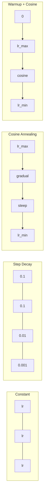
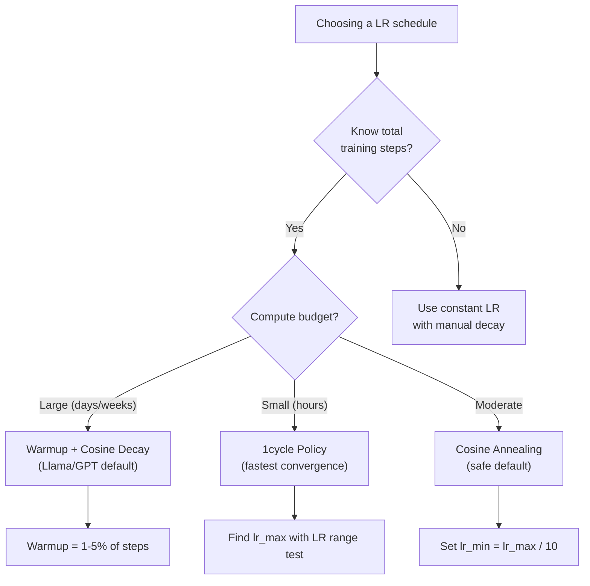
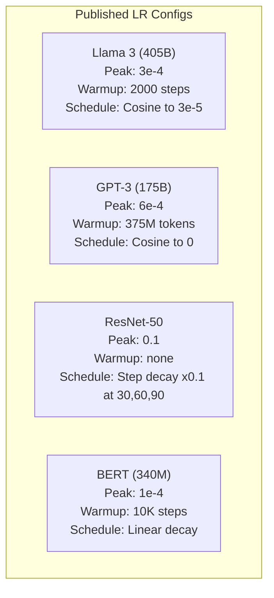

# 학습률 스케줄과 웜업 (Learning Rate Schedules and Warmup)

> 학습률(learning rate)은 가장 중요한 단 하나의 하이퍼파라미터(hyperparameter)다. 아키텍처가 아니다. 데이터셋(dataset) 크기가 아니다. 활성화 함수(activation function)가 아니다. 학습률이다. 다른 아무것도 조정하지 않더라도, 이것은 조정하라.

**Type:** Build
**Languages:** Python
**Prerequisites:** Lesson 03.06 (Optimizers), Lesson 03.08 (Weight Initialization)
**Time:** ~90분

## 학습 목표 (Learning Objectives)

- 상수(constant), 단계 감쇠(step decay), 코사인 어닐링(cosine annealing), 웜업(warmup) + 코사인, 1cycle 학습률 스케줄을 밑바닥부터 구현하기
- 학습률 선택의 세 가지 실패 모드를 시연하기: 발산(너무 높음), 정체(너무 낮음), 진동(감쇠 없음)
- Adam 기반 옵티마이저(optimizer)에 왜 웜업이 필요한지, 그것이 초기 학습을 어떻게 안정화하는지 설명하기
- 같은 과제에서 다섯 가지 스케줄 전반의 수렴(convergence) 속도를 비교하고 주어진 학습 예산에 맞는 것을 선택하기

## 문제 (The Problem)

학습률을 0.1로 설정하라. 학습이 발산한다. 손실(loss)이 3 스텝 만에 무한대로 치솟는다. 0.0001로 설정하라. 학습이 기어간다. 100 에폭(epoch)이 지나도 모델이 무작위에서 거의 움직이지 않았다. 0.01로 설정하라. 학습이 50 에폭 동안 작동하다가, 스텝이 너무 커서 절대 도달할 수 없는 최솟값 주위로 손실이 진동한다.

최적 학습률은 상수가 아니다. 학습 중에 변한다. 초기에는 빠르게 거리를 좁히려고 큰 스텝을 원한다. 학습 후반에는 날카로운 최솟값으로 안착하려고 아주 작은 스텝을 원한다. 90% 정확한 모델과 95% 정확한 모델의 차이는 종종 그저 스케줄이다.

지난 3년간 발표된 모든 주요 모델은 학습률 스케줄을 쓴다. Llama 3는 2000 웜업 스텝과 3e-5로의 코사인 감쇠를 가진 최고 lr=3e-4를 썼다. GPT-3는 3억 7,500만 토큰(token)에 걸친 웜업을 가진 lr=6e-4를 썼다. 이것들은 임의의 선택이 아니다. 수백만 달러가 든 광범위한 하이퍼파라미터 스윕(sweep)의 결과다.

스케줄을 이해해야 하는 이유는 기본값이 내 문제에는 통하지 않기 때문이다. 사전 학습(pretrained)된 모델을 파인튜닝(fine-tuning)할 때 올바른 스케줄은 밑바닥부터 학습하는 것과 다르다. 배치(batch) 크기를 늘릴 때는 웜업 기간을 바꿔야 한다. 스텝 10,000에서 학습이 깨질 때, 그것이 스케줄 문제인지 다른 무언가인지 알아야 한다.

## 개념 (The Concept)

### 상수 학습률 (Constant Learning Rate)

가장 단순한 접근법이다. 숫자 하나를 고르고, 모든 스텝에 그것을 쓴다.

```
lr(t) = lr_0
```

좀처럼 최적이 아니다. 학습 끝에는 너무 높거나(최솟값 주위 진동) 시작에는 너무 낮다(아주 작은 스텝에 낭비되는 계산). 작은 모델과 디버깅에는 괜찮지만, 한 시간 넘게 학습하는 그 어떤 것에도 끔찍한 선택이다.

### 단계 감쇠 (Step Decay)

ResNet 시대의 구식 접근법이다. 고정된 에폭에서 학습률을 어떤 인자(보통 10배)로 자른다.

```
lr(t) = lr_0 * gamma^(floor(epoch / step_size))
```

gamma = 0.1, step_size = 30이면 lr이 30 에폭마다 10배 떨어진다는 뜻이다. ResNet-50이 이를 썼다. lr=0.1로 두고 에폭 30, 60, 90에서 10배 떨어뜨렸다.

문제는 최적 감쇠 지점이 데이터셋과 아키텍처에 달려 있다는 것이다. 다른 문제로 옮기면 언제 떨어뜨릴지를 다시 조정해야 한다. 전환도 급격해서, 학습률이 갑자기 변하면 손실이 치솟을 수 있다.

### 코사인 어닐링 (Cosine Annealing)

코사인 곡선을 따라 최대 학습률에서 최소까지 매끄럽게 감쇠한다.

```
lr(t) = lr_min + 0.5 * (lr_max - lr_min) * (1 + cos(pi * t / T))
```

여기서 t는 현재 스텝이고 T는 총 스텝 수다.

t=0에서, 코사인 항은 1이므로 lr = lr_max다. t=T에서, 코사인 항은 -1이므로 lr = lr_min이다. 감쇠는 처음에 완만하고, 중간에 가속되며, 끝 근처에서 다시 완만해진다.

이것이 대부분의 현대 학습 실행의 기본값이다. lr_max와 lr_min 외에 조정할 하이퍼파라미터가 없다. 코사인 모양은 대부분의 학습이 학습 중간에 일어난다는 경험적 관찰과 일치한다. 그 결정적 시기에 합리적인 스텝 크기를 원한다.

### 웜업: 왜 작게 시작하는가

Adam과 다른 적응적 옵티마이저는 그래디언트(gradient) 평균과 분산의 이동 추정치를 유지한다. 스텝 0에서 이 추정치들은 0으로 초기화된다. 처음 몇 번의 그래디언트 갱신은 쓰레기 통계량에 기반한다. 이 기간 동안 학습률이 크면 모델은 크고 방향이 잘못 잡힌 스텝을 밟는다.

웜업이 이를 고친다. 아주 작은 학습률(종종 lr_max / warmup_steps 또는 심지어 0)로 시작해 처음 N 스텝에 걸쳐 lr_max로 선형으로 올린다. 완전한 학습률에 도달할 즈음이면 Adam의 통계량이 안정화되어 있다.

```
lr(t) = lr_max * (t / warmup_steps)     for t < warmup_steps
```

전형적인 웜업: 총 학습 스텝의 1-5%. Llama 3는 약 1.8조 토큰을 학습했고 2000 스텝 동안 웜업했다. GPT-3는 3억 7,500만 토큰에 걸쳐 웜업했다.

### 선형 웜업 + 코사인 감쇠

현대의 기본값이다. 선형으로 올린 뒤, 코사인으로 감쇠한다.

```
if t < warmup_steps:
    lr(t) = lr_max * (t / warmup_steps)
else:
    progress = (t - warmup_steps) / (total_steps - warmup_steps)
    lr(t) = lr_min + 0.5 * (lr_max - lr_min) * (1 + cos(pi * progress))
```

이것이 Llama, GPT, PaLM, 그리고 대부분의 현대 트랜스포머(transformer)가 쓰는 것이다. 웜업은 초기 불안정을 막는다. 코사인 감쇠는 모델을 좋은 최솟값으로 안착시킨다.

### 1cycle 정책

Leslie Smith의 발견(2018)이다. 학습 전반부에 학습률을 낮은 값에서 높은 값으로 올린 뒤, 후반부에 다시 내린다. 반직관적이다. 왜 중간에 학습률을 *올리겠는가*?

이론은 이렇다: 높은 학습률은 최적화 궤적에 노이즈를 더하여 정규화(regularization)처럼 작동한다. 모델은 올리는 단계 동안 손실 지형(loss landscape)을 더 많이 탐색하여, 더 나은 골짜기(basin)를 찾는다. 내리는 단계는 그다음 찾은 최선의 골짜기 안에서 정제한다.

```
Phase 1 (0 to T/2):    lr ramps from lr_max/25 to lr_max
Phase 2 (T/2 to T):    lr ramps from lr_max to lr_max/10000
```

1cycle은 고정된 계산 예산에 대해 종종 코사인 어닐링보다 빠르게 학습한다. 트레이드오프(trade-off): 총 스텝 수를 미리 알아야 한다.

### 스케줄 모양



### 결정 순서도



### 발표된 모델의 실제 숫자



## 직접 만들기 (Build It)

### 1단계: 스케줄 함수

각 함수는 현재 스텝을 받아 그 스텝에서의 학습률을 반환한다.

```python
import math


def constant_schedule(step, lr=0.01, **kwargs):
    return lr


def step_decay_schedule(step, lr=0.1, step_size=100, gamma=0.1, **kwargs):
    return lr * (gamma ** (step // step_size))


def cosine_schedule(step, lr=0.01, total_steps=1000, lr_min=1e-5, **kwargs):
    if step >= total_steps:
        return lr_min
    return lr_min + 0.5 * (lr - lr_min) * (1 + math.cos(math.pi * step / total_steps))


def warmup_cosine_schedule(step, lr=0.01, total_steps=1000, warmup_steps=100, lr_min=1e-5, **kwargs):
    if total_steps <= warmup_steps:
        return lr * (step / max(warmup_steps, 1))
    if step < warmup_steps:
        return lr * step / warmup_steps
    progress = (step - warmup_steps) / (total_steps - warmup_steps)
    return lr_min + 0.5 * (lr - lr_min) * (1 + math.cos(math.pi * progress))


def one_cycle_schedule(step, lr=0.01, total_steps=1000, **kwargs):
    mid = max(total_steps // 2, 1)
    if step < mid:
        return (lr / 25) + (lr - lr / 25) * step / mid
    else:
        progress = (step - mid) / max(total_steps - mid, 1)
        return lr * (1 - progress) + (lr / 10000) * progress
```

### 2단계: 모든 스케줄 시각화

각 스케줄이 학습 동안 어떻게 변하는지 보여 주는 텍스트 기반 플롯을 출력한다.

```python
def visualize_schedule(name, schedule_fn, total_steps=500, **kwargs):
    steps = list(range(0, total_steps, total_steps // 20))
    if total_steps - 1 not in steps:
        steps.append(total_steps - 1)

    lrs = [schedule_fn(s, total_steps=total_steps, **kwargs) for s in steps]
    max_lr = max(lrs) if max(lrs) > 0 else 1.0

    print(f"\n{name}:")
    for s, lr_val in zip(steps, lrs):
        bar_len = int(lr_val / max_lr * 40)
        bar = "#" * bar_len
        print(f"  Step {s:4d}: lr={lr_val:.6f} {bar}")
```

### 3단계: 학습 신경망

이전 레슨과 같은, 원 데이터셋에 대한 단순한 2층 신경망(neural network)이지만, 이제 스케줄을 변화시킨다.

```python
import random


def sigmoid(x):
    x = max(-500, min(500, x))
    return 1.0 / (1.0 + math.exp(-x))


def relu(x):
    return max(0.0, x)


def relu_deriv(x):
    return 1.0 if x > 0 else 0.0


def make_circle_data(n=200, seed=42):
    random.seed(seed)
    data = []
    for _ in range(n):
        x = random.uniform(-2, 2)
        y = random.uniform(-2, 2)
        label = 1.0 if x * x + y * y < 1.5 else 0.0
        data.append(([x, y], label))
    return data


def train_with_schedule(schedule_fn, schedule_name, data, epochs=300, base_lr=0.05, **kwargs):
    random.seed(0)
    hidden_size = 8
    total_steps = epochs * len(data)

    std = math.sqrt(2.0 / 2)
    w1 = [[random.gauss(0, std) for _ in range(2)] for _ in range(hidden_size)]
    b1 = [0.0] * hidden_size
    w2 = [random.gauss(0, std) for _ in range(hidden_size)]
    b2 = 0.0

    step = 0
    epoch_losses = []

    for epoch in range(epochs):
        total_loss = 0
        correct = 0

        for x, target in data:
            lr = schedule_fn(step, lr=base_lr, total_steps=total_steps, **kwargs)

            z1 = []
            h = []
            for i in range(hidden_size):
                z = w1[i][0] * x[0] + w1[i][1] * x[1] + b1[i]
                z1.append(z)
                h.append(relu(z))

            z2 = sum(w2[i] * h[i] for i in range(hidden_size)) + b2
            out = sigmoid(z2)

            error = out - target
            d_out = error * out * (1 - out)

            for i in range(hidden_size):
                d_h = d_out * w2[i] * relu_deriv(z1[i])
                w2[i] -= lr * d_out * h[i]
                for j in range(2):
                    w1[i][j] -= lr * d_h * x[j]
                b1[i] -= lr * d_h
            b2 -= lr * d_out

            total_loss += (out - target) ** 2
            if (out >= 0.5) == (target >= 0.5):
                correct += 1
            step += 1

        avg_loss = total_loss / len(data)
        accuracy = correct / len(data) * 100
        epoch_losses.append(avg_loss)

    return epoch_losses
```

### 4단계: 모든 스케줄 비교

각 스케줄로 같은 신경망을 학습시키고 최종 손실과 수렴 행동을 비교한다.

```python
def compare_schedules(data):
    configs = [
        ("Constant", constant_schedule, {}),
        ("Step Decay", step_decay_schedule, {"step_size": 15000, "gamma": 0.1}),
        ("Cosine", cosine_schedule, {"lr_min": 1e-5}),
        ("Warmup+Cosine", warmup_cosine_schedule, {"warmup_steps": 3000, "lr_min": 1e-5}),
        ("1cycle", one_cycle_schedule, {}),
    ]

    print(f"\n{'Schedule':<20} {'Start Loss':>12} {'Mid Loss':>12} {'End Loss':>12} {'Best Loss':>12}")
    print("-" * 70)

    for name, schedule_fn, extra_kwargs in configs:
        losses = train_with_schedule(schedule_fn, name, data, epochs=300, base_lr=0.05, **extra_kwargs)
        mid_idx = len(losses) // 2
        best = min(losses)
        print(f"{name:<20} {losses[0]:>12.6f} {losses[mid_idx]:>12.6f} {losses[-1]:>12.6f} {best:>12.6f}")
```

### 5단계: 너무 높은 LR 대 너무 낮은 LR

세 가지 실패 모드를 시연한다: 너무 높음(발산), 너무 낮음(기어감), 그리고 적절함.

```python
def lr_sensitivity(data):
    learning_rates = [1.0, 0.1, 0.01, 0.001, 0.0001]

    print("\nLR Sensitivity (constant schedule, 100 epochs):")
    print(f"  {'LR':>10} {'Start Loss':>12} {'End Loss':>12} {'Status':>15}")
    print("  " + "-" * 52)

    for lr in learning_rates:
        losses = train_with_schedule(constant_schedule, f"lr={lr}", data, epochs=100, base_lr=lr)
        start = losses[0]
        end = losses[-1]

        if end > start or math.isnan(end) or end > 1.0:
            status = "DIVERGED"
        elif end > start * 0.9:
            status = "BARELY MOVED"
        elif end < 0.15:
            status = "CONVERGED"
        else:
            status = "LEARNING"

        end_str = f"{end:.6f}" if not math.isnan(end) else "NaN"
        print(f"  {lr:>10.4f} {start:>12.6f} {end_str:>12} {status:>15}")
```

## 라이브러리로 써보기 (Use It)

PyTorch는 `torch.optim.lr_scheduler`에 스케줄러를 제공한다.

```python
import torch
import torch.optim as optim
from torch.optim.lr_scheduler import CosineAnnealingLR, OneCycleLR, StepLR

model = nn.Sequential(nn.Linear(10, 64), nn.ReLU(), nn.Linear(64, 1))
optimizer = optim.Adam(model.parameters(), lr=3e-4)

scheduler = CosineAnnealingLR(optimizer, T_max=1000, eta_min=1e-5)

for step in range(1000):
    loss = train_step(model, optimizer)
    scheduler.step()
```

웜업 + 코사인의 경우, lambda 스케줄러나 HuggingFace의 `get_cosine_schedule_with_warmup`을 쓴다.

```python
from transformers import get_cosine_schedule_with_warmup

scheduler = get_cosine_schedule_with_warmup(
    optimizer,
    num_warmup_steps=2000,
    num_training_steps=100000,
)
```

HuggingFace 함수는 대부분의 Llama와 GPT 파인튜닝 스크립트가 쓰는 것이다. 확신이 없으면, 웜업 = 총 스텝의 3-5%인 웜업 + 코사인을 써라. 거의 모든 것에 통한다.

## 산출물 (Ship It)

이 레슨은 다음을 산출한다.
- `outputs/prompt-lr-schedule-advisor.md` -- 주어진 학습 설정에 맞는 올바른 학습률 스케줄과 하이퍼파라미터를 추천하는 프롬프트

## 연습 문제 (Exercises)

1. 지수 감쇠를 구현하라: lr(t) = lr_0 * gamma^t, 여기서 gamma = 0.999. 원 데이터셋에서 코사인 어닐링과 비교하라.

2. 학습률 범위 테스트(Leslie Smith)를 구현하라: 수백 스텝 동안 LR을 1e-7에서 1로 지수적으로 늘리면서 학습한다. 손실 대 LR을 그려라. 최적 최대 LR은 손실이 증가하기 시작하기 직전이다.

3. 웜업 + 코사인으로 학습하되 웜업 길이를 변화시켜라: 총 스텝의 0%, 1%, 5%, 10%, 20%. 학습이 가장 안정적인 최적 지점을 찾아라.

4. 웜 리스타트(warm restart)를 가진 코사인 어닐링(SGDR)을 구현하라: T 스텝마다 학습률을 lr_max로 재설정하고 다시 감쇠한다. 더 긴 학습 실행에서 표준 코사인과 비교하라.

5. 학습 손실을 모니터링하여 손실이 안정화되면 웜업에서 코사인으로 자동 전환하고, 손실이 너무 오래 정체되면 lr을 줄이는 "스케줄 외과의(schedule surgeon)"를 만들어라.

## 핵심 용어 (Key Terms)

| 용어 | 흔히 하는 말 | 실제 의미 |
|------|----------------|----------------------|
| 학습률(Learning rate) | "모델이 얼마나 빨리 학습하는지" | 파라미터 갱신 크기를 결정하기 위해 그래디언트에 곱하는 스칼라 |
| 스케줄(Schedule) | "시간에 따라 LR 변경" | 수렴을 최적화하도록 설계된, 학습 스텝을 학습률로 매핑하는 함수 |
| 웜업(Warmup) | "작은 LR로 시작" | 옵티마이저 통계량을 안정화하기 위해 처음 N 스텝에 걸쳐 LR을 0 근처에서 목표값으로 선형으로 올리는 것 |
| 코사인 어닐링(Cosine annealing) | "매끄러운 LR 감쇠" | 학습 동안 코사인 곡선을 따라 LR을 lr_max에서 lr_min으로 줄이는 것 |
| 스텝 감쇠(Step decay) | "마일스톤에서 LR 떨어뜨리기" | 고정된 에폭 간격에서 LR에 어떤 인자(보통 0.1)를 곱하는 것 |
| 1사이클 정책(1cycle policy) | "올렸다 내리기" | 더 빠른 수렴을 위해 LR을 단일 사이클에서 올렸다 내리는 Leslie Smith의 방법 |
| LR 범위 테스트(LR range test) | "최선의 학습률 찾기" | 손실이 발산하기 시작하는 값을 찾기 위해 LR을 늘리면서 잠깐 학습하는 것 |
| 웜 리스타트를 동반한 코사인(Cosine with warm restarts) | "재설정하고 반복" | 주기적으로 LR을 lr_max로 재설정하고 다시 감쇠하는 것(SGDR) |
| Eta min | "LR의 바닥" | 스케줄이 감쇠해 도달하는 최소 학습률 |
| 최대 학습률(Peak learning rate) | "최대 LR" | 학습 중 도달하는 가장 높은 LR, 보통 웜업 이후 |

## 더 읽을거리 (Further Reading)

- Loshchilov & Hutter, "SGDR: Stochastic Gradient Descent with Warm Restarts" (2017) -- 코사인 어닐링과 웜 리스타트를 도입함
- Smith, "Super-Convergence: Very Fast Training of Neural Networks Using Large Learning Rates" (2018) -- 1cycle 정책 논문
- Touvron et al., "Llama 2: Open Foundation and Fine-Tuned Chat Models" (2023) -- 대규모에서 쓰인 웜업 + 코사인 스케줄을 문서화함
- Goyal et al., "Accurate, Large Minibatch SGD: Training ImageNet in 1 Hour" (2017) -- 큰 배치 학습을 위한 선형 스케일링 규칙과 웜업
