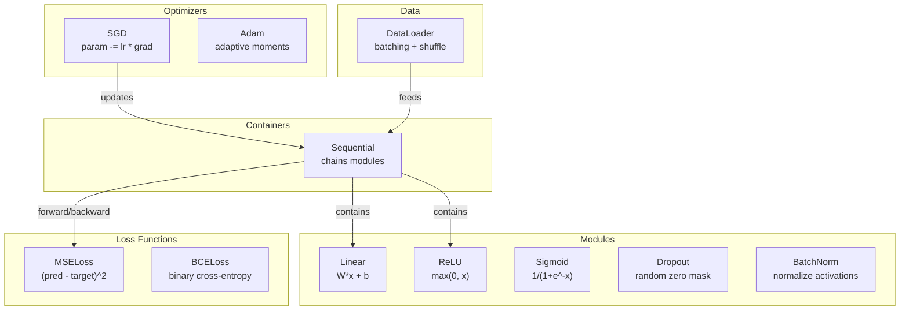
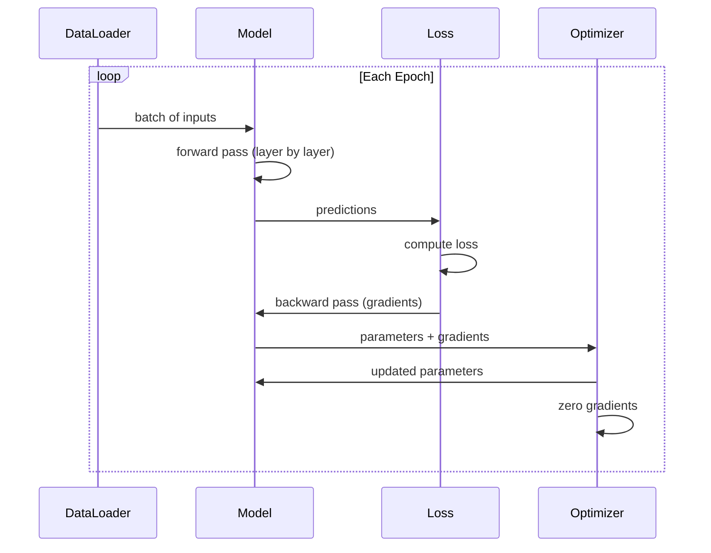
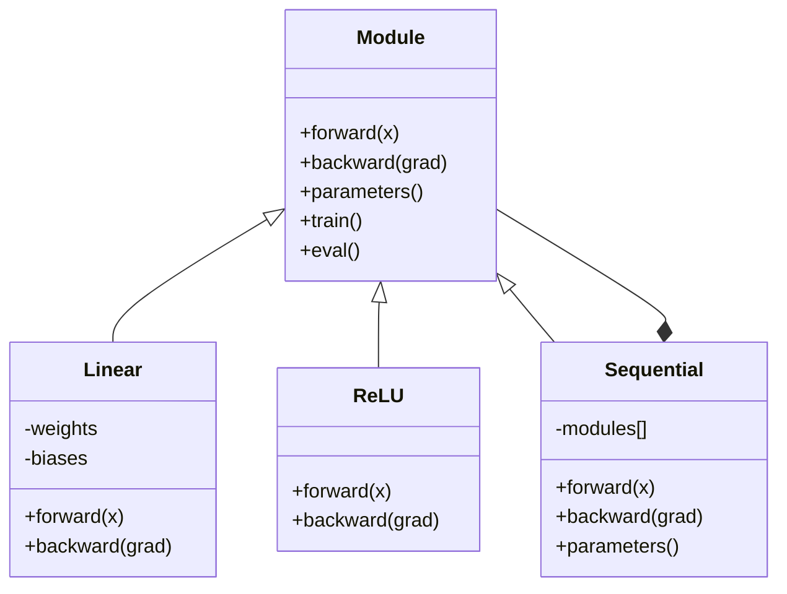

# 나만의 미니 프레임워크 만들기 (Build Your Own Mini Framework)

> 당신은 뉴런(neuron), 층(layer), 신경망(network), 역전파(backprop), 활성화(activation), 손실 함수(loss function), 옵티마이저(optimizer), 정규화(regularization), 초기화(initialization), LR 스케줄을 만들었다. 모두 별개의 조각으로. 이제 그것들을 하나의 프레임워크로 엮는다. PyTorch가 아니다. TensorFlow가 아니다. 당신의 것이다.

**Type:** Build
**Languages:** Python
**Prerequisites:** All of Phase 03 (Lessons 01-09)
**Time:** ~120분

## 학습 목표 (Learning Objectives)

- Module, Linear, ReLU, Sigmoid, Dropout, BatchNorm, Sequential, 손실 함수, 옵티마이저, DataLoader를 갖춘 완전한 딥러닝(deep learning) 프레임워크(~500줄) 만들기
- Module 추상화(forward, backward, parameters)와 왜 학습/평가 모드 전환이 필요한지 설명하기
- 모든 컴포넌트를, 4층 신경망을 원 분류(circle classification)에 학습시키는 작동하는 학습 루프로 엮기
- 당신 프레임워크의 각 컴포넌트를 그에 대응하는 PyTorch(nn.Module, nn.Sequential, optim.Adam, DataLoader)에 매핑하기

## 문제 (The Problem)

당신에게는 별개의 파일에 흩어진 열 개 레슨 분량의 빌딩 블록이 있다. 여기 `Value` 클래스, 저기 학습 루프, 또 다른 파일에 가중치 초기화, 또 다른 곳에 학습률(learning rate) 스케줄. 신경망을 학습시키려면, 다섯 개의 서로 다른 레슨에서 복사-붙여넣기 하여 손으로 엮어야 한다.

그것이 프레임워크가 해결하는 것이다. PyTorch는 `nn.Module`, `nn.Sequential`, `optim.Adam`, `DataLoader`, 그리고 그것들을 함께 묶는 학습 루프 패턴을 준다. TensorFlow는 `keras.Layer`, `keras.Sequential`, `keras.optimizers.Adam`을 준다. 이것들은 마법이 아니다. 매번 배관을 새로 발명하지 않고도 신경망을 정의하고, 학습시키고, 평가할 수 있게 해 주는 조직화 패턴이다.

당신은 같은 것을 ~500줄의 Python으로 만들 것이다. numpy 없음. 외부 의존성 없음. 어떤 피드포워드 신경망이든 정의하고, SGD나 Adam으로 학습시키고, 데이터를 배치(batch)로 묶고, 드롭아웃(dropout)과 배치 정규화(batch normalization)를 적용하고, 어떤 활성화든 쓰고, 학습률을 스케줄링할 수 있는 프레임워크다.

끝마치면, PyTorch에서 `model = nn.Sequential(...)`을 쓸 때 정확히 무슨 일이 일어나는지 이해하게 된다. 왜 `model.train()`과 `model.eval()`이 존재하는지 이해하게 된다. 왜 `optimizer.zero_grad()`가 별도의 호출인지 이해하게 된다. 그 모두를 이해하게 되는데, 그 모두를 당신이 만들었기 때문이다.

## 개념 (The Concept)

### Module 추상화

PyTorch의 모든 층은 `nn.Module`을 상속한다. Module은 세 가지 책임을 가진다.

1. **forward()** -- 입력이 주어졌을 때 출력을 계산한다
2. **parameters()** -- 모든 학습 가능한 가중치(weight)를 반환한다
3. **backward()** -- 그래디언트(gradient)를 계산한다(PyTorch에서는 자동 미분(autograd)이 처리, 우리 것에서는 명시적)

Linear 층은 Module이다. ReLU 활성화는 Module이다. 드롭아웃 층은 Module이다. 배치 정규화 층은 Module이다. 모두 같은 인터페이스를 가진다.

### Sequential 컨테이너

`nn.Sequential`은 Module을 연결한다. 순방향 패스(forward pass): 데이터를 Module 1, 그다음 Module 2, 그다음 Module 3에 넣는다. 역방향 패스(backward pass): 연쇄(chain)를 뒤집는다. 컨테이너 자체가 Module이다 -- forward(), parameters(), backward()를 가진다. 이것이 컴포지트 패턴(composite pattern)이다: Module의 시퀀스 자체가 Module이다.

### 학습 모드 대 평가 모드

드롭아웃은 학습 중에 뉴런을 무작위로 0으로 만들지만 평가 중에는 모든 것을 통과시킨다. 배치 정규화는 학습 중에 배치 통계량을, 평가 중에 이동 평균(running average)을 쓴다. `train()`과 `eval()` 메서드가 이 동작을 전환한다. 모든 Module은 `training` 플래그를 가진다.

### 옵티마이저

옵티마이저는 그래디언트를 써서 파라미터(parameter)를 갱신한다. SGD: `param -= lr * grad`. Adam: 모멘텀(momentum)과 분산 추정치를 유지한 뒤 갱신한다. 옵티마이저는 신경망 아키텍처를 알지 못한다 -- 그저 파라미터와 그 그래디언트의 평평한 리스트만 본다.

### DataLoader

배치 처리는 두 가지 이유로 중요하다. 첫째, 큰 문제에서는 전체 데이터셋(dataset)을 메모리에 올릴 수 없다. 둘째, 미니배치(mini-batch) 경사 하강법(gradient descent)은 지역 최솟값(local minima)을 탈출하는 데 도움을 주는 노이즈를 제공한다. DataLoader는 데이터를 배치로 나누고 선택적으로 에폭(epoch) 사이에 섞는다.

### 프레임워크 아키텍처



### 학습 루프



### Module 계층



## 직접 만들기 (Build It)

### 1단계: Module 베이스 클래스

모든 층이 구현하는 추상 인터페이스다.

```python
class Module:
    def __init__(self):
        self.training = True

    def forward(self, x):
        raise NotImplementedError

    def backward(self, grad):
        raise NotImplementedError

    def parameters(self):
        return []

    def train(self):
        self.training = True

    def eval(self):
        self.training = False
```

### 2단계: Linear 층

근본적인 빌딩 블록이다. 가중치와 편향(bias)을 저장하고, 순방향으로 Wx + b를, 역방향으로 가중치/입력 그래디언트를 계산한다.

```python
import math
import random


class Linear(Module):
    def __init__(self, fan_in, fan_out):
        super().__init__()
        std = math.sqrt(2.0 / fan_in)
        self.weights = [[random.gauss(0, std) for _ in range(fan_in)] for _ in range(fan_out)]
        self.biases = [0.0] * fan_out
        self.weight_grads = [[0.0] * fan_in for _ in range(fan_out)]
        self.bias_grads = [0.0] * fan_out
        self.fan_in = fan_in
        self.fan_out = fan_out
        self.input = None

    def forward(self, x):
        self.input = x
        output = []
        for i in range(self.fan_out):
            val = self.biases[i]
            for j in range(self.fan_in):
                val += self.weights[i][j] * x[j]
            output.append(val)
        return output

    def backward(self, grad):
        input_grad = [0.0] * self.fan_in
        for i in range(self.fan_out):
            self.bias_grads[i] += grad[i]
            for j in range(self.fan_in):
                self.weight_grads[i][j] += grad[i] * self.input[j]
                input_grad[j] += grad[i] * self.weights[i][j]
        return input_grad

    def parameters(self):
        params = []
        for i in range(self.fan_out):
            for j in range(self.fan_in):
                params.append((self.weights, i, j, self.weight_grads))
            params.append((self.biases, i, None, self.bias_grads))
        return params
```

### 3단계: 활성화 Module

ReLU, Sigmoid, Tanh를 Module로. 각각 역방향 패스에 필요한 것을 캐시한다.

```python
class ReLU(Module):
    def __init__(self):
        super().__init__()
        self.mask = None

    def forward(self, x):
        self.mask = [1.0 if v > 0 else 0.0 for v in x]
        return [max(0.0, v) for v in x]

    def backward(self, grad):
        return [g * m for g, m in zip(grad, self.mask)]


class Sigmoid(Module):
    def __init__(self):
        super().__init__()
        self.output = None

    def forward(self, x):
        self.output = []
        for v in x:
            v = max(-500, min(500, v))
            self.output.append(1.0 / (1.0 + math.exp(-v)))
        return self.output

    def backward(self, grad):
        return [g * o * (1 - o) for g, o in zip(grad, self.output)]


class Tanh(Module):
    def __init__(self):
        super().__init__()
        self.output = None

    def forward(self, x):
        self.output = [math.tanh(v) for v in x]
        return self.output

    def backward(self, grad):
        return [g * (1 - o * o) for g, o in zip(grad, self.output)]
```

### 4단계: Dropout Module

학습 중에 원소를 무작위로 0으로 만든다. 기댓값이 같게 유지되도록 남은 원소를 1/(1-p)로 스케일한다. 평가 중에는 아무것도 하지 않는다.

```python
class Dropout(Module):
    def __init__(self, p=0.5):
        super().__init__()
        self.p = p
        self.mask = None

    def forward(self, x):
        if not self.training:
            return x
        self.mask = [0.0 if random.random() < self.p else 1.0 / (1 - self.p) for _ in x]
        return [v * m for v, m in zip(x, self.mask)]

    def backward(self, grad):
        if self.mask is None:
            return grad
        return [g * m for g, m in zip(grad, self.mask)]
```

### 5단계: BatchNorm Module

배치 전체에 걸쳐 특성(feature)별로 활성값을 평균 0, 분산 1로 정규화한다. 평가 모드를 위해 이동 통계량을 유지한다.

```python
class BatchNorm(Module):
    def __init__(self, size, momentum=0.1, eps=1e-5):
        super().__init__()
        self.size = size
        self.gamma = [1.0] * size
        self.beta = [0.0] * size
        self.gamma_grads = [0.0] * size
        self.beta_grads = [0.0] * size
        self.running_mean = [0.0] * size
        self.running_var = [1.0] * size
        self.momentum = momentum
        self.eps = eps
        self.x_norm = None
        self.std_inv = None
        self.batch_input = None

    def forward_batch(self, batch):
        batch_size = len(batch)
        output_batch = []

        if self.training:
            mean = [0.0] * self.size
            for sample in batch:
                for j in range(self.size):
                    mean[j] += sample[j]
            mean = [m / batch_size for m in mean]

            var = [0.0] * self.size
            for sample in batch:
                for j in range(self.size):
                    var[j] += (sample[j] - mean[j]) ** 2
            var = [v / batch_size for v in var]

            self.std_inv = [1.0 / math.sqrt(v + self.eps) for v in var]

            self.x_norm = []
            self.batch_input = batch
            for sample in batch:
                normed = [(sample[j] - mean[j]) * self.std_inv[j] for j in range(self.size)]
                self.x_norm.append(normed)
                output = [self.gamma[j] * normed[j] + self.beta[j] for j in range(self.size)]
                output_batch.append(output)

            for j in range(self.size):
                self.running_mean[j] = (1 - self.momentum) * self.running_mean[j] + self.momentum * mean[j]
                self.running_var[j] = (1 - self.momentum) * self.running_var[j] + self.momentum * var[j]
        else:
            std_inv = [1.0 / math.sqrt(v + self.eps) for v in self.running_var]
            for sample in batch:
                normed = [(sample[j] - self.running_mean[j]) * std_inv[j] for j in range(self.size)]
                output = [self.gamma[j] * normed[j] + self.beta[j] for j in range(self.size)]
                output_batch.append(output)

        return output_batch

    def forward(self, x):
        result = self.forward_batch([x])
        return result[0]

    def backward(self, grad):
        if self.x_norm is None:
            return grad
        for j in range(self.size):
            self.gamma_grads[j] += self.x_norm[0][j] * grad[j]
            self.beta_grads[j] += grad[j]
        return [grad[j] * self.gamma[j] * self.std_inv[j] for j in range(self.size)]

    def parameters(self):
        params = []
        for j in range(self.size):
            params.append((self.gamma, j, None, self.gamma_grads))
            params.append((self.beta, j, None, self.beta_grads))
        return params
```

### 6단계: Sequential 컨테이너

Module을 연결한다. 순방향은 왼쪽에서 오른쪽으로, 역방향은 오른쪽에서 왼쪽으로 간다.

```python
class Sequential(Module):
    def __init__(self, *modules):
        super().__init__()
        self.modules = list(modules)

    def forward(self, x):
        for module in self.modules:
            x = module.forward(x)
        return x

    def backward(self, grad):
        for module in reversed(self.modules):
            grad = module.backward(grad)
        return grad

    def parameters(self):
        params = []
        for module in self.modules:
            params.extend(module.parameters())
        return params

    def train(self):
        self.training = True
        for module in self.modules:
            module.train()

    def eval(self):
        self.training = False
        for module in self.modules:
            module.eval()
```

### 7단계: 손실 함수

MSE와 이진 교차 엔트로피(Binary Cross-Entropy). 각각 손실 값을 반환하고 그래디언트를 반환하는 backward()를 제공한다.

```python
class MSELoss:
    def __call__(self, predicted, target):
        self.predicted = predicted
        self.target = target
        n = len(predicted)
        self.loss = sum((p - t) ** 2 for p, t in zip(predicted, target)) / n
        return self.loss

    def backward(self):
        n = len(self.predicted)
        return [2 * (p - t) / n for p, t in zip(self.predicted, self.target)]


class BCELoss:
    def __call__(self, predicted, target):
        self.predicted = predicted
        self.target = target
        eps = 1e-7
        n = len(predicted)
        self.loss = 0
        for p, t in zip(predicted, target):
            p = max(eps, min(1 - eps, p))
            self.loss += -(t * math.log(p) + (1 - t) * math.log(1 - p))
        self.loss /= n
        return self.loss

    def backward(self):
        eps = 1e-7
        n = len(self.predicted)
        grads = []
        for p, t in zip(self.predicted, self.target):
            p = max(eps, min(1 - eps, p))
            grads.append((-t / p + (1 - t) / (1 - p)) / n)
        return grads
```

### 8단계: SGD와 Adam 옵티마이저

둘 다 파라미터 리스트를 받아 그래디언트를 써서 가중치를 갱신한다.

```python
class SGD:
    def __init__(self, parameters, lr=0.01):
        self.params = parameters
        self.lr = lr

    def step(self):
        for container, i, j, grad_container in self.params:
            if j is not None:
                container[i][j] -= self.lr * grad_container[i][j]
            else:
                container[i] -= self.lr * grad_container[i]

    def zero_grad(self):
        for container, i, j, grad_container in self.params:
            if j is not None:
                grad_container[i][j] = 0.0
            else:
                grad_container[i] = 0.0


class Adam:
    def __init__(self, parameters, lr=0.001, beta1=0.9, beta2=0.999, eps=1e-8):
        self.params = parameters
        self.lr = lr
        self.beta1 = beta1
        self.beta2 = beta2
        self.eps = eps
        self.t = 0
        self.m = [0.0] * len(parameters)
        self.v = [0.0] * len(parameters)

    def step(self):
        self.t += 1
        for idx, (container, i, j, grad_container) in enumerate(self.params):
            if j is not None:
                g = grad_container[i][j]
            else:
                g = grad_container[i]

            self.m[idx] = self.beta1 * self.m[idx] + (1 - self.beta1) * g
            self.v[idx] = self.beta2 * self.v[idx] + (1 - self.beta2) * g * g

            m_hat = self.m[idx] / (1 - self.beta1 ** self.t)
            v_hat = self.v[idx] / (1 - self.beta2 ** self.t)

            update = self.lr * m_hat / (math.sqrt(v_hat) + self.eps)

            if j is not None:
                container[i][j] -= update
            else:
                container[i] -= update

    def zero_grad(self):
        for container, i, j, grad_container in self.params:
            if j is not None:
                grad_container[i][j] = 0.0
            else:
                grad_container[i] = 0.0
```

### 9단계: DataLoader

데이터를 배치로 나누고, 선택적으로 매 에폭 섞는다.

```python
class DataLoader:
    def __init__(self, data, batch_size=32, shuffle=True):
        self.data = data
        self.batch_size = batch_size
        self.shuffle = shuffle

    def __iter__(self):
        indices = list(range(len(self.data)))
        if self.shuffle:
            random.shuffle(indices)
        for start in range(0, len(indices), self.batch_size):
            batch_indices = indices[start:start + self.batch_size]
            batch = [self.data[i] for i in batch_indices]
            inputs = [item[0] for item in batch]
            targets = [item[1] for item in batch]
            yield inputs, targets

    def __len__(self):
        return (len(self.data) + self.batch_size - 1) // self.batch_size
```

### 10단계: 원 분류에 4층 신경망 학습시키기

모든 것을 함께 엮는다. 모델을 정의하고, 손실을 고르고, 옵티마이저를 고르고, 학습 루프를 돌린다.

```python
def make_circle_data(n=500, seed=42):
    random.seed(seed)
    data = []
    for _ in range(n):
        x = random.uniform(-2, 2)
        y = random.uniform(-2, 2)
        label = 1.0 if x * x + y * y < 1.5 else 0.0
        data.append(([x, y], [label]))
    return data


def train():
    random.seed(42)

    model = Sequential(
        Linear(2, 16),
        ReLU(),
        Linear(16, 16),
        ReLU(),
        Linear(16, 8),
        ReLU(),
        Linear(8, 1),
        Sigmoid(),
    )

    criterion = BCELoss()
    optimizer = Adam(model.parameters(), lr=0.01)

    data = make_circle_data(500)
    split = int(len(data) * 0.8)
    train_data = data[:split]
    test_data = data[split:]

    loader = DataLoader(train_data, batch_size=16, shuffle=True)

    model.train()

    for epoch in range(100):
        total_loss = 0
        total_correct = 0
        total_samples = 0

        for batch_inputs, batch_targets in loader:
            batch_loss = 0
            for x, t in zip(batch_inputs, batch_targets):
                pred = model.forward(x)
                loss = criterion(pred, t)
                batch_loss += loss

                optimizer.zero_grad()
                grad = criterion.backward()
                model.backward(grad)
                optimizer.step()

                predicted_class = 1.0 if pred[0] >= 0.5 else 0.0
                if predicted_class == t[0]:
                    total_correct += 1
                total_samples += 1

            total_loss += batch_loss

        avg_loss = total_loss / total_samples
        accuracy = total_correct / total_samples * 100

        if epoch % 10 == 0 or epoch == 99:
            print(f"Epoch {epoch:3d} | Loss: {avg_loss:.6f} | Train Accuracy: {accuracy:.1f}%")

    model.eval()
    correct = 0
    for x, t in test_data:
        pred = model.forward(x)
        predicted_class = 1.0 if pred[0] >= 0.5 else 0.0
        if predicted_class == t[0]:
            correct += 1
    test_accuracy = correct / len(test_data) * 100
    print(f"\nTest Accuracy: {test_accuracy:.1f}% ({correct}/{len(test_data)})")

    return model, test_accuracy
```

## 라이브러리로 써보기 (Use It)

방금 만든 것의 PyTorch 대응물은 다음과 같다.

```python
import torch
import torch.nn as nn
from torch.utils.data import DataLoader, TensorDataset

model = nn.Sequential(
    nn.Linear(2, 16),
    nn.ReLU(),
    nn.Linear(16, 16),
    nn.ReLU(),
    nn.Linear(16, 8),
    nn.ReLU(),
    nn.Linear(8, 1),
    nn.Sigmoid(),
)

criterion = nn.BCELoss()
optimizer = torch.optim.Adam(model.parameters(), lr=0.01)

for epoch in range(100):
    model.train()
    for inputs, targets in dataloader:
        optimizer.zero_grad()
        predictions = model(inputs)
        loss = criterion(predictions, targets)
        loss.backward()
        optimizer.step()

    model.eval()
    with torch.no_grad():
        test_predictions = model(test_inputs)
```

구조가 동일하다. `Sequential`, `Linear`, `ReLU`, `Sigmoid`, `BCELoss`, `Adam`, `zero_grad`, `backward`, `step`, `train`, `eval`. 모든 개념이 일대일로 매핑된다. 차이는 PyTorch가 자동 미분을 자동으로 처리하고(각 모듈에서 backward()를 구현할 필요 없음), GPU에서 돌고, 수년간 최적화되었다는 것이다. 하지만 뼈대는 같다.

이제 PyTorch 코드를 보면, 모든 줄에서 무슨 일이 일어나는지 정확히 안다. 그 이해가 바로 전부의 핵심이다.

## 산출물 (Ship It)

이 레슨은 다음을 산출한다.
- `outputs/prompt-framework-architect.md` -- 프레임워크 추상화를 사용해 신경망 아키텍처를 설계하기 위한 프롬프트

## 연습 문제 (Exercises)

1. 다중 클래스 분류를 위한 `SoftmaxCrossEntropyLoss` 클래스를 추가하라. 예측을 소프트맥스(softmax)하고, 교차 엔트로피 손실을 계산하고, 결합된 역방향 패스를 처리한다. 3-클래스 나선(spiral) 데이터셋에서 테스트하라.

2. 옵티마이저에 학습률 스케줄링을 구현하라: `set_lr()` 메서드를 추가하고 Lesson 09의 코사인 스케줄을 연결한다. 웜업(warmup) + 코사인으로 원 분류기를 학습시키고 상수 LR과 비교하라.

3. 모든 가중치를 JSON 파일로 직렬화하고 다시 불러오는 `save()`와 `load()` 메서드를 Sequential에 추가하라. 불러온 모델이 원본과 같은 예측을 내는지 검증하라.

4. Adam 옵티마이저에 가중치 감쇠(weight decay, L2 정규화)를 구현하라. 매 스텝 가중치를 0 쪽으로 수축하는 `weight_decay` 파라미터를 추가한다. decay=0 대 decay=0.01로 학습을 비교하라.

5. 샘플별 학습 루프를 제대로 된 미니배치 그래디언트 누적으로 바꿔라: 배치 안의 모든 샘플에 걸쳐 그래디언트를 누적한 뒤, 배치 크기로 나누고 옵티마이저 스텝을 한 번 밟는다. 이것이 수렴(convergence) 속도를 바꾸는지 측정하라.

## 핵심 용어 (Key Terms)

| 용어 | 흔히 하는 말 | 실제 의미 |
|------|----------------|----------------------|
| 모듈(Module) | "층" | 프레임워크의 베이스 추상화 -- forward(), backward(), parameters()를 가진 모든 것 |
| Sequential | "층을 순서대로 쌓기" | Module을 연결하는 컨테이너로, 순방향에는 순서대로, 역방향에는 역순으로 적용함 |
| 순방향 패스(Forward pass) | "신경망 돌리기" | 입력을 각 모듈에 순서대로 통과시켜 출력을 계산하는 것 |
| 역방향 패스(Backward pass) | "그래디언트 계산" | 파라미터 그래디언트를 계산하기 위해 손실 그래디언트를 각 모듈에 역순으로 전파하는 것 |
| 파라미터(Parameters) | "학습 가능한 가중치" | 옵티마이저가 갱신할 수 있는 신경망의 모든 값 -- 가중치와 편향 |
| 옵티마이저(Optimizer) | "가중치를 갱신하는 것" | 그래디언트를 써서 파라미터를 갱신하는, SGD, Adam, 또는 다른 규칙을 구현한 알고리즘 |
| DataLoader | "데이터를 공급하는 것" | 데이터셋을 배치로 나누고, 선택적으로 에폭 사이에 섞는 이터레이터 |
| 학습 모드(Training mode) | "model.train()" | 드롭아웃과 배치 통계량을 쓰는 배치 정규화 같은 확률적 동작을 켜는 플래그 |
| 평가 모드(Evaluation mode) | "model.eval()" | 드롭아웃을 끄고 배치 정규화에 이동 통계량을 쓰는 플래그 |
| Zero grad | "그래디언트 비우기" | 다음 배치의 그래디언트를 계산하기 전에 모든 파라미터 그래디언트를 0으로 재설정하는 것 |

## 더 읽을거리 (Further Reading)

- Paszke et al., "PyTorch: An Imperative Style, High-Performance Deep Learning Library" (2019) -- PyTorch의 설계 결정을 기술한 논문
- Chollet, "Deep Learning with Python, Second Edition" (2021) -- Chapter 3에서 동일한 모듈/층 추상화로 Keras 내부를 다룸
- Johnson, "Tiny-DNN" (https://github.com/tiny-dnn/tiny-dnn) -- 프레임워크 내부를 이해하기 위한 헤더 전용 C++ 딥러닝 프레임워크
