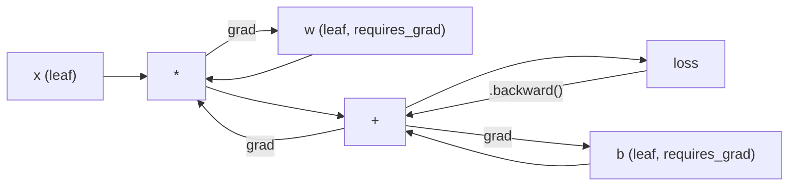
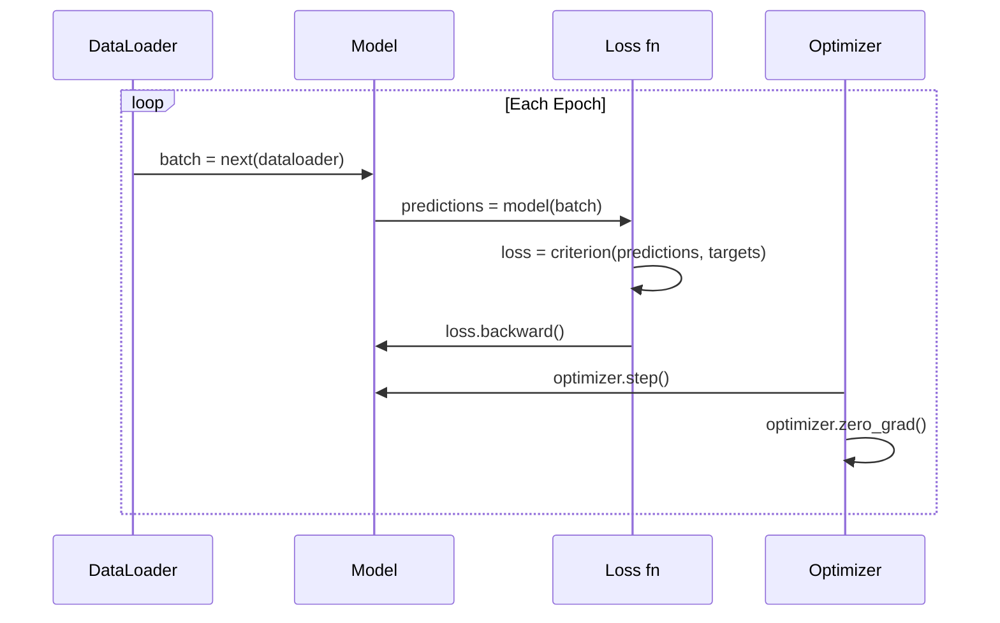

# PyTorch 입문 (Introduction to PyTorch)

> 피스톤과 크랭크축으로 엔진을 직접 만들어 봤다. 이제 세상 모두가 실제로 모는 차를 배울 차례다.

**Type:** Build
**Languages:** Python
**Prerequisites:** Lesson 03.10 (Build Your Own Mini Framework)
**Time:** ~75분

## 학습 목표 (Learning Objectives)

- PyTorch의 nn.Module, nn.Sequential, 자동 미분(autograd)을 사용해 신경망(neural network)을 만들고 학습시키기
- PyTorch 텐서(tensor), GPU 가속, 그리고 표준 학습 루프(zero_grad, forward, loss, backward, step) 사용하기
- 밑바닥부터 만든 미니 프레임워크 컴포넌트를 그에 대응하는 PyTorch로 변환하기
- 같은 과제에서 순수 Python 프레임워크와 PyTorch의 학습 속도를 프로파일링하고 비교하기

## 문제 (The Problem)

이제 작동하는 미니 프레임워크가 손에 있다. Linear 층(layer), ReLU, 드롭아웃(dropout), 배치 정규화(batch norm), Adam, DataLoader, 학습 루프. 이 프레임워크는 원 분류(circle classification) 문제에 4층 신경망을 순수 Python으로 학습시킨다.

그런데 같은 문제에서 PyTorch보다 500배 느리다.

미니 프레임워크는 중첩된 Python 루프로 한 번에 한 샘플씩 처리한다. PyTorch는 같은 연산을 GPU에서 돌아가는 최적화된 C++/CUDA 커널에 디스패치한다. 단일 NVIDIA A100에서 PyTorch는 ImageNet(128만 장의 이미지)에 ResNet-50(2,560만 파라미터(parameter))을 약 6시간에 학습시킨다. 같은 과제를 미니 프레임워크로 돌리면 대략 3,000시간이 걸린다. 메모리가 먼저 동나지 않는다면 말이다.

속도가 유일한 격차는 아니다. 미니 프레임워크에는 GPU 지원이 없다. 자동 미분도 없어서 모든 모듈에 대해 backward()를 손으로 작성했다. 직렬화가 없다. 분산 학습이 없다. 혼합 정밀도(mixed precision)가 없다. print 문 없이 그래디언트(gradient) 흐름을 디버깅할 방법이 없다.

PyTorch는 이 모든 격차를 메운다. 그것도 이미 익힌 바로 그 멘탈 모델을 그대로 유지한 채로 메운다: Module, forward(), parameters(), backward(), optimizer.step(). 개념이 일대일로 전이된다. 문법이 거의 동일하다. 차이라면, PyTorch가 밑바닥부터 직접 설계한 그 인터페이스 뒤에 10년의 시스템 엔지니어링을 감싸 놓았다는 것이다.

## 개념 (The Concept)

### 왜 PyTorch가 이겼는가

2015년, TensorFlow는 무언가를 실행하기 전에 정적 계산 그래프(static computation graph)를 정의하도록 요구했다. 그래프를 만들고, 컴파일하고, 그다음 데이터를 흘려보냈다. 디버깅은 그래프 시각화를 노려보는 것이었다. 아키텍처를 바꾸는 것은 그래프를 밑바닥부터 다시 만드는 것이었다.

PyTorch는 2017년에 다른 철학으로 출범했다: 즉시 실행(eager execution). Python을 쓰면 그대로 즉시 돌아간다. `y = model(x)`는 "나중에 y를 계산할 노드를 그래프에 추가"하는 게 아니라 지금 당장 y를 실제로 계산한다. 표준 Python 디버깅 도구가 작동한다는 뜻이었다. print()가 작동했다. pdb가 작동했다. 순방향 패스(forward pass)의 if/else가 작동했다.

2020년에 이르러 시장이 답했다. ML 연구 논문에서 PyTorch의 점유율은 7%(2017)에서 75% 이상(2022)으로 올라갔다. Meta, Google DeepMind, OpenAI, Anthropic, Hugging Face 모두 PyTorch를 주력 프레임워크로 쓴다. TensorFlow 2.x는 이에 대응해 즉시 실행을 채택했는데, PyTorch의 설계가 옳았다는 암묵적 인정이다.

교훈은 이렇다. 개발자 경험은 복리로 쌓인다. 10% 더 느리지만 디버깅이 50% 더 빠른 프레임워크가 매번 이긴다.

### 텐서 (Tensors)

텐서는 세 가지 결정적 속성을 가진 다차원 배열이다: 형태(shape), dtype, 디바이스(device).

```python
import torch

x = torch.zeros(3, 4)           # shape: (3, 4), dtype: float32, device: cpu
x = torch.randn(2, 3, 224, 224) # batch of 2 RGB images, 224x224
x = torch.tensor([1, 2, 3])     # from a Python list
```

**형태(shape)**는 차원성이다. 스칼라는 형태 (), 벡터(vector)는 (n,), 행렬(matrix)은 (m, n), 이미지 배치는 (batch, channels, height, width)다.

**Dtype**은 정밀도와 메모리를 제어한다.

| dtype | 비트 | 범위 | 용도 |
|-------|------|-------|----------|
| float32 | 32 | 약 7자리 십진수 | 기본 학습 |
| float16 | 16 | 약 3.3자리 십진수 | 혼합 정밀도 |
| bfloat16 | 16 | float32와 같은 범위, 낮은 정밀도 | LLM 학습 |
| int8 | 8 | -128 ~ 127 | 양자화 추론 |

**디바이스(device)**는 계산이 어디서 일어나는지를 결정한다.

```python
device = torch.device("cuda" if torch.cuda.is_available() else "cpu")
x = torch.randn(3, 4, device=device)
x = x.to("cuda")
x = x.cpu()
```

모든 연산은 모든 텐서가 같은 디바이스에 있기를 요구한다. 초보자가 부딪히는 1순위 PyTorch 오류가 여기서 나온다: `RuntimeError: Expected all tensors to be on the same device`. 계산 전에 모든 것을 같은 디바이스로 옮기면 고쳐진다.

**리셰이핑(reshaping)**은 상수 시간이다. 데이터가 아니라 메타데이터를 바꾸기 때문이다.

```python
x = torch.randn(2, 3, 4)
x.view(2, 12)      # reshape to (2, 12) -- must be contiguous
x.reshape(6, 4)    # reshape to (6, 4) -- works always
x.permute(2, 0, 1) # reorder dimensions
x.unsqueeze(0)     # add dimension: (1, 2, 3, 4)
x.squeeze()        # remove size-1 dimensions
```

### 자동 미분 (Autograd)

미니 프레임워크는 모든 모듈에 대해 backward()를 구현하도록 요구했다. PyTorch는 그렇지 않다. 텐서에 대한 모든 연산을 방향성 비순환 그래프(directed acyclic graph, 계산 그래프(computational graph))에 기록한 뒤, 그 그래프를 역방향으로 순회하여 그래디언트를 자동으로 계산한다.



미니 프레임워크와의 핵심 차이는 이렇다. PyTorch는 테이프 기반 자동 미분(tape-based autodiff)을 쓴다. 모든 연산이 순방향 패스 동안 "테이프"에 덧붙는다. `.backward()`를 호출하면 테이프를 역방향으로 재생한다.

```python
x = torch.randn(3, requires_grad=True)
y = x ** 2 + 3 * x
z = y.sum()
z.backward()
print(x.grad)  # dz/dx = 2x + 3
```

자동 미분의 세 가지 규칙:

1. `requires_grad=True`인 리프(leaf) 텐서만 그래디언트를 누적한다
2. 그래디언트는 기본적으로 누적되므로, 매 역방향 패스 전에 `optimizer.zero_grad()`를 호출하라
3. `torch.no_grad()`는 그래디언트 추적을 끈다(평가 중에 사용)

### nn.Module

`nn.Module`은 PyTorch의 모든 신경망 컴포넌트의 베이스 클래스다. 이 추상화는 이미 Lesson 10에서 직접 만들어 봤다. PyTorch의 버전은 여기에 자동 파라미터 등록, 재귀적 모듈 발견, 디바이스 관리, state dict 직렬화를 더한다.

```python
import torch.nn as nn

class MLP(nn.Module):
    def __init__(self, input_dim, hidden_dim, output_dim):
        super().__init__()
        self.layer1 = nn.Linear(input_dim, hidden_dim)
        self.relu = nn.ReLU()
        self.layer2 = nn.Linear(hidden_dim, output_dim)

    def forward(self, x):
        x = self.layer1(x)
        x = self.relu(x)
        x = self.layer2(x)
        return x
```

`__init__`에서 `nn.Module`이나 `nn.Parameter`를 속성으로 할당하면 PyTorch가 자동으로 등록한다. `model.parameters()`는 등록된 모든 파라미터를 재귀적으로 모은다. 미니 프레임워크에서처럼 가중치(weight)를 수동으로 모을 필요가 전혀 없는 이유가 여기에 있다.

핵심 빌딩 블록:

| 모듈 | 하는 일 | 파라미터 |
|--------|-------------|------------|
| nn.Linear(in, out) | Wx + b | in*out + out |
| nn.Conv2d(in_ch, out_ch, k) | 2D 합성곱 | in_ch*out_ch*k*k + out_ch |
| nn.BatchNorm1d(features) | 활성값 정규화 | 2 * features |
| nn.Dropout(p) | 무작위 0 만들기 | 0 |
| nn.ReLU() | max(0, x) | 0 |
| nn.GELU() | 가우시안 오차 선형 | 0 |
| nn.Embedding(vocab, dim) | 룩업 테이블 | vocab * dim |
| nn.LayerNorm(dim) | 샘플별 정규화 | 2 * dim |

### 손실 함수와 옵티마이저

앞서 직접 만든 모든 것의 프로덕션(production)용 버전을 PyTorch가 그대로 제공한다.

**손실 함수(loss function)** (`torch.nn`에서):

| 손실 | 작업 | 입력 |
|------|------|-------|
| nn.MSELoss() | 회귀 | 임의 형태 |
| nn.CrossEntropyLoss() | 다중 클래스 분류 | 로짓 (소프트맥스 아님) |
| nn.BCEWithLogitsLoss() | 이진 분류 | 로짓 (시그모이드 아님) |
| nn.L1Loss() | 회귀 (강건) | 임의 형태 |
| nn.CTCLoss() | 시퀀스 정렬 | 로그 확률 |

참고: `CrossEntropyLoss`는 내부적으로 `LogSoftmax` + `NLLLoss`를 결합한다. 소프트맥스(softmax) 출력이 아니라 원시 로짓(logit)을 넘겨라. 이것은 조용히 잘못된 그래디언트를 만드는 흔한 실수다.

**옵티마이저(optimizer)** (`torch.optim`에서):

| 옵티마이저 | 언제 쓰는가 | 일반적인 LR |
|-----------|-------------|-----------|
| SGD(params, lr, momentum) | CNN, 잘 튜닝된 파이프라인 | 0.01--0.1 |
| Adam(params, lr) | 기본 출발점 | 1e-3 |
| AdamW(params, lr, weight_decay) | 트랜스포머, 파인튜닝 | 1e-4--1e-3 |
| LBFGS(params) | 소규모, 2차 방법 | 1.0 |

### 학습 루프

모든 PyTorch 학습 루프는 같은 5단계 패턴을 따른다. 이미 Lesson 10에서 익힌 패턴이다.



정석 패턴:

```python
for epoch in range(num_epochs):
    model.train()
    for inputs, targets in train_loader:
        inputs, targets = inputs.to(device), targets.to(device)
        optimizer.zero_grad()
        outputs = model(inputs)
        loss = criterion(outputs, targets)
        loss.backward()
        optimizer.step()
```

배치 루프 안의 다섯 줄. GPT-4, Stable Diffusion, LLaMA를 학습시킨 다섯 줄. 아키텍처가 바뀐다. 데이터가 바뀐다. 이 다섯 줄은 바뀌지 않는다.

### Dataset과 DataLoader

PyTorch의 `Dataset`은 두 메서드를 가진 추상 클래스다: `__len__`과 `__getitem__`. `DataLoader`는 그것을 배치 처리, 셔플링, 다중 프로세스 데이터 로딩으로 감싼다.

```python
from torch.utils.data import Dataset, DataLoader

class MNISTDataset(Dataset):
    def __init__(self, images, labels):
        self.images = images
        self.labels = labels

    def __len__(self):
        return len(self.labels)

    def __getitem__(self, idx):
        return self.images[idx], self.labels[idx]

loader = DataLoader(dataset, batch_size=64, shuffle=True, num_workers=4)
```

`num_workers=4`는 GPU가 현재 배치를 학습하는 동안 데이터를 병렬로 로드할 4개의 프로세스를 띄운다. 디스크 바운드 작업(큰 이미지, 오디오)에서는, 이것만으로 학습 속도를 두 배로 만들 수 있다.

### GPU 학습

모델을 GPU로 옮기기:

```python
device = torch.device("cuda" if torch.cuda.is_available() else "cpu")
model = model.to(device)
```

이것은 모든 파라미터와 버퍼를 재귀적으로 GPU로 옮긴다. 그다음 학습 중에 각 배치를 옮긴다:

```python
inputs, targets = inputs.to(device), targets.to(device)
```

**혼합 정밀도(mixed precision)**는 마스터 가중치를 float32로 유지하면서 순방향/역방향을 float16으로 돌려, 현대 GPU(A100, H100, RTX 4090)에서 메모리 사용량을 절반으로, 처리량(throughput)을 두 배로 만든다.

```python
from torch.amp import autocast, GradScaler

scaler = GradScaler()
for inputs, targets in loader:
    with autocast(device_type="cuda"):
        outputs = model(inputs)
        loss = criterion(outputs, targets)
    scaler.scale(loss).backward()
    scaler.step(optimizer)
    scaler.update()
    optimizer.zero_grad()
```

### 비교: 미니 프레임워크 대 PyTorch 대 JAX

| 특징 | 미니 프레임워크 (L10) | PyTorch | JAX |
|---------|---------------------|---------|-----|
| 자동 미분 | 수동 backward() | 테이프 기반 autograd | 함수형 변환 |
| 실행 | 즉시 실행 (Python 루프) | 즉시 실행 (C++ 커널) | 추적 + JIT 컴파일 |
| GPU 지원 | 없음 | 있음 (CUDA, ROCm, MPS) | 있음 (CUDA, TPU) |
| 속도 (MNIST MLP) | 약 300초/에폭 | 약 0.5초/에폭 | 약 0.3초/에폭 |
| 모듈 시스템 | 커스텀 Module 클래스 | nn.Module | 무상태 함수 (Flax/Equinox) |
| 디버깅 | print() | print(), pdb, breakpoint() | 더 어려움 (JIT 추적이 print를 깨뜨림) |
| 생태계 | 없음 | Hugging Face, Lightning, timm | Flax, Optax, Orbax |
| 학습 곡선 | 직접 만들었음 | 보통 | 가파름 (함수형 패러다임) |
| 프로덕션 사용 | 장난감 문제 | Meta, OpenAI, Anthropic, HF | Google DeepMind, Midjourney |

## 직접 만들기 (Build It)

오직 PyTorch 기본 요소만 써서 MNIST에 학습시킨 3층 MLP다. 고수준 래퍼 없음. `torchvision.datasets` 없음. 원시 데이터를 직접 내려받고 파싱한다.

### 1단계: 원시 파일에서 MNIST 로드하기

MNIST는 4개의 gzip 파일로 제공된다: 학습 이미지(60,000 x 28 x 28), 학습 레이블(label), 테스트 이미지(10,000 x 28 x 28), 테스트 레이블. 우리는 그것들을 내려받고 이진 형식을 파싱한다.

```python
import torch
import torch.nn as nn
import struct
import gzip
import urllib.request
import os

def download_mnist(path="./mnist_data"):
    base_url = "https://storage.googleapis.com/cvdf-datasets/mnist/"
    files = [
        "train-images-idx3-ubyte.gz",
        "train-labels-idx1-ubyte.gz",
        "t10k-images-idx3-ubyte.gz",
        "t10k-labels-idx1-ubyte.gz",
    ]
    os.makedirs(path, exist_ok=True)
    for f in files:
        filepath = os.path.join(path, f)
        if not os.path.exists(filepath):
            urllib.request.urlretrieve(base_url + f, filepath)

def load_images(filepath):
    with gzip.open(filepath, "rb") as f:
        magic, num, rows, cols = struct.unpack(">IIII", f.read(16))
        data = f.read()
        images = torch.frombuffer(bytearray(data), dtype=torch.uint8)
        images = images.reshape(num, rows * cols).float() / 255.0
    return images

def load_labels(filepath):
    with gzip.open(filepath, "rb") as f:
        magic, num = struct.unpack(">II", f.read(8))
        data = f.read()
        labels = torch.frombuffer(bytearray(data), dtype=torch.uint8).long()
    return labels
```

### 2단계: 모델 정의하기

3층 MLP: 784 -> 256 -> 128 -> 10. ReLU 활성화. 정규화(regularization)를 위한 드롭아웃. 단순하게 유지하기 위해 배치 정규화는 없다.

```python
class MNISTModel(nn.Module):
    def __init__(self):
        super().__init__()
        self.net = nn.Sequential(
            nn.Linear(784, 256),
            nn.ReLU(),
            nn.Dropout(0.2),
            nn.Linear(256, 128),
            nn.ReLU(),
            nn.Dropout(0.2),
            nn.Linear(128, 10),
        )

    def forward(self, x):
        return self.net(x)
```

출력층은 10개의 원시 로짓(숫자마다 하나)을 만든다. 소프트맥스는 없다. `CrossEntropyLoss`가 내부적으로 처리하기 때문이다.

파라미터 수: 784*256 + 256 + 256*128 + 128 + 128*10 + 10 = 235,146. 현대 기준으로 아주 작다. GPT-2 small은 1억 2,400만 개를 가진다. 이것은 몇 초 만에 학습된다.

### 3단계: 학습 루프

정석 forward-loss-backward-step 패턴이다.

```python
def train_one_epoch(model, loader, criterion, optimizer, device):
    model.train()
    total_loss = 0
    correct = 0
    total = 0
    for images, labels in loader:
        images, labels = images.to(device), labels.to(device)
        optimizer.zero_grad()
        outputs = model(images)
        loss = criterion(outputs, labels)
        loss.backward()
        optimizer.step()
        total_loss += loss.item() * images.size(0)
        _, predicted = outputs.max(1)
        correct += predicted.eq(labels).sum().item()
        total += labels.size(0)
    return total_loss / total, correct / total


def evaluate(model, loader, criterion, device):
    model.eval()
    total_loss = 0
    correct = 0
    total = 0
    with torch.no_grad():
        for images, labels in loader:
            images, labels = images.to(device), labels.to(device)
            outputs = model(images)
            loss = criterion(outputs, labels)
            total_loss += loss.item() * images.size(0)
            _, predicted = outputs.max(1)
            correct += predicted.eq(labels).sum().item()
            total += labels.size(0)
    return total_loss / total, correct / total
```

평가 중에 쓰는 `torch.no_grad()`를 눈여겨보라. 자동 미분을 꺼서 메모리 사용량을 줄이고 추론(inference)을 빠르게 한다. 이것이 없으면 PyTorch는 끝내 쓰지도 않을 계산 그래프를 만든다.

### 4단계: 모든 것을 함께 엮기

```python
def main():
    device = torch.device("cuda" if torch.cuda.is_available() else "cpu")

    download_mnist()
    train_images = load_images("./mnist_data/train-images-idx3-ubyte.gz")
    train_labels = load_labels("./mnist_data/train-labels-idx1-ubyte.gz")
    test_images = load_images("./mnist_data/t10k-images-idx3-ubyte.gz")
    test_labels = load_labels("./mnist_data/t10k-labels-idx1-ubyte.gz")

    train_dataset = torch.utils.data.TensorDataset(train_images, train_labels)
    test_dataset = torch.utils.data.TensorDataset(test_images, test_labels)
    train_loader = torch.utils.data.DataLoader(
        train_dataset, batch_size=64, shuffle=True
    )
    test_loader = torch.utils.data.DataLoader(
        test_dataset, batch_size=256, shuffle=False
    )

    model = MNISTModel().to(device)
    criterion = nn.CrossEntropyLoss()
    optimizer = torch.optim.Adam(model.parameters(), lr=1e-3)

    num_params = sum(p.numel() for p in model.parameters())
    print(f"Device: {device}")
    print(f"Parameters: {num_params:,}")
    print(f"Train samples: {len(train_dataset):,}")
    print(f"Test samples: {len(test_dataset):,}")
    print()

    for epoch in range(10):
        train_loss, train_acc = train_one_epoch(
            model, train_loader, criterion, optimizer, device
        )
        test_loss, test_acc = evaluate(
            model, test_loader, criterion, device
        )
        print(
            f"Epoch {epoch+1:2d} | "
            f"Train Loss: {train_loss:.4f} | Train Acc: {train_acc:.4f} | "
            f"Test Loss: {test_loss:.4f} | Test Acc: {test_acc:.4f}"
        )

    torch.save(model.state_dict(), "mnist_mlp.pt")
    print(f"\nModel saved to mnist_mlp.pt")
    print(f"Final test accuracy: {test_acc:.4f}")
```

10 에폭(epoch) 후 예상 출력: ~97.8% 테스트 정확도. CPU에서의 학습 시간: ~30초. GPU에서: ~5초. 같은 아키텍처를 미니 프레임워크로 돌리면: ~45분.

## 라이브러리로 써보기 (Use It)

### 빠른 비교: 미니 프레임워크 대 PyTorch

| 미니 프레임워크 (Lesson 10) | PyTorch |
|---------------------------|---------|
| `model = Sequential(Linear(784, 256), ReLU(), ...)` | `model = nn.Sequential(nn.Linear(784, 256), nn.ReLU(), ...)` |
| `pred = model.forward(x)` | `pred = model(x)` |
| `optimizer.zero_grad()` | `optimizer.zero_grad()` |
| `grad = criterion.backward()` 그다음 `model.backward(grad)` | `loss.backward()` |
| `optimizer.step()` | `optimizer.step()` |
| GPU 없음 | `model.to("cuda")` |
| 모든 모듈에 대해 수동 backward | Autograd가 모든 것을 처리함 |

인터페이스는 거의 동일하다. 차이는 그 안쪽, 즉 내부 동작 전체에 있다.

### 모델 저장과 로드

```python
torch.save(model.state_dict(), "model.pt")

model = MNISTModel()
model.load_state_dict(torch.load("model.pt", weights_only=True))
model.eval()
```

모델 객체가 아니라 항상 `state_dict()`(파라미터 딕셔너리)를 저장하라. 모델 객체를 저장하면 pickle을 쓰는데, 코드를 리팩터링하면 깨진다. State dict는 이식 가능하다.

### 학습률 스케줄링

```python
scheduler = torch.optim.lr_scheduler.CosineAnnealingLR(
    optimizer, T_max=10
)
for epoch in range(10):
    train_one_epoch(model, train_loader, criterion, optimizer, device)
    scheduler.step()
```

PyTorch는 15개 이상의 스케줄러를 제공한다: StepLR, ExponentialLR, CosineAnnealingLR, OneCycleLR, ReduceLROnPlateau. 모두 같은 옵티마이저 인터페이스에 꽂힌다.

## 산출물 (Ship It)

이 레슨은 두 가지 산출물을 만든다.

- `outputs/prompt-pytorch-debugger.md` -- 흔한 PyTorch 학습 실패를 진단하기 위한 프롬프트
- `outputs/skill-pytorch-patterns.md` -- PyTorch 학습 패턴을 위한 스킬 레퍼런스

## 연습 문제 (Exercises)

1. **배치 정규화 추가하기.** 각 선형 층 뒤(활성화 앞)에 `nn.BatchNorm1d`를 삽입하라. 드롭아웃만 쓴 버전과 테스트 정확도 및 학습 속도를 비교하라. 배치 정규화는 더 적은 에폭으로 98% 이상에 도달해야 한다.

2. **학습률 파인더 구현하기.** 학습률을 지수적으로 늘리면서(1e-7에서 1.0까지) 한 에폭 학습하라. 손실 대 LR을 그려라. 최적 LR은 손실이 오르기 시작하기 직전이다. 이를 사용해 MNIST 모델에 더 나은 LR을 골라라.

3. **혼합 정밀도로 GPU에 이식하기.** 학습 루프에 `torch.amp.autocast`와 `GradScaler`를 추가하라. GPU에서 혼합 정밀도가 있을 때와 없을 때의 처리량(초당 샘플)을 측정하라. A100에서는 ~2배 속도 향상을 예상하라.

4. **커스텀 Dataset 만들기.** Fashion-MNIST(MNIST와 같은 형식이지만 의류 항목)를 내려받아라. `__getitem__`과 `__len__`을 가진 `FashionMNISTDataset(Dataset)` 클래스를 구현하라. 같은 MLP를 학습시키고 정확도를 비교하라. Fashion-MNIST는 더 어렵다. ~98% 대 ~88% 정도를 예상하라.

5. **Adam을 SGD + 모멘텀으로 바꾸기.** `SGD(params, lr=0.01, momentum=0.9)`로 학습하라. 수렴(convergence) 곡선을 비교하라. 그다음 `CosineAnnealingLR` 스케줄러를 추가하고 SGD가 에폭 10까지 Adam을 따라잡는지 보라.

## 핵심 용어 (Key Terms)

| 용어 | 흔히 하는 말 | 실제 의미 |
|------|----------------|----------------------|
| 텐서(Tensor) | "다차원 배열" | 모든 연산에 자동 미분 지원이 박혀 있는, 타입과 디바이스를 아는 배열 |
| Autograd | "자동 역전파" | 순방향 패스 동안 연산을 기록한 뒤, 정확한 그래디언트를 계산하기 위해 역방향으로 재생하는 테이프 기반 시스템 |
| nn.Module | "층" | 모든 미분 가능한 계산 블록의 베이스 클래스 -- 파라미터를 등록하고, 중첩을 지원하며, 학습/평가 모드를 처리함 |
| state_dict | "모델 가중치" | 파라미터 이름을 텐서로 매핑하는 OrderedDict -- 학습된 모델의 이식 가능하고 직렬화 가능한 표현 |
| .backward() | "그래디언트 계산" | 계산 그래프를 역방향으로 순회하며, requires_grad=True인 모든 리프 텐서에 대해 그래디언트를 계산하고 누적함 |
| .to(device) | "GPU로 옮기기" | 모든 파라미터와 버퍼를 지정된 디바이스(CPU, CUDA, MPS)로 재귀적으로 전송함 |
| DataLoader | "데이터 파이프라인" | Dataset에서 데이터 로딩을 배치하고, 섞고, 선택적으로 병렬화하는 이터레이터 |
| 혼합 정밀도(Mixed precision) | "float16 쓰기" | 수치 안정성을 위해 float32 마스터 가중치를 유지하면서 속도를 위해 float16 순방향/역방향으로 학습함 |
| 즉시 실행(Eager execution) | "지금 실행하기" | 연산이 나중의 컴파일 단계로 미뤄지지 않고 호출될 때 즉시 실행됨 -- PyTorch를 TF 1.x와 구별하는 핵심 설계 선택 |
| zero_grad | "그래디언트 재설정" | PyTorch가 기본적으로 그래디언트를 누적하므로, 다음 역방향 패스 전에 모든 파라미터 그래디언트를 0으로 설정함 |

## 더 읽을거리 (Further Reading)

- Paszke et al., "PyTorch: An Imperative Style, High-Performance Deep Learning Library" (2019) -- PyTorch의 설계 트레이드오프를 설명한 원조 논문
- PyTorch Tutorials: "Learning PyTorch with Examples" (https://pytorch.org/tutorials/beginner/pytorch_with_examples.html) -- 텐서에서 nn.Module까지의 공식 경로
- PyTorch Performance Tuning Guide (https://pytorch.org/tutorials/recipes/recipes/tuning_guide.html) -- 혼합 정밀도, DataLoader 워커, 고정 메모리(pinned memory), 기타 프로덕션 최적화
- Horace He, "Making Deep Learning Go Brrrr" (https://horace.io/brrr_intro.html) -- GPU 학습이 빠른 이유, PyTorch 특유의 최적화 전략과 함께
