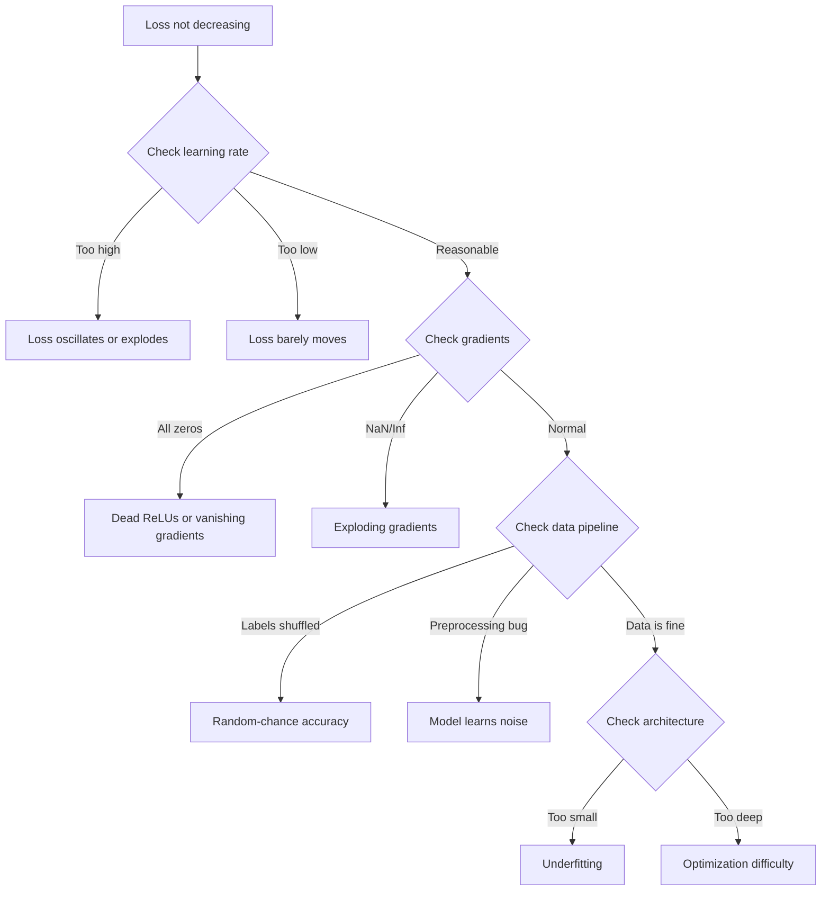
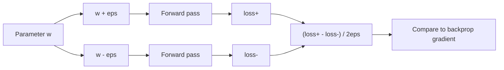
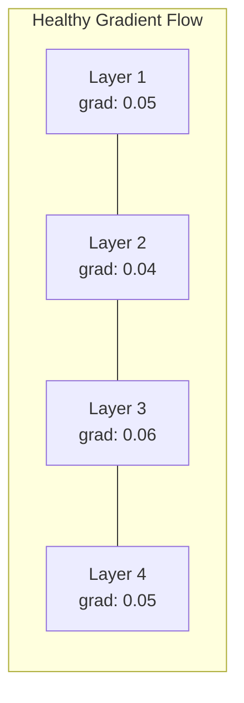
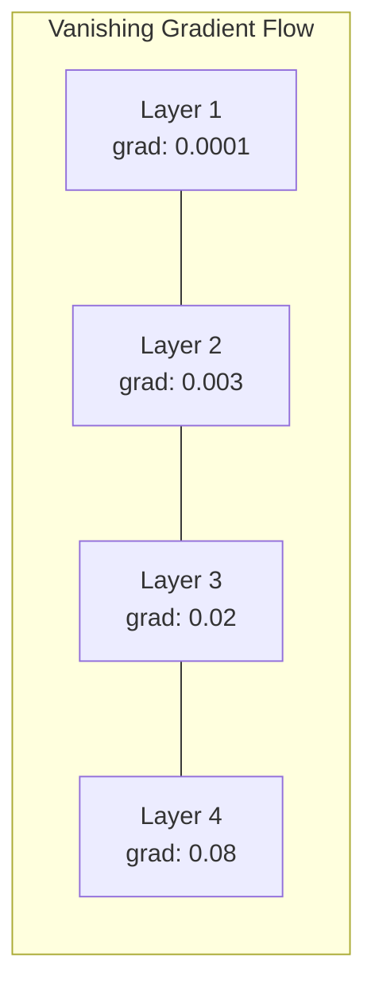
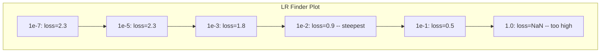

# 신경망 디버깅 (Debugging Neural Networks)

> 신경망(neural network)이 컴파일되었다. 실행되었다. 숫자를 하나 내놓았다. 그 숫자는 틀렸는데 아무것도 크래시하지 않았다. 가장 어려운 종류의 디버깅, 곧 오류 메시지가 없는 디버깅에 온 것을 환영한다.

**Type:** Practice
**Languages:** Python, PyTorch
**Prerequisites:** Phase 03 Lessons 01-10 (특히 역전파, 손실 함수, 옵티마이저)
**Time:** ~90분

## 학습 목표 (Learning Objectives)

- 체계적인 디버깅 전략을 사용해 흔한 신경망 실패(NaN 손실, 평평한 손실 곡선, 과적합, 진동)를 진단하기
- "한 배치 과적합(overfit one batch)" 기법을 적용해 모델 아키텍처와 학습 루프가 올바른지 검증하기
- 그래디언트(gradient) 크기, 활성값 분포, 가중치(weight) 노름을 검사해 기울기 소실(vanishing gradient)/그래디언트 폭발(exploding gradient) 문제 식별하기
- 데이터 파이프라인, 모델 아키텍처, 손실 함수, 옵티마이저, 학습률(learning rate) 문제를 다루는 디버깅 체크리스트 구축하기

## 문제 (The Problem)

전통적인 소프트웨어는 고장 나면 크래시한다. 널 포인터(null pointer)는 예외를 던진다. 타입 불일치는 컴파일 시점에 실패한다. 오프바이원(off-by-one) 오류는 명백히 틀린 출력을 만든다.

신경망은 그런 호사를 주지 않는다.

고장 난 신경망은 끝까지 실행되고, 손실(loss) 값을 출력하고, 예측을 내놓는다. 손실은 감소하기도 한다. 예측은 그럴듯해 보이기도 한다. 하지만 모델은 조용히 틀려 있다. 지름길을 학습하거나, 잡음을 암기하거나, 쓸모없는 국소 최솟값(local minimum)으로 수렴(convergence)한다. Google 연구자들은 ML 디버깅 시간의 60-70%가 오류를 내지 않으면서 모델 품질을 떨어뜨리는 "조용한(silent)" 버그에 쓰인다고 추정했다.

작동하는 모델과 고장 난 모델의 차이는 흔히 잘못 놓인 단 한 줄이다. 빠진 `zero_grad()`, 전치된 차원, 10배 어긋난 학습률 같은 것들이다. 전형적인 "Recipe for Training Neural Networks" (2019)는 이렇게 시작한다: "가장 흔한 신경망 실수는 크래시하지 않는 버그다."

이 레슨은 그런 버그를 찾는 법을 가르친다.

## 개념 (The Concept)

### 디버깅 마인드셋 (The Debugging Mindset)

print하고 기도하는 디버깅은 잊어라. 신경망 디버깅은 체계적인 접근이 필요한데, 피드백 루프가 느리고(학습 실행당 수 분에서 수 시간) 증상이 모호하기 때문이다(나쁜 손실은 20가지 다른 것을 의미한다).

황금률: **단순하게 시작하고, 한 번에 한 조각씩 복잡도를 더하며, 각 조각을 독립적으로 검증하라.**



### 증상 1: 손실이 감소하지 않음 (Symptom 1: Loss Not Decreasing)

이것이 가장 흔한 불만이다. 학습 루프가 돌고, 에폭(epoch)이 흘러가는데, 손실은 평평하게 머물거나 격렬하게 진동한다.

**잘못된 학습률.** 너무 높음: 손실이 진동하거나 NaN으로 뛴다. 너무 낮음: 손실이 너무 느리게 감소해 평평해 보인다. Adam은 1e-3에서 시작하라. SGD는 1e-1이나 1e-2에서 시작하라. 다른 무언가가 잘못됐다고 결론짓기 전에 항상 각각 10배 차이의 학습률 3개(예: 1e-2, 1e-3, 1e-4)를 시도하라.

**죽은 ReLU(Dead ReLUs).** ReLU 뉴런이 큰 음수 입력을 받으면 0을 출력하고 그래디언트도 0이다. 다시는 활성화되지 않는다. 충분히 많은 뉴런이 죽으면 네트워크는 학습하지 못한다. 확인: 각 ReLU 층(layer) 뒤에서 정확히 0인 활성값의 비율을 출력하라. 50% 이상이 죽었다면 LeakyReLU로 전환하거나 학습률을 낮춰라.

**기울기 소실(Vanishing gradients).** 시그모이드(sigmoid)나 tanh 활성화(activation)를 쓰는 깊은 네트워크에서, 그래디언트는 역방향으로 전파되며 지수적으로 작아진다. 첫 번째 층에 도달할 즈음에는 약 0이다. 첫 층들이 학습을 멈춘다. 해결책: ReLU/GELU 사용, 잔차 연결(residual connection) 추가, 또는 배치 정규화(batch normalization) 사용.

**그래디언트 폭발(Exploding gradients).** 반대 문제로, 그래디언트가 지수적으로 커진다. RNN과 아주 깊은 네트워크에서 흔하다. 손실이 NaN으로 뛴다. 해결책: 그래디언트 클리핑(gradient clipping)(`torch.nn.utils.clip_grad_norm_`), 학습률 낮추기, 또는 정규화(normalization) 추가.

### 증상 2: 손실은 감소하지만 모델이 나쁨 (Symptom 2: Loss Decreasing But Model is Bad)

손실이 내려간다. 학습 정확도가 99%에 도달한다. 하지만 테스트 정확도는 55%다. 또는 모델이 실제 데이터에서 말이 안 되는 출력을 내놓는다.

**과적합(Overfitting).** 모델이 패턴을 학습하는 대신 학습 데이터를 암기한다. 학습 손실과 검증 손실의 격차가 시간이 지나며 커진다. 해결책: 더 많은 데이터, 드롭아웃(dropout), 가중치 감쇠(weight decay), 조기 종료(early stopping), 데이터 증강(data augmentation).

**데이터 누설(Data leakage).** 테스트 데이터가 학습에 누설되었다. 정확도가 의심스럽게 높다. 흔한 원인: 분할 전에 섞기, 전체 데이터셋(dataset)의 통계로 전처리하기, 분할 간 중복 샘플. 해결책: 먼저 분할하고, 다음에 전처리하고, 중복을 확인하라.

**레이블 오류(Label errors).** 대부분의 실제 데이터셋에서 레이블(label)의 5-10%가 틀렸다(Northcutt et al., 2021 — "Pervasive Label Errors in Test Sets"). 모델이 잡음을 학습한다. 해결책: 확신 학습(confident learning)을 사용해 잘못 레이블된 예제를 찾아 고치거나, 손실 절단(loss truncation)을 사용해 높은 손실 샘플을 무시하라.

### 증상 3: 손실에 NaN 또는 Inf (Symptom 3: NaN or Inf in Loss)

손실 값이 `nan`이나 `inf`가 된다. 학습이 죽었다.

**학습률이 너무 높음.** 그래디언트 갱신이 너무 멀리 넘어가 가중치가 폭발한다. 해결책: 10배 줄여라.

**log(0) 또는 log(음수).** 교차 엔트로피(cross-entropy) 손실은 `log(p)`를 계산한다. 모델이 정확히 0이나 음의 확률을 출력하면 로그가 폭발한다. 해결책: 예측을 `[eps, 1-eps]`로 클램프(clamp)하라, 여기서 `eps=1e-7`.

**0으로 나누기.** 배치 정규화는 표준편차로 나눈다. 상수 값을 가진 배치는 std=0이다. 해결책: 분모에 엡실론(epsilon)을 더하라(PyTorch는 기본적으로 이렇게 하지만, 커스텀 구현은 그렇지 않을 수 있다).

**수치 오버플로(Numerical overflow).** 큰 활성값이 `exp()`에 들어가면 Inf를 만든다. 소프트맥스(softmax)가 특히 취약하다. 해결책: 지수화 전에 최댓값을 빼라(log-sum-exp 트릭).

### 기법 1: 그래디언트 검사 (Technique 1: Gradient Checking)

분석적 그래디언트(역전파에서 나온)를 수치적 그래디언트(유한 차분에서 나온)와 비교하라. 둘이 불일치하면 역방향 패스(backward pass)에 버그가 있다.

파라미터(parameter) `w`에 대한 수치적 그래디언트:

```
grad_numerical = (loss(w + eps) - loss(w - eps)) / (2 * eps)
```

일치 척도(상대 차이):

```
rel_diff = |grad_analytical - grad_numerical| / max(|grad_analytical|, |grad_numerical|, 1e-8)
```

`rel_diff < 1e-5`이면: 올바름. `rel_diff > 1e-3`이면: 거의 확실히 버그다.



### 기법 2: 활성값 통계 (Technique 2: Activation Statistics)

학습 중 각 층 뒤의 활성값의 평균과 표준편차를 모니터링하라. 건강한 네트워크는 평균이 0 근처이고 표준편차가 1 근처인(정규화 후) 활성값을, 또는 적어도 한계 지어진 활성값을 유지한다.

| 건강 지표 | 평균 | 표준편차 | 진단 |
|-----------------|------|-----|-----------|
| 건강함 | ~0 | ~1 | 네트워크가 정상적으로 학습 중 |
| 포화됨 | >>0 또는 <<0 | ~0 | 활성값이 극단값에 갇힘 |
| 죽음 | 0 | 0 | 뉴런이 죽음(전부 0) |
| 폭발 | >>10 | >>10 | 활성값이 한계 없이 커짐 |

### 기법 3: 그래디언트 흐름 시각화 (Technique 3: Gradient Flow Visualization)

각 층의 평균 그래디언트 크기를 플롯하라. 건강한 네트워크에서는 그래디언트 크기가 층 전반에 걸쳐 대체로 비슷해야 한다. 초기 층의 그래디언트가 후기 층보다 1000배 작다면, 기울기 소실이다.





### 기법 4: 한 배치 과적합 테스트 (Technique 4: The Overfit-One-Batch Test)

딥러닝에서 단연 가장 중요한 디버깅 기법이다.

작은 배치 하나(8-32 샘플)를 가져온다. 그것에 대해 100회 이상 반복하며 학습한다. 손실은 거의 0으로 가야 하고 학습 정확도는 100%에 도달해야 한다. 그렇지 않으면, 모델이나 학습 루프에 근본적인 버그가 있으니 전체 학습으로 진행하지 마라.

이 테스트가 잡아내는 것:
- 고장 난 손실 함수
- 고장 난 역방향 패스
- 데이터를 표현하기엔 너무 작은 아키텍처
- 모델 파라미터에 연결되지 않은 옵티마이저
- 데이터와 레이블의 어긋남

이것은 실행에 30초가 걸리고 전체 학습 실행을 디버깅하는 수 시간을 절약한다.

### 기법 5: 학습률 탐색기 (Technique 5: Learning Rate Finder)

Leslie Smith (2017)는 손실을 기록하면서 한 에폭에 걸쳐 학습률을 아주 작은 값(1e-7)부터 아주 큰 값(10)까지 쓸어보는 것을 제안했다. 손실 대 학습률을 플롯하라. 최적 학습률은 손실이 가장 빠르게 감소하기 시작하는 학습률보다 대략 10배 작다.



이 예에서 최선의 LR: 약 1e-3(가장 가파른 지점 한 자릿수 앞).

### 흔한 PyTorch 버그 (Common PyTorch Bugs)

이것들은 PyTorch 커뮤니티에서 가장 많은 집단적 시간을 낭비하는 버그들이다:

| 버그 | 증상 | 해결책 |
|-----|---------|-----|
| `optimizer.zero_grad()` 잊기 | 그래디언트가 배치 간에 누적, 손실이 진동 | `loss.backward()` 전에 `optimizer.zero_grad()` 추가 |
| 테스트 시 `model.eval()` 잊기 | 드롭아웃과 배치 정규화가 다르게 동작, 실행마다 테스트 정확도가 달라짐 | `model.eval()`과 `torch.no_grad()` 추가 |
| 잘못된 텐서 형태 | 조용한 브로드캐스팅이 잘못된 결과를 만듦, 오류 없음 | 디버깅 중 모든 연산 뒤에 형태를 출력 |
| CPU/GPU 불일치 | `RuntimeError: expected CUDA tensor` | 모델과 데이터 양쪽에 `.to(device)` 사용 |
| 텐서를 분리(detach)하지 않음 | 계산 그래프가 영원히 커짐, OOM | `.detach()`나 `with torch.no_grad()` 사용 |
| 인플레이스(in-place) 연산이 autograd를 깸 | `RuntimeError: modified by in-place operation` | `x += 1`을 `x = x + 1`로 교체 |
| 데이터가 정규화되지 않음 | 손실이 무작위 우연 수준에 갇힘 | 입력을 평균=0, 표준편차=1로 정규화 |
| 레이블이 잘못된 dtype | 교차 엔트로피는 `Long`을 기대하는데 `Float`을 받음 | 레이블 캐스팅: `labels.long()` |

### 마스터 디버깅 표 (The Master Debugging Table)

| 증상 | 가능성 높은 원인 | 가장 먼저 시도할 것 |
|---------|-------------|-------------------|
| 손실이 -log(1/num_classes)에 갇힘 | 모델이 균등 분포를 예측 | 데이터 파이프라인 확인, 레이블이 입력과 맞는지 검증 |
| 몇 스텝 후 손실 NaN | 학습률이 너무 높음 | LR을 10배 줄임 |
| 즉시 손실 NaN | log(0) 또는 0으로 나누기 | log/나누기 연산에 엡실론 추가 |
| 손실이 격렬하게 진동 | LR이 너무 높거나 배치 크기가 너무 작음 | LR 줄이기, 배치 크기 늘리기 |
| 손실이 감소하다 정체 | 파인튜닝(fine-tuning) 단계에 LR이 너무 높음 | LR 스케줄 추가(코사인 또는 스텝 감쇠) |
| 학습 정확도 높음, 테스트 정확도 낮음 | 과적합 | 드롭아웃, 가중치 감쇠, 더 많은 데이터 추가 |
| 학습 정확도 = 테스트 정확도 = 우연 | 모델이 아무것도 학습 안 함 | 한 배치 과적합 테스트 실행 |
| 학습 정확도 = 테스트 정확도지만 둘 다 낮음 | 과소적합(underfitting) | 더 큰 모델, 더 많은 층, 더 많은 특성 |
| 그래디언트가 모두 0 | 죽은 ReLU 또는 분리된 계산 그래프 | LeakyReLU로 전환, `.requires_grad` 확인 |
| 학습 중 메모리 부족 | 배치가 너무 크거나 그래프가 해제되지 않음 | 배치 크기 줄이기, 평가에 `torch.no_grad()` 사용 |

## 직접 만들기 (Build It)

활성값, 그래디언트, 손실 곡선을 모니터링하는 진단 도구상자다. 의도적으로 네트워크를 망가뜨리고 이 도구상자로 각 문제를 진단할 것이다.

### 1단계: NetworkDebugger 클래스 (Step 1: The NetworkDebugger Class)

PyTorch 모델에 후킹(hooking)하여 층별 활성값과 그래디언트 통계를 기록한다.

```python
import torch
import torch.nn as nn
import math


class NetworkDebugger:
    def __init__(self, model):
        self.model = model
        self.activation_stats = {}
        self.gradient_stats = {}
        self.loss_history = []
        self.lr_losses = []
        self.hooks = []
        self._register_hooks()

    def _register_hooks(self):
        for name, module in self.model.named_modules():
            if isinstance(module, (nn.Linear, nn.Conv2d, nn.ReLU, nn.LeakyReLU)):
                hook = module.register_forward_hook(self._make_activation_hook(name))
                self.hooks.append(hook)
                hook = module.register_full_backward_hook(self._make_gradient_hook(name))
                self.hooks.append(hook)

    def _make_activation_hook(self, name):
        def hook(module, input, output):
            with torch.no_grad():
                out = output.detach().float()
                self.activation_stats[name] = {
                    "mean": out.mean().item(),
                    "std": out.std().item(),
                    "fraction_zero": (out == 0).float().mean().item(),
                    "min": out.min().item(),
                    "max": out.max().item(),
                }
        return hook

    def _make_gradient_hook(self, name):
        def hook(module, grad_input, grad_output):
            if grad_output[0] is not None:
                with torch.no_grad():
                    grad = grad_output[0].detach().float()
                    self.gradient_stats[name] = {
                        "mean": grad.mean().item(),
                        "std": grad.std().item(),
                        "abs_mean": grad.abs().mean().item(),
                        "max": grad.abs().max().item(),
                    }
        return hook

    def record_loss(self, loss_value):
        self.loss_history.append(loss_value)

    def check_loss_health(self):
        if len(self.loss_history) < 2:
            return "NOT_ENOUGH_DATA"
        recent = self.loss_history[-10:]
        if any(math.isnan(v) or math.isinf(v) for v in recent):
            return "NAN_OR_INF"
        if len(self.loss_history) >= 20:
            first_half = sum(self.loss_history[:10]) / 10
            second_half = sum(self.loss_history[-10:]) / 10
            if second_half >= first_half * 0.99:
                return "NOT_DECREASING"
        if len(recent) >= 5:
            diffs = [recent[i+1] - recent[i] for i in range(len(recent)-1)]
            if max(diffs) - min(diffs) > 2 * abs(sum(diffs) / len(diffs)):
                return "OSCILLATING"
        return "HEALTHY"

    def check_activations(self):
        issues = []
        for name, stats in self.activation_stats.items():
            if stats["fraction_zero"] > 0.5:
                issues.append(f"DEAD_NEURONS: {name} has {stats['fraction_zero']:.0%} zero activations")
            if abs(stats["mean"]) > 10:
                issues.append(f"EXPLODING_ACTIVATIONS: {name} mean={stats['mean']:.2f}")
            if stats["std"] < 1e-6:
                issues.append(f"COLLAPSED_ACTIVATIONS: {name} std={stats['std']:.2e}")
        return issues if issues else ["HEALTHY"]

    def check_gradients(self):
        issues = []
        grad_magnitudes = []
        for name, stats in self.gradient_stats.items():
            grad_magnitudes.append((name, stats["abs_mean"]))
            if stats["abs_mean"] < 1e-7:
                issues.append(f"VANISHING_GRADIENT: {name} abs_mean={stats['abs_mean']:.2e}")
            if stats["abs_mean"] > 100:
                issues.append(f"EXPLODING_GRADIENT: {name} abs_mean={stats['abs_mean']:.2e}")
        if len(grad_magnitudes) >= 2:
            first_mag = grad_magnitudes[0][1]
            last_mag = grad_magnitudes[-1][1]
            if last_mag > 0 and first_mag / last_mag > 100:
                issues.append(f"GRADIENT_RATIO: first/last = {first_mag/last_mag:.0f}x (vanishing)")
        return issues if issues else ["HEALTHY"]

    def print_report(self):
        print("\n=== NETWORK DEBUGGER REPORT ===")
        print(f"\nLoss health: {self.check_loss_health()}")
        if self.loss_history:
            print(f"  Last 5 losses: {[f'{v:.4f}' for v in self.loss_history[-5:]]}")
        print("\nActivation diagnostics:")
        for item in self.check_activations():
            print(f"  {item}")
        print("\nGradient diagnostics:")
        for item in self.check_gradients():
            print(f"  {item}")
        print("\nPer-layer activation stats:")
        for name, stats in self.activation_stats.items():
            print(f"  {name}: mean={stats['mean']:.4f} std={stats['std']:.4f} zero={stats['fraction_zero']:.1%}")
        print("\nPer-layer gradient stats:")
        for name, stats in self.gradient_stats.items():
            print(f"  {name}: abs_mean={stats['abs_mean']:.2e} max={stats['max']:.2e}")

    def remove_hooks(self):
        for hook in self.hooks:
            hook.remove()
        self.hooks.clear()
```

### 2단계: 한 배치 과적합 테스트 (Step 2: The Overfit-One-Batch Test)

```python
def overfit_one_batch(model, x_batch, y_batch, criterion, lr=0.01, steps=200):
    optimizer = torch.optim.Adam(model.parameters(), lr=lr)
    model.train()
    print("\n=== OVERFIT ONE BATCH TEST ===")
    print(f"Batch size: {x_batch.shape[0]}, Steps: {steps}")

    for step in range(steps):
        optimizer.zero_grad()
        output = model(x_batch)
        loss = criterion(output, y_batch)
        loss.backward()
        optimizer.step()

        if step % 50 == 0 or step == steps - 1:
            with torch.no_grad():
                preds = (output > 0).float() if output.shape[-1] == 1 else output.argmax(dim=1)
                targets = y_batch if y_batch.dim() == 1 else y_batch.squeeze()
                acc = (preds.squeeze() == targets).float().mean().item()
            print(f"  Step {step:3d} | Loss: {loss.item():.6f} | Accuracy: {acc:.1%}")

    final_loss = loss.item()
    if final_loss > 0.1:
        print(f"\n  FAIL: Loss did not converge ({final_loss:.4f}). Model or training loop is broken.")
        return False
    print(f"\n  PASS: Loss converged to {final_loss:.6f}")
    return True
```

### 3단계: 학습률 탐색기 (Step 3: Learning Rate Finder)

```python
def find_learning_rate(model, x_data, y_data, criterion, start_lr=1e-7, end_lr=10, steps=100):
    import copy
    original_state = copy.deepcopy(model.state_dict())
    optimizer = torch.optim.SGD(model.parameters(), lr=start_lr)
    lr_mult = (end_lr / start_lr) ** (1 / steps)

    model.train()
    results = []
    best_loss = float("inf")
    current_lr = start_lr

    print("\n=== LEARNING RATE FINDER ===")

    for step in range(steps):
        optimizer.zero_grad()
        output = model(x_data)
        loss = criterion(output, y_data)

        if math.isnan(loss.item()) or loss.item() > best_loss * 10:
            break

        best_loss = min(best_loss, loss.item())
        results.append((current_lr, loss.item()))

        loss.backward()
        optimizer.step()

        current_lr *= lr_mult
        for param_group in optimizer.param_groups:
            param_group["lr"] = current_lr

    model.load_state_dict(original_state)

    if len(results) < 10:
        print("  Could not complete LR sweep -- loss diverged too quickly")
        return results

    min_loss_idx = min(range(len(results)), key=lambda i: results[i][1])
    suggested_lr = results[max(0, min_loss_idx - 10)][0]

    print(f"  Swept {len(results)} steps from {start_lr:.0e} to {results[-1][0]:.0e}")
    print(f"  Minimum loss {results[min_loss_idx][1]:.4f} at lr={results[min_loss_idx][0]:.2e}")
    print(f"  Suggested learning rate: {suggested_lr:.2e}")

    return results
```

### 4단계: 그래디언트 검사기 (Step 4: Gradient Checker)

```python
def _flat_to_multi_index(flat_idx, shape):
    multi_idx = []
    remaining = flat_idx
    for dim in reversed(shape):
        multi_idx.insert(0, remaining % dim)
        remaining //= dim
    return tuple(multi_idx)


def gradient_check(model, x, y, criterion, eps=1e-4):
    model.train()
    x_double = x.double()
    y_double = y.double()
    model_double = model.double()

    print("\n=== GRADIENT CHECK ===")
    overall_max_diff = 0
    checked = 0

    for name, param in model_double.named_parameters():
        if not param.requires_grad:
            continue

        layer_max_diff = 0

        model_double.zero_grad()
        output = model_double(x_double)
        loss = criterion(output, y_double)
        loss.backward()
        analytical_grad = param.grad.clone()

        num_checks = min(5, param.numel())
        for i in range(num_checks):
            idx = _flat_to_multi_index(i, param.shape)
            original = param.data[idx].item()

            param.data[idx] = original + eps
            with torch.no_grad():
                loss_plus = criterion(model_double(x_double), y_double).item()

            param.data[idx] = original - eps
            with torch.no_grad():
                loss_minus = criterion(model_double(x_double), y_double).item()

            param.data[idx] = original

            numerical = (loss_plus - loss_minus) / (2 * eps)
            analytical = analytical_grad[idx].item()

            denom = max(abs(numerical), abs(analytical), 1e-8)
            rel_diff = abs(numerical - analytical) / denom

            layer_max_diff = max(layer_max_diff, rel_diff)
            checked += 1

        overall_max_diff = max(overall_max_diff, layer_max_diff)
        status = "OK" if layer_max_diff < 1e-5 else "MISMATCH"
        print(f"  {name}: max_rel_diff={layer_max_diff:.2e} [{status}]")

    model.float()

    print(f"\n  Checked {checked} parameters")
    if overall_max_diff < 1e-5:
        print("  PASS: Gradients match (rel_diff < 1e-5)")
    elif overall_max_diff < 1e-3:
        print("  WARN: Small differences (1e-5 < rel_diff < 1e-3)")
    else:
        print("  FAIL: Gradient mismatch detected (rel_diff > 1e-3)")
    return overall_max_diff
```

### 5단계: 의도적으로 망가뜨린 네트워크 (Step 5: Deliberately Broken Networks)

이제 도구상자를 망가진 네트워크에 적용하고 각각을 진단한다.

```python
def demo_broken_networks():
    torch.manual_seed(42)
    x = torch.randn(64, 10)
    y = (x[:, 0] > 0).long()

    print("\n" + "=" * 60)
    print("BUG 1: Learning rate too high (lr=10)")
    print("=" * 60)
    model1 = nn.Sequential(nn.Linear(10, 32), nn.ReLU(), nn.Linear(32, 2))
    debugger1 = NetworkDebugger(model1)
    optimizer1 = torch.optim.SGD(model1.parameters(), lr=10.0)
    criterion = nn.CrossEntropyLoss()
    for step in range(20):
        optimizer1.zero_grad()
        out = model1(x)
        loss = criterion(out, y)
        debugger1.record_loss(loss.item())
        loss.backward()
        optimizer1.step()
    debugger1.print_report()
    debugger1.remove_hooks()

    print("\n" + "=" * 60)
    print("BUG 2: Dead ReLUs from bad initialization")
    print("=" * 60)
    model2 = nn.Sequential(nn.Linear(10, 32), nn.ReLU(), nn.Linear(32, 32), nn.ReLU(), nn.Linear(32, 2))
    with torch.no_grad():
        for m in model2.modules():
            if isinstance(m, nn.Linear):
                m.weight.fill_(-1.0)
                m.bias.fill_(-5.0)
    debugger2 = NetworkDebugger(model2)
    optimizer2 = torch.optim.Adam(model2.parameters(), lr=1e-3)
    for step in range(50):
        optimizer2.zero_grad()
        out = model2(x)
        loss = criterion(out, y)
        debugger2.record_loss(loss.item())
        loss.backward()
        optimizer2.step()
    debugger2.print_report()
    debugger2.remove_hooks()

    print("\n" + "=" * 60)
    print("BUG 3: Missing zero_grad (gradients accumulate)")
    print("=" * 60)
    model3 = nn.Sequential(nn.Linear(10, 32), nn.ReLU(), nn.Linear(32, 2))
    debugger3 = NetworkDebugger(model3)
    optimizer3 = torch.optim.SGD(model3.parameters(), lr=0.01)
    for step in range(50):
        out = model3(x)
        loss = criterion(out, y)
        debugger3.record_loss(loss.item())
        loss.backward()
        optimizer3.step()
    debugger3.print_report()
    debugger3.remove_hooks()

    print("\n" + "=" * 60)
    print("HEALTHY NETWORK: Correct setup for comparison")
    print("=" * 60)
    model_good = nn.Sequential(nn.Linear(10, 32), nn.ReLU(), nn.Linear(32, 2))
    debugger_good = NetworkDebugger(model_good)
    optimizer_good = torch.optim.Adam(model_good.parameters(), lr=1e-3)
    for step in range(50):
        optimizer_good.zero_grad()
        out = model_good(x)
        loss = criterion(out, y)
        debugger_good.record_loss(loss.item())
        loss.backward()
        optimizer_good.step()
    debugger_good.print_report()
    debugger_good.remove_hooks()

    print("\n" + "=" * 60)
    print("OVERFIT-ONE-BATCH TEST (healthy model)")
    print("=" * 60)
    model_test = nn.Sequential(nn.Linear(10, 32), nn.ReLU(), nn.Linear(32, 2))
    overfit_one_batch(model_test, x[:8], y[:8], criterion)

    print("\n" + "=" * 60)
    print("LEARNING RATE FINDER")
    print("=" * 60)
    model_lr = nn.Sequential(nn.Linear(10, 32), nn.ReLU(), nn.Linear(32, 2))
    find_learning_rate(model_lr, x, y, criterion)

    print("\n" + "=" * 60)
    print("GRADIENT CHECK")
    print("=" * 60)
    model_grad = nn.Sequential(nn.Linear(10, 8), nn.ReLU(), nn.Linear(8, 2))
    gradient_check(model_grad, x[:4], y[:4], criterion)
```

## 라이브러리로 써보기 (Use It)

### PyTorch 내장 도구 (PyTorch Built-in Tools)

```python
import torch
import torch.nn as nn

model = nn.Sequential(
    nn.Linear(768, 256),
    nn.ReLU(),
    nn.Linear(256, 10),
)

with torch.autograd.detect_anomaly():
    output = model(input_tensor)
    loss = criterion(output, target)
    loss.backward()

for name, param in model.named_parameters():
    if param.grad is not None:
        print(f"{name}: grad_mean={param.grad.abs().mean():.2e}")
```

### Weights & Biases 통합 (Weights & Biases Integration)

```python
import wandb

wandb.init(project="debug-training")

for epoch in range(100):
    loss = train_one_epoch()
    wandb.log({
        "loss": loss,
        "lr": optimizer.param_groups[0]["lr"],
        "grad_norm": torch.nn.utils.clip_grad_norm_(model.parameters(), float("inf")),
    })

    for name, param in model.named_parameters():
        if param.grad is not None:
            wandb.log({f"grad/{name}": wandb.Histogram(param.grad.cpu().numpy())})
```

### TensorBoard

```python
from torch.utils.tensorboard import SummaryWriter

writer = SummaryWriter("runs/debug_experiment")

for epoch in range(100):
    loss = train_one_epoch()
    writer.add_scalar("Loss/train", loss, epoch)

    for name, param in model.named_parameters():
        writer.add_histogram(f"weights/{name}", param, epoch)
        if param.grad is not None:
            writer.add_histogram(f"gradients/{name}", param.grad, epoch)
```

### 디버그 체크리스트(전체 학습 전) (The Debug Checklist (Before Full Training))

1. 한 배치 과적합 테스트를 실행한다. 실패하면 멈춰라.
2. 모델 요약을 출력한다 — 파라미터 수가 합리적인지 검증한다.
3. 무작위 데이터로 단일 순방향 패스(forward pass)를 실행한다 — 출력 형태를 확인한다.
4. 5 에폭 동안 학습한다 — 손실이 감소하는지 검증한다.
5. 활성값 통계를 확인한다 — 죽은 층 없음, 폭발 없음.
6. 그래디언트 흐름을 확인한다 — 소실 없음, 폭발 없음.
7. 데이터 파이프라인을 검증한다 — 레이블과 함께 무작위 샘플 5개를 출력한다.

## 산출물 (Ship It)

이 레슨은 다음을 만든다:
- `outputs/prompt-nn-debugger.md` — 신경망 학습 실패를 진단하기 위한 프롬프트
- `outputs/skill-debug-checklist.md` — 학습 문제 디버깅을 위한 결정 트리 체크리스트

디버깅을 위한 핵심 배포 패턴:
- 프로덕션 학습 스크립트에 모니터링 후크 추가
- 활성값과 그래디언트 통계를 N 스텝마다 W&B나 TensorBoard에 로깅
- NaN 손실, 죽은 뉴런(80% 이상 0), 또는 그래디언트 폭발에 대한 자동 알림 구현
- 아키텍처나 데이터 파이프라인을 바꿀 때 항상 한 배치 과적합 테스트 실행

## 연습 문제 (Exercises)

1. **그래디언트 폭발 탐지기를 추가하라.** 그래디언트가 임계값을 초과할 때 탐지하고 그래디언트 클리핑 값을 자동으로 제안하도록 `NetworkDebugger`를 수정하라. 정규화 없는 20층 네트워크에서 테스트하라.

2. **죽은 뉴런 부활기를 만들어라.** 죽은 ReLU 뉴런(항상 0을 출력하는)을 식별하고 그것들의 입력 가중치를 카이밍(Kaiming) 초기화로 재초기화하는 함수를 작성하라. 뉴런의 70% 이상이 죽은 네트워크를 이것이 회복시킴을 보여라.

3. **플로팅을 포함한 학습률 탐색기를 구현하라.** `find_learning_rate`를 확장해 결과를 CSV로 저장하고, CSV를 읽어 matplotlib으로 LR 대 손실 곡선을 표시하는 별도 스크립트를 작성하라. CIFAR-10에서 ResNet-18의 최적 LR을 식별하라.

4. **데이터 파이프라인 검증기를 만들어라.** 다음을 확인하는 함수를 작성하라: 학습/테스트 분할 간 중복 샘플, 레이블 분포 불균형(10:1 비율 초과), 입력 정규화(평균 0 근처, 표준편차 1 근처), 그리고 데이터의 NaN/Inf 값. 의도적으로 손상된 데이터셋에서 실행하라.

5. **실제 실패를 디버깅하라.** Lesson 10의 미니 프레임워크를 가져와, 미묘한 버그(예: 역방향에서 가중치 행렬을 전치)를 도입하고, 그래디언트 검사를 사용해 정확히 어느 파라미터가 잘못된 그래디언트를 갖는지 찾아라. 디버깅 과정을 문서화하라.

## 핵심 용어 (Key Terms)

| 용어 | 사람들이 하는 말 | 실제 의미 |
|------|----------------|----------------------|
| 조용한 버그(Silent bug) | "실행은 되는데 나쁜 결과를 낸다" | 오류를 내지 않으면서 모델 품질을 떨어뜨리는 버그 — ML의 지배적인 실패 모드 |
| 죽은 ReLU(Dead ReLU) | "뉴런이 죽었다" | 입력이 항상 음수여서 0을 출력하고 영구히 0 그래디언트를 받는 ReLU 뉴런 |
| 기울기 소실(Vanishing gradients) | "초기 층이 학습을 멈춘다" | 그래디언트가 층을 거치며 지수적으로 작아져, 초기 층의 가중치가 사실상 동결됨 |
| 그래디언트 폭발(Exploding gradients) | "손실이 NaN으로 갔다" | 그래디언트가 층을 거치며 지수적으로 커져, 가중치 갱신이 너무 커서 오버플로함 |
| 그래디언트 검사(Gradient checking) | "역전파가 올바른지 검증" | 역전파의 분석적 그래디언트를 유한 차분의 수치적 그래디언트와 비교 |
| 한 배치 과적합(Overfit-one-batch) | "가장 중요한 디버그 테스트" | 단일 작은 배치에 학습해 모델이 학습할 수 있는지 검증 — 못 하면 무언가가 근본적으로 망가진 것 |
| LR 탐색기(LR finder) | "올바른 학습률을 찾기 위한 쓸기" | 한 에폭에 걸쳐 학습률을 지수적으로 증가시키고 손실이 발산하기 직전의 학습률을 고름 |
| 데이터 누설(Data leakage) | "테스트 데이터가 학습에 누설됨" | 테스트 세트의 정보가 학습을 오염시켜 인위적으로 높은 정확도를 만드는 것 |
| 활성값 통계(Activation statistics) | "층 건강 모니터링" | 죽거나 포화되거나 폭발한 뉴런을 탐지하기 위해 각 층 출력의 평균, 표준편차, 0 비율을 추적 |
| 그래디언트 클리핑(Gradient clipping) | "그래디언트 크기를 제한" | 노름이 임계값을 초과할 때 그래디언트를 축소해, 그래디언트 폭발 갱신을 방지 |

## 더 읽을거리 (Further Reading)

- Smith, "Cyclical Learning Rates for Training Neural Networks" (2017) — 학습률 범위 테스트(LR 탐색기)를 도입한 논문
- Northcutt et al., "Pervasive Label Errors in Test Sets Destabilize Machine Learning Benchmarks" (2021) — ImageNet, CIFAR-10, 그 외 주요 벤치마크에서 레이블의 3-6%가 틀렸음을 입증
- Zhang et al., "Understanding Deep Learning Requires Rethinking Generalization" (2017) — 신경망이 무작위 레이블을 암기할 수 있음을 보인 논문으로, 한 배치 과적합 테스트가 작동하는 이유
- 내장 NaN/Inf 탐지를 위한 `torch.autograd.detect_anomaly`와 `torch.autograd.set_detect_anomaly`에 관한 PyTorch 문서
</content>
