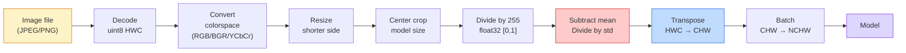
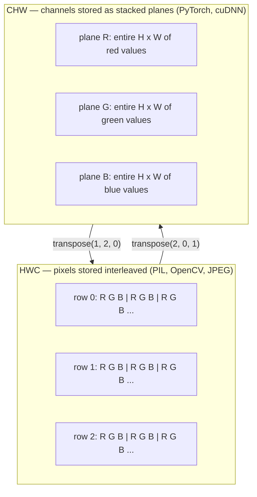

# 이미지의 기초 — 픽셀, 채널, 색 공간

> 이미지는 빛 샘플들의 텐서(tensor)다. 당신이 앞으로 사용할 모든 비전 모델은 이 한 가지 사실에서 출발한다.

**Type:** Build
**Languages:** Python
**Prerequisites:** Phase 1 Lesson 12 (Tensor Operations), Phase 3 Lesson 11 (Intro to PyTorch)
**Time:** ~45분

## 학습 목표 (Learning Objectives)

- 연속적인 장면이 어떻게 픽셀(pixel)로 이산화(discretize)되는지, 그리고 샘플링/양자화 결정이 왜 모든 후속 모델의 성능 상한을 결정하는지 설명하기
- 이미지를 NumPy 배열로 읽고, 슬라이싱하고, 검사하며 HWC와 CHW 레이아웃 사이를 자유롭게 전환하기
- RGB, 그레이스케일(grayscale), HSV, YCbCr 사이를 변환하고 각 색 공간(color space)이 존재하는 이유를 설명하기
- torchvision이 기대하는 방식 그대로 픽셀 수준 전처리(정규화, 표준화, 리사이즈, 채널 우선)를 적용하기

## 문제 (The Problem)

당신이 읽을 모든 논문, 다운로드할 모든 사전 학습(pretraining) 가중치(weight), 호출할 모든 비전 API는 입력에 대한 특정 인코딩을 가정한다. 모델이 `float32`를 원하는데 `uint8` 이미지를 넘기면, 그래도 실행은 되지만 조용히 쓰레기 같은 결과를 낸다. RGB로 학습된 신경망(neural network)에 BGR을 넣으면 정확도가 10점 폭락한다. 채널 우선(channels-first)을 기대하는 모델에 채널 후순(channels-last) 입력을 건네면 첫 합성곱(convolution) 층(layer)은 높이를 특성 채널로 취급한다. 이 중 어느 것도 에러를 던지지 않는다. 그저 당신의 지표를 망가뜨릴 뿐이며, 당신은 파일을 어떻게 로드했는지에 숨어 있는 버그를 일주일 동안 찾아 헤매게 된다.

합성곱은 무엇 위를 미끄러져 가는지만 알면 복잡하지 않다. 어려운 부분은 "이미지"라는 것이 카메라, JPEG 디코더(decoder), PIL, OpenCV, torchvision, CUDA 커널에게 각기 다른 의미를 지닌다는 점이다. 각 스택은 자신만의 축 순서, 바이트 범위, 채널 규약을 갖는다. 이를 제대로 구분하지 못하는 비전 엔지니어는 망가진 파이프라인(pipeline)을 출고한다.

이 레슨은 이 토대를 바로잡아 이 단계의 나머지가 그 위에 쌓일 수 있게 한다. 끝마칠 무렵이면 픽셀이 무엇인지, 왜 픽셀당 숫자가 하나가 아니라 셋인지, "ImageNet 통계로 정규화한다"는 것이 실제로 무엇을 하는지, 그리고 이 단계의 다른 모든 레슨이 가정할 두세 가지 레이아웃 사이를 어떻게 오가는지 알게 된다.

## 개념 (The Concept)

### 전체 전처리 파이프라인 한눈에 보기

모든 프로덕션(production) 비전 시스템은 동일한 가역 변환들의 시퀀스다. 한 단계라도 틀리면 모델은 학습(training) 때와 다른 입력을 보게 된다.



빨간색과 파란색 박스 두 개가 조용한 실패의 80%가 사는 곳이다. 표준화 누락과 잘못된 레이아웃이다.

### 픽셀은 네모가 아니라 샘플이다

카메라 센서는 작은 검출기들의 격자 위에 떨어지는 광자를 센다. 각 검출기는 짧은 시간 동안 빛을 적분하고, 자신에게 부딪힌 광자 수에 비례하는 전압을 내보낸다. 그다음 센서는 그 전압을 정수로 이산화한다. 검출기 하나가 픽셀 하나가 된다.

```
Continuous scene                 Sensor grid                     Digital image
(infinite detail)                (H x W detectors)               (H x W integers)

    ~~~~~                        +--+--+--+--+--+                 210 198 180 155 120
   ~   ~   ~                     |  |  |  |  |  |                 205 195 178 152 118
  ~ light ~      ---->           +--+--+--+--+--+     ---->       200 190 175 150 115
   ~~~~~                         |  |  |  |  |  |                 195 185 170 148 112
                                 +--+--+--+--+--+                 188 180 165 145 108
```

이 단계에서 두 가지 선택이 일어나며, 그 둘이 모든 후속 처리의 성능 상한을 고정한다.

- **공간 샘플링(spatial sampling)**은 장면의 각도당 검출기 수를 결정한다. 너무 적으면 가장자리가 톱니처럼 거칠어진다(앨리어싱, aliasing). 너무 많으면 저장과 연산이 폭발한다.
- **강도 양자화(intensity quantization)**는 전압을 얼마나 잘게 버킷으로 나눌지 결정한다. 8비트는 256단계를 주며 디스플레이의 표준이다. 10, 12, 16비트는 더 매끄러운 그래디언트(gradient)를 주고 의료 영상, HDR, 원본 센서 파이프라인에서 중요하다.

픽셀은 면적을 가진 색칠된 네모가 아니다. 단 하나의 측정값이다. 리사이즈하거나 회전할 때, 당신은 그 측정 격자를 재샘플링하는 것이다.

### 왜 채널이 셋인가

검출기 하나는 가시광 스펙트럼 전체에 걸친 광자를 센다 — 그것이 그레이스케일이다. 색을 얻으려면 센서는 격자를 빨강, 초록, 파랑 필터의 모자이크로 덮는다. 디모자이킹(demosaicing) 후, 모든 공간 위치는 세 개의 정수를 갖는다. 빨강 필터 검출기의 응답값, 초록 필터, 그리고 인근의 파랑 필터 응답값이다. 그 세 정수가 한 픽셀의 RGB 삼원색 값이다.

```
One pixel in memory:

    (R, G, B) = (210, 140, 30)   <- reddish-orange

An H x W RGB image:

    shape (H, W, 3)     stored as   H rows of W pixels of 3 values
                                    each in [0, 255] for uint8
```

3은 마법의 숫자가 아니다. 깊이 카메라는 Z 채널을 추가한다. 위성은 적외선과 자외선 대역을 추가한다. 의료 스캔은 보통 채널이 하나(X선, CT)이거나 여러 개(초분광)다. 채널 수는 마지막 축이며, 합성곱 층은 그 축을 가로질러 섞는 법을 학습한다.

### 두 가지 레이아웃 규약: HWC와 CHW

같은 텐서, 두 가지 순서. 모든 라이브러리가 하나를 고른다.

```
HWC (height, width, channels)           CHW (channels, height, width)

   W ->                                    H ->
  +-----+-----+-----+                     +-----+-----+
H |R G B|R G B|R G B|                   C |R R R R R R|
| +-----+-----+-----+                   | +-----+-----+
v |R G B|R G B|R G B|                   v |G G G G G G|
  +-----+-----+-----+                     +-----+-----+
                                          |B B B B B B|
                                          +-----+-----+

   PIL, OpenCV, matplotlib,              PyTorch, most deep learning
   almost every image file on disk       frameworks, cuDNN kernels
```

CHW가 존재하는 이유는 합성곱 커널이 H와 W를 가로질러 미끄러지기 때문이다. 채널 축을 맨 앞에 두면 각 커널은 채널마다 연속된 2D 평면을 보게 되고, 이는 깔끔하게 벡터화된다. 디스크 포맷은 HWC를 유지하는데, 이것이 스캔라인이 센서에서 나오는 방식과 일치하기 때문이다.

당신이 천 번은 타이핑하게 될 한 줄짜리 변환:

```
img_chw = img_hwc.transpose(2, 0, 1)      # NumPy
img_chw = img_hwc.permute(2, 0, 1)        # PyTorch tensor
```

메모리 레이아웃을 시각화하면:



### 바이트 범위와 dtype

세 가지 규약이 지배적이다.

| 규약 | dtype | 범위 | 어디서 보게 되는가 |
|------------|-------|-------|------------------|
| Raw | `uint8` | [0, 255] | 디스크의 파일, PIL, OpenCV 출력 |
| Normalized | `float32` | [0.0, 1.0] | `img.astype('float32') / 255` 이후 |
| Standardized | `float32` | 대략 [-2, +2] | 평균을 빼고 표준편차로 나눈 이후 |

합성곱 신경망(convolutional network)은 표준화된 입력으로 학습되었다. ImageNet 통계 `mean=[0.485, 0.456, 0.406]`, `std=[0.229, 0.224, 0.225]`는 ImageNet 학습 세트 전체에 대한 세 채널의 산술 평균과 표준편차이며, [0, 1]로 정규화된 픽셀 위에서 계산되었다. 표준화된 float를 기대하는 모델에 원본 `uint8`을 먹이는 것은 응용 비전에서 가장 흔한 단일 조용한 실패다.

### 색 공간과 그것이 존재하는 이유

RGB는 캡처 포맷이지만, 모델에 항상 가장 유용한 표현인 것은 아니다.

```
 RGB               HSV                       YCbCr / YUV

 R red             H hue (angle 0-360)       Y luminance (brightness)
 G green           S saturation (0-1)        Cb chroma blue-yellow
 B blue            V value/brightness (0-1)  Cr chroma red-green

 Linear to         Separates color from      Separates brightness from
 sensor output     brightness. Useful for    color. JPEG and most video
                   color thresholding, UI    codecs compress the chroma
                   sliders, simple filters   channels harder because the
                                             human eye is less sensitive
                                             to chroma detail than to Y.
```

대부분의 현대 CNN에는 RGB를 먹인다. 다른 공간을 만나는 경우는 다음과 같다.

- **HSV** — 고전적 CV 코드, 색 기반 분할, 화이트 밸런싱.
- **YCbCr** — JPEG 내부 읽기, 비디오 파이프라인, Y만으로 동작하는 초해상도 모델.
- **그레이스케일** — OCR, 문서 모델, 색이 신호가 아니라 방해 변수인 모든 경우.

RGB로부터의 그레이스케일은 평균이 아니라 가중합이다. 인간의 눈이 빨강이나 파랑보다 초록에 더 민감하기 때문이다.

```
Y = 0.299 R + 0.587 G + 0.114 B       (ITU-R BT.601, the classic weights)
```

### 종횡비, 리사이즈, 보간

모든 모델은 고정된 입력 크기를 갖는다(대부분의 ImageNet 분류기는 224x224, 현대적 검출기는 384x384 또는 512x512). 당신의 이미지는 거의 들어맞지 않는다. 중요한 세 가지 리사이즈 선택은 다음과 같다.

- **짧은 변을 리사이즈한 뒤 중앙 크롭** — 표준 ImageNet 레시피. 종횡비를 보존하고 가장자리 픽셀 한 줄을 버린다.
- **리사이즈 후 패딩** — 종횡비와 모든 픽셀을 보존하고 검은 띠를 추가한다. 검출과 OCR의 표준이다.
- **목표 크기로 직접 리사이즈** — 이미지를 늘린다. 저렴하고 기하 구조를 왜곡하지만 많은 분류(classification) 작업에는 괜찮다.

보간(interpolation) 방법은 새 격자가 옛 격자와 맞지 않을 때 중간 픽셀을 어떻게 계산할지 결정한다.

```
Nearest neighbour     fastest, blocky, only choice for masks/labels
Bilinear              fast, smooth, default for most image resizing
Bicubic               slower, sharper on upscaling
Lanczos               slowest, best quality, used for final display
```

경험칙: 학습에는 bilinear, 들여다볼 에셋에는 bicubic이나 lanczos, 정수 클래스 ID를 담은 것에는 nearest를 쓴다.

## 직접 만들기 (Build It)

### 1단계: 이미지 로드하고 형태 검사하기

Pillow로 아무 JPEG나 PNG를 로드하고, NumPy로 변환한 뒤, 무엇을 얻었는지 출력한다. 오프라인에서 실행되는 결정론적 예제를 위해 하나를 합성한다.

```python
import numpy as np
from PIL import Image

def synthetic_rgb(h=128, w=192, seed=0):
    rng = np.random.default_rng(seed)
    yy, xx = np.meshgrid(np.linspace(0, 1, h), np.linspace(0, 1, w), indexing="ij")
    r = (np.sin(xx * 6) * 0.5 + 0.5) * 255
    g = yy * 255
    b = (1 - yy) * xx * 255
    rgb = np.stack([r, g, b], axis=-1) + rng.normal(0, 6, (h, w, 3))
    return np.clip(rgb, 0, 255).astype(np.uint8)

arr = synthetic_rgb()
# Or load from disk:
# arr = np.asarray(Image.open("your_image.jpg").convert("RGB"))

print(f"type:   {type(arr).__name__}")
print(f"dtype:  {arr.dtype}")
print(f"shape:  {arr.shape}     # (H, W, C)")
print(f"min:    {arr.min()}")
print(f"max:    {arr.max()}")
print(f"pixel at (0, 0): {arr[0, 0]}")
```

기대 출력: `shape: (H, W, 3)`, `dtype: uint8`, 범위 `[0, 255]`. 바이트가 카메라, JPEG 디코더, 합성 생성기 어디서 왔든 그것이 정규 표준 디스크 표현이다.

### 2단계: 채널 분리하고 레이아웃 재정렬하기

R, G, B를 따로 꺼낸 뒤, PyTorch를 위해 HWC에서 CHW로 변환한다.

```python
R = arr[:, :, 0]
G = arr[:, :, 1]
B = arr[:, :, 2]
print(f"R shape: {R.shape}, mean: {R.mean():.1f}")
print(f"G shape: {G.shape}, mean: {G.mean():.1f}")
print(f"B shape: {B.shape}, mean: {B.mean():.1f}")

arr_chw = arr.transpose(2, 0, 1)
print(f"\nHWC shape: {arr.shape}")
print(f"CHW shape: {arr_chw.shape}")
```

채널당 하나씩 세 개의 그레이스케일 평면이 나온다. CHW는 그저 축을 재정렬할 뿐이다. 메모리 레이아웃이 허락하면 데이터 복사가 엄밀히 필요하지 않다.

### 3단계: 그레이스케일과 HSV 변환

가중합 그레이스케일, 그다음 수동 RGB-to-HSV.

```python
def rgb_to_grayscale(rgb):
    weights = np.array([0.299, 0.587, 0.114], dtype=np.float32)
    return (rgb.astype(np.float32) @ weights).astype(np.uint8)

def rgb_to_hsv(rgb):
    rgb_f = rgb.astype(np.float32) / 255.0
    r, g, b = rgb_f[..., 0], rgb_f[..., 1], rgb_f[..., 2]
    cmax = np.max(rgb_f, axis=-1)
    cmin = np.min(rgb_f, axis=-1)
    delta = cmax - cmin

    h = np.zeros_like(cmax)
    mask = delta > 0
    rmax = mask & (cmax == r)
    gmax = mask & (cmax == g)
    bmax = mask & (cmax == b)
    h[rmax] = ((g[rmax] - b[rmax]) / delta[rmax]) % 6
    h[gmax] = ((b[gmax] - r[gmax]) / delta[gmax]) + 2
    h[bmax] = ((r[bmax] - g[bmax]) / delta[bmax]) + 4
    h = h * 60.0

    s = np.where(cmax > 0, delta / cmax, 0)
    v = cmax
    return np.stack([h, s, v], axis=-1)

gray = rgb_to_grayscale(arr)
hsv = rgb_to_hsv(arr)
print(f"gray shape: {gray.shape}, range: [{gray.min()}, {gray.max()}]")
print(f"hsv   shape: {hsv.shape}")
print(f"hue range: [{hsv[..., 0].min():.1f}, {hsv[..., 0].max():.1f}] degrees")
print(f"sat range: [{hsv[..., 1].min():.2f}, {hsv[..., 1].max():.2f}]")
print(f"val range: [{hsv[..., 2].min():.2f}, {hsv[..., 2].max():.2f}]")
```

색조(hue)는 도(degree) 단위로, 채도(saturation)와 명도(value)는 [0, 1]로 나온다. 그것은 OpenCV `hsv_full` 규약과 일치한다.

### 4단계: 정규화, 표준화, 그리고 되돌리기

원본 바이트에서 사전 학습된 ImageNet 모델이 기대하는 정확한 텐서로 갔다가, 다시 되돌아온다.

```python
mean = np.array([0.485, 0.456, 0.406], dtype=np.float32)
std = np.array([0.229, 0.224, 0.225], dtype=np.float32)

def preprocess_imagenet(rgb_uint8):
    x = rgb_uint8.astype(np.float32) / 255.0
    x = (x - mean) / std
    x = x.transpose(2, 0, 1)
    return x

def deprocess_imagenet(chw_float32):
    x = chw_float32.transpose(1, 2, 0)
    x = x * std + mean
    x = np.clip(x * 255.0, 0, 255).astype(np.uint8)
    return x

x = preprocess_imagenet(arr)
print(f"preprocessed shape: {x.shape}     # (C, H, W)")
print(f"preprocessed dtype: {x.dtype}")
print(f"preprocessed mean per channel:  {x.mean(axis=(1, 2)).round(3)}")
print(f"preprocessed std  per channel:  {x.std(axis=(1, 2)).round(3)}")

roundtrip = deprocess_imagenet(x)
max_diff = np.abs(roundtrip.astype(int) - arr.astype(int)).max()
print(f"roundtrip max pixel diff: {max_diff}    # should be 0 or 1")
```

채널당 평균은 0에 가깝고, 표준편차는 1에 가까워야 한다. 이 전처리/역전처리 쌍이 바로 모든 torchvision `transforms.Normalize` 호출이 내부에서 하고 있는 일이다.

### 5단계: 세 가지 보간 방법으로 리사이즈하기

차이가 보이도록 업스케일에서 nearest, bilinear, bicubic을 비교한다.

```python
target = (arr.shape[0] * 3, arr.shape[1] * 3)

nearest = np.asarray(Image.fromarray(arr).resize(target[::-1], Image.NEAREST))
bilinear = np.asarray(Image.fromarray(arr).resize(target[::-1], Image.BILINEAR))
bicubic = np.asarray(Image.fromarray(arr).resize(target[::-1], Image.BICUBIC))

def local_roughness(x):
    gy = np.diff(x.astype(float), axis=0)
    gx = np.diff(x.astype(float), axis=1)
    return float(np.abs(gy).mean() + np.abs(gx).mean())

for name, out in [("nearest", nearest), ("bilinear", bilinear), ("bicubic", bicubic)]:
    print(f"{name:>8}  shape={out.shape}  roughness={local_roughness(out):6.2f}")
```

nearest는 단단한 가장자리를 유지하기 때문에 거칠기에서 가장 높은 점수를 받는다. bilinear가 가장 매끄럽다. bicubic은 그 사이에 있으며, 계단형 아티팩트 없이 체감 선명도를 보존한다.

## 라이브러리로 써보기 (Use It)

`torchvision.transforms`는 위의 모든 것을 하나의 조립 가능한 파이프라인으로 묶는다. 아래 코드는 `preprocess_imagenet`이 하는 일에 리사이즈와 크롭을 더해 정확히 재현한다.

```python
import torch
from torchvision import transforms
from PIL import Image

img = Image.fromarray(synthetic_rgb(256, 256))

pipeline = transforms.Compose([
    transforms.Resize(256),
    transforms.CenterCrop(224),
    transforms.ToTensor(),
    transforms.Normalize(mean=[0.485, 0.456, 0.406], std=[0.229, 0.224, 0.225]),
])

x = pipeline(img)
print(f"tensor type:  {type(x).__name__}")
print(f"tensor dtype: {x.dtype}")
print(f"tensor shape: {tuple(x.shape)}      # (C, H, W)")
print(f"per-channel mean: {x.mean(dim=(1, 2)).tolist()}")
print(f"per-channel std:  {x.std(dim=(1, 2)).tolist()}")

batch = x.unsqueeze(0)
print(f"\nbatched shape: {tuple(batch.shape)}   # (N, C, H, W) — ready for a model")
```

정확히 이 순서로 된 네 단계: `Resize(256)`은 짧은 변을 256으로 스케일링하고, `CenterCrop(224)`는 가운데에서 224x224 패치를 가져오며, `ToTensor()`는 255로 나누고 HWC를 CHW로 바꾸고, `Normalize`는 ImageNet 평균을 빼고 표준편차로 나눈다. 이 순서를 뒤집으면 모델에 도달하는 것이 조용히 바뀐다.

## 산출물 (Ship It)

이 레슨은 다음을 만든다.

- `outputs/prompt-vision-preprocessing-audit.md` — 임의의 모델 카드나 데이터셋 카드를, 팀이 반드시 지켜야 할 전처리 불변식들의 체크리스트로 바꾸는 프롬프트(prompt).
- `outputs/skill-image-tensor-inspector.md` — 임의의 이미지 형태 텐서나 배열이 주어지면 dtype, 레이아웃, 범위, 그리고 그것이 원본인지 정규화된 것인지 표준화된 것인지 보고하는 스킬.

## 연습 문제 (Exercises)

1. **(쉬움)** JPEG를 OpenCV(`cv2.imread`)와 Pillow로 각각 로드하라. 두 형태와 `(0, 0)`의 픽셀을 출력하라. 채널 순서 차이를 설명한 뒤, OpenCV 배열을 Pillow 배열과 동일하게 만드는 한 줄짜리 변환을 작성하라.
2. **(중간)** 임의의 uint8 이미지에서 함께 `roundtrip_max_diff <= 1` 테스트를 통과하는 `standardize(img, mean, std)`와 그 역함수를 작성하라. 당신의 함수는 동일한 호출로 HWC의 단일 이미지와 NCHW의 배치 모두에서 동작해야 한다.
3. **(어려움)** 3채널 ImageNet 표준화 텐서를 가져와, RGB를 단일 그레이스케일 채널로 섞는 가중 혼합을 학습하는 1x1 합성곱에 통과시켜라. 가중치를 `[0.299, 0.587, 0.114]`로 초기화하고, 고정(freeze)한 뒤, 출력이 당신의 수동 `rgb_to_grayscale`과 부동소수점 오차 이내로 일치하는지 검증하라. 또 어떤 고전적 색 공간 변환을 1x1 합성곱으로 쓸 수 있는가?

## 핵심 용어 (Key Terms)

| 용어 | 사람들이 말하는 것 | 실제 의미 |
|------|----------------|----------------------|
| 픽셀(Pixel) | "색칠된 네모" | 한 격자 위치에서의 빛 강도의 단일 샘플 — 색은 숫자 셋, 그레이스케일은 하나 |
| 채널(Channel) | "색" | 이미지 텐서로 쌓이는 병렬 공간 격자 중 하나. HWC에서는 마지막 축, CHW에서는 첫 축 |
| HWC / CHW | "형태" | 이미지 텐서의 축 순서. 디스크와 PIL은 HWC, PyTorch와 cuDNN은 CHW를 쓴다 |
| 정규화(Normalize) | "이미지를 스케일링한다" | 픽셀이 [0, 1]에 살도록 255로 나누는 것 — 필요하지만 충분하지는 않다 |
| 표준화(Standardize) | "0 중심으로 만든다" | 입력 분포가 모델이 학습한 것과 일치하도록 채널마다 평균을 빼고 표준편차로 나누는 것 |
| 그레이스케일 변환(Grayscale conversion) | "채널을 평균낸다" | 인간의 휘도 지각과 일치하는 계수 0.299/0.587/0.114의 가중합 |
| 보간(Interpolation) | "리사이즈가 픽셀을 고르는 방식" | 새 격자가 옛 격자와 맞지 않을 때 출력값을 결정하는 규칙 — 레이블에는 nearest, 학습에는 bilinear, 디스플레이에는 bicubic |
| 종횡비(Aspect ratio) | "너비 나누기 높이" | "리사이즈 후 패딩"과 "리사이즈 후 늘리기"를 구분하는 비율 |

## 더 읽을거리 (Further Reading)

- [Charles Poynton — A Guided Tour of Color Space](https://poynton.ca/PDFs/Guided_tour.pdf) — 왜 그렇게 많은 색 공간이 있고 각각이 언제 중요한지에 대한 가장 명료한 기술적 해설
- [PyTorch Vision Transforms Docs](https://pytorch.org/vision/stable/transforms.html) — 당신이 프로덕션에서 실제로 조립하게 될 변환들의 전체 파이프라인
- [How JPEG Works (Colt McAnlis)](https://www.youtube.com/watch?v=F1kYBnY6mwg) — 크로마 서브샘플링, DCT, 그리고 JPEG가 왜 RGB가 아니라 YCbCr을 인코딩하는지에 대한 날카로운 시각적 투어
- [ImageNet Preprocessing Conventions (torchvision models)](https://pytorch.org/vision/stable/models.html) — `mean=[0.485, 0.456, 0.406]`의 출처이자 동물원의 모든 모델이 왜 그것을 기대하는지에 대한 진실의 원천
