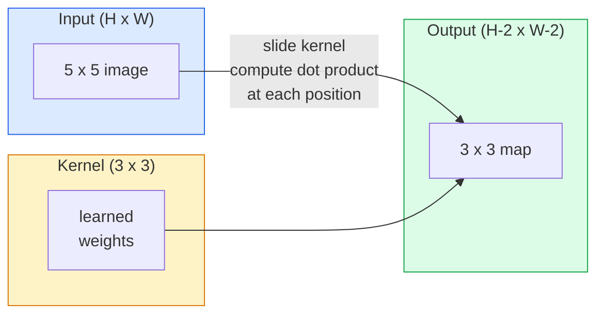
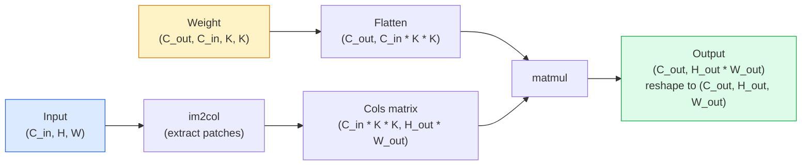

# 밑바닥부터 만드는 합성곱(Convolution)

> 합성곱(convolution)은 이미지를 가로질러 미끄러뜨리는 작은 밀집 층(dense layer)이며, 모든 위치에서 동일한 가중치(weight)를 공유한다.

**Type:** Build
**Languages:** Python
**Prerequisites:** Phase 3 (Deep Learning Core), Phase 4 Lesson 01 (Image Fundamentals)
**Time:** ~75분

## 학습 목표 (Learning Objectives)

- 중첩 루프 버전과 벡터화된 `im2col` 버전을 포함해, NumPy만으로 2D 합성곱을 밑바닥부터 구현하기
- 입력 크기, 커널 크기, 패딩, 스트라이드의 임의 조합에 대해 출력 공간 크기를 계산하고 `(H - K + 2P) / S + 1` 공식을 정당화하기
- 커널(가장자리, 블러, 샤픈, 소벨)을 직접 설계하고, 각각이 왜 그런 활성값(activation) 패턴을 만드는지 설명하기
- 합성곱을 쌓아 특성 추출기(feature extractor)를 만들고, 스택의 깊이를 수용 영역(receptive field) 크기와 연결하기

## 문제 (The Problem)

224x224 RGB 이미지에 대한 완전 연결 층(fully connected layer)은 뉴런당 224 * 224 * 3 = 150,528개의 입력 가중치가 필요하다. 1,000개 유닛을 가진 은닉층(hidden layer) 하나만 해도 이미 1억 5천만 개의 파라미터(parameter)이며, 유용한 것을 아직 아무것도 학습하기 전이다. 더 나쁜 것은, 그 층은 왼쪽 위의 개와 오른쪽 아래의 개가 같은 패턴이라는 개념이 없다. 모든 픽셀 위치를 독립적인 것으로 취급하는데, 이는 이미지에 대해 정확히 틀렸다. 고양이를 세 픽셀 평행이동시켰다고 해서 신경망(neural network)이 그 개념을 다시 학습하도록 강제해서는 안 된다.

이미지 모델이 필요로 하는 두 속성은 **평행이동 등변성(translation equivariance)**(입력이 이동하면 출력이 이동함)과 **파라미터 공유(parameter sharing)**(같은 특성 검출기가 어디서나 동작함)다. 밀집 층은 둘 다 주지 못한다. 합성곱은 둘 다 공짜로 준다.

합성곱은 딥러닝을 위해 발명된 것이 아니다. JPEG 압축, 포토샵의 가우시안 블러, 산업용 비전의 가장자리 검출, 그리고 지금까지 출고된 모든 오디오 필터를 구동하는 바로 그 연산이다. CNN이 2012년부터 2020년까지 ImageNet을 지배한 이유는, 인접한 값들이 서로 관련되어 있고 같은 패턴이 어디서든 나타날 수 있는 데이터에 대해 합성곱이 올바른 사전(prior)이기 때문이다.

## 개념 (The Concept)

### 하나의 커널, 미끄러지기

2D 합성곱은 커널(kernel) 또는 필터(filter)라 불리는 작은 가중치 행렬을 입력 위로 미끄러뜨리며, 각 위치에서 원소별 곱의 합을 계산한다. 그 합이 출력 픽셀 하나가 된다.



5x5 입력에 대한 구체적인 3x3 예제(패딩 없음, 스트라이드 1):

```
Input X (5 x 5):                Kernel W (3 x 3):

  1  2  0  1  2                   1  0 -1
  0  1  3  1  0                   2  0 -2
  2  1  0  2  1                   1  0 -1
  1  0  2  1  3
  2  1  1  0  1

The kernel slides across every valid 3 x 3 window. Output Y is 3 x 3:

 Y[0,0] = sum( W * X[0:3, 0:3] )
 Y[0,1] = sum( W * X[0:3, 1:4] )
 Y[0,2] = sum( W * X[0:3, 2:5] )
 Y[1,0] = sum( W * X[1:4, 0:3] )
 ... and so on
```

그 하나의 공식 — **공유 가중치, 국소성, 슬라이딩 윈도우** — 이 아이디어의 전부다. 나머지는 모두 부기(bookkeeping)다.

### 출력 크기 공식

입력 공간 크기 `H`, 커널 크기 `K`, 패딩 `P`, 스트라이드 `S`가 주어질 때:

```
H_out = floor( (H - K + 2P) / S ) + 1
```

이것을 암기하라. 아키텍처마다 수십 번씩 계산하게 된다.

| 시나리오 | H | K | P | S | H_out |
|----------|---|---|---|---|-------|
| Valid 합성곱, 패딩 없음 | 32 | 3 | 0 | 1 | 30 |
| Same 합성곱 (크기 보존) | 32 | 3 | 1 | 1 | 32 |
| 2배 다운샘플 | 32 | 3 | 1 | 2 | 16 |
| 2x2 풀링 | 32 | 2 | 0 | 2 | 16 |
| 큰 수용 영역 | 32 | 7 | 3 | 2 | 16 |

"Same 패딩"이란 `S == 1`일 때 `H_out == H`가 되도록 P를 고르는 것을 뜻한다. 홀수 K에 대해서는 P = (K - 1) / 2이다. 그것이 3x3 커널이 지배적인 이유다 — 중심을 가지면서 가장 작은 홀수 커널이기 때문이다.

### 패딩 (Padding)

패딩이 없으면 모든 합성곱은 특성 맵을 줄인다. 그것을 20개 쌓으면 224x224 이미지가 184x184가 되는데, 이는 경계에서 연산을 낭비하고 형태가 맞아야 하는 잔차 연결(residual connection)을 복잡하게 만든다.

```
Zero padding (P = 1) on a 5 x 5 input:

  0  0  0  0  0  0  0
  0  1  2  0  1  2  0
  0  0  1  3  1  0  0
  0  2  1  0  2  1  0       Now the kernel can centre on pixel
  0  1  0  2  1  3  0       (0, 0) and still have three rows and
  0  2  1  1  0  1  0       three columns of values to multiply.
  0  0  0  0  0  0  0
```

실무에서 만나는 모드: `zero`(가장 흔함), `reflect`(가장자리를 거울 반사하여 생성 모델에서 단단한 경계를 피함), `replicate`(가장자리를 복사함), `circular`(둘러 감싸며, 원환체 문제에서 사용됨).

### 스트라이드 (Stride)

스트라이드는 미끄러짐의 보폭이다. `stride=1`이 기본값이다. `stride=2`는 공간 차원을 절반으로 줄이며, 별도의 풀링 층 없이 CNN 내부에서 다운샘플하는 고전적 방법이다 — 모든 현대 아키텍처(ResNet, ConvNeXt, MobileNet)는 어딘가에서 max-pool 대신 스트라이드 합성곱을 사용한다.

```
Stride 1 on a 5 x 5 input, 3 x 3 kernel:

  starts: (0,0) (0,1) (0,2)        -> output row 0
          (1,0) (1,1) (1,2)        -> output row 1
          (2,0) (2,1) (2,2)        -> output row 2

  Output: 3 x 3

Stride 2 on the same input:

  starts: (0,0) (0,2)              -> output row 0
          (2,0) (2,2)              -> output row 1

  Output: 2 x 2
```

### 다중 입력 채널

실제 이미지는 채널이 셋이다. RGB 입력에 대한 3x3 합성곱은 실제로는 3x3x3 부피다. 입력 채널마다 하나씩 3x3 슬라이스가 있다. 각 공간 위치에서, 세 슬라이스 전체에 걸쳐 곱하고 합한 뒤 편향(bias)을 더한다.

```
Input:   (C_in,  H,  W)        3 x 5 x 5
Kernel:  (C_in,  K,  K)        3 x 3 x 3 (one kernel)
Output:  (1,     H', W')       2D map

For a layer that produces C_out output channels, you stack C_out kernels:

Weight:  (C_out, C_in, K, K)   e.g. 64 x 3 x 3 x 3
Output:  (C_out, H', W')       64 x 3 x 3

Parameter count: C_out * C_in * K * K + C_out   (the + C_out is biases)
```

그 마지막 줄이 모델을 계획할 때 당신이 계산하게 될 것이다. 3채널 입력에 대한 64채널 3x3 합성곱은 `64 * 3 * 3 * 3 + 64 = 1,792`개의 파라미터를 갖는다. 저렴하다.

### im2col 트릭

중첩 루프는 읽기 쉽지만 느리다. GPU는 큰 행렬 곱을 원한다. 트릭은 이렇다. 입력의 모든 수용 영역 윈도우를 큰 행렬의 한 열로 펼치고, 커널을 한 행으로 펼치면, 전체 합성곱이 단 하나의 행렬 곱(matmul)이 된다.



모든 프로덕션 합성곱 구현은 이것에 캐시 타일링 트릭을 더한 어떤 변형이다(직접 합성곱, Winograd, 큰 커널을 위한 FFT 합성곱). im2col을 이해하면 핵심을 이해한 것이다.

### 수용 영역 (Receptive field)

단일 3x3 합성곱은 입력 픽셀 9개를 본다. 3x3 합성곱 두 개를 쌓으면 두 번째 층의 뉴런은 5x5 입력 픽셀을 본다. 3x3 합성곱 세 개는 7x7을 준다. 일반적으로:

```
RF after L stacked K x K convs (stride 1) = 1 + L * (K - 1)

With strides:   RF grows multiplicatively with stride along each layer.
```

"끝까지 3x3"이 통하는(VGG, ResNet, ConvNeXt) 전체 이유는, 3x3 합성곱 두 개가 5x5 합성곱 하나와 같은 입력 영역을 보면서도 파라미터는 더 적고 그 사이에 비선형성이 하나 더 들어가기 때문이다.

## 직접 만들기 (Build It)

### 1단계: 배열에 패딩 넣기

가장 작은 기본 연산부터 시작한다. H x W 배열 둘레에 0으로 패딩하는 함수다.

```python
import numpy as np

def pad2d(x, p):
    if p == 0:
        return x
    h, w = x.shape[-2:]
    out = np.zeros(x.shape[:-2] + (h + 2 * p, w + 2 * p), dtype=x.dtype)
    out[..., p:p + h, p:p + w] = x
    return out

x = np.arange(9).reshape(3, 3)
print(x)
print()
print(pad2d(x, 1))
```

후행 축 트릭 `x.shape[:-2]`는 같은 함수가 수정 없이 `(H, W)`, `(C, H, W)`, `(N, C, H, W)`에서 동작하도록 한다.

### 2단계: 중첩 루프로 만드는 2D 합성곱

참조 구현 — 느리지만 모호함이 없다. 이것이 `torch.nn.functional.conv2d`가 원리적으로 하는 일이다.

```python
def conv2d_naive(x, w, b=None, stride=1, padding=0):
    c_in, h, w_in = x.shape
    c_out, c_in_w, kh, kw = w.shape
    assert c_in == c_in_w

    x_pad = pad2d(x, padding)
    h_out = (h + 2 * padding - kh) // stride + 1
    w_out = (w_in + 2 * padding - kw) // stride + 1

    out = np.zeros((c_out, h_out, w_out), dtype=np.float32)
    for oc in range(c_out):
        for i in range(h_out):
            for j in range(w_out):
                hs = i * stride
                ws = j * stride
                patch = x_pad[:, hs:hs + kh, ws:ws + kw]
                out[oc, i, j] = np.sum(patch * w[oc])
        if b is not None:
            out[oc] += b[oc]
    return out
```

네 개의 중첩 루프(출력 채널, 행, 열, 그리고 C_in, kh, kw에 대한 암묵적 합). 이것이 더 빠른 모든 구현을 검증할 기준 진실이다.

### 3단계: 직접 설계한 커널로 검증하기

수직 소벨(Sobel) 커널을 만들어, 합성 계단 이미지에 적용하고, 수직 가장자리가 켜지는 것을 지켜본다.

```python
def synthetic_step_image():
    img = np.zeros((1, 16, 16), dtype=np.float32)
    img[:, :, 8:] = 1.0
    return img

sobel_x = np.array([
    [[-1, 0, 1],
     [-2, 0, 2],
     [-1, 0, 1]]
], dtype=np.float32)[None]

x = synthetic_step_image()
y = conv2d_naive(x, sobel_x, padding=1)
print(y[0].round(1))
```

7번 열(왼쪽에서 오른쪽으로 밝기 증가)에서 큰 양수 값을, 그 밖의 모든 곳에서는 0을 기대하라. 그 한 번의 print가 수학이 옳은지에 대한 당신의 온전성 검사다.

### 4단계: im2col

입력의 모든 커널 크기 윈도우를 행렬의 한 열로 변환한다. `C_in=3, K=3`인 경우, 각 열은 27개의 숫자다.

```python
def im2col(x, kh, kw, stride=1, padding=0):
    c_in, h, w = x.shape
    x_pad = pad2d(x, padding)
    h_out = (h + 2 * padding - kh) // stride + 1
    w_out = (w + 2 * padding - kw) // stride + 1

    cols = np.zeros((c_in * kh * kw, h_out * w_out), dtype=x.dtype)
    col = 0
    for i in range(h_out):
        for j in range(w_out):
            hs = i * stride
            ws = j * stride
            patch = x_pad[:, hs:hs + kh, ws:ws + kw]
            cols[:, col] = patch.reshape(-1)
            col += 1
    return cols, h_out, w_out
```

여전히 파이썬 루프지만, 이제 무거운 일은 단 하나의 벡터화된 행렬 곱이 된다.

### 5단계: im2col + matmul로 만드는 빠른 합성곱

사중 루프를 단 하나의 행렬 곱으로 대체한다.

```python
def conv2d_im2col(x, w, b=None, stride=1, padding=0):
    c_out, c_in, kh, kw = w.shape
    cols, h_out, w_out = im2col(x, kh, kw, stride, padding)
    w_flat = w.reshape(c_out, -1)
    out = w_flat @ cols
    if b is not None:
        out += b[:, None]
    return out.reshape(c_out, h_out, w_out)
```

정확성 검사: 두 구현을 모두 실행하고 비교한다.

```python
rng = np.random.default_rng(0)
x = rng.normal(0, 1, (3, 16, 16)).astype(np.float32)
w = rng.normal(0, 1, (8, 3, 3, 3)).astype(np.float32)
b = rng.normal(0, 1, (8,)).astype(np.float32)

y_naive = conv2d_naive(x, w, b, padding=1)
y_im2col = conv2d_im2col(x, w, b, padding=1)

print(f"max abs diff: {np.max(np.abs(y_naive - y_im2col)):.2e}")
```

`max abs diff`는 `1e-5` 정도여야 한다 — 그 차이는 버그가 아니라 부동소수점 누적 순서다.

### 6단계: 직접 설계한 커널 모음

학습 전에 단일 합성곱 층이 표현할 수 있는 것을 보여주는 다섯 개의 필터다.

```python
KERNELS = {
    "identity": np.array([[0, 0, 0], [0, 1, 0], [0, 0, 0]], dtype=np.float32),
    "blur_3x3": np.ones((3, 3), dtype=np.float32) / 9.0,
    "sharpen": np.array([[0, -1, 0], [-1, 5, -1], [0, -1, 0]], dtype=np.float32),
    "sobel_x": np.array([[-1, 0, 1], [-2, 0, 2], [-1, 0, 1]], dtype=np.float32),
    "sobel_y": np.array([[-1, -2, -1], [0, 0, 0], [1, 2, 1]], dtype=np.float32),
}

def apply_kernel(img2d, kernel):
    x = img2d[None].astype(np.float32)
    w = kernel[None, None]
    return conv2d_im2col(x, w, padding=1)[0]
```

임의의 그레이스케일 이미지에 적용하면, 블러는 부드럽게, 샤픈은 가장자리를 또렷하게, 소벨-x는 수직 가장자리를, 소벨-y는 수평 가장자리를 켠다. 이것들이 바로 AlexNet과 VGG의 *첫* 번째 학습된 합성곱 층이 결국 학습하게 된 패턴이다 — 좋은 이미지 모델은 나중에 어떤 작업이 오든 가장자리와 덩어리(blob) 검출기가 필요하기 때문이다.

## 라이브러리로 써보기 (Use It)

PyTorch의 `nn.Conv2d`는 같은 연산을 자동 미분(autograd), CUDA 커널, cuDNN 최적화로 감싼다. 형태 의미론은 동일하다.

```python
import torch
import torch.nn as nn

conv = nn.Conv2d(in_channels=3, out_channels=64, kernel_size=3, stride=1, padding=1)
print(conv)
print(f"weight shape: {tuple(conv.weight.shape)}   # (C_out, C_in, K, K)")
print(f"bias shape:   {tuple(conv.bias.shape)}")
print(f"param count:  {sum(p.numel() for p in conv.parameters())}")

x = torch.randn(8, 3, 224, 224)
y = conv(x)
print(f"\ninput  shape: {tuple(x.shape)}")
print(f"output shape: {tuple(y.shape)}")
```

`padding=1`을 `padding=0`으로 바꾸면 출력이 222x222로 떨어진다. `stride=1`을 `stride=2`로 바꾸면 112x112로 떨어진다. 당신이 위에서 암기한 바로 그 공식이다.

## 산출물 (Ship It)

이 레슨은 다음을 만든다.

- `outputs/prompt-cnn-architect.md` — 입력 크기, 파라미터 예산, 목표 수용 영역이 주어지면 단계마다 올바른 K/S/P를 가진 `Conv2d` 층 스택을 설계하는 프롬프트.
- `outputs/skill-conv-shape-calculator.md` — 신경망 명세를 층마다 따라가며 모든 블록의 출력 형태, 수용 영역, 파라미터 수를 반환하는 스킬.

## 연습 문제 (Exercises)

1. **(쉬움)** 128x128 그레이스케일 입력과 `[Conv3x3(s=1,p=1), Conv3x3(s=2,p=1), Conv3x3(s=1,p=1), Conv3x3(s=2,p=1)]` 스택이 주어질 때, 각 층의 출력 공간 크기와 수용 영역을 손으로 계산하라. 더미 합성곱들로 구성된 PyTorch `nn.Sequential`로 검증하라.
2. **(중간)** `conv2d_naive`와 `conv2d_im2col`을 `groups` 인자를 받도록 확장하라. `groups=C_in=C_out`이 깊이별 합성곱(depthwise convolution)을 재현하며, 그 파라미터 수가 `C * C * K * K`가 아니라 `C * K * K`임을 보여라.
3. **(어려움)** `conv2d_im2col`의 역방향 패스(backward pass)를 손으로 구현하라. 출력의 그래디언트(gradient)가 주어질 때, `x`와 `w`의 그래디언트를 계산하라. 같은 입력과 가중치에 대해 `torch.autograd.grad`와 비교하여 검증하라. 트릭은 이렇다. im2col의 그래디언트는 `col2im`이며, 겹치는 윈도우를 누적해야 한다.

## 핵심 용어 (Key Terms)

| 용어 | 사람들이 말하는 것 | 실제 의미 |
|------|----------------|----------------------|
| 합성곱(Convolution) | "필터를 미끄러뜨리기" | 공유 가중치로 모든 공간 위치에서 적용되는 학습 가능한 내적. 수학적으로는 교차 상관(cross-correlation)이지만 모두가 합성곱이라 부른다 |
| 커널 / 필터(Kernel / filter) | "특성 검출기" | (C_in, K, K) 형태의 작은 가중치 텐서로, 입력 윈도우와의 내적이 출력 픽셀 하나를 만든다 |
| 스트라이드(Stride) | "얼마나 멀리 점프하는가" | 연속된 커널 배치 사이의 보폭. 스트라이드 2는 각 공간 차원을 절반으로 줄인다 |
| 패딩(Padding) | "가장자리의 0" | 커널이 경계 픽셀에 중심을 둘 수 있도록 입력 둘레에 더해진 추가 값. `same` 패딩은 출력 크기를 입력 크기와 같게 유지한다 |
| 수용 영역(Receptive field) | "뉴런이 얼마나 보는가" | 주어진 출력 활성값이 의존하는 원본 입력의 패치. 깊이와 스트라이드에 따라 커진다 |
| im2col | "GEMM 트릭" | 모든 수용 윈도우를 열로 재배열하여 합성곱을 하나의 큰 행렬 곱으로 만드는 것 — 모든 빠른 합성곱 커널의 핵심 |
| 깊이별 합성곱(Depthwise conv) | "채널당 커널 하나" | `groups == C_in`인 합성곱으로, 각 출력 채널을 자신에 대응하는 입력 채널만으로 계산한다. MobileNet과 ConvNeXt의 근간 |
| 평행이동 등변성(Translation equivariance) | "들어가는 이동, 나오는 이동" | 입력을 k 픽셀 이동시키면 출력이 k 픽셀 이동하는 속성. 공유 가중치와 함께 공짜로 따라온다 |

## 더 읽을거리 (Further Reading)

- [A guide to convolution arithmetic for deep learning (Dumoulin & Visin, 2016)](https://arxiv.org/abs/1603.07285) — 모든 강좌가 조용히 베끼는 패딩/스트라이드/팽창(dilation)의 결정적 다이어그램
- [CS231n: Convolutional Neural Networks for Visual Recognition](https://cs231n.github.io/convolutional-networks/) — 원조 im2col 설명을 포함한 정전적 강의 노트
- [The Annotated ConvNet (fast.ai)](https://nbviewer.org/github/fastai/fastbook/blob/master/13_convolutions.ipynb) — 수동 합성곱에서 학습된 숫자 분류기까지 걸어가는 노트북
- [Receptive Field Arithmetic for CNNs (Dang Ha The Hien)](https://distill.pub/2019/computing-receptive-fields/) — 수용 영역 계산을 논문 수준으로 다루는 대화형 해설
