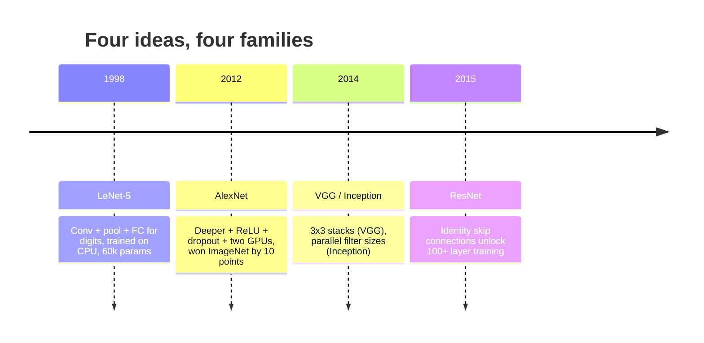
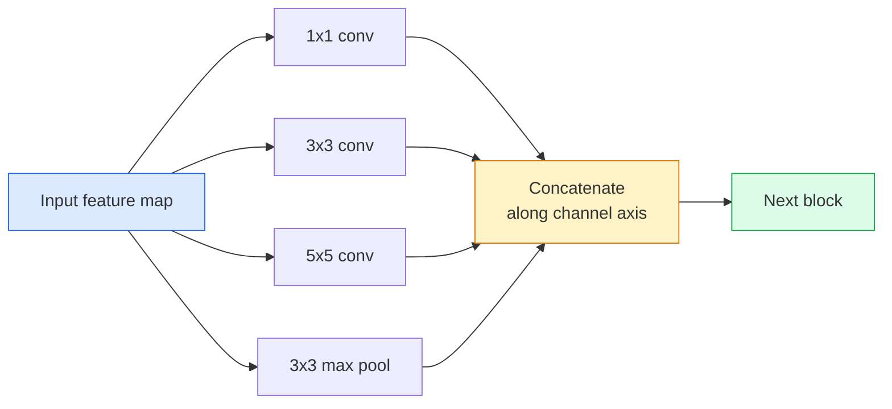
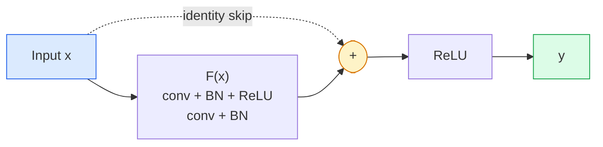

# CNN — LeNet에서 ResNet까지

> 지난 30년간의 모든 주요 CNN은 동일한 합성곱–비선형성–다운샘플 레시피에 새로운 아이디어 하나를 덧붙인 것이다. 그 아이디어들을 순서대로 배우라.

**Type:** Learn + Build
**Languages:** Python
**Prerequisites:** Phase 3 Lesson 11 (PyTorch), Phase 4 Lesson 01 (Image Fundamentals), Phase 4 Lesson 02 (Convolutions from Scratch)
**Time:** ~75분

## 학습 목표 (Learning Objectives)

- LeNet-5 -> AlexNet -> VGG -> Inception -> ResNet의 아키텍처 계보를 추적하고, 각 계열이 기여한 단 하나의 새로운 아이디어를 말하기
- LeNet-5, VGG 스타일 블록, ResNet BasicBlock을 각각 40줄 이내로 PyTorch에서 구현하기
- 잔차 연결(residual connection)이 어떻게 1,000층짜리 신경망을 학습 불가능한 것에서 최첨단으로 바꾸는지 설명하기
- 현대적 백본(backbone)(ResNet-18, ResNet-50)을 읽고, 소스를 보기 전에 그 출력 형태, 수용 영역(receptive field), 파라미터(parameter) 수를 예측하기

## 문제 (The Problem)

2011년, 최고의 ImageNet 분류기는 top-5 정확도 약 74%를 기록했다. 2012년 AlexNet은 85%를 기록했다. 2015년 ResNet은 96%를 기록했다. 새로운 데이터도 없었다. 새로운 GPU 세대도 없었다. 그 향상은 아키텍처 아이디어에서 왔다. 일하는 비전 엔지니어는 어떤 아이디어가 어떤 논문에서 왔는지 알아야 하는데, 2026년에 당신이 출고하는 모든 프로덕션(production) 백본은 바로 그 같은 조각들의 재조합이기 때문이며 — 또한 그 아이디어들이 계속 전이되기 때문이다. 그룹 합성곱(grouped convolution)은 CNN에서 트랜스포머(transformer)로 갔고, 잔차 연결은 ResNet에서 존재하는 모든 LLM으로 갔으며, 배치 정규화(batch normalization)는 확산 모델(diffusion model) 안에 산다.

이 신경망들을 순서대로 공부하면 흔한 실수에도 면역이 생긴다. LeNet 크기의 신경망이 문제를 풀 수 있는데도 사용 가능한 가장 큰 모델로 손을 뻗는 실수다. MNIST에는 ResNet이 필요하지 않다. 각 계열의 스케일링 곡선을 알면 당신이 그 위 어디에 앉아야 하는지 알 수 있다.

## 개념 (The Concept)

### 비전을 바꾼 네 가지 아이디어



고전적 비전에서 이 네 번의 도약만큼 중요했던 것은 없다.

### LeNet-5 (1998)

얀 르쿤(Yann LeCun)의 숫자 인식기. 파라미터 60,000개. 두 개의 합성곱-풀링 블록, 두 개의 완전 연결 층(fully connected layer), tanh 활성화 함수. 모든 CNN이 물려받는 템플릿을 정의했다.

```
input (1, 32, 32)
  conv 5x5 -> (6, 28, 28)
  avg pool 2x2 -> (6, 14, 14)
  conv 5x5 -> (16, 10, 10)
  avg pool 2x2 -> (16, 5, 5)
  flatten -> 400
  dense -> 120
  dense -> 84
  dense -> 10
```

현대 세계가 CNN이라 부르는 모든 것 — 작은 분류기 헤드(head)로 들어가는 합성곱과 다운샘플링의 교대 — 은 층이 더 많고, 채널이 더 크고, 활성화 함수가 더 나은 LeNet이다.

### AlexNet (2012)

함께 ImageNet을 깨뜨린 세 가지 변화:

1. tanh 대신 **ReLU**. 그래디언트(gradient)가 더 이상 소실되지 않는다. 학습 속도가 여섯 배 빨라진다.
2. 완전 연결 헤드의 **드롭아웃(Dropout)**. 정규화(regularization)가 트릭이 아니라 하나의 층이 된다.
3. **깊이와 너비**. 합성곱 층 다섯 개, 밀집 층(dense layer) 세 개, 파라미터 6천만 개, 모델을 둘로 나눠 GPU 두 개에서 학습.

논문의 Figure 2는 여전히 GPU 분할을 두 개의 병렬 스트림으로 보여준다. 그 병렬성은 하드웨어 우회책이었지 아키텍처적 통찰이 아니었다 — 하지만 위의 세 아이디어는 여전히 당신이 사용하는 모든 모델 안에 있다.

### VGG (2014)

VGG는 이렇게 물었다. 3x3 합성곱만 사용하고 깊게 가면 어떻게 될까?

```
stack:   conv 3x3 -> conv 3x3 -> pool 2x2
repeat:  16 or 19 conv layers
```

3x3 합성곱 두 개는 5x5 합성곱 하나와 같은 5x5 입력 영역을 보지만, 파라미터는 더 적고(2*9*C^2 = 18C^2 대 25*C^2) 그 사이에 ReLU가 하나 더 있다. VGG는 이 관찰을 하나의 완전한 아키텍처로 바꿨다. 그 단순함 — 한 가지 블록 유형을 반복 — 이 뒤따른 모든 것의 기준점이 되게 했다.

비용: 파라미터 1억 3,800만 개, 느린 학습, 비싼 추론(inference).

### Inception (2014, 같은 해)

"어떤 커널 크기를 써야 하는가?"에 대한 구글의 답은 이랬다. 전부, 병렬로.



각 분기는 특화된다 — 채널 혼합을 위한 1x1, 국소 질감을 위한 3x3, 더 큰 패턴을 위한 5x5, 이동 불변 특성을 위한 풀링(pooling) — 그리고 연결(concat)은 다음 층이 유용한 분기를 골라잡게 한다. Inception v1은 파라미터 수를 합리적으로 유지하기 위해 각 분기 안에서 1x1 합성곱을 병목(bottleneck)으로 사용했다.

### 열화 문제

2015년 무렵, VGG-19는 동작했지만 VGG-32는 그렇지 않았다. 깊이는 도움이 되어야 했지만, 약 20층을 넘어서면 학습 손실(loss)과 테스트 손실 둘 다 나빠졌다. 그것은 과적합(overfitting)이 아니다. 그래디언트가 모든 층을 거치며 곱셈적으로 줄어들기 때문에 옵티마이저(optimizer)가 유용한 가중치를 찾지 못하는 것이다.

```
Plain deep network:
  y = f_L( f_{L-1}( ... f_1(x) ... ) )

Gradient wrt early layer:
  dL/dW_1 = dL/dy * df_L/df_{L-1} * ... * df_2/df_1 * df_1/dW_1

Each multiplicative term has magnitude roughly (weight magnitude) * (activation gain).
Stack 100 of them with gains < 1 and the gradient is effectively zero.
```

VGG가 19층에서 동작한 이유는 (동시에 발표된) 배치 정규화가 활성값(activation)의 스케일을 잘 유지했기 때문이다. 하지만 배치 정규화조차 약 30층을 넘어서는 깊이를 구해내지는 못했다.

### ResNet (2015)

He, Zhang, Ren, Sun은 모든 것을 고치는 한 가지 변화를 제안했다.

```
standard block:   y = F(x)
residual block:   y = F(x) + x
```

`+ x`는 층이 `F(x)`를 0으로 몰아 언제든 아무것도 하지 않기를 선택할 수 있음을 뜻한다. 이제 1,000층짜리 ResNet은 기껏해야 1층짜리 신경망만큼만 나쁘다. 모든 추가 블록이 사소한 탈출구를 갖기 때문이다. 그 보장과 함께, 옵티마이저는 모든 블록을 *조금* 유용하게 만들 의향이 생긴다 — 그리고 조금 유용한 것을 100번 쌓으면 최첨단이 된다.



블록의 두 가지 변종이 어디서나 나타난다.

- **BasicBlock** (ResNet-18, ResNet-34): 3x3 합성곱 두 개, 둘을 건너뛰는 스킵.
- **Bottleneck** (ResNet-50, -101, -152): 1x1 축소, 3x3 중간, 1x1 확대, 그 셋을 건너뛰는 스킵. 채널 수가 많을 때 더 저렴하다.

스킵이 다운샘플(stride=2)을 가로질러야 할 때, 항등 경로는 형태를 맞추기 위해 1x1 stride=2 합성곱으로 대체된다.

### 잔차가 비전 너머에서 중요한 이유

그 아이디어는 사실 이미지 분류(classification)에 관한 것이 아니었다. 깊은 신경망을 "손가락을 꼬고 그래디언트가 살아남기를 바라는 것"에서 신뢰할 수 있고 확장 가능한 엔지니어링 도구로 바꾸는 것에 관한 것이었다. 다음 단계에서 읽게 될 모든 트랜스포머는 모든 블록에 정확히 같은 스킵 연결을 갖는다. ResNet이 없으면 GPT도 없다.

## 직접 만들기 (Build It)

### 1단계: LeNet-5

최소한의, 충실한 LeNet. tanh 활성화 함수, 평균 풀링. 현대성에 대한 유일한 양보는 원래의 가우시안 연결 대신 후속에서 `nn.CrossEntropyLoss`를 사용한다는 점이다.

```python
import torch
import torch.nn as nn
import torch.nn.functional as F

class LeNet5(nn.Module):
    def __init__(self, num_classes=10):
        super().__init__()
        self.conv1 = nn.Conv2d(1, 6, kernel_size=5)
        self.conv2 = nn.Conv2d(6, 16, kernel_size=5)
        self.pool = nn.AvgPool2d(2)
        self.fc1 = nn.Linear(16 * 5 * 5, 120)
        self.fc2 = nn.Linear(120, 84)
        self.fc3 = nn.Linear(84, num_classes)

    def forward(self, x):
        x = self.pool(torch.tanh(self.conv1(x)))
        x = self.pool(torch.tanh(self.conv2(x)))
        x = torch.flatten(x, 1)
        x = torch.tanh(self.fc1(x))
        x = torch.tanh(self.fc2(x))
        return self.fc3(x)

net = LeNet5()
x = torch.randn(1, 1, 32, 32)
print(f"output: {net(x).shape}")
print(f"params: {sum(p.numel() for p in net.parameters()):,}")
```

기대 출력: `output: torch.Size([1, 10])`, `params: 61,706`. 그것이 현대 비전을 시작한 숫자 분류기 전체다.

### 2단계: VGG 블록

재사용 가능한 블록 하나: 3x3 합성곱 두 개, ReLU, 배치 정규화, max 풀.

```python
class VGGBlock(nn.Module):
    def __init__(self, in_c, out_c):
        super().__init__()
        self.conv1 = nn.Conv2d(in_c, out_c, kernel_size=3, padding=1)
        self.bn1 = nn.BatchNorm2d(out_c)
        self.conv2 = nn.Conv2d(out_c, out_c, kernel_size=3, padding=1)
        self.bn2 = nn.BatchNorm2d(out_c)
        self.pool = nn.MaxPool2d(2)

    def forward(self, x):
        x = F.relu(self.bn1(self.conv1(x)))
        x = F.relu(self.bn2(self.conv2(x)))
        return self.pool(x)

class MiniVGG(nn.Module):
    def __init__(self, num_classes=10):
        super().__init__()
        self.stack = nn.Sequential(
            VGGBlock(3, 32),
            VGGBlock(32, 64),
            VGGBlock(64, 128),
        )
        self.head = nn.Sequential(
            nn.AdaptiveAvgPool2d(1),
            nn.Flatten(),
            nn.Linear(128, num_classes),
        )

    def forward(self, x):
        return self.head(self.stack(x))

net = MiniVGG()
x = torch.randn(1, 3, 32, 32)
print(f"output: {net(x).shape}")
print(f"params: {sum(p.numel() for p in net.parameters()):,}")
```

CIFAR 크기 입력에 VGG 블록 세 개, 적응형 풀, 선형 층 하나. 파라미터 약 29만 개. CIFAR-10에는 충분하다.

### 3단계: ResNet BasicBlock

ResNet-18과 ResNet-34의 핵심 빌딩 블록.

```python
class BasicBlock(nn.Module):
    def __init__(self, in_c, out_c, stride=1):
        super().__init__()
        self.conv1 = nn.Conv2d(in_c, out_c, kernel_size=3, stride=stride, padding=1, bias=False)
        self.bn1 = nn.BatchNorm2d(out_c)
        self.conv2 = nn.Conv2d(out_c, out_c, kernel_size=3, stride=1, padding=1, bias=False)
        self.bn2 = nn.BatchNorm2d(out_c)
        if stride != 1 or in_c != out_c:
            self.shortcut = nn.Sequential(
                nn.Conv2d(in_c, out_c, kernel_size=1, stride=stride, bias=False),
                nn.BatchNorm2d(out_c),
            )
        else:
            self.shortcut = nn.Identity()

    def forward(self, x):
        out = F.relu(self.bn1(self.conv1(x)))
        out = self.bn2(self.conv2(out))
        out = out + self.shortcut(x)
        return F.relu(out)
```

합성곱 층의 `bias=False`는 배치 정규화 규약이다 — BN의 베타 파라미터가 이미 편향(bias)을 처리하므로, 합성곱 편향까지 가지는 것은 낭비다. `shortcut`은 스트라이드나 채널 수가 바뀔 때만 실제 합성곱이 필요하다. 그 밖에는 아무 일도 하지 않는 항등(identity)이다.

### 4단계: 작은 ResNet

CIFAR 크기 입력에 대해 동작하는 ResNet을 얻기 위해 BasicBlock 그룹 네 개를 쌓는다.

```python
class TinyResNet(nn.Module):
    def __init__(self, num_classes=10):
        super().__init__()
        self.stem = nn.Sequential(
            nn.Conv2d(3, 32, kernel_size=3, stride=1, padding=1, bias=False),
            nn.BatchNorm2d(32),
            nn.ReLU(inplace=True),
        )
        self.layer1 = self._make_group(32, 32, num_blocks=2, stride=1)
        self.layer2 = self._make_group(32, 64, num_blocks=2, stride=2)
        self.layer3 = self._make_group(64, 128, num_blocks=2, stride=2)
        self.layer4 = self._make_group(128, 256, num_blocks=2, stride=2)
        self.head = nn.Sequential(
            nn.AdaptiveAvgPool2d(1),
            nn.Flatten(),
            nn.Linear(256, num_classes),
        )

    def _make_group(self, in_c, out_c, num_blocks, stride):
        blocks = [BasicBlock(in_c, out_c, stride=stride)]
        for _ in range(num_blocks - 1):
            blocks.append(BasicBlock(out_c, out_c, stride=1))
        return nn.Sequential(*blocks)

    def forward(self, x):
        x = self.stem(x)
        x = self.layer1(x)
        x = self.layer2(x)
        x = self.layer3(x)
        x = self.layer4(x)
        return self.head(x)

net = TinyResNet()
x = torch.randn(1, 3, 32, 32)
print(f"output: {net(x).shape}")
print(f"params: {sum(p.numel() for p in net.parameters()):,}")
```

각각 두 개의 블록을 가진 그룹 네 개. 그룹 2, 3, 4의 시작에서 스트라이드 2. 다운샘플마다 채널 수가 두 배가 된다. 대략 파라미터 280만 개. 그것이 ResNet-152까지 깔끔하게 확장되는 표준 레시피다.

### 5단계: 파라미터 대 특성 효율 비교하기

세 신경망 모두에 같은 입력을 흘려보내고 파라미터 수를 비교한다.

```python
def summary(name, net, x):
    y = net(x)
    params = sum(p.numel() for p in net.parameters())
    print(f"{name:12s}  input {tuple(x.shape)} -> output {tuple(y.shape)}  params {params:>10,}")

x = torch.randn(1, 3, 32, 32)
summary("LeNet5",     LeNet5(),       torch.randn(1, 1, 32, 32))
summary("MiniVGG",    MiniVGG(),      x)
summary("TinyResNet", TinyResNet(),   x)
```

세 모델, 세 시대, 파라미터 수에서 세 자릿수의 차이. CIFAR-10 정확도로는 몇 에폭(epoch)의 학습 후 대략 LeNet 60%, MiniVGG 89%, TinyResNet 93%가 필요하다.

## 라이브러리로 써보기 (Use It)

`torchvision.models`는 위 모든 것의 사전 학습(pretraining) 버전을 준다. 호출 시그니처는 계열 전체에서 동일한데, 그것이 바로 백본 추상화의 요점이다.

```python
from torchvision.models import resnet18, ResNet18_Weights, vgg16, VGG16_Weights

r18 = resnet18(weights=ResNet18_Weights.IMAGENET1K_V1)
r18.eval()

print(f"ResNet-18 params: {sum(p.numel() for p in r18.parameters()):,}")
print(r18.layer1[0])
print()

v16 = vgg16(weights=VGG16_Weights.IMAGENET1K_V1)
v16.eval()
print(f"VGG-16   params: {sum(p.numel() for p in v16.parameters()):,}")
```

ResNet-18은 파라미터가 1,170만 개다. VGG-16은 1억 3,800만 개다. ImageNet top-1 정확도는 비슷하다(69.8% 대 71.6%). 잔차 연결은 12배의 파라미터 효율 이득을 사준다. 그것이 ResNet 변종들이 2016년부터 ViT가 도래한 2021년까지 지배한 이유이며 — 연산이 제약인 실세계 배포(deployment)에서는 여전히 지배한다.

전이 학습(transfer learning)의 레시피는 늘 똑같다. 사전 학습된 것을 로드하고, 백본을 고정하고, 분류기 헤드를 교체한다.

```python
for p in r18.parameters():
    p.requires_grad = False
r18.fc = nn.Linear(r18.fc.in_features, 10)
```

세 줄이다. 이제 당신은 ImageNet이 비용을 치른 표현을 물려받는 10클래스 CIFAR 분류기를 갖는다.

## 산출물 (Ship It)

이 레슨은 다음을 만든다.

- `outputs/prompt-backbone-selector.md` — 작업, 데이터셋(dataset) 크기, 연산 예산이 주어지면 올바른 CNN 계열(LeNet/VGG/ResNet/MobileNet/ConvNeXt)을 고르는 프롬프트.
- `outputs/skill-residual-block-reviewer.md` — PyTorch 모듈을 읽고 스킵 연결 실수(스트라이드 변경 시 누락된 shortcut, shortcut 활성화 순서, 덧셈 대비 BN 위치)를 표시하는 스킬.

## 연습 문제 (Exercises)

1. **(쉬움)** `TinyResNet`의 파라미터를 층마다 손으로 세어라. `sum(p.numel() for p in net.parameters())`와 비교하라. 파라미터 예산의 대부분은 어디로 가는가 — 합성곱, BN, 아니면 분류기 헤드?
2. **(중간)** Bottleneck 블록(스킵을 동반한 1x1 -> 3x3 -> 1x1)을 구현하고, 그것을 사용해 CIFAR를 위한 ResNet-50 스타일 신경망을 만들어라. `TinyResNet`과 파라미터를 비교하라.
3. **(어려움)** `BasicBlock`에서 스킵 연결을 제거하고, 34블록짜리 "plain" 신경망과 34블록짜리 ResNet을 CIFAR-10에서 각각 10에폭 학습시켜라. 둘 다에 대해 에폭 대비 학습 손실을 그려라. 깊은 plain 신경망이 그 더 얕은 쌍둥이보다 높은 손실로 수렴하는 He et al. Figure 1 결과를 재현하라.

## 핵심 용어 (Key Terms)

| 용어 | 사람들이 말하는 것 | 실제 의미 |
|------|----------------|----------------------|
| 백본(Backbone) | "모델" | 작업 헤드로 들어가는 특성 맵을 만드는 합성곱 블록들의 스택 |
| 잔차 연결(Residual connection) | "스킵 연결" | `y = F(x) + x`. F를 0으로 설정해 옵티마이저가 항등을 학습하게 하며, 이는 임의의 깊이를 학습 가능하게 만든다 |
| BasicBlock | "스킵을 동반한 3x3 합성곱 두 개" | ResNet-18/34 빌딩 블록: conv-BN-ReLU-conv-BN-add-ReLU |
| Bottleneck | "1x1 축소, 3x3, 1x1 확대" | ResNet-50/101/152 블록. 3x3이 줄어든 너비에서 동작하므로 높은 채널 수에서 저렴하다 |
| 열화 문제(Degradation problem) | "더 깊으면 더 나쁘다" | 약 20개의 plain 합성곱 층을 넘어서면 학습 오차와 테스트 오차 둘 다 증가한다. 더 많은 데이터가 아니라 잔차 연결로 해결된다 |
| 스템(Stem) | "첫 번째 층" | 3채널 입력을 기본 특성 너비로 변환하는 초기 합성곱. 보통 ImageNet에는 7x7 스트라이드 2, CIFAR에는 3x3 스트라이드 1 |
| 헤드(Head) | "분류기" | 최종 백본 블록 이후의 층들: 적응형 풀, 평탄화, 선형 층(들) |
| 전이 학습(Transfer learning) | "사전 학습된 가중치" | ImageNet으로 학습된 백본을 로드하고 당신의 작업에 대해 헤드만 파인튜닝(fine-tuning)하는 것 |

## 더 읽을거리 (Further Reading)

- [Deep Residual Learning for Image Recognition (He et al., 2015)](https://arxiv.org/abs/1512.03385) — ResNet 논문. 모든 그림이 공부할 가치가 있다
- [Very Deep Convolutional Networks (Simonyan & Zisserman, 2014)](https://arxiv.org/abs/1409.1556) — VGG 논문. "왜 3x3인가"에 대한 여전히 최고의 참고 자료
- [ImageNet Classification with Deep CNNs (Krizhevsky et al., 2012)](https://papers.nips.cc/paper_files/paper/2012/hash/c399862d3b9d6b76c8436e924a68c45b-Abstract.html) — AlexNet. 수작업 특성 시대를 끝낸 논문
- [Going Deeper with Convolutions (Szegedy et al., 2014)](https://arxiv.org/abs/1409.4842) — Inception v1. 비전 트랜스포머에서도 여전히 나타나는 병렬 필터 아이디어
