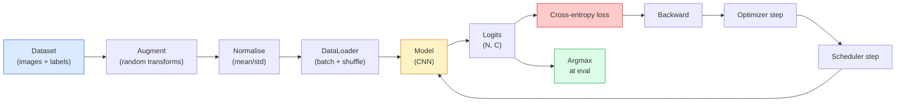

# 이미지 분류(Image Classification)

> 분류기(classifier)는 픽셀로부터 클래스에 대한 확률 분포(probability distribution)로 가는 함수다. 나머지는 모두 배관이다.

**Type:** Build
**Languages:** Python
**Prerequisites:** Phase 2 Lesson 09 (Model Evaluation), Phase 3 Lesson 10 (Mini Framework), Phase 4 Lesson 03 (CNNs)
**Time:** ~75분

## 학습 목표 (Learning Objectives)

- CIFAR-10에서 종단 간 이미지 분류 파이프라인(pipeline)을 구축하기: 데이터셋(dataset), 증강(augmentation), 모델, 학습 루프, 평가
- 각 구성 요소(데이터로더, 손실, 옵티마이저, 스케줄러, 증강)의 역할을 설명하고, 그중 하나가 깨졌을 때 손실 곡선에서 어떻게 나타나는지 예측하기
- mixup, cutout, 레이블 스무딩(label smoothing)을 밑바닥부터 구현하고 각각을 언제 추가할 가치가 있는지 정당화하기
- 혼동 행렬(confusion matrix)과 클래스별 정밀도/재현율 표를 읽어, 집계 정확도 너머의 데이터셋 및 모델 실패를 진단하기

## 문제 (The Problem)

출고되는 모든 비전 작업은 어떤 수준에서 이미지 분류(classification)로 환원된다. 검출은 영역을 분류한다. 분할은 픽셀을 분류한다. 검색은 클래스 중심과의 유사도로 순위를 매긴다. 분류를 제대로 하는 것 — 데이터셋 루프, 증강 정책, 손실, 평가 — 은 이 단계의 다른 모든 작업으로 전이되는 기술이다.

대부분의 분류 버그는 모델에 있지 않다. 파이프라인에 산다. 깨진 정규화(normalization), 섞이지 않은 학습 세트, 레이블을 왜곡하는 증강, 학습 데이터로 오염된 검증 분할, 30에폭(epoch) 이후 조용히 발산하는 학습률(learning rate). 올바른 설정이라면 CIFAR-10에서 93%를 칠 CNN이 깨진 설정에서는 흔히 70-75%를 기록하며, 그동안 손실 곡선은 내내 그럴듯해 보인다.

이 레슨은 전체 파이프라인을 손으로 배선하여 모든 부분을 검사할 수 있게 한다. 버그를 숨길 수 있는 `torchvision.datasets`의 어떤 것도 사용하지 않는다.

## 개념 (The Concept)

### 분류 파이프라인



이 루프의 모든 줄이 버그가 살 수 있는 곳이다. 교차 엔트로피(cross-entropy)는 소프트맥스 출력이 아니라 원시 로짓(logits)을 받으므로, 손실 전의 어떤 `model(x).softmax()`든 조용히 잘못된 그래디언트(gradient)를 계산한다. 증강은 입력에만 적용되고 레이블에는 적용되지 않는다 — 둘 다 섞는 mixup은 예외다. `optimizer.zero_grad()`는 스텝당 한 번 일어나야 한다. 그것을 건너뛰면 그래디언트가 누적되어 미친 듯이 불안정한 학습률처럼 보인다. 그 버그들 각각은 에러를 던지지 않고 학습 곡선을 평탄하게 만든다.

### 교차 엔트로피, 로짓, 소프트맥스

분류기는 이미지당 `C`개의 숫자를 만들며 이를 로짓이라 부른다. 소프트맥스를 적용하면 이를 확률 분포로 변환한다.

```
softmax(z)_i = exp(z_i) / sum_j exp(z_j)
```

교차 엔트로피는 올바른 클래스의 음의 로그 확률을 측정한다.

```
CE(z, y) = -log( softmax(z)_y )
        = -z_y + log( sum_j exp(z_j) )
```

오른쪽 형태가 수치적으로 안정적인 것이다(log-sum-exp). PyTorch의 `nn.CrossEntropyLoss`는 소프트맥스 + NLL을 한 연산으로 융합하며 원시 로짓을 직접 받는다. 소프트맥스를 직접 먼저 적용하는 것은 거의 항상 버그다 — log(softmax(softmax(z)))라는 무의미한 양을 계산하게 된다.

### 증강이 통하는 이유

CNN은 (가중치 공유로부터) 평행이동에 대한 귀납적 편향(inductive bias)을 갖지만, 크롭, 뒤집기, 색 지터, 가림에 대한 내장 불변성은 없다. 그런 불변성을 가르치는 유일한 방법은 그것들을 작동시키는 픽셀을 보여주는 것이다. 학습 중의 모든 무작위 변환은 이렇게 말하는 방식이다. "이 두 이미지는 같은 레이블을 가진다. 그 차이를 무시하는 특성을 학습하라."

```
Original crop:  "dog facing left"
Flip:           "dog facing right"       <- same label, different pixels
Rotate(+15):    "dog, slight tilt"
Colour jitter:  "dog in warmer light"
RandomErasing:  "dog with patch missing"
```

규칙: 증강은 레이블을 보존해야 한다. 숫자에 대한 cutout과 회전은 "6"을 "9"로 뒤집을 수 있다. 그런 데이터셋에서는 더 작은 회전 범위를 쓰고 숫자 특유의 불변성을 존중하는 증강을 고른다.

### Mixup과 cutmix

일반적 증강은 픽셀을 변환하지만 레이블은 원-핫으로 유지한다. **Mixup**과 **cutmix**는 둘 다 보간함으로써 그것을 깨뜨린다.

```
Mixup:
  lambda ~ Beta(a, a)
  x = lambda * x_i + (1 - lambda) * x_j
  y = lambda * y_i + (1 - lambda) * y_j

Cutmix:
  paste a random rectangle of x_j into x_i
  y = area-weighted mix of y_i and y_j
```

도움이 되는 이유: 모델이 뾰족한 원-핫 목표를 암기하는 것을 멈추고 클래스들 사이를 보간하는 법을 학습한다. 학습 손실은 올라가고 테스트 정확도는 올라간다. 어떤 분류기에든 가장 저렴한 단일 견고성 업그레이드다.

### 레이블 스무딩 (Label smoothing)

mixup의 사촌이다. `[0, 0, 1, 0, 0]`에 대해 학습하는 대신, 0.1 같은 작은 `eps`에 대해 `[eps/C, eps/C, 1-eps, eps/C, eps/C]`에 대해 학습한다. 모델이 임의로 날카로운 로짓을 만드는 것을 멈추게 하고, 거의 비용 없이 보정(calibration)을 개선한다. PyTorch 1.10부터 `nn.CrossEntropyLoss(label_smoothing=0.1)`에 내장되어 있다.

### 정확도 너머의 평가

집계 정확도는 불균형을 숨긴다. 항상 다수 클래스를 예측하는 90-10 이진 분류기는 90%를 기록한다. 무슨 일이 일어나는지 실제로 알려주는 도구들은 다음과 같다.

- **클래스별 정확도** — 클래스당 숫자 하나. 성능이 낮은 범주를 즉시 드러낸다.
- **혼동 행렬** — 행 i 열 j = 실제 클래스 i가 클래스 j로 예측된 횟수인 C x C 격자. 대각선은 맞은 것, 비대각선은 당신의 모델이 사는 곳이다.
- **Top-1 / Top-5** — 올바른 클래스가 상위 1개 또는 상위 5개 예측에 있는지. "Norwich terrier" 대 "Norfolk terrier" 같은 클래스는 진짜로 모호하므로 ImageNet에서는 Top-5가 중요하다.
- **보정 (ECE)** — 0.8 신뢰도 예측이 80%의 경우에 맞는가? 현대 신경망은 체계적으로 과신한다. 온도 스케일링이나 레이블 스무딩으로 고친다.

## 직접 만들기 (Build It)

### 1단계: 결정론적 합성 데이터셋

CIFAR-10은 디스크에 산다. 이 레슨을 재현 가능하고 빠르게 만들기 위해 CIFAR처럼 보이는 합성 데이터셋을 만든다 — 모델이 학습해야 할 클래스별 구조를 가진 32x32 RGB 이미지다. 정확히 같은 파이프라인이 실제 CIFAR-10에서도 변경 없이 동작한다.

```python
import numpy as np
import torch
from torch.utils.data import Dataset


def synthetic_cifar(num_per_class=1000, num_classes=10, seed=0):
    rng = np.random.default_rng(seed)
    X = []
    Y = []
    for c in range(num_classes):
        centre = rng.uniform(0, 1, (3,))
        freq = 2 + c
        for _ in range(num_per_class):
            yy, xx = np.meshgrid(np.linspace(0, 1, 32), np.linspace(0, 1, 32), indexing="ij")
            r = np.sin(xx * freq) * 0.5 + centre[0]
            g = np.cos(yy * freq) * 0.5 + centre[1]
            b = (xx + yy) * 0.5 * centre[2]
            img = np.stack([r, g, b], axis=-1)
            img += rng.normal(0, 0.08, img.shape)
            img = np.clip(img, 0, 1)
            X.append(img.astype(np.float32))
            Y.append(c)
    X = np.stack(X)
    Y = np.array(Y)
    idx = rng.permutation(len(X))
    return X[idx], Y[idx]


class ArrayDataset(Dataset):
    def __init__(self, X, Y, transform=None):
        self.X = X
        self.Y = Y
        self.transform = transform

    def __len__(self):
        return len(self.X)

    def __getitem__(self, i):
        img = self.X[i]
        if self.transform is not None:
            img = self.transform(img)
        img = torch.from_numpy(img).permute(2, 0, 1)
        return img, int(self.Y[i])
```

각 클래스는 자신만의 색 팔레트와 주파수 패턴을 갖고, 모델이 픽셀을 암기하기보다 신호를 학습하도록 강제하는 가우시안 노이즈가 더해진다. 열 개 클래스, 각각 천 개 이미지, 순열로 섞임.

### 2단계: 정규화와 증강

모든 비전 파이프라인이 갖는 두 변환.

```python
def standardize(mean, std):
    mean = np.array(mean, dtype=np.float32)
    std = np.array(std, dtype=np.float32)
    def _fn(img):
        return (img - mean) / std
    return _fn


def random_hflip(p=0.5):
    def _fn(img):
        if np.random.random() < p:
            return img[:, ::-1, :].copy()
        return img
    return _fn


def random_crop(pad=4):
    def _fn(img):
        h, w = img.shape[:2]
        padded = np.pad(img, ((pad, pad), (pad, pad), (0, 0)), mode="reflect")
        y = np.random.randint(0, 2 * pad)
        x = np.random.randint(0, 2 * pad)
        return padded[y:y + h, x:x + w, :]
    return _fn


def compose(*fns):
    def _fn(img):
        for fn in fns:
            img = fn(img)
        return img
    return _fn
```

크롭 전에 zero-pad가 아니라 reflect-pad를 한다. 검은 경계는 모델이 무용하게 무시하는 법을 학습할 신호이기 때문이다.

### 3단계: Mixup

학습 스텝 안에서 두 이미지와 두 레이블을 섞는다. 데이터셋 안이 아니라 순방향 패스 옆에 살도록 배치 변환으로 구현한다.

```python
def mixup_batch(x, y, num_classes, alpha=0.2):
    if alpha <= 0:
        return x, torch.nn.functional.one_hot(y, num_classes).float()
    lam = float(np.random.beta(alpha, alpha))
    idx = torch.randperm(x.size(0), device=x.device)
    x_mixed = lam * x + (1 - lam) * x[idx]
    y_onehot = torch.nn.functional.one_hot(y, num_classes).float()
    y_mixed = lam * y_onehot + (1 - lam) * y_onehot[idx]
    return x_mixed, y_mixed


def soft_cross_entropy(logits, soft_targets):
    log_probs = torch.log_softmax(logits, dim=-1)
    return -(soft_targets * log_probs).sum(dim=-1).mean()
```

`soft_cross_entropy`는 소프트 레이블 분포에 대한 교차 엔트로피다. 목표가 정확히 원-핫일 때 통상적인 원-핫 경우로 환원된다.

### 4단계: 학습 루프

완전한 레시피: 데이터를 한 번 통과, 배치당 한 번의 그래디언트, 에폭당 한 번 스텝되는 스케줄러.

```python
import torch
import torch.nn as nn
from torch.utils.data import DataLoader
from torch.optim import SGD
from torch.optim.lr_scheduler import CosineAnnealingLR

def train_one_epoch(model, loader, optimizer, device, num_classes, use_mixup=True):
    model.train()
    total, correct, loss_sum = 0, 0, 0.0
    for x, y in loader:
        x, y = x.to(device), y.to(device)
        if use_mixup:
            x_m, y_soft = mixup_batch(x, y, num_classes)
            logits = model(x_m)
            loss = soft_cross_entropy(logits, y_soft)
        else:
            logits = model(x)
            loss = nn.functional.cross_entropy(logits, y, label_smoothing=0.1)
        optimizer.zero_grad()
        loss.backward()
        optimizer.step()
        loss_sum += loss.item() * x.size(0)
        total += x.size(0)
        # Training accuracy vs the un-mixed labels `y` is only an approximation
        # when mixup is on (the model saw soft targets, not y). Treat it as a
        # rough progress signal; rely on val accuracy for real performance.
        with torch.no_grad():
            pred = logits.argmax(dim=-1)
            correct += (pred == y).sum().item()
    return loss_sum / total, correct / total


@torch.no_grad()
def evaluate(model, loader, device, num_classes):
    model.eval()
    total, correct = 0, 0
    loss_sum = 0.0
    cm = torch.zeros(num_classes, num_classes, dtype=torch.long)
    for x, y in loader:
        x, y = x.to(device), y.to(device)
        logits = model(x)
        loss = nn.functional.cross_entropy(logits, y)
        pred = logits.argmax(dim=-1)
        for t, p in zip(y.cpu(), pred.cpu()):
            cm[t, p] += 1
        loss_sum += loss.item() * x.size(0)
        total += x.size(0)
        correct += (pred == y).sum().item()
    return loss_sum / total, correct / total, cm
```

학습 루프를 작성할 때마다 점검하는 다섯 가지 불변식:

1. 학습 전에 `model.train()`, 평가 전에 `model.eval()` — 드롭아웃과 배치 정규화 동작을 전환한다.
2. `.backward()` 전에 `.zero_grad()`.
3. 지표를 누적할 때 `.item()`을 써서 아무것도 계산 그래프를 살려두지 않게 한다.
4. 평가 중 `@torch.no_grad()` — 메모리와 시간을 아끼고 미묘한 사고를 막는다.
5. 소프트맥스가 아니라 원시 로짓에 대한 argmax — 같은 결과, 연산 하나 줄임.

### 5단계: 합치기

이전 레슨의 `TinyResNet`을 사용해, 몇 에폭 학습시키고, 평가한다.

```python
from main import synthetic_cifar, ArrayDataset
from main import standardize, random_hflip, random_crop, compose
from main import mixup_batch, soft_cross_entropy
from main import train_one_epoch, evaluate
# TinyResNet comes from the previous lesson (03-cnns-lenet-to-resnet).
# Adjust the import path to wherever you stored the previous lesson's code.
from cnns_lenet_to_resnet import TinyResNet  # example placeholder

X, Y = synthetic_cifar(num_per_class=500)
split = int(0.9 * len(X))
X_train, Y_train = X[:split], Y[:split]
X_val, Y_val = X[split:], Y[split:]

mean = [0.5, 0.5, 0.5]
std = [0.25, 0.25, 0.25]
train_tf = compose(random_hflip(), random_crop(pad=4), standardize(mean, std))
eval_tf = standardize(mean, std)

train_ds = ArrayDataset(X_train, Y_train, transform=train_tf)
val_ds = ArrayDataset(X_val, Y_val, transform=eval_tf)

train_loader = DataLoader(train_ds, batch_size=128, shuffle=True, num_workers=0)
val_loader = DataLoader(val_ds, batch_size=256, shuffle=False, num_workers=0)

device = "cuda" if torch.cuda.is_available() else "cpu"
model = TinyResNet(num_classes=10).to(device)
optimizer = SGD(model.parameters(), lr=0.1, momentum=0.9, weight_decay=5e-4, nesterov=True)
scheduler = CosineAnnealingLR(optimizer, T_max=10)

for epoch in range(10):
    tr_loss, tr_acc = train_one_epoch(model, train_loader, optimizer, device, 10, use_mixup=True)
    va_loss, va_acc, _ = evaluate(model, val_loader, device, 10)
    scheduler.step()
    print(f"epoch {epoch:2d}  lr {scheduler.get_last_lr()[0]:.4f}  "
          f"train {tr_loss:.3f}/{tr_acc:.3f}  val {va_loss:.3f}/{va_acc:.3f}")
```

합성 데이터셋에서 이것은 다섯 에폭 안에 거의 완벽한 검증 정확도에 도달하는데, 그것이 요점이다. 파이프라인이 올바르고, 모델이 학습 가능한 것을 학습할 수 있다. 데이터셋을 실제 CIFAR-10으로 바꾸면 같은 루프가 변경 없이 약 90%까지 학습한다.

### 6단계: 혼동 행렬 읽기

정확도만으로는 모델이 어디서 실패하는지 결코 알 수 없다. 혼동 행렬은 알려준다.

```python
def print_confusion(cm, labels=None):
    c = cm.shape[0]
    labels = labels or [str(i) for i in range(c)]
    print(f"{'':>6}" + "".join(f"{l:>5}" for l in labels))
    for i in range(c):
        row = cm[i].tolist()
        print(f"{labels[i]:>6}" + "".join(f"{v:>5}" for v in row))
    print()
    tp = cm.diag().float()
    fp = cm.sum(dim=0).float() - tp
    fn = cm.sum(dim=1).float() - tp
    prec = tp / (tp + fp).clamp_min(1)
    rec = tp / (tp + fn).clamp_min(1)
    f1 = 2 * prec * rec / (prec + rec).clamp_min(1e-9)
    for i in range(c):
        print(f"{labels[i]:>6}  prec {prec[i]:.3f}  rec {rec[i]:.3f}  f1 {f1[i]:.3f}")

_, _, cm = evaluate(model, val_loader, device, 10)
print_confusion(cm)
```

행은 실제 클래스, 열은 예측이다. 클래스 3과 5 사이 비대각선 카운트의 군집은 모델이 그 둘을 혼동한다는 뜻이며, 표적 데이터 수집이나 클래스 특화 증강의 출발점을 준다.

## 라이브러리로 써보기 (Use It)

`torchvision`은 위의 모든 것을 관용적 구성 요소로 감싼다. 실제 CIFAR-10의 경우 전체 파이프라인은 학습 루프에 더해 네 줄이다.

```python
from torchvision.datasets import CIFAR10
from torchvision.transforms import Compose, RandomCrop, RandomHorizontalFlip, ToTensor, Normalize

mean = (0.4914, 0.4822, 0.4465)
std = (0.2470, 0.2435, 0.2616)
train_tf = Compose([
    RandomCrop(32, padding=4, padding_mode="reflect"),
    RandomHorizontalFlip(),
    ToTensor(),
    Normalize(mean, std),
])
eval_tf = Compose([ToTensor(), Normalize(mean, std)])

train_ds = CIFAR10(root="./data", train=True,  download=True, transform=train_tf)
val_ds   = CIFAR10(root="./data", train=False, download=True, transform=eval_tf)
```

주목할 두 가지: mean/std는 **데이터셋 특화**다 — ImageNet이 아니라 CIFAR-10 학습 세트에서 계산되었다 — 그리고 reflect 패드는 커뮤니티 기본 크롭 정책이다. 여기에 ImageNet 통계를 복붙하는 것은 누군가 모델을 프로파일링하기 전까지 아무도 잡지 못하는 약 1%의 정확도 누수다.

## 산출물 (Ship It)

이 레슨은 다음을 만든다.

- `outputs/prompt-classifier-pipeline-auditor.md` — 학습 스크립트에서 위의 다섯 불변식을 감사하고 첫 번째 위반을 드러내는 프롬프트.
- `outputs/skill-classification-diagnostics.md` — 혼동 행렬과 클래스 이름 목록이 주어지면 클래스별 실패를 요약하고 가장 영향력 있는 단일 수정을 제안하는 스킬.

## 연습 문제 (Exercises)

1. **(쉬움)** 합성 데이터셋에서 mixup이 있을 때와 없을 때 같은 모델을 다섯 에폭 학습시켜라. 둘 다에 대해 학습 손실과 검증 손실을 그려라. mixup이 있을 때 학습 손실은 더 높은데 검증 정확도는 비슷하거나 더 나은 이유를 설명하라.
2. **(중간)** Cutout — 각 학습 이미지에서 무작위 8x8 정사각형을 0으로 만들기 — 을 구현하고, 증강 없음, hflip+crop, hflip+crop+cutout, hflip+crop+mixup 대비 절제 실험(ablation)을 돌려라. 각각의 검증 정확도를 보고하라.
3. **(어려움)** CIFAR-100 파이프라인(100클래스, 같은 입력 크기)을 만들고 ResNet-34 학습 실행을 발표된 정확도의 1% 이내로 재현하라. 추가: 세 학습률과 두 가중치 감쇠를 스윕하고, 로컬 CSV에 로깅하고, 최종 혼동 행렬 상위 혼동 표를 만들어라.

## 핵심 용어 (Key Terms)

| 용어 | 사람들이 말하는 것 | 실제 의미 |
|------|----------------|----------------------|
| 로짓(Logits) | "원시 출력" | 이미지당 C개 숫자로 된 소프트맥스 이전 벡터. 교차 엔트로피는 소프트맥스된 값이 아니라 이것을 기대한다 |
| 교차 엔트로피(Cross-entropy) | "손실" | 올바른 클래스의 음의 로그 확률. log-softmax와 NLL을 하나의 안정적 연산으로 결합한다 |
| 데이터로더(DataLoader) | "배처(batcher)" | 데이터셋을 섞기, 배치화, (선택적) 다중 워커 로딩으로 감싼다. 학습 버그의 절반에 대해 비난받는다 |
| 증강(Augmentation) | "무작위 변환" | 레이블을 보존하는 학습 시점의 모든 픽셀 수준 변환. CNN이 본래 갖지 못한 불변성을 가르친다 |
| Mixup / Cutmix | "두 이미지를 섞기" | 입력과 레이블 둘 다 혼합하여 분류기가 단단한 경계 대신 매끄러운 보간을 학습하게 한다 |
| 레이블 스무딩(Label smoothing) | "더 부드러운 목표" | 원-핫을 (1-eps, eps/(C-1), ...)으로 대체. 보정을 개선하고 정확도를 약간 끌어올린다 |
| Top-k 정확도(Top-k accuracy) | "Top-5" | 올바른 클래스가 확률 상위 k개 예측에 있는 것. 진짜로 모호한 클래스를 가진 데이터셋에서 사용한다 |
| 혼동 행렬(Confusion matrix) | "오차가 사는 곳" | 항목 (i, j)가 실제 클래스 i를 j로 예측한 이미지를 세는 C x C 표. 대각선은 맞은 것, 비대각선은 무엇을 고칠지 알려준다 |

## 더 읽을거리 (Further Reading)

- [CS231n: Training Neural Networks](https://cs231n.github.io/neural-networks-3/) — 학습 파이프라인을 한 페이지로 다루는 여전히 가장 명료한 투어
- [Bag of Tricks for Image Classification (He et al., 2019)](https://arxiv.org/abs/1812.01187) — 함께 ImageNet에서 ResNet 정확도에 3-4%를 더하는 모든 작은 트릭
- [mixup: Beyond Empirical Risk Minimization (Zhang et al., 2017)](https://arxiv.org/abs/1710.09412) — 원조 mixup 논문. 이론 세 페이지에 설득력 있는 실험
- [Why temperature scaling matters (Guo et al., 2017)](https://arxiv.org/abs/1706.04599) — 현대 신경망이 잘못 보정되어 있음을 증명하고 스칼라 파라미터 하나로 고친 논문
