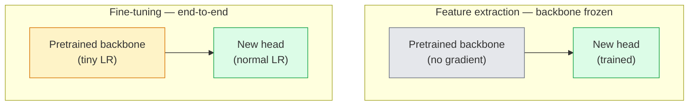

# 전이 학습(Transfer Learning)과 파인튜닝(Fine-Tuning)

> 누군가는 백만 GPU 시간을 들여 신경망(neural network)에게 가장자리, 질감, 객체 부분이 어떻게 생겼는지 가르쳤다. 우리는 새로 학습을 시작하기 전에 그 특성들을 빌려 쓴다.

**Type:** Build
**Languages:** Python
**Prerequisites:** Phase 4 Lesson 03 (CNNs), Phase 4 Lesson 04 (Image Classification)
**Time:** ~75분

## 학습 목표 (Learning Objectives)

- 특성 추출(feature extraction)과 파인튜닝(fine-tuning)을 구별하고, 데이터셋(dataset) 크기, 도메인 거리, 연산 예산을 바탕으로 올바른 것을 고르기
- 사전 학습(pretraining)된 백본(backbone)을 로드하고, 분류기 헤드(head)를 교체하고, 헤드만 20줄 이내로 동작하는 베이스라인(baseline)까지 학습시키기
- 변별적 학습률(discriminative learning rate)로 층을 점진적으로 해제(unfreeze)하여, 초기의 일반적 특성이 후기의 작업 특화 특성보다 작은 업데이트를 받도록 하기
- 세 가지 흔한 실패를 진단하기: 해제된 블록의 너무 높은 학습률(learning rate)로 인한 특성 표류, 작은 데이터셋에서의 BN 통계 붕괴, 그리고 파국적 망각(catastrophic forgetting)

## 문제 (The Problem)

ImageNet에서 ResNet-50을 학습시키는 데는 약 2,000 GPU 시간이 든다. 출고하는 모든 작업마다 그 예산을 가진 팀은 거의 없다. 거의 모든 팀이 실제로 출고하는 것은 수백 또는 수천 개의 작업 특화 이미지로 학습된 새 헤드를 가진 사전 학습된 백본이다.

이것은 지름길이 아니다. 모든 ImageNet 학습 CNN의 첫 합성곱(convolution) 블록은 가장자리와 가보(Gabor) 유사 필터를 학습한다. 다음 몇 블록은 질감과 단순한 모티프를 학습한다. 중간 블록은 객체 부분을 학습한다. 마지막 블록은 1,000개 ImageNet 범주처럼 보이기 시작하는 조합을 학습한다. 그 위계의 첫 90%는 의료 영상, 산업 검사, 위성 데이터를 비롯한 다른 모든 비전 작업에 거의 변경 없이 전이된다. 자연은 가장자리와 질감의 어휘가 한정되어 있기 때문이다. 마지막 10%가 실제로 학습시키는 부분이다.

전이를 제대로 하는 길목에는 세 가지 버그가 기다린다. 너무 높은 학습률로 사전 학습된 특성을 파괴하는 것, 너무 많이 고정하여 모델을 정보에 굶주리게 하는 것, 그리고 나머지 신경망이 한 번도 학습하지 않은 작은 데이터셋 쪽으로 BatchNorm의 실행 통계가 표류하게 두는 것이다. 이 레슨은 그 각각을 일부러 거쳐 간다.

## 개념 (The Concept)

### 특성 추출 대 파인튜닝

두 가지 체제. 사전 학습된 특성을 얼마나 신뢰하고 데이터가 얼마나 많은지로 고른다.



경험칙:

| 데이터셋 크기 | 도메인 거리 | 레시피 |
|--------------|-----------------|--------|
| < 1k 이미지 | ImageNet에 가까움 | 백본 고정, 헤드만 학습 |
| 1k-10k | 가까움 | 첫 2-3 스테이지 고정, 나머지 파인튜닝 |
| 10k-100k | 임의 | 변별적 LR로 종단 간 파인튜닝 |
| 100k+ | 멂 | 모든 것을 파인튜닝. 도메인이 충분히 멀면 밑바닥부터 학습 고려 |

"ImageNet에 가까움"은 대략 객체 같은 내용을 가진 자연 RGB 사진을 뜻한다. 의료 CT 스캔, 머리 위 위성 영상, 현미경 영상은 먼 도메인이다. 특성은 여전히 도움이 되지만 더 많은 층이 적응하도록 두어야 한다.

### 고정이 애초에 통하는 이유

CNN이 학습하는 ImageNet 특성은 1,000개 범주에 특화된 것이 아니다. 자연 이미지의 통계에 특화되어 있다. 특정 방향의 가장자리, 질감, 대비 패턴, 형태 기본형들이다. 그 통계는 인간이 이름 붙일 수 있는 거의 모든 시각 도메인에 걸쳐 안정적이다. 그것이 ImageNet에서 학습되고 새 선형 헤드만으로(백본 파인튜닝 없이) CIFAR-10에서 제로샷 평가된 모델이 80%+ 정확도에 도달하는 이유다. 헤드는 이 작업을 위해 이미 학습된 특성 중 어느 것에 가중치를 둘지 학습하고 있다.

### 변별적 학습률

해제할 때, 초기 층은 후기 층보다 느리게 학습되어야 한다. 초기 층은 보존하고 싶은 일반적 특성을 인코딩하고, 후기 층은 많이 움직여야 하는 작업 특화 구조를 인코딩한다.

```
Typical recipe:

  stage 0 (stem + first group): lr = base_lr / 100    (mostly fixed)
  stage 1:                       lr = base_lr / 10
  stage 2:                       lr = base_lr / 3
  stage 3 (last backbone group): lr = base_lr
  head:                          lr = base_lr  (or slightly higher)
```

PyTorch에서 이것은 옵티마이저(optimizer)에 전달되는 파라미터 그룹 목록일 뿐이다. 모델 하나, 학습률 다섯 개, 추가 코드 0줄.

### BatchNorm 문제

BN 층은 ImageNet에서 계산된 `running_mean`과 `running_var` 버퍼를 갖는다. 작업의 픽셀 분포가 다르면 — 다른 조명, 다른 센서, 다른 색 공간 — 그 버퍼는 틀렸다. 선호 순서대로 세 가지 선택지:

1. **BN을 train 모드로 둔 채 파인튜닝.** BN이 다른 모든 것과 함께 실행 통계를 업데이트하게 한다. 작업 데이터셋이 중간 크기(>= 5k 예제)일 때의 기본 선택.
2. **BN을 eval 모드로 고정.** ImageNet 통계를 유지하고 가중치(weight)만 학습한다. BN의 이동 평균이 잡음투성이일 만큼 데이터셋이 작을 때 옳다.
3. **BN을 GroupNorm으로 대체.** 이동 평균 문제를 완전히 제거한다. GPU당 배치(batch) 크기가 작은 검출 및 분할 백본에서 사용된다.

이것을 틀리면 정확도를 5-15% 조용히 깎아먹는다.

### 헤드 설계

분류기 헤드는 선형 층 1-3개에 선택적 드롭아웃을 더한 것이다. 모든 torchvision 백본은 교체 대상이 되는 기본 헤드를 함께 출고한다.

```
backbone.fc = nn.Linear(backbone.fc.in_features, num_classes)          # ResNet
backbone.classifier[1] = nn.Linear(..., num_classes)                    # EfficientNet, MobileNet
backbone.heads.head = nn.Linear(..., num_classes)                       # torchvision ViT
```

작은 데이터셋에는 보통 단일 선형 층으로 충분하다. 은닉층(Linear -> ReLU -> Dropout -> Linear)을 추가하는 것은 작업 분포가 백본의 학습 분포에서 더 멀 때 도움이 된다.

### 층별 LR 감쇠

현대 파인튜닝(BEiT, DINOv2, ViT-B 파인튜닝)에서 사용되는 변별적 LR의 더 매끄러운 버전이다. 층을 스테이지로 묶는 대신, 모든 층에 그 위 층보다 약간 작은 LR을 준다.

```
lr_layer_k = base_lr * decay^(L - k)
```

decay = 0.75에 L = 12 트랜스포머(transformer) 블록이면, 첫 블록은 헤드 LR의 `0.75^11 ≈ 0.04배`로 학습된다. 스테이지로 묶인 LR로 보통 충분한 CNN보다 트랜스포머 파인튜닝에 더 중요하다.

### 무엇을 평가할 것인가

전이 학습 실행은 밑바닥부터 학습할 때는 추적하지 않을 두 숫자가 필요하다.

- **사전 학습만의 정확도** — 백본을 고정한 헤드의 정확도. 이것이 바닥이다.
- **파인튜닝된 정확도** — 종단 간 학습 후의 같은 모델. 이것이 천장이다.

파인튜닝된 것이 사전 학습만의 것보다 낮으면, 학습률 또는 BN 버그가 있는 것이다. 항상 둘 다 출력하라.

## 직접 만들기 (Build It)

### 1단계: 사전 학습된 백본 로드하고 검사하기

```python
import torch
import torch.nn as nn
from torchvision.models import resnet18, ResNet18_Weights

backbone = resnet18(weights=ResNet18_Weights.IMAGENET1K_V1)
print(backbone)
print()
print("classifier head:", backbone.fc)
print("feature dim:", backbone.fc.in_features)
```

`ResNet18`은 스테이지 네 개(`layer1..layer4`)에 스템(stem)과 `fc` 헤드를 갖는다. 모든 torchvision 분류 백본은 유사한 구조를 갖는다.

### 2단계: 특성 추출 — 전부 고정하고 헤드 교체하기

```python
def make_feature_extractor(num_classes=10):
    model = resnet18(weights=ResNet18_Weights.IMAGENET1K_V1)
    for p in model.parameters():
        p.requires_grad = False
    model.fc = nn.Linear(model.fc.in_features, num_classes)
    return model

model = make_feature_extractor(num_classes=10)
trainable = sum(p.numel() for p in model.parameters() if p.requires_grad)
frozen = sum(p.numel() for p in model.parameters() if not p.requires_grad)
print(f"trainable: {trainable:>10,}")
print(f"frozen:    {frozen:>10,}")
```

`model.fc`만 학습 가능하다. 백본은 고정된 특성 추출기다.

### 3단계: 변별적 파인튜닝

스테이지별 학습률로 파라미터 그룹을 만드는 유틸리티.

```python
def discriminative_param_groups(model, base_lr=1e-3, decay=0.3):
    stages = [
        ["conv1", "bn1"],
        ["layer1"],
        ["layer2"],
        ["layer3"],
        ["layer4"],
        ["fc"],
    ]
    groups = []
    for i, names in enumerate(stages):
        lr = base_lr * (decay ** (len(stages) - 1 - i))
        params = [p for n, p in model.named_parameters()
                  if any(n.startswith(k) for k in names)]
        if params:
            groups.append({"params": params, "lr": lr, "name": "_".join(names)})
    return groups

model = resnet18(weights=ResNet18_Weights.IMAGENET1K_V1)
model.fc = nn.Linear(model.fc.in_features, 10)
for p in model.parameters():
    p.requires_grad = True

groups = discriminative_param_groups(model)
for g in groups:
    print(f"{g['name']:>10s}  lr={g['lr']:.2e}  params={sum(p.numel() for p in g['params']):>8,}")
```

`decay=0.3`은 각 스테이지가 다음 것의 30% 속도로 학습된다는 뜻이다. `fc`는 `base_lr`을, `layer4`는 `0.3 * base_lr`을, `conv1`은 `0.3^5 * base_lr ≈ 0.00243 * base_lr`을 받는다. 극단적으로 들리지만 경험적으로 통한다.

### 4단계: BatchNorm 처리

가중치는 고정하지 않으면서 BN 실행 통계를 고정하는 헬퍼.

```python
def freeze_bn_stats(model):
    for m in model.modules():
        if isinstance(m, (nn.BatchNorm1d, nn.BatchNorm2d, nn.BatchNorm3d)):
            m.eval()
            for p in m.parameters():
                p.requires_grad = False
    return model
```

모든 에폭(epoch) 시작에서 `model.train()`을 설정한 뒤에 호출하라. `model.train()`은 모든 것을 학습 모드로 전환하고, 이것은 BN 층에 대해서만 그것을 되돌린다.

### 5단계: 최소한의 종단 간 파인튜닝 루프

```python
from torch.optim import SGD
from torch.utils.data import DataLoader
from torch.optim.lr_scheduler import CosineAnnealingLR
import torch.nn.functional as F

def fine_tune(model, train_loader, val_loader, device, epochs=5, base_lr=1e-3, freeze_bn=False):
    model = model.to(device)
    groups = discriminative_param_groups(model, base_lr=base_lr)
    optimizer = SGD(groups, momentum=0.9, weight_decay=1e-4, nesterov=True)
    scheduler = CosineAnnealingLR(optimizer, T_max=epochs)

    for epoch in range(epochs):
        model.train()
        if freeze_bn:
            freeze_bn_stats(model)
        tr_loss, tr_correct, tr_total = 0.0, 0, 0
        for x, y in train_loader:
            x, y = x.to(device), y.to(device)
            logits = model(x)
            loss = F.cross_entropy(logits, y, label_smoothing=0.1)
            optimizer.zero_grad()
            loss.backward()
            optimizer.step()
            tr_loss += loss.item() * x.size(0)
            tr_total += x.size(0)
            tr_correct += (logits.argmax(-1) == y).sum().item()
        scheduler.step()

        model.eval()
        va_total, va_correct = 0, 0
        with torch.no_grad():
            for x, y in val_loader:
                x, y = x.to(device), y.to(device)
                pred = model(x).argmax(-1)
                va_total += x.size(0)
                va_correct += (pred == y).sum().item()
        print(f"epoch {epoch}  train {tr_loss/tr_total:.3f}/{tr_correct/tr_total:.3f}  "
              f"val {va_correct/va_total:.3f}")
    return model
```

CIFAR-10에서 위 레시피로 다섯 에폭을 돌리면 `ResNet18-IMAGENET1K_V1`을 약 70%의 제로샷 선형 프로브 정확도에서 약 93%의 파인튜닝된 정확도로 끌어올린다. 헤드만으로는 백본을 한 번도 건드리지 않은 채 약 86% 부근에서 정체할 것이다.

### 6단계: 점진적 해제

끝에서 시작 쪽으로 에폭당 한 스테이지씩 해제하는 스케줄이다. 약간의 추가 에폭을 대가로 특성 표류를 완화한다.

```python
def progressive_unfreeze_schedule(model):
    stages = ["layer4", "layer3", "layer2", "layer1"]
    yielded = set()

    def start():
        for p in model.parameters():
            p.requires_grad = False
        for p in model.fc.parameters():
            p.requires_grad = True

    def unfreeze(epoch):
        if epoch < len(stages):
            name = stages[epoch]
            yielded.add(name)
            for n, p in model.named_parameters():
                if n.startswith(name):
                    p.requires_grad = True
            return name
        return None

    return start, unfreeze
```

첫 에폭 전에 `start()`를 한 번 호출하라. 각 에폭 시작에서 `unfreeze(epoch)`를 호출하라. 학습 가능한 파라미터 집합이 바뀔 때마다 옵티마이저를 다시 만들어라. 그러지 않으면 고정된 파라미터가 여전히 캐시된 모멘트를 가져 옵티마이저를 혼란시킨다.

## 라이브러리로 써보기 (Use It)

대부분의 실제 작업에는 `torchvision.models` + 세 줄이면 충분하다. 위의 더 무거운 기계는 라이브러리 기본값이 고칠 수 없는 문제에 부딪힐 때 중요하다.

```python
from torchvision.models import resnet50, ResNet50_Weights

model = resnet50(weights=ResNet50_Weights.IMAGENET1K_V2)
model.fc = nn.Linear(model.fc.in_features, num_classes)
optimizer = torch.optim.AdamW(model.parameters(), lr=1e-4, weight_decay=1e-4)
```

다른 두 프로덕션(production) 등급 기본값:

- `timm`은 일관된 API로 약 800개의 사전 학습 비전 백본을 출고한다(`timm.create_model("resnet50", pretrained=True, num_classes=10)`). torchvision 동물원 너머의 어떤 파인튜닝에든 표준이다.
- 트랜스포머의 경우, `transformers.AutoModelForImageClassification.from_pretrained(name, num_labels=N)`은 텍스트 모델과 같은 로딩 의미론으로 ViT / BEiT / DeiT를 준다.

## 산출물 (Ship It)

이 레슨은 다음을 만든다.

- `outputs/prompt-fine-tune-planner.md` — 데이터셋 크기, 도메인 거리, 연산 예산을 바탕으로 특성 추출 대 점진적 대 종단 간 파인튜닝을 고르는 프롬프트.
- `outputs/skill-freeze-inspector.md` — PyTorch 모델이 주어지면 어떤 파라미터가 학습 가능한지, 어떤 BatchNorm 층이 eval 모드인지, 그리고 옵티마이저가 실제로 학습 가능한 파라미터를 받고 있는지 보고하는 스킬.

## 연습 문제 (Exercises)

1. **(쉬움)** 같은 합성-CIFAR 데이터셋에서 `ResNet18`을 선형 프로브(백본 고정)로, 그리고 전체 파인튜닝으로 학습시켜라. 두 정확도를 나란히 보고하라. 어느 격차가 특성이 잘 전이됨을 알려주고 어느 것이 그렇지 않음을 알려주는지 설명하라.
2. **(중간)** 일부러 버그를 도입하라: 헤드 대신 백본 스테이지에 `base_lr = 1e-1`을 설정하라. 학습 손실(loss)이 폭발하는 것을 보인 뒤, `discriminative_param_groups` 헬퍼를 적용해 복구하라. 각 스테이지가 발산하기 시작하는 LR을 기록하라.
3. **(어려움)** 의료 영상 데이터셋(예: CheXpert-small, PatchCamelyon, HAM10000)을 가져와 세 체제를 비교하라: (a) ImageNet 사전 학습 고정 백본 + 선형 헤드; (b) ImageNet 사전 학습 종단 간 파인튜닝; (c) 밑바닥부터 학습. 각각의 정확도와 연산 비용을 보고하라. 어떤 데이터셋 크기에서 밑바닥부터 학습이 경쟁력 있게 되는가?

## 핵심 용어 (Key Terms)

| 용어 | 사람들이 말하는 것 | 실제 의미 |
|------|----------------|----------------------|
| 특성 추출(Feature extraction) | "고정하고 헤드 학습" | 백본 파라미터를 고정하고, 새 분류기 헤드만 그래디언트를 받는다 |
| 파인튜닝(Fine-tuning) | "종단 간 재학습" | 모든 파라미터가 학습 가능하며, 보통 밑바닥부터 학습보다 훨씬 작은 LR을 쓴다 |
| 변별적 LR(Discriminative LR) | "초기 층에 더 작은 LR" | 초기 스테이지 LR이 후기 스테이지 LR의 일부인 옵티마이저 파라미터 그룹 |
| 층별 LR 감쇠(Layer-wise LR decay) | "매끄러운 LR 그래디언트" | 층당 LR에 decay^(L - k)를 곱한 것. 트랜스포머 파인튜닝에서 흔하다 |
| 파국적 망각(Catastrophic forgetting) | "모델이 ImageNet을 잃었다" | 너무 높은 LR이 새 작업 신호가 학습되기 전에 사전 학습된 특성을 덮어쓴다 |
| BN 통계 표류(BN statistics drift) | "실행 평균이 틀렸다" | 현재 작업과 다른 분포에서 계산된 BatchNorm running_mean/var가 조용히 정확도를 해친다 |
| 선형 프로브(Linear probe) | "고정 백본 + 선형 헤드" | 사전 학습된 특성의 평가 — 고정된 표현 위 최선의 선형 분류기의 정확도 |
| 파국적 붕괴(Catastrophic collapse) | "전부 한 클래스로 예측" | 헤드의 그래디언트가 안정화되기 전에 특성을 파괴할 만큼 높은 LR로 파인튜닝할 때 일어난다 |

## 더 읽을거리 (Further Reading)

- [How transferable are features in deep neural networks? (Yosinski et al., 2014)](https://arxiv.org/abs/1411.1792) — 층에 걸친 특성 전이성을 정량화한 논문
- [Universal Language Model Fine-tuning (ULMFiT, Howard & Ruder, 2018)](https://arxiv.org/abs/1801.06146) — 원조 변별적 LR / 점진적 해제 레시피. 그 아이디어는 비전으로 직접 전이된다
- [timm documentation](https://huggingface.co/docs/timm) — 현대 비전 백본과 그것들이 학습된 정확한 파인튜닝 기본값에 대한 참고 자료
- [A Simple Framework for Linear-Probe Evaluation (Kornblith et al., 2019)](https://arxiv.org/abs/1805.08974) — 선형 프로브 정확도가 왜 중요하고 어떻게 올바르게 보고하는지
