# 객체 검출(Object Detection) — 밑바닥부터 만드는 YOLO

> 검출은 분류(classification)에 회귀(regression)를 더한 것이며, 특성 맵의 모든 위치에서 실행한 뒤 비최댓값 억제(non-maximum suppression)로 정리한 것이다.

**Type:** Build
**Languages:** Python
**Prerequisites:** Phase 4 Lesson 03 (CNNs), Phase 4 Lesson 04 (Image Classification), Phase 4 Lesson 05 (Transfer Learning)
**Time:** ~75분

## 학습 목표 (Learning Objectives)

- 검출을 밀집 예측(dense prediction) 문제로 바꾸는 그리드-앵커 설계를 설명하고, 출력 텐서(tensor)의 모든 숫자가 무엇을 의미하는지 말하기
- 박스들 사이의 합집합 대비 교집합(Intersection-over-Union)을 계산하고 비최댓값 억제를 밑바닥부터 구현하기
- 분류, 객체성(objectness), 박스 회귀 손실(loss)을 포함해 사전 학습(pretraining)된 백본(backbone) 위에 최소한의 YOLO 스타일 헤드(head)를 만들기
- 검출 지표 행(precision@0.5, recall, mAP@0.5, mAP@0.5:0.95)을 읽고 다음에 어떤 손잡이를 돌릴지 고르기

## 문제 (The Problem)

분류는 "이 이미지는 개다"라고 말한다. 검출은 "픽셀 (112, 40, 280, 210)에 개가 있고, (400, 180, 560, 310)에 고양이가 있으며, 프레임에 다른 것은 없다"라고 말한다. 그 하나의 구조적 변화 — 이미지당 레이블 하나가 아니라 가변 개수의 레이블링된 박스를 예측하는 것 — 이 모든 자율 시스템, 모든 감시 제품, 모든 문서 레이아웃 파서, 모든 공장 비전 라인이 의존하는 것이다.

검출은 또한 비전의 모든 엔지니어링 트레이드오프(trade-off)가 한꺼번에 나타나는 곳이다. 정확한 박스(회귀 헤드)를 원하고, 각 박스에 대한 올바른 클래스(분류 헤드)를 원하고, 검출할 것이 없을 때 모델이 그것을 알기를 원하고(객체성 점수), 실제 객체당 정확히 하나의 예측(비최댓값 억제)을 원한다. 이 중 하나라도 놓치면 파이프라인은 객체를 놓치거나, 환각 박스를 보고하거나, 같은 객체를 약간 다른 위치에 열다섯 번 예측한다.

YOLO(You Only Look Once, Redmon et al. 2016)는 이 모든 것을 합성곱(convolution) 신경망의 단일 순방향 패스로 수행하여 실시간으로 실행되게 만든 설계였고, 같은 구조적 결정이 여전히 현대 검출기(YOLOv8, YOLOv9, YOLO-NAS, RT-DETR)의 근간이다. 핵심을 배우면 모든 변종이 같은 부품들의 재배열이 된다.

## 개념 (The Concept)

### 밀집 예측으로서의 검출

분류기는 이미지당 C개의 숫자를 출력한다. YOLO 스타일 검출기는 이미지당 `(S x S x (5 + C))`개의 숫자를 출력하는데, 여기서 S는 공간 그리드 크기다.

```mermaid
flowchart LR
    IMG["Input 416x416 RGB"] --> BB["Backbone<br/>(ResNet, DarkNet, ...)"]
    BB --> FM["Feature map<br/>(C_feat, 13, 13)"]
    FM --> HEAD["Detection head<br/>(1x1 convs)"]
    HEAD --> OUT["Output tensor<br/>(13, 13, B * (5 + C))"]
    OUT --> DEC["Decode<br/>(grid + sigmoid + exp)"]
    DEC --> NMS["Non-max suppression"]
    NMS --> RESULT["Final boxes"]

    style IMG fill:#dbeafe,stroke:#2563eb
    style HEAD fill:#fef3c7,stroke:#d97706
    style NMS fill:#fecaca,stroke:#dc2626
    style RESULT fill:#dcfce7,stroke:#16a34a
```



`S * S`개의 그리드 셀 각각이 `B`개의 박스를 예측한다. 각 박스에 대해:

- 숫자 4개가 기하 구조를 기술한다: `tx, ty, tw, th`.
- 숫자 1개가 객체성 점수다: "이 셀에 중심을 둔 객체가 있는가?"
- 숫자 C개가 클래스 확률이다.

셀당 총합: `B * (5 + C)`. `S=13, B=2, C=20`인 VOC의 경우 셀당 50개의 숫자다.

### 왜 그리드와 앵커인가

순수 회귀라면 모든 객체에 대해 `(x, y, w, h)`를 절대 좌표로 예측할 것이다. 그것은 합성곱 신경망에게 어렵다. 이미지를 평행이동하면 모든 예측이 같은 양만큼 평행이동해서는 안 되기 때문이다 — 각 객체는 공간적으로 고정(anchor)되어 있다. 그리드는 각 정답 박스를 그 중심이 떨어지는 그리드 셀에 할당함으로써 이를 해결한다. 그 셀만이 그 객체를 책임진다.

앵커(anchor)는 두 번째 문제를 다룬다. 3x3 합성곱은 16픽셀 수용 영역(receptive field) 특성 셀에서 500픽셀 너비의 박스를 쉽게 회귀할 수 없다. 대신, 셀당 `B`개의 사전 박스 형태(앵커)를 미리 정의하고 각 앵커로부터의 작은 델타를 예측한다. 모델은 무에서 회귀하기보다 올바른 앵커를 골라 그것을 살짝 미는 법을 학습한다.

```
Anchor box priors (example for 416x416 input):

  small:   (30,  60)
  medium:  (75,  170)
  large:   (200, 380)

At each grid cell, every anchor emits (tx, ty, tw, th, obj, c_1, ..., c_C).
```

현대 검출기는 해상도별로 다른 앵커 집합을 가진 FPN을 흔히 사용한다 — 얕은 고해상도 맵에는 작은 앵커, 깊은 저해상도 맵에는 큰 앵커. 같은 아이디어, 더 많은 스케일.

### 예측 디코딩

원시 `tx, ty, tw, th`는 박스 좌표가 아니다. 그리기 전에 변환되어야 할 회귀 목표다.

```
centre x  = (sigmoid(tx) + cell_x) * stride
centre y  = (sigmoid(ty) + cell_y) * stride
width     = anchor_w * exp(tw)
height    = anchor_h * exp(th)
```

`sigmoid`는 중심 오프셋을 셀 안에 유지한다. `exp`는 부호 반전 없이 너비가 앵커로부터 자유롭게 스케일링되게 한다. `stride`는 그리드 좌표를 다시 픽셀로 스케일링한다. 이 디코드 단계는 v2 이후 모든 YOLO 버전에서 동일하다.

### IoU

두 박스 사이의 검출의 보편적 유사도 지표다.

```
IoU(A, B) = area(A intersect B) / area(A union B)
```

IoU = 1은 동일함을, IoU = 0은 겹침이 없음을 뜻한다. 예측과 정답 박스 사이의 IoU가 예측이 참 양성으로 셈해지는지를 결정한다(보통 IoU >= 0.5). 두 예측 사이의 IoU가 NMS가 중복 제거에 사용하는 것이다.

### 비최댓값 억제

인접한 앵커로 학습된 합성곱 신경망은 같은 객체에 대해 겹치는 박스를 자주 예측한다. NMS는 가장 높은 신뢰도의 예측을 유지하고 임계값 이상의 IoU를 가진 다른 모든 예측을 삭제한다.

```
NMS(boxes, scores, iou_threshold):
    sort boxes by score descending
    keep = []
    while boxes not empty:
        pick the top-scoring box, add to keep
        remove every box with IoU > iou_threshold to the picked box
    return keep
```

전형적 임계값: 객체 검출에 0.45. 최근 검출기는 표준 NMS를 `soft-NMS`, `DIoU-NMS`로 대체하거나 억제를 직접 학습한다(RT-DETR). 하지만 구조적 목적은 같다.

### 손실

YOLO 손실은 가중치와 함께 더해진 세 손실이다.

```
L = lambda_coord * L_box(pred, target, where obj=1)
  + lambda_obj   * L_obj(pred, 1,     where obj=1)
  + lambda_noobj * L_obj(pred, 0,     where obj=0)
  + lambda_cls   * L_cls(pred, target, where obj=1)
```

객체를 포함하는 셀만이 박스 회귀와 분류 손실에 기여한다. 객체가 없는 셀은 객체성 손실에만 기여한다(모델이 침묵을 지키도록 가르침). `lambda_noobj`는 보통 작다(~0.5). 대부분의 셀이 비어 있어 그러지 않으면 전체 손실을 지배할 것이기 때문이다.

현대 변종은 MSE 박스 손실을 CIoU / DIoU(IoU를 직접 최적화)로 바꾸고, 클래스 불균형에 포컬 손실(focal loss)을 쓰며, 품질 포컬 손실로 객체성을 균형 맞춘다. 세 구성 요소 구조는 변하지 않는다.

### 검출 지표

정확도(accuracy)는 검출로 전이되지 않는다. 전이되는 네 숫자:

- **Precision@IoU=0.5** — 양성으로 셈해진 예측 중 실제로 옳은 것이 얼마나 되는가.
- **Recall@IoU=0.5** — 실제 객체 중 우리가 얼마나 찾았는가.
- **AP@0.5** — IoU 임계값 0.5에서의 정밀도-재현율 곡선 면적. 클래스당 숫자 하나.
- **mAP@0.5:0.95** — IoU 임계값 0.5, 0.55, ..., 0.95에 걸친 AP의 평균. COCO 지표. 가장 엄격하고 정보량이 많다.

넷 모두 보고하라. mAP@0.5에서는 강하지만 mAP@0.5:0.95에서는 약한 검출기는 대략적으로 위치를 잡지만 타이트하게는 못 잡는 것이다. 더 나은 박스 회귀 손실로 고친다. 정밀도가 높고 재현율이 낮은 검출기는 너무 보수적이다. 신뢰도 임계값을 낮추거나 객체성 가중치를 높인다.

## 직접 만들기 (Build It)

### 1단계: IoU

레슨 전체의 일꾼이다. `(x1, y1, x2, y2)` 형식의 두 박스 배열에서 동작한다.

```python
import numpy as np

def box_iou(boxes_a, boxes_b):
    ax1, ay1, ax2, ay2 = boxes_a[:, 0], boxes_a[:, 1], boxes_a[:, 2], boxes_a[:, 3]
    bx1, by1, bx2, by2 = boxes_b[:, 0], boxes_b[:, 1], boxes_b[:, 2], boxes_b[:, 3]

    inter_x1 = np.maximum(ax1[:, None], bx1[None, :])
    inter_y1 = np.maximum(ay1[:, None], by1[None, :])
    inter_x2 = np.minimum(ax2[:, None], bx2[None, :])
    inter_y2 = np.minimum(ay2[:, None], by2[None, :])

    inter_w = np.clip(inter_x2 - inter_x1, 0, None)
    inter_h = np.clip(inter_y2 - inter_y1, 0, None)
    inter = inter_w * inter_h

    area_a = (ax2 - ax1) * (ay2 - ay1)
    area_b = (bx2 - bx1) * (by2 - by1)
    union = area_a[:, None] + area_b[None, :] - inter
    return inter / np.clip(union, 1e-8, None)
```

쌍별 IoU의 `(N_a, N_b)` 행렬을 반환한다. 배열 중 하나를 `(1, 4)` 형태로 만들어 단일 정답 박스에 대해 사용하라.

### 2단계: 비최댓값 억제

```python
def nms(boxes, scores, iou_threshold=0.45):
    order = np.argsort(-scores)
    keep = []
    while len(order) > 0:
        i = order[0]
        keep.append(i)
        if len(order) == 1:
            break
        rest = order[1:]
        ious = box_iou(boxes[[i]], boxes[rest])[0]
        order = rest[ious <= iou_threshold]
    return np.array(keep, dtype=np.int64)
```

결정론적이고, 정렬에서 비롯된 `O(N log N)`이며, 동일한 입력에서 `torchvision.ops.nms`의 동작과 일치한다.

### 3단계: 박스 인코딩과 디코딩

픽셀 좌표와 신경망이 실제로 회귀하는 `(tx, ty, tw, th)` 목표 사이를 변환한다.

```python
def encode(box_xyxy, cell_x, cell_y, stride, anchor_wh):
    x1, y1, x2, y2 = box_xyxy
    cx = 0.5 * (x1 + x2)
    cy = 0.5 * (y1 + y2)
    w = x2 - x1
    h = y2 - y1
    tx = cx / stride - cell_x
    ty = cy / stride - cell_y
    tw = np.log(w / anchor_wh[0] + 1e-8)
    th = np.log(h / anchor_wh[1] + 1e-8)
    return np.array([tx, ty, tw, th])


def decode(tx_ty_tw_th, cell_x, cell_y, stride, anchor_wh):
    tx, ty, tw, th = tx_ty_tw_th
    cx = (sigmoid(tx) + cell_x) * stride
    cy = (sigmoid(ty) + cell_y) * stride
    w = anchor_wh[0] * np.exp(tw)
    h = anchor_wh[1] * np.exp(th)
    return np.array([cx - w / 2, cy - h / 2, cx + w / 2, cy + h / 2])


def sigmoid(x):
    return 1.0 / (1.0 + np.exp(-x))
```

테스트: 박스를 인코딩한 뒤 디코딩하라 — 원본과 매우 가까운 무언가를 되돌려받아야 한다(`tx`가 시그모이드 이후 범위에 있지 않을 때 시그모이드 역함수가 완벽하게 가역이 아닌 만큼은 제외).

### 4단계: 최소한의 YOLO 헤드

특성 맵 위의 1x1 합성곱 하나, `(B, S, S, num_anchors, 5 + C)`로 재형성.

```python
import torch
import torch.nn as nn

class YOLOHead(nn.Module):
    def __init__(self, in_c, num_anchors, num_classes):
        super().__init__()
        self.num_anchors = num_anchors
        self.num_classes = num_classes
        self.conv = nn.Conv2d(in_c, num_anchors * (5 + num_classes), kernel_size=1)

    def forward(self, x):
        n, _, h, w = x.shape
        y = self.conv(x)
        y = y.view(n, self.num_anchors, 5 + self.num_classes, h, w)
        y = y.permute(0, 3, 4, 1, 2).contiguous()
        return y
```

출력 형태: `(N, H, W, num_anchors, 5 + C)`. 마지막 차원이 `[tx, ty, tw, th, obj, cls_0, ..., cls_{C-1}]`을 담는다.

### 5단계: 정답 할당

모든 정답 박스에 대해, 어떤 `(cell, anchor)`가 책임지는지 결정한다.

```python
def assign_targets(boxes_xyxy, classes, anchors, stride, grid_size, num_classes):
    num_anchors = len(anchors)
    target = np.zeros((grid_size, grid_size, num_anchors, 5 + num_classes), dtype=np.float32)
    has_obj = np.zeros((grid_size, grid_size, num_anchors), dtype=bool)

    for box, cls in zip(boxes_xyxy, classes):
        x1, y1, x2, y2 = box
        cx, cy = 0.5 * (x1 + x2), 0.5 * (y1 + y2)
        gx, gy = int(cx / stride), int(cy / stride)
        bw, bh = x2 - x1, y2 - y1

        ious = np.array([
            (min(bw, aw) * min(bh, ah)) / (bw * bh + aw * ah - min(bw, aw) * min(bh, ah))
            for aw, ah in anchors
        ])
        best = int(np.argmax(ious))
        aw, ah = anchors[best]

        target[gy, gx, best, 0] = cx / stride - gx
        target[gy, gx, best, 1] = cy / stride - gy
        target[gy, gx, best, 2] = np.log(bw / aw + 1e-8)
        target[gy, gx, best, 3] = np.log(bh / ah + 1e-8)
        target[gy, gx, best, 4] = 1.0
        target[gy, gx, best, 5 + cls] = 1.0
        has_obj[gy, gx, best] = True
    return target, has_obj
```

앵커 선택은 "정답과의 최선의 형태 IoU"다 — YOLOv2/v3 할당과 일치하는 저렴한 대용물이다. v5 이후는 같은 아이디어를 정제하는 더 정교한 전략(작업 정렬 매칭, 동적 k)을 사용한다.

### 6단계: 세 가지 손실

```python
def yolo_loss(pred, target, has_obj, lambda_coord=5.0, lambda_obj=1.0, lambda_noobj=0.5, lambda_cls=1.0):
    has_obj_t = torch.from_numpy(has_obj).bool()
    target_t = torch.from_numpy(target).float()

    # box-regression loss: only on cells with objects
    box_pred = pred[..., :4][has_obj_t]
    box_true = target_t[..., :4][has_obj_t]
    loss_box = torch.nn.functional.mse_loss(box_pred, box_true, reduction="sum")

    # objectness loss
    obj_pred = pred[..., 4]
    obj_true = target_t[..., 4]
    loss_obj_pos = torch.nn.functional.binary_cross_entropy_with_logits(
        obj_pred[has_obj_t], obj_true[has_obj_t], reduction="sum")
    loss_obj_neg = torch.nn.functional.binary_cross_entropy_with_logits(
        obj_pred[~has_obj_t], obj_true[~has_obj_t], reduction="sum")

    # classification loss on cells with objects
    cls_pred = pred[..., 5:][has_obj_t]
    cls_true = target_t[..., 5:][has_obj_t]
    loss_cls = torch.nn.functional.binary_cross_entropy_with_logits(
        cls_pred, cls_true, reduction="sum")

    total = (lambda_coord * loss_box
             + lambda_obj * loss_obj_pos
             + lambda_noobj * loss_obj_neg
             + lambda_cls * loss_cls)
    return total, {"box": loss_box.item(), "obj_pos": loss_obj_pos.item(),
                   "obj_neg": loss_obj_neg.item(), "cls": loss_cls.item()}
```

모든 YOLO 튜토리얼이 하드코딩하거나 스윕하는 다섯 개의 하이퍼파라미터(hyperparameter)다. 비율이 중요하다. `lambda_coord=5, lambda_noobj=0.5`는 원조 YOLOv1 논문을 반영하며 여전히 합리적인 기본값으로 통한다.

### 7단계: 추론 파이프라인

원시 헤드 출력을 디코딩하고, sigmoid/exp를 적용하고, 객체성에 임계값을 두고, NMS를 수행한다.

```python
def postprocess(pred_tensor, anchors, stride, img_size, conf_threshold=0.25, iou_threshold=0.45):
    pred = pred_tensor.detach().cpu().numpy()
    grid_h, grid_w = pred.shape[1], pred.shape[2]
    num_anchors = len(anchors)

    boxes, scores, classes = [], [], []
    for gy in range(grid_h):
        for gx in range(grid_w):
            for a in range(num_anchors):
                tx, ty, tw, th, obj, *cls = pred[0, gy, gx, a]
                score = sigmoid(obj) * sigmoid(np.array(cls)).max()
                if score < conf_threshold:
                    continue
                cls_idx = int(np.argmax(cls))
                cx = (sigmoid(tx) + gx) * stride
                cy = (sigmoid(ty) + gy) * stride
                w = anchors[a][0] * np.exp(tw)
                h = anchors[a][1] * np.exp(th)
                boxes.append([cx - w / 2, cy - h / 2, cx + w / 2, cy + h / 2])
                scores.append(float(score))
                classes.append(cls_idx)

    if not boxes:
        return np.zeros((0, 4)), np.zeros((0,)), np.zeros((0,), dtype=int)
    boxes = np.array(boxes)
    scores = np.array(scores)
    classes = np.array(classes)
    keep = nms(boxes, scores, iou_threshold)
    return boxes[keep], scores[keep], classes[keep]
```

그것이 완전한 평가 경로다: 헤드 -> 디코드 -> 임계값 -> NMS.

## 라이브러리로 써보기 (Use It)

`torchvision.models.detection`은 같은 개념적 구조를 가진 프로덕션(production) 검출기를 출고한다. 사전 학습된 모델을 로드하는 데는 세 줄이 든다.

```python
import torch
from torchvision.models.detection import fasterrcnn_resnet50_fpn_v2

model = fasterrcnn_resnet50_fpn_v2(weights="DEFAULT")
model.eval()
with torch.no_grad():
    predictions = model([torch.randn(3, 400, 600)])
print(predictions[0].keys())
print(f"boxes:  {predictions[0]['boxes'].shape}")
print(f"scores: {predictions[0]['scores'].shape}")
print(f"labels: {predictions[0]['labels'].shape}")
```

실시간 추론 파이프라인에는 `ultralytics`(YOLOv8/v9)가 표준이다: `from ultralytics import YOLO; model = YOLO('yolov8n.pt'); model(img)`. 이 모델은 디코딩과 NMS를 내부에서 처리하고, 당신이 위에서 만든 것과 같은 `boxes / scores / labels` 삼중쌍을 반환한다.

## 산출물 (Ship It)

이 레슨은 다음을 만든다.

- `outputs/prompt-detection-metric-reader.md` — `precision, recall, AP, mAP@0.5:0.95` 행을 한 줄 진단과 가장 유용한 다음 실험으로 바꾸는 프롬프트(prompt).
- `outputs/skill-anchor-designer.md` — 정답 박스 데이터셋(dataset)이 주어지면 `(w, h)`에 k-평균을 돌려 FPN 레벨별 앵커 집합과 올바른 앵커 수를 고르는 데 필요한 커버리지 통계를 반환하는 스킬.

## 연습 문제 (Exercises)

1. **(쉬움)** `box_iou`를 구현하고 1,000개의 무작위 박스 쌍에 대해 `torchvision.ops.box_iou`와 비교하여 실행하라. 최대 절대 차이가 `1e-6` 미만임을 검증하라.
2. **(중간)** `yolo_loss`를 MSE 대신 `CIoU` 박스 손실을 쓰는 버전으로 포팅하라. 100개 이미지 합성 데이터셋에서 CIoU가 같은 에폭(epoch) 수에서 MSE보다 더 나은 최종 mAP@0.5:0.95로 수렴함을 보여라.
3. **(어려움)** 다중 스케일 추론을 구현하라: 같은 이미지를 세 해상도로 모델에 넣고, 박스 예측을 합치고, 마지막에 단일 NMS를 수행하라. 보류 세트에서 단일 스케일 추론 대비 mAP 상승을 측정하라.

## 핵심 용어 (Key Terms)

| 용어 | 사람들이 말하는 것 | 실제 의미 |
|------|----------------|----------------------|
| 앵커(Anchor) | "박스 사전(prior)" | 신경망이 절대 좌표 대신 델타를 예측하는, 각 그리드 셀의 사전 정의된 박스 형태 |
| IoU | "겹침" | 두 박스의 합집합 대비 교집합. 검출에서의 보편적 유사도 척도 |
| NMS | "중복 제거" | 가장 높은 점수의 예측을 유지하고 임계값 이상의 겹치는 예측을 제거하는 탐욕 알고리즘 |
| 객체성(Objectness) | "여기 무언가 있는가" | 객체가 그 셀에 중심을 두는지 예측하는 앵커별, 셀별 스칼라 |
| 그리드 스트라이드(Grid stride) | "다운샘플 인자" | 그리드 셀당 픽셀 수. 13-그리드 헤드를 가진 416-px 입력은 스트라이드 32다 |
| mAP | "평균 정밀도 평균" | 클래스에 걸쳐, 그리고 (COCO의 경우) IoU 임계값에 걸쳐 평균낸 정밀도-재현율 곡선 아래 면적의 평균 |
| AP@0.5 | "PASCAL VOC AP" | IoU 임계값 0.5에서의 평균 정밀도. 지표의 관대한 버전 |
| mAP@0.5:0.95 | "COCO AP" | IoU 임계값 0.5..0.95를 0.05 간격으로 평균낸 것. 엄격한 버전이자 현재 커뮤니티 표준 |

## 더 읽을거리 (Further Reading)

- [YOLOv1: You Only Look Once (Redmon et al., 2016)](https://arxiv.org/abs/1506.02640) — 창립 논문. 이후의 모든 YOLO는 이 구조의 정제다
- [YOLOv3 (Redmon & Farhadi, 2018)](https://arxiv.org/abs/1804.02767) — 다중 스케일 FPN 스타일 헤드를 도입한 논문. 여전히 가장 명료한 다이어그램
- [Ultralytics YOLOv8 docs](https://docs.ultralytics.com) — 현재 프로덕션 참고 자료. 데이터셋 형식, 증강, 학습 레시피를 다룬다
- [The Illustrated Guide to Object Detection (Jonathan Hui)](https://jonathan-hui.medium.com/object-detection-series-24d03a12f904) — 전체 검출기 동물원에 대한 최고의 평이한 영어 투어. DETR, RetinaNet, FCOS, YOLO가 어떻게 관계되는지 이해하는 데 값을 매길 수 없다
