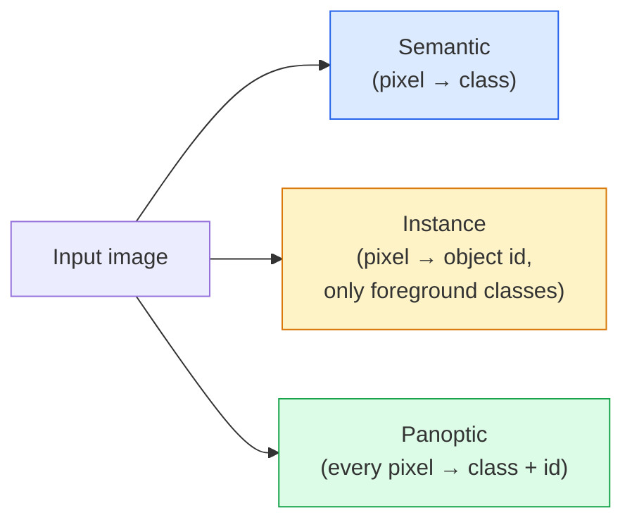
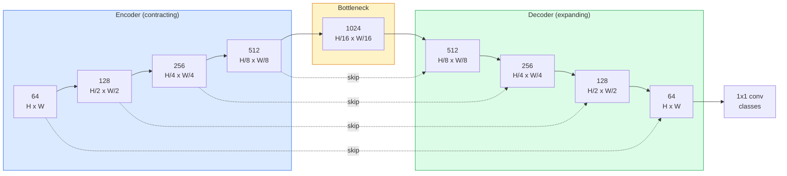

# 의미 분할(Semantic Segmentation) — U-Net

> 분할(segmentation)은 모든 픽셀에서의 분류(classification)다. U-Net은 다운샘플링 인코더(encoder)와 업샘플링 디코더(decoder)를 짝짓고 그 사이에 스킵 연결(skip connection)을 배선하여 이를 동작하게 만든다.

**Type:** Build
**Languages:** Python
**Prerequisites:** Phase 4 Lesson 03 (CNNs), Phase 4 Lesson 04 (Image Classification)
**Time:** ~75분

## 학습 목표 (Learning Objectives)

- 의미(semantic), 인스턴스(instance), 파놉틱(panoptic) 분할을 구별하고 주어진 문제에 올바른 작업을 고르기
- 인코더 블록, 병목(bottleneck), 전치 합성곱(transposed convolution)을 가진 디코더, 스킵 연결로 PyTorch에서 U-Net을 밑바닥부터 만들기
- 픽셀별 교차 엔트로피(cross-entropy), Dice 손실(loss), 그리고 의료 및 산업 분할의 현재 기본값인 결합 손실을 구현하기
- 클래스별 IoU와 Dice 지표를 읽고, 나쁜 점수가 작은 객체 재현율, 경계 정확도, 클래스 불균형 중 무엇에서 오는지 진단하기

## 문제 (The Problem)

분류는 이미지당 레이블 하나를 출력한다. 검출은 이미지당 박스 몇 개를 출력한다. 분할은 픽셀당 레이블 하나를 출력한다. 크기 `H x W`의 입력에 대해, 출력은 `H x W` 형태(의미)이거나 `H x W x N_instances` 형태(인스턴스)의 텐서(tensor)다. 그것은 이미지당 하나가 아니라 수백만 개의 예측이다.

분할의 구조는 그것이 거의 모든 밀집 예측 비전 제품을 구동하는 이유다. 의료 영상(종양 마스크), 자율 주행(도로, 차선, 장애물), 위성(건물 발자국, 작물 경계), 문서 파싱(레이아웃 구역), 로보틱스(잡을 수 있는 영역). 그 작업들 중 어느 것도 객체에 박스를 두르는 것으로 풀 수 없다. 정확한 실루엣이 필요하다.

아키텍처 문제는 진술하기는 간단하지만 풀기는 간단하지 않다. 신경망이 이미지의 전역 맥락(이것이 어떤 종류의 장면인가)과 국소 픽셀 디테일(정확히 어떤 픽셀이 도로인지 보도인지)을 동시에 보게 해야 한다. 표준 CNN은 맥락을 얻기 위해 공간적으로 압축하는데, 이는 디테일을 버린다. U-Net은 둘 다 잡은 설계였다.

## 개념 (The Concept)

### 의미 대 인스턴스 대 파놉틱



- **의미** 분할은 "이 픽셀은 도로, 저 픽셀은 자동차"라고 말한다. 나란히 있는 두 자동차는 하나의 덩어리로 합쳐진다.
- **인스턴스** 분할은 "이 픽셀은 자동차 #3, 저 픽셀은 자동차 #5"라고 말한다. 배경 "stuff"(하늘, 도로, 잔디)는 무시한다.
- **파놉틱** 분할은 둘을 통합한다. 모든 픽셀이 클래스 레이블을 받고, 모든 인스턴스가 고유 id를 받으며, stuff와 things 둘 다 분할된다.

이 레슨은 의미 분할을 다룬다. 다음 레슨(Mask R-CNN)이 인스턴스를 다룬다.

### U-Net 형태



인코더는 공간 해상도를 네 번 절반으로 줄이고 채널을 두 배로 늘린다. 디코더는 반대로 한다. 공간 해상도를 네 번 두 배로 늘리고 채널을 절반으로 줄인다. 스킵 연결은 모든 해상도에서 대응하는 인코더 특성을 디코더 특성과 연결(concatenate)한다. 최종 1x1 합성곱은 전체 해상도에서 `64 -> num_classes`로 매핑한다.

스킵 연결이 필요한 이유: 디코더는 픽셀 수준 예측을 출력하려 할 무렵 작은 특성 맵만 봤다. 스킵이 없으면 그 정보가 인코더에서 압축되어 사라졌기 때문에 가장자리를 정확히 위치 짓지 못한다. 스킵 연결은 인코더가 내려가는 길에 계산한 고해상도 특성 맵을 디코더에 건넨다.

### 전치 합성곱 대 양선형 업샘플

디코더는 공간 차원을 확장해야 한다. 두 선택지:

- **전치 합성곱**(`nn.ConvTranspose2d`) — 학습 가능한 업샘플. 역사적 U-Net 기본값. 스트라이드와 커널 크기가 균등하게 나뉘지 않으면 체커보드 아티팩트를 만들 수 있다.
- **양선형 업샘플 + 3x3 합성곱** — 매끄러운 업샘플 뒤에 합성곱. 아티팩트가 더 적고, 파라미터(parameter)가 더 적으며, 이제 현대적 기본값이다.

둘 다 야생에서 나타난다. 첫 U-Net에는 양선형이 더 안전하다.

### 픽셀 격자에서의 교차 엔트로피

C개 클래스를 가진 의미 분할의 경우, 모델 출력은 `(N, C, H, W)`다. 목표는 정수 클래스 ID를 가진 `(N, H, W)`다. 교차 엔트로피는 분류 경우와 동일하며, 단지 모든 공간 위치에 적용될 뿐이다.

```
Loss = mean over (n, h, w) of -log( softmax(logits[n, :, h, w])[target[n, h, w]] )
```

PyTorch의 `F.cross_entropy`는 이 형태를 기본적으로 처리한다. 재형성이 필요 없다.

### Dice 손실과 그것이 필요한 이유

교차 엔트로피는 모든 픽셀을 동등하게 취급한다. 한 클래스가 프레임을 지배할 때(의료 영상: 99% 배경, 1% 종양) 그것은 틀렸다. 신경망은 어디서나 배경을 예측하여 99% 정확도를 기록하면서도 여전히 쓸모없을 수 있다.

Dice 손실은 예측 마스크와 실제 마스크 사이의 겹침을 직접 최적화하여 이를 해결한다.

```
Dice(p, y) = 2 * sum(p * y) / (sum(p) + sum(y) + epsilon)
Dice_loss = 1 - Dice
```

여기서 `p`는 한 클래스에 대한 sigmoid/softmax 확률 맵이고 `y`는 이진 정답 마스크다. 손실은 겹침이 완벽할 때만 0이다. 비율 기반이므로 클래스 불균형은 무관하다.

실무에서는 **결합 손실**을 쓴다.

```
L = L_cross_entropy + lambda * L_dice       (lambda ~ 1)
```

교차 엔트로피는 학습 초기에 안정적인 그래디언트(gradient)를 주고, Dice는 학습의 꼬리 부분이 실제로 마스크 형태를 맞추는 데 집중하게 한다. 이 조합은 의료 영상 기본값이며 어떤 클래스 불균형 데이터셋(dataset)에서도 이기기 어렵다.

### 평가 지표

- **픽셀 정확도** — 올바르게 예측된 픽셀의 비율. 저렴하다. 분류에서의 정확도와 같은 이유로 불균형 데이터에서 망가진다.
- **클래스별 IoU** — 각 클래스 마스크의 합집합 대비 교집합. 클래스에 걸친 평균 = mIoU.
- **Dice (픽셀에 대한 F1)** — IoU와 유사하다. `Dice = 2 * IoU / (1 + IoU)`. 의료 영상은 Dice를, 주행 커뮤니티는 IoU를 선호한다. 둘은 단조롭게 관련되어 있다.
- **경계 F1** — 예측된 경계가 정답 경계에 얼마나 가까운지 측정하며, 작은 이동도 벌점을 준다. 반도체 검사 같은 고정밀 작업에 중요하다.

mIoU만이 아니라 클래스별 IoU를 보고하라. 평균 IoU는 아홉 개가 85%일 때 한 클래스가 15%인 것을 숨긴다.

### 입력 해상도 트레이드오프

U-Net의 인코더는 해상도를 네 번 절반으로 줄이므로, 입력은 16으로 나누어떨어져야 한다. 의료 이미지는 흔히 512x512 또는 1024x1024다. 자율 주행 크롭은 2048x1024다. U-Net의 메모리 비용은 `H * W * C_max`에 따라 스케일링되며, 1024 병목 채널을 가진 1024x1024에서 순방향 패스는 이미 기가바이트의 VRAM을 쓴다.

두 가지 표준 우회책:
1. 입력을 타일링한다 — 겹침을 두고 256x256 타일을 처리한 뒤 꿰맨다.
2. 병목을 공간 해상도를 더 높게 유지하면서 수용 영역(receptive field)을 넓히는 팽창 합성곱(dilated convolution)으로 대체한다(DeepLab 계열).

첫 모델에는 64채널 기반 U-Net을 가진 256x256 입력이 8 GB VRAM에서 편안하게 학습된다.

## 직접 만들기 (Build It)

### 1단계: 인코더 블록

배치 정규화(batch norm)와 ReLU를 가진 3x3 합성곱 두 개. 첫 합성곱은 채널 수를 바꾸고, 두 번째는 유지한다.

```python
import torch
import torch.nn as nn
import torch.nn.functional as F

class DoubleConv(nn.Module):
    def __init__(self, in_c, out_c):
        super().__init__()
        self.net = nn.Sequential(
            nn.Conv2d(in_c, out_c, kernel_size=3, padding=1, bias=False),
            nn.BatchNorm2d(out_c),
            nn.ReLU(inplace=True),
            nn.Conv2d(out_c, out_c, kernel_size=3, padding=1, bias=False),
            nn.BatchNorm2d(out_c),
            nn.ReLU(inplace=True),
        )

    def forward(self, x):
        return self.net(x)
```

이 블록은 전반에 걸쳐 재사용된다. BN의 베타가 편향(bias)을 처리하므로 `bias=False`다.

### 2단계: Down과 Up 블록

```python
class Down(nn.Module):
    def __init__(self, in_c, out_c):
        super().__init__()
        self.net = nn.Sequential(
            nn.MaxPool2d(2),
            DoubleConv(in_c, out_c),
        )

    def forward(self, x):
        return self.net(x)


class Up(nn.Module):
    def __init__(self, in_c, out_c):
        super().__init__()
        self.up = nn.Upsample(scale_factor=2, mode="bilinear", align_corners=False)
        self.conv = DoubleConv(in_c, out_c)

    def forward(self, x, skip):
        x = self.up(x)
        if x.shape[-2:] != skip.shape[-2:]:
            x = F.interpolate(x, size=skip.shape[-2:], mode="bilinear", align_corners=False)
        x = torch.cat([skip, x], dim=1)
        return self.conv(x)
```

공간만의 형태 검사(`shape[-2:]`)는 차원이 16으로 나누어떨어지지 않는 입력을 처리한다. 안전한 `F.interpolate`가 연결 전에 텐서를 정렬한다. 전체 형태를 비교하면 채널 수 차이에서도 발동하는데, 그것은 조용한 보간이 아니라 시끄러운 에러여야 한다.

### 3단계: U-Net

```python
class UNet(nn.Module):
    def __init__(self, in_channels=3, num_classes=2, base=64):
        super().__init__()
        self.inc = DoubleConv(in_channels, base)
        self.d1 = Down(base, base * 2)
        self.d2 = Down(base * 2, base * 4)
        self.d3 = Down(base * 4, base * 8)
        self.d4 = Down(base * 8, base * 16)
        self.u1 = Up(base * 16 + base * 8, base * 8)
        self.u2 = Up(base * 8 + base * 4, base * 4)
        self.u3 = Up(base * 4 + base * 2, base * 2)
        self.u4 = Up(base * 2 + base, base)
        self.outc = nn.Conv2d(base, num_classes, kernel_size=1)

    def forward(self, x):
        x1 = self.inc(x)
        x2 = self.d1(x1)
        x3 = self.d2(x2)
        x4 = self.d3(x3)
        x5 = self.d4(x4)
        x = self.u1(x5, x4)
        x = self.u2(x, x3)
        x = self.u3(x, x2)
        x = self.u4(x, x1)
        return self.outc(x)

net = UNet(in_channels=3, num_classes=2, base=32)
x = torch.randn(1, 3, 256, 256)
print(f"output: {net(x).shape}")
print(f"params: {sum(p.numel() for p in net.parameters()):,}")
```

출력 형태 `(1, 2, 256, 256)` — 입력과 같은 공간 크기, `num_classes` 채널. `base=32`에서 약 770만 개의 파라미터.

### 4단계: 손실

```python
def dice_loss(logits, targets, num_classes, eps=1e-6):
    probs = F.softmax(logits, dim=1)
    targets_one_hot = F.one_hot(targets, num_classes).permute(0, 3, 1, 2).float()
    dims = (0, 2, 3)
    intersection = (probs * targets_one_hot).sum(dim=dims)
    denom = probs.sum(dim=dims) + targets_one_hot.sum(dim=dims)
    dice = (2 * intersection + eps) / (denom + eps)
    return 1 - dice.mean()


def combined_loss(logits, targets, num_classes, lam=1.0):
    ce = F.cross_entropy(logits, targets)
    dc = dice_loss(logits, targets, num_classes)
    return ce + lam * dc, {"ce": ce.item(), "dice": dc.item()}
```

Dice는 클래스별로 계산된 뒤 평균낸다(매크로 Dice). `eps`는 배치에 없는 클래스에서 0으로 나누기를 방지한다.

### 5단계: IoU 지표

```python
@torch.no_grad()
def iou_per_class(logits, targets, num_classes):
    preds = logits.argmax(dim=1)
    ious = torch.zeros(num_classes)
    for c in range(num_classes):
        pred_c = (preds == c)
        true_c = (targets == c)
        inter = (pred_c & true_c).sum().float()
        union = (pred_c | true_c).sum().float()
        ious[c] = (inter / union) if union > 0 else torch.tensor(float("nan"))
    return ious
```

길이 C의 벡터를 반환한다. `nan`은 배치에 없는 클래스를 표시한다 — mIoU를 계산할 때 그것들을 평균에 넣지 마라.

### 6단계: 종단 간 검증을 위한 합성 데이터셋

신경망이 픽셀 색이 아니라 형태를 학습하도록 색칠된 배경 위에 형태를 생성한다.

```python
import numpy as np
from torch.utils.data import Dataset, DataLoader

def synthetic_segmentation(num_samples=200, size=64, seed=0):
    rng = np.random.default_rng(seed)
    images = np.zeros((num_samples, size, size, 3), dtype=np.float32)
    masks = np.zeros((num_samples, size, size), dtype=np.int64)
    for i in range(num_samples):
        bg = rng.uniform(0, 1, (3,))
        images[i] = bg
        masks[i] = 0
        num_shapes = rng.integers(1, 4)
        for _ in range(num_shapes):
            cls = int(rng.integers(1, 3))
            color = rng.uniform(0, 1, (3,))
            cx, cy = rng.integers(10, size - 10, size=2)
            r = int(rng.integers(4, 12))
            yy, xx = np.meshgrid(np.arange(size), np.arange(size), indexing="ij")
            if cls == 1:
                mask = (xx - cx) ** 2 + (yy - cy) ** 2 < r ** 2
            else:
                mask = (np.abs(xx - cx) < r) & (np.abs(yy - cy) < r)
            images[i][mask] = color
            masks[i][mask] = cls
        images[i] += rng.normal(0, 0.02, images[i].shape)
        images[i] = np.clip(images[i], 0, 1)
    return images, masks


class SegDataset(Dataset):
    def __init__(self, images, masks):
        self.images = images
        self.masks = masks

    def __len__(self):
        return len(self.images)

    def __getitem__(self, i):
        img = torch.from_numpy(self.images[i]).permute(2, 0, 1).float()
        mask = torch.from_numpy(self.masks[i]).long()
        return img, mask
```

세 클래스: 배경(0), 원(1), 정사각형(2). 신경망은 형태를 구별하는 법을 학습해야 한다.

### 7단계: 학습 루프

```python
def train_one_epoch(model, loader, optimizer, device, num_classes):
    model.train()
    loss_sum, total = 0.0, 0
    iou_sum = torch.zeros(num_classes)
    for x, y in loader:
        x, y = x.to(device), y.to(device)
        logits = model(x)
        loss, _ = combined_loss(logits, y, num_classes)
        optimizer.zero_grad()
        loss.backward()
        optimizer.step()
        loss_sum += loss.item() * x.size(0)
        total += x.size(0)
        iou_sum += iou_per_class(logits, y, num_classes).nan_to_num(0)
    return loss_sum / total, iou_sum / len(loader)
```

합성 데이터셋에서 이것을 10-30 에폭(epoch) 돌리고 형태 클래스의 mIoU가 0.9를 넘어 오르는 것을 지켜보라. `nan_to_num(0)`은 배치에 없는 클래스를 0으로 취급한다는 점에 주의하라. 정확한 클래스별 IoU를 위해서는 존재 여부로 마스킹하고, 여기서 평균내는 대신 평가 시점에 배치에 걸쳐 `torch.nanmean`을 사용하라.

## 라이브러리로 써보기 (Use It)

프로덕션(production)을 위해, `segmentation_models_pytorch`("smp")는 모든 표준 분할 아키텍처를 임의의 torchvision 또는 timm 백본(backbone)으로 감싼다. 세 줄:

```python
import segmentation_models_pytorch as smp

model = smp.Unet(
    encoder_name="resnet34",
    encoder_weights="imagenet",
    in_channels=3,
    classes=3,
)
```

실제 작업에 알아둘 만한 것:
- **DeepLabV3+**는 max-pool 기반 다운샘플링을 팽창 합성곱으로 대체하여 병목이 해상도를 유지하게 한다. 위성과 주행 데이터에서 더 빠른 경계.
- **SegFormer**는 합성곱 인코더를 위계적 트랜스포머(transformer)로 바꾼다. 많은 벤치마크(benchmark)에서 현재 SOTA.
- **Mask2Former** / **OneFormer**는 의미, 인스턴스, 파놉틱 분할을 단일 아키텍처로 통합한다.

셋 다 같은 데이터 로더로 `smp`나 `transformers`에서 즉시 교체 가능하다.

## 산출물 (Ship It)

이 레슨은 다음을 만든다.

- `outputs/prompt-segmentation-task-picker.md` — 의미, 인스턴스, 파놉틱 분할 중에서 고르고 주어진 작업에 대한 아키텍처 이름을 짓는 프롬프트(prompt).
- `outputs/skill-segmentation-mask-inspector.md` — 클래스 분포, 예측 마스크 통계, 그리고 과소 예측되거나 경계가 흐릿한 클래스를 보고하는 스킬.

## 연습 문제 (Exercises)

1. **(쉬움)** 이진 분할 작업(전경 대 배경)을 위한 `bce_dice_loss`를 구현하라. 전경이 픽셀의 5%일 때 결합 손실이 BCE 단독보다 더 빨리 수렴함을 합성 이진 클래스 데이터셋에서 검증하라.
2. **(중간)** `nn.Upsample + conv` 업 블록을 `nn.ConvTranspose2d` 업 블록으로 대체하라. 둘 다 합성 데이터셋에서 학습시키고 mIoU를 비교하라. 전치 합성곱 버전에서 체커보드 아티팩트가 어디에 나타나는지 관찰하라.
3. **(어려움)** 실제 분할 데이터셋(Oxford-IIIT Pets, Cityscapes mini split, 또는 의료 부분집합)을 가져와 U-Net을 `smp.Unet` 참조의 IoU 2점 이내로 학습시켜라. 클래스별 IoU를 보고하고 어떤 클래스가 손실에 Dice를 추가하여 가장 이득을 보는지 식별하라.

## 핵심 용어 (Key Terms)

| 용어 | 사람들이 말하는 것 | 실제 의미 |
|------|----------------|----------------------|
| 의미 분할(Semantic segmentation) | "모든 픽셀에 레이블" | C개 클래스로의 픽셀별 분류. 같은 클래스의 인스턴스는 병합된다 |
| 인스턴스 분할(Instance segmentation) | "모든 객체에 레이블" | 같은 클래스의 별개 인스턴스를 분리한다. 전경만 |
| 파놉틱 분할(Panoptic segmentation) | "의미 + 인스턴스" | 모든 픽셀이 클래스를 받고, 모든 thing 인스턴스도 고유 id를 받는다 |
| 스킵 연결(Skip connection) | "U-Net 다리" | 인코더 특성을 같은 해상도 디코더 특성으로 연결하는 것. 고주파 디테일을 보존한다 |
| 전치 합성곱(Transposed conv) | "디컨볼루션" | 학습 가능한 업샘플링. 체커보드 아티팩트를 만들 수 있다 |
| Dice 손실(Dice loss) | "겹침 손실" | 1 - 2|A ∩ B| / (|A| + |B|). 마스크 겹침을 직접 최적화하며 클래스 불균형에 견고하다 |
| mIoU | "합집합 대비 교집합 평균" | 클래스에 걸친 평균 IoU. 분할의 커뮤니티 표준 지표 |
| 경계 F1(Boundary F1) | "경계 정확도" | 경계 픽셀에서만 계산된 F1 점수. 정밀도가 중요한 작업에 중요하다 |

## 더 읽을거리 (Further Reading)

- [U-Net: Convolutional Networks for Biomedical Image Segmentation (Ronneberger et al., 2015)](https://arxiv.org/abs/1505.04597) — 원조 논문. 모두가 베끼는 그림은 2페이지에 있다
- [Fully Convolutional Networks (Long et al., 2015)](https://arxiv.org/abs/1411.4038) — 분할을 처음으로 종단 간 합성곱 문제로 만든 논문
- [segmentation_models_pytorch](https://github.com/qubvel/segmentation_models.pytorch) — 프로덕션 분할의 참고 자료. 모든 표준 아키텍처에 모든 표준 손실
- [Lessons learned from training SOTA segmentation (kaggle.com competitions)](https://www.kaggle.com/code/iafoss/carvana-unet-pytorch) — 실제 데이터에서 TTA, 의사 레이블링, 클래스 가중치가 왜 중요한지에 대한 설명
