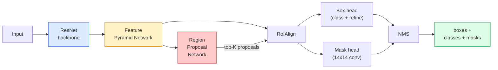

# 인스턴스 분할(Instance Segmentation) — Mask R-CNN

> Faster R-CNN 검출기에 작은 마스크 분기를 더하면 인스턴스 분할(instance segmentation)이 된다. 어려운 부분은 RoIAlign이며, 보기보다 더 어렵다.

**Type:** Build + Learn
**Languages:** Python
**Prerequisites:** Phase 4 Lesson 06 (YOLO), Phase 4 Lesson 07 (U-Net)
**Time:** ~75분

## 학습 목표 (Learning Objectives)

- Mask R-CNN 아키텍처를 종단 간으로 추적하기: 백본(backbone), FPN, RPN, RoIAlign, 박스 헤드(head), 마스크 헤드
- RoIAlign을 밑바닥부터 구현하고 RoIPool이 더 이상 사용되지 않는 이유를 설명하기
- torchvision `maskrcnn_resnet50_fpn_v2` 사전 학습(pretraining) 모델을 프로덕션(production) 품질의 인스턴스 마스크에 사용하고 그 출력 형식을 올바르게 읽기
- 박스와 마스크 헤드를 교체하고 백본을 고정한 채 작은 커스텀 데이터셋(dataset)에서 Mask R-CNN을 파인튜닝(fine-tuning)하기

## 문제 (The Problem)

의미 분할(semantic segmentation)은 클래스당 마스크 하나를 준다. 인스턴스 분할은 두 객체가 클래스를 공유할 때도 객체당 마스크 하나를 준다. 개체 세기, 프레임 간 추적, 사물 측정(벽의 각 벽돌, 현미경 이미지의 각 세포의 경계 상자)은 모두 인스턴스 분할을 요구한다.

Mask R-CNN(He et al., 2017)은 인스턴스 분할을 검출에 마스크를 더한 것으로 재구성해 이 문제를 풀었다. 그 설계가 너무 깔끔해서 이후 5년간 거의 모든 인스턴스 분할 논문이 Mask R-CNN 변종이었고, torchvision 구현은 소형에서 중형 데이터셋에 여전히 프로덕션 기본값이다.

어려운 엔지니어링 문제는 샘플링이다. 모서리가 픽셀 경계에 정렬되지 않는 제안 박스에서 고정 크기의 특성 영역을 어떻게 크롭할까? 이를 틀리면 어디서나 mAP 점수의 십분의 몇을 잃는다. RoIAlign이 그 답이다.

## 개념 (The Concept)

### 아키텍처



이해해야 할 다섯 조각:

1. **백본** — ImageNet에서 학습된 ResNet-50 또는 ResNet-101. 스트라이드 4, 8, 16, 32에서 특성 맵의 위계를 만든다.
2. **FPN (Feature Pyramid Network)** — 모든 레벨에 의미가 풍부한 특성의 C개 채널을 주는 하향식 + 측면 연결. 검출은 객체 크기에 맞는 FPN 레벨에 질의한다.
3. **RPN (Region Proposal Network)** — 모든 앵커(anchor) 위치에서 "여기 객체가 있는가?"와 "박스를 어떻게 정제하는가?"를 예측하는 작은 합성곱(convolution) 헤드. 이미지당 약 1000개의 제안을 만든다.
4. **RoIAlign** — 임의의 FPN 레벨의 임의의 박스에서 고정 크기(예: 7x7) 특성 패치를 샘플링한다. 양선형 샘플링, 양자화 없음.
5. **헤드** — 박스를 정제하고 클래스를 고르는 2층 박스 헤드, 그리고 각 제안에 대해 `28x28` 이진 마스크를 출력하는 작은 합성곱 헤드.

### 왜 RoIPool이 아니라 RoIAlign인가

원조 Fast R-CNN은 RoIPool을 썼는데, 이는 제안 박스를 격자로 나누고, 각 셀에서 최대 특성을 취하고, 모든 좌표를 정수로 반올림한다. 이 반올림 탓에 특성 맵이 입력 픽셀 좌표에서 최대 특성 맵 픽셀 하나만큼 어긋난다 — 224x224 이미지에서는 작지만, 특성 맵이 스트라이드 32일 때는 파국적이다.

```
RoIPool:
  box (34.7, 51.3, 98.2, 142.9)
  round -> (34, 51, 98, 142)
  split grid -> round each cell boundary
  misalignment accumulates at every step

RoIAlign:
  box (34.7, 51.3, 98.2, 142.9)
  sample at exact float coordinates using bilinear interpolation
  no rounding anywhere
```

RoIAlign은 COCO에서 마스크 AP를 공짜로 3-4점 끌어올린다. 위치 지정에 신경 쓰는 모든 검출기가 이제 RoIAlign을 쓴다 — YOLOv7 seg, RT-DETR, Mask2Former 마찬가지다.

### 한 문단으로 보는 RPN

특성 맵의 모든 위치에서, 서로 다른 크기와 형태의 K개 앵커 박스를 둔다. 각 앵커에 대한 객체성(objectness) 점수와 앵커를 더 잘 맞는 박스로 바꾸는 회귀 오프셋을 예측한다. 점수로 상위 약 1,000개 박스를 유지하고, IoU 0.7에서 NMS를 적용하고, 생존자를 헤드에 건넨다. RPN은 자체 미니 손실(loss)로 학습된다 — Lesson 6의 YOLO 손실과 같은 구조이며, 단지 클래스가 둘(객체 / 비객체)일 뿐이다.

### 마스크 헤드

각 제안에 대해(RoIAlign 후) 마스크 헤드는 작은 FCN이다. 3x3 합성곱 네 개, 2배 디컨볼루션(deconv), 그리고 `28x28` 해상도에서 `num_classes` 출력 채널을 만드는 최종 1x1 합성곱이다. 예측된 클래스에 대응하는 채널만 유지하고 나머지는 무시한다. 이렇게 마스크 예측을 분류(classification)와 분리한다.

28x28 마스크를 제안의 원래 픽셀 크기로 업샘플하여 최종 이진 마스크를 만든다.

### 손실

Mask R-CNN의 손실은 네 가지를 함께 더한 것이다.

```
L = L_rpn_cls + L_rpn_box + L_box_cls + L_box_reg + L_mask
```

- `L_rpn_cls`, `L_rpn_box` — RPN 제안에 대한 객체성 + 박스 회귀.
- `L_box_cls` — 헤드 분류기에서 (C+1)개 클래스(배경 포함)에 대한 교차 엔트로피(cross-entropy).
- `L_box_reg` — 헤드의 박스 정제에 대한 smooth L1.
- `L_mask` — 28x28 마스크 출력에 대한 픽셀별 이진 교차 엔트로피.

각 손실에는 자체 기본 가중치가 있다. torchvision 구현은 이를 생성자 인자로 노출한다.

### 출력 형식

`torchvision.models.detection.maskrcnn_resnet50_fpn_v2`는 이미지당 하나씩 딕셔너리 리스트를 반환한다.

```
{
    "boxes":  (N, 4) in (x1, y1, x2, y2) pixel coordinates,
    "labels": (N,) class IDs, 0 = background so indices are 1-based,
    "scores": (N,) confidence scores,
    "masks":  (N, 1, H, W) float masks in [0, 1] — threshold at 0.5 for binary,
}
```

마스크는 이미 전체 이미지 해상도다. 28x28 헤드 출력은 내부적으로 업샘플되었다.

## 직접 만들기 (Build It)

### 1단계: 밑바닥부터 만드는 RoIAlign

이것은 산문보다 코드로 이해하기 더 쉬운 Mask R-CNN의 유일한 구성 요소다.

```python
import torch
import torch.nn.functional as F

def roi_align_single(feature, box, output_size=7, spatial_scale=1 / 16.0):
    """
    feature: (C, H, W) single-image feature map
    box: (x1, y1, x2, y2) in original image pixel coordinates
    output_size: side of the output grid (7 for box head, 14 for mask head)
    spatial_scale: reciprocal of the feature map stride
    """
    C, H, W = feature.shape
    x1, y1, x2, y2 = [c * spatial_scale - 0.5 for c in box]
    bin_w = (x2 - x1) / output_size
    bin_h = (y2 - y1) / output_size

    grid_y = torch.linspace(y1 + bin_h / 2, y2 - bin_h / 2, output_size)
    grid_x = torch.linspace(x1 + bin_w / 2, x2 - bin_w / 2, output_size)
    yy, xx = torch.meshgrid(grid_y, grid_x, indexing="ij")

    gx = 2 * (xx + 0.5) / W - 1
    gy = 2 * (yy + 0.5) / H - 1
    grid = torch.stack([gx, gy], dim=-1).unsqueeze(0)
    sampled = F.grid_sample(feature.unsqueeze(0), grid, mode="bilinear",
                            align_corners=False)
    return sampled.squeeze(0)
```

모든 숫자는 양선형으로 샘플링된 위치에 있다. 반올림 없음, 양자화 없음, 떨어진 그래디언트(gradient) 없음.

### 2단계: torchvision의 RoIAlign과 비교하기

```python
from torchvision.ops import roi_align

feature = torch.randn(1, 16, 50, 50)
boxes = torch.tensor([[0, 10, 20, 100, 90]], dtype=torch.float32)  # (batch_idx, x1, y1, x2, y2)

ours = roi_align_single(feature[0], boxes[0, 1:].tolist(), output_size=7, spatial_scale=1/4)
theirs = roi_align(feature, boxes, output_size=(7, 7), spatial_scale=1/4, sampling_ratio=1, aligned=True)[0]

print(f"shape ours:   {tuple(ours.shape)}")
print(f"shape theirs: {tuple(theirs.shape)}")
print(f"max|diff|:    {(ours - theirs).abs().max().item():.3e}")
```

`sampling_ratio=1`과 `aligned=True`로, 둘은 `1e-5` 이내로 일치한다.

### 3단계: 사전 학습된 Mask R-CNN 로드하기

```python
import torch
from torchvision.models.detection import maskrcnn_resnet50_fpn_v2, MaskRCNN_ResNet50_FPN_V2_Weights

model = maskrcnn_resnet50_fpn_v2(weights=MaskRCNN_ResNet50_FPN_V2_Weights.DEFAULT)
model.eval()
print(f"params: {sum(p.numel() for p in model.parameters()):,}")
print(f"classes (including background): {len(model.roi_heads.box_predictor.cls_score.out_features * [0])}")
```

파라미터(parameter) 4,600만 개, 91개 클래스(COCO). 첫 클래스(id 0)는 배경이다. 모델이 실제로 검출하는 모든 것은 id 1에서 시작한다.

### 4단계: 추론 실행하기

```python
with torch.no_grad():
    x = torch.randn(3, 400, 600)
    predictions = model([x])
p = predictions[0]
print(f"boxes:  {tuple(p['boxes'].shape)}")
print(f"labels: {tuple(p['labels'].shape)}")
print(f"scores: {tuple(p['scores'].shape)}")
print(f"masks:  {tuple(p['masks'].shape)}")
```

마스크 텐서는 `(N, 1, H, W)` 형태다. 객체당 이진 마스크를 얻으려면 0.5에서 임계값을 둔다.

```python
binary_masks = (p['masks'] > 0.5).squeeze(1)  # (N, H, W) boolean
```

### 5단계: 커스텀 클래스 수에 맞게 헤드 교체하기

흔한 파인튜닝 레시피: 백본, FPN, RPN을 재사용하고, 두 분류기 헤드를 교체한다.

```python
from torchvision.models.detection.faster_rcnn import FastRCNNPredictor
from torchvision.models.detection.mask_rcnn import MaskRCNNPredictor

def build_custom_maskrcnn(num_classes):
    model = maskrcnn_resnet50_fpn_v2(weights=MaskRCNN_ResNet50_FPN_V2_Weights.DEFAULT)
    in_features = model.roi_heads.box_predictor.cls_score.in_features
    model.roi_heads.box_predictor = FastRCNNPredictor(in_features, num_classes)
    in_features_mask = model.roi_heads.mask_predictor.conv5_mask.in_channels
    hidden_layer = 256
    model.roi_heads.mask_predictor = MaskRCNNPredictor(in_features_mask, hidden_layer, num_classes)
    return model

custom = build_custom_maskrcnn(num_classes=5)
print(f"custom cls_score.out_features: {custom.roi_heads.box_predictor.cls_score.out_features}")
```

`num_classes`는 배경 클래스를 포함해야 하므로, 4개 객체 클래스를 가진 데이터셋은 `num_classes=5`를 쓴다.

### 6단계: 학습이 필요 없는 것 고정하기

작은 데이터셋에서는 백본과 FPN을 고정한다. RPN 객체성 + 회귀와 두 헤드만 학습한다.

```python
def freeze_backbone_and_fpn(model):
    # torchvision Mask R-CNN packs the FPN inside `model.backbone` (as
    # `model.backbone.fpn`), so iterating `model.backbone.parameters()` covers
    # both the ResNet feature layers and the FPN lateral/output convs.
    for p in model.backbone.parameters():
        p.requires_grad = False
    return model

custom = freeze_backbone_and_fpn(custom)
trainable = sum(p.numel() for p in custom.parameters() if p.requires_grad)
print(f"trainable after freeze: {trainable:,}")
```

500개 이미지 데이터셋에서 이것은 수렴(convergence)과 과적합(overfitting)을 가르는 차이다.

## 라이브러리로 써보기 (Use It)

torchvision의 Mask R-CNN 전체 학습 루프는 40줄이며 작업 간에 의미 있게 바뀌지 않는다 — 데이터셋을 바꾸고 진행하라.

```python
def train_step(model, images, targets, optimizer):
    model.train()
    loss_dict = model(images, targets)
    losses = sum(loss for loss in loss_dict.values())
    optimizer.zero_grad()
    losses.backward()
    optimizer.step()
    return {k: v.item() for k, v in loss_dict.items()}
```

`targets` 리스트는 이미지별로 `boxes`, `labels`, `masks`(`(num_instances, H, W)` 이진 텐서로)를 가진 딕셔너리를 가져야 한다. 모델은 학습 중에는 네 손실의 딕셔너리를, 평가 중에는 예측 리스트를 반환하며, `model.training`을 기준으로 분기한다.

`pycocotools` 평가기는 박스와 마스크 둘 다에 대해 mAP@IoU=0.5:0.95를 만든다. 박스 헤드가 병목인지 마스크 헤드가 병목인지 알려면 두 숫자가 모두 필요하다.

## 산출물 (Ship It)

이 레슨은 다음을 만든다.

- `outputs/prompt-instance-vs-semantic-router.md` — 세 질문을 묻고 인스턴스 대 의미 대 파놉틱(panoptic)과 시작할 정확한 모델을 고르는 프롬프트(prompt).
- `outputs/skill-mask-rcnn-head-swapper.md` — 새 `num_classes`가 주어지면 임의의 torchvision 검출 모델에서 헤드를 교체하는 10줄의 코드를 생성하는 스킬.

## 연습 문제 (Exercises)

1. **(쉬움)** 100개의 무작위 박스에 대해 직접 구현한 RoIAlign을 `torchvision.ops.roi_align`과 비교해 검증하라. 최대 절대 차이를 보고하라. 또한 RoIPool(2017년 이전 동작)을 실행하고 경계 근처 박스에서 약 1-2 특성 맵 픽셀만큼 어긋남을 보여라.
2. **(중간)** 50개 이미지 커스텀 데이터셋(임의의 두 클래스: 풍선, 물고기, 포트홀, 로고)에서 `maskrcnn_resnet50_fpn_v2`를 파인튜닝하라. 백본을 고정하고, 20 에폭(epoch) 학습시키고, 마스크 AP@0.5를 보고하라.
3. **(어려움)** Mask R-CNN의 마스크 헤드를 28x28 대신 56x56에서 예측하는 것으로 대체하라. 전후의 mAP@IoU=0.75를 측정하라. 그 이득(또는 이득 없음)이 예상되는 경계 정밀도 / 메모리 트레이드오프(trade-off)와 일치하는 이유를 설명하라.

## 핵심 용어 (Key Terms)

| 용어 | 사람들이 말하는 것 | 실제 의미 |
|------|----------------|----------------------|
| Mask R-CNN | "검출에 마스크 더하기" | Faster R-CNN + 제안당 클래스당 28x28 마스크를 예측하는 작은 FCN 헤드 |
| FPN | "특성 피라미드" | 모든 스트라이드 레벨에 의미가 풍부한 특성의 C개 채널을 주는 하향식 + 측면 연결 |
| RPN | "영역 제안기" | 이미지당 약 1000개의 객체/비객체 제안을 만드는 작은 합성곱 헤드 |
| RoIAlign | "반올림 없는 크롭" | 임의의 float 좌표 박스에서 고정 크기 특성 격자를 양선형으로 샘플링한다 |
| RoIPool | "2017년 이전 크롭" | RoIAlign과 같은 목적이지만 박스 좌표를 반올림한다. 구식이다 |
| 마스크 AP(Mask AP) | "인스턴스 mAP" | 박스 IoU 대신 마스크 IoU로 계산한 평균 정밀도. COCO 인스턴스 분할 지표 |
| 이진 마스크 헤드(Binary mask head) | "클래스별 마스크" | 각 제안에 대해 클래스당 이진 마스크 하나를 예측한다. 예측된 클래스의 채널만 유지된다 |
| 배경 클래스(Background class) | "클래스 0" | 포괄적인 "객체 없음" 클래스. 실제 클래스의 인덱스는 1에서 시작한다 |

## 더 읽을거리 (Further Reading)

- [Mask R-CNN (He et al., 2017)](https://arxiv.org/abs/1703.06870) — 논문. RoIAlign에 관한 3절이 핵심 읽을거리다
- [FPN: Feature Pyramid Networks (Lin et al., 2017)](https://arxiv.org/abs/1612.03144) — FPN 논문. 모든 현대 검출기가 그것을 쓴다
- [torchvision Mask R-CNN tutorial](https://pytorch.org/tutorials/intermediate/torchvision_tutorial.html) — 파인튜닝 루프의 참고 자료
- [Detectron2 model zoo](https://github.com/facebookresearch/detectron2/blob/main/MODEL_ZOO.md) — 거의 모든 검출 및 분할 변종에 대해 학습된 가중치를 가진 프로덕션 구현
