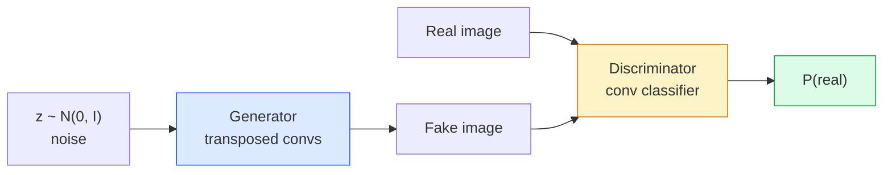
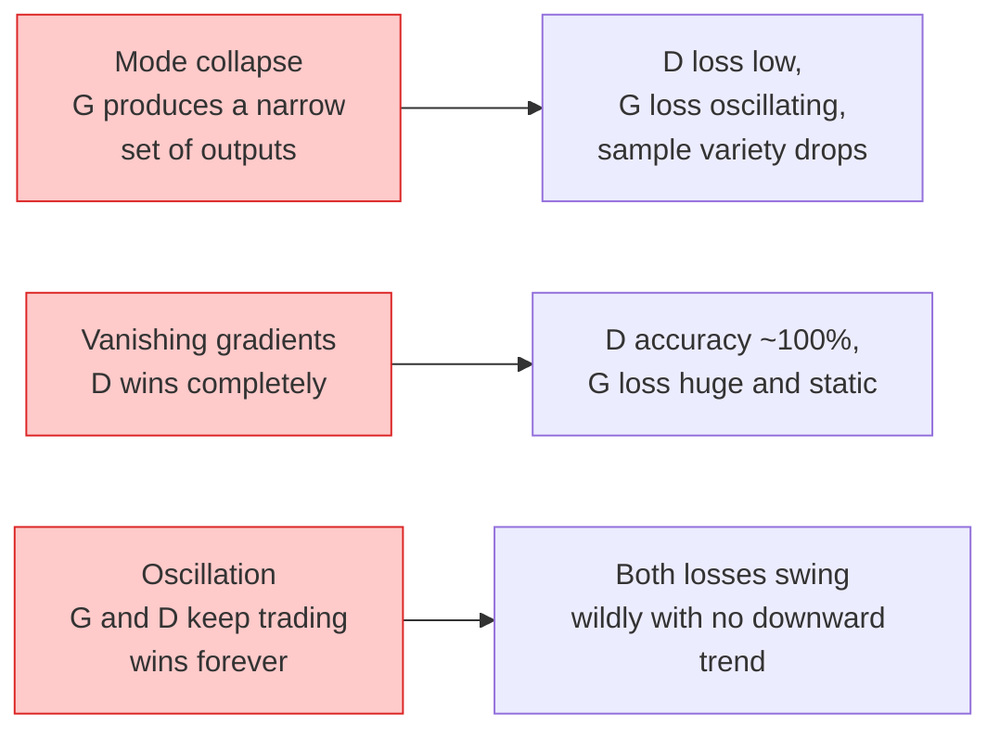

# 이미지 생성(Image Generation) — GAN

> GAN은 고정된 게임 안의 두 신경망(neural network)이다. 하나는 그리고, 하나는 비평한다. 그림이 비평가를 속일 때까지 둘은 함께 나아진다.

**Type:** Build
**Languages:** Python
**Prerequisites:** Phase 4 Lesson 03 (CNNs), Phase 3 Lesson 06 (Optimizers), Phase 3 Lesson 07 (Regularization)
**Time:** ~75분

## 학습 목표 (Learning Objectives)

- 생성자(generator)와 판별자(discriminator) 사이의 미니맥스(minimax) 게임과 그 평형이 왜 p_model = p_data에 대응하는지 설명하기
- PyTorch에서 DCGAN을 구현하고 60줄 이내로 일관된 32x32 합성 이미지를 생성하게 만들기
- 세 가지 표준 트릭으로 GAN 학습을 안정화하기: 비포화 손실(non-saturating loss), 스펙트럴 정규화(spectral norm), TTUR(이중 시간척도 갱신 규칙)
- 건강한 수렴(convergence)을 모드 붕괴(mode collapse), 진동, 판별자 완승과 구별하는 학습 곡선 읽기

## 문제 (The Problem)

분류(classification)는 신경망에게 이미지를 레이블로 매핑하는 법을 가르친다. 생성은 문제를 뒤집는다. 같은 분포에서 온 것처럼 보이는 새 이미지를 샘플링한다. 비교할 "올바른" 출력이 없다. 흉내 내고 싶은 분포만 있을 뿐이다.

표준 손실 함수(MSE, 교차 엔트로피)는 "이 샘플이 실제 분포에서 왔는가"를 측정할 수 없다. 픽셀별 오차를 최소화하면 사실적인 샘플이 아니라 흐릿한 평균이 나온다. 돌파구는 손실을 학습하는 것이었다. 실제와 가짜를 구별하는 일을 하는 두 번째 신경망을 학습시키고, 그 판단을 사용해 생성자를 밀어붙인다.

GAN(Goodfellow et al., 2014)이 그 틀을 정의했다. 2018년 무렵 StyleGAN은 사진과 구별할 수 없는 1024x1024 얼굴을 만들고 있었다. 이후 확산 모델(diffusion model)이 품질과 제어 가능성에서 왕좌를 차지했지만, 확산을 실용적으로 만드는 모든 트릭 — 정규화(normalization) 선택, 잠재 공간(latent space), 특성 손실 — 은 먼저 GAN에서 이해되었다.

## 개념 (The Concept)

### 두 신경망



**생성자** G는 노이즈 벡터(vector) `z`를 받아 이미지를 출력한다. **판별자** D는 이미지를 받아 단일 스칼라를 출력한다. 그 이미지가 실제일 확률이다.

### 게임

G는 D가 틀리기를 원한다. D는 맞기를 원한다. 형식적으로:

```
min_G max_D  E_x[log D(x)] + E_z[log(1 - D(G(z)))]
```

오른쪽에서 왼쪽으로 읽으면: D는 실제(`log D(real)`)와 가짜(`log (1 - D(fake))`) 이미지에 대한 정확도(accuracy)를 최대화하고 있다. G는 가짜에 대한 D의 정확도를 최소화하고 있다 — `D(G(z))`가 높기를 원한다.

Goodfellow는 이 미니맥스가 `p_G = p_data`이고, D가 어디서나 0.5를 출력하며, 생성된 분포와 실제 분포 사이의 옌센-섀넌(Jensen-Shannon) 발산이 0인 전역 평형을 가짐을 증명했다. 어려운 부분은 거기에 도달하는 것이다.

### 비포화 손실

위의 형태는 수치적으로 불안정하다. 학습 초기에 모든 가짜에 대해 `D(G(z))`가 0에 가까우므로, `log(1 - D(G(z)))`는 G에 대한 그래디언트(gradient)가 소실된다. 해결책: G의 손실을 뒤집는다.

```
L_D = -E_x[log D(x)] - E_z[log(1 - D(G(z)))]
L_G = -E_z[log D(G(z))]                          # non-saturating
```

이제 `D(G(z))`가 0에 가까울 때 G의 손실은 크고 그 그래디언트는 정보를 담는다. 모든 현대 GAN은 이 변종으로 학습한다.

### DCGAN 아키텍처 규칙

Radford, Metz, Chintala(2015)는 수년간의 실패한 실험을 GAN 학습을 안정적으로 만드는 다섯 규칙으로 증류했다.

1. 풀링을 스트라이드 합성곱(strided conv)으로 대체한다(두 신경망 모두).
2. 생성자와 판별자 둘 다에 배치 정규화(batch norm)를 쓰되, G의 출력과 D의 입력은 예외다.
3. 더 깊은 아키텍처에서 완전 연결 층(fully connected layer)을 제거한다.
4. G는 출력을 제외한 모든 층에 ReLU를 쓴다([-1, 1] 출력에는 tanh).
5. D는 모든 층에 LeakyReLU(negative_slope=0.2)를 쓴다.

모든 현대 합성곱 기반 GAN(StyleGAN, BigGAN, GigaGAN)은 여전히 이 규칙에서 시작해 부품을 하나씩 교체한다.

### 실패 모드와 그 징후



- **모드 붕괴**: G가 D를 속이는 이미지 하나를 찾아 그것만 만든다. 해결책: 미니배치 판별(minibatch discrimination), 스펙트럴 정규화, 또는 레이블 조건화를 추가한다.
- **판별자 완승**: D가 너무 빨리 너무 강해져 G의 그래디언트가 소실된다. 해결책: 더 작은 D, 더 낮은 D 학습률(learning rate), 또는 실제 레이블에 레이블 스무딩(label smoothing) 적용.
- **진동**: 두 신경망이 평형에 다가가지 못한 채 승패를 주고받는다. 해결책: TTUR(D가 G보다 2-4배 빠르게 학습), 또는 바서슈타인(Wasserstein) 손실로 전환.

### 평가

GAN은 정답이 없는데, 어떻게 작동하는지 아는가?

- **샘플 검사** — 모든 에폭(epoch) 끝에 그냥 64개 샘플을 본다. 타협 불가.
- **FID (Fréchet Inception Distance)** — 실제 집합과 생성 집합의 Inception-v3 특성 분포 사이의 거리. 낮을수록 좋다. 커뮤니티 표준.
- **Inception Score** — 더 오래되고 더 취약하다. FID를 선호하라.
- **생성 모델을 위한 정밀도/재현율** — 품질(정밀도)과 커버리지(재현율)를 별도로 측정한다. FID 단독보다 정보량이 많다.

작은 합성 데이터 실행에는 샘플 검사로 충분하다.

## 직접 만들기 (Build It)

### 1단계: 생성자

64차원 노이즈를 받아 32x32 이미지를 만드는 작은 DCGAN 생성자.

```python
import torch
import torch.nn as nn

class Generator(nn.Module):
    def __init__(self, z_dim=64, img_channels=3, feat=64):
        super().__init__()
        self.net = nn.Sequential(
            nn.ConvTranspose2d(z_dim, feat * 4, kernel_size=4, stride=1, padding=0, bias=False),
            nn.BatchNorm2d(feat * 4),
            nn.ReLU(inplace=True),
            nn.ConvTranspose2d(feat * 4, feat * 2, kernel_size=4, stride=2, padding=1, bias=False),
            nn.BatchNorm2d(feat * 2),
            nn.ReLU(inplace=True),
            nn.ConvTranspose2d(feat * 2, feat, kernel_size=4, stride=2, padding=1, bias=False),
            nn.BatchNorm2d(feat),
            nn.ReLU(inplace=True),
            nn.ConvTranspose2d(feat, img_channels, kernel_size=4, stride=2, padding=1, bias=False),
            nn.Tanh(),
        )

    def forward(self, z):
        return self.net(z.view(z.size(0), -1, 1, 1))
```

각각 `kernel_size=4, stride=2, padding=1`인 전치 합성곱(transposed conv) 네 개로, 공간 크기를 깔끔하게 두 배로 만든다. 출력 활성값(activation)은 tanh를 통해 [-1, 1].

### 2단계: 판별자

생성자의 거울상. LeakyReLU, 스트라이드 합성곱, 스칼라 로짓(logit)으로 끝난다.

```python
class Discriminator(nn.Module):
    def __init__(self, img_channels=3, feat=64):
        super().__init__()
        self.net = nn.Sequential(
            nn.Conv2d(img_channels, feat, kernel_size=4, stride=2, padding=1),
            nn.LeakyReLU(0.2, inplace=True),
            nn.Conv2d(feat, feat * 2, kernel_size=4, stride=2, padding=1, bias=False),
            nn.BatchNorm2d(feat * 2),
            nn.LeakyReLU(0.2, inplace=True),
            nn.Conv2d(feat * 2, feat * 4, kernel_size=4, stride=2, padding=1, bias=False),
            nn.BatchNorm2d(feat * 4),
            nn.LeakyReLU(0.2, inplace=True),
            nn.Conv2d(feat * 4, 1, kernel_size=4, stride=1, padding=0),
        )

    def forward(self, x):
        return self.net(x).view(-1)
```

마지막 합성곱은 `4x4` 특성 맵을 `1x1`로 줄인다. 출력은 이미지당 단일 스칼라다. 시그모이드는 손실 계산 중에만 적용한다.

### 3단계: 학습 스텝

교대한다: 매 배치(batch)마다 D를 한 번 갱신한 뒤 G를 한 번 갱신한다.

```python
import torch.nn.functional as F

def train_step(G, D, real, z, opt_g, opt_d, device):
    real = real.to(device)
    bs = real.size(0)

    # D step
    opt_d.zero_grad()
    d_real = D(real)
    d_fake = D(G(z).detach())
    loss_d = (F.binary_cross_entropy_with_logits(d_real, torch.ones_like(d_real))
              + F.binary_cross_entropy_with_logits(d_fake, torch.zeros_like(d_fake)))
    loss_d.backward()
    opt_d.step()

    # G step
    opt_g.zero_grad()
    d_fake = D(G(z))
    loss_g = F.binary_cross_entropy_with_logits(d_fake, torch.ones_like(d_fake))
    loss_g.backward()
    opt_g.step()

    return loss_d.item(), loss_g.item()
```

D 스텝의 `G(z).detach()`는 매우 중요하다. D 갱신 중에 G로 그래디언트가 흐르기를 원하지 않는다. 그것을 잊는 것이 고전적 초보자 버그다.

### 4단계: 합성 형태에 대한 전체 학습 루프

```python
from torch.utils.data import DataLoader, TensorDataset
import numpy as np

def synthetic_images(num=2000, size=32, seed=0):
    rng = np.random.default_rng(seed)
    imgs = np.zeros((num, 3, size, size), dtype=np.float32) - 1.0
    for i in range(num):
        r = rng.uniform(6, 12)
        cx, cy = rng.uniform(r, size - r, size=2)
        yy, xx = np.meshgrid(np.arange(size), np.arange(size), indexing="ij")
        mask = (xx - cx) ** 2 + (yy - cy) ** 2 < r ** 2
        color = rng.uniform(-0.5, 1.0, size=3)
        for c in range(3):
            imgs[i, c][mask] = color[c]
    return torch.from_numpy(imgs)

device = "cuda" if torch.cuda.is_available() else "cpu"
data = synthetic_images()
loader = DataLoader(TensorDataset(data), batch_size=64, shuffle=True)

G = Generator(z_dim=64, img_channels=3, feat=32).to(device)
D = Discriminator(img_channels=3, feat=32).to(device)
opt_g = torch.optim.Adam(G.parameters(), lr=2e-4, betas=(0.5, 0.999))
opt_d = torch.optim.Adam(D.parameters(), lr=2e-4, betas=(0.5, 0.999))

for epoch in range(10):
    for (batch,) in loader:
        z = torch.randn(batch.size(0), 64, device=device)
        ld, lg = train_step(G, D, batch, z, opt_g, opt_d, device)
    print(f"epoch {epoch}  D {ld:.3f}  G {lg:.3f}")
```

`Adam(lr=2e-4, betas=(0.5, 0.999))`은 DCGAN 기본값이다 — 낮은 beta1은 모멘텀 항이 적대적 게임을 너무 많이 안정화하지 못하게 한다.

### 5단계: 샘플링

```python
@torch.no_grad()
def sample(G, n=16, z_dim=64, device="cpu"):
    G.eval()
    z = torch.randn(n, z_dim, device=device)
    imgs = G(z)
    imgs = (imgs + 1) / 2
    return imgs.clamp(0, 1)
```

샘플링 전에 항상 eval 모드로 전환하라. DCGAN에서 이것이 중요한 이유는 배치의 통계 대신 배치 정규화 실행 통계가 사용되기 때문이다.

### 6단계: 스펙트럴 정규화

판별자에서 BN을 즉시 대체하며 신경망이 1-립시츠(1-Lipschitz)임을 보장한다. 대부분의 "D 완승" 실패를 고친다.

```python
from torch.nn.utils import spectral_norm

def build_sn_discriminator(img_channels=3, feat=64):
    return nn.Sequential(
        spectral_norm(nn.Conv2d(img_channels, feat, 4, 2, 1)),
        nn.LeakyReLU(0.2, inplace=True),
        spectral_norm(nn.Conv2d(feat, feat * 2, 4, 2, 1)),
        nn.LeakyReLU(0.2, inplace=True),
        spectral_norm(nn.Conv2d(feat * 2, feat * 4, 4, 2, 1)),
        nn.LeakyReLU(0.2, inplace=True),
        spectral_norm(nn.Conv2d(feat * 4, 1, 4, 1, 0)),
    )
```

`Discriminator`를 `build_sn_discriminator()`로 바꾸면 TTUR 트릭이 필요 없는 경우가 많다. 스펙트럴 정규화는 적용하기 가장 쉬운 단일 견고성 업그레이드다.

## 라이브러리로 써보기 (Use It)

진지한 생성에는 사전 학습(pretraining) 가중치(weight)를 쓰거나 확산으로 전환하라. 두 표준 라이브러리:

- `torch_fidelity`는 커스텀 평가 코드를 작성하지 않고도 생성자에 대해 FID / IS를 계산한다.
- `pytorch-gan-zoo`(레거시)와 `StudioGAN`은 DCGAN, WGAN-GP, SN-GAN, StyleGAN, BigGAN의 검증된 구현을 출고한다.

2026년에도 GAN은 다음에 여전히 최선의 선택이다: 실시간 이미지 생성(지연 시간 <10 ms), 스타일 전이, 정밀한 제어를 동반한 이미지-대-이미지 변환(Pix2Pix, CycleGAN). 확산은 사실적 묘사와 텍스트 조건화에서 이긴다.

## 산출물 (Ship It)

이 레슨은 다음을 만든다.

- `outputs/prompt-gan-training-triage.md` — 학습 곡선 설명을 읽고 실패 모드(모드 붕괴, D 완승, 진동)와 권장되는 단일 수정을 고르는 프롬프트(prompt).
- `outputs/skill-dcgan-scaffold.md` — `z_dim`, 목표 `image_size`, `num_channels`로부터 학습 루프와 샘플 저장기를 포함한 DCGAN 골격을 작성하는 스킬.

## 연습 문제 (Exercises)

1. **(쉬움)** 위의 DCGAN을 합성 원 데이터셋(dataset)에서 학습시키고 각 에폭 끝에 16개 샘플 그리드를 저장하라. 생성된 원이 몇 에폭째에 명확히 원형이 되는가?
2. **(중간)** 판별자의 배치 정규화를 스펙트럴 정규화로 대체하라. 두 버전을 나란히 학습시켜라. 어느 것이 더 빨리 수렴하는가? 세 시드(seed)에 걸쳐 어느 것이 분산이 더 낮은가?
3. **(어려움)** 조건부 DCGAN을 구현하라: 클래스 레이블을 G와 D 둘 다에 넣어라(G에서는 노이즈에 원-핫을 연결, D에서는 클래스 임베딩(embedding) 채널을 연결). Lesson 7의 합성 "원 대 정사각형" 데이터셋에서 학습시키고, 특정 레이블로 샘플링하여 클래스 조건화가 작동함을 보여라.

## 핵심 용어 (Key Terms)

| 용어 | 사람들이 말하는 것 | 실제 의미 |
|------|----------------|----------------------|
| 생성자(Generator, G) | "그림 그리는 신경망" | 노이즈를 이미지로 매핑한다. 판별자를 속이도록 학습된다 |
| 판별자(Discriminator, D) | "비평가" | 이진 분류기. 실제와 생성된 이미지를 구별하도록 학습된다 |
| 미니맥스(Minimax) | "게임" | G에 대한 최소, D에 대한 최대의 적대적 손실. 평형은 p_G = p_data |
| 비포화 손실(Non-saturating loss) | "수치적으로 온전한 버전" | 학습 초기의 그래디언트 소실을 피하기 위해 G의 손실이 log(1 - D(G(z)))가 아니라 -log(D(G(z)))인 것 |
| 모드 붕괴(Mode collapse) | "생성자가 한 가지만 만든다" | G가 데이터 분포의 작은 부분집합만 만든다. SN, 미니배치 판별, 또는 더 큰 배치로 고친다 |
| TTUR | "두 학습률" | D가 G보다 빠르게, 보통 2-4배로 학습한다. 학습을 안정화한다 |
| 스펙트럴 정규화(Spectral norm) | "1-립시츠 층" | 각 층의 립시츠 상수를 제한하는 가중치 정규화. D가 임의로 가팔라지는 것을 막는다 |
| FID | "Fréchet Inception Distance" | 실제 집합과 생성 집합의 Inception-v3 특성 분포 사이의 거리. 표준 평가 지표 |

## 더 읽을거리 (Further Reading)

- [Generative Adversarial Networks (Goodfellow et al., 2014)](https://arxiv.org/abs/1406.2661) — 모든 것을 시작한 논문
- [DCGAN (Radford, Metz, Chintala, 2015)](https://arxiv.org/abs/1511.06434) — GAN을 학습 가능하게 만든 아키텍처 규칙
- [Spectral Normalization for GANs (Miyato et al., 2018)](https://arxiv.org/abs/1802.05957) — 가장 유용한 단일 안정화 트릭
- [StyleGAN3 (Karras et al., 2021)](https://arxiv.org/abs/2106.12423) — SOTA GAN. 지난 10년의 모든 트릭의 베스트 앨범처럼 읽힌다
