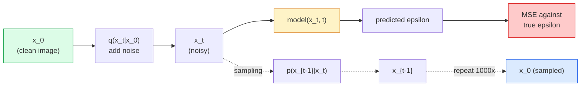

# 이미지 생성(Image Generation) — 확산 모델(Diffusion Models)

> 확산 모델(diffusion model)은 잡음 제거(denoise)를 학습한다. 잡음 낀 이미지에서 아주 약간의 잡음을 제거하도록 학습시키고, 그것을 천 번 거꾸로 반복하면, 이미지 생성기를 얻는다.

**Type:** Build
**Languages:** Python
**Prerequisites:** Phase 4 Lesson 07 (U-Net), Phase 1 Lesson 06 (Probability), Phase 3 Lesson 06 (Optimizers)
**Time:** ~75분

## 학습 목표 (Learning Objectives)

- 순방향 잡음화 과정 `x_0 -> x_1 -> ... -> x_T`를 유도하고, 임의의 t에 대해 닫힌 형식 `q(x_t | x_0)`가 성립하는 이유를 설명하기
- 각 스텝에서 더해진 잡음을 회귀하는 DDPM 스타일 학습 목적함수와, 순수 잡음에서 이미지로 거슬러 걸어가는 샘플러를 구현하기
- 임의의 타임스텝에 대한 잡음을 예측하는 시간 조건화 U-Net(CPU에서 학습할 만큼 작은)을 만들기
- DDPM과 DDIM 샘플링의 차이를 설명하고 각각이 언제 적절한지 설명하기(Lesson 23이 흐름 매칭과 정류 흐름을 깊이 다룬다)

## 문제 (The Problem)

GAN은 한 방에 생성한다. 잡음이 들어가면 이미지가 나온다, 순방향 패스 한 번. 빠르고 학습하기 어렵다. 확산 모델은 반복적으로 생성한다. 순수 잡음에서 시작해 작은 스텝으로 잡음을 제거하면 이미지가 떠오른다. 느리고 학습하기 쉽다. 지난 5년간 후자의 속성이 지배했다. 어떤 작은 팀이든 확산 모델을 학습시켜 합리적인 샘플을 얻을 수 있다. GAN 학습은 수년간의 실패한 실행을 거쳐 익히는 기예다.

학습 안정성을 넘어, 확산의 반복적 구조는 현대 이미지 생성이 하는 모든 것을 푸는 열쇠다. 텍스트 조건화, 인페인팅(inpainting), 이미지 편집, 초해상도, 제어 가능한 스타일. 샘플링 루프의 각 스텝은 새 제약을 주입할 자리다. 그 후크가 Stable Diffusion, Imagen, DALL-E 3, Midjourney, 그리고 당신이 사용할 모든 제어 가능한 이미지 모델이 전부 확산 기반인 이유다.

이 레슨은 최소한의 DDPM을 만든다. 순방향 잡음화, 역방향 잡음 제거, 학습 루프다. 다음 레슨(Stable Diffusion)은 그것을 VAE, 텍스트 인코더(encoder), 분류기 없는 안내(classifier-free guidance)와 함께 프로덕션(production) 시스템으로 배선한다.

## 개념 (The Concept)

### 순방향 과정

이미지 `x_0`를 가져온다. 아주 적은 양의 가우시안 잡음을 더해 `x_1`을 얻는다. 조금 더 더해 `x_2`를 얻는다. `x_T`가 순수 가우시안 잡음과 거의 구별되지 않을 때까지 T 스텝 동안 계속한다.

```
q(x_t | x_{t-1}) = N(x_t; sqrt(1 - beta_t) * x_{t-1},  beta_t * I)
```

`beta_t`는 작은 분산 스케줄이며, 보통 T=1000 스텝에 걸쳐 0.0001에서 0.02까지 선형이다. 각 스텝은 신호를 약간 줄이고 새 잡음을 주입한다.

### 닫힌 형식의 점프

한 번에 한 스텝씩 잡음을 더하는 것은 마르코프 연쇄(Markov chain)지만, 수학이 접힌다. `x_t`를 `x_0`로부터 한 스텝에 직접 샘플링할 수 있다.

```
Define alpha_t = 1 - beta_t
Define alpha_bar_t = prod_{s=1..t} alpha_s

Then:
  q(x_t | x_0) = N(x_t; sqrt(alpha_bar_t) * x_0,  (1 - alpha_bar_t) * I)

Equivalently:
  x_t = sqrt(alpha_bar_t) * x_0 + sqrt(1 - alpha_bar_t) * epsilon
  where epsilon ~ N(0, I)
```

이 단 하나의 방정식이 확산이 실용적인 전체 이유다. 학습 중에 무작위 `t`를 고르고, `x_t`를 `x_0`로부터 직접 샘플링하여 한 스텝에 학습한다 — 전체 마르코프 연쇄의 시뮬레이션이 필요 없다.

### 역방향 과정

순방향 과정은 고정되어 있다. 역방향 과정 `p(x_{t-1} | x_t)`가 신경망(neural network)이 학습하는 것이다. 확산 모델은 `x_{t-1}`을 직접 예측하지 않는다. 스텝 t에서 더해진 잡음 `epsilon`을 예측하고, 수학이 그로부터 `x_{t-1}`을 유도한다.



### 학습 손실

모든 학습 스텝마다:

1. 실제 이미지 `x_0`를 샘플링한다.
2. 타임스텝 `t`를 [1, T]에서 균등하게 샘플링한다.
3. 잡음 `epsilon ~ N(0, I)`를 샘플링한다.
4. `x_t = sqrt(alpha_bar_t) * x_0 + sqrt(1 - alpha_bar_t) * epsilon`을 계산한다.
5. 신경망으로 `epsilon_theta(x_t, t)`를 예측한다.
6. `|| epsilon - epsilon_theta(x_t, t) ||^2`를 최소화한다.

그게 전부다. 신경망은 임의의 타임스텝에서 잡음을 예측하는 법을 학습한다. 손실(loss)은 MSE다. 적대적 게임도, 붕괴도, 진동도 없다.

### 샘플러 (DDPM)

생성하려면: `x_T ~ N(0, I)`에서 시작해 한 번에 한 스텝씩 거꾸로 걸어간다.

```
for t = T, T-1, ..., 1:
    eps = model(x_t, t)
    x_{t-1} = (1 / sqrt(alpha_t)) * (x_t - (beta_t / sqrt(1 - alpha_bar_t)) * eps) + sqrt(beta_t) * z
    where z ~ N(0, I) if t > 1, else 0
return x_0
```

핵심은, 역방향 조건부가 일반적으로는 닫힌 형식으로 알려져 있지 않더라도, 이 특정 가우시안 순방향 과정에 대해서는 알려져 있다는 점이다. 못생겨 보이는 계수들은 베이즈 규칙(Bayes' rule)이 주는 것이다.

### 왜 1000 스텝인가

순방향 잡음 스케줄은 각 스텝이 역방향 스텝이 거의 가우시안이 될 만큼만의 잡음을 더하도록 선택된다. 스텝이 너무 적으면 역방향 스텝이 가우시안에서 멀어 신경망이 그것을 잘 모델링할 수 없다. 스텝이 너무 많으면 샘플링이 비싸지면서 이득은 줄어든다. 선형 스케줄을 가진 T=1000이 DDPM 기본값이다.

### DDIM: 20배 빠른 샘플링

학습은 같다. 샘플링이 바뀐다. DDIM(Song et al., 2020)은 재학습 없이 타임스텝을 건너뛰는 결정론적 역방향 과정을 정의한다. DDIM으로 50 스텝에 샘플링하면 거의 1000 스텝 DDPM 품질을 준다. 모든 프로덕션 시스템은 DDIM이나 더 빠른 변종(DPM-Solver, Euler ancestral)을 사용한다.

### 시간 조건화

신경망 `epsilon_theta(x_t, t)`는 자신이 어떤 타임스텝을 잡음 제거하는지 알아야 한다. 현대 확산 모델은 사인파 시간 임베딩(time embedding)(트랜스포머의 위치 인코딩과 같은 아이디어)을 통해 `t`를 주입하며, 이는 모든 U-Net 레벨의 특성 맵에 더해진다.

```
t_embedding = sinusoidal(t)
feature_map += MLP(t_embedding)
```

시간 조건화가 없으면 신경망은 이미지 자체로부터 잡음 수준을 추측해야 하는데, 작동하기는 하지만 샘플 효율이 훨씬 낮다.

## 직접 만들기 (Build It)

### 1단계: 잡음 스케줄

```python
import torch

def linear_beta_schedule(T=1000, beta_start=1e-4, beta_end=2e-2):
    return torch.linspace(beta_start, beta_end, T)


def precompute_schedule(betas):
    alphas = 1.0 - betas
    alphas_cumprod = torch.cumprod(alphas, dim=0)
    return {
        "betas": betas,
        "alphas": alphas,
        "alphas_cumprod": alphas_cumprod,
        "sqrt_alphas_cumprod": torch.sqrt(alphas_cumprod),
        "sqrt_one_minus_alphas_cumprod": torch.sqrt(1.0 - alphas_cumprod),
        "sqrt_recip_alphas": torch.sqrt(1.0 / alphas),
    }

schedule = precompute_schedule(linear_beta_schedule(T=1000))
```

한 번 미리 계산하고, 학습과 샘플링 중에 인덱스로 모은다.

### 2단계: 순방향 확산 (q_sample)

```python
def q_sample(x0, t, noise, schedule):
    sqrt_a = schedule["sqrt_alphas_cumprod"][t].view(-1, 1, 1, 1)
    sqrt_one_minus_a = schedule["sqrt_one_minus_alphas_cumprod"][t].view(-1, 1, 1, 1)
    return sqrt_a * x0 + sqrt_one_minus_a * noise
```

한 줄짜리 닫힌 형식. `t`는 타임스텝의 배치(batch)이며, 배치의 이미지당 하나다.

### 3단계: 작은 시간 조건화 U-Net

```python
import torch.nn as nn
import torch.nn.functional as F
import math

def timestep_embedding(t, dim=64):
    half = dim // 2
    freqs = torch.exp(-math.log(10000) * torch.arange(half, device=t.device) / half)
    args = t[:, None].float() * freqs[None]
    emb = torch.cat([args.sin(), args.cos()], dim=-1)
    return emb


class TinyUNet(nn.Module):
    def __init__(self, img_channels=3, base=32, t_dim=64):
        super().__init__()
        self.t_mlp = nn.Sequential(
            nn.Linear(t_dim, base * 4),
            nn.SiLU(),
            nn.Linear(base * 4, base * 4),
        )
        self.t_dim = t_dim
        self.enc1 = nn.Conv2d(img_channels, base, 3, padding=1)
        self.enc2 = nn.Conv2d(base, base * 2, 4, stride=2, padding=1)
        self.mid = nn.Conv2d(base * 2, base * 2, 3, padding=1)
        self.dec1 = nn.ConvTranspose2d(base * 2, base, 4, stride=2, padding=1)
        self.dec2 = nn.Conv2d(base * 2, img_channels, 3, padding=1)
        self.time_proj = nn.Linear(base * 4, base * 2)

    def forward(self, x, t):
        t_emb = timestep_embedding(t, self.t_dim)
        t_emb = self.t_mlp(t_emb)
        t_proj = self.time_proj(t_emb)[:, :, None, None]

        h1 = F.silu(self.enc1(x))
        h2 = F.silu(self.enc2(h1)) + t_proj
        h3 = F.silu(self.mid(h2))
        d1 = F.silu(self.dec1(h3))
        d2 = torch.cat([d1, h1], dim=1)
        return self.dec2(d2)
```

병목(bottleneck)에 시간 조건화가 주입된 2단계 U-Net. 실제 이미지에는 깊이와 너비를 키운다.

### 4단계: 학습 루프

```python
def train_step(model, x0, schedule, optimizer, device, T=1000):
    model.train()
    x0 = x0.to(device)
    bs = x0.size(0)
    t = torch.randint(0, T, (bs,), device=device)
    noise = torch.randn_like(x0)
    x_t = q_sample(x0, t, noise, schedule)
    pred = model(x_t, t)
    loss = F.mse_loss(pred, noise)
    optimizer.zero_grad()
    loss.backward()
    optimizer.step()
    return loss.item()
```

그것이 전체 학습 루프다. GAN 게임도, 특수한 손실도 없고, MSE 호출 하나다.

### 5단계: 샘플러 (DDPM)

```python
@torch.no_grad()
def sample(model, schedule, shape, T=1000, device="cpu"):
    model.eval()
    x = torch.randn(shape, device=device)
    betas = schedule["betas"].to(device)
    sqrt_one_minus_a = schedule["sqrt_one_minus_alphas_cumprod"].to(device)
    sqrt_recip_alphas = schedule["sqrt_recip_alphas"].to(device)

    for t in reversed(range(T)):
        t_batch = torch.full((shape[0],), t, dtype=torch.long, device=device)
        eps = model(x, t_batch)
        coef = betas[t] / sqrt_one_minus_a[t]
        mean = sqrt_recip_alphas[t] * (x - coef * eps)
        if t > 0:
            x = mean + torch.sqrt(betas[t]) * torch.randn_like(x)
        else:
            x = mean
    return x
```

한 배치의 샘플을 만드는 데 순방향 패스 1000번. 실제 코드에서는 이것을 DDIM 50 스텝 샘플러로 바꾼다.

### 6단계: DDIM 샘플러 (결정론적, 약 20배 빠름)

```python
@torch.no_grad()
def sample_ddim(model, schedule, shape, steps=50, T=1000, device="cpu", eta=0.0):
    model.eval()
    x = torch.randn(shape, device=device)
    alphas_cumprod = schedule["alphas_cumprod"].to(device)

    ts = torch.linspace(T - 1, 0, steps + 1).long()
    for i in range(steps):
        t = ts[i]
        t_prev = ts[i + 1]
        t_batch = torch.full((shape[0],), t, dtype=torch.long, device=device)
        eps = model(x, t_batch)
        a_t = alphas_cumprod[t]
        a_prev = alphas_cumprod[t_prev] if t_prev >= 0 else torch.tensor(1.0, device=device)
        x0_pred = (x - torch.sqrt(1 - a_t) * eps) / torch.sqrt(a_t)
        sigma = eta * torch.sqrt((1 - a_prev) / (1 - a_t) * (1 - a_t / a_prev))
        dir_xt = torch.sqrt(1 - a_prev - sigma ** 2) * eps
        noise = sigma * torch.randn_like(x) if eta > 0 else 0
        x = torch.sqrt(a_prev) * x0_pred + dir_xt + noise
    return x
```

`eta=0`은 완전히 결정론적이다(같은 잡음 입력은 항상 같은 출력을 만든다). `eta=1`은 DDPM을 복원한다.

## 라이브러리로 써보기 (Use It)

프로덕션 작업에는 `diffusers`를 쓴다.

```python
from diffusers import DDPMScheduler, UNet2DModel

unet = UNet2DModel(sample_size=32, in_channels=3, out_channels=3, layers_per_block=2)
scheduler = DDPMScheduler(num_train_timesteps=1000)
```

이 라이브러리는 기성 스케줄러(DDPM, DDIM, DPM-Solver, Euler, Heun), 구성 가능한 U-Net, 텍스트-대-이미지 및 이미지-대-이미지를 위한 파이프라인(pipeline), LoRA 파인튜닝(fine-tuning) 헬퍼를 출고한다.

연구에는 `k-diffusion`(Katherine Crowson)이 가장 충실한 참조 구현과 최고의 샘플링 변종을 갖고 있다.

## 산출물 (Ship It)

이 레슨은 다음을 만든다.

- `outputs/prompt-diffusion-sampler-picker.md` — 품질 목표, 지연 시간 예산, 조건화 유형을 바탕으로 DDPM / DDIM / DPM-Solver / Euler를 고르는 프롬프트(prompt).
- `outputs/skill-noise-schedule-designer.md` — T와 목표 손상 수준이 주어지면 선형, 코사인, 시그모이드 베타 스케줄을 만들고, 시간에 따른 신호 대 잡음비의 진단 플롯을 함께 만드는 스킬.

## 연습 문제 (Exercises)

1. **(쉬움)** 순방향 과정을 시각화하라: 이미지 하나를 가져와 `t in [0, 100, 250, 500, 750, 1000]`에서 `x_t`를 플롯하라. `x_1000`이 순수 가우시안 잡음처럼 보임을 검증하라.
2. **(중간)** TinyUNet을 합성-원 데이터셋(dataset)에서 20 에폭(epoch) 학습시키고 원 16개를 샘플링하라. DDPM(1000 스텝)과 DDIM(50 스텝) 샘플링을 비교하라 — 같은 잡음 시드(seed)에서 비슷한 이미지를 만드는가?
3. **(어려움)** 코사인 잡음 스케줄(Nichol & Dhariwal, 2021)을 구현하라: `alpha_bar_t = cos^2((t/T + s) / (1 + s) * pi / 2)`. 같은 모델을 선형과 코사인 스케줄로 학습시키고, 낮은 스텝 수에서 코사인이 더 나은 샘플을 줌을 보여라.

## 핵심 용어 (Key Terms)

| 용어 | 사람들이 말하는 것 | 실제 의미 |
|------|----------------|----------------------|
| 순방향 과정(Forward process) | "시간에 따라 잡음 더하기" | T 스텝에 걸쳐 이미지를 가우시안 잡음으로 손상시키는 고정 마르코프 연쇄 |
| 역방향 과정(Reverse process) | "단계별로 잡음 제거" | 잡음에서 이미지로 거슬러 걸어가는 학습된 분포 |
| 엡실론 예측(Epsilon prediction) | "잡음을 예측하기" | 학습 목표: `epsilon_theta(x_t, t)`가 스텝 t에서 더해진 잡음을 예측한다 |
| 베타 스케줄(Beta schedule) | "잡음 양들" | 스텝당 얼마나 많은 잡음이 들어가는지 정의하는 T개의 작은 분산 시퀀스 |
| alpha_bar_t | "누적 유지 인자" | 시간 t까지 (1 - beta_s)의 곱. t가 클수록 남은 신호가 적다 |
| DDPM 샘플러(DDPM sampler) | "조상적, 확률적" | 각 x_{t-1}을 그 조건부 가우시안에서 샘플링한다. 1000 스텝 |
| DDIM 샘플러(DDIM sampler) | "결정론적, 빠름" | 샘플링을 결정론적 ODE로 다시 쓴다. 비슷한 품질로 20-100 스텝 |
| 시간 조건화(Time conditioning) | "어떤 t인지 모델에 알리기" | 잡음 수준을 알 수 있도록 U-Net에 주입된 t의 사인파 임베딩 |

## 더 읽을거리 (Further Reading)

- [Denoising Diffusion Probabilistic Models (Ho et al., 2020)](https://arxiv.org/abs/2006.11239) — 확산을 실용적으로 만들고 FID에서 GAN을 이긴 논문
- [Improved DDPM (Nichol & Dhariwal, 2021)](https://arxiv.org/abs/2102.09672) — 코사인 스케줄과 v-파라미터화
- [DDIM (Song, Meng, Ermon, 2020)](https://arxiv.org/abs/2010.02502) — 실시간 추론을 가능하게 만든 결정론적 샘플러
- [Elucidating the Design Space of Diffusion (Karras et al., 2022)](https://arxiv.org/abs/2206.00364) — 모든 확산 설계 선택의 통합적 관점. 현재 최고의 참고 자료
