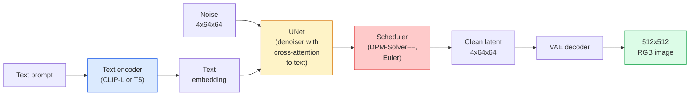

# Stable Diffusion — 아키텍처와 파인튜닝

> Stable Diffusion은 사전 학습된 VAE의 잠재 공간(latent space)에서 동작하는 DDPM으로, 교차 어텐션(cross-attention)을 통해 텍스트로 조건화되고, 빠른 결정론적 ODE 솔버로 샘플링되며, 분류기 없는 가이던스(classifier-free guidance)로 조향된다.

**Type:** Learn + Use
**Languages:** Python
**Prerequisites:** Phase 4 Lesson 10 (Diffusion), Phase 7 Lesson 02 (Self-Attention)
**Time:** ~75분

## 학습 목표 (Learning Objectives)

- Stable Diffusion 파이프라인(pipeline)의 다섯 부품을 추적하기: VAE, 텍스트 인코더(text encoder), U-Net, 스케줄러(scheduler), 안전성 검사기(safety checker) — 그리고 각각이 실제로 무엇을 하는지
- 잠재 확산(latent diffusion)을 설명하고, 왜 (3x512x512 이미지 대신) 4x64x64 잠재 공간에서 학습하면 품질 손실 없이 연산량이 48배 줄어드는지 설명하기
- `diffusers`를 사용해 이미지를 생성하고, 이미지-투-이미지(image-to-image), 인페인팅(inpainting), ControlNet 기반 생성을 실행하기
- 작은 커스텀 데이터셋(dataset)에 LoRA로 Stable Diffusion을 파인튜닝(fine-tuning)하고, 추론(inference) 시점에 LoRA 어댑터를 로드하기

## 문제 (The Problem)

512x512 RGB 이미지에 직접 DDPM을 학습시키는 것은 비싸다. 모든 학습 스텝은 3x512x512 = 786,432개의 입력값을 보는 U-Net으로 역전파(backpropagation)하며, 샘플링은 그 동일한 U-Net을 50번 이상 순방향 패스(forward pass)로 통과해야 한다. Stable Diffusion 1.5(2022년 출시)의 품질 수준에서, 픽셀 공간(pixel-space) 확산은 대략 256 GPU-개월의 학습과 소비자용 GPU에서 이미지당 10~30초가 필요하다.

오픈 가중치(open-weight) 텍스트-투-이미지(text-to-image)를 실용적으로 만든 비결은 **잠재 확산(latent diffusion)**(Rombach et al., CVPR 2022)이었다. 3x512x512 이미지를 4x64x64 잠재 텐서(tensor)로, 그리고 다시 되돌리는 VAE를 학습시킨 다음, 그 잠재 공간에서 확산을 수행한다. 연산량은 `(3*512*512)/(4*64*64) = 48x`만큼 줄어든다. 샘플링은 같은 GPU에서 수십 초에서 2초 미만으로 떨어진다.

거의 모든 현대 이미지 생성 모델(SDXL, SD3, FLUX, HunyuanDiT, Wan-Video)은 오토인코더(autoencoder), 디노이저(denoiser, U-Net 또는 DiT), 텍스트 조건화에 변형을 준 잠재 확산 모델이다. Stable Diffusion을 익히면 그 템플릿을 익히는 셈이다.

## 개념 (The Concept)

### 파이프라인



- **VAE** — 동결된(frozen) 오토인코더. 인코더(encoder)는 이미지를 잠재값(latents)으로 바꾼다(img2img와 학습에 사용). 디코더(decoder)는 잠재값을 다시 이미지로 바꾼다.
- **텍스트 인코더(Text encoder)** — CLIP 텍스트 인코더(SD 1.x/2.x), CLIP-L + CLIP-G(SDXL), 또는 T5-XXL(SD3/FLUX). 토큰 임베딩(token embedding)의 시퀀스를 생성한다.
- **U-Net** — 디노이저. 모든 해상도 레벨에서 잠재값으로부터 텍스트 임베딩으로 어텐션하는 교차 어텐션(cross-attention) 층을 가진다.
- **스케줄러(Scheduler)** — 샘플링 알고리즘(DDIM, Euler, DPM-Solver++). 시그마(sigma)를 고르고, 예측된 노이즈를 잠재값에 다시 섞어 넣는다.
- **안전성 검사기(Safety checker)** — 출력 이미지에 대한 선택적 NSFW / 불법 콘텐츠 필터.

### 분류기 없는 가이던스 (Classifier-free guidance, CFG)

순수한 텍스트 조건화는 모든 프롬프트(prompt) `c`에 대해 `epsilon_theta(x_t, t, c)`를 학습한다. CFG는 같은 신경망(neural network)을 `c`가 10%의 확률로 드롭(빈 임베딩으로 대체)된 상태로 학습시켜, 조건부(conditional)와 무조건부(unconditional) 노이즈를 모두 예측하는 단일 모델을 만든다. 추론 시:

```
eps = eps_uncond + w * (eps_cond - eps_uncond)
```

`w`는 가이던스 스케일(guidance scale)이다. `w=0`은 무조건부, `w=1`은 순수 조건부이며, `w>1`은 다양성을 희생하는 대신 출력을 "프롬프트에 더 강하게 조건화된" 쪽으로 밀어낸다. SD 기본값은 `w=7.5`이다.

CFG는 텍스트-투-이미지가 프로덕션(production) 품질로 동작하는 이유다. CFG가 없으면 프롬프트는 출력을 약하게만 편향시키지만, CFG가 있으면 프롬프트가 지배한다.

### 잠재 공간 기하학 (Latent space geometry)

VAE의 4채널 잠재값은 단지 압축된 이미지가 아니다. 이 잠재값은 산술 연산이 대략 의미론적 편집에 대응하는(프롬프트 엔지니어링 + 보간(interpolation)이 모두 여기서 일어난다) 다양체(manifold)이며, 확산 U-Net이 자신의 모든 모델링 예산을 쓰도록 학습된 공간이다. 무작위 4x64x64 잠재값을 디코딩해도 무작위처럼 보이는 이미지가 나오지 않는다. 쓰레기가 나온다. 잠재값의 특정 부분 다양체(submanifold)만이 유효한 이미지로 디코딩되기 때문이다.

두 가지 귀결:

1. **Img2img** = 이미지를 잠재값으로 인코딩하고, 부분적으로 노이즈를 더하고, 디노이저를 돌린 뒤, 디코딩한다. 인코딩이 거의 가역적이기 때문에 이미지 구조는 살아남고, 콘텐츠는 프롬프트에 따라 바뀐다.
2. **인페인팅(Inpainting)** = img2img와 같지만 디노이저가 마스크된(masked) 영역만 업데이트한다. 마스크되지 않은 영역은 인코딩된 잠재값으로 유지된다.

### U-Net 아키텍처

SD U-Net은 Lesson 10의 TinyUNet을 크게 키운 버전으로, 세 가지가 추가된다:

- 모든 공간 해상도에서의 **트랜스포머 블록(Transformer block)** — 셀프 어텐션(self-attention) + 텍스트 임베딩으로의 교차 어텐션을 포함한다.
- 사인파(sinusoidal) 인코딩에 MLP를 적용한 **시간 임베딩(Time embedding)**.
- 일치하는 해상도에서 인코더와 디코더를 잇는 **스킵 연결(Skip connection)**.

SD 1.5의 총 파라미터(parameter): 약 860M. SDXL: 약 2.6B. FLUX: 약 12B. 파라미터의 증가는 대부분 어텐션 층에 있다.

### LoRA 파인튜닝

Stable Diffusion의 전체 파인튜닝은 20GB 이상의 VRAM을 필요로 하고 860M개의 파라미터를 업데이트한다. LoRA(Low-Rank Adaptation)는 베이스 모델을 동결한 채 작은 저랭크 분해 행렬(rank-decomposition matrix)을 어텐션 층에 주입한다. SD용 LoRA 어댑터는 보통 10~50MB이고, 단일 소비자용 GPU에서 10~60분 만에 학습되며, 추론 시점에 끼워 넣는(drop-in) 변형으로 로드된다.

```
Original: W_q : (d_in, d_out)   frozen
LoRA:     W_q + alpha * (A @ B)   where A : (d_in, r), B : (r, d_out)

r is typically 4-32.
```

LoRA는 거의 모든 커뮤니티 파인튜닝이 배포되는 방식이다. CivitAI와 Hugging Face는 수백만 개를 호스팅한다.

### 만나게 될 스케줄러들

- **DDIM** — 결정론적, 약 50스텝, 단순함.
- **Euler ancestral** — 확률적(stochastic), 30~50스텝, 약간 더 창의적인 샘플.
- **DPM-Solver++ 2M Karras** — 결정론적, 20~30스텝, 프로덕션 기본값.
- **LCM / TCD / Turbo** — 일관성 모델(consistency model)과 증류된(distilled) 변형들. 약간의 품질을 희생하는 대신 1~4스텝.

스케줄러를 교체하는 것은 `diffusers`에서 한 줄짜리 변경이며, 때로는 재학습 없이 샘플 문제를 고쳐준다.

## 직접 만들기 (Build It)

이 레슨은 Stable Diffusion을 밑바닥부터 다시 만드는 대신 `diffusers`를 처음부터 끝까지 사용한다. 다시 만들어야 할 부품들(VAE, 텍스트 인코더, U-Net, 스케줄러)은 각자 자신의 레슨 주제다. 여기서 목표는 프로덕션 API에 능숙해지는 것이다.

### Step 1: 텍스트-투-이미지

```python
import torch
from diffusers import StableDiffusionPipeline

pipe = StableDiffusionPipeline.from_pretrained(
    "runwayml/stable-diffusion-v1-5",
    torch_dtype=torch.float16,
).to("cuda")

image = pipe(
    prompt="a dog riding a skateboard in tokyo, studio ghibli style",
    guidance_scale=7.5,
    num_inference_steps=25,
    generator=torch.Generator("cuda").manual_seed(42),
).images[0]
image.save("dog.png")
```

`float16`은 눈에 보이는 품질 손실 없이 VRAM을 절반으로 줄인다. 기본 DPM-Solver++로 `num_inference_steps=25`는 DDIM으로 `num_inference_steps=50`에 해당한다.

### Step 2: 스케줄러 교체

```python
from diffusers import DPMSolverMultistepScheduler, EulerAncestralDiscreteScheduler

pipe.scheduler = DPMSolverMultistepScheduler.from_config(pipe.scheduler.config)
pipe.scheduler = EulerAncestralDiscreteScheduler.from_config(pipe.scheduler.config)
```

스케줄러 상태는 U-Net 가중치와 분리되어 있다. DDPM으로 학습하고 어떤 스케줄러로든 샘플링할 수 있다.

### Step 3: 이미지-투-이미지

```python
from diffusers import StableDiffusionImg2ImgPipeline
from PIL import Image

img2img = StableDiffusionImg2ImgPipeline.from_pretrained(
    "runwayml/stable-diffusion-v1-5",
    torch_dtype=torch.float16,
).to("cuda")

init_image = Image.open("dog.png").convert("RGB").resize((512, 512))
out = img2img(
    prompt="a dog riding a skateboard, oil painting",
    image=init_image,
    strength=0.6,
    guidance_scale=7.5,
).images[0]
```

`strength`는 디노이징 전에 얼마나 많은 노이즈를 더할지다(0.0 = 변화 없음, 1.0 = 완전한 재생성). 스타일 전이(style transfer)에는 0.5~0.7이 표준 범위다.

### Step 4: 인페인팅

```python
from diffusers import StableDiffusionInpaintPipeline

inpaint = StableDiffusionInpaintPipeline.from_pretrained(
    "runwayml/stable-diffusion-inpainting",
    torch_dtype=torch.float16,
).to("cuda")

image = Image.open("dog.png").convert("RGB").resize((512, 512))
mask = Image.open("dog_mask.png").convert("L").resize((512, 512))

out = inpaint(
    prompt="a cat",
    image=image,
    mask_image=mask,
    guidance_scale=7.5,
).images[0]
```

마스크에서 흰색 픽셀이 재생성할 영역이다. 검은색 픽셀은 보존된다.

### Step 5: LoRA 로딩

```python
pipe.load_lora_weights("sayakpaul/sd-lora-ghibli")
pipe.fuse_lora(lora_scale=0.8)

image = pipe(prompt="a village square in ghibli style").images[0]
```

`lora_scale`은 강도를 제어한다. 0.0 = 효과 없음, 1.0 = 완전한 효과. `fuse_lora`는 속도를 위해 어댑터를 가중치에 제자리에서 굽지만(bake in), 교체를 막는다. 다른 어댑터를 로드하기 전에 `pipe.unfuse_lora()`를 호출하라.

### Step 6: LoRA 학습 (스케치)

실제 LoRA 학습은 `peft`나 `diffusers.training`에 있다. 그 개요:

```python
# Pseudocode
for step, batch in enumerate(dataloader):
    images, prompts = batch
    latents = vae.encode(images).latent_dist.sample() * 0.18215

    t = torch.randint(0, num_train_timesteps, (batch_size,))
    noise = torch.randn_like(latents)
    noisy_latents = scheduler.add_noise(latents, noise, t)

    text_emb = text_encoder(tokenizer(prompts))

    pred_noise = unet(noisy_latents, t, text_emb)  # LoRA weights injected here

    loss = F.mse_loss(pred_noise, noise)
    loss.backward()
    optimizer.step()
```

LoRA 행렬만 그래디언트(gradient)를 받는다. 베이스 U-Net, VAE, 텍스트 인코더는 동결된다. 배치(batch) 크기 1과 그래디언트 체크포인팅(gradient checkpointing)을 쓰면 8GB의 VRAM에 들어간다.

## 라이브러리로 써보기 (Use It)

프로덕션에서 실제로 내리게 되는 결정들:

- **모델 계열**: 오픈소스 커뮤니티 파인튜닝에는 SD 1.5, 더 높은 충실도(fidelity)에는 SDXL, 최첨단과 엄격한 라이선스 요구사항에는 SD3 / FLUX.
- **스케줄러**: 20~30스텝에는 DPM-Solver++ 2M Karras, 지연 시간(latency)이 1초 미만이어야 할 때는 LCM-LoRA.
- **정밀도(Precision)**: 4080/4090에서는 `float16`, A100 이상에서는 `bfloat16`, VRAM이 빠듯할 때는 `int8`(`bitsandbytes`나 `compel`을 통해).
- **조건화(Conditioning)**: 순수 텍스트로도 동작한다. 더 강한 제어를 위해서는 베이스 파이프라인 위에 ControlNet(canny, depth, pose)을 추가하라.

배치 생성에는 `AUTO1111` / `ComfyUI`가 커뮤니티 도구이고, 프로덕션 API에는 `diffusers` + `accelerate` 또는 TensorRT 컴파일을 쓴 `optimum-nvidia`가 있다.

## 산출물 (Ship It)

이 레슨이 만들어내는 것:

- `outputs/prompt-sd-pipeline-planner.md` — 지연 시간 예산, 충실도 목표, 라이선스 제약이 주어졌을 때 SD 1.5 / SDXL / SD3 / FLUX와 스케줄러, 정밀도를 골라주는 프롬프트.
- `outputs/skill-lora-training-setup.md` — 캡션, 랭크(rank), 배치 크기, 학습률(learning rate)을 포함해 커스텀 데이터셋을 위한 전체 LoRA 학습 설정을 작성하는 스킬.

## 연습 문제 (Exercises)

1. **(Easy)** 같은 프롬프트를 `guidance_scale`을 `[1, 3, 5, 7.5, 10, 15]`로 바꿔 가며 생성하라. 이미지가 어떻게 변하는지 서술하라. 어느 가이던스 값에서 아티팩트(artefact)가 나타나는가?
2. **(Medium)** 아무 실제 사진이나 골라, `StableDiffusionImg2ImgPipeline`을 `strength`를 `[0.2, 0.4, 0.6, 0.8, 1.0]`으로 바꿔 가며 통과시켜라. 어느 strength가 스타일을 바꾸면서도 구도를 보존하는가? 왜 1.0은 입력을 완전히 무시하는가?
3. **(Hard)** 단일 피사체(반려동물, 로고, 캐릭터)의 이미지 10~20장에 LoRA를 학습시키고, 그 피사체가 들어간 새로운 장면을 생성하라. 입력 이미지에 과적합(overfitting)하지 않으면서 최고의 정체성 보존을 만들어낸 LoRA 랭크와 학습 스텝 수를 보고하라.

## 핵심 용어 (Key Terms)

| 용어 | 사람들이 말하는 것 | 실제 의미 |
|------|----------------|----------------------|
| 잠재 확산(Latent diffusion) | "잠재 공간에서 확산한다" | 픽셀 공간(3x512x512) 대신 VAE 잠재 공간(4x64x64)에서 전체 DDPM을 돌린다. 연산량 48배 절약 |
| VAE 스케일 인자(VAE scale factor) | "0.18215" | VAE의 원시 잠재값을 대략 단위 분산으로 다시 스케일링하는 상수. 모든 SD 파이프라인에 하드코딩되어 있다 |
| 분류기 없는 가이던스(Classifier-free guidance) | "CFG" | 조건부와 무조건부 노이즈 예측을 섞는다. 가장 영향력이 큰 단일 추론 노브 |
| 스케줄러(Scheduler) | "샘플러" | 노이즈 + 모델 예측을 디노이징된 잠재 궤적으로 바꾸는 알고리즘 |
| LoRA | "저랭크 어댑터" | 베이스 가중치를 건드리지 않고 어텐션 층을 파인튜닝하는 작은 저랭크 분해 행렬 |
| 교차 어텐션(Cross-attention) | "텍스트-이미지 어텐션" | 잠재 토큰에서 텍스트 토큰으로의 어텐션. 모든 U-Net 레벨에서 프롬프트 정보를 주입한다 |
| ControlNet | "구조 조건화" | 추가 입력(canny, depth, pose, segmentation)으로 SD를 조향하는 별도로 학습된 어댑터 |
| DPM-Solver++ | "기본 스케줄러" | 2차 결정론적 ODE 솔버. 낮은 스텝 수(20~30)에서 최고의 품질. 2026년 기준 |

## 더 읽을거리 (Further Reading)

- [High-Resolution Image Synthesis with Latent Diffusion (Rombach et al., 2022)](https://arxiv.org/abs/2112.10752) — Stable Diffusion 논문. 설계를 정당화하는 모든 절제 실험(ablation)을 포함한다
- [Classifier-Free Diffusion Guidance (Ho & Salimans, 2022)](https://arxiv.org/abs/2207.12598) — CFG 논문
- [LoRA: Low-Rank Adaptation of Large Language Models (Hu et al., 2021)](https://arxiv.org/abs/2106.09685) — LoRA는 NLP에서 먼저 나왔다. 거의 변경 없이 SD로 옮겨졌다
- [diffusers documentation](https://huggingface.co/docs/diffusers) — 모든 SD / SDXL / SD3 / FLUX 파이프라인의 레퍼런스
