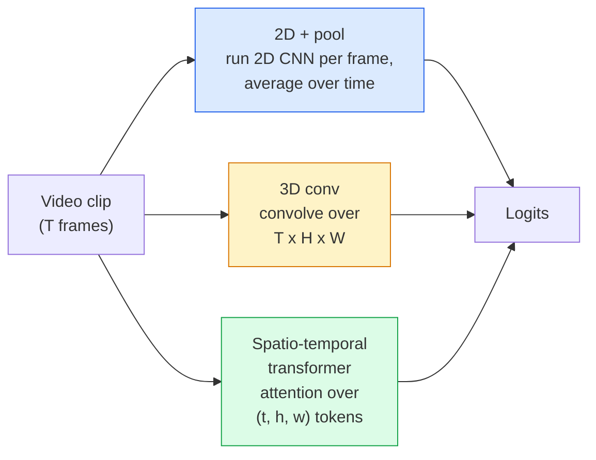

# 비디오 이해 — 시간적 모델링 (Temporal Modeling)

> 비디오는 이미지의 시퀀스에 그것들을 잇는 물리(physics)를 더한 것이다. 모든 비디오 모델은 시간을 추가 축으로 다루거나(3D 합성곱), 어텐션할 시퀀스로 다루거나(트랜스포머), 한 번 추출해 풀링할 특성으로 다룬다(2D+pool).

**Type:** Learn + Build
**Languages:** Python
**Prerequisites:** Phase 4 Lesson 03 (CNNs), Phase 4 Lesson 04 (Image Classification)
**Time:** ~45분

## 학습 목표 (Learning Objectives)

- 세 가지 주요 비디오 모델링 접근법(2D+pool, 3D 합성곱, 시공간 트랜스포머)을 구별하고, 그들의 비용과 정확도 트레이드오프(trade-off)를 예측하기
- PyTorch로 프레임 샘플링(frame sampling), 시간적 풀링(temporal pooling), 그리고 2D+pool 베이스라인(baseline) 분류기 구현하기
- 왜 I3D의 "팽창된(inflated)" 3D 커널이 ImageNet 가중치(weight)에서 잘 전이되는지, 그리고 인수분해된(factorised) (2+1)D 합성곱(convolution)이 무엇을 다르게 하는지 설명하기
- 표준 행동 인식(action-recognition) 데이터셋(dataset)과 지표를 읽기: Kinetics-400/600, UCF101, Something-Something V2. 클립 수준과 비디오 수준의 top-1 정확도

## 문제 (The Problem)

30fps의 30초 비디오는 900개의 이미지다. 순진하게 보면 비디오 분류(classification)는 이미지 분류를 900번 실행한 뒤 일종의 집계를 하는 것이다. 그 방식은 행동이 거의 모든 프레임에서 보일 때(스포츠, 요리, 운동 비디오) 잘 작동하고, 행동이 움직임 자체로 정의될 때는 심하게 실패한다. "무언가를 왼쪽에서 오른쪽으로 밀기"는 모든 프레임에서 정지한 두 물체처럼 보인다.

모든 비디오 아키텍처의 핵심 질문은 이것이다: 시간적 구조는 언제, 어떻게 모델링되는가? 그 답이 나머지 모든 것을 좌우한다 — 연산 비용, 사전 학습(pretraining) 전략, ImageNet 가중치를 재사용할 수 있는지 여부, 모델이 어떤 데이터셋으로 학습하는지.

이 레슨은 정적 이미지 레슨들보다 의도적으로 짧다. 핵심 이미지 기계 장치는 이미 갖춰져 있고, 비디오 이해는 대부분 시간적 이야기에 관한 것이다: 샘플링, 모델링, 그리고 집계.

## 개념 (The Concept)

### 세 가지 아키텍처 계열



### 2D + pool

2D CNN(ResNet, EfficientNet, ViT)을 가져온다. 샘플링된 모든 프레임에 대해 독립적으로 실행한다. 프레임별 임베딩(embedding)을 평균(또는 max-pool, 또는 attention-pool)한다. 풀링된 벡터(vector)를 분류기에 넣는다.

장점:
- ImageNet 사전 학습이 직접 전이된다.
- 구현이 가장 단순하다.
- 저렴함: T 프레임 * 단일 이미지 추론 비용.

단점:
- 움직임을 모델링할 수 없다. 행동 = 외형의 집계.
- 시간적 풀링은 순서 불변(order-invariant)이다. "문 열기"와 "문 닫기"가 똑같아 보인다.

언제 쓰는가: 외형이 중요한 작업, 작은 비디오 데이터셋에서의 전이 학습(transfer learning), 초기 베이스라인.

### 3D 합성곱 (3D convolutions)

2D (H, W) 커널을 3D (T, H, W) 커널로 대체한다. 신경망(neural network)은 공간과 시간 모두에 대해 합성곱을 한다. 초기 계열: C3D, I3D, SlowFast.

I3D 비결: 사전 학습된 2D ImageNet 모델을 가져와, 각 2D 커널을 새로운 시간 축을 따라 복사해 "팽창(inflate)"시킨다. 3x3 2D 합성곱은 3x3x3 3D 합성곱이 된다. 이로써 3D 모델은 밑바닥부터 학습하는 대신 강력한 사전 학습 가중치를 얻는다.

장점:
- 움직임을 직접 모델링한다.
- I3D 팽창은 공짜 전이 학습을 준다.

단점:
- 2D 대응물보다 T/8만큼 더 많은 FLOPs(시간 커널 3을 3번 쌓은 경우).
- 시간 커널이 작다. 장거리 움직임에는 피라미드 또는 이중 스트림(dual-stream) 접근이 필요하다.

언제 쓰는가: 움직임이 신호인 행동 인식(Something-Something V2, 움직임이 많은 클래스의 Kinetics).

### 시공간 트랜스포머 (Spatio-temporal transformers)

비디오를 시공간 패치(patch)의 격자로 토큰화(tokenise)하고 그 모두에 걸쳐 어텐션한다. TimeSformer, ViViT, Video Swin, VideoMAE.

중요한 어텐션 패턴:
- **결합(Joint)** — (t, h, w) 전체에 대한 하나의 큰 어텐션. `T*H*W`에 대해 이차(quadratic). 비쌈.
- **분할(Divided)** — 블록당 두 개의 어텐션: 하나는 시간에 대해, 하나는 공간에 대해. 거의 선형에 가까운 스케일링.
- **인수분해(Factorised)** — 시간 어텐션이 블록들에 걸쳐 공간 어텐션과 번갈아 나타난다.

장점:
- 모든 주요 벤치마크(benchmark)에서 SOTA 정확도.
- 패치 팽창을 통해 이미지 트랜스포머(ViT)에서 전이된다.
- 희소 어텐션(sparse attention)을 통해 긴 컨텍스트(context) 비디오를 지원한다.

단점:
- 연산을 많이 잡아먹는다.
- 신중한 어텐션 패턴 선택이 필요하며, 그렇지 않으면 런타임이 폭증한다.

언제 쓰는가: 큰 데이터셋, 고충실도 비디오 이해, 멀티모달(multi-modal) 비디오+텍스트 작업.

### 프레임 샘플링 (Frame sampling)

30fps의 10초 클립은 300프레임이다. 300개를 모두 어떤 모델에 넣는 것은 낭비다. 표준 전략:

- **균등 샘플링(Uniform sampling)** — 클립 전체에 걸쳐 T개의 프레임을 고르게 고른다. 2D+pool의 기본값.
- **밀집 샘플링(Dense sampling)** — 무작위 연속 T-프레임 윈도우. 움직임에는 인접 프레임이 필요하므로 3D 합성곱에서 흔하다.
- **다중 클립(Multi-clip)** — 같은 비디오에서 여러 T-프레임 윈도우를 샘플링하고, 각각을 분류한 뒤, 테스트 시점에 예측을 평균한다.

T는 보통 8, 16, 32, 또는 64다. T가 높을수록 = 더 많은 연산으로 더 많은 시간적 신호.

### 평가 (Evaluation)

두 수준:
- **클립 수준 정확도(Clip-level accuracy)** — 모델이 하나의 T-프레임 클립을 보고 top-k를 보고한다.
- **비디오 수준 정확도(Video-level accuracy)** — 비디오당 여러 클립에 걸쳐 클립 수준 예측을 평균한다. 더 높고 더 안정적이다.

항상 둘 다 보고하라. 클립 78% / 비디오 82%를 기록하는 모델은 테스트 시점 평균에 크게 의존하고 있는 것이고, 80% / 81%를 기록하는 모델은 클립당으로 더 견고하다.

### 만나게 될 데이터셋

- **Kinetics-400 / 600 / 700** — 범용 행동 데이터셋. 40만 개 클립. YouTube URL(다수가 이제 사라짐).
- **Something-Something V2** — 움직임으로 정의되는 행동("X를 왼쪽에서 오른쪽으로 옮기기"). 2D+pool로는 풀 수 없다.
- **UCF-101**, **HMDB-51** — 더 오래되고 더 작지만 여전히 보고된다.
- **AVA** — 공간과 시간에서의 행동 *위치 추정(localisation)*. 분류보다 어렵다.

## 직접 만들기 (Build It)

### Step 1: 프레임 샘플러

프레임 리스트(또는 비디오 텐서(tensor))에서 동작하는 균등 및 밀집 샘플러.

```python
import numpy as np

def sample_uniform(num_frames_total, T):
    if num_frames_total <= T:
        return list(range(num_frames_total)) + [num_frames_total - 1] * (T - num_frames_total)
    step = num_frames_total / T
    return [int(i * step) for i in range(T)]


def sample_dense(num_frames_total, T, rng=None):
    rng = rng or np.random.default_rng()
    if num_frames_total <= T:
        return list(range(num_frames_total)) + [num_frames_total - 1] * (T - num_frames_total)
    start = int(rng.integers(0, num_frames_total - T + 1))
    return list(range(start, start + T))
```

둘 다 비디오 텐서를 슬라이싱하는 데 사용할 `T`개의 인덱스를 반환한다.

### Step 2: 2D+pool 베이스라인

2D ResNet-18을 모든 프레임에 대해 실행하고, 특성을 평균 풀링한 뒤, 분류한다.

```python
import torch
import torch.nn as nn
from torchvision.models import resnet18, ResNet18_Weights

class FramePool(nn.Module):
    def __init__(self, num_classes=400, pretrained=True):
        super().__init__()
        weights = ResNet18_Weights.IMAGENET1K_V1 if pretrained else None
        backbone = resnet18(weights=weights)
        self.features = nn.Sequential(*(list(backbone.children())[:-1]))  # global avg pool kept
        self.head = nn.Linear(512, num_classes)

    def forward(self, x):
        # x: (N, T, 3, H, W)
        N, T = x.shape[:2]
        x = x.view(N * T, *x.shape[2:])
        feats = self.features(x).view(N, T, -1)
        pooled = feats.mean(dim=1)
        return self.head(pooled)

model = FramePool(num_classes=10)
x = torch.randn(2, 8, 3, 224, 224)
print(f"output: {model(x).shape}")
print(f"params: {sum(p.numel() for p in model.parameters()):,}")
```

천백만 개의 파라미터(parameter), ImageNet 사전 학습, 프레임별로 실행, 평균, 분류. 이 베이스라인은 외형이 중요한 작업에서 종종 제대로 된 3D 모델과 5~10점 이내에 있으며 — 때로는 더 낫다. 더 강력한 ImageNet 백본(backbone)을 재사용하기 때문이다.

### Step 3: I3D 스타일의 팽창된 3D 합성곱

단일 2D 합성곱을 가중치를 새로운 시간 축을 따라 반복함으로써 3D 합성곱으로 바꾼다.

```python
def inflate_2d_to_3d(conv2d, time_kernel=3):
    out_c, in_c, kh, kw = conv2d.weight.shape
    weight_3d = conv2d.weight.data.unsqueeze(2)  # (out, in, 1, kh, kw)
    weight_3d = weight_3d.repeat(1, 1, time_kernel, 1, 1) / time_kernel
    conv3d = nn.Conv3d(in_c, out_c, kernel_size=(time_kernel, kh, kw),
                        padding=(time_kernel // 2, conv2d.padding[0], conv2d.padding[1]),
                        stride=(1, conv2d.stride[0], conv2d.stride[1]),
                        bias=False)
    conv3d.weight.data = weight_3d
    return conv3d

conv2d = nn.Conv2d(3, 64, kernel_size=3, padding=1, bias=False)
conv3d = inflate_2d_to_3d(conv2d, time_kernel=3)
print(f"2D weight shape:  {tuple(conv2d.weight.shape)}")
print(f"3D weight shape:  {tuple(conv3d.weight.shape)}")
x = torch.randn(1, 3, 8, 56, 56)
print(f"3D output shape:  {tuple(conv3d(x).shape)}")
```

`time_kernel`로 나누는 것은 활성값(activation)의 크기를 대략 일정하게 유지한다 — 첫 패스에서 배치 정규화(batch-norm) 통계를 깨뜨리지 않기 위해 중요하다.

### Step 4: 인수분해된 (2+1)D 합성곱

3D 합성곱을 2D(공간) 합성곱과 1D(시간) 합성곱으로 나눈다. 동일한 수용 영역(receptive field), 더 적은 파라미터, 일부 벤치마크에서 더 나은 정확도.

```python
class Conv2Plus1D(nn.Module):
    def __init__(self, in_c, out_c, kernel_size=3):
        super().__init__()
        mid_c = (in_c * out_c * kernel_size * kernel_size * kernel_size) \
                // (in_c * kernel_size * kernel_size + out_c * kernel_size)
        self.spatial = nn.Conv3d(in_c, mid_c, kernel_size=(1, kernel_size, kernel_size),
                                 padding=(0, kernel_size // 2, kernel_size // 2), bias=False)
        self.bn = nn.BatchNorm3d(mid_c)
        self.act = nn.ReLU(inplace=True)
        self.temporal = nn.Conv3d(mid_c, out_c, kernel_size=(kernel_size, 1, 1),
                                  padding=(kernel_size // 2, 0, 0), bias=False)

    def forward(self, x):
        return self.temporal(self.act(self.bn(self.spatial(x))))

c = Conv2Plus1D(3, 64)
x = torch.randn(1, 3, 8, 56, 56)
print(f"(2+1)D output: {tuple(c(x).shape)}")
```

완전한 R(2+1)D 신경망은 모든 3x3 합성곱이 `Conv2Plus1D`로 대체된 ResNet-18과 같다.

## 라이브러리로 써보기 (Use It)

두 라이브러리가 프로덕션(production) 비디오 작업을 다룬다:

- `torchvision.models.video` — 사전 학습된 Kinetics 가중치를 가진 R(2+1)D, MViT, Swin3D. 이미지 모델과 동일한 API.
- `pytorchvideo`(Meta) — 모델 주(zoo), Kinetics / SSv2 / AVA용 데이터 로더, 표준 변환.

비전-언어(Vision-Language) 비디오 모델(비디오 캡셔닝, 비디오 QA)에는 `transformers`(`VideoMAE`, `VideoLLaMA`, `InternVideo`)를 쓴다.

## 산출물 (Ship It)

이 레슨이 만들어내는 것:

- `outputs/prompt-video-architecture-picker.md` — 외형 대 움직임, 데이터셋 크기, 연산 예산에 기반해 2D+pool / I3D / (2+1)D / 트랜스포머를 골라주는 프롬프트(prompt).
- `outputs/skill-frame-sampler-auditor.md` — 비디오 파이프라인(pipeline)의 샘플러를 검사하고 흔한 버그를 표시하는 스킬: off-by-one 인덱스, `num_frames < T`일 때의 불균등 샘플링, 종횡비 보존 크롭(aspect-preserving crop)의 부재 등.

## 연습 문제 (Exercises)

1. **(Easy)** T=8인 FramePool과 T=8인 I3D 스타일 3D ResNet의 FLOPs(근사값)를 계산하라. 왜 2D+pool이 3~5배 더 저렴한지 정당화하라.
2. **(Medium)** 합성 비디오 데이터셋을 생성하라: 무작위 방향으로 움직이는 무작위 공들을, 움직임의 방향("왼쪽에서 오른쪽", "오른쪽에서 왼쪽", "대각선 위")으로 레이블링(label)한다. 그 위에 FramePool을 학습시켜라. 거의 우연(chance) 수준의 정확도를 달성함을 보여, 외형만으로는 움직임 작업에 불충분함을 증명하라.
3. **(Hard)** ResNet-18의 모든 Conv2d를 `Conv2Plus1D`로 대체해 R(2+1)D-18을 만들어라. 첫 합성곱의 가중치를 ImageNet 사전 학습된 ResNet-18에서 팽창시켜라. 연습 문제 2의 움직임 데이터셋으로 학습시키고 FramePool을 이겨라.

## 핵심 용어 (Key Terms)

| 용어 | 사람들이 말하는 것 | 실제 의미 |
|------|----------------|----------------------|
| 2D + pool | "프레임별 분류기" | 샘플링된 모든 프레임에 2D CNN을 실행하고, 시간에 걸쳐 특성을 평균 풀링한 뒤, 분류한다 |
| 3D 합성곱(3D convolution) | "시공간 커널" | (T, H, W)에 걸쳐 합성곱하는 커널. 움직임을 기본적으로 모델링할 수 있다 |
| 팽창(Inflation) | "2D 가중치를 3D로 들어올린다" | 2D 합성곱의 가중치를 새로운 시간 축을 따라 반복해 3D 합성곱 가중치를 초기화한 뒤, 활성값 스케일을 보존하기 위해 kernel_T로 나눈다 |
| (2+1)D | "인수분해된 합성곱" | 3D를 2D 공간 + 1D 시간으로 나눈다. 더 적은 파라미터, 그 사이에 추가 비선형성 |
| 분할 어텐션(Divided attention) | "시간 그다음 공간" | 층당 두 개의 어텐션을 가진 트랜스포머 블록: 하나는 같은 프레임의 토큰에 대해, 하나는 같은 위치의 토큰에 대해 |
| 클립(Clip) | "T-프레임 윈도우" | T개 프레임의 샘플링된 부분 시퀀스. 비디오 모델이 소비하는 단위 |
| 클립 대 비디오 정확도(Clip vs video accuracy) | "두 평가 설정" | 클립 = 비디오당 하나의 샘플, 비디오 = 여러 샘플링된 클립에 걸친 평균 |
| Kinetics | "비디오의 ImageNet" | 400~700개 행동 클래스, 30만 개 이상의 YouTube 클립, 표준 비디오 사전 학습 말뭉치(corpus) |

## 더 읽을거리 (Further Reading)

- [I3D: Quo Vadis, Action Recognition (Carreira & Zisserman, 2017)](https://arxiv.org/abs/1705.07750) — 팽창과 Kinetics 데이터셋을 소개한다
- [R(2+1)D: A Closer Look at Spatiotemporal Convolutions (Tran et al., 2018)](https://arxiv.org/abs/1711.11248) — 인수분해된 합성곱. 여전히 강력한 베이스라인
- [TimeSformer: Is Space-Time Attention All You Need? (Bertasius et al., 2021)](https://arxiv.org/abs/2102.05095) — 최초의 강력한 비디오 트랜스포머
- [VideoMAE (Tong et al., 2022)](https://arxiv.org/abs/2203.12602) — 비디오를 위한 마스크드 오토인코더(masked autoencoder) 사전 학습. 현재 지배적인 사전 학습 레시피
