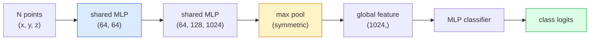

# 3D 비전 — 포인트 클라우드와 NeRF (Point Clouds & NeRFs)

> 3D 비전에는 두 가지 형태가 있다. 포인트 클라우드(point cloud)는 센서의 원시 출력이다. NeRF는 학습된 체적 필드(volumetric field)다. 둘 다 "공간의 어디에 무엇이 있는가"에 답한다.

**Type:** Learn + Build
**Languages:** Python
**Prerequisites:** Phase 4 Lesson 03 (CNNs), Phase 1 Lesson 12 (Tensor Operations)
**Time:** ~45분

## 학습 목표 (Learning Objectives)

- 명시적(explicit) 표현(포인트 클라우드, 메시(mesh), 복셀(voxel))과 암시적(implicit) 표현(부호 있는 거리 필드(signed distance field), NeRF)을 구별하고, 각각이 언제 쓰이는지 이해하기
- 신경망(neural network)을 정렬되지 않은 점 집합에 대해 순열 불변(permutation-invariant)으로 만드는 PointNet의 대칭 함수(symmetric-function) 비결 이해하기
- NeRF의 순방향 패스(forward pass)를 추적하기: 광선 투사(ray casting), 체적 렌더링(volumetric rendering), 위치 인코딩(positional encoding), MLP 밀도+색상 헤드
- 작은 포즈 이미지 집합으로부터의 사전 학습된 3D 재구성을 위해 `nerfstudio`나 `instant-ngp` 사용하기

## 문제 (The Problem)

카메라는 2D 이미지를 만든다. LIDAR는 정렬이 없는 3D 점들의 집합을 만든다. SfM(structure-from-motion) 파이프라인(pipeline)은 3D 키포인트(keypoint)의 희소한 클라우드를 만든다. NeRF는 소수의 포즈 이미지로부터 전체 3D 장면을 재구성한다. 이 모든 것이 "비전"이지만, 어느 것도 CNN이 원하는 밀집 텐서(tensor)처럼 보이지 않는다.

3D 비전이 중요한 이유는 거의 모든 고부가가치 로봇 작업이 3D에서 돌아가기 때문이다: 파지(grasping), 장애물 회피, 내비게이션, AR 가림(occlusion), 3D 콘텐츠 캡처. 2D 이미지만 이해하는 비전 엔지니어는 이 분야에서 가장 빠르게 성장하는 영역(AR/VR 콘텐츠, 로보틱스, 자율 주행 스택, 부동산이나 건설을 위한 NeRF 기반 3D 재구성)에 손을 댈 수 없다.

두 표현이 지배적인 이유는 서로 다르다. 포인트 클라우드는 센서가 공짜로 내놓는다. NeRF와 그 후계자들(3D 가우시안 스플래팅(Gaussian splatting), 신경 SDF)은 신경망에게 장면을 학습하라고 요청했을 때 얻는다.

## 개념 (The Concept)

### 포인트 클라우드 (Point clouds)

포인트 클라우드는 R^3 안의 N개 점의 정렬되지 않은 집합으로, 선택적으로 각 점이 특성(색상, 강도, 법선(normal))을 가진다.

```
cloud = [
  (x1, y1, z1, r1, g1, b1),
  (x2, y2, z2, r2, g2, b2),
  ...
  (xN, yN, zN, rN, gN, bN),
]
```

격자도, 연결성도 없다. 두 속성이 이것을 신경망에게 어렵게 만든다:

- **순열 불변성(Permutation invariance)** — 출력은 점의 순서에 의존해서는 안 된다.
- **가변 N** — 단일 모델이 서로 다른 크기의 클라우드를 처리해야 한다.

PointNet(Qi et al., 2017)은 하나의 아이디어로 둘 다 해결했다: 모든 점에 공유 MLP를 적용한 뒤, 대칭 함수(max pool)로 집계한다. 결과는 순서에 의존하지 않는 고정 크기 벡터(vector)다.

```
f(P) = max_{p in P} MLP(p)
```

이것이 PointNet의 핵심 전부다. 더 깊은 변형(PointNet++, Point Transformer)은 계층적 샘플링(sampling)과 국소 집계를 추가하지만 대칭 함수 비결은 변하지 않는다.

### PointNet 아키텍처



"공유 MLP(Shared MLP)"는 같은 MLP가 모든 점에 독립적으로 실행됨을 의미한다. 효율을 위해 점 차원에 대한 1x1 합성곱(convolution)으로 구현된다.

### 신경 복사장 (Neural Radiance Fields, NeRFs)

NeRF(Mildenhall et al., 2020)는 "N장의 사진으로 3D 장면을 재구성할 수 있는가?"라는 질문에 장면 그 자체인 신경망으로 답했다. 신경망은 `(x, y, z, viewing_direction)`을 `(density, colour)`로 매핑한다. 새로운 뷰의 렌더링은 이 신경망을 도는 광선 투사 루프다.

```
NeRF MLP:  (x, y, z, theta, phi) -> (sigma, r, g, b)

To render a pixel (u, v) of a new view:
  1. Cast a ray from the camera through pixel (u, v)
  2. Sample points along the ray at distances t_1, t_2, ..., t_N
  3. Query the MLP at each point
  4. Composite the colours weighted by (1 - exp(-sigma * dt))
  5. The sum is the rendered pixel colour
```

손실(loss)은 렌더링된 픽셀을 학습 사진의 정답(ground-truth) 픽셀과 비교한다. 렌더링 단계를 통한 역전파(backpropagation)가 MLP를 업데이트한다. 3D 정답도, 명시적 기하도 없다 — 장면은 MLP 가중치(weight)에 저장된다.

### NeRF의 위치 인코딩 (Positional encoding)

`(x, y, z)`에 대한 평범한 MLP는 고주파 디테일을 표현할 수 없다. MLP가 스펙트럼적으로 저주파 쪽으로 편향되어 있기 때문이다. NeRF는 MLP 이전에 각 좌표를 푸리에 특성(Fourier feature) 벡터로 인코딩해 이를 고친다:

```
gamma(p) = (sin(2^0 pi p), cos(2^0 pi p), sin(2^1 pi p), cos(2^1 pi p), ...)
```

L=10 주파수 레벨까지. 이것은 트랜스포머(transformer)가 위치에 쓰는 것과 같은 비결이며, 확산(diffusion) 시간 조건화(Lesson 10)에서도 다시 나타난다. 이것이 없으면 NeRF는 흐릿해 보인다.

### 체적 렌더링 (Volumetric rendering)

```
C(r) = sum_i T_i * (1 - exp(-sigma_i * delta_i)) * c_i

T_i  = exp(- sum_{j<i} sigma_j * delta_j)
delta_i = t_{i+1} - t_i
```

`T_i`는 투과율(transmittance)이다 — 점 i까지 얼마나 많은 빛이 살아남는지. `(1 - exp(-sigma_i * delta_i))`는 점 i에서의 불투명도(opacity)다. `c_i`는 색상이다. 최종 픽셀은 광선을 따라가는 가중합이다.

### NeRF를 대체한 것

순수 NeRF는 학습이 느리고(수 시간) 렌더링이 느리다(이미지당 수 초). 그 이후의 계보:

- **Instant-NGP**(2022) — 해시-격자(hash-grid) 인코딩이 MLP의 위치 입력을 대체한다. 수 초 만에 학습된다.
- **Mip-NeRF 360** — 경계가 없는 장면과 안티앨리어싱(anti-aliasing)을 처리한다.
- **3D 가우시안 스플래팅(3D Gaussian Splatting)**(2023) — 체적 필드를 수백만 개의 3D 가우시안으로 대체한다. 수 분 만에 학습되고, 실시간으로 렌더링된다. 현재의 프로덕션(production) 기본값.

2026년의 거의 모든 실제 NeRF 제품은 사실 3D 가우시안 스플래팅이다. 정신적 모델(mental model)은 여전히 NeRF다.

### 데이터셋과 벤치마크

- **ShapeNet** — 3D CAD 모델을 포인트 클라우드로 한 분류(classification)와 분할(segmentation).
- **ScanNet** — 분할을 위한 실제 실내 스캔.
- **KITTI** — 자율 주행을 위한 실외 LIDAR 포인트 클라우드.
- **NeRF Synthetic** / **Blended MVS** — 뷰 합성(view synthesis)을 위한 포즈 이미지 데이터셋(dataset).
- **Mip-NeRF 360** 데이터셋 — 경계가 없는 실제 장면.

## 직접 만들기 (Build It)

### Step 1: PointNet 분류기

```python
import torch
import torch.nn as nn

class PointNet(nn.Module):
    def __init__(self, num_classes=10):
        super().__init__()
        self.mlp1 = nn.Sequential(
            nn.Conv1d(3, 64, 1),    nn.BatchNorm1d(64),   nn.ReLU(inplace=True),
            nn.Conv1d(64, 64, 1),   nn.BatchNorm1d(64),   nn.ReLU(inplace=True),
        )
        self.mlp2 = nn.Sequential(
            nn.Conv1d(64, 128, 1),  nn.BatchNorm1d(128),  nn.ReLU(inplace=True),
            nn.Conv1d(128, 1024, 1), nn.BatchNorm1d(1024), nn.ReLU(inplace=True),
        )
        self.head = nn.Sequential(
            nn.Linear(1024, 512),   nn.BatchNorm1d(512),  nn.ReLU(inplace=True),
            nn.Dropout(0.3),
            nn.Linear(512, 256),    nn.BatchNorm1d(256),  nn.ReLU(inplace=True),
            nn.Dropout(0.3),
            nn.Linear(256, num_classes),
        )

    def forward(self, x):
        # x: (N, 3, num_points) — transposed for Conv1d
        x = self.mlp1(x)
        x = self.mlp2(x)
        x = torch.max(x, dim=-1)[0]       # (N, 1024)
        return self.head(x)

pts = torch.randn(4, 3, 1024)
net = PointNet(num_classes=10)
print(f"output: {net(pts).shape}")
print(f"params: {sum(p.numel() for p in net.parameters()):,}")
```

약 1.6M 파라미터(parameter). 클라우드당 1,024개 점에서 실행된다.

### Step 2: 위치 인코딩

```python
def positional_encoding(x, L=10):
    """
    x: (..., D) -> (..., D * 2 * L)
    """
    freqs = 2.0 ** torch.arange(L, dtype=x.dtype, device=x.device)
    args = x.unsqueeze(-1) * freqs * 3.141592653589793
    sinc = torch.cat([args.sin(), args.cos()], dim=-1)
    return sinc.reshape(*x.shape[:-1], -1)

x = torch.randn(5, 3)
y = positional_encoding(x, L=10)
print(f"input:  {x.shape}")
print(f"encoded: {y.shape}     # (5, 60)")
```

`2^l * pi`를 곱하면 점진적으로 더 높은 주파수를 준다.

### Step 3: 작은 NeRF MLP

```python
class TinyNeRF(nn.Module):
    def __init__(self, L_pos=10, L_dir=4, hidden=128):
        super().__init__()
        self.L_pos = L_pos
        self.L_dir = L_dir
        pos_dim = 3 * 2 * L_pos
        dir_dim = 3 * 2 * L_dir
        self.trunk = nn.Sequential(
            nn.Linear(pos_dim, hidden), nn.ReLU(inplace=True),
            nn.Linear(hidden, hidden),  nn.ReLU(inplace=True),
            nn.Linear(hidden, hidden),  nn.ReLU(inplace=True),
            nn.Linear(hidden, hidden),  nn.ReLU(inplace=True),
        )
        self.sigma = nn.Linear(hidden, 1)
        self.color = nn.Sequential(
            nn.Linear(hidden + dir_dim, hidden // 2), nn.ReLU(inplace=True),
            nn.Linear(hidden // 2, 3), nn.Sigmoid(),
        )

    def forward(self, x, d):
        x_enc = positional_encoding(x, self.L_pos)
        d_enc = positional_encoding(d, self.L_dir)
        h = self.trunk(x_enc)
        sigma = torch.relu(self.sigma(h)).squeeze(-1)
        rgb = self.color(torch.cat([h, d_enc], dim=-1))
        return sigma, rgb

nerf = TinyNeRF()
x = torch.randn(128, 3)
d = torch.randn(128, 3)
s, c = nerf(x, d)
print(f"sigma: {s.shape}   rgb: {c.shape}")
```

원본 NeRF(깊이 8의 MLP 줄기 2개를 가짐)에 비하면 작다. 아키텍처를 보여주기에는 충분하다.

### Step 4: 광선을 따라가는 체적 렌더링

```python
def volumetric_render(sigma, rgb, t_vals):
    """
    sigma: (..., N_samples)
    rgb:   (..., N_samples, 3)
    t_vals: (N_samples,) distances along the ray
    """
    delta = torch.cat([t_vals[1:] - t_vals[:-1], torch.full_like(t_vals[:1], 1e10)])
    alpha = 1.0 - torch.exp(-sigma * delta)
    trans = torch.cumprod(torch.cat([torch.ones_like(alpha[..., :1]), 1.0 - alpha + 1e-10], dim=-1), dim=-1)[..., :-1]
    weights = alpha * trans
    rendered = (weights.unsqueeze(-1) * rgb).sum(dim=-2)
    depth = (weights * t_vals).sum(dim=-1)
    return rendered, depth, weights


N = 64
t_vals = torch.linspace(2.0, 6.0, N)
sigma = torch.rand(N) * 0.5
rgb = torch.rand(N, 3)
rendered, depth, weights = volumetric_render(sigma, rgb, t_vals)
print(f"rendered colour: {rendered.tolist()}")
print(f"depth:           {depth.item():.2f}")
```

하나의 광선, 64개 샘플, 하나의 RGB 픽셀과 깊이로 합성한다.

## 라이브러리로 써보기 (Use It)

실제 작업을 위해서:

- `nerfstudio`(Tancik et al.) — NeRF / Instant-NGP / 가우시안 스플래팅을 위한 현재의 레퍼런스 라이브러리. 명령줄 + 웹 뷰어.
- `pytorch3d`(Meta) — 미분 가능 렌더링(differentiable rendering), 포인트 클라우드 유틸리티, 메시 연산.
- `open3d` — 포인트 클라우드 처리, 정합(registration), 시각화.

배포(deployment)를 위해서는, 3D 가우시안 스플래팅이 순수 NeRF를 대체로 대체했다. 100배 빠르게 렌더링하기 때문이다. 재구성 품질은 비슷하다.

## 산출물 (Ship It)

이 레슨이 만들어내는 것:

- `outputs/prompt-3d-task-router.md` — 작업과 입력 데이터에 기반해 올바른 3D 표현(포인트 클라우드, 메시, 복셀, NeRF, 가우시안 스플랫)으로 라우팅하는 프롬프트(prompt).
- `outputs/skill-point-cloud-loader.md` — 올바른 정규화(normalisation), 중심 맞추기, 점 샘플링을 갖춰 .ply / .pcd / .xyz 파일을 위한 PyTorch `Dataset`을 작성하는 스킬.

## 연습 문제 (Exercises)

1. **(Easy)** PointNet이 순열 불변임을 보여라: 같은 클라우드를 두 번 통과시키되, 한 번은 점을 섞어서 통과시켜라. 출력이 부동소수점 잡음 수준까지 동일함을 확인하라.
2. **(Medium)** 카메라 내부 파라미터(intrinsics)와 포즈가 주어졌을 때 H x W 이미지의 모든 픽셀에 대한 광선 원점과 방향을 생성하는 최소한의 광선 생성 함수를 구현하라.
3. **(Hard)** 색칠된 정육면체의 렌더링된 뷰들로 된 합성 데이터셋(미분 가능 렌더링이나 단순한 광선 추적기를 통해 생성)에 TinyNeRF를 학습시켜라. 에폭(epoch) 1, 10, 100에서의 렌더링 손실을 보고하라. 어느 에폭에서 모델이 알아볼 수 있는 뷰를 만들어내는가?

## 핵심 용어 (Key Terms)

| 용어 | 사람들이 말하는 것 | 실제 의미 |
|------|----------------|----------------------|
| 포인트 클라우드(Point cloud) | "LIDAR에서 나온 3D 점들" | (x, y, z) + 점당 선택적 특성의 정렬되지 않은 집합 |
| PointNet | "포인트 클라우드 위의 첫 신경망" | 점당 공유 MLP + 대칭(max) 풀. 구성상 순열 불변 |
| NeRF | "장면 그 자체인 MLP" | (x, y, z, dir)을 (밀도, 색상)으로 매핑하는 신경망. 광선 투사로 렌더링된다 |
| 위치 인코딩(Positional encoding) | "푸리에 특성" | MLP의 저주파 편향을 극복하기 위해 각 좌표를 여러 주파수의 sin/cos로 인코딩한다 |
| 체적 렌더링(Volumetric rendering) | "광선 적분" | 투과율과 알파를 사용해 광선을 따라가는 샘플들을 하나의 픽셀로 합성한다 |
| Instant-NGP | "해시-격자 NeRF" | NeRF의 좌표 MLP를 다중 해상도 해시 격자로 대체한다. 100~1000배 빠름 |
| 3D 가우시안 스플래팅(3D Gaussian splatting) | "수백만 개의 가우시안" | 장면 = 3D 가우시안의 모음. 실시간으로 렌더링되고, 수 분 만에 학습된다 |
| SDF | "부호 있는 거리 필드" | 가장 가까운 표면까지의 부호 있는 거리를 반환하는 함수. 또 하나의 암시적 표현 |

## 더 읽을거리 (Further Reading)

- [PointNet (Qi et al., 2017)](https://arxiv.org/abs/1612.00593) — 순열 불변 분류기
- [NeRF (Mildenhall et al., 2020)](https://arxiv.org/abs/2003.08934) — 사진으로부터의 3D 재구성을 신경망 문제로 만든 논문
- [Instant-NGP (Müller et al., 2022)](https://arxiv.org/abs/2201.05989) — 해시 격자, 1000배 속도 향상
- [3D Gaussian Splatting (Kerbl et al., 2023)](https://arxiv.org/abs/2308.04079) — 프로덕션에서 NeRF를 대체한 아키텍처
