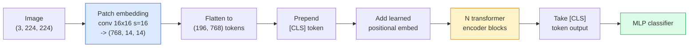

# 비전 트랜스포머 (Vision Transformers, ViT)

> 이미지를 패치(patch)로 자르고, 각 패치를 단어처럼 다루고, 표준 트랜스포머(transformer)를 돌려라. 뒤돌아보지 마라.

**Type:** Build
**Languages:** Python
**Prerequisites:** Phase 7 Lesson 02 (Self-Attention), Phase 4 Lesson 04 (Image Classification)
**Time:** ~45분

## 학습 목표 (Learning Objectives)

- 패치 임베딩(patch embedding), 학습된 위치 임베딩(positional embedding), 클래스 토큰(class token), 트랜스포머 인코더(transformer encoder) 블록을 밑바닥부터 구현해 최소한의 ViT를 만들기
- DeiT와 MAE가 아님을 증명하기 전까지, 왜 ViT가 막대한 사전 학습(pretraining) 데이터를 필요로 한다고 여겨졌는지 설명하기
- ViT, Swin, ConvNeXt를 각각의 아키텍처적 사전 지식(prior)(없음, 국소 윈도우 어텐션, 합성곱 백본)으로 비교하기
- `timm`과 표준 선형 프로브(linear-probe) / 파인튜닝(fine-tune) 레시피를 사용해 작은 데이터셋(dataset)에 사전 학습된 ViT를 파인튜닝하기

## 문제 (The Problem)

10년 동안 합성곱(convolution)은 컴퓨터 비전의 동의어였다. CNN은 강력한 귀납적 편향(inductive bias) — 국소성(locality), 평행 이동 등변성(translation equivariance) — 을 가졌고, 누구도 이를 대체할 수 있다고 생각하지 않았다. 그러다 Dosovitskiy et al. (2020)이, 합성곱 기계 장치가 전혀 없이 평탄화된(flattened) 이미지 패치에 적용된 평범한 트랜스포머가 규모에서 최고의 CNN과 맞먹거나 능가함을 보여줬다.

함정은 "규모에서"였다. ImageNet-1k의 ViT는 ResNet에 졌다. ImageNet-21k나 JFT-300M에 사전 학습한 뒤 ImageNet-1k에 파인튜닝한 ViT는 ResNet을 이겼다. 결론은 트랜스포머가 유용한 사전 지식을 결여하고 있지만 충분한 데이터로 이를 학습한다는 것이었다. 후속 연구(DeiT, MAE, DINO)는 올바른 학습 레시피 — 강력한 증강(augmentation), 자기 지도(self-supervised) 사전 학습, 증류(distillation) — 가 있으면 ViT도 작은 데이터에서 잘 학습됨을 보여줬다.

2026년 기준으로 순수 CNN은 여전히 엣지(edge) 기기에서 경쟁력이 있지만(ConvNeXt가 가장 강력하다), 트랜스포머는 그 외의 모든 것을 지배한다: 분할(Mask2Former, SegFormer), 검출(DETR, RT-DETR), 멀티모달(multimodal)(CLIP, SigLIP), 비디오(VideoMAE, VJEPA). 알아둘 것은 ViT 블록 구조다.

## 개념 (The Concept)

### 파이프라인



일곱 단계. 패치 -> 토큰 -> 어텐션 -> 분류기. 모든 변형(DeiT, Swin, ConvNeXt, MAE 사전 학습)은 일곱 중 하나둘을 바꾸고 나머지는 그대로 둔다.

### 패치 임베딩 (Patch embedding)

첫 합성곱이 비밀이다. 커널 크기 16, 스트라이드 16이므로 224x224 이미지는 16x16 패치의 14x14 격자가 되고, 각각은 768차원 임베딩으로 투영된다. 이 단일 합성곱이 패치화(patchify)와 선형 투영을 모두 한다.

```
Input:  (3, 224, 224)
Conv (3 -> 768, k=16, s=16, no padding):
Output: (768, 14, 14)
Flatten spatial: (196, 768)
```

196개 패치 = 196개 토큰. 각 토큰의 특성 차원은 768(ViT-B), 1024(ViT-L), 또는 1280(ViT-H)이다.

### 클래스 토큰 (Class token)

시퀀스 앞에 붙이는 단일 학습 벡터(vector):

```
tokens = [CLS; patch_1; patch_2; ...; patch_196]   shape (197, 768)
```

N개의 트랜스포머 블록 이후, `[CLS]` 출력이 전역 이미지 표현이다. 분류 헤드는 이 하나의 벡터만 읽는다.

### 위치 임베딩 (Positional embedding)

트랜스포머에는 공간적 위치라는 내장된 개념이 없다. 모든 토큰에 학습된 벡터를 더한다:

```
tokens = tokens + learned_pos_embedding   (also shape (197, 768))
```

임베딩은 모델의 파라미터(parameter)다. 그래디언트(gradient) 기반 학습이 이를 2D 이미지 구조에 적응시킨다. 사인파(sinusoidal) 2D 대안이 존재하지만 실무에서는 거의 쓰이지 않는다.

### 트랜스포머 인코더 블록 (Transformer encoder block)

표준이다. 멀티헤드 셀프 어텐션(multi-head self-attention), MLP, 잔차 연결(residual connection), 사전 LayerNorm(pre-LayerNorm).

```
x = x + MSA(LN(x))
x = x + MLP(LN(x))

MLP is two-layer with GELU: Linear(d -> 4d) -> GELU -> Linear(4d -> d)
```

ViT-B/16은 이런 블록을 12개 쌓고, 각각 12개의 어텐션 헤드를 가지며, 총 86M개의 파라미터다.

### 왜 pre-LN인가

초기 트랜스포머는 post-LN(`x = LN(x + sublayer(x))`)을 썼고 워밍업(warmup) 없이는 6~8층을 넘어 학습하기 어려웠다. Pre-LN(`x = x + sublayer(LN(x))`)은 워밍업 없이도 더 깊은 신경망(neural network)을 안정적으로 학습한다. 모든 ViT와 모든 현대 LLM이 pre-LN을 쓴다.

### 패치 크기 트레이드오프 (trade-off)

- 16x16 패치 -> 196 토큰, 표준.
- 32x32 패치 -> 49 토큰, 더 빠르지만 더 낮은 해상도.
- 8x8 패치 -> 784 토큰, 더 섬세하지만 O(n^2) 어텐션 비용이 나쁘게 스케일된다.

더 큰 패치 = 더 적은 토큰 = 더 빠르지만 공간 디테일이 적다. SwinV2는 계층적 윈도우에서 4x4 패치를 쓴다.

### ImageNet-1k에서 ViT를 학습시키는 DeiT의 레시피

원본 ViT는 CNN을 이기려고 JFT-300M이 필요했다. DeiT(Touvron et al., 2020)는 네 가지 변경으로 ViT-B를 ImageNet-1k만으로 top-1 81.8%까지 학습시켰다:

1. 무거운 증강: RandAugment, Mixup, CutMix, Random Erasing.
2. 확률적 깊이(Stochastic depth)(학습 중 무작위로 블록 전체를 드롭).
3. 반복 증강(Repeated augmentation)(같은 이미지를 배치(batch)당 3번 샘플링(sampling)).
4. CNN 교사(teacher)로부터의 증류(선택, 정확도를 더 끌어올림).

모든 현대 ViT 학습 레시피는 DeiT에서 유래한다.

### Swin 대 ConvNeXt

- **Swin**(Liu et al., 2021) — 윈도우 기반 어텐션. 각 블록은 국소 윈도우 안에서 어텐션하고, 번갈아 오는 블록이 윈도우를 이동시켜 윈도우들에 걸쳐 정보를 섞는다. 어텐션 연산자를 유지하면서 CNN 같은 국소성 사전 지식을 되살린다.
- **ConvNeXt**(Liu et al., 2022) — Swin의 아키텍처 선택(깊이별 합성곱(depthwise conv), LayerNorm, GELU, 역병목(inverted bottleneck))에 맞춰 재설계된 CNN. 격차가 "어텐션 대 합성곱"이 아니라 "현대 학습 레시피 + 아키텍처"임을 보여줬다.

2026년에는 ConvNeXt-V2와 Swin-V2 모두 프로덕션(production) 등급이다. 올바른 선택은 추론(inference) 스택(ConvNeXt가 엣지에서 더 잘 컴파일된다)과 사전 학습 말뭉치(corpus)에 달려 있다.

### MAE 사전 학습

마스크드 오토인코더(Masked Autoencoder)(He et al., 2022): 패치의 75%를 무작위로 마스킹하고, 인코더가 보이는 25%만 처리하도록 학습시키고, 작은 디코더(decoder)가 인코더의 출력으로부터 마스킹된 패치를 복원하도록 학습시킨다. 사전 학습 후, 디코더를 버리고 인코더를 파인튜닝한다.

MAE는 ViT를 ImageNet-1k만으로 학습 가능하게 만들고, SOTA에 도달하며, 현재의 기본 자기 지도 레시피다.

## 직접 만들기 (Build It)

### Step 1: 패치 임베딩

```python
import torch
import torch.nn as nn

class PatchEmbedding(nn.Module):
    def __init__(self, in_channels=3, patch_size=16, dim=192, image_size=64):
        super().__init__()
        assert image_size % patch_size == 0
        self.proj = nn.Conv2d(in_channels, dim, kernel_size=patch_size, stride=patch_size)
        num_patches = (image_size // patch_size) ** 2
        self.num_patches = num_patches

    def forward(self, x):
        x = self.proj(x)
        return x.flatten(2).transpose(1, 2)
```

합성곱 하나, flatten 하나, transpose 하나. 이미지-투-토큰 단계는 그것이 전부다.

### Step 2: 트랜스포머 블록

Pre-LN, 멀티헤드 셀프 어텐션, GELU를 쓴 MLP, 잔차 연결.

```python
class Block(nn.Module):
    def __init__(self, dim, num_heads, mlp_ratio=4, dropout=0.0):
        super().__init__()
        self.ln1 = nn.LayerNorm(dim)
        self.attn = nn.MultiheadAttention(dim, num_heads, dropout=dropout, batch_first=True)
        self.ln2 = nn.LayerNorm(dim)
        self.mlp = nn.Sequential(
            nn.Linear(dim, dim * mlp_ratio),
            nn.GELU(),
            nn.Dropout(dropout),
            nn.Linear(dim * mlp_ratio, dim),
            nn.Dropout(dropout),
        )

    def forward(self, x):
        a, _ = self.attn(self.ln1(x), self.ln1(x), self.ln1(x), need_weights=False)
        x = x + a
        x = x + self.mlp(self.ln2(x))
        return x
```

`nn.MultiheadAttention`이 헤드로의 분할, 스케일드 닷프로덕트(scaled dot-product), 출력 투영을 처리한다. `batch_first=True`이므로 형태는 `(N, seq, dim)`이다.

### Step 3: ViT

```python
class ViT(nn.Module):
    def __init__(self, image_size=64, patch_size=16, in_channels=3,
                 num_classes=10, dim=192, depth=6, num_heads=3, mlp_ratio=4):
        super().__init__()
        self.patch = PatchEmbedding(in_channels, patch_size, dim, image_size)
        num_patches = self.patch.num_patches
        self.cls_token = nn.Parameter(torch.zeros(1, 1, dim))
        self.pos_embed = nn.Parameter(torch.zeros(1, num_patches + 1, dim))
        self.blocks = nn.ModuleList([
            Block(dim, num_heads, mlp_ratio) for _ in range(depth)
        ])
        self.ln = nn.LayerNorm(dim)
        self.head = nn.Linear(dim, num_classes)
        nn.init.trunc_normal_(self.pos_embed, std=0.02)
        nn.init.trunc_normal_(self.cls_token, std=0.02)

    def forward(self, x):
        x = self.patch(x)
        cls = self.cls_token.expand(x.size(0), -1, -1)
        x = torch.cat([cls, x], dim=1)
        x = x + self.pos_embed
        for blk in self.blocks:
            x = blk(x)
        x = self.ln(x[:, 0])
        return self.head(x)

vit = ViT(image_size=64, patch_size=16, num_classes=10, dim=192, depth=6, num_heads=3)
x = torch.randn(2, 3, 64, 64)
print(f"output: {vit(x).shape}")
print(f"params: {sum(p.numel() for p in vit.parameters()):,}")
```

약 2.8M개 파라미터 — CPU에서 다룰 수 있는 작은 ViT. 실제 ViT-B는 86M이다. `dim=768, depth=12, num_heads=12`로 한 동일한 클래스 정의.

### Step 4: 정상 동작 확인 — 단일 이미지 추론

```python
logits = vit(torch.randn(1, 3, 64, 64))
print(f"logits: {logits}")
print(f"probs:  {logits.softmax(-1)}")
```

오류 없이 실행되어야 한다. 확률은 1로 합산된다.

## 라이브러리로 써보기 (Use It)

`timm`은 모든 ViT 변형을 ImageNet 사전 학습 가중치(weight)와 함께 제공한다. 한 줄:

```python
import timm

model = timm.create_model("vit_base_patch16_224", pretrained=True, num_classes=10)
```

`timm`은 2026년 비전 트랜스포머의 프로덕션 기본값이다. ViT, DeiT, Swin, Swin-V2, ConvNeXt, ConvNeXt-V2, MaxViT, MViT, EfficientFormer, 그리고 수십 가지를 같은 API로 지원한다.

멀티모달 작업(이미지 + 텍스트)에는 `transformers`가 CLIP, SigLIP, BLIP-2, LLaVA를 제공한다. 이들 모두의 이미지 인코더는 ViT 변형이다.

## 산출물 (Ship It)

이 레슨이 만들어내는 것:

- `outputs/prompt-vit-vs-cnn-picker.md` — 데이터셋 크기, 연산, 추론 스택에 기반해 ViT, ConvNeXt, Swin 중에서 골라주는 프롬프트(prompt).
- `outputs/skill-vit-patch-and-pos-embed-inspector.md` — ViT의 패치 임베딩과 위치 임베딩 형태가 모델의 기대 시퀀스 길이와 일치하는지 검증해, 가장 흔한 이식(porting) 버그를 잡는 스킬.

## 연습 문제 (Exercises)

1. **(Easy)** 위의 작은 ViT를 통한 순방향 패스에 대해 모든 중간 텐서(tensor)의 형태를 출력하라. 다음을 확인하라: 입력 `(N, 3, 64, 64)` -> 패치 `(N, 16, 192)` -> CLS와 함께 `(N, 17, 192)` -> 분류기 입력 `(N, 192)` -> 출력 `(N, num_classes)`.
2. **(Medium)** 사전 학습된 `timm` ViT-S/16을 Lesson 4의 합성 CIFAR 데이터셋에 파인튜닝하라. 같은 데이터에 대한 ResNet-18 파인튜닝과 비교하라. 학습 시간과 최종 정확도를 보고하라.
3. **(Hard)** 작은 ViT에 대해 MAE 사전 학습을 구현하라: 패치의 75%를 마스킹하고, 인코더 + 작은 디코더가 마스킹된 패치를 복원하도록 학습시켜라. 사전 학습 전후로 합성 데이터에서의 선형 프로브 정확도를 평가하라.

## 핵심 용어 (Key Terms)

| 용어 | 사람들이 말하는 것 | 실제 의미 |
|------|----------------|----------------------|
| 패치 임베딩(Patch embedding) | "첫 합성곱" | 커널 크기 = 스트라이드 = 패치 크기인 합성곱. 이미지를 토큰 임베딩의 격자로 바꾼다 |
| 클래스 토큰(Class token) | "[CLS]" | 토큰 시퀀스 앞에 붙는 학습된 벡터. 그 최종 출력이 전역 이미지 표현이다 |
| 위치 임베딩(Positional embedding) | "학습된 위치" | 트랜스포머가 각 패치가 어디서 왔는지 알도록 모든 토큰에 더하는 학습된 벡터 |
| Pre-LN | "서브층 이전의 LayerNorm" | 안정적인 트랜스포머 변형: `LN(x + sublayer(x))` 대신 `x + sublayer(LN(x))` |
| 멀티헤드 어텐션(Multi-head attention) | "병렬 어텐션" | 표준 트랜스포머 어텐션을 num_heads개의 독립적인 부분 공간으로 나누고, 이후 이어 붙인다 |
| ViT-B/16 | "Base, patch 16" | 표준 크기: dim=768, depth=12, heads=12, patch_size=16, image=224. 약 86M 파라미터 |
| DeiT | "데이터 효율적 ViT" | 강력한 증강과 함께 ImageNet-1k만으로 학습된 ViT. 큰 사전 학습 데이터셋이 엄밀히 필수는 아님을 증명했다 |
| MAE | "마스크드 오토인코더" | 자기 지도 사전 학습: 패치의 75%를 마스킹하고 복원한다. 지배적인 ViT 사전 학습 레시피 |

## 더 읽을거리 (Further Reading)

- [An Image is Worth 16x16 Words (Dosovitskiy et al., 2020)](https://arxiv.org/abs/2010.11929) — ViT 논문
- [DeiT: Data-efficient Image Transformers (Touvron et al., 2020)](https://arxiv.org/abs/2012.12877) — ImageNet-1k만으로 ViT를 학습시키는 방법
- [Masked Autoencoders are Scalable Vision Learners (He et al., 2022)](https://arxiv.org/abs/2111.06377) — MAE 사전 학습
- [timm documentation](https://huggingface.co/docs/timm) — 프로덕션에서 쓸 모든 비전 트랜스포머의 레퍼런스
