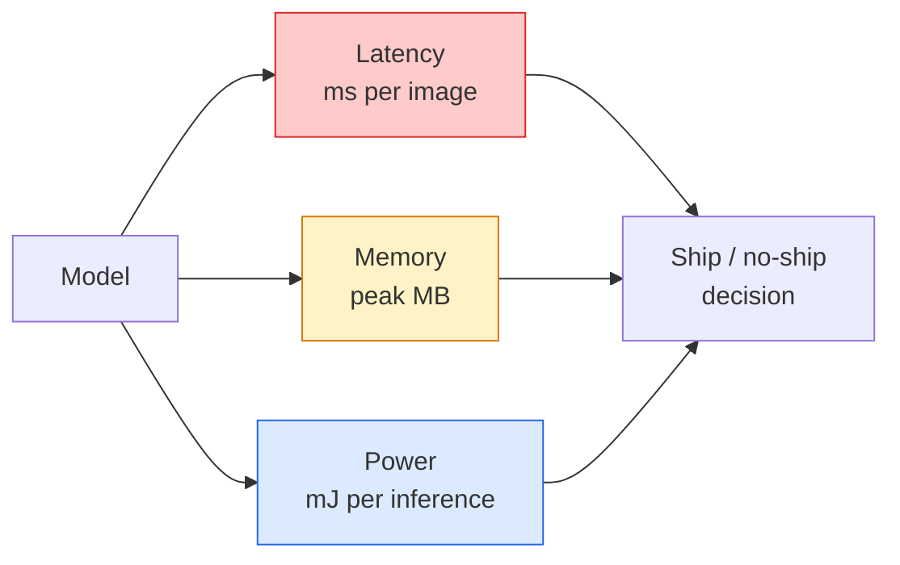

# 실시간 비전 — 엣지 배포 (Edge Deployment)

> 엣지 추론(edge inference)은 정확도 90짜리 모델을 RAM 2GB의 기기에서 30fps로 돌리는 기술이다. 정확도의 모든 1퍼센트 포인트는 지연 시간(latency)의 밀리초와 맞바꿔진다.

**Type:** Learn + Build
**Languages:** Python
**Prerequisites:** Phase 4 Lesson 04 (Image Classification), Phase 10 Lesson 11 (Quantization)
**Time:** ~75분

## 학습 목표 (Learning Objectives)

- 어떤 PyTorch 모델에 대해서든 추론 지연 시간, 최대 메모리, 처리량(throughput)을 측정하고, FLOPs / 파라미터(params) / 지연 시간 트레이드오프(trade-off)를 읽기
- PyTorch의 학습 후 양자화(post-training quantisation)를 사용해 비전 모델을 INT8로 양자화(quantise)하고 정확도 손실이 1% 미만임을 검증하기
- ONNX로 내보내고 ONNX Runtime 또는 TensorRT로 컴파일하기. 가장 흔한 세 가지 내보내기 실패와 그 해결책을 짚기
- 엣지 제약에 대해 MobileNetV3, EfficientNet-Lite, ConvNeXt-Tiny, MobileViT 중 언제 무엇을 골라야 하는지 설명하기

## 문제 (The Problem)

학습 시점의 비전 모델은 부동소수점 괴물이다. 1억 개의 파라미터(parameter), 순방향 패스(forward pass)당 10 GFLOPs, 2GB의 VRAM. 그 어느 것도 휴대폰, 자동차 인포테인먼트 장치, 산업용 카메라, 드론에 들어가지 않는다. 비전 시스템을 출하한다는 것은 동일한 예측을 100배 더 작은 예산에 맞춰 넣는다는 뜻이다.

세 개의 노브가 대부분을 좌우한다: 모델 선택(같은 레시피의 더 작은 아키텍처), 양자화(FP32 대신 INT8), 추론 런타임(ONNX Runtime, TensorRT, Core ML, TFLite). 이 셋을 제대로 맞추느냐가 워크스테이션에서 돌아가는 데모와 30달러짜리 카메라 모듈에 출하되는 제품을 가른다.

이 레슨은 먼저 측정 규율을 세운다(측정할 수 없는 것은 최적화할 수 없다). 그다음 세 노브를 짚어 간다. 목표는 모든 엣지 런타임을 배우는 것이 아니라 어떤 레버(lever)가 존재하는지, 그리고 각각이 생각대로 동작하는지 검증하는 법을 아는 것이다.

## 개념 (The Concept)

### 세 가지 예산



- **지연 시간(Latency)**: p50, p95, p99. p50만 평균 내면 실시간 시스템에 중요한 꼬리(tail) 행동을 숨긴다.
- **최대 메모리(Peak memory)**: 정상 상태 평균이 아니라 기기가 보는 최댓값. 임베디드 타깃에서 OOM은 치명적이므로 중요하다.
- **전력 / 에너지(Power / energy)**: 배터리 구동 기기에서 추론당 밀리줄(millijoule). 흔히 CPU/GPU 사용률 * 시간으로 대리 측정된다.

(모델, 지연 시간, 메모리, 정확도)의 표가 엣지 결정의 근거다. 모든 셀은 워크스테이션이 아니라 타깃 기기에서 측정된다.

### 측정 규율

모든 엣지 프로파일이 따라야 할 세 규칙:

1. 측정 전에 5~10번의 더미 순방향 패스로 모델을 **워밍업(warm up)**하라. 차가운 캐시와 JIT 컴파일은 대표성 없는 첫 수치를 만든다.
2. 시간 측정 블록 전후로 `torch.cuda.synchronize()`로 GPU 작업을 **동기화(synchronise)**하라. 이것이 없으면 커널 실행이 아니라 커널 디스패치(dispatch)를 측정한다.
3. 입력 크기를 프로덕션(production) 해상도로 **고정(fix)**하라. 224x224의 지연 시간은 512x512의 지연 시간이 아니다.

### 대리 지표로서의 FLOPs

FLOPs(추론당 부동소수점 연산)는 지연 시간을 가늠하는 저렴하고 기기 독립적인 대리 지표다. 아키텍처 비교에는 유용하지만, 절대 벽시계 시간(wall-clock)으로 읽으면 오해를 부른다. FLOPs가 10% 더 많은 모델이 실무에서는 2배 빠를 수 있다. 하드웨어 친화적 연산을 쓰기 때문이다(깊이별 합성곱(depthwise conv)은 잘 컴파일되고, 큰 7x7 합성곱은 그렇지 않다).

규칙: 아키텍처 탐색에는 FLOPs를, 배포(deployment) 결정에는 온디바이스 지연 시간을 쓴다.

### 한 문단으로 보는 양자화

FP32 가중치(weight)와 활성값(activation)을 INT8로 대체한다. 모델 크기는 4배, 메모리 대역폭은 4배 줄고, INT8 커널을 가진 하드웨어(모든 현대 모바일 SoC, Tensor Cores를 가진 모든 NVIDIA GPU)에서 연산은 2~4배 줄어든다. 비전 작업에서의 정확도 손실은 학습 후 정적 양자화(post-training static quantisation)로 보통 0.1~1 퍼센트 포인트다.

종류:

- **동적(Dynamic)** — 가중치를 INT8로 양자화하고, 활성값은 FP로 계산한다. 쉽고, 작은 속도 향상.
- **정적(학습 후)(Static, post-training)** — 가중치를 양자화 + 작은 캘리브레이션(calibration) 집합에서 활성값 범위를 보정한다. 동적보다 훨씬 빠르다.
- **양자화 인식 학습(Quantisation-aware training, QAT)** — 학습 중 양자화를 시뮬레이션해 모델이 그 주변에서 학습하게 한다. 최고의 정확도, 레이블된 데이터 필요.

비전에서는 학습 후 정적 양자화가 5%의 노력으로 95%의 이득을 준다. PTQ의 정확도 손실이 용납 불가능할 때만 QAT를 쓴다.

### 가지치기와 증류

- **가지치기(Pruning)** — 중요하지 않은 가중치(크기 기반)나 채널(구조적)을 제거한다. 과파라미터화된(overparameterised) 모델에서 잘 작동하고, 이미 컴팩트한 아키텍처에서는 덜 유용하다.
- **증류(Distillation)** — 작은 학생(student)이 큰 교사(teacher)의 로짓(logit)을 모방하도록 학습시킨다. 모델을 줄이며 잃은 정확도의 대부분을 종종 회복한다. 프로덕션 엣지 모델의 표준.

### 추론 런타임들

- **PyTorch eager** — 느림, 배포용 아님. 개발 전용으로 쓴다.
- **TorchScript** — 레거시. `torch.compile`과 ONNX 내보내기로 대체되었다.
- **ONNX Runtime** — 중립 런타임. CPU, CUDA, CoreML, TensorRT, OpenVINO 모두 ONNX 제공자(provider)를 가진다. 여기서 시작하라.
- **TensorRT** — NVIDIA의 컴파일러. NVIDIA GPU(워크스테이션과 Jetson)에서 최고의 지연 시간. ONNX Runtime과 통합되거나 독립 실행.
- **Core ML** — iOS/macOS를 위한 Apple의 런타임. `.mlmodel`이나 `.mlpackage`가 필요하다.
- **TFLite** — Android/ARM을 위한 Google의 런타임. `.tflite`가 필요하다.
- **OpenVINO** — CPU/VPU를 위한 Intel의 런타임. `.xml` + `.bin`이 필요하다.

실무에서는: PyTorch -> ONNX -> 타깃에 맞는 런타임 선택. ONNX가 공용어다.

### 엣지 아키텍처 선택기

| 예산 | 모델 | 이유 |
|--------|-------|-----|
| < 3M params | MobileNetV3-Small | 어디서나 컴파일됨, 좋은 베이스라인 |
| 3-10M | EfficientNet-Lite-B0 | TFLite에서 파라미터당 최고 정확도 |
| 10-20M | ConvNeXt-Tiny | 파라미터당 최고 정확도, CPU 친화적 |
| 20-30M | MobileViT-S 또는 EfficientViT | ImageNet 정확도의 트랜스포머 |
| 30-80M | Swin-V2-Tiny | 스택이 윈도우 어텐션을 지원한다면 |

특별히 그러지 않을 이유가 없는 한 이 모두를 INT8로 양자화하라.

## 직접 만들기 (Build It)

### Step 1: 지연 시간을 올바르게 측정하기

```python
import time
import torch

def measure_latency(model, input_shape, device="cpu", warmup=10, iters=50):
    model = model.to(device).eval()
    x = torch.randn(input_shape, device=device)
    with torch.no_grad():
        for _ in range(warmup):
            model(x)
        if device == "cuda":
            torch.cuda.synchronize()
        times = []
        for _ in range(iters):
            if device == "cuda":
                torch.cuda.synchronize()
            t0 = time.perf_counter()
            model(x)
            if device == "cuda":
                torch.cuda.synchronize()
            times.append((time.perf_counter() - t0) * 1000)
    times.sort()
    return {
        "p50_ms": times[len(times) // 2],
        "p95_ms": times[int(len(times) * 0.95)],
        "p99_ms": times[int(len(times) * 0.99)],
        "mean_ms": sum(times) / len(times),
    }
```

워밍업, 동기화, `time.perf_counter()` 사용. 평균뿐 아니라 백분위수(percentile)를 보고하라.

### Step 2: 파라미터와 FLOP 개수

```python
def parameter_count(model):
    return sum(p.numel() for p in model.parameters())

def flops_estimate(model, input_shape):
    """
    Rough FLOP count for a conv/linear-only model. For production use `fvcore` or `ptflops`.
    """
    total = 0
    def conv_hook(m, inp, out):
        nonlocal total
        c_out, c_in, kh, kw = m.weight.shape
        h, w = out.shape[-2:]
        total += 2 * c_in * c_out * kh * kw * h * w
    def linear_hook(m, inp, out):
        nonlocal total
        total += 2 * m.in_features * m.out_features
    hooks = []
    for m in model.modules():
        if isinstance(m, torch.nn.Conv2d):
            hooks.append(m.register_forward_hook(conv_hook))
        elif isinstance(m, torch.nn.Linear):
            hooks.append(m.register_forward_hook(linear_hook))
    model.eval()
    with torch.no_grad():
        model(torch.randn(input_shape))
    for h in hooks:
        h.remove()
    return total
```

실제 프로젝트에서는 `fvcore.nn.FlopCountAnalysis`나 `ptflops`를 쓴다. 그것들은 모든 모듈 유형을 올바르게 처리한다.

### Step 3: 학습 후 정적 양자화

```python
def quantise_ptq(model, calibration_loader, backend="x86"):
    import torch.ao.quantization as tq
    model = model.eval().cpu()
    model.qconfig = tq.get_default_qconfig(backend)
    tq.prepare(model, inplace=True)
    with torch.no_grad():
        for x, _ in calibration_loader:
            model(x)
    tq.convert(model, inplace=True)
    return model
```

세 단계: 설정, 준비(관찰자(observer) 삽입), 실제 데이터로 캘리브레이션, 변환(융합(fuse) + 양자화). 모델이 융합되어 있어야 한다(`Conv -> BN -> ReLU` -> `ConvBnReLU`). 이는 `torch.ao.quantization.fuse_modules`가 처리한다.

### Step 4: ONNX로 내보내기

```python
def export_onnx(model, sample_input, path="model.onnx"):
    model = model.eval()
    torch.onnx.export(
        model,
        sample_input,
        path,
        input_names=["input"],
        output_names=["output"],
        dynamic_axes={"input": {0: "batch"}, "output": {0: "batch"}},
        opset_version=17,
    )
    return path
```

`opset_version=17`이 2026년의 안전한 기본값이다. `dynamic_axes`는 임의의 배치(batch) 크기로 ONNX 모델을 실행하게 해준다.

### Step 5: 벤치마크와 체제 비교

```python
import torch.nn as nn
from torchvision.models import mobilenet_v3_small

def compare_regimes():
    model = mobilenet_v3_small(weights=None, num_classes=10)
    params = parameter_count(model)
    flops = flops_estimate(model, (1, 3, 224, 224))
    lat_fp32 = measure_latency(model, (1, 3, 224, 224), device="cpu")
    print(f"FP32 MobileNetV3-Small: {params:,} params  {flops/1e9:.2f} GFLOPs  "
          f"p50={lat_fp32['p50_ms']:.2f}ms  p95={lat_fp32['p95_ms']:.2f}ms")
```

`resnet50`, `efficientnet_v2_s`, `convnext_tiny`에 대해 같은 함수를 실행하면 배포 결정에 필요한 비교표를 얻는다.

## 라이브러리로 써보기 (Use It)

프로덕션 스택은 세 경로 중 하나로 수렴한다:

- **웹 / 서버리스(serverless)**: PyTorch -> ONNX -> ONNX Runtime(CPU 또는 CUDA 제공자). 가장 쉽고, 대부분에 충분하다.
- **NVIDIA 엣지(Jetson, GPU 서버)**: PyTorch -> ONNX -> TensorRT. 최고의 지연 시간, 가장 큰 엔지니어링 노력.
- **모바일**: PyTorch -> ONNX -> Core ML(iOS) 또는 TFLite(Android). 내보내기 전에 양자화하라.

측정에는 `torch-tb-profiler`, `nvprof` / `nsys`, macOS의 Instruments가 층별(layer-by-layer) 분석을 제공한다. `benchmark_app`(OpenVINO)과 `trtexec`(TensorRT)는 독립 실행 CLI 수치를 내준다.

## 산출물 (Ship It)

이 레슨이 만들어내는 것:

- `outputs/prompt-edge-deployment-planner.md` — 타깃 기기와 지연 시간 SLA가 주어졌을 때 백본(backbone), 양자화 전략, 런타임을 골라주는 프롬프트(prompt).
- `outputs/skill-latency-profiler.md` — 워밍업, 동기화, 백분위수, 메모리 추적을 갖춘 완전한 지연 시간 벤치마킹 스크립트를 작성하는 스킬.

## 연습 문제 (Exercises)

1. **(Easy)** CPU에서 224x224로 `resnet18`, `mobilenet_v3_small`, `efficientnet_v2_s`, `convnext_tiny`의 p50 지연 시간을 측정하라. 표를 보고하고 어느 아키텍처가 ms당 최고 정확도를 갖는지 식별하라.
2. **(Medium)** `mobilenet_v3_small`에 학습 후 정적 양자화를 적용하라. FP32 대 INT8 지연 시간과, CIFAR-10이나 유사한 데이터의 홀드아웃(held-out) 부분 집합에서의 정확도 손실을 보고하라.
3. **(Hard)** `convnext_tiny`를 ONNX로 내보내고, `CPUExecutionProvider`로 `onnxruntime`을 통해 실행한 뒤, PyTorch eager 베이스라인과 지연 시간을 비교하라. ONNX Runtime이 더 빨라지는 첫 번째 층을 식별하고 그 이유를 설명하라.

## 핵심 용어 (Key Terms)

| 용어 | 사람들이 말하는 것 | 실제 의미 |
|------|----------------|----------------------|
| 지연 시간(Latency) | "얼마나 빠른가" | 입력에서 출력까지의 시간. 평균이 아니라 p50/p95/p99 백분위수 |
| FLOPs | "모델 크기" | 순방향 패스당 부동소수점 연산. 연산 비용의 대략적 대리 지표 |
| INT8 양자화(INT8 quantisation) | "8비트" | FP32 가중치/활성값을 8비트 정수로 대체한다. 약 4배 작고, 2~4배 빠름 |
| PTQ | "학습 후 양자화" | 재학습 없이 학습된 모델을 양자화한다. 쉽고, 보통 충분하다 |
| QAT | "양자화 인식 학습" | 학습 중 양자화를 시뮬레이션한다. 최고의 정확도, 레이블된 데이터 필요 |
| ONNX | "중립 포맷" | 모든 주류 추론 런타임이 지원하는 모델 교환 포맷 |
| TensorRT | "NVIDIA 컴파일러" | ONNX를 NVIDIA GPU를 위한 최적화된 엔진으로 컴파일한다 |
| 증류(Distillation) | "교사 -> 학생" | 작은 모델이 큰 모델의 로짓을 모방하도록 학습시킨다. 잃은 정확도의 대부분을 회복한다 |

## 더 읽을거리 (Further Reading)

- [EfficientNet (Tan & Le, 2019)](https://arxiv.org/abs/1905.11946) — 효율적 아키텍처를 위한 복합 스케일링(compound scaling)
- [MobileNetV3 (Howard et al., 2019)](https://arxiv.org/abs/1905.02244) — h-swish와 스퀴즈-여기(squeeze-excite)를 쓴 모바일 우선 아키텍처
- [A Practical Guide to TensorRT Optimization (NVIDIA)](https://developer.nvidia.com/blog/accelerating-model-inference-with-tensorrt-tips-and-best-practices-for-pytorch-users/) — 논문의 처리량 수치를 실제로 얻는 방법
- [ONNX Runtime docs](https://onnxruntime.ai/docs/) — 양자화, 그래프 최적화, 제공자 선택
