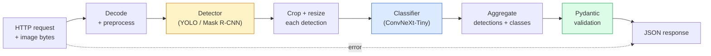

# 완전한 비전 파이프라인 만들기 — 캡스톤 (Capstone)

> 프로덕션 비전 시스템은 데이터 계약(data contract)으로 꿰맨 모델과 규칙의 연쇄다. 부품들은 이미 이 페이즈 안에 있다. 캡스톤은 그것들을 처음부터 끝까지 엮는다.

**Type:** Build
**Languages:** Python
**Prerequisites:** Phase 4 Lessons 01-15
**Time:** ~120분

## 학습 목표 (Learning Objectives)

- 물체를 검출하고, 분류하고, 구조화된 JSON을 내보내는 프로덕션 비전 파이프라인(pipeline)을 설계하기 — 모든 실패 경로를 처리하면서
- 검출기(detector)(Mask R-CNN 또는 YOLO), 분류기(classifier)(ConvNeXt-Tiny), 데이터 계약(Pydantic)을 하나의 서비스로 꽂아 넣기
- 종단 간(end-to-end) 파이프라인을 벤치마크(benchmark)하고 첫 번째 병목(bottleneck)을 식별하기(보통 전처리, 그다음 검출기)
- 이미지 업로드를 받아 파이프라인을 실행하고 분류와 함께 검출 결과를 반환하는 최소한의 FastAPI 서비스를 출하하기

## 문제 (The Problem)

개별 비전 모델은 유용하다. 비전 제품은 그것들의 연쇄다. 소매 진열대 감사는 검출기 + 제품 분류기 + 가격 OCR 파이프라인이다. 자율 주행은 2D 검출기 + 3D 검출기 + 분할기(segmenter) + 추적기(tracker) + 계획기(planner)다. 의료 사전 선별은 분할기 + 영역 분류기 + 임상의 UI다.

그 연쇄를 엮는 것이 ML 프로토타입과 제품을 가르는 부분이다. 모델 사이의 모든 인터페이스는 버그가 생길 새로운 자리다. 모든 좌표 변환, 모든 정규화(normalisation), 모든 마스크(mask) 리사이즈는 조용한 실패(silent-failure) 후보다. 파이프라인은 가장 약한 인터페이스만큼 강하다.

이 캡스톤은 최소 실행 가능 파이프라인을 세운다: 검출 + 분류 + 구조화된 출력 + 서빙(serving) 레이어. Phase 4의 나머지 모든 것이 이 골격에 끼워진다: Mask R-CNN을 YOLOv8로 교체하고, OCR 헤드를 추가하고, 분할 분기를 추가하고, 추적기를 추가한다. 아키텍처는 안정적이고, 부품들은 꽂아 넣을 수 있다(pluggable).

## 개념 (The Concept)

### 파이프라인



일곱 단계. 두 모델 단계는 비싸고, 나머지 다섯 단계는 버그가 사는 곳이다.

### Pydantic을 쓴 데이터 계약

모든 모델 경계가 타입이 지정된 객체가 된다. 이것은 조용한 실패를 시끄러운 실패로 바꾼다.

```
Detection(
    box: tuple[float, float, float, float],   # (x1, y1, x2, y2), absolute pixels
    score: float,                              # [0, 1]
    class_id: int,                             # from detector's label map
    mask: Optional[list[list[int]]],           # RLE-encoded if present
)

PipelineResult(
    image_id: str,
    detections: list[Detection],
    classifications: list[Classification],
    inference_ms: float,
)
```

검출기가 박스를 `(x1, y1, x2, y2)` 대신 `(cx, cy, w, h)`로 반환할 때, Pydantic의 검증이 경계에서 실패하고, 조용히 빈 영역을 반환하는 하류의 크롭(crop)을 디버깅하는 대신 즉시 알게 된다.

### 지연 시간이 가는 곳

거의 모든 비전 파이프라인에서 세 가지 진실이 성립한다:

1. **전처리(Preprocessing)가 종종 가장 큰 단일 블록이다.** JPEG 디코딩, 색 공간 변환, 리사이징 — 이것들은 CPU 바운드(CPU-bound)이고 잊기 쉽다.
2. **검출기가 GPU 시간을 지배한다.** GPU 시간의 70~90%가 검출 순방향 패스(forward pass)에 있다.
3. **후처리(Postprocessing)(NMS, RLE 인코드/디코드)는 GPU에서는 저렴하고 CPU에서는 비싸다.** 항상 실제 타깃으로 프로파일하라.

분포를 아는 것이 최적화를 우선순위 매긴 목록으로 바꾼다.

### 실패 모드

- **빈 검출(Empty detections)** — 빈 리스트를 반환하라, 죽지 마라. 로그를 남겨라.
- **경계 밖 박스(Out-of-bounds boxes)** — 크롭 전에 이미지 크기로 클램프(clamp)하라.
- **작은 크롭(Tiny crops)** — 분류기의 최소 입력보다 작은 박스에는 분류를 건너뛰어라.
- **손상된 업로드(Corrupt upload)** — 500이 아니라 특정 오류 코드와 함께 400 응답.
- **모델 로드 실패(Model load failure)** — 첫 요청이 아니라 서비스 시작 시점에 실패하라.

프로덕션 파이프라인은 실패를 숨기는 일반적 `try/except`를 쓰지 않고 이 각각을 처리한다. 모든 실패는 명명된 코드와 응답을 얻는다.

### 배치 처리 (Batching)

프로덕션 서비스는 여러 클라이언트를 서빙한다. 요청들에 걸쳐 검출과 분류를 배치(batch)하면 처리량(throughput)이 곱절이 된다. 트레이드오프(trade-off): 배치가 채워지기를 기다리는 데서 오는 추가 지연 시간. 전형적인 설정: 최대 20ms 동안 요청을 모으고, 함께 배치하고, 처리하고, 응답을 분배한다. `torchserve`와 `triton`은 이를 기본으로 하고, 예측 가능한 부하의 작은 서비스는 자체 마이크로 배처(micro-batcher)를 만든다.

## 직접 만들기 (Build It)

### Step 1: 데이터 계약

```python
from pydantic import BaseModel, Field
from typing import List, Optional, Tuple

class Detection(BaseModel):
    box: Tuple[float, float, float, float]
    score: float = Field(ge=0, le=1)
    class_id: int = Field(ge=0)
    mask_rle: Optional[str] = None


class Classification(BaseModel):
    detection_index: int
    class_id: int
    class_name: str
    score: float = Field(ge=0, le=1)


class PipelineResult(BaseModel):
    image_id: str
    detections: List[Detection]
    classifications: List[Classification]
    inference_ms: float
```

5초짜리 코드가 진지한 파이프라인이라면 한 시간의 디버깅을 아껴준다.

### Step 2: 최소한의 Pipeline 클래스

```python
import time
import numpy as np
import torch
from PIL import Image

class VisionPipeline:
    def __init__(self, detector, classifier, class_names,
                 device="cpu", min_crop=32):
        self.detector = detector.to(device).eval()
        self.classifier = classifier.to(device).eval()
        self.class_names = class_names
        self.device = device
        self.min_crop = min_crop

    def preprocess(self, image):
        """
        image: PIL.Image or np.ndarray (H, W, 3) uint8
        returns: CHW float tensor on device
        """
        if isinstance(image, Image.Image):
            image = np.asarray(image.convert("RGB"))
        tensor = torch.from_numpy(image).permute(2, 0, 1).float() / 255.0
        return tensor.to(self.device)

    @torch.no_grad()
    def detect(self, image_tensor):
        return self.detector([image_tensor])[0]

    @torch.no_grad()
    def classify(self, crops):
        if len(crops) == 0:
            return []
        batch = torch.stack(crops).to(self.device)
        logits = self.classifier(batch)
        probs = logits.softmax(-1)
        scores, cls = probs.max(-1)
        return list(zip(cls.tolist(), scores.tolist()))

    def run(self, image, image_id="anonymous"):
        t0 = time.perf_counter()
        tensor = self.preprocess(image)
        det = self.detect(tensor)

        crops = []
        detections = []
        valid_indices = []
        for i, (box, score, cls) in enumerate(zip(det["boxes"], det["scores"], det["labels"])):
            x1, y1, x2, y2 = [max(0, int(b)) for b in box.tolist()]
            x2 = min(x2, tensor.shape[-1])
            y2 = min(y2, tensor.shape[-2])
            detections.append(Detection(
                box=(x1, y1, x2, y2),
                score=float(score),
                class_id=int(cls),
            ))
            if (x2 - x1) < self.min_crop or (y2 - y1) < self.min_crop:
                continue
            crop = tensor[:, y1:y2, x1:x2]
            crop = torch.nn.functional.interpolate(
                crop.unsqueeze(0),
                size=(224, 224),
                mode="bilinear",
                align_corners=False,
            )[0]
            crops.append(crop)
            valid_indices.append(i)

        class_preds = self.classify(crops)

        classifications = []
        for valid_idx, (cls_id, cls_score) in zip(valid_indices, class_preds):
            classifications.append(Classification(
                detection_index=valid_idx,
                class_id=int(cls_id),
                class_name=self.class_names[cls_id],
                score=float(cls_score),
            ))

        return PipelineResult(
            image_id=image_id,
            detections=detections,
            classifications=classifications,
            inference_ms=(time.perf_counter() - t0) * 1000,
        )
```

모든 인터페이스에 타입이 지정되어 있다. 모든 실패 경로에 구체적인 처리 결정이 있다.

### Step 3: 검출기와 분류기 연결하기

```python
from torchvision.models.detection import maskrcnn_resnet50_fpn_v2
from torchvision.models import convnext_tiny

# Use ImageNet-pretrained weights for a realistic pipeline without training
detector = maskrcnn_resnet50_fpn_v2(weights="DEFAULT")
classifier = convnext_tiny(weights="DEFAULT")
class_names = [f"imagenet_class_{i}" for i in range(1000)]

pipe = VisionPipeline(detector, classifier, class_names)

# Smoke test with a synthetic image
test_image = (np.random.rand(400, 600, 3) * 255).astype(np.uint8)
result = pipe.run(test_image, image_id="demo")
print(result.model_dump_json(indent=2)[:500])
```

### Step 4: FastAPI 서비스

```python
from fastapi import FastAPI, UploadFile, HTTPException
from io import BytesIO

app = FastAPI()
pipe = None  # initialised on startup

@app.on_event("startup")
def load():
    global pipe
    detector = maskrcnn_resnet50_fpn_v2(weights="DEFAULT").eval()
    classifier = convnext_tiny(weights="DEFAULT").eval()
    pipe = VisionPipeline(detector, classifier, class_names=[f"c{i}" for i in range(1000)])

@app.post("/detect")
async def detect_endpoint(file: UploadFile):
    if file.content_type not in {"image/jpeg", "image/png", "image/webp"}:
        raise HTTPException(status_code=400, detail="unsupported image type")
    data = await file.read()
    try:
        img = Image.open(BytesIO(data)).convert("RGB")
    except Exception:
        raise HTTPException(status_code=400, detail="cannot decode image")
    result = pipe.run(img, image_id=file.filename or "upload")
    return result.model_dump()
```

`uvicorn main:app --host 0.0.0.0 --port 8000`로 실행하라. `curl -F 'file=@dog.jpg' http://localhost:8000/detect`로 테스트하라.

### Step 5: 파이프라인 벤치마크

```python
import time

def benchmark(pipe, num_runs=20, image_size=(400, 600)):
    img = (np.random.rand(*image_size, 3) * 255).astype(np.uint8)
    pipe.run(img)  # warm up

    stages = {"preprocess": [], "detect": [], "classify": [], "total": []}
    for _ in range(num_runs):
        t0 = time.perf_counter()
        tensor = pipe.preprocess(img)
        t1 = time.perf_counter()
        det = pipe.detect(tensor)
        t2 = time.perf_counter()
        crops = []
        for box in det["boxes"]:
            x1, y1, x2, y2 = [max(0, int(b)) for b in box.tolist()]
            x2 = min(x2, tensor.shape[-1])
            y2 = min(y2, tensor.shape[-2])
            if (x2 - x1) >= pipe.min_crop and (y2 - y1) >= pipe.min_crop:
                crop = tensor[:, y1:y2, x1:x2]
                crop = torch.nn.functional.interpolate(
                    crop.unsqueeze(0), size=(224, 224), mode="bilinear", align_corners=False
                )[0]
                crops.append(crop)
        pipe.classify(crops)
        t3 = time.perf_counter()
        stages["preprocess"].append((t1 - t0) * 1000)
        stages["detect"].append((t2 - t1) * 1000)
        stages["classify"].append((t3 - t2) * 1000)
        stages["total"].append((t3 - t0) * 1000)

    for stage, times in stages.items():
        times.sort()
        print(f"{stage:12s}  p50={times[len(times)//2]:7.1f} ms  p95={times[int(len(times)*0.95)]:7.1f} ms")
```

CPU에서의 전형적인 출력: 전처리 약 3ms, 검출 300~500ms, 분류 20~40ms, 총 350~550ms. GPU에서는 검출이 20~40ms이고, 전처리 + 분류가 상대적으로 더 중요해지기 시작한다.

## 라이브러리로 써보기 (Use It)

프로덕션 템플릿은 같은 구조로 수렴하며, 더해서:

- **모델 버전 관리(Model versioning)** — 응답에 항상 모델 이름과 가중치(weight) 해시를 로그하라.
- **요청별 추적 ID(Per-request trace IDs)** — 느린 응답을 단계와 연관 지을 수 있도록 모든 요청의 모든 단계 타이밍을 로그하라.
- **폴백 경로(Fallback path)** — 분류기가 타임아웃되면, 전체 요청을 실패시키는 대신 분류 없이 검출만 반환하라.
- **안전 필터(Safety filters)** — NSFW / PII 필터를 분류 후, 응답이 서비스를 떠나기 전에 실행하라.
- **배치 엔드포인트(Batch endpoint)** — 대량 처리를 위해 이미지 URL 리스트를 받는 `/detect_batch`.

프로덕션 서빙에는, `torchserve`, `Triton Inference Server`, `BentoML`이 배치 처리, 버전 관리, 메트릭, 헬스 체크(health check)를 기본으로 처리한다. `FastAPI`를 직접 실행하는 것은 프로토타입과 소규모 제품에 적절하다.

## 산출물 (Ship It)

이 레슨이 만들어내는 것:

- `outputs/prompt-vision-service-shape-reviewer.md` — 비전 서비스의 코드를 계약/응답 형태 위반에 대해 검토하고 첫 번째로 깨지는 버그를 짚어주는 프롬프트(prompt).
- `outputs/skill-pipeline-budget-planner.md` — 목표 지연 시간과 처리량이 주어졌을 때 모든 파이프라인 단계에 시간 예산을 할당하고 어느 단계가 먼저 예산을 놓칠지 표시하는 스킬.

## 연습 문제 (Exercises)

1. **(Easy)** 아무 공개 데이터셋의 이미지 10장에 파이프라인을 실행하라. 단계별 평균 시간과 이미지당 검출 개수의 분포를 보고하라.
2. **(Medium)** `Detection`에 마스크 출력 필드를 추가하고 RLE로 인코딩하라. 10개 물체 이미지에 대해서도 JSON이 1MB 미만으로 유지됨을 검증하라.
3. **(Hard)** 분류기 앞에 마이크로 배처를 추가하라: 최대 10ms 동안 크롭을 모으고, 한 번의 GPU 호출로 모두 분류하고, 요청별로 결과를 반환한다. 초당 5개 동시 요청에서의 처리량 향상과 추가된 지연 시간을 측정하라.

## 핵심 용어 (Key Terms)

| 용어 | 사람들이 말하는 것 | 실제 의미 |
|------|----------------|----------------------|
| 파이프라인(Pipeline) | "시스템" | 각 쌍 사이에 타입이 지정된 인터페이스를 가진 전처리, 추론, 후처리 단계의 순서 있는 연쇄 |
| 데이터 계약(Data contract) | "스키마" | 모든 단계 입출력이 따르는 Pydantic / dataclass 정의. 통합 버그를 경계에서 잡는다 |
| 전처리(Preprocessing) | "모델 이전" | 디코딩, 색 변환, 리사이징, 정규화. 보통 가장 큰 CPU 시간 소모처 |
| 후처리(Postprocessing) | "모델 이후" | NMS, 마스크 리사이즈, 임계값, RLE 인코드. GPU에서는 저렴하고 CPU에서는 비싸다 |
| 마이크로 배처(Microbatcher) | "모은 뒤 순방향" | 여러 요청을 위해 고정 윈도우만큼 기다린 뒤, 단일 배치 순방향 패스를 실행하는 집계기 |
| 추적 ID(Trace ID) | "요청 id" | 느린 요청을 종단 간으로 추적할 수 있도록 모든 단계에서 로그되는 요청별 식별자 |
| 실패 코드(Failure code) | "명명된 오류" | 일반적인 500 대신 실패 클래스별 특정 오류 코드. 클라이언트 재시도 로직을 가능하게 한다 |
| 헬스 체크(Health check) | "준비 상태 프로브" | 서비스가 응답할 수 있는지 보고하는 저렴한 엔드포인트. 로드 밸런서가 이에 의존한다 |

## 더 읽을거리 (Further Reading)

- [Full Stack Deep Learning — Deploying Models](https://fullstackdeeplearning.com/course/2022/lecture-5-deployment/) — 프로덕션 ML 배포의 표준 개요
- [BentoML docs](https://docs.bentoml.com) — 배치 처리, 버전 관리, 메트릭을 갖춘 서빙 프레임워크
- [torchserve docs](https://pytorch.org/serve/) — PyTorch의 공식 서빙 라이브러리
- [NVIDIA Triton Inference Server](https://developer.nvidia.com/triton-inference-server) — 배치 처리와 다중 모델 지원을 갖춘 고처리량 서빙
