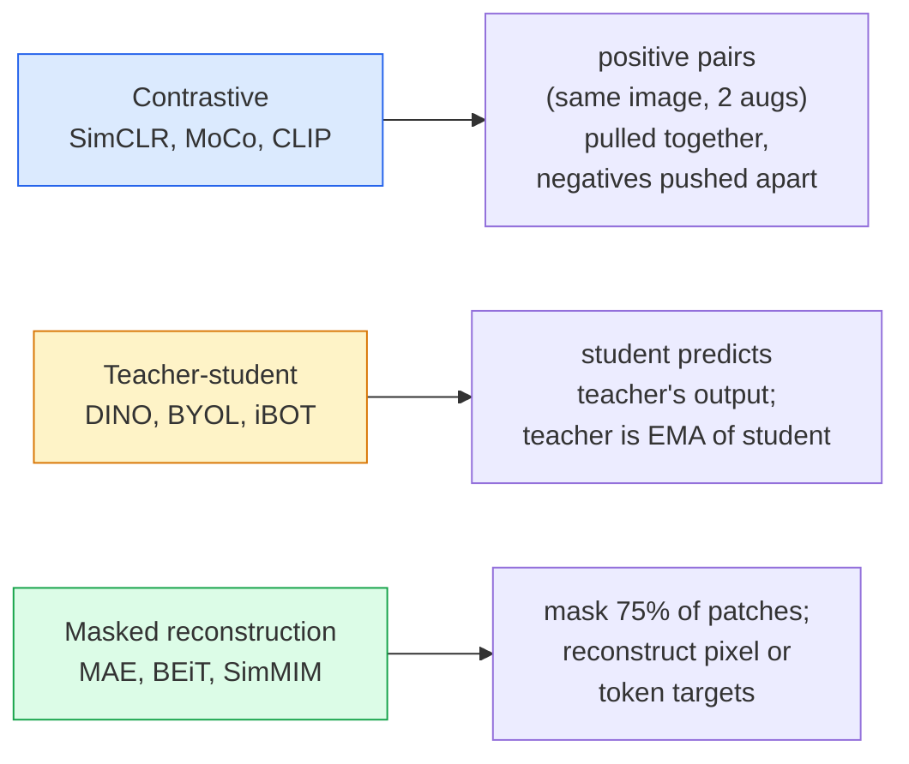

# 자기 지도 비전 — SimCLR, DINO, MAE (Self-Supervised Vision)

> 레이블(label)은 지도 비전(supervised vision)의 병목이다. 자기 지도 사전 학습(self-supervised pretraining)은 그 병목을 없앤다. 레이블 없는 1억 장의 이미지에서 시각적 특성을 학습한 뒤, 레이블된 1만 장에 파인튜닝(fine-tune)한다.

**Type:** Learn + Build
**Languages:** Python
**Prerequisites:** Phase 4 Lesson 04 (Image Classification), Phase 4 Lesson 14 (ViT)
**Time:** ~75분

## 학습 목표 (Learning Objectives)

- 세 가지 주요 자기 지도 계열 — 대조(contrastive)(SimCLR), 교사-학생(teacher-student)(DINO), 마스킹된 복원(masked reconstruction)(MAE) — 을 추적하고, 각각이 무엇을 최적화하는지 진술하기
- InfoNCE 손실(loss)을 밑바닥부터 구현하고, 왜 512짜리 배치(batch)는 작동하고 32짜리 배치는 실패하는지 설명하기
- 왜 MAE의 75% 마스킹 비율(masking ratio)이 임의적이지 않은지, 그리고 그것이 텍스트에 대한 BERT의 15%와 어떻게 다른지 설명하기
- 선형 프로빙(linear probing)과 제로샷(zero-shot) 검색을 위해 DINOv2나 MAE의 ImageNet 체크포인트(checkpoint)를 사용하기

## 문제 (The Problem)

지도 ImageNet은 130만 장의 레이블된 이미지를 가지며, 주석을 다는 데 약 1,000만 달러가 든 것으로 추정된다. 의료 및 산업 데이터셋(dataset)은 더 작고 레이블링(label)이 훨씬 더 비싸다. 그래서 모든 비전 팀이 묻는다. 값싼 레이블 없는 데이터 — YouTube 프레임, 웹 크롤, 웹캠 영상, 위성 스윕 — 에 사전 학습한 뒤 작은 레이블된 집합에 파인튜닝할 수 있는가?

자기 지도 학습(self-supervised learning)이 그 답이다. LAION이나 JFT에 학습된 현대의 자기 지도 ViT는 파인튜닝되었을 때 지도 ImageNet 정확도에 도달하거나 능가한다. 또한 하류 작업(검출, 분할, 깊이)에 지도 사전 학습보다 더 잘 전이된다. DINOv2(Meta, 2023)와 MAE(Meta, 2022)는 전이 가능한 비전 특성을 다룰 때 현재의 프로덕션(production) 기본값이다.

개념적 전환은 이렇다. 프리텍스트 작업(pretext task) — 모델이 학습하도록 시키는 것 — 이 꼭 하류 작업일 필요는 없다. 중요한 것은 그 작업이 모델에게 유용한 특성을 학습하도록 강제한다는 점이다. 흑백 이미지의 색을 예측하기, 이미지를 회전시키고 모델에게 회전을 분류하라고 하기, 패치(patch)를 마스킹하고 복원하기 — 모두 효과가 있었다. 규모로 확장되는 세 접근법은 대조 학습(contrastive learning), 교사-학생 증류(distillation), 마스킹된 복원이다.

## 개념 (The Concept)

### 세 가지 계열



### 대조 학습 (Contrastive learning, SimCLR)

한 이미지를 가져와 두 개의 무작위 증강(augmentation)을 적용하면 두 개의 뷰가 나온다. 둘 다 같은 인코더(encoder)와 투영 헤드(projection head)를 통과시킨다. "이 두 임베딩(embedding)은 가까워야 한다"와 "이 임베딩은 배치 안의 다른 모든 이미지의 임베딩에서 멀어야 한다"고 말하는 손실을 최소화한다.

```
Loss for positive pair (z_i, z_j) among 2N views per batch:

   L_ij = -log( exp(sim(z_i, z_j) / tau) / sum_k in batch \ {i} exp(sim(z_i, z_k) / tau) )

sim = cosine similarity
tau = temperature (0.1 standard)
```

이것이 InfoNCE 손실이다. 양성(positive)당 많은 음성(negative)이 필요하므로 배치 크기가 중요하다 — SimCLR은 512~8192가 필요하다. MoCo는 음성 개수를 배치 크기와 분리하려고 과거 배치들의 모멘텀 큐(momentum queue)를 도입했다.

### 교사-학생 (Teacher-student, DINO)

같은 아키텍처를 가진 두 신경망(neural network), 곧 학생(student)과 교사(teacher)가 있다. 교사는 학생 가중치(weight)의 지수 이동 평균(exponential moving average, EMA)이다. 둘 다 이미지의 증강된 뷰를 본다. 학생의 출력은 교사의 출력과 일치하도록 학습된다. 명시적 음성은 없다.

```
loss = CE( student_output(view_1),  teacher_output(view_2) )
     + CE( student_output(view_2),  teacher_output(view_1) )

teacher_weights = m * teacher_weights + (1 - m) * student_weights   (m ≈ 0.996)
```

왜 "상수를 예측한다"로 붕괴하지 않는가. 교사의 출력은 중심화되고(per-dimension 평균을 뺌) 날카롭게 된다(작은 온도(temperature)로 나눔). 중심화(centering)는 한 차원이 지배하는 것을 막고, 날카롭게 하기(sharpening)는 출력이 균일(uniform)로 붕괴하는 것을 막는다.

DINO는 DINOv2가 1억 4,200만 장의 선별된 이미지에 대해 규모를 키운 것이다. 그 결과 특성은 제로샷 시각 검색과 밀집 예측(dense prediction)에서 현재의 SOTA다.

### 마스킹된 복원 (Masked reconstruction, MAE)

ViT 입력의 패치 75%를 마스킹한다. 보이는 25%만 인코더에 통과시킨다. 작은 디코더(decoder)가 인코더의 출력과 마스킹된 위치의 마스크 토큰(mask token)을 받아, 마스킹된 패치의 픽셀을 복원하도록 학습된다.

```
Encoder:  visible 25% of patches -> features
Decoder:  features + mask tokens at masked positions -> reconstructed pixels
Loss:     MSE between reconstructed and original pixels on masked patches only
```

MAE를 작동하게 하는 핵심 설계 선택:

- **75% 마스크 비율** — 높다. 인코더가 의미론적 특성을 학습하도록 강제한다. 25%를 복원하는 것은 거의 자명할 것이다(인접 픽셀이 너무 상관되어 있어 CNN이 정확히 맞힐 수 있다).
- **비대칭 인코더/디코더(Asymmetric encoder/decoder)** — 큰 ViT 인코더는 보이는 패치만 본다. 작은 디코더(8층, 512차원)가 복원을 처리한다. 순진한 BEiT보다 3배 빠른 사전 학습.
- **픽셀 공간 복원 타깃(Pixel-space reconstruction target)** — BEiT의 토큰화된 타깃보다 단순하고 ViT에서 더 잘 작동한다.

사전 학습 후에는 디코더를 버린다. 인코더가 특성 추출기다.

### 왜 15%가 아니라 75%인가

BERT는 토큰(token)의 15%를 마스킹한다. MAE는 75%를 마스킹한다. 차이는 정보 밀도다.

- 자연어는 토큰당 엔트로피가 높다. 토큰의 15%를 예측하는 것도 여전히 어렵다. 각 마스킹된 위치에 그럴듯한 완성이 여럿 있기 때문이다.
- 이미지 패치는 엔트로피가 낮다 — 마스킹되지 않은 이웃이 종종 마스킹된 패치의 픽셀을 거의 정확히 결정한다. 예측에 의미론적 이해가 필요하게 만들려면 공격적으로 마스킹해야 한다.

75%는 단순한 공간적 외삽(spatial extrapolation)으로 작업을 풀 수 없을 만큼 높다. 인코더는 이미지 콘텐츠를 표현해야 한다.

### 선형 프로브 평가 (Linear-probe evaluation)

자기 지도 사전 학습 후, 표준 평가는 **선형 프로브(linear probe)**다. 인코더를 동결하고, 그 위에 ImageNet 레이블로 단일 선형 분류기(classifier)를 학습시킨 뒤 top-1 정확도를 보고한다.

- SimCLR ResNet-50: 약 71% (2020)
- DINO ViT-S/16: 약 77% (2021)
- MAE ViT-L/16: 약 76% (2022)
- DINOv2 ViT-g/14: 약 86% (2023)

선형 프로브는 특성 품질의 순수한 측정치다. 파인튜닝은 보통 2~5점을 더하지만 헤드 재학습의 효과도 섞어 넣는다.

## 직접 만들기 (Build It)

### Step 1: 두 뷰 증강 파이프라인

```python
import torch
import torchvision.transforms as T

two_view_train = lambda: T.Compose([
    T.RandomResizedCrop(96, scale=(0.2, 1.0)),
    T.RandomHorizontalFlip(),
    T.ColorJitter(0.4, 0.4, 0.4, 0.1),
    T.RandomGrayscale(p=0.2),
    T.ToTensor(),
])


class TwoViewDataset(torch.utils.data.Dataset):
    def __init__(self, base):
        self.base = base
        self.aug = two_view_train()

    def __len__(self):
        return len(self.base)

    def __getitem__(self, i):
        img, _ = self.base[i]
        v1 = self.aug(img)
        v2 = self.aug(img)
        return v1, v2
```

각 __getitem__은 같은 이미지의 두 증강된 뷰를 반환한다. 레이블은 필요하지 않다.

### Step 2: InfoNCE 손실

```python
import torch.nn.functional as F

def info_nce(z1, z2, tau=0.1):
    """
    z1, z2: (N, D) L2-normalised embeddings of paired views
    """
    N, D = z1.shape
    z = torch.cat([z1, z2], dim=0)  # (2N, D)
    sim = z @ z.T / tau              # (2N, 2N)

    mask = torch.eye(2 * N, dtype=torch.bool, device=z.device)
    sim = sim.masked_fill(mask, float("-inf"))

    targets = torch.cat([torch.arange(N, 2 * N), torch.arange(0, N)]).to(z.device)
    return F.cross_entropy(sim, targets)
```

호출 전에 임베딩을 L2 정규화(normalise)하라. `tau=0.1`이 SimCLR 기본값이다. 더 낮으면 손실이 더 날카로워지고 더 많은 음성이 필요해진다.

### Step 3: InfoNCE 정상 동작 확인

```python
z1 = F.normalize(torch.randn(16, 32), dim=-1)
z2 = z1.clone()
loss_same = info_nce(z1, z2, tau=0.1).item()
z2_random = F.normalize(torch.randn(16, 32), dim=-1)
loss_random = info_nce(z1, z2_random, tau=0.1).item()
print(f"InfoNCE with identical pairs:  {loss_same:.3f}")
print(f"InfoNCE with random pairs:     {loss_random:.3f}")
```

동일한 쌍은 낮은 손실을 줘야 한다(큰 배치와 차가운 온도에서는 0에 가깝게). 무작위 쌍은 16쌍 배치에서 log(2N-1) = 약 log(31) = 약 3.4를 줘야 한다.

### Step 4: MAE 스타일 마스킹

```python
def random_mask_indices(num_patches, mask_ratio=0.75, seed=0):
    g = torch.Generator().manual_seed(seed)
    n_keep = int(num_patches * (1 - mask_ratio))
    perm = torch.randperm(num_patches, generator=g)
    visible = perm[:n_keep]
    masked = perm[n_keep:]
    return visible.sort().values, masked.sort().values


num_patches = 196
visible, masked = random_mask_indices(num_patches, mask_ratio=0.75)
print(f"visible: {len(visible)} / {num_patches}")
print(f"masked:  {len(masked)} / {num_patches}")
```

단순하고, 빠르고, 주어진 시드(seed)에 대해 결정론적이다. 실제 MAE 구현은 이를 배치 처리하고 샘플별 마스크를 유지한다.

## 라이브러리로 써보기 (Use It)

DINOv2가 2026년의 프로덕션 표준이다:

```python
import torch
from transformers import AutoImageProcessor, AutoModel

processor = AutoImageProcessor.from_pretrained("facebook/dinov2-base")
model = AutoModel.from_pretrained("facebook/dinov2-base")
model.eval()

# Per-image embeddings for zero-shot retrieval
with torch.no_grad():
    inputs = processor(images=[pil_image], return_tensors="pt")
    outputs = model(**inputs)
    embedding = outputs.last_hidden_state[:, 0]  # CLS token
```

그 결과 768차원 임베딩이 현대 이미지 검색, 밀집 대응(dense correspondence), 제로샷 전이 파이프라인의 백본(backbone)이다. 하류 작업 파인튜닝에는 선형 헤드 이상이 거의 필요하지 않다.

이미지-텍스트 임베딩에는 SigLIP이나 OpenCLIP이 동등물이다. MAE 스타일 파인튜닝에는 `timm` 레포가 모든 MAE 체크포인트를 제공한다.

## 산출물 (Ship It)

이 레슨이 만들어내는 것:

- `outputs/prompt-ssl-pretraining-picker.md` — 데이터셋 크기, 연산, 하류 작업이 주어졌을 때 SimCLR / MAE / DINOv2를 골라주는 프롬프트(prompt).
- `outputs/skill-linear-probe-runner.md` — 어떤 동결된 인코더 + 레이블된 데이터셋에 대해서든 선형 프로브 평가를 작성하는 스킬.

## 연습 문제 (Exercises)

1. **(Easy)** 잘 정렬된 임베딩에 대해서는 온도를 낮출 때 InfoNCE 손실이 떨어지고, 무작위 임베딩에 대해서는 온도를 낮출 때 손실이 오르는 것을 검증하라. `tau in [0.05, 0.1, 0.2, 0.5]` 대 손실의 플롯을 만들어라.
2. **(Medium)** DINO 스타일의 중심 버퍼(centre buffer)를 구현하라. 중심화 없이는 학생이 몇 에폭(epoch) 안에 상수 벡터로 붕괴함을 보여라.
3. **(Hard)** Lesson 10의 TinyUNet을 백본으로 사용해 CIFAR-100에 MAE를 학습시켜라. 10, 50, 200 에폭에서의 선형 프로브 정확도를 보고하라. 같은 1,000장 부분 집합에서 MAE로 사전 학습된 선형 프로브가 밑바닥부터의 지도 선형 프로브를 이기는 것을 보여라.

## 핵심 용어 (Key Terms)

| 용어 | 사람들이 말하는 것 | 실제 의미 |
|------|----------------|----------------------|
| 자기 지도(Self-supervised) | "레이블 없는" | 레이블 없는 데이터로부터 유용한 표현을 만들어내는 프리텍스트 작업 |
| 프리텍스트 작업(Pretext task) | "가짜 작업" | SSL 동안 사용되는 목적(패치 복원, 뷰 매칭). 사전 학습 후 버려진다 |
| 선형 프로브(Linear probe) | "동결된 인코더 + 선형 헤드" | 표준 SSL 평가: 동결된 특성 위에 선형 분류기만 학습한다 |
| InfoNCE | "대조 손실" | 코사인 유사도에 대한 소프트맥스. 양성 쌍이 타깃 클래스, 나머지 모두가 음성 |
| EMA 교사(EMA teacher) | "이동 평균 교사" | 가중치가 학생의 지수 이동 평균인 교사. BYOL, MoCo, DINO가 사용한다 |
| 마스크 비율(Mask ratio) | "숨긴 패치의 %" | MAE 동안 마스킹된 패치의 비율. 비전에는 75%, 텍스트에는 15% |
| 표현 붕괴(Representation collapse) | "상수 출력" | 인코더가 모든 입력에 대해 상수 벡터를 출력하는 SSL 실패. 중심화, 날카롭게 하기, 음성으로 방지된다 |
| DINOv2 | "프로덕션 SSL 백본" | Meta의 2023년 자기 지도 ViT. 2026년 가장 강력한 범용 이미지 특성 |

## 더 읽을거리 (Further Reading)

- [SimCLR (Chen et al., 2020)](https://arxiv.org/abs/2002.05709) — 대조 학습 레퍼런스
- [DINO (Caron et al., 2021)](https://arxiv.org/abs/2104.14294) — 모멘텀, 중심화, 날카롭게 하기를 쓴 교사-학생
- [MAE (He et al., 2022)](https://arxiv.org/abs/2111.06377) — ViT를 위한 마스크드 오토인코더(masked autoencoder) 사전 학습
- [DINOv2 (Oquab et al., 2023)](https://arxiv.org/abs/2304.07193) — 자기 지도 ViT를 프로덕션 특성으로 규모를 키우기
