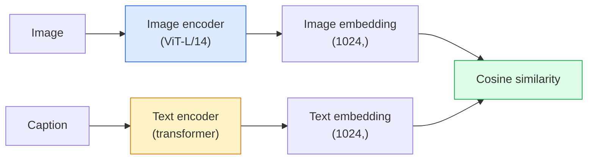

# 오픈 보캐뷸러리 비전 — CLIP (Open-Vocabulary Vision)

> 이미지 인코더와 텍스트 인코더를 함께 학습시켜 일치하는 (이미지, 캡션) 쌍이 공유 공간에서 같은 지점에 모이게 하라. 비결은 이것뿐이다.

**Type:** Build + Use
**Languages:** Python
**Prerequisites:** Phase 4 Lesson 14 (ViT), Phase 4 Lesson 17 (Self-Supervised)
**Time:** ~45분

## 학습 목표 (Learning Objectives)

- CLIP의 두 타워(two-tower) 아키텍처와 대조(contrastive) 학습 목적을 설명하기
- 어떤 작업별 학습 없이 제로샷(zero-shot) 분류를 위해 사전 학습된 CLIP(또는 SigLIP) 사용하기
- 제로샷 분류를 밑바닥부터 구현하기: 클래스 프롬프트(prompt)를 인코딩하고, 코사인 유사도(cosine similarity)를 계산하고, argmax를 취하기
- CLIP, SigLIP, OpenCLIP, LLaVA/LLaMA-vision 모델을 구별하기 — 2026년에 각각이 무엇을 위한 것인지

## 문제 (The Problem)

전통적인 분류기(classifier)는 닫힌 보캐뷸러리(closed-vocabulary)다. 1000클래스 ImageNet 모델은 1000개의 레이블(label)만 예측한다. 새 범주를 추가하려면 그때마다 레이블된 데이터와 새로 학습한 헤드가 필요하다.

CLIP(Radford et al., OpenAI 2021)은 웹에서 긁어모은 4억 개의 (이미지, 캡션) 쌍으로 학습하면 추론(inference) 시점에 자연어로만 기술한 임의의 범주 집합으로 분류하는 모델이 나온다는 것을 보여줬다. 문장 하나로 새 클래스를 정의하는 셈이다.

바로 이 능력, 즉 제로샷 전이(zero-shot transfer) 때문에 오늘날의 모든 비전 시스템이 CLIP 계열 체크포인트(checkpoint)에서 출발한다. 검출(Grounding DINO, OWL-ViT), 분할(CLIPSeg, SAM), 검색, 콘텐츠 모더레이션, VLM, 텍스트-투-이미지(text-to-image) 생성 모두 CLIP 스타일의 결합 임베딩(joint embedding) 위에 세워진다.

## 개념 (The Concept)

### 두 타워



두 인코더 모두 같은 임베딩 차원으로 가는 선형 투영(linear projection)으로 끝난다(CLIP-B/32는 512, CLIP-L/14는 1024). L2로 정규화(normalise)한 뒤 코사인 유사도를 계산한다.

### 목적

N개의 (이미지, 캡션) 쌍으로 된 배치(batch)가 주어지면 NxN 유사도 행렬(matrix)을 만든다. 대각선(일치하는 쌍)은 유사도가 높고 비대각선(일치하지 않는 쌍)은 유사도가 낮도록 두 인코더를 학습시킨다.

```
sim_matrix = image_embeddings @ text_embeddings.T / tau

loss_i2t = cross_entropy(sim_matrix,       targets=arange(N))
loss_t2i = cross_entropy(sim_matrix.T,     targets=arange(N))
loss = (loss_i2t + loss_t2i) / 2
```

이미지-투-텍스트와 텍스트-투-이미지 검색이 모두 작동해야 하므로 대칭적(symmetric)이다. `tau`(온도(temperature))는 보통 스칼라 파라미터(parameter)로 학습하며 0.07로 초기화한다.

### SigLIP: 더 나은 손실

SigLIP(Zhai et al., 2023)은 소프트맥스(softmax)를 쌍별 시그모이드(per-pair sigmoid)로 대체했다:

```
loss = mean over pairs of log(1 + exp(-y_ij * sim_ij))
y_ij = +1 if matching, -1 otherwise
```

쌍별 손실은 CLIP에 필요한 배치 수준 정규화(batch-level normalisation)를 없앤다. SigLIP은 작은 배치 크기에서 더 잘 학습되고 같은 양의 데이터에서 CLIP과 맞먹거나 능가한다.

### 제로샷 분류

학습된 CLIP이 주어지면:

1. 각 클래스에 대해 프롬프트를 구성한다: "a photo of a {class}".
2. 모든 클래스 프롬프트를 텍스트 인코더로 인코딩한다 -> 형태 (C, d)의 `T`.
3. 테스트 이미지를 인코딩한다 -> 형태 (1, d)의 `I`.
4. 유사도 = `I @ T.T` 형태 (1, C).
5. Argmax -> 예측된 클래스.

프롬프트 엔지니어링이 중요하다. OpenAI는 ImageNet용으로 80개의 프롬프트 템플릿("a photo of a {}", "a blurry photo of a {}", "a sketch of a {}", ...)을 공개했다. 클래스마다 모든 템플릿의 임베딩을 평균하면 top-1 정확도가 1~3% 더 오른다.

### 2026년에 CLIP 스타일 모델이 쓰이는 곳

- **제로샷 분류** — 직접 사용.
- **이미지 검색** — 모든 이미지를 한 번 인코딩하고, 추론 시점에 쿼리를 임베딩한다.
- **텍스트 조건 검출** — Grounding DINO, OWL-ViT가 검출기 주위에 CLIP 텍스트 타워를 감싼다.
- **텍스트 조건 분할** — CLIPSeg. SAM은 CLIP을 통해 텍스트 프롬프트 입력을 사용한다.
- **VLM** — LLaVA, Qwen-VL, InternVL이 CLIP 계열 비전 인코더를 LLM에 연결한다.
- **텍스트-투-이미지 생성** — Stable Diffusion, DALL-E 3이 CLIP 텍스트 임베딩에 조건화한다.

공유 임베딩 공간이 갖춰지면 모든 비전+언어 작업이 거리 계산으로 귀결된다.

## 직접 만들기 (Build It)

### Step 1: 작은 두 타워 모델

실제 CLIP은 ViT + 트랜스포머(transformer)다. 이 레슨에서는 학습 신호가 CPU에서도 보이도록 타워를 미리 추출한 특성에 얹은 작은 MLP로 둔다.

```python
import torch
import torch.nn as nn
import torch.nn.functional as F


class TwoTower(nn.Module):
    def __init__(self, img_in=128, txt_in=64, emb=64):
        super().__init__()
        self.image_proj = nn.Sequential(nn.Linear(img_in, 128), nn.ReLU(), nn.Linear(128, emb))
        self.text_proj = nn.Sequential(nn.Linear(txt_in, 128), nn.ReLU(), nn.Linear(128, emb))
        self.logit_scale = nn.Parameter(torch.ones([]) * 2.6592)  # ln(1/0.07)

    def forward(self, img_feats, txt_feats):
        i = F.normalize(self.image_proj(img_feats), dim=-1)
        t = F.normalize(self.text_proj(txt_feats), dim=-1)
        return i, t, self.logit_scale.exp()
```

두 투영, 공유 차원 출력, 학습된 온도. 실제 CLIP API와 같은 형태다.

### Step 2: 대조 손실

```python
def clip_loss(image_emb, text_emb, logit_scale):
    N = image_emb.size(0)
    sim = logit_scale * image_emb @ text_emb.T
    targets = torch.arange(N, device=sim.device)
    l_i = F.cross_entropy(sim, targets)
    l_t = F.cross_entropy(sim.T, targets)
    return (l_i + l_t) / 2
```

대칭적이다. logit_scale이 높을수록 소프트맥스가 더 날카로워져 확신은 커지지만 불안정해질 위험도 커진다.

### Step 3: 제로샷 분류기

```python
@torch.no_grad()
def zero_shot_classify(model, image_feats, class_text_feats, class_names):
    """
    image_feats:      (N, img_in)
    class_text_feats: (C, txt_in)   one averaged embedding per class
    """
    i = F.normalize(model.image_proj(image_feats), dim=-1)
    t = F.normalize(model.text_proj(class_text_feats), dim=-1)
    sim = i @ t.T
    pred = sim.argmax(dim=-1)
    return [class_names[p] for p in pred.tolist()]
```

단계마다 한 줄이다. 프로덕션(production) CLIP 체크포인트로 제로샷을 돌릴 때 쓰는 절차가 정확히 이것이다.

### Step 4: 정상 동작 확인

```python
torch.manual_seed(0)
model = TwoTower()

img = torch.randn(8, 128)
txt = torch.randn(8, 64)
i, t, scale = model(img, txt)
loss = clip_loss(i, t, scale)
print(f"batch size: {i.size(0)}   loss: {loss.item():.3f}")
```

무작위로 초기화한 모델이라면 손실은 `log(N) = log(8) = 2.08`에 가까워야 한다. 아직 아무 구조도 학습하지 못했을 때의 대칭 교차 엔트로피(cross-entropy) 타깃이다.

## 라이브러리로 써보기 (Use It)

OpenCLIP이 2026년의 커뮤니티 기본값이다:

```python
import open_clip
import torch
from PIL import Image

model, _, preprocess = open_clip.create_model_and_transforms("ViT-B-32", pretrained="laion2b_s34b_b79k")
tokenizer = open_clip.get_tokenizer("ViT-B-32")

image = preprocess(Image.open("dog.jpg")).unsqueeze(0)
text = tokenizer(["a photo of a dog", "a photo of a cat", "a photo of a car"])

with torch.no_grad():
    image_features = model.encode_image(image)
    text_features = model.encode_text(text)
    image_features = image_features / image_features.norm(dim=-1, keepdim=True)
    text_features = text_features / text_features.norm(dim=-1, keepdim=True)
    probs = (100.0 * image_features @ text_features.T).softmax(dim=-1)

print(probs)
```

SigLIP은 더 새롭고 작은 규모에서 더 잘 학습되어 새 작업에서 선호된다(`google/siglip-base-patch16-224`). Hugging Face에서 둘 다 받을 수 있다.

## 산출물 (Ship It)

이 레슨이 만들어내는 것:

- `outputs/prompt-zero-shot-class-picker.md` — 클래스 목록과 도메인이 주어졌을 때 제로샷 CLIP을 위한 클래스 템플릿을 설계하는 프롬프트.
- `outputs/skill-image-text-retriever.md` — 어떤 CLIP 체크포인트로든 이미지 임베딩 인덱스를 구축하고, 텍스트로 쿼리하기와 이미지로 쿼리하기를 지원하는 스킬.

## 연습 문제 (Exercises)

1. **(Easy)** 사전 학습된 OpenCLIP ViT-B/32를 사용해 80-템플릿 프롬프트 집합으로 CIFAR-10에 제로샷 분류를 하라. top-1 정확도를 보고하라. 약 85~90%여야 한다.
2. **(Medium)** 같은 CIFAR-10 작업에서 단일 템플릿("a photo of a {}") 대 80-템플릿 평균 임베딩을 비교하라. 격차를 정량화하고 왜 템플릿이 도움이 되는지 설명하라.
3. **(Hard)** 제로샷 이미지 검색 인덱스를 구축하라: CLIP으로 1,000장의 이미지를 임베딩하고, FAISS 인덱스를 만들고, 자연어 기술로 쿼리하라. 손으로 작성한 20개의 홀드아웃(held-out) 쿼리에 대한 검색 recall@5를 보고하라.

## 핵심 용어 (Key Terms)

| 용어 | 사람들이 말하는 것 | 실제 의미 |
|------|----------------|----------------------|
| 두 타워(Two-tower) | "이중 인코더" | 공유 차원 투영 헤드로 끝나는 분리된 이미지 및 텍스트 인코더 |
| 제로샷(Zero-shot) | "작업별 학습 없음" | 추론 시점에 텍스트로만 기술된 클래스로 분류한다. 레이블은 건드리지 않는다 |
| 온도 / logit_scale(Temperature / logit_scale) | "tau" | 소프트맥스 이전에 유사도 행렬을 스케일링하는 학습된 스칼라 |
| 프롬프트 템플릿(Prompt template) | "A photo of a {}" | 클래스 이름 주위의 자연어 래퍼. 여러 템플릿을 평균하면 제로샷 정확도가 올라간다 |
| CLIP | "이미지+텍스트 모델" | 2021년 OpenAI 모델. 2026년 이 분야의 어휘 |
| SigLIP | "시그모이드 CLIP" | 소프트맥스를 쌍별 시그모이드로 교체한다. 작은 배치에서 더 잘 학습된다 |
| OpenCLIP | "오픈 재현" | LAION에 커뮤니티가 학습시킨 CLIP 변형. 오픈소스 파이프라인의 프로덕션 기본값 |
| VLM | "비전-언어 모델" | CLIP 계열 인코더 + LLM. 이미지에 관한 질문에 답하도록 학습됨 |

## 더 읽을거리 (Further Reading)

- [CLIP: Learning Transferable Visual Models from Natural Language Supervision (Radford et al., 2021)](https://arxiv.org/abs/2103.00020)
- [SigLIP: Sigmoid Loss for Language-Image Pre-Training (Zhai et al., 2023)](https://arxiv.org/abs/2303.15343)
- [OpenCLIP](https://github.com/mlfoundations/open_clip) — 커뮤니티 코드베이스
- [DINOv2 vs CLIP vs MAE: a features comparison](https://huggingface.co/blog/dinov2) — 나란히 놓은 사용 사례가 있는 HF 가이드
