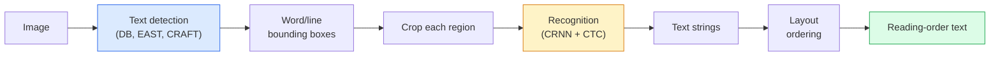

# OCR와 문서 이해 (OCR & Document Understanding)

> OCR은 세 단계 파이프라인이다 — 텍스트 박스를 검출하고, 문자를 인식하고, 그다음 레이아웃을 잡는다. 모든 현대 OCR 시스템은 이 단계들을 재배열하거나 병합한다.

**Type:** Learn + Use
**Languages:** Python
**Prerequisites:** Phase 4 Lesson 06 (Detection), Phase 7 Lesson 02 (Self-Attention)
**Time:** ~45분

## 학습 목표 (Learning Objectives)

- 고전적 OCR 파이프라인(검출 -> 인식 -> 레이아웃)과 현대의 종단 간(end-to-end) 대안(Donut, Qwen-VL-OCR)을 추적하기
- 시퀀스-투-시퀀스(sequence-to-sequence) OCR 학습을 위한 CTC(Connectionist Temporal Classification) 손실(loss) 구현하기
- 학습 없이 프로덕션(production) 문서 파싱(parsing)을 위해 PaddleOCR이나 EasyOCR 사용하기
- OCR, 레이아웃 파싱(layout parsing), 문서 이해(document understanding)를 구별하고 — 작업별로 올바른 도구를 고르기

## 문제 (The Problem)

텍스트로 가득 찬 이미지는 어디에나 있다: 영수증, 송장, 신분증, 스캔된 책, 양식, 화이트보드, 표지판, 스크린샷. 그것들로부터 구조화된 데이터를 추출하는 것 — 단지 문자뿐 아니라 "이것이 총액이다" — 은 가장 가치 높은 응용 비전 문제 중 하나다.

이 분야는 세 가지 기술 계층으로 나뉜다:

1. **OCR 본연(OCR proper)**: 픽셀을 텍스트로 바꾼다.
2. **레이아웃 파싱(Layout parsing)**: OCR 출력을 영역(제목, 본문, 표, 머리글)으로 묶는다.
3. **문서 이해(Document understanding)**: 레이아웃에서 구조화된 필드("invoice_total = $42.50")를 추출한다.

각 계층은 고전적 접근과 현대적 접근을 가지며, "이미지에서 텍스트를 원한다"와 "이 영수증에서 총액이 필요하다" 사이의 격차는 대부분의 팀이 깨닫는 것보다 크다.

## 개념 (The Concept)

### 고전적 파이프라인



- **텍스트 검출(Text detection)**은 줄별 또는 단어별 사각형(quadrilateral)을 만든다.
- **인식(Recognition)**은 각 영역을 고정된 높이로 크롭(crop)하고, CNN + BiLSTM + CTC를 돌려 문자 시퀀스를 만든다.
- **레이아웃(Layout)**은 읽기 순서를 재구성한다(라틴 문자는 위에서 아래로, 왼쪽에서 오른쪽으로. 아랍어, 일본어는 다르다).

### 한 문단으로 보는 CTC

OCR 인식은 고정 길이 특성 맵에서 가변 길이 시퀀스를 만든다. CTC(Graves et al., 2006)는 문자 수준 정렬(alignment) 없이 이를 학습하게 해준다. 모델은 매 시간 스텝마다 (어휘 + 공백(blank))에 대한 분포를 출력한다. CTC 손실은 반복을 병합하고 공백을 제거한 후 타깃 텍스트로 환원되는 모든 정렬에 대해 주변화(marginalise)한다.

```
raw output: "h h h _ _ e e l l _ l l o _ _"
after merge repeats and remove blanks: "hello"
```

CTC는 2015년에 CRNN이 작동한 이유이며, 2026년에도 여전히 대부분의 프로덕션 OCR 모델을 학습시킨다.

### 현대의 종단 간 모델

- **Donut**(Kim et al., 2022) — ViT 인코더(encoder) + 텍스트 디코더(decoder). 이미지를 읽고 JSON을 직접 내보낸다. 텍스트 검출기도, 레이아웃 모듈도 없다.
- **TrOCR** — 줄 수준 OCR을 위한 ViT + 트랜스포머(transformer) 디코더.
- **Qwen-VL-OCR / InternVL** — OCR 작업에 파인튜닝(fine-tune)된 완전한 비전-언어 모델. 2026년 복잡한 문서에서 최고의 정확도.
- **PaddleOCR** — 성숙한 프로덕션 패키지의 고전적 DB + CRNN 파이프라인. 여전히 오픈소스의 일꾼.

종단 간 모델은 더 많은 데이터와 연산이 필요하지만 다단계 파이프라인의 오차 누적(error accumulation)을 건너뛴다.

### 레이아웃 파싱

구조화된 문서에는, 각 영역에 레이블을 붙이는 레이아웃 검출기(LayoutLMv3, DocLayNet)를 실행한다: Title, Paragraph, Figure, Table, Footnote. 읽기 순서는 그러면 "레이아웃 순서로 영역을 순회하며 이어 붙인다"가 된다.

양식에는, **키-값 추출(Key-Value extraction)** 모델(시각적으로 풍부한 문서에는 Donut, 일반 스캔에는 LayoutLMv3)을 쓴다. 그것들은 이미지 + 검출된 텍스트 + 위치를 받아 구조화된 키-값 쌍을 예측한다.

### 평가 지표

- **문자 오류율(Character Error Rate, CER)** — 레벤슈타인 거리(Levenshtein distance) / 참조의 길이. 낮을수록 좋다. 프로덕션 목표: 깨끗한 스캔에서 < 2%.
- **단어 오류율(Word Error Rate, WER)** — 단어 수준에서 동일.
- **구조화된 필드의 F1** — 키-값 작업용. `{invoice_total: 42.50}`이 올바르게 나타나는지 측정한다.
- **JSON에 대한 편집 거리(Edit distance on JSON)** — 종단 간 문서 파싱용. Donut 논문이 정규화된 트리 편집 거리(normalised tree edit distance)를 도입했다.

## 직접 만들기 (Build It)

### Step 1: CTC 손실 + 그리디 디코더

```python
import torch
import torch.nn as nn
import torch.nn.functional as F


def ctc_loss(log_probs, targets, input_lengths, target_lengths, blank=0):
    """
    log_probs:      (T, N, C) log-softmax over vocab including blank at index 0
    targets:        (N, S) int targets (no blanks)
    input_lengths:  (N,) per-sample time steps used
    target_lengths: (N,) per-sample target length
    """
    return F.ctc_loss(log_probs, targets, input_lengths, target_lengths,
                      blank=blank, reduction="mean", zero_infinity=True)


def greedy_ctc_decode(log_probs, blank=0):
    """
    log_probs: (T, N, C) log-softmax
    returns: list of index sequences (blanks removed, repeats merged)
    """
    preds = log_probs.argmax(dim=-1).transpose(0, 1).cpu().tolist()
    out = []
    for seq in preds:
        decoded = []
        prev = None
        for idx in seq:
            if idx != prev and idx != blank:
                decoded.append(idx)
            prev = idx
        out.append(decoded)
    return out
```

`F.ctc_loss`는 가능할 때 효율적인 CuDNN 구현을 쓴다. 그리디 디코더(greedy decoder)는 빔 서치(beam search)보다 단순하고 보통 그것과 CER 1% 이내다.

### Step 2: 작은 CRNN 인식기

줄 OCR을 위한 최소한의 CNN + BiLSTM.

```python
class TinyCRNN(nn.Module):
    def __init__(self, vocab_size=40, hidden=128, feat=32):
        super().__init__()
        self.cnn = nn.Sequential(
            nn.Conv2d(1, feat, 3, 1, 1), nn.BatchNorm2d(feat), nn.ReLU(inplace=True),
            nn.MaxPool2d(2),
            nn.Conv2d(feat, feat * 2, 3, 1, 1), nn.BatchNorm2d(feat * 2), nn.ReLU(inplace=True),
            nn.MaxPool2d(2),
            nn.Conv2d(feat * 2, feat * 4, 3, 1, 1), nn.BatchNorm2d(feat * 4), nn.ReLU(inplace=True),
            nn.MaxPool2d((2, 1)),
            nn.Conv2d(feat * 4, feat * 4, 3, 1, 1), nn.BatchNorm2d(feat * 4), nn.ReLU(inplace=True),
            nn.MaxPool2d((2, 1)),
        )
        self.rnn = nn.LSTM(feat * 4, hidden, bidirectional=True, batch_first=True)
        self.head = nn.Linear(hidden * 2, vocab_size)

    def forward(self, x):
        # x: (N, 1, H, W)
        f = self.cnn(x)                # (N, C, H', W')
        f = f.mean(dim=2).transpose(1, 2)  # (N, W', C)
        h, _ = self.rnn(f)
        return F.log_softmax(self.head(h).transpose(0, 1), dim=-1)  # (W', N, vocab)
```

고정 높이 입력(CNN이 높이를 1로 max-pool한다). 너비가 CTC의 시간 차원이다.

### Step 3: 합성 OCR

종단 간 정상 동작 확인을 위해 흰 바탕 검정 숫자 문자열을 생성한다.

```python
import numpy as np

def synthetic_line(text, height=32, char_width=16):
    W = char_width * len(text)
    img = np.ones((height, W), dtype=np.float32)
    for i, c in enumerate(text):
        x = i * char_width
        shade = 0.0 if c.isalnum() else 0.5
        img[6:height - 6, x + 2:x + char_width - 2] = shade
    return img


def build_batch(strings, vocab):
    H = 32
    W = 16 * max(len(s) for s in strings)
    imgs = np.ones((len(strings), 1, H, W), dtype=np.float32)
    target_lengths = []
    targets = []
    for i, s in enumerate(strings):
        imgs[i, 0, :, :16 * len(s)] = synthetic_line(s)
        ids = [vocab.index(c) for c in s]
        targets.extend(ids)
        target_lengths.append(len(ids))
    return torch.from_numpy(imgs), torch.tensor(targets), torch.tensor(target_lengths)


vocab = ["_"] + list("0123456789abcdefghijklmnopqrstuvwxyz")
imgs, targets, lengths = build_batch(["hello", "world"], vocab)
print(f"images: {imgs.shape}   targets: {targets.shape}   lengths: {lengths.tolist()}")
```

실제 OCR 데이터셋(dataset)은 폰트, 노이즈, 회전, 블러, 색을 더한다. 위 파이프라인은 동일하다.

### Step 4: 학습 스케치

```python
model = TinyCRNN(vocab_size=len(vocab))
opt = torch.optim.Adam(model.parameters(), lr=1e-3)

for step in range(200):
    strings = ["abc" + str(step % 10)] * 4 + ["xyz" + str((step + 1) % 10)] * 4
    imgs, targets, target_lens = build_batch(strings, vocab)
    log_probs = model(imgs)  # (W', 8, vocab)
    input_lens = torch.full((8,), log_probs.size(0), dtype=torch.long)
    loss = ctc_loss(log_probs, targets, input_lens, target_lens, blank=0)
    opt.zero_grad(); loss.backward(); opt.step()
```

이 사소한 합성 데이터에서는 200스텝에 걸쳐 손실이 약 3에서 약 0.2로 떨어져야 한다.

## 라이브러리로 써보기 (Use It)

세 가지 프로덕션 경로:

- **PaddleOCR** — 성숙하고, 빠르고, 다국어. 한 줄 사용: `paddleocr.PaddleOCR(lang="en").ocr(image_path)`.
- **EasyOCR** — Python 네이티브, 다국어, PyTorch 백본(backbone).
- **Tesseract** — 고전적. 모델이 어려워할 때 오래된 스캔 문서에 여전히 유용하다.

종단 간 문서 파싱에는, Donut이나 VLM을 쓴다:

```python
from transformers import DonutProcessor, VisionEncoderDecoderModel

processor = DonutProcessor.from_pretrained("naver-clova-ix/donut-base-finetuned-cord-v2")
model = VisionEncoderDecoderModel.from_pretrained("naver-clova-ix/donut-base-finetuned-cord-v2")
```

반복 가능한 구조를 가진 영수증, 송장, 양식에는 Donut을 파인튜닝하라. 임의의 문서나 추론(reasoning)이 필요한 OCR에는 Qwen-VL-OCR 같은 VLM이 현재의 기본값이다.

## 산출물 (Ship It)

이 레슨이 만들어내는 것:

- `outputs/prompt-ocr-stack-picker.md` — 문서 유형, 언어, 구조가 주어졌을 때 Tesseract / PaddleOCR / Donut / VLM-OCR을 골라주는 프롬프트(prompt).
- `outputs/skill-ctc-decoder.md` — 길이 정규화(length normalisation)를 포함해 밑바닥부터 그리디 및 빔 서치 CTC 디코더를 작성하는 스킬.

## 연습 문제 (Exercises)

1. **(Easy)** 5자리 무작위 숫자 문자열에 대해 TinyCRNN을 500스텝 학습시켜라. 홀드아웃(held-out) 집합에서의 CER을 보고하라.
2. **(Medium)** 그리디 디코딩을 빔 서치(beam_width=5)로 교체하라. CER 차이를 보고하라. 어떤 입력에서 빔 서치가 이기는가?
3. **(Hard)** 20장의 영수증에 PaddleOCR을 사용해 품목을 추출하고, {item_name, price} 쌍에 대해 손으로 레이블링(label)한 정답(ground truth) 대비 F1을 계산하라.

## 핵심 용어 (Key Terms)

| 용어 | 사람들이 말하는 것 | 실제 의미 |
|------|----------------|----------------------|
| OCR | "픽셀에서 텍스트로" | 이미지 영역을 문자 시퀀스로 바꾸는 것 |
| CTC | "정렬 없는 손실" | 시간 스텝별 레이블 없이 시퀀스 모델을 학습하는 손실. 정렬에 대해 주변화한다 |
| CRNN | "고전적 OCR 모델" | 합성곱(conv) 특성 추출기 + BiLSTM + CTC. 여전히 프로덕션에서 쓰이는 2015년 베이스라인 |
| Donut | "종단 간 OCR" | ViT 인코더 + 텍스트 디코더. 이미지에서 직접 JSON을 내보낸다 |
| 레이아웃 파싱(Layout parsing) | "영역 찾기" | 문서에서 Title/Table/Figure/Paragraph 영역을 검출하고 레이블을 붙인다 |
| 읽기 순서(Reading order) | "텍스트 시퀀스" | 인식된 영역을 문장으로 정렬하기. 라틴 문자는 자명하고, 혼합 레이아웃은 자명하지 않다 |
| CER / WER | "오류율" | 문자 또는 단어 단위로 레벤슈타인 거리 / 참조 길이 |
| VLM-OCR | "읽는 LLM" | OCR 작업을 위해 학습되거나 프롬프트된 비전-언어 모델. 복잡한 문서에서 현재의 SOTA |

## 더 읽을거리 (Further Reading)

- [CRNN (Shi et al., 2015)](https://arxiv.org/abs/1507.05717) — 원조 CNN+RNN+CTC 아키텍처
- [CTC (Graves et al., 2006)](https://www.cs.toronto.edu/~graves/icml_2006.pdf) — 원조 CTC 논문. 알고리즘적 아이디어가 빽빽하게 들어차 있다
- [Donut (Kim et al., 2022)](https://arxiv.org/abs/2111.15664) — OCR 없는 문서 이해 트랜스포머
- [PaddleOCR](https://github.com/PaddlePaddle/PaddleOCR) — 오픈소스 프로덕션 OCR 스택
