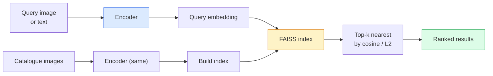

# 이미지 검색과 메트릭 학습 (Image Retrieval & Metric Learning)

> 검색 시스템은 임베딩(embedding) 공간에서의 거리를 기준으로 후보를 순위 매긴다. 메트릭 학습(metric learning)은 그 거리가 원하는 의미를 갖도록 공간을 빚어내는 분야다.

**Type:** Build
**Languages:** Python
**Prerequisites:** Phase 4 Lesson 14 (ViT), Phase 4 Lesson 18 (CLIP)
**Time:** ~45분

## 학습 목표 (Learning Objectives)

- 트리플릿(triplet), 대조(contrastive), 프록시 기반(proxy-based) 메트릭 학습 손실(loss)을 설명하고 주어진 데이터셋(dataset)에 맞는 손실을 고르기
- L2 정규화(L2-normalisation)와 코사인 유사도(cosine similarity)를 올바르게 구현하고, "같은 항목" 검색과 "같은 클래스" 검색의 차이를 점검하기
- FAISS 인덱스를 만들고, 텍스트와 이미지로 질의하고, 보류된(held-out) 질의 집합에 대해 recall@K를 보고하기
- DINOv2, CLIP, SigLIP를 기성품(off-the-shelf) 임베딩 백본(backbone)으로 사용하고 각각이 언제 유리한지 알기

## 문제 (The Problem)

검색(retrieval)은 프로덕션(production) 비전(vision)의 어디에나 있다. 중복 탐지, 역방향 이미지 검색, 시각 검색("비슷한 상품 찾기"), 얼굴 재식별, 감시용 사람 재식별(person re-ID), 이커머스를 위한 인스턴스 수준(instance-level) 매칭. 제품 차원의 질문은 늘 같다. "이 질의 이미지가 주어졌을 때, 내 카탈로그를 순위 매겨라."

두 가지 설계 결정이 시스템 전체를 결정한다. 임베딩 — 어떤 모델(model)이 벡터(vector)를 만드는가. 인덱스 — 대규모에서 최근접 이웃(nearest neighbour)을 어떻게 찾는가. 2026년에는 둘 다 범용 부품이 되었고(임베딩에는 DINOv2, 인덱스에는 FAISS), 그래서 기준이 높아졌다. 어려운 부분은 애플리케이션에서 *무엇이 유사하다고 간주되는지*를 정의하고, 그 거리가 일치하도록 임베딩 공간을 빚어내는 것이다.

그 빚어내기가 바로 메트릭 학습이다. 작지만 레버리지가 큰 분야다.

## 개념 (The Concept)

### 검색 한눈에 보기



### 네 가지 손실 계열

| 손실 | 필요 조건 | 장점 | 단점 |
|------|----------|------|------|
| **대조(Contrastive)** | (앵커, 양성) + 음성들 | 단순하고, 어떤 쌍 레이블(pair label)로도 동작 | 음성이 많지 않으면 수렴(convergence)이 느림 |
| **트리플릿(Triplet)** | (앵커, 양성, 음성) | 직관적; 마진(margin)을 직접 제어 | 하드 트리플릿 마이닝(hard-triplet mining)이 비쌈 |
| **NT-Xent / InfoNCE** | 쌍 + 배치(batch) 내 마이닝한 음성들 | 큰 배치로 확장 가능 | 큰 배치 또는 모멘텀 큐(momentum queue)가 필요 |
| **프록시 기반(Proxy-based, ProxyNCA)** | 클래스 레이블만 | 빠르고, 안정적이며, 마이닝 불필요 | 작은 데이터셋에서는 프록시에 과적합(overfitting)할 수 있음 |

대부분의 프로덕션 사용 사례에서는 사전 학습된(pretrained) 백본으로 시작하고, 기성품 임베딩이 테스트 집합에서 성능이 떨어질 때만 메트릭 학습 파인튜닝(fine-tune)을 추가한다.

### 트리플릿 손실, 정식으로

```
L = max(0, ||f(a) - f(p)||^2 - ||f(a) - f(n)||^2 + margin)
```

앵커 `a`를 양성 `p`에 가깝게 당기고, 음성 `n`에서 멀어지게 밀어내며, 간격을 보장하는 `margin`을 둔다. 이 세 이미지 구조는 어떤 유사도 순서로도 일반화된다.

마이닝이 중요하다. 쉬운 트리플릿(`n`이 이미 `a`에서 멀리 떨어진 경우)은 손실에 0을 기여한다. 오직 하드 트리플릿만이 신경망(network)을 가르친다. 세미하드 마이닝(semi-hard mining, `n`이 `p`보다 멀지만 마진 안에 있는 경우)은 2016년 FaceNet 레시피이며 여전히 지배적이다.

### 코사인 유사도 vs L2

두 가지 메트릭, 두 가지 관례:

- **코사인(Cosine)**: 벡터 사이의 각도. L2 정규화된 임베딩이 필요하다.
- **L2**: 유클리드 거리. 원본 또는 정규화된 임베딩 모두에서 동작하지만, 보통 L2 정규화 + 제곱 L2와 짝지어 쓴다.

대부분의 현대 신경망에서 둘은 동등하다. `||a|| = ||b|| = 1`일 때 `||a - b||^2 = 2 - 2 cos(a, b)`이기 때문이다. 임베딩 학습(training)에 맞는 관례를 골라라. 둘을 섞으면 "가장 가까운"이 의미하는 바가 조용히 바뀐다.

### Recall@K

표준 검색 메트릭:

```
recall@K = fraction of queries where at least one correct match is in the top K results
```

recall@1, @5, @10을 나란히 보고한다. recall@10이 0.95를 넘는데 recall@1이 0.5 미만이라면, 임베딩 공간은 올바른 구조를 가졌지만 순위 매기기에 노이즈가 많다는 뜻이다 — 더 긴 파인튜닝이나 재순위(re-ranking) 단계를 시도해 보라.

중복 탐지에서는 precision@K가 더 중요하다. 모든 거짓 양성(false positive)이 사용자에게 보이는 실수이기 때문이다. 시각 검색에서는 recall@K가 제품 신호다.

### FAISS 한 문단 요약

Facebook AI Similarity Search. 최근접 이웃 탐색의 사실상 표준 라이브러리다. 세 가지 인덱스 선택지:

- `IndexFlatIP` / `IndexFlatL2` — 무차별 대입(brute force), 정확, 학습 불필요. 약 100만 벡터까지 사용.
- `IndexIVFFlat` — K개의 셀로 분할하고, 가장 가까운 몇 개의 셀만 탐색. 근사적, 빠름, 학습 데이터 필요.
- `IndexHNSW` — 그래프 기반, 많은 질의에 가장 빠름, 인덱스 크기가 큼.

10만 벡터라면 코사인 유사도에 `IndexFlatIP`를 쓰는 게 좋다. 1000만이라면 `IndexIVFFlat`. 1억 이상이라면 곱 양자화(product quantisation, `IndexIVFPQ`)와 결합한다.

### 인스턴스 수준 vs 카테고리 수준 검색

같은 이름을 가진 매우 다른 두 문제:

- **카테고리 수준(Category-level)** — "내 카탈로그에서 고양이 찾기." 클래스 조건부 유사도; 기성품 CLIP / DINOv2 임베딩이 잘 동작한다.
- **인스턴스 수준(Instance-level)** — "내 카탈로그에서 *바로 이 상품* 찾기." 같은 클래스의 시각적으로 유사한 객체들 사이의 세밀한 구별이 필요하다; 기성품 임베딩은 성능이 떨어진다; 메트릭 학습을 통한 파인튜닝이 중요하다.

모델을 고르기 전에 항상 어느 쪽을 풀고 있는지 물어라.

## 직접 만들기 (Build It)

### 1단계: 트리플릿 손실

```python
import torch
import torch.nn.functional as F

def triplet_loss(anchor, positive, negative, margin=0.2):
    d_ap = F.pairwise_distance(anchor, positive, p=2)
    d_an = F.pairwise_distance(anchor, negative, p=2)
    return F.relu(d_ap - d_an + margin).mean()
```

한 줄이다. L2 정규화된 임베딩에서도 원본 임베딩에서도 동작한다.

### 2단계: 세미하드 마이닝

임베딩과 레이블 배치가 주어지면, 각 앵커에 대해 가장 어려운 세미하드 음성을 찾는다.

```python
def semi_hard_negatives(emb, labels, margin=0.2):
    dist = torch.cdist(emb, emb)
    same_class = labels[:, None] == labels[None, :]
    diff_class = ~same_class
    N = emb.size(0)

    positives = dist.clone()
    positives[~same_class] = float("-inf")
    positives.fill_diagonal_(float("-inf"))
    pos_idx = positives.argmax(dim=1)

    semi_hard = dist.clone()
    semi_hard[same_class] = float("inf")
    d_ap = dist[torch.arange(N), pos_idx].unsqueeze(1)
    semi_hard[dist <= d_ap] = float("inf")
    neg_idx = semi_hard.argmin(dim=1)

    fallback_mask = semi_hard[torch.arange(N), neg_idx] == float("inf")
    if fallback_mask.any():
        hardest = dist.clone()
        hardest[same_class] = float("inf")
        neg_idx = torch.where(fallback_mask, hardest.argmin(dim=1), neg_idx)
    return pos_idx, neg_idx
```

각 앵커는 클래스 내에서 가장 어려운 양성과, 양성보다 멀지만 마진 안에 있는 세미하드 음성을 얻는다.

### 3단계: Recall@K

```python
def recall_at_k(query_emb, gallery_emb, query_labels, gallery_labels, k=1):
    sim = query_emb @ gallery_emb.T
    _, top_k = sim.topk(k, dim=-1)
    matches = (gallery_labels[top_k] == query_labels[:, None]).any(dim=-1)
    return matches.float().mean().item()
```

L2 정규화된 임베딩에 대한 내적(inner product) 기준 상위 k는 코사인 기준 상위 k와 같다. 올바른 이웃을 적어도 하나 가진 질의의 평균 비율을 보고한다.

### 4단계: 한데 모으기

```python
import torch
import torch.nn as nn
from torch.optim import Adam

class Encoder(nn.Module):
    def __init__(self, in_dim=128, emb_dim=64):
        super().__init__()
        self.net = nn.Sequential(
            nn.Linear(in_dim, 128), nn.ReLU(),
            nn.Linear(128, emb_dim),
        )

    def forward(self, x):
        return F.normalize(self.net(x), dim=-1)

torch.manual_seed(0)
num_classes = 6
protos = F.normalize(torch.randn(num_classes, 128), dim=-1)

def sample_batch(bs=32):
    labels = torch.randint(0, num_classes, (bs,))
    x = protos[labels] + 0.15 * torch.randn(bs, 128)
    return x, labels

enc = Encoder()
opt = Adam(enc.parameters(), lr=3e-3)

for step in range(200):
    x, y = sample_batch(32)
    emb = enc(x)
    pos_idx, neg_idx = semi_hard_negatives(emb, y)
    loss = triplet_loss(emb, emb[pos_idx], emb[neg_idx])
    opt.zero_grad(); loss.backward(); opt.step()
```

수백 스텝이 지나면 임베딩 클러스터가 클래스마다 하나씩 형성된다.

## 라이브러리로 써보기 (Use It)

2026년의 프로덕션 스택:

- **DINOv2 + FAISS** — 범용 시각 검색. 기성품으로 동작한다.
- **CLIP + FAISS** — 질의가 텍스트일 때.
- **파인튜닝한 DINOv2 + FAISS** — 인스턴스 수준 검색, 얼굴 재식별, 패션, 이커머스.
- **Milvus / Weaviate / Qdrant** — FAISS 또는 HNSW를 감싸는 관리형 벡터 DB 래퍼.

최첨단(SOTA) 인스턴스 검색 레시피는 이렇다. DINOv2 백본, 임베딩 헤드 추가, 인스턴스 레이블이 붙은 쌍에 트리플릿 또는 InfoNCE 손실로 파인튜닝, FAISS에 인덱싱.

## 산출물 (Ship It)

이 레슨은 다음을 만든다:

- `outputs/prompt-retrieval-loss-picker.md` — 주어진 검색 문제에 대해 트리플릿 / InfoNCE / ProxyNCA를 고르는 프롬프트.
- `outputs/skill-recall-at-k-runner.md` — train/val/gallery 분할과 적절한 데이터 계약(data contract)을 갖춘 recall@K용 깔끔한 평가 하니스(harness)를 작성하는 스킬.

## 연습 문제 (Exercises)

1. **(쉬움)** 위의 장난감 예제를 실행하라. 학습 전후에 PCA로 임베딩을 그려서 여섯 개의 클러스터가 형성되는 것을 보라.
2. **(중간)** ProxyNCA 손실 구현을 추가하라. 클래스마다 학습된 "프록시" 하나, 코사인 유사도에 대한 표준 교차 엔트로피(cross-entropy). 장난감 데이터에서 트리플릿 손실 대비 수렴 속도를 비교하라.
3. **(어려움)** ImageNet 검증 이미지 1,000장을 가져와, HuggingFace를 통해 DINOv2로 임베딩하고, FAISS 플랫 인덱스를 만들고, 같은 이미지를 질의로 하여 recall@{1, 5, 10}을 보고하라(1.0이어야 한다). 그리고 ImageNet 레이블을 정답(ground truth)으로 하는 보류된 분할에 대해서도 보고하라.

## 핵심 용어 (Key Terms)

| 용어 | 사람들이 말하는 것 | 실제 의미 |
|------|----------------|----------------------|
| 메트릭 학습(Metric learning) | "공간을 빚는다" | 출력 공간에서의 거리가 목표 유사도를 반영하도록 인코더(encoder)를 학습시키는 것 |
| 트리플릿 손실(Triplet loss) | "당기고 민다" | L = max(0, d(a, p) - d(a, n) + margin); 정석적인 메트릭 학습 손실 |
| 세미하드 마이닝(Semi-hard mining) | "유용한 음성들" | 양성보다 앵커에서 더 멀지만 마진 안에 있는 음성; 경험적으로 가장 정보량이 많음 |
| 프록시 기반 손실(Proxy-based loss) | "클래스 프로토타입" | 클래스마다 학습된 프록시 하나; 프록시와의 유사도에 대한 교차 엔트로피; 쌍 마이닝 없음 |
| Recall@K | "상위 K 적중률" | 상위 K 안에 올바른 결과를 적어도 하나 가진 질의의 비율 |
| 인스턴스 검색(Instance retrieval) | "바로 이것을 찾아라" | 세밀한 매칭; 기성품 특성(feature)은 보통 성능이 떨어짐 |
| FAISS | "그 NN 라이브러리" | Facebook의 최근접 이웃 라이브러리; 정확 및 근사 인덱스 지원 |
| HNSW | "그래프 인덱스" | Hierarchical navigable small world; 작은 메모리 오버헤드로 빠른 근사 NN |

## 더 읽을거리 (Further Reading)

- [FaceNet: A Unified Embedding for Face Recognition (Schroff et al., 2015)](https://arxiv.org/abs/1503.03832) — 트리플릿 손실 / 세미하드 마이닝 논문
- [In Defense of the Triplet Loss for Person Re-Identification (Hermans et al., 2017)](https://arxiv.org/abs/1703.07737) — 트리플릿 파인튜닝에 대한 실용 가이드
- [FAISS documentation](https://github.com/facebookresearch/faiss/wiki) — 모든 인덱스, 모든 트레이드오프
- [SMoT: Metric Learning Taxonomy (Kim et al., 2021)](https://arxiv.org/abs/2010.06927) — 현대 손실들과 그 연관성에 대한 서베이
