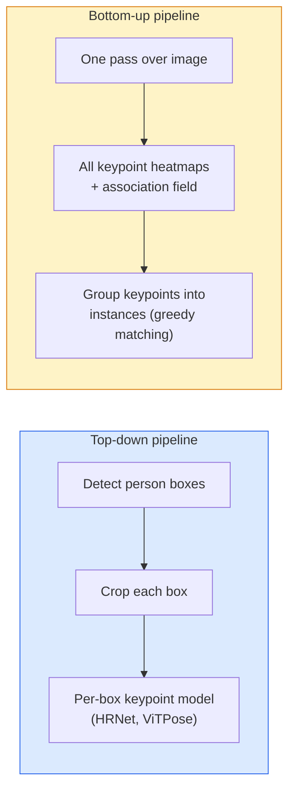

# 키포인트 검출과 포즈 추정 (Keypoint Detection & Pose Estimation)

> 포즈(pose)는 순서가 매겨진 키포인트(keypoint)의 집합이다. 키포인트 검출기는 히트맵 회귀기(heatmap regressor)다. 나머지는 전부 부기(bookkeeping)일 뿐이다.

**Type:** Build
**Languages:** Python
**Prerequisites:** Phase 4 Lesson 06 (Detection), Phase 4 Lesson 07 (U-Net)
**Time:** ~45분

## 학습 목표 (Learning Objectives)

- 하향식(top-down)과 상향식(bottom-up) 포즈 추정을 구별하고 각각이 언제 쓰이는지 말하기
- 키포인트별 가우시안(Gaussian-per-keypoint) 타깃으로 K개 키포인트의 히트맵을 회귀(regression)하고, 추론(inference) 시 키포인트 좌표를 추출하기
- 부위 친화도 필드(Part Affinity Fields, PAFs)와, 상향식 파이프라인(pipeline)이 키포인트들을 인스턴스(instance)로 연결하는 방식을 설명하기
- 프로덕션(production) 키포인트 추정에 MediaPipe Pose 또는 MMPose를 사용하고 그 출력 형식을 이해하기

## 문제 (The Problem)

키포인트 과제는 여러 이름 뒤에 숨어 있다. 사람 포즈(신체 관절 17개), 얼굴 랜드마크(68개 또는 478개 점), 손(21개 점), 동물 포즈, 로봇 객체 포즈, 의료 해부학 랜드마크. 이들 모두는 같은 구조를 공유한다. 객체 위의 K개 이산 점을 검출하고 그 (x, y) 좌표를 출력한다.

포즈 추정은 모션 캡처, 피트니스 앱, 스포츠 분석, 제스처 제어, 애니메이션, AR 착용 시연, 로봇 파지(grasping)의 기반이다. 2D 사례는 성숙했다. 3D 포즈(단일 카메라에서 월드 좌표상 관절 위치를 추정)는 현재 연구 최전선이다.

엔지니어링 차원의 질문은 규모다. 단일 이미지, 단일 인물 포즈는 20ms 문제다. 30 fps로 군중 속 다중 인물 포즈는 다른 아키텍처가 필요한 다른 문제다.

## 개념 (The Concept)

### 하향식 vs 상향식



- **하향식(Top-down)** — 사람을 먼저 검출한 다음, 각 크롭(crop)마다 인물별 키포인트 모델(model)을 실행한다. 가장 높은 정확도; 사람 수에 선형으로 비례해 확장된다.
- **상향식(Bottom-up)** — 한 번의 순방향 패스(forward pass)로 모든 키포인트와 연결 필드(association field)를 예측하고, 그것들을 그룹화한다. 군중 크기에 관계없이 상수 시간이다.

하향식(HRNet, ViTPose)이 정확도 선두이고, 상향식(OpenPose, HigherHRNet)이 혼잡한 장면에서 처리량(throughput) 선두다.

### 히트맵 회귀

`(x, y)`를 직접 회귀하는 대신, 키포인트마다 참 위치를 중심으로 한 가우시안 덩어리(blob)를 가진 `H x W` 히트맵을 예측한다.

```
target[k, y, x] = exp(-((x - cx_k)^2 + (y - cy_k)^2) / (2 sigma^2))
```

추론 시, 각 히트맵의 argmax가 예측된 키포인트 위치다.

히트맵이 직접 회귀보다 잘 동작하는 이유: 신경망의 공간 구조(합성곱(convolution) 특성 맵(feature map))가 공간 출력과 자연스럽게 정렬된다. 가우시안 타깃은 또한 규제(regularisation) 역할을 한다 — 작은 위치 오차는 0이 아니라 작은 손실(loss)을 만든다.

### 서브픽셀 위치 추정

argmax는 정수 좌표를 준다. 서브픽셀(sub-pixel) 정밀도를 위해서는, argmax와 그 이웃들에 포물선을 적합(fit)하거나, 잘 알려진 오프셋 `(dx, dy) = 0.25 * (heatmap[y, x+1] - heatmap[y, x-1], ...)` 방향을 사용해 보정한다.

### 부위 친화도 필드 (Part Affinity Fields, PAFs)

OpenPose의 상향식 연결 비법이다. 연결된 키포인트 쌍마다(예: 왼쪽 어깨에서 왼쪽 팔꿈치까지), 한 점에서 다른 점을 가리키는 단위 벡터(unit vector)를 인코딩하는 2채널 필드를 예측한다. 어깨를 그 팔꿈치와 연결하려면, 후보 쌍을 잇는 선을 따라 PAF를 적분한다. 적분값이 가장 큰 쌍이 매칭된다.

```
For each connection (limb):
  PAF channels: 2 (unit vector x, y)
  Line integral: sum over sample points of (PAF . line_direction)
  Higher integral = stronger match
```

우아하며, 인물별 크롭 없이 임의의 군중 크기로 확장된다.

### COCO 키포인트

표준 신체 포즈 데이터셋(dataset): 인물당 키포인트 17개, 메트릭으로는 PCK(Percentage of Correct Keypoints)와 OKS(Object Keypoint Similarity)를 쓴다. OKS는 IoU의 키포인트 버전이며, COCO mAP@OKS가 보고하는 것이 바로 이것이다.

### 2D vs 3D

- **2D 포즈** — 이미지 좌표; 프로덕션 품질로 해결됨(MediaPipe, HRNet, ViTPose).
- **3D 포즈** — 월드 / 카메라 좌표; 여전히 활발한 연구 영역. 흔한 접근법:
  - 작은 MLP로 2D 예측을 3D로 끌어올림(lift)(VideoPose3D).
  - 이미지에서 직접 3D 회귀(PyMAF, MHFormer).
  - 정답(ground truth)을 위한 다중 시점(multi-view) 구성(CMU Panoptic).

## 직접 만들기 (Build It)

### 1단계: 가우시안 히트맵 타깃

```python
import numpy as np
import torch

def gaussian_heatmap(size, cx, cy, sigma=2.0):
    yy, xx = np.meshgrid(np.arange(size), np.arange(size), indexing="ij")
    return np.exp(-((xx - cx) ** 2 + (yy - cy) ** 2) / (2 * sigma ** 2)).astype(np.float32)

hm = gaussian_heatmap(64, 32, 32, sigma=2.0)
print(f"peak: {hm.max():.3f} at ({hm.argmax() % 64}, {hm.argmax() // 64})")
```

키포인트별 히트맵을 채널 축을 따라 쌓으면 전체 타깃 텐서(tensor)가 된다.

### 2단계: 작은 키포인트 헤드

K개 히트맵 채널을 출력하는 U-Net 스타일 모델이다.

```python
import torch.nn as nn
import torch.nn.functional as F

class TinyKeypointNet(nn.Module):
    def __init__(self, num_keypoints=4, base=16):
        super().__init__()
        self.down1 = nn.Sequential(nn.Conv2d(3, base, 3, 2, 1), nn.ReLU(inplace=True))
        self.down2 = nn.Sequential(nn.Conv2d(base, base * 2, 3, 2, 1), nn.ReLU(inplace=True))
        self.mid = nn.Sequential(nn.Conv2d(base * 2, base * 2, 3, 1, 1), nn.ReLU(inplace=True))
        self.up1 = nn.ConvTranspose2d(base * 2, base, 2, 2)
        self.up2 = nn.ConvTranspose2d(base, num_keypoints, 2, 2)

    def forward(self, x):
        h1 = self.down1(x)
        h2 = self.down2(h1)
        h3 = self.mid(h2)
        u1 = self.up1(h3)
        return self.up2(u1)
```

입력 `(N, 3, H, W)`, 출력 `(N, K, H, W)`. 손실은 가우시안 타깃에 대한 픽셀별 MSE다.

### 3단계: 추론 — 키포인트 좌표 추출

```python
def heatmap_to_coords(heatmaps):
    """
    heatmaps: (N, K, H, W)
    returns:  (N, K, 2) float coordinates in image pixels
    """
    N, K, H, W = heatmaps.shape
    hm = heatmaps.reshape(N, K, -1)
    idx = hm.argmax(dim=-1)
    ys = (idx // W).float()
    xs = (idx % W).float()
    return torch.stack([xs, ys], dim=-1)

coords = heatmap_to_coords(torch.randn(2, 4, 32, 32))
print(f"coords: {coords.shape}")  # (2, 4, 2)
```

추론 시 한 줄이다. 서브픽셀 보정을 위해서는 argmax 주변을 보간(interpolate)한다.

### 4단계: 합성 키포인트 데이터셋

간단하다. 흰 캔버스에 점 네 개를 그리고 그것들을 예측하도록 학습한다.

```python
def make_synthetic_sample(size=64):
    img = np.ones((3, size, size), dtype=np.float32)
    rng = np.random.default_rng()
    kps = rng.integers(8, size - 8, size=(4, 2))
    for cx, cy in kps:
        img[:, cy - 2:cy + 2, cx - 2:cx + 2] = 0.0
    hms = np.stack([gaussian_heatmap(size, cx, cy) for cx, cy in kps])
    return img, hms, kps
```

작은 모델이 1분 안에 학습할 만큼 쉽다.

### 5단계: 학습

```python
model = TinyKeypointNet(num_keypoints=4)
opt = torch.optim.Adam(model.parameters(), lr=3e-3)

for step in range(200):
    batch = [make_synthetic_sample() for _ in range(16)]
    imgs = torch.from_numpy(np.stack([b[0] for b in batch]))
    hms = torch.from_numpy(np.stack([b[1] for b in batch]))
    pred = model(imgs)
    # Upsample pred to full resolution
    pred = F.interpolate(pred, size=hms.shape[-2:], mode="bilinear", align_corners=False)
    loss = F.mse_loss(pred, hms)
    opt.zero_grad(); loss.backward(); opt.step()
```

## 라이브러리로 써보기 (Use It)

- **MediaPipe Pose** — Google의 프로덕션 포즈 추정기; 10ms 미만 지연 시간(latency)으로 WebGL + 모바일 런타임을 제공한다.
- **MMPose** (OpenMMLab) — 포괄적인 연구 코드베이스; 모든 최첨단(SOTA) 아키텍처를 사전 학습된 가중치(weight)와 함께 제공한다.
- **YOLOv8-pose** — 단일 순방향 패스로 가장 빠른 실시간 다중 인물 포즈.
- **transformers HumanDPT / PoseAnything** — 개방형 어휘(open-vocabulary) 포즈(임의의 객체, 임의의 키포인트 집합)를 위한 더 새로운 비전-언어(vision-language) 접근법.

## 산출물 (Ship It)

이 레슨은 다음을 만든다:

- `outputs/prompt-pose-stack-picker.md` — 지연 시간, 군중 크기, 2D vs 3D 필요에 따라 MediaPipe / YOLOv8-pose / HRNet / ViTPose를 고르는 프롬프트.
- `outputs/skill-heatmap-to-coords.md` — 모든 프로덕션 포즈 모델이 사용하는 서브픽셀 히트맵-좌표 변환 루틴을 작성하는 스킬.

## 연습 문제 (Exercises)

1. **(쉬움)** 합성 4점 데이터셋으로 작은 키포인트 모델을 학습하라. 200 스텝 후 예측된 키포인트와 참 키포인트 사이의 평균 L2 오차를 보고하라.
2. **(중간)** 서브픽셀 보정을 추가하라. argmax 위치가 주어지면, 이웃 픽셀들로부터 x와 y를 따라 1D 포물선을 적합하라. 정수 argmax 대비 정확도 향상을 보고하라.
3. **(어려움)** 각 이미지가 4키포인트 패턴의 인스턴스 두 개를 보여주는 2인 합성 데이터셋을 만들라. 어떤 키포인트가 어떤 인스턴스에 속하는지 예측하는 PAFs를 갖춘 상향식 파이프라인을 학습하고, OKS를 평가하라.

## 핵심 용어 (Key Terms)

| 용어 | 사람들이 말하는 것 | 실제 의미 |
|------|----------------|----------------------|
| 키포인트(Keypoint) | "랜드마크" | 객체 위의 순서가 매겨진 특정 점(관절, 모서리, 특성) |
| 포즈(Pose) | "골격" | 한 인스턴스에 속하는 순서가 매겨진 키포인트 집합 |
| 하향식(Top-down) | "검출 후 포즈" | 2단계 파이프라인: 사람 검출기 + 크롭별 키포인트 모델; 가장 높은 정확도 |
| 상향식(Bottom-up) | "포즈 먼저, 그룹화는 나중에" | 단일 패스 전체 키포인트 예측 + 그룹화; 군중 크기에 상수 시간 |
| 히트맵(Heatmap) | "가우시안 타깃" | 키포인트마다 참 위치에 정점을 둔 H x W 텐서; 선호되는 회귀 타깃 |
| PAF | "부위 친화도 필드" | 사지(limb) 방향을 인코딩하는 2채널 단위 벡터 필드; 키포인트를 인스턴스로 그룹화하는 데 사용 |
| OKS | "키포인트 IoU" | Object Keypoint Similarity; 포즈에 대한 COCO 메트릭 |
| HRNet | "고해상도 신경망" | 지배적인 하향식 키포인트 아키텍처; 전 과정에서 고해상도 특성을 보존함 |

## 더 읽을거리 (Further Reading)

- [OpenPose (Cao et al., 2017)](https://arxiv.org/abs/1812.08008) — PAFs를 사용한 상향식; 여전히 그 접근법에 대한 최고의 설명
- [HRNet (Sun et al., 2019)](https://arxiv.org/abs/1902.09212) — 하향식 레퍼런스 아키텍처
- [ViTPose (Xu et al., 2022)](https://arxiv.org/abs/2204.12484) — 평범한 ViT를 포즈 백본으로; 많은 벤치마크에서 현재 최첨단
- [MediaPipe Pose](https://developers.google.com/mediapipe/solutions/vision/pose_landmarker) — 프로덕션 실시간 포즈; 2026년 가장 빠르게 배포된 스택
