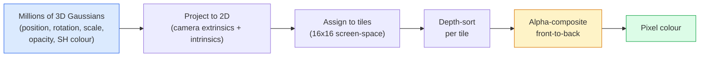

# 밑바닥부터 만드는 3D 가우시안 스플래팅 (3D Gaussian Splatting from Scratch)

> 장면(scene)은 수백만 개의 3D 가우시안(Gaussian) 구름이다. 각각은 위치, 방향, 스케일, 불투명도, 그리고 시점 방향에 따라 달라지는 색을 가진다. 이것들을 래스터화(rasterise)하고, 래스터화를 통해 역전파(backprop)하면, 끝이다.

**Type:** Build
**Languages:** Python
**Prerequisites:** Phase 4 Lesson 13 (3D Vision & NeRF), Phase 1 Lesson 12 (Tensor Operations), Phase 4 Lesson 10 (Diffusion basics optional)
**Time:** ~90분

## 학습 목표 (Learning Objectives)

- 2026년 사실적(photorealistic) 3D 재구성의 프로덕션(production) 기본값으로 3D 가우시안 스플래팅(3D Gaussian Splatting)이 왜 NeRF를 대체했는지 설명하기
- 가우시안별 여섯 가지 파라미터(parameter)(위치, 회전 쿼터니언(quaternion), 스케일, 불투명도, 구면 조화 함수(spherical harmonics) 색, 선택적 특성(feature))와 각각이 기여하는 부동소수점(float) 개수를 말하기
- `alpha` 합성(compositing)을 사용해 2D 가우시안 스플래팅 래스터라이저를 밑바닥부터 구현하고, 3D 사례가 같은 루프로 투영(projection)되는 방식을 보이기
- `nerfstudio`, `gsplat`, 또는 `SuperSplat`를 사용해 사진 20-50장으로 장면을 재구성하고, `KHR_gaussian_splatting` glTF 확장 또는 OpenUSD 26.03 `UsdVolParticleField3DGaussianSplat` 스키마로 내보내기

## 문제 (The Problem)

NeRF는 장면을 MLP의 가중치(weight)로 저장한다. 렌더링되는 모든 픽셀은 광선(ray)을 따라 수백 번의 MLP 질의(query)다. 학습(training)에 몇 시간, 렌더링에 몇 초가 걸리고, 가중치는 편집할 수 없다 — 장면 안에서 의자를 옮기고 싶다면 다시 학습해야 한다.

3D 가우시안 스플래팅(Kerbl, Kopanas, Leimkühler, Drettakis, SIGGRAPH 2023)이 그 모든 것을 대체했다. 장면은 3D 가우시안의 명시적(explicit) 집합이다. 렌더링은 100+ fps의 GPU 래스터화다. 학습은 몇 분이면 된다. 편집은 직접적이다. 가우시안의 부분집합을 평행이동하면 의자를 옮긴 것이다. 2026년까지 크로노스 그룹(Khronos Group)이 가우시안 스플랫용 glTF 확장을 비준했고, OpenUSD 26.03이 가우시안 스플랫 스키마를 제공하며, Zillow와 Apartments.com이 이 방식으로 부동산을 렌더링하고, 3D 재구성에 관한 대부분의 새 연구 논문이 핵심 3DGS 아이디어의 변형이다.

심성 모형(mental model)은 단순하지만 수학에는 움직이는 부품이 충분히 많아서, 대부분의 입문서는 래스터화에서 시작하고 투영과 구면 조화 함수는 건너뛴다. 이 레슨은 전체를 만든다 — 먼저 2D 버전, 그다음 3D 확장.

## 개념 (The Concept)

### 가우시안이 담는 것

하나의 3D 가우시안은 다음 속성을 가진 공간 속 매개변수화된 덩어리(blob)다:

```
position         mu         (3,)    centre in world coordinates
rotation         q          (4,)    unit quaternion encoding orientation
scale            s          (3,)    log-scales per axis (exponentiated at render time)
opacity          alpha      (1,)    post-sigmoid opacity [0, 1]
SH coefficients  c_lm       (3 * (L+1)^2,)   view-dependent colour
```

회전 + 스케일이 3x3 공분산(covariance)을 만든다: `Sigma = R S S^T R^T`. 이것이 3D에서 가우시안의 형태다. 구면 조화 함수는 시점별 텍스처를 저장하지 않고도 색이 시점 방향에 따라 변하도록 한다 — 정반사 하이라이트(specular highlight), 미묘한 광택, 시점 의존 글로우(glow). SH 차수(degree) 3이면 색 채널당 16개 계수, 색만으로 가우시안당 48개 부동소수점을 얻는다.

장면은 보통 100만~500만 개의 가우시안을 가진다. 각각은 대략 60개 부동소수점(3 + 4 + 3 + 1 + 48 + 기타)을 저장한다. 500만 가우시안 장면이면 240 MB다 — 점별 텍스처를 가진 동등한 점 구름(point cloud)보다 훨씬 작고, 고해상도로 다시 렌더링한 NeRF의 MLP 가중치보다 한 자릿수 작다.

### 광선 행진이 아닌 래스터화



다섯 단계, 모두 GPU 친화적이다. 픽셀당 MLP 질의가 없다. 단일 RTX 3080 Ti가 600만 스플랫을 147 fps로 렌더링한다.

### 투영 단계

월드 위치 `mu`와 3D 공분산 `Sigma`를 가진 3D 가우시안은, 화면 위치 `mu'`와 2D 공분산 `Sigma'`를 가진 2D 가우시안으로 투영된다:

```
mu' = project(mu)
Sigma' = J W Sigma W^T J^T          (2 x 2)

W = viewing transform (rotation + translation of camera)
J = Jacobian of the perspective projection at mu'
```

2D 가우시안의 발자국(footprint)은 축이 `Sigma'`의 고유벡터(eigenvector)인 타원이다. 그 타원 안의 모든 픽셀은 `exp(-0.5 * (p - mu')^T Sigma'^-1 (p - mu'))`로 가중된 가우시안의 기여를 받는다.

### 알파 합성 규칙

한 픽셀을 덮는 가우시안들은 뒤에서 앞으로(back-to-front) 정렬된다(또는 동등하게, 공식을 반전해 앞에서 뒤로). 색은 1980년대 이래 모든 반투명 래스터라이저와 같은 방정식으로 합성된다:

```
C_pixel = sum_i alpha_i * T_i * c_i

T_i = prod_{j < i} (1 - alpha_j)       transmittance up to i
alpha_i = opacity_i * exp(-0.5 * d^T Sigma'^-1 d)   local contribution
c_i = eval_SH(SH_i, view_direction)    view-dependent colour
```

이것은 **NeRF의 체적 렌더(volumetric render)와 같은 방정식**이며, 단지 광선을 따라 조밀하게 샘플링한 것 대신 가우시안의 명시적 희소 집합에 대해 적용할 뿐이다. 그 동일성이 렌더링 품질이 NeRF와 일치하는 이유다 — 둘 다 같은 복사장(radiance-field) 방정식을 적분한다.

### 이것이 미분 가능한 이유

모든 단계 — 투영, 타일 할당, 알파 합성, SH 평가 — 는 가우시안 파라미터에 대해 미분 가능하다. 정답(ground-truth) 이미지가 주어지면 렌더링된 픽셀 손실(loss)을 계산하고 래스터라이저로 역전파해서, 경사 하강법(gradient descent)으로 모든 `(mu, q, s, alpha, c_lm)`를 갱신한다. 약 30,000번의 반복(iteration)에 걸쳐 가우시안들은 자신의 올바른 위치, 스케일, 색을 찾는다.

### 조밀화와 가지치기

고정된 가우시안 집합으로는 복잡한 장면을 덮을 수 없다. 학습에는 두 가지 적응적 메커니즘이 포함된다:

- 가우시안의 그래디언트(gradient) 크기가 크지만 스케일이 작을 때 현재 위치에서 **복제(Clone)** 한다 — 재구성에 여기 더 많은 세부가 필요하다.
- 큰 스케일의 가우시안을 그래디언트가 클 때 더 작은 둘로 **분할(Split)** 한다 — 큰 가우시안 하나는 그 영역에 맞추기엔 너무 매끄럽다.
- 불투명도가 임계값 아래로 떨어진 가우시안을 **가지치기(Prune)** 한다 — 그것들은 기여하지 않는다.

조밀화는 N번 반복마다 실행된다. 장면은 보통 (SfM 점에서 씨앗을 얻은) 초기 약 10만 가우시안에서 학습 끝에 100만~500만으로 늘어난다.

### 구면 조화 함수 한 문단 요약

시점 의존 색은 단위 구 위의 함수 `c(direction)`이다. 구면 조화 함수는 구의 푸리에(Fourier) 기저다. 차수 `L`에서 절단하면 채널당 `(L+1)^2`개 기저 함수를 얻는다. 새 시점에 대한 색을 평가하는 것은, 학습된 SH 계수와 시점 방향에서 평가한 기저 사이의 내적(dot product)이다. 차수 0 = 계수 하나 = 상수 색. 차수 3 = 계수 16개 = 램버시안(Lambertian) 음영, 정반사, 약한 반사를 포착하기에 충분. 표준 가우시안 스플래팅 논문은 기본값으로 차수 3을 쓴다.

### 2026년 프로덕션 스택

```
1. Capture         smartphone / DJI drone / handheld scanner
2. SfM / MVS       COLMAP or GLOMAP derives camera poses + sparse points
3. Train 3DGS      nerfstudio / gsplat / inria official / PostShot (~10-30 min on RTX 4090)
4. Edit            SuperSplat / SplatForge (clean floaters, segment)
5. Export          .ply -> glTF KHR_gaussian_splatting or .usd (OpenUSD 26.03)
6. View            Cesium / Unreal / Babylon.js / Three.js / Vision Pro
```

### 4D와 생성적 변형

- **4D 가우시안 스플래팅(4D Gaussian Splatting)** — 가우시안이 시간의 함수다; 체적 비디오(volumetric video)에 사용됨(Superman 2026, A$AP Rocky의 "Helicopter").
- **생성적 스플랫(Generative splats)** — 장면 전체를 환각으로 만들어내는 텍스트-투-스플랫(text-to-splat) 모델(World Labs의 Marble).
- **3D Gaussian Unscented Transform** — 자율주행 시뮬레이션을 위한 NVIDIA NuRec의 변형.

## 직접 만들기 (Build It)

### 1단계: 2D 가우시안

먼저 2D 래스터라이저를 만든다. 3D 사례는 투영 후 이것으로 환원된다.

```python
import torch
import torch.nn as nn
import torch.nn.functional as F


def eval_2d_gaussian(means, covs, points):
    """
    means:  (G, 2)      centres
    covs:   (G, 2, 2)   covariance matrices
    points: (H, W, 2)   pixel coordinates
    returns: (G, H, W)  density at every pixel for every Gaussian
    """
    G = means.size(0)
    H, W, _ = points.shape
    flat = points.view(-1, 2)
    inv = torch.linalg.inv(covs)
    diff = flat[None, :, :] - means[:, None, :]
    d = torch.einsum("gpi,gij,gpj->gp", diff, inv, diff)
    density = torch.exp(-0.5 * d)
    return density.view(G, H, W)
```

`einsum`은 모든 (가우시안, 픽셀) 쌍에 대해 이차 형식(quadratic form) `diff^T Sigma^-1 diff`를 수행한다.

### 2단계: 2D 스플래팅 래스터라이저

앞에서 뒤로 알파 합성한다. 2D에서는 깊이가 의미가 없으므로, 순서는 학습된 가우시안별 스칼라로 정한다.

```python
def rasterise_2d(means, covs, colours, opacities, depths, image_size):
    """
    means:     (G, 2)
    covs:      (G, 2, 2)
    colours:   (G, 3)
    opacities: (G,)     in [0, 1]
    depths:    (G,)     per-Gaussian scalar used for ordering
    image_size: (H, W)
    returns:   (H, W, 3) rendered image
    """
    H, W = image_size
    yy, xx = torch.meshgrid(
        torch.arange(H, dtype=torch.float32, device=means.device),
        torch.arange(W, dtype=torch.float32, device=means.device),
        indexing="ij",
    )
    points = torch.stack([xx, yy], dim=-1)

    densities = eval_2d_gaussian(means, covs, points)
    alphas = opacities[:, None, None] * densities
    alphas = alphas.clamp(0.0, 0.99)

    order = torch.argsort(depths)
    alphas = alphas[order]
    colours_sorted = colours[order]

    T = torch.ones(H, W, device=means.device)
    out = torch.zeros(H, W, 3, device=means.device)
    for i in range(means.size(0)):
        a = alphas[i]
        out += (T * a)[..., None] * colours_sorted[i][None, None, :]
        T = T * (1.0 - a)
    return out
```

빠르지는 않다 — 실제 구현은 타일 기반 CUDA 커널을 쓴다 — 하지만 정확히 올바른 수학이며 완전히 미분 가능하다.

### 3단계: 학습 가능한 2D 스플랫 장면

```python
class Splats2D(nn.Module):
    def __init__(self, num_splats=128, image_size=64, seed=0):
        super().__init__()
        g = torch.Generator().manual_seed(seed)
        H, W = image_size, image_size
        self.means = nn.Parameter(torch.rand(num_splats, 2, generator=g) * torch.tensor([W, H]))
        self.log_scale = nn.Parameter(torch.ones(num_splats, 2) * math.log(2.0))
        self.rot = nn.Parameter(torch.zeros(num_splats))  # single angle in 2D
        self.colour_logits = nn.Parameter(torch.randn(num_splats, 3, generator=g) * 0.5)
        self.opacity_logit = nn.Parameter(torch.zeros(num_splats))
        self.depth = nn.Parameter(torch.rand(num_splats, generator=g))

    def covs(self):
        s = torch.exp(self.log_scale)
        c, si = torch.cos(self.rot), torch.sin(self.rot)
        R = torch.stack([
            torch.stack([c, -si], dim=-1),
            torch.stack([si, c], dim=-1),
        ], dim=-2)
        S = torch.diag_embed(s ** 2)
        return R @ S @ R.transpose(-1, -2)

    def forward(self, image_size):
        covs = self.covs()
        colours = torch.sigmoid(self.colour_logits)
        opacities = torch.sigmoid(self.opacity_logit)
        return rasterise_2d(self.means, covs, colours, opacities, self.depth, image_size)
```

`log_scale`, `opacity_logit`, `colour_logits`는 모두 제약 없는 파라미터로, 렌더링 시 올바른 활성화 함수(activation)를 통해 매핑된다. 이것은 모든 3DGS 구현의 표준 패턴이다.

### 4단계: 타깃 이미지에 2D 가우시안 적합하기

```python
import math
import numpy as np

def make_target(size=64):
    yy, xx = np.meshgrid(np.arange(size), np.arange(size), indexing="ij")
    img = np.zeros((size, size, 3), dtype=np.float32)
    # Red circle
    mask = (xx - 20) ** 2 + (yy - 20) ** 2 < 10 ** 2
    img[mask] = [1.0, 0.2, 0.2]
    # Blue square
    mask = (np.abs(xx - 45) < 8) & (np.abs(yy - 40) < 8)
    img[mask] = [0.2, 0.3, 1.0]
    return torch.from_numpy(img)


target = make_target(64)
model = Splats2D(num_splats=64, image_size=64)
opt = torch.optim.Adam(model.parameters(), lr=0.05)

for step in range(200):
    pred = model((64, 64))
    loss = F.mse_loss(pred, target)
    opt.zero_grad(); loss.backward(); opt.step()
    if step % 40 == 0:
        print(f"step {step:3d}  mse {loss.item():.4f}")
```

200 스텝에 걸쳐 64개 가우시안이 두 도형으로 자리 잡는다. 그것이 아이디어 전부다 — 명시적 기하 프리미티브(geometric primitive)에 대한 경사 하강법.

### 5단계: 2D에서 3D로

3D 확장은 같은 루프를 유지한다. 추가되는 것:

1. 가우시안별 회전이 단일 각도 대신 쿼터니언이다.
2. 공분산은 쿼터니언으로 만든 `R`과 `S = diag(exp(log_scale))`로 이루어진 `R S S^T R^T`이다.
3. 투영 `(mu, Sigma) -> (mu', Sigma')`는 카메라 외부 파라미터(extrinsics)와 `mu`에서의 원근 투영(perspective projection) 야코비안(Jacobian)을 사용한다.
4. 색은 구면 조화 함수 전개가 된다; 시점 방향에서 그것을 평가한다.
5. 깊이 정렬은 학습된 스칼라 대신 실제 카메라 공간 z에서 한다.

모든 프로덕션 구현(`gsplat`, `inria/gaussian-splatting`, `nerfstudio`)은 정확히 이것을 타일 기반 CUDA 커널로 GPU에서 한다.

### 6단계: 구면 조화 함수 평가

차수 3까지의 SH 기저는 채널당 16개 항을 가진다. 평가:

```python
def eval_sh_degree_3(sh_coeffs, dirs):
    """
    sh_coeffs: (..., 16, 3)   last dim is RGB channels
    dirs:      (..., 3)       unit vectors
    returns:   (..., 3)
    """
    C0 = 0.282094791773878
    C1 = 0.488602511902920
    C2 = [1.092548430592079, 1.092548430592079,
          0.315391565252520, 1.092548430592079,
          0.546274215296039]
    x, y, z = dirs[..., 0], dirs[..., 1], dirs[..., 2]
    x2, y2, z2 = x * x, y * y, z * z
    xy, yz, xz = x * y, y * z, x * z

    result = C0 * sh_coeffs[..., 0, :]
    result = result - C1 * y[..., None] * sh_coeffs[..., 1, :]
    result = result + C1 * z[..., None] * sh_coeffs[..., 2, :]
    result = result - C1 * x[..., None] * sh_coeffs[..., 3, :]

    result = result + C2[0] * xy[..., None] * sh_coeffs[..., 4, :]
    result = result + C2[1] * yz[..., None] * sh_coeffs[..., 5, :]
    result = result + C2[2] * (2.0 * z2 - x2 - y2)[..., None] * sh_coeffs[..., 6, :]
    result = result + C2[3] * xz[..., None] * sh_coeffs[..., 7, :]
    result = result + C2[4] * (x2 - y2)[..., None] * sh_coeffs[..., 8, :]

    # degree 3 terms omitted here for brevity; full 16-coefficient version in the code file
    return result
```

학습된 `sh_coeffs`는 그 가우시안의 "모든 방향에서의 색"을 저장한다. 렌더링 시 현재 시점 방향에서 평가하면 3-벡터 RGB를 얻는다.

## 라이브러리로 써보기 (Use It)

실제 3DGS 작업에는 `gsplat`(Meta) 또는 `nerfstudio`를 사용한다:

```bash
pip install nerfstudio gsplat
ns-download-data example
ns-train splatfacto --data path/to/data
```

`splatfacto`는 nerfstudio의 3DGS 트레이너다. 전형적인 장면에서 RTX 4090 기준으로 10-30분이 걸린다.

2026년에 중요한 내보내기 옵션:

- `.ply` — 원시 가우시안 구름(이식성 높음, 가장 큰 파일).
- `.splat` — PlayCanvas / SuperSplat 양자화(quantised) 형식.
- glTF `KHR_gaussian_splatting` — 크로노스 표준, 뷰어 간 이식 가능(2026년 2월 RC).
- OpenUSD `UsdVolParticleField3DGaussianSplat` — USD 네이티브, NVIDIA Omniverse 및 Vision Pro 파이프라인용.

4D / 동적 장면의 경우, `4DGS`와 `Deformable-3DGS`가 시간 변화하는 평균과 불투명도로 같은 기계 장치를 확장한다.

## 산출물 (Ship It)

이 레슨은 다음을 만든다:

- `outputs/prompt-3dgs-capture-planner.md` — 주어진 장면 유형에 대해 캡처 세션(사진 수, 카메라 경로, 조명)을 계획하는 프롬프트.
- `outputs/skill-3dgs-export-router.md` — 다운스트림 뷰어 또는 엔진에 따라 올바른 내보내기 형식(`.ply` / `.splat` / glTF / USD)을 고르는 스킬.

## 연습 문제 (Exercises)

1. **(쉬움)** 위의 2D 스플랫 트레이너를 다른 합성 이미지에서 실행하라. `num_splats`를 `[16, 64, 256]`로 바꾸며 각각에 대해 MSE 대 스텝을 그려라. 수익 체감(diminishing returns) 지점을 찾아라.
2. **(중간)** 2D 래스터라이저를 확장하여, 차수 2 조화 함수를 통해 스칼라 "시점 각도"에 의존하는 가우시안별 RGB 색을 지원하라. 한 쌍의 타깃 이미지에 학습하고 모델이 둘 다 재구성하는지 검증하라.
3. **(어려움)** `nerfstudio`를 클론하고, 직접 고른 임의의 장면(책상, 식물, 얼굴, 방)을 20장 캡처해 `splatfacto`를 학습하라. glTF `KHR_gaussian_splatting`로 내보내고 뷰어(Three.js `GaussianSplats3D`, SuperSplat, Babylon.js V9)에서 열어라. 학습 시간, 가우시안 개수, 렌더링 fps를 보고하라.

## 핵심 용어 (Key Terms)

| 용어 | 사람들이 말하는 것 | 실제 의미 |
|------|----------------|----------------------|
| 3DGS | "가우시안 스플랫" | 가우시안별 위치, 회전, 스케일, 불투명도, SH 색을 가진 수백만 개 3D 가우시안으로서의 명시적 장면 표현 |
| 공분산(Covariance) | "가우시안의 형태" | `Sigma = R S S^T R^T`; 한 가우시안의 방향과 비등방성(anisotropic) 스케일 |
| 알파 합성(Alpha compositing) | "뒤에서 앞으로 블렌드" | NeRF의 체적 렌더와 같은 방정식, 이제 명시적 희소 집합에 대해 적용 |
| 조밀화(Densification) | "복제와 분할" | 재구성이 과소적합(under-fit)된 곳에 새 가우시안을 적응적으로 추가 |
| 가지치기(Pruning) | "낮은 불투명도 삭제" | 학습 중 거의 0에 가까운 불투명도로 붕괴한 가우시안 제거 |
| 구면 조화 함수(Spherical harmonics) | "시점 의존 색" | 구 위의 푸리에 기저; 시점 방향의 함수로 색을 저장 |
| Splatfacto | "nerfstudio의 3DGS" | 2026년 3DGS를 학습하는 가장 쉬운 경로 |
| `KHR_gaussian_splatting` | "glTF 표준" | 3DGS를 뷰어와 엔진 간 이식 가능하게 만드는 크로노스 2026 확장 |

## 더 읽을거리 (Further Reading)

- [3D Gaussian Splatting for Real-Time Radiance Field Rendering (Kerbl et al., SIGGRAPH 2023)](https://repo-sam.inria.fr/fungraph/3d-gaussian-splatting/) — 원본 논문
- [gsplat (Meta/nerfstudio)](https://github.com/nerfstudio-project/gsplat) — 프로덕션 품질 CUDA 래스터라이저
- [nerfstudio Splatfacto](https://docs.nerf.studio/nerfology/methods/splat.html) — 레퍼런스 학습 레시피
- [Khronos KHR_gaussian_splatting extension](https://github.com/KhronosGroup/glTF/blob/main/extensions/2.0/Khronos/KHR_gaussian_splatting/README.md) — 2026 이식 가능 형식
- [OpenUSD 26.03 release notes](https://openusd.org/release/) — `UsdVolParticleField3DGaussianSplat` 스키마
- [THE FUTURE 3D State of Gaussian Splatting 2026](https://www.thefuture3d.com/blog-0/2026/4/4/state-of-gaussian-splatting-2026) — 업계 개관
