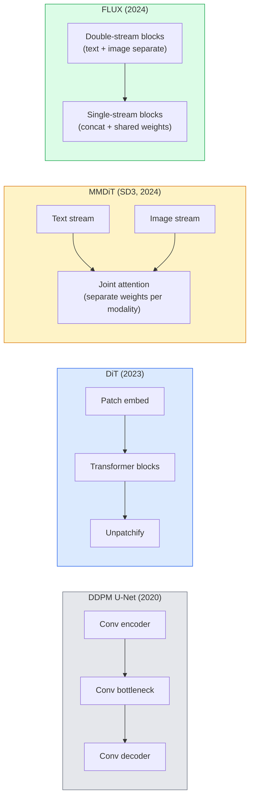

# 디퓨전 트랜스포머와 정류 흐름 (Diffusion Transformers & Rectified Flow)

> U-Net은 디퓨전(diffusion)의 비밀이 아니다. 그것을 트랜스포머(transformer)로 바꾸고, 노이즈 스케줄(noise schedule)을 직선 흐름(straight-line flow)으로 교체하면, 갑자기 SD3, FLUX, 그리고 2026년의 모든 텍스트-투-이미지(text-to-image) 모델(model)을 갖게 된다.

**Type:** Learn + Build
**Languages:** Python
**Prerequisites:** Phase 4 Lesson 10 (Diffusion DDPM), Phase 4 Lesson 14 (ViT), Phase 7 Lesson 02 (Self-Attention)
**Time:** ~75분

## 학습 목표 (Learning Objectives)

- U-Net DDPM(Lesson 10)에서 디퓨전 트랜스포머(Diffusion Transformer, DiT), MMDiT(SD3), 단일+이중 스트림 DiT(FLUX)로 이어지는 진화를 추적하기
- 정류 흐름(rectified flow)을 설명하기: 노이즈와 데이터 사이의 직선 궤적이 왜 모델이 1000 스텝 대신 20 스텝으로 샘플링하게 하는지
- 작은 DiT 블록과 정류 흐름 학습(training) 루프를 둘 다 100줄 미만으로 구현하기
- 모델 변형(SD3, FLUX.1-dev, FLUX.1-schnell, Z-Image, Qwen-Image)을 아키텍처, 파라미터(parameter) 수, 라이선스로 구별하기

## 문제 (The Problem)

Lesson 10은 U-Net 디노이저(denoiser)로 DDPM을 만들었다. 그 레시피는 2020-2023년을 지배했다. U-Net + 베타 스케줄(beta schedule) + 노이즈 예측 손실(noise-prediction loss). 그것이 Stable Diffusion 1.5와 2.1, 그리고 DALL-E 2를 만들었다.

2026년의 모든 최첨단(state-of-the-art) 텍스트-투-이미지 모델은 그것을 지나쳤다. Stable Diffusion 3, FLUX, SD4, Z-Image, Qwen-Image, Hunyuan-Image — 어느 것도 U-Net을 쓰지 않는다. 그것들은 디퓨전 트랜스포머(DiT)를 쓴다. SD3와 FLUX는 또한 DDPM 노이즈 스케줄을 정류 흐름으로 교체하는데, 이는 노이즈에서 데이터로 가는 경로를 곧게 펴고, 일관성(consistency) 또는 증류(distilled) 변형으로 1-4 스텝 추론(inference)을 가능하게 한다.

이 전환이 중요한 이유는, 디퓨전 기반 이미지 생성이 제어 가능해지고, 프롬프트(prompt)에 정확해지고(SD3/SD4가 텍스트 렌더링을 해결했다), 프로덕션(production)에서 빨라진 이유이기 때문이다. DiT + 정류 흐름을 이해하는 것이 2026년 생성 이미지 스택을 이해하는 것이다.

## 개념 (The Concept)

### U-Net에서 트랜스포머로



- **DiT** (Peebles & Xie, 2023) — U-Net을 잠재(latent) 패치(patch)에 대한 ViT 같은 트랜스포머로 대체. 적응적 층 정규화(adaptive layer norm, AdaLN)를 통한 조건화(conditioning).
- **MMDiT** (SD3, Esser et al., 2024) — 텍스트와 이미지 토큰(token)에 대해 별도 가중치(weight)를 가진 두 스트림이 결합 어텐션(joint attention)을 공유.
- **FLUX** (Black Forest Labs, 2024) — 처음 N개 블록은 SD3처럼 이중 스트림(double-stream), 이후 블록은 더 높은 깊이에서의 효율을 위해 연결(concatenate)하고 가중치를 공유(단일 스트림, single-stream).
- **Z-Image** (2025) — "무슨 수를 써서라도 규모 확장"에 도전하는 60억 파라미터의 효율적인 단일 스트림 DiT.

### 정류 흐름 한 문단 요약

DDPM은 순방향 과정을 `x_t`가 점점 더 손상되는 노이즈 SDE로 정의한다. 학습된 역방향은 두 번째 SDE이며, 1000개의 작은 스텝으로 푼다.

정류 흐름은 깨끗한 데이터와 순수 노이즈 사이의 **직선** 보간(interpolation)을 정의한다:

```
x_t = (1 - t) * x_0 + t * epsilon,     t in [0, 1]
```

신경망(network)이 속도(velocity) `v_theta(x_t, t) = epsilon - x_0`를 예측하도록 학습한다 — 깨끗한 데이터에서 노이즈로 가는 직선 경로를 따르는 순방향 방향(`dx_t/dt`)이다. 샘플링 동안, 이 속도를 거꾸로 적분하여 노이즈에서 데이터 쪽으로 스텝을 밟는다. 그 결과인 ODE는 직선에 훨씬 가까우므로, 샘플링에 필요한 적분 스텝이 훨씬 적다.

SD3는 이것을 **정류 흐름 매칭(Rectified Flow Matching)** 이라 부른다. FLUX, Z-Image, 그리고 대부분의 2026년 모델이 같은 목적 함수를 쓴다. 전형적 추론: 옛 DDPM 체제의 50+ DDIM 스텝 대비 20-30 오일러(Euler) 스텝(결정론적). 증류 / 터보(turbo) / schnell / LCM 변형은 이를 1-4 스텝으로 낮춘다.

### AdaLN 조건화

DiT는 타임스텝과 클래스/텍스트를 **적응적 층 정규화**를 통해 조건화한다. 조건화 벡터에서 `scale`과 `shift`를 예측하고 LayerNorm 후에 적용한다. U-Net의 FiLM 스타일 변조보다 훨씬 깔끔하며 모든 현대 DiT의 기본값이다.

```
cond -> MLP -> (scale, shift, gate)
norm(x) * (1 + scale) + shift, then residual add * gate
```

### SD3와 FLUX의 텍스트 인코더

- **SD3**는 세 개의 텍스트 인코더(encoder)를 쓴다: CLIP 모델 두 개 + T5-XXL. 임베딩(embedding)을 연결하여 텍스트 조건화로서 이미지 스트림에 공급한다.
- **FLUX**는 CLIP-L 하나 + T5-XXL을 쓴다.
- **Qwen-Image / Z-Image** 변형은 자신의 베이스 LLM과 정렬된 자체 텍스트 인코더를 쓴다.

텍스트 인코더는 SD3/FLUX가 SD1.5보다 프롬프트에 대해 훨씬 잘 추론하는 큰 이유다. T5-XXL 하나만 해도 47억 파라미터다.

### 분류기 없는 가이던스는 여전히 유효하다

정류 흐름은 샘플러를 바꾸지, 조건화를 바꾸지 않는다. 분류기 없는 가이던스(classifier-free guidance, 학습 중 10% 확률로 텍스트를 떨어뜨리고, 추론 시 조건부 예측과 비조건부 예측을 혼합)는 정류 흐름에서도 동일하게 동작한다. 대부분의 2026년 모델은 가이던스 스케일 3.5-5를 쓴다 — SD1.5의 7.5보다 낮은데, 정류 흐름 모델이 기본적으로 프롬프트를 더 빡빡하게 따르기 때문이다.

### Consistency, Turbo, Schnell, LCM

같은 아이디어에 대한 네 가지 이름: 느린 다단계(many-step) 모델을 빠른 소단계(few-step) 모델로 증류한다.

- **LCM (Latent Consistency Model)** — 임의의 중간 `x_t`에서 최종 `x_0`를 한 스텝에 예측하는 학생(student)을 학습.
- **SDXL Turbo / FLUX schnell** — 적대적 디퓨전 증류(adversarial diffusion distillation)로 학습한 1-4 스텝 모델.
- **SD Turbo** — 잠재 디퓨전에 맞춘 OpenAI 스타일 Consistency Models.

새 모델의 프로덕션 서빙은 "풀 퀄리티(full quality)" 체크포인트와 "터보 / schnell" 변형을 둘 다 제공한다. Schnell(독일어로 "빠른", Black Forest Labs의 관례)은 1-4 스텝으로 실행되며 실시간 파이프라인에 맞는다.

### 2026년 모델 지형

| 모델 | 크기 | 아키텍처 | 라이선스 |
|-------|------|--------------|---------|
| Stable Diffusion 3 Medium | 2B | MMDiT | SAI Community |
| Stable Diffusion 3.5 Large | 8B | MMDiT | SAI Community |
| FLUX.1-dev | 12B | Double + Single Stream DiT | 비상업용(non-commercial) |
| FLUX.1-schnell | 12B | 동일, 증류됨 | Apache 2.0 |
| FLUX.2 | — | FLUX.1 반복 개선 | 혼합 |
| Z-Image | 6B | S3-DiT (Scalable Single-Stream) | 관대함(permissive) |
| Qwen-Image | ~20B | DiT + Qwen text tower | Apache 2.0 |
| Hunyuan-Image-3.0 | ~80B | DiT | 연구용(research) |
| SD4 Turbo | 3B | DiT + distillation | SAI Commercial |

FLUX.1-schnell이 2026년 오픈소스 기본값이다. Z-Image가 효율 선두다. FLUX.2와 SD4가 현재 품질의 첨단이다.

### 이 상전이(phase shift)가 중요한 이유

DDPM + U-Net은 동작했다. DiT + 정류 흐름은 **더 잘, 더 빠르게, 더 깔끔하게 확장**하며 동작한다. 이 전환은 NLP에서 RNN에서 트랜스포머로의 전환과 평행하다. 두 아키텍처 모두 같은 문제를 풀었지만, 트랜스포머가 확장되었고 이제 지배한다. 이미지, 비디오, 3D 생성에 관한 모든 2026년 논문은 DiT 형태의 디노이저를 쓰며 보통 정류 흐름 목적 함수를 쓴다. U-Net DDPM은 이제 주로 교육용이다(Lesson 10).

## 직접 만들기 (Build It)

### 1단계: AdaLN을 갖춘 DiT 블록

```python
import torch
import torch.nn as nn


class AdaLNZero(nn.Module):
    """
    Adaptive LayerNorm with a gate. Predicts (scale, shift, gate) from the conditioning.
    Init such that the whole block starts as identity ("zero init").
    """

    def __init__(self, dim, cond_dim):
        super().__init__()
        self.norm = nn.LayerNorm(dim, elementwise_affine=False)
        self.mlp = nn.Linear(cond_dim, dim * 3)
        nn.init.zeros_(self.mlp.weight)
        nn.init.zeros_(self.mlp.bias)

    def forward(self, x, cond):
        scale, shift, gate = self.mlp(cond).chunk(3, dim=-1)
        h = self.norm(x) * (1 + scale.unsqueeze(1)) + shift.unsqueeze(1)
        return h, gate.unsqueeze(1)


class DiTBlock(nn.Module):
    def __init__(self, dim=192, heads=3, mlp_ratio=4, cond_dim=192):
        super().__init__()
        self.adaln1 = AdaLNZero(dim, cond_dim)
        self.attn = nn.MultiheadAttention(dim, heads, batch_first=True)
        self.adaln2 = AdaLNZero(dim, cond_dim)
        self.mlp = nn.Sequential(
            nn.Linear(dim, dim * mlp_ratio),
            nn.GELU(),
            nn.Linear(dim * mlp_ratio, dim),
        )

    def forward(self, x, cond):
        h, gate1 = self.adaln1(x, cond)
        a, _ = self.attn(h, h, h, need_weights=False)
        x = x + gate1 * a
        h, gate2 = self.adaln2(x, cond)
        x = x + gate2 * self.mlp(h)
        return x
```

`AdaLNZero`는 MLP 가중치가 0으로 초기화되어 있어 항등 사상(identity mapping)으로 시작한다. 학습이 블록을 항등에서 밀어낸다. 이것이 깊은 트랜스포머 디퓨전 모델을 극적으로 안정화한다.

### 2단계: 작은 DiT

```python
def timestep_embedding(t, dim):
    import math
    half = dim // 2
    freqs = torch.exp(-math.log(10000) * torch.arange(half, device=t.device) / half)
    args = t[:, None].float() * freqs[None]
    return torch.cat([args.sin(), args.cos()], dim=-1)


class TinyDiT(nn.Module):
    def __init__(self, image_size=16, patch_size=2, in_channels=3, dim=96, depth=4, heads=3):
        super().__init__()
        self.patch_size = patch_size
        self.num_patches = (image_size // patch_size) ** 2
        self.patch = nn.Conv2d(in_channels, dim, kernel_size=patch_size, stride=patch_size)
        self.pos = nn.Parameter(torch.zeros(1, self.num_patches, dim))
        self.time_mlp = nn.Sequential(
            nn.Linear(dim, dim * 2),
            nn.SiLU(),
            nn.Linear(dim * 2, dim),
        )
        self.blocks = nn.ModuleList([DiTBlock(dim, heads, cond_dim=dim) for _ in range(depth)])
        self.norm_out = nn.LayerNorm(dim, elementwise_affine=False)
        self.head = nn.Linear(dim, patch_size * patch_size * in_channels)

    def forward(self, x, t):
        n = x.size(0)
        x = self.patch(x)
        x = x.flatten(2).transpose(1, 2) + self.pos
        t_emb = self.time_mlp(timestep_embedding(t, self.pos.size(-1)))
        for blk in self.blocks:
            x = blk(x, t_emb)
        x = self.norm_out(x)
        x = self.head(x)
        return self._unpatchify(x, n)

    def _unpatchify(self, x, n):
        p = self.patch_size
        h = w = int(self.num_patches ** 0.5)
        x = x.view(n, h, w, p, p, -1).permute(0, 5, 1, 3, 2, 4).reshape(n, -1, h * p, w * p)
        return x
```

### 3단계: 정류 흐름 학습

```python
import torch.nn.functional as F

def rectified_flow_train_step(model, x0, optimizer, device):
    model.train()
    x0 = x0.to(device)
    n = x0.size(0)
    t = torch.rand(n, device=device)
    epsilon = torch.randn_like(x0)
    x_t = (1 - t[:, None, None, None]) * x0 + t[:, None, None, None] * epsilon

    target_velocity = epsilon - x0
    pred_velocity = model(x_t, t)

    loss = F.mse_loss(pred_velocity, target_velocity)
    optimizer.zero_grad()
    loss.backward()
    optimizer.step()
    return loss.item()
```

DDPM의 노이즈 예측 손실(Lesson 10)과 비교하라. 같은 구조, 다른 타깃. 노이즈 `epsilon`을 예측하는 대신, 직선 보간을 따라 데이터에서 노이즈를 가리키는 **속도** `epsilon - x_0`를 예측한다.

### 4단계: 오일러 샘플러

정류 흐름은 ODE다. 오일러 방법은 가장 단순하며, 잘 학습된 정류 흐름 모델에서는 20+ 스텝에서 고차 솔버(solver)만큼이나 정확하다.

```python
@torch.no_grad()
def rectified_flow_sample(model, shape, steps=20, device="cpu"):
    model.eval()
    x = torch.randn(shape, device=device)
    dt = 1.0 / steps
    t = torch.ones(shape[0], device=device)
    for _ in range(steps):
        v = model(x, t)
        x = x - dt * v
        t = t - dt
    return x
```

20 스텝. 학습된 모델에서 이는 1000 스텝 DDPM에 견줄 만한 샘플을 만든다.

### 5단계: 엔드투엔드 스모크 테스트

```python
import numpy as np

def synthetic_blobs(num=200, size=16, seed=0):
    rng = np.random.default_rng(seed)
    out = np.zeros((num, 3, size, size), dtype=np.float32)
    yy, xx = np.meshgrid(np.arange(size), np.arange(size), indexing="ij")
    for i in range(num):
        cx, cy = rng.uniform(4, size - 4, size=2)
        r = rng.uniform(2, 4)
        mask = (xx - cx) ** 2 + (yy - cy) ** 2 < r ** 2
        colour = rng.uniform(-1, 1, size=3)
        for c in range(3):
            out[i, c][mask] = colour[c]
    return torch.from_numpy(out)
```

이것에 정류 흐름으로 `TinyDiT`를 학습하라. 500 스텝 후, 샘플링된 출력은 흐릿한 색 덩어리처럼 보여야 한다.

## 라이브러리로 써보기 (Use It)

FLUX / SD3 / Z-Image로 실제 이미지를 생성할 때, `diffusers`가 통일된 API로 모두를 제공한다:

```python
from diffusers import FluxPipeline, StableDiffusion3Pipeline
import torch

pipe = FluxPipeline.from_pretrained(
    "black-forest-labs/FLUX.1-schnell",
    torch_dtype=torch.bfloat16,
).to("cuda")

out = pipe(
    prompt="a golden retriever surfing a tsunami, hyperrealistic, studio lighting",
    guidance_scale=0.0,           # schnell was trained without CFG
    num_inference_steps=4,
    max_sequence_length=256,
).images[0]
out.save("surf.png")
```

세 줄이다. 네 스텝의 `FLUX.1-schnell`. 모델 id를 `black-forest-labs/FLUX.1-dev`로 바꾸면 CFG와 함께 20-30 스텝으로 더 높은 품질을 얻는다.

SD3의 경우:

```python
pipe = StableDiffusion3Pipeline.from_pretrained(
    "stabilityai/stable-diffusion-3.5-large",
    torch_dtype=torch.bfloat16,
).to("cuda")
out = pipe(prompt, guidance_scale=3.5, num_inference_steps=28).images[0]
```

## 산출물 (Ship It)

이 레슨은 다음을 만든다:

- `outputs/prompt-dit-model-picker.md` — 품질, 지연 시간(latency), 라이선스 제약에 따라 SD3, FLUX.1-dev, FLUX.1-schnell, Z-Image, SD4 Turbo 중에서 고른다.
- `outputs/skill-rectified-flow-trainer.md` — AdaLN DiT와 오일러 샘플링을 갖춘 정류 흐름의 완전한 학습 루프를 작성한다.

## 연습 문제 (Exercises)

1. **(쉬움)** 위의 TinyDiT를 합성 블롭 데이터셋(dataset)에서 500 스텝 학습하라. 10, 20, 50 오일러 스텝으로 만든 샘플을 비교하라.
2. **(중간)** 학습된 클래스 임베딩을 시간 임베딩에 연결하여 텍스트 조건화를 추가하라(색으로 구분한 블롭 "클래스" 10개). 클래스 0, 5, 9로 샘플링하고 색이 일치하는지 검증하라.
3. **(어려움)** 같은 데이터에서 같은 스텝 수로 학습한 동일 크기 신경망의 정류 흐름 버전과 DDPM 버전 생성 샘플 사이의 프레셰 거리(Fréchet distance, FID 대용)를 계산하라. 어느 쪽이 더 빨리 수렴하는지 보고하라.

## 핵심 용어 (Key Terms)

| 용어 | 사람들이 말하는 것 | 실제 의미 |
|------|----------------|----------------------|
| DiT | "디퓨전 트랜스포머" | U-Net을 디퓨전 디노이저로 대체하는 트랜스포머; 패치화된 잠재에 대해 동작 |
| AdaLN | "적응적 층 정규화" | LayerNorm 후 적용되는 학습된 scale, shift, gate를 통한 타임스텝/텍스트 조건화; 모든 현대 DiT의 표준 |
| MMDiT | "다중 모달 DiT (SD3)" | 결합 셀프 어텐션(self-attention)을 공유하는 텍스트와 이미지 토큰을 위한 별도 가중치 스트림 |
| 단일 스트림 / 이중 스트림(Single-stream / double-stream) | "FLUX 비법" | 처음 N개 블록은 이중 스트림(모달리티별 별도 가중치), 이후 블록은 효율을 위해 단일 스트림(연결 + 공유 가중치) |
| 정류 흐름(Rectified flow) | "직선 노이즈-투-데이터" | 데이터와 노이즈 사이의 선형 보간; 신경망이 속도를 예측; 추론 시 더 적은 ODE 스텝 필요 |
| 속도 타깃(Velocity target) | "epsilon - x_0" | 정류 흐름의 회귀 타깃; 깨끗한 데이터에서 노이즈를 가리킴 |
| CFG 가이던스 | "분류기 없는 가이던스" | 조건부 예측과 비조건부 예측을 혼합; 정류 흐름 모델에서도 여전히 사용 |
| Schnell / turbo / LCM | "1-4 스텝 증류" | 풀 퀄리티 모델에서 증류된 소단계 변형; 프로덕션 실시간 |

## 더 읽을거리 (Further Reading)

- [Scalable Diffusion Models with Transformers (Peebles & Xie, 2023)](https://arxiv.org/abs/2212.09748) — DiT 논문
- [Scaling Rectified Flow Transformers (Esser et al., SD3 paper)](https://arxiv.org/abs/2403.03206) — 대규모 MMDiT와 정류 흐름
- [FLUX.1 model card and technical report (Black Forest Labs)](https://huggingface.co/black-forest-labs/FLUX.1-dev) — 이중 + 단일 스트림 세부사항
- [Z-Image: Efficient Image Generation Foundation Model (2025)](https://arxiv.org/html/2511.22699v1) — 60억 단일 스트림 DiT
- [Elucidating the Design Space of Diffusion (Karras et al., 2022)](https://arxiv.org/abs/2206.00364) — 모든 디퓨전 설계 트레이드오프(trade-off)의 레퍼런스
- [Latent Consistency Models (Luo et al., 2023)](https://arxiv.org/abs/2310.04378) — LCM-LoRA가 4-스텝 추론을 주는 방식
