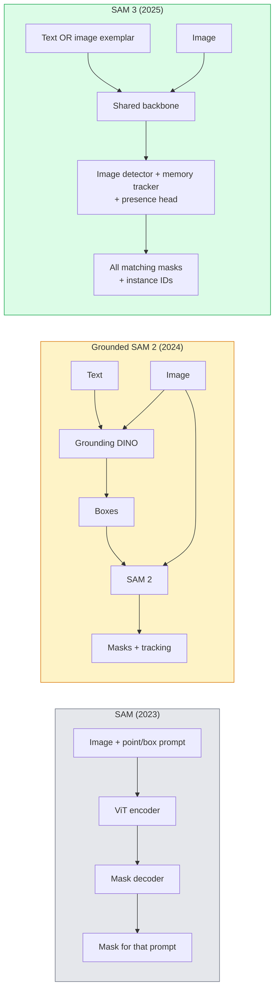

# SAM 3와 개방형 어휘 분할 (SAM 3 & Open-Vocabulary Segmentation)

> 모델(model)에 텍스트 프롬프트(prompt)와 이미지를 주면, 일치하는 모든 객체에 대한 마스크(mask)를 얻는다. SAM 3는 그것을 단 한 번의 순방향 패스(forward pass)로 만들었다.

**Type:** Use + Build
**Languages:** Python
**Prerequisites:** Phase 4 Lesson 07 (U-Net), Phase 4 Lesson 08 (Mask R-CNN), Phase 4 Lesson 18 (CLIP)
**Time:** ~60분

## 학습 목표 (Learning Objectives)

- SAM(시각 프롬프트만), Grounded SAM / SAM 2(검출기 + SAM), SAM 3(프롬프트 가능 개념 분할(Promptable Concept Segmentation)을 통한 네이티브 텍스트 프롬프트)를 구별하기
- SAM 3 아키텍처를 설명하기: 공유 백본(backbone) + 이미지 검출기 + 메모리 기반 비디오 트래커(tracker) + 존재 헤드(presence head) + 분리된 검출기-트래커 설계
- 텍스트 프롬프트 검출, 분할, 비디오 추적에 Hugging Face `transformers` SAM 3 통합을 사용하기
- 지연 시간(latency), 개념 복잡도, 배포(deployment) 대상에 따라 SAM 3, Grounded SAM 2, YOLO-World, SAM-MI 중에서 고르기

## 문제 (The Problem)

2023년 SAM은 시각 프롬프트 전용 모델이었다. 점 하나를 클릭하거나 박스를 그리면 마스크를 반환한다. "이 사진의 모든 오렌지를 줘"를 위해서는 박스를 만드는 검출기(Grounding DINO)가 필요했고, 그다음 SAM이 각각을 분할했다. Grounded SAM이 이것을 파이프라인(pipeline)으로 만들었지만, 그것은 불가피한 오차 누적을 가진 동결된(frozen) 모델 두 개의 종속(cascade)이었다.

SAM 3(Meta, 2025년 11월, ICLR 2026)는 그 종속을 무너뜨렸다. 짧은 명사구(noun phrase)나 이미지 예시(exemplar)를 프롬프트로 받아, 일치하는 모든 마스크와 인스턴스(instance) ID를 단 한 번의 순방향 패스로 반환한다. 그것이 **프롬프트 가능 개념 분할(Promptable Concept Segmentation, PCS)** 이다. 2026년 3월 객체 멀티플렉스(Object Multiplex) 업데이트(SAM 3.1)와 결합하면, 같은 개념의 여러 인스턴스를 비디오 전체에서 효율적으로 추적한다.

이 레슨은 이것이 나타내는 구조적 전환에 관한 것이다. 2D 분할, 검출, 텍스트-이미지 그라운딩(grounding)이 하나의 모델로 합쳐졌다. 프로덕션(production) 질문은 더 이상 "어떤 파이프라인을 엮을까"가 아니라 "어떤 프롬프트 가능 모델이 내 사용 사례를 엔드투엔드(end-to-end)로 처리하는가"이다.

## 개념 (The Concept)

### 세 세대



### 프롬프트 가능 개념 분할

"개념 프롬프트(concept prompt)"는 짧은 명사구(`"yellow school bus"`, `"striped red umbrella"`, `"hand holding a mug"`)나 이미지 예시다. 모델은 이미지에서 그 개념과 일치하는 모든 인스턴스에 대한 분할 마스크와, 일치마다 고유한 인스턴스 ID를 반환한다.

이는 고전적인 시각 프롬프트 SAM과 세 가지 면에서 다르다:

1. 인스턴스별 프롬프트가 필요 없다 — 텍스트 프롬프트 하나가 모든 일치를 반환한다.
2. 개방형 어휘(open-vocabulary) — 개념은 자연어로 서술 가능한 무엇이든 될 수 있다.
3. 프롬프트당 마스크 하나가 아니라 여러 인스턴스를 한 번에 반환한다.

### 핵심 아키텍처 조각들

- **공유 백본(Shared backbone)** — 단일 ViT가 이미지를 처리한다. 검출기 헤드와 메모리 기반 트래커 둘 다 그것에서 읽는다.
- **존재 헤드(Presence head)** — 개념이 이미지에 아예 존재하는지를 예측한다. "이게 여기 있나?"를 "어디에 있나?"에서 분리한다. 부재하는 개념에 대한 거짓 양성(false positive)을 줄인다.
- **분리된 검출기-트래커(Decoupled detector-tracker)** — 이미지 수준 검출과 비디오 수준 추적이 서로 간섭하지 않도록 별도 헤드를 가진다.
- **메모리 뱅크(Memory bank)** — 비디오 추적을 위해 프레임 전체에 걸쳐 인스턴스별 특성(feature)을 저장한다(SAM 2가 쓴 것과 같은 메커니즘).

### 대규모 학습

SAM 3는 AI + 사람 리뷰를 사용해 반복적으로 주석을 달고 교정하는 데이터 엔진이 생성한 **400만 개의 고유 개념**으로 학습되었다. 새로운 **SA-CO 벤치마크(benchmark)** 는 27만 개의 고유 개념을 담으며, 이전 벤치마크보다 50배 크다. SAM 3는 SA-CO에서 사람 성능의 75-80%에 도달하며, 이미지 + 비디오 PCS에서 기존 시스템을 두 배로 능가한다.

### SAM 3.1 객체 멀티플렉스

2026년 3월 업데이트: **객체 멀티플렉스(Object Multiplex)** 는 같은 개념의 여러 인스턴스를 한 번에 공동 추적하기 위한 공유 메모리 메커니즘을 도입한다. 이전에는 N개 인스턴스를 추적하려면 N개의 별도 메모리 뱅크가 필요했다. 멀티플렉스는 그것을 인스턴스별 질의(query)를 가진 하나의 공유 메모리로 무너뜨린다. 결과: 정확도를 희생하지 않으면서 다중 객체 추적이 상당히 빨라진다.

### 2026년에도 Grounded SAM이 여전히 중요한 경우

- 특정 개방형 어휘 검출기(DINO-X, Florence-2)를 교체해 넣어야 할 때.
- SAM 3 라이선스(HF에서 게이트됨)가 걸림돌일 때.
- SAM 3가 노출하는 것보다 검출기 임계값을 더 제어해야 할 때.
- 검출기 구성요소에 대한 연구 / 절제(ablation) 작업.

모듈식 파이프라인은 여전히 자리가 있다. 대부분의 프로덕션 작업에는 SAM 3가 더 단순한 답이다.

### YOLO-World vs SAM 3

- **YOLO-World** — 개방형 어휘 검출기만(마스크 없음). 실시간. 높은 fps로 박스가 필요할 때 최선.
- **SAM 3** — 전체 분할 + 추적. 더 느리지만 더 풍부한 출력.

프로덕션 구분: 빠른 검출 전용 파이프라인(로봇 내비게이션, 빠른 대시보드)에는 YOLO-World, 마스크나 추적이 필요한 무엇에든 SAM 3.

### SAM-MI 효율성

SAM-MI(2025-2026)는 SAM의 디코더(decoder) 병목을 다룬다. 핵심 아이디어:

- **희소 점 프롬프트(Sparse point prompting)** — 조밀한 프롬프트 대신 잘 고른 몇 개의 점을 쓴다; 디코더 호출을 96% 줄인다.
- **얕은 마스크 집계(Shallow mask aggregation)** — 거친 마스크 예측들을 하나의 더 선명한 마스크로 병합한다.
- **분리된 마스크 주입(Decoupled mask injection)** — 디코더가 다시 실행하는 대신 미리 계산된 마스크 특성을 받는다.

결과: 개방형 어휘 벤치마크에서 Grounded-SAM 대비 약 1.6배 가속.

### 세 모델의 출력 형식

모두 같은 일반 구조(박스 + 레이블(label) + 점수 + 마스크 + ID)를 반환하는데, 이는 유용하다 — 다운스트림 파이프라인이 어느 모델이 실행되었는지에 따라 분기할 필요가 없다.

## 직접 만들기 (Build It)

### 1단계: 프롬프트 구성

사용자 문장을 SAM 3 개념 프롬프트 리스트로 바꾸는 헬퍼를 만든다. 이것은 "사용자가 입력한 것"이 "모델이 소비하는 것"을 만나는 경계다.

```python
def split_concepts(sentence):
    """
    Heuristic splitter for multi-concept prompts.
    Returns list of short noun phrases.
    """
    for sep in [",", ";", "and", "or", "&"]:
        if sep in sentence:
            parts = [p.strip() for p in sentence.replace("and ", ",").split(",")]
            return [p for p in parts if p]
    return [sentence.strip()]

print(split_concepts("cats, dogs and balloons"))
```

SAM 3는 순방향 패스당 하나의 개념을 받는다. 다중 개념 질의의 경우, 반복하거나 배치(batch)로 처리한다.

### 2단계: 후처리 헬퍼

SAM 3의 원시 출력을 우리의 Phase 4 Lesson 16 파이프라인 계약(pipeline contract)에 맞는 깔끔한 검출 리스트로 바꾼다.

```python
from dataclasses import dataclass
from typing import List

@dataclass
class ConceptDetection:
    concept: str
    instance_id: int
    box: tuple          # (x1, y1, x2, y2)
    score: float
    mask_rle: str       # run-length encoded


def rle_encode(binary_mask):
    flat = binary_mask.flatten().astype("uint8")
    runs = []
    prev, count = flat[0], 0
    for v in flat:
        if v == prev:
            count += 1
        else:
            runs.append((int(prev), count))
            prev, count = v, 1
    runs.append((int(prev), count))
    return ";".join(f"{v}x{c}" for v, c in runs)
```

RLE는 여러 고해상도 마스크에 대해서도 응답 페이로드(payload)를 작게 유지한다. 같은 형식이 SAM 2, SAM 3, Grounded SAM 2 전반에서 동작한다.

### 3단계: 통일된 개방형 어휘 분할 인터페이스

가진 백엔드가 무엇이든(SAM 3, Grounded SAM 2, YOLO-World + SAM 2) 단일 메서드 뒤에 감싼다. 백엔드가 바뀌어도 다운스트림 코드는 바뀌지 않는다.

```python
from abc import ABC, abstractmethod
import numpy as np

class OpenVocabSeg(ABC):
    @abstractmethod
    def detect(self, image: np.ndarray, concept: str) -> List[ConceptDetection]:
        ...


class StubOpenVocabSeg(OpenVocabSeg):
    """
    Deterministic stub used for pipeline testing when real models are not loaded.
    """
    def detect(self, image, concept):
        h, w = image.shape[:2]
        return [
            ConceptDetection(
                concept=concept,
                instance_id=0,
                box=(w * 0.2, h * 0.3, w * 0.5, h * 0.8),
                score=0.89,
                mask_rle="0x100;1x50;0x200",
            ),
            ConceptDetection(
                concept=concept,
                instance_id=1,
                box=(w * 0.55, h * 0.25, w * 0.85, h * 0.75),
                score=0.74,
                mask_rle="0x80;1x40;0x220",
            ),
        ]
```

실제 `SAM3OpenVocabSeg` 서브클래스는 `transformers.Sam3Model`과 `Sam3Processor`를 감쌀 것이다.

### 4단계: Hugging Face SAM 3 사용법 (참조)

실제 모델의 경우, `transformers` 통합:

```python
from transformers import Sam3Processor, Sam3Model
import torch

processor = Sam3Processor.from_pretrained("facebook/sam3")
model = Sam3Model.from_pretrained("facebook/sam3").eval()

inputs = processor(images=pil_image, return_tensors="pt")
inputs = processor.set_text_prompt(inputs, "yellow school bus")

with torch.no_grad():
    outputs = model(**inputs)

masks = processor.post_process_masks(
    outputs.masks, inputs.original_sizes, inputs.reshaped_input_sizes
)
boxes = outputs.boxes
scores = outputs.scores
```

프롬프트 하나로, 모든 일치가 단일 호출에서 반환된다.

### 5단계: Grounded SAM 2가 공짜로 준 것을 측정하기

정직한 벤치마크: 실제 파이프라인에서 Grounded SAM 2를 SAM 3로 교체하면 무슨 일이 일어나는가?

- 지연 시간: SAM 3는 순방향 패스 하나를 절약하지만(별도 검출기 없음) 모델 자체가 더 무겁다; 보통 순(net)으로 중립이거나 약간의 가속.
- 정확도: SAM 3가 드물거나 조합적(compositional)인 개념("striped red umbrella")에서 상당히 더 낫다. 흔한 단일 단어 개념에서는 비슷하다.
- 유연성: Grounded SAM 2는 검출기를 교체하게 해준다(DINO-X, Florence-2, Grounding DINO 1.5); SAM 3는 단일체(monolithic)다.

결론: SAM 3가 2026년 개방형 어휘 분할의 기본값이다. 검출기 유연성이나 다른 라이선스 조건이 필요할 때는 Grounded SAM 2가 여전히 올바른 답이다.

## 라이브러리로 써보기 (Use It)

프로덕션 배포 패턴:

- **실시간 주석** — SAM 3 + CVAT의 라벨-as-텍스트-프롬프트 기능. 주석자가 라벨 이름을 선택하면; SAM 3가 일치하는 모든 인스턴스에 미리 라벨을 단다. 검토하고 교정한다.
- **비디오 분석** — 다중 객체 추적을 위한 SAM 3.1 객체 멀티플렉스; 프레임을 메모리 기반 트래커에 공급한다.
- **로봇공학** — 개방형 어휘 조작("빨간 컵을 집어라")을 위한 SAM 3; 계획 프리미티브(planning primitive)로 실행된다.
- **의료 영상** — 의료 개념에 파인튜닝(fine-tune)한 SAM 3; HF에서 접근 요청이 필요하다.

Ultralytics는 SAM 3를 자신의 Python 패키지로 감싼다:

```python
from ultralytics import SAM

model = SAM("sam3.pt")
results = model(image_path, prompts="yellow school bus")
```

YOLO 및 SAM 2와 같은 인터페이스다.

## 산출물 (Ship It)

이 레슨은 다음을 만든다:

- `outputs/prompt-open-vocab-stack-picker.md` — 지연 시간, 개념 복잡도, 라이선스에 따라 SAM 3 / Grounded SAM 2 / YOLO-World / SAM-MI를 고르는 프롬프트.
- `outputs/skill-concept-prompt-designer.md` — 사용자 발화를 잘 형성된 SAM 3 개념 프롬프트로 바꾸는(분할, 모호성 해소, 폴백(fallback)) 스킬.

## 연습 문제 (Exercises)

1. **(쉬움)** 당신이 고른 개념 프롬프트로 10장의 이미지에 SAM 3를 실행하라. 같은 이미지에서 SAM 2 + Grounding DINO 1.5와 비교하라. 각 모델이 놓친 개념을 보고하라.
2. **(중간)** SAM 3 위에 "포함하려면 클릭 / 제외하려면 클릭" UI를 만들라: 텍스트 프롬프트가 후보 인스턴스를 반환하고; 사용자가 클릭하여 어느 것을 양성으로 셀지 유지한다. 최종 개념 집합을 JSON으로 출력하라.
3. **(어려움)** 사용자 지정 개념 집합(예: 전자 부품 5종)에 대해 각각 20장의 라벨된 이미지로 SAM 3를 파인튜닝하라. 같은 테스트 집합에서 제로샷(zero-shot) SAM 3와 비교하라; 마스크 IoU 향상을 측정하라.

## 핵심 용어 (Key Terms)

| 용어 | 사람들이 말하는 것 | 실제 의미 |
|------|----------------|----------------------|
| 개방형 어휘 분할(Open-vocabulary segmentation) | "텍스트로 분할" | 고정된 레이블 집합이 아니라 자연어로 서술된 객체에 대한 마스크를 생성 |
| PCS | "프롬프트 가능 개념 분할" | SAM 3의 핵심 과제 — 명사구나 이미지 예시가 주어지면, 일치하는 모든 인스턴스를 분할 |
| 개념 프롬프트(Concept prompt) | "텍스트 입력" | 짧은 명사구나 이미지 예시; 완전한 문장이 아님 |
| 존재 헤드(Presence head) | "이게 여기 있나?" | 위치 추정 전에 이미지에 개념이 존재하는지 결정하는 SAM 3 모듈 |
| SA-CO | "SAM 3 벤치마크" | 27만 개념 개방형 어휘 분할 벤치마크; 이전 개방형 어휘 벤치마크보다 50배 큼 |
| 객체 멀티플렉스(Object Multiplex) | "SAM 3.1 업데이트" | 공유 메모리 다중 객체 추적; 여러 인스턴스의 빠른 공동 추적 |
| Grounded SAM 2 | "모듈식 파이프라인" | 검출기 + SAM 2 종속; 검출기 교체가 중요할 때 여전히 유효 |
| SAM-MI | "효율적인 SAM 변형" | Grounded-SAM 대비 1.6배 가속을 위한 마스크 주입(Mask Injection) |

## 더 읽을거리 (Further Reading)

- [SAM 3: Segment Anything with Concepts (arXiv 2511.16719)](https://arxiv.org/abs/2511.16719)
- [SAM 3.1 Object Multiplex (Meta AI, March 2026)](https://ai.meta.com/blog/segment-anything-model-3/)
- [SAM 3 model page on Hugging Face](https://huggingface.co/facebook/sam3)
- [Grounded SAM 2 tutorial (PyImageSearch)](https://pyimagesearch.com/2026/01/19/grounded-sam-2-from-open-set-detection-to-segmentation-and-tracking/)
- [Ultralytics SAM 3 docs](https://docs.ultralytics.com/models/sam-3/)
- [SAM3-I: Instruction-aware SAM (arXiv 2512.04585)](https://arxiv.org/abs/2512.04585)
