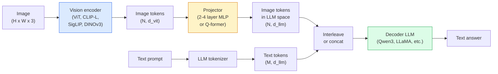

# 비전-언어 모델 — ViT-MLP-LLM 패턴 (Vision-Language Models — The ViT-MLP-LLM Pattern)

> 비전 인코더(vision encoder)는 이미지를 토큰(token)으로 변환한다. MLP 프로젝터(projector)는 그 토큰들을 LLM의 임베딩(embedding) 공간으로 매핑한다. 언어 모델(language model)이 나머지를 한다. 그 패턴 — ViT-MLP-LLM — 이 2026년의 모든 프로덕션(production) VLM이다.

**Type:** Learn + Use
**Languages:** Python
**Prerequisites:** Phase 4 Lesson 14 (ViT), Phase 4 Lesson 18 (CLIP), Phase 7 Lesson 02 (Self-Attention)
**Time:** ~75분

## 학습 목표 (Learning Objectives)

- ViT-MLP-LLM 아키텍처를 말하고 세 구성요소 각각이 무엇을 기여하는지 설명하기
- Qwen3-VL, InternVL3.5, LLaVA-Next, GLM-4.6V를 파라미터(parameter) 수, 컨텍스트 길이, 벤치마크(benchmark) 성능으로 비교하기
- DeepStack을 설명하기: 다중 수준 ViT 특성(feature)이 왜 단일 마지막 층(layer) 특성보다 비전-언어 정렬(alignment)을 더 단단하게 하는지
- 교차 모달 오차율(Cross-Modal Error Rate, CMER)로 프로덕션에서 VLM 환각(hallucination)을 측정하고 그 신호에 따라 행동하기

## 문제 (The Problem)

CLIP(Phase 4 Lesson 18)은 이미지와 텍스트에 대한 공유 임베딩 공간을 주며, 이는 제로샷(zero-shot) 분류(classification)와 검색(retrieval)에는 충분하다. 하지만 CLIP은 텍스트를 생성하지 않기 때문에 "이 이미지에 빨간 차가 몇 대 있나?"에는 답할 수 없다 — 유사도를 점수 매길 뿐이다.

비전-언어 모델(Vision-Language Models, VLMs) — Qwen3-VL, InternVL3.5, LLaVA-Next, GLM-4.6V — 은 CLIP 계열 이미지 인코더(encoder)를 완전한 언어 모델에 볼트로 결합한다. 모델(model)은 이미지와 질문을 보고 답을 생성한다. 2026년 오픈소스 VLM은 멀티모달(multimodal) 벤치마크(MMMU, MMBench, DocVQA, ChartQA, MathVista, OSWorld)에서 GPT-5와 Gemini-2.5-Pro와 맞먹거나 능가한다.

세 조각의 삼인조(ViT, 프로젝터, LLM)가 표준이다. 모델 간의 차이는 어느 ViT, 어느 프로젝터, 어느 LLM, 학습 데이터, 정렬 레시피에 있다. 일단 패턴을 이해하면, 어느 구성요소든 교체하는 것은 기계적이다.

## 개념 (The Concept)

### ViT-MLP-LLM 아키텍처



1. **비전 인코더(Vision encoder)** — 사전 학습된(pretrained) ViT(CLIP-L/14, SigLIP, DINOv3, 또는 파인튜닝(fine-tune)한 변형). 패치(patch) 토큰을 만든다.
2. **프로젝터(Projector)** — 비전 토큰을 LLM의 임베딩 차원으로 매핑하는 작은 모듈(2-4층 MLP, 또는 Q-former). 대부분의 파인튜닝이 여기서 일어난다.
3. **LLM** — 디코더 전용(decoder-only) 언어 모델(Qwen3, Llama, Mistral, GLM, InternLM). 비전 + 텍스트 토큰을 순서대로 읽고 텍스트를 생성한다.

세 조각 모두 원칙적으로 학습 가능하다. 실제로는, 프로젝터가 학습하는 동안 비전 인코더와 LLM은 대부분 동결된(frozen) 채로 둔다 — 적은 비용으로 수십억 파라미터의 신호를 얻는다.

### DeepStack

평범한 투영(projection)은 마지막 ViT 층만 쓴다. DeepStack(Qwen3-VL)은 여러 ViT 깊이에서 특성을 샘플링하여 쌓는다. 더 깊은 층은 고수준 의미론(semantics)을 운반하고; 더 얕은 층은 세밀한 공간적·질감적 정보를 운반한다. 둘 다 LLM에 공급하면 "이미지에 무엇이 들어 있는가"(의미론)와 "정확히 어디에"(공간 그라운딩(grounding)) 사이의 간격을 메운다.

### 세 가지 학습 단계

현대 VLM은 단계적으로 학습한다:

1. **정렬(Alignment)** — ViT와 LLM을 동결한다. 이미지-캡션 쌍에 대해 프로젝터만 학습한다. 프로젝터가 비전 공간을 언어 공간으로 매핑하도록 가르친다.
2. **사전 학습(Pre-training)** — 모든 것을 동결 해제한다. 대규모 교차(interleaved) 이미지-텍스트 데이터(5억+ 쌍)에 대해 학습한다. 모델의 시각 지식을 쌓는다.
3. **명령어 튜닝(Instruction tuning)** — 큐레이션된 (이미지, 질문, 답) 세 쌍에 파인튜닝한다. 대화 행동과 과제 형식을 가르친다. 이것이 "비전 인식 LM"을 쓸 만한 어시스턴트로 바꾼다.

대부분의 LoRA 파인튜닝은 작은 라벨된 데이터셋(dataset)으로 3단계를 겨냥한다.

### 모델 계열 비교 (2026년 초)

| 모델 | 파라미터 | 비전 인코더 | LLM | 컨텍스트 | 강점 |
|-------|--------|----------------|-----|---------|-----------|
| Qwen3-VL-235B-A22B (MoE) | 235B (22B 활성) | 커스텀 ViT + DeepStack | Qwen3 | 256K | 범용 SOTA, GUI 에이전트 |
| Qwen3-VL-30B-A3B (MoE) | 30B (3B 활성) | 커스텀 ViT + DeepStack | Qwen3 | 256K | 더 작은 MoE 대안 |
| Qwen3-VL-8B (밀집형) | 8B | 커스텀 ViT | Qwen3 | 128K | 프로덕션 밀집형 기본값 |
| InternVL3.5-38B | 38B | InternViT-6B | Qwen3 + GPT-OSS | 128K | 강력한 MMBench / MMVet |
| InternVL3.5-241B-A28B | 241B (28B 활성) | InternViT-6B | Qwen3 | 128K | GPT-4o와 경쟁력 |
| LLaVA-Next 72B | 72B | SigLIP | Llama-3 | 32K | 오픈, 파인튜닝 쉬움 |
| GLM-4.6V | ~70B | 커스텀 | GLM | 64K | 오픈소스, 강력한 OCR |
| MiniCPM-V-2.6 | 8B | SigLIP | MiniCPM | 32K | 엣지(edge) 친화적 |

### 시각 에이전트

Qwen3-VL-235B는 GUI(데스크톱, 모바일, 웹)를 작동시키는 **시각 에이전트(visual agent)** 벤치마크인 OSWorld에서 세계 최고 성능에 도달한다. 모델은 스크린샷을 보고, UI를 이해하고, 동작(클릭, 입력, 스크롤)을 방출한다. 도구(tool)와 결합하면 흔한 데스크톱 작업에서 루프를 닫는다. 이것이 대부분의 2026년 "AI PC" 데모가 내부에서 돌리는 것이다.

### 에이전트 역량 + RoPE 변형

VLM은 프레임이 비디오에서 **언제**인지 알아야 한다. Qwen3-VL은 T-RoPE(시간적 회전 위치 임베딩(temporal rotary position embeddings))에서 **텍스트 기반 시간 정렬(text-based time alignment)** 로 진화했다 — 비디오 프레임과 교차된 명시적 타임스탬프 텍스트 토큰. 모델은 "`<timestamp 00:32>` frame, prompt"를 보고 시간적 관계에 대해 추론할 수 있다.

### 정렬 문제

크롤링된 데이터셋의 이미지-텍스트 쌍 중 12%는 이미지에 완전히 그라운딩되지 않은 설명을 담는다. 이것으로 학습된 VLM은 조용히 환각하는 법을 배운다 — 객체를 날조하고, 숫자를 잘못 읽고, 관계를 발명한다. 프로덕션에서 이것이 지배적인 실패 양상이다.

Skywork.ai는 이를 추적하기 위해 **교차 모달 오차율(Cross-Modal Error Rate, CMER)** 을 도입했다:

```
CMER = fraction of outputs where the text confidence is high but the image-text similarity (via a CLIP-family checker) is low
```

높은 CMER은 모델이 이미지에 그라운딩되지 않은 것을 자신 있게 말하고 있다는 뜻이다. CMER을 모니터링하고 그것을 프로덕션 KPI로 다루면 그들의 배포(deployment)에서 환각률이 약 35% 줄었다. 비결은 "모델을 고치는 것"이 아니라 "높은 CMER 출력을 사람 검토로 라우팅하는 것"이다.

### LoRA / QLoRA로 파인튜닝

70B VLM의 전체 파인튜닝은 대부분의 팀에게 닿지 않는다. 어텐션(attention) + 프로젝터 층에 LoRA(랭크 16-64), 또는 4비트 베이스 가중치(weight)를 쓰는 QLoRA는 단일 A100 / H100에 맞는다. 비용: 5,000-50,000개 예시, 컴퓨팅 $100-$5,000, 학습 2-10시간.

### 공간 추론은 여전히 약하다

현재 VLM은 공간 추론 벤치마크(위-아래, 왼쪽-오른쪽, 세기, 거리)에서 50-60%를 기록한다. 사용 사례가 "어느 객체가 어느 것 위에 있나"에 의존한다면 강하게 검증하라 — 일반 VLM 성능은 사람 이하다. 순수 공간 작업에 대한 VLM보다 나은 대안: 전문 키포인트(keypoint) / 포즈 추정기, 깊이(depth) 모델, 또는 박스 기하를 후처리한 검출 모델.

## 직접 만들기 (Build It)

### 1단계: 프로젝터

가장 자주 학습할 부분이다. GELU를 쓰는 2-4층 MLP.

```python
import torch
import torch.nn as nn


class Projector(nn.Module):
    def __init__(self, vit_dim=768, llm_dim=4096, hidden=4096):
        super().__init__()
        self.net = nn.Sequential(
            nn.Linear(vit_dim, hidden),
            nn.GELU(),
            nn.Linear(hidden, llm_dim),
        )

    def forward(self, x):
        return self.net(x)
```

입력은 `(N_patches, d_vit)` 토큰 텐서(tensor)다. 출력은 `(N_patches, d_llm)`이다. LLM은 모든 출력 행을 또 하나의 토큰으로 다룬다.

### 2단계: ViT-MLP-LLM 엔드투엔드 조립

최소 VLM을 위한 순방향 패스의 골격이다. 실제 코드는 `transformers`를 쓴다; 이것은 개념적 배치다.

```python
class MinimalVLM(nn.Module):
    def __init__(self, vit, projector, llm, image_token_id):
        super().__init__()
        self.vit = vit
        self.projector = projector
        self.llm = llm
        self.image_token_id = image_token_id  # placeholder token in text prompt

    def forward(self, image, input_ids, attention_mask):
        # 1. vision features
        vision_tokens = self.vit(image)                     # (B, N_patches, d_vit)
        vision_embeds = self.projector(vision_tokens)       # (B, N_patches, d_llm)

        # 2. text embeddings
        text_embeds = self.llm.get_input_embeddings()(input_ids)  # (B, M, d_llm)

        # 3. replace image placeholder tokens with vision embeds
        merged = self._merge(text_embeds, vision_embeds, input_ids)

        # 4. run LLM
        return self.llm(inputs_embeds=merged, attention_mask=attention_mask)

    def _merge(self, text_embeds, vision_embeds, input_ids):
        out = text_embeds.clone()
        expected = vision_embeds.size(1)
        for b in range(input_ids.size(0)):
            positions = (input_ids[b] == self.image_token_id).nonzero(as_tuple=True)[0]
            if len(positions) != expected:
                raise ValueError(
                    f"batch item {b} has {len(positions)} image tokens but vision_embeds has {expected} patches."
                    " Every sample in the batch must be pre-padded to the same number of image placeholder tokens.")
            out[b, positions] = vision_embeds[b]
        return out
```

텍스트의 `<image>` 플레이스홀더 토큰이 실제 이미지 임베딩으로 대체된다 — LLaVA, Qwen-VL, InternVL이 쓰는 것과 같은 패턴이다.

### 3단계: CMER 계산

가벼운 런타임 검사.

```python
import torch.nn.functional as F


def cross_modal_error_rate(image_emb, text_emb, text_confidence, sim_threshold=0.25, conf_threshold=0.8):
    """
    image_emb, text_emb: embeddings of image and generated text (normalised internally)
    text_confidence:     mean per-token probability in [0, 1]
    Returns:             fraction of high-confidence outputs with low image-text alignment
    """
    image_emb = F.normalize(image_emb, dim=-1)
    text_emb = F.normalize(text_emb, dim=-1)
    sim = (image_emb * text_emb).sum(dim=-1)        # cosine similarity
    high_conf_low_sim = (text_confidence > conf_threshold) & (sim < sim_threshold)
    return high_conf_low_sim.float().mean().item()
```

CMER을 프로덕션 KPI로 다뤄라. 엔드포인트별, 프롬프트 유형별, 고객별로 모니터링하라. CMER 상승은 모델이 어떤 입력 분포에서 환각하기 시작했음을 나타낸다.

### 4단계: 장난감 VLM 분류기 (실행 가능)

프로젝터가 학습됨을 보여준다. 가짜 "ViT 특성"이 들어가고; 작은 LLM 스타일 토큰이 클래스를 예측한다.

```python
class ToyVLM(nn.Module):
    def __init__(self, vit_dim=32, llm_dim=64, num_classes=5):
        super().__init__()
        self.projector = Projector(vit_dim, llm_dim, hidden=64)
        self.head = nn.Linear(llm_dim, num_classes)

    def forward(self, vision_tokens):
        projected = self.projector(vision_tokens)
        pooled = projected.mean(dim=1)
        return self.head(pooled)
```

이것을 합성 (특성, 클래스) 쌍에 200 스텝 미만으로 적합할 수 있다 — 프로젝터 패턴이 동작함을 보여주기에 충분하다.

## 라이브러리로 써보기 (Use It)

2026년 프로덕션 팀이 VLM을 쓰는 세 가지 방법:

- **호스팅 API** — OpenAI Vision, Anthropic Claude Vision, Google Gemini Vision. 인프라 제로, 벤더 리스크.
- **오픈소스 자체 호스팅** — `transformers`와 `vllm`을 통한 Qwen3-VL 또는 InternVL3.5. 완전한 제어, 더 높은 초기 노력.
- **도메인에 파인튜닝** — Qwen2.5-VL-7B 또는 LLaVA-1.6-7B를 로드하고, 5k-50k 커스텀 예시에 LoRA, `vllm` 또는 `TGI`로 서빙.

```python
from transformers import AutoProcessor, AutoModelForVision2Seq
import torch
from PIL import Image

model_id = "Qwen/Qwen3-VL-8B-Instruct"
processor = AutoProcessor.from_pretrained(model_id)
model = AutoModelForVision2Seq.from_pretrained(model_id, torch_dtype=torch.bfloat16, device_map="auto")

messages = [{
    "role": "user",
    "content": [
        {"type": "image", "image": Image.open("plot.png")},
        {"type": "text", "text": "What does this chart show?"},
    ],
}]
inputs = processor.apply_chat_template(messages, add_generation_prompt=True, tokenize=True, return_dict=True, return_tensors="pt").to("cuda")
generated = model.generate(**inputs, max_new_tokens=256)
answer = processor.decode(generated[0][inputs["input_ids"].shape[1]:], skip_special_tokens=True)
```

`apply_chat_template`은 `<image>` 플레이스홀더 토큰화를 감춘다; 모델이 병합을 내부적으로 처리한다.

## 산출물 (Ship It)

이 레슨은 다음을 만든다:

- `outputs/prompt-vlm-selector.md` — 정확도, 지연 시간(latency), 컨텍스트 길이, 예산에 따라 Qwen3-VL / InternVL3.5 / LLaVA-Next / API를 고른다.
- `outputs/skill-cmer-monitor.md` — 프로덕션 VLM 엔드포인트를 교차 모달 오차율, 엔드포인트별 대시보드, 경보 임계값으로 계측하는 코드를 방출한다.

## 연습 문제 (Exercises)

1. **(쉬움)** 임의의 오픈 VLM을 통해 다섯 장의 이미지에 세 프롬프트("이게 뭐야?", "객체를 세어줘", "장면을 묘사해줘")를 실행하라. 각 답을 손으로 정답 / 부분 정답 / 환각으로 점수 매겨라. 1차 CMER 유사 비율을 계산하라.
2. **(중간)** 캡션이 달린 타깃 도메인 이미지 500장에 LoRA(랭크 16)로 Qwen2.5-VL-3B 또는 LLaVA-1.6-7B를 파인튜닝하라. 제로샷 대 파인튜닝한 MMBench 스타일 정확도를 비교하라.
3. **(어려움)** VLM의 이미지 인코더를 기본 SigLIP/CLIP 대신 DINOv3로 교체하라. 프로젝터만 재학습하라(동결된 LLM + 동결된 DINOv3). 밀집 예측(dense-prediction) 작업(세기, 공간 추론)이 개선되는지 측정하라.

## 핵심 용어 (Key Terms)

| 용어 | 사람들이 말하는 것 | 실제 의미 |
|------|----------------|----------------------|
| ViT-MLP-LLM | "VLM 패턴" | 비전 인코더 + 프로젝터 + 언어 모델; 2026년의 모든 VLM |
| 프로젝터(Projector) | "다리" | 비전 토큰을 LLM 임베딩 공간으로 매핑하는 2-4층 MLP(또는 Q-former) |
| DeepStack | "Qwen3-VL 특성 비법" | 마지막 층만이 아니라 다중 수준 ViT 특성을 쌓음 |
| 이미지 토큰(Image token) | "<image> 플레이스홀더" | 투영된 비전 임베딩으로 대체되는 텍스트 스트림 속 특수 토큰 |
| CMER | "환각 KPI" | 교차 모달 오차율; 텍스트 신뢰도는 높지만 이미지-텍스트 유사도가 낮을 때 높음 |
| 시각 에이전트(Visual agent) | "클릭하는 VLM" | 도구 호출로 GUI(OSWorld, 모바일, 웹)를 작동시키는 VLM |
| Q-former | "고정 개수 토큰 다리" | 고정된 수의 시각 질의 토큰을 만드는 BLIP-2 스타일 프로젝터 |
| 정렬 / 사전 학습 / 명령어 튜닝(Alignment / pre-training / instruction tuning) | "세 단계" | 표준 VLM 학습 파이프라인 |

## 더 읽을거리 (Further Reading)

- [Qwen3-VL Technical Report (arXiv 2511.21631)](https://arxiv.org/abs/2511.21631)
- [InternVL3.5 Advancing Open-Source Multimodal Models (arXiv 2508.18265)](https://arxiv.org/html/2508.18265v1)
- [LLaVA-Next series](https://llava-vl.github.io/blog/2024-05-10-llava-next-stronger-llms/)
- [BentoML: Best Open-Source VLMs 2026](https://www.bentoml.com/blog/multimodal-ai-a-guide-to-open-source-vision-language-models)
- [MMMU: Multi-discipline Multimodal Understanding benchmark](https://mmmu-benchmark.github.io/)
- [VLMs in manufacturing (Robotics Tomorrow, March 2026)](https://www.roboticstomorrow.com/story/2026/03/when-machines-learn-to-see-like-experts-the-rise-of-vision-language-models-in-manufacturing/26335/)
