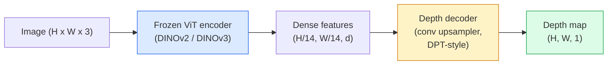

# 단안 깊이와 기하 추정 (Monocular Depth & Geometry Estimation)

> 깊이 맵(depth map)은 각 픽셀이 카메라로부터의 거리인 단일 채널 이미지다. 하나의 RGB 프레임에서 그것을 예측하는 일은 한때 스테레오(stereo)나 LiDAR 없이는 불가능했다. 2026년에는 동결된(frozen) ViT 인코더(encoder)에 가벼운 헤드를 더하면 정답(ground truth)의 몇 퍼센트 이내까지 도달한다.

**Type:** Build + Use
**Languages:** Python
**Prerequisites:** Phase 4 Lesson 14 (ViT), Phase 4 Lesson 17 (Self-Supervised Vision), Phase 4 Lesson 07 (U-Net)
**Time:** ~60분

## 학습 목표 (Learning Objectives)

- 상대 깊이(relative depth)와 메트릭 깊이(metric depth)를 구별하고 각 프로덕션(production) 모델(MiDaS, Marigold, Depth Anything V3, ZoeDepth)이 어느 쪽을 푸는지 말하기
- Depth Anything V3(DINOv2 백본(backbone))를 사용해 보정(calibration) 없이 임의의 단일 이미지에 대한 깊이를 예측하기
- 단안(monocular) 깊이가 단일 이미지에서 도대체 왜 작동하는지(원근 단서, 질감 그래디언트(gradient), 학습된 사전(prior))와 그것이 복원할 수 없는 것(절대 스케일, 가려진 기하)을 설명하기
- 깊이 맵과 핀홀 카메라(pinhole camera) 내부 파라미터(intrinsics)를 사용해 2D 검출을 3D 점으로 끌어올리기(lift)

## 문제 (The Problem)

깊이는 2D 컴퓨터 비전(computer vision)에서 빠진 축이다. RGB가 주어지면, 사물이 이미지 평면 어디에 나타나는지는 안다; 얼마나 멀리 있는지는 모른다. 깊이 센서(스테레오 리그, LiDAR, 비행 시간(time-of-flight))는 이를 직접 풀지만 비싸고, 깨지기 쉽고, 범위가 제한된다.

단안 깊이 추정(monocular depth estimation) — 단일 RGB 프레임에서 깊이를 예측하는 것 — 은 한때 흐릿하고 신뢰할 수 없는 출력을 냈다. 2026년까지 대형 사전 학습된(pretrained) 인코더가 그것을 바꿨다. Depth Anything V3는 동결된 DINOv2 백본을 쓰고, 실내, 실외, 의료, 위성 도메인에 걸쳐 일반화되는 깊이 맵을 만든다. Marigold는 깊이를 조건부 디퓨전(conditional diffusion) 문제로 재구성한다. ZoeDepth는 참 메트릭 거리를 회귀(regression)한다.

깊이는 또한 2D 검출과 3D 이해 사이의 다리다. 검출된 박스의 픽셀에 깊이를 곱하면 2D 객체를 3D 점 구름(point cloud)으로 끌어올린다. 그것이 모든 AR 가림(occlusion) 시스템, 모든 장애물 회피 파이프라인(pipeline), 모든 "컵을 집어라" 로봇의 핵심이다.

## 개념 (The Concept)

### 상대 깊이 vs 메트릭 깊이

- **상대 깊이(Relative depth)** — 실세계 단위 없는 순서가 매겨진 `z` 값. "픽셀 A가 픽셀 B보다 가깝지만, 거리의 비율은 미터에 고정되어 있지 않다."
- **메트릭 깊이(Metric depth)** — 카메라로부터의 미터 단위 절대 거리. 모델이 이미지 단서와 실제 거리 사이의 통계적 관계를 학습했어야 한다.

MiDaS와 Depth Anything V3는 상대 깊이를 만든다. Marigold는 상대 깊이를 만든다. ZoeDepth, UniDepth, Metric3D는 메트릭 깊이를 만든다. 메트릭 모델은 카메라 내부 파라미터에 민감하다; 상대 모델은 그렇지 않다.

### 인코더-디코더 패턴



Depth Anything V3는 인코더를 동결하고 DPT 스타일 디코더(decoder)만 학습한다. 인코더는 풍부한 특성(feature)을 제공하고; 디코더는 그것들을 이미지 해상도로 다시 보간(interpolate)하여 깊이를 회귀한다.

### 단일 이미지가 도대체 왜 깊이를 만드는가

2D 이미지는 깊이와 상관된 많은 단안 단서를 담는다:

- **원근(Perspective)** — 3D의 평행선이 2D에서 수렴한다.
- **질감 그래디언트(Texture gradient)** — 멀리 있는 표면은 더 작고 더 조밀한 질감을 가진다.
- **가림 순서(Occlusion order)** — 더 가까운 객체가 더 먼 것을 가린다.
- **크기 항상성(Size constancy)** — 알려진 객체(자동차, 사람)가 대략적인 스케일을 준다.
- **대기 원근(Atmospheric perspective)** — 실외 장면에서 먼 객체는 더 흐릿하고 더 푸르게 보인다.

수십억 장의 이미지로 학습된 ViT는 이 단서들을 내재화한다. 충분한 데이터와 강한 백본이 있으면, 단안 깊이는 명시적 3D 감독 없이도 합리적인 정확도에 도달한다.

### 단안 깊이가 할 수 없는 것

- 내부 파라미터나 장면 속 알려진 객체 없이는 **절대 메트릭 스케일**. 신경망(network)은 컵이 1 m인지 10 m인지 모른 채 "컵이 숟가락보다 두 배 멀다"를 예측할 수 있다.
- **가려진 기하** — 의자의 뒷면은 보이지 않으며 신뢰성 있게 추론될 수 없다.
- **진정으로 질감 없거나 반사적인 표면** — 거울, 유리, 균일한 벽. 신경망은 그럴듯하지만 틀린 깊이를 보고한다.

### 2026년의 Depth Anything V3

- 평범한 DINOv2 ViT-L/14를 인코더로(동결).
- DPT 디코더.
- 다양한 출처의 포즈가 있는(posed) 이미지 쌍으로 학습(광도 일관성(photometric consistency) 외에 명시적 깊이 감독이 필요 없음).
- **알려진 카메라 포즈가 있든 없든, 임의 개수의 시각 입력**으로부터 공간적으로 일관된 기하를 예측한다.
- 단안 깊이, 임의 시점 기하, 시각 렌더링, 카메라 포즈 추정 전반에서 SOTA.

이것이 2026년에 깊이가 필요할 때 호출할 드롭인(drop-in) 모델이다.

### Marigold — 깊이를 위한 디퓨전

Marigold(Ke et al., CVPR 2024)는 깊이 추정을 조건부 이미지-투-이미지 디퓨전으로 재구성한다. 조건화(conditioning): RGB. 타깃: 깊이 맵. 사전 학습된 Stable Diffusion 2 U-Net을 백본으로 쓴다. 출력 깊이 맵은 객체 경계에서 유난히 선명하다. 트레이드오프(trade-off): 순방향(feed-forward) 모델보다 느린 추론(10-50 디노이징 스텝).

### 내부 파라미터와 핀홀 카메라

깊이 `d`를 가진 픽셀 `(u, v)`를 카메라 좌표의 3D 점 `(X, Y, Z)`로 끌어올리려면:

```
fx, fy, cx, cy = camera intrinsics
X = (u - cx) * d / fx
Y = (v - cy) * d / fy
Z = d
```

내부 파라미터는 EXIF 메타데이터, 보정 패턴, 또는 단안 내부 파라미터 추정기(Perspective Fields, UniDepth)에서 온다. 내부 파라미터 없이도, 60-70° FOV와 적당한 해상도의 주점(principals)을 가정하여 점 구름을 렌더링할 수 있다 — 시각화에는 쓸 만하지만 측정에는 아니다.

### 평가

두 표준 메트릭:

- **AbsRel** (절대 상대 오차): `mean(|d_pred - d_gt| / d_gt)`. 낮을수록 좋다. 프로덕션 모델은 0.05-0.1.
- **delta < 1.25** (임계값 정확도): `max(d_pred/d_gt, d_gt/d_pred) < 1.25`인 픽셀의 비율. 높을수록 좋다. SOTA는 0.9+.

상대 깊이(Depth Anything V3, MiDaS)의 경우, 평가는 두 메트릭의 스케일·이동 불변(scale-and-shift invariant) 버전을 쓴다.

## 직접 만들기 (Build It)

### 1단계: 깊이 메트릭

```python
import torch

def abs_rel_error(pred, target, mask=None):
    if mask is not None:
        pred = pred[mask]
        target = target[mask]
    return (torch.abs(pred - target) / target.clamp(min=1e-6)).mean().item()


def delta_accuracy(pred, target, threshold=1.25, mask=None):
    if mask is not None:
        pred = pred[mask]
        target = target[mask]
    ratio = torch.maximum(pred / target.clamp(min=1e-6), target / pred.clamp(min=1e-6))
    return (ratio < threshold).float().mean().item()
```

평가 전에 항상 유효하지 않은 깊이 픽셀(0, NaN, 포화(saturated))을 마스킹하라.

### 2단계: 스케일·이동 정렬

상대 깊이 모델의 경우, 메트릭을 계산하기 전에 예측을 정답에 정렬한다. `a * pred + b = target`의 최소 제곱 적합(least-squares fit):

```python
def align_scale_shift(pred, target, mask=None):
    if mask is not None:
        p = pred[mask]
        t = target[mask]
    else:
        p = pred.flatten()
        t = target.flatten()
    A = torch.stack([p, torch.ones_like(p)], dim=1)
    coeffs, *_ = torch.linalg.lstsq(A, t.unsqueeze(-1))
    a, b = coeffs[:2, 0]
    return a * pred + b
```

MiDaS / Depth Anything을 평가할 때 `abs_rel_error` 전에 `align_scale_shift`를 실행하라.

### 3단계: 깊이를 점 구름으로 끌어올리기

```python
import numpy as np

def depth_to_point_cloud(depth, intrinsics):
    H, W = depth.shape
    fx, fy, cx, cy = intrinsics
    v, u = np.meshgrid(np.arange(H), np.arange(W), indexing="ij")
    z = depth
    x = (u - cx) * z / fx
    y = (v - cy) * z / fy
    return np.stack([x, y, z], axis=-1)


depth = np.random.uniform(0.5, 4.0, (240, 320))
intr = (320.0, 320.0, 160.0, 120.0)
pc = depth_to_point_cloud(depth, intr)
print(f"point cloud shape: {pc.shape}  (H, W, 3)")
```

함수 하나, 모든 3D 끌어올리기 애플리케이션. 점 구름을 `.ply`로 내보내고 MeshLab 또는 CloudCompare에서 열어라.

### 4단계: 합성 깊이 장면으로 스모크 테스트

```python
def synthetic_depth(size=96):
    yy, xx = np.meshgrid(np.arange(size), np.arange(size), indexing="ij")
    # Floor: linear gradient from near (top) to far (bottom)
    depth = 1.0 + (yy / size) * 4.0
    # Box in the middle: closer
    mask = (np.abs(xx - size / 2) < size / 6) & (np.abs(yy - size * 0.6) < size / 6)
    depth[mask] = 2.0
    return depth.astype(np.float32)


gt = torch.from_numpy(synthetic_depth(96))
pred = gt + 0.3 * torch.randn_like(gt)  # simulated prediction
aligned = align_scale_shift(pred, gt)
print(f"before align  absRel = {abs_rel_error(pred, gt):.3f}")
print(f"after align   absRel = {abs_rel_error(aligned, gt):.3f}")
```

### 5단계: Depth Anything V3 사용법 (참조)

```python
import torch
from transformers import pipeline
from PIL import Image

pipe = pipeline(task="depth-estimation", model="LiheYoung/depth-anything-v2-large")

image = Image.open("street.jpg").convert("RGB")
out = pipe(image)
depth_np = np.array(out["depth"])
```

세 줄이다. `out["depth"]`는 PIL 그레이스케일이다; 수학을 위해 numpy로 변환한다. Depth Anything V3의 경우, 출시되면 모델 id를 교체한다; API는 변하지 않는다.

## 라이브러리로 써보기 (Use It)

- **Depth Anything V3** (Meta AI / ByteDance, 2024-2026) — 상대 깊이의 기본값. 프로덕션에서 가장 빠른 ViT-라지 백본 모델.
- **Marigold** (ETH, 2024) — 가장 높은 시각 품질, 느린 추론.
- **UniDepth** (ETH, 2024) — 카메라 내부 파라미터 추정을 갖춘 메트릭 깊이.
- **ZoeDepth** (Intel, 2023) — 메트릭 깊이; 더 오래됨, 여전히 신뢰성 있음.
- **MiDaS v3.1** — 레거시지만 안정적; 비교에 좋은 베이스라인(baseline).

전형적 통합 패턴:

1. RGB 프레임이 도착한다.
2. 깊이 모델이 깊이 맵을 만든다.
3. 검출기가 박스를 만든다.
4. 박스 중심을 깊이를 통해 3D로 끌어올린다; 가능하면 점 구름과 병합한다.
5. 다운스트림: AR 가림, 경로 계획, 객체 크기 추정, 스테레오 대체.

실시간 사용의 경우, Depth Anything V2 Small(INT8 양자화)은 518x518에서 소비자 GPU로 약 30 fps에 도달한다.

## 산출물 (Ship It)

이 레슨은 다음을 만든다:

- `outputs/prompt-depth-model-picker.md` — 지연 시간(latency), 메트릭 대 상대 필요, 장면 유형에 따라 Depth Anything V3, Marigold, UniDepth, MiDaS 중에서 고른다.
- `outputs/skill-depth-to-pointcloud.md` — 올바른 내부 파라미터 처리와 `.ply` 내보내기로 깊이 맵에서 점 구름을 만드는 스킬.

## 연습 문제 (Exercises)

1. **(쉬움)** 당신의 책상 이미지 아무 10장에 Depth Anything V2를 실행하라. 깊이를 그레이스케일 PNG로 저장하고 검사하라. 예측 깊이가 틀려 보이는 객체 하나를 찾아 단안 단서가 왜 실패했는지 설명하라.
2. **(중간)** Depth Anything V2의 RGB + 깊이가 주어지면, 점 구름으로 끌어올리고 `open3d`로 렌더링하라. 두 장면(실내 / 실외)을 비교하고 어느 쪽이 더 그럴듯해 보이는지 적어라.
3. **(어려움)** 알려진 객체의 위치만 다른 이미지 다섯 쌍을 찍어라(예: 병이 30 cm 더 가까이 이동). UniDepth를 사용해 둘 다에 대해 메트릭 깊이를 예측하라. 예측된 거리 차이 대 참값 30 cm를 보고하라.

## 핵심 용어 (Key Terms)

| 용어 | 사람들이 말하는 것 | 실제 의미 |
|------|----------------|----------------------|
| 단안 깊이(Monocular depth) | "단일 이미지 깊이" | 스테레오나 LiDAR 없이 하나의 RGB 프레임에서 깊이 추정 |
| 상대 깊이(Relative depth) | "순서가 매겨진 깊이" | 실세계 단위 없는 순서가 매겨진 z 값 |
| 메트릭 깊이(Metric depth) | "절대 거리" | 미터 단위 깊이; 보정 또는 메트릭 감독으로 학습된 모델이 필요 |
| AbsRel | "절대 상대 오차" | |d_pred - d_gt| / d_gt의 평균; 표준 깊이 메트릭 |
| Delta 정확도(Delta accuracy) | "delta < 1.25" | 정답의 25% 이내 예측을 가진 픽셀의 비율 |
| 핀홀 카메라(Pinhole camera) | "fx, fy, cx, cy" | (u, v, d)를 (X, Y, Z)로 끌어올리는 데 쓰는 카메라 모델 |
| DPT | "밀집 예측 트랜스포머(Dense Prediction Transformer)" | 깊이를 위해 동결된 ViT 인코더 위에 쓰는 합성곱(convolution) 기반 디코더 |
| DINOv2 백본(DINOv2 backbone) | "작동하는 이유" | 깊이 레이블 없이 도메인에 걸쳐 일반화되는 자기 지도(self-supervised) 특성 |

## 더 읽을거리 (Further Reading)

- [Depth Anything V3 paper page](https://depth-anything.github.io/) — DINOv2 인코더를 갖춘 SOTA 단안 깊이
- [Marigold (Ke et al., CVPR 2024)](https://marigoldmonodepth.github.io/) — 디퓨전 기반 깊이 추정
- [UniDepth (Piccinelli et al., 2024)](https://arxiv.org/abs/2403.18913) — 내부 파라미터를 갖춘 메트릭 깊이
- [MiDaS v3.1 (Intel ISL)](https://github.com/isl-org/MiDaS) — 정석적인 상대 깊이 베이스라인
- [DINOv3 blog post (Meta)](https://ai.meta.com/blog/dinov3-self-supervised-vision-model/) — 깊이 정확도를 끌어올리는 인코더 계열
