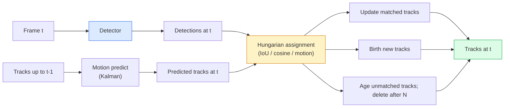

# 다중 객체 추적과 비디오 메모리 (Multi-Object Tracking & Video Memory)

> 추적(tracking)은 검출(detection)에 연결(association)을 더한 작업이다. 매 프레임을 검출하고, 이번 프레임의 검출을 지난 프레임의 트랙(track)에 ID로 매칭한다.

**Type:** Build
**Languages:** Python
**Prerequisites:** Phase 4 Lesson 06 (YOLO Detection), Phase 4 Lesson 08 (Mask R-CNN), Phase 4 Lesson 24 (SAM 3)
**Time:** ~60분

## 학습 목표 (Learning Objectives)

- 검출 기반 추적(tracking-by-detection)과 질의 기반 추적(query-based tracking)을 구별하고 알고리즘 계열(SORT, DeepSORT, ByteTrack, BoT-SORT, SAM 2 메모리 트래커, SAM 3.1 객체 멀티플렉스)의 이름을 말하기
- 고전적 검출 기반 추적을 위한 IoU + 헝가리안(Hungarian) 할당을 밑바닥부터 구현하기
- SAM 2의 메모리 뱅크(memory bank)와 그것이 왜 IoU 기반 연결보다 가림(occlusion)을 더 잘 처리하는지 설명하기
- 세 가지 추적 메트릭(MOTA, IDF1, HOTA)을 읽고 주어진 사용 사례에 어느 것이 중요한지 고르기

## 문제 (The Problem)

검출기는 객체가 단일 프레임에서 어디에 있는지 알려준다. 트래커는 프레임 `t`의 어느 검출이 프레임 `t-1`의 검출과 같은 객체인지 알려준다. 트래커가 없으면 선을 넘는 객체를 셀 수도, 가림을 통과하는 공을 따라갈 수도, "차 #4가 8초 동안 차선에 있었다"를 알 수도 없다.

추적은 비디오를 다루는 모든 제품에 필수다. 스포츠 분석, 감시, 자율주행, 의료 비디오 분석, 야생동물 모니터링, 통과량 세기. 핵심 구성 블록은 공유된다. 프레임별 검출기, 운동 모델(칼만 필터(Kalman filter) 또는 더 풍부한 것), 연결 단계(IoU / 코사인 / 학습된 특성에 대한 헝가리안 알고리즘), 트랙 생애주기(탄생, 갱신, 죽음).

2026년은 두 가지 새 패턴을 가져왔다. **SAM 2 메모리 기반 추적**(운동 모델 연결 대신 특성-메모리)과 **SAM 3.1 객체 멀티플렉스**(같은 개념의 여러 인스턴스(instance)를 위한 공유 메모리). 이 레슨은 먼저 고전적 스택을 살펴보고, 그다음 메모리 기반 접근법을 살펴본다.

## 개념 (The Concept)

### 검출 기반 추적



2026년에 마주칠 모든 트래커는 이 루프의 변형이다. 차이점:

- **SORT** (2016): 칼만 필터 + IoU 헝가리안. 단순, 빠름, 외형 모델 없음.
- **DeepSORT** (2017): SORT + 트랙별 CNN 기반 외형 특성(ReID 임베딩(embedding)). 교차를 더 잘 처리.
- **ByteTrack** (2021): 저신뢰도 검출을 두 번째 단계로 연결; 외형 특성이 필요 없지만 MOT17에서 최상위 성능.
- **BoT-SORT** (2022): Byte + 카메라 운동 보상 + ReID.
- **StrongSORT / OC-SORT** — 더 나은 운동과 외형을 가진 ByteTrack 후손.

### 칼만 필터 한 문단 요약

칼만 필터는 공분산(covariance)과 함께 트랙별 상태 `(x, y, w, h, dx, dy, dw, dh)`를 유지한다. 각 프레임에서 등속도 모델로 상태를 **예측(predict)** 한 다음, 매칭된 검출로 **갱신(update)** 한다. 갱신은 예측 불확실성이 높을 때 검출을 더 신뢰한다. 이렇게 하면 궤적이 매끄러워지고, 짧은 가림(1-5 프레임)을 통과해 트랙을 이어갈 수 있다.

모든 고전적 트래커는 운동 예측 단계에서 칼만 필터를 쓴다.

### 헝가리안 알고리즘

`M x N` 비용 행렬(트랙 x 검출)이 주어지면 총 비용을 최소화하는 일대일 할당을 찾는다. 비용은 보통 `1 - IoU(track_bbox, detection_bbox)`이거나 외형 특성의 음의 코사인 유사도다. 실행 시간은 O((M+N)^3); M, N이 약 1000까지면 `scipy.optimize.linear_sum_assignment`를 통해 Python에서 충분히 빠르다.

### ByteTrack의 핵심 아이디어

표준 트래커는 저신뢰도 검출(< 0.5)을 떨군다. ByteTrack은 그것들을 **두 번째 단계 후보**로 남겨둔다. 트랙을 고신뢰도 검출에 매칭한 후, 매칭되지 않은 트랙은 약간 더 느슨한 IoU 임계값으로 저신뢰도 검출과 매칭을 시도한다. 짧은 가림과 군중 근처의 ID 전환을 복구한다.

### SAM 2 메모리 기반 추적

SAM 2는 인스턴스별 시공간 특성의 **메모리 뱅크**를 유지하며 비디오를 처리한다. 한 프레임에 대한 프롬프트(prompt, 클릭, 박스, 텍스트)가 주어지면 인스턴스를 메모리로 인코딩한다. 이후 프레임에서는 메모리가 새 프레임의 특성에 대해 교차 어텐션(cross-attended)되고, 디코더가 새 프레임에서 같은 인스턴스에 대한 마스크(mask)를 만든다.

칼만 필터 없음, 헝가리안 할당 없음. 연결은 메모리 어텐션 연산에 암묵적으로 들어 있다.

장점:
- 큰 가림에 강건함(메모리가 많은 프레임에 걸쳐 인스턴스 정체성을 운반).
- SAM 3의 텍스트 프롬프트와 결합하면 개방형 어휘(open-vocabulary).
- 별도 운동 모델 없이 동작.

단점:
- 다중 객체 추적에서 ByteTrack보다 느림.
- 메모리 뱅크가 커짐; 컨텍스트 윈도우(context window)를 제한.

### SAM 3.1 객체 멀티플렉스

이전 SAM 2 / SAM 3 추적은 인스턴스마다 별도 메모리 뱅크를 유지한다. 50개 객체면 메모리 뱅크 50개. 객체 멀티플렉스(2026년 3월)는 그것들을 **인스턴스별 질의 토큰(per-instance query token)** 을 가진 하나의 공유 메모리로 합친다. 비용은 인스턴스 수에 대해 부선형(sub-linear)으로 확장된다.

멀티플렉스는 2026년 군중 추적의 새 기본값이다. 콘서트 군중, 창고 작업자, 교통 교차로.

### 알아야 할 세 메트릭

- **MOTA (Multi-Object Tracking Accuracy)** — 1 - (FN + FP + ID 전환) / GT. 오차 유형으로 가중; 검출과 연결 실패를 뒤섞는 단일 메트릭.
- **IDF1 (ID F1)** — ID 정밀도와 재현율의 조화 평균. 각 정답(ground-truth) 트랙이 시간에 걸쳐 ID를 얼마나 잘 유지하는지에 특별히 초점. ID 전환에 민감한 작업에 MOTA보다 낫다.
- **HOTA (Higher Order Tracking Accuracy)** — 검출 정확도(DetA)와 연결 정확도(AssA)로 분해. 2020년 이래 커뮤니티 표준; 가장 포괄적.

감시(누가 누구인가)에는 IDF1을 보고한다. 스포츠 분석(패스 세기)에는 HOTA. 일반적 학술 비교에도 HOTA.

## 직접 만들기 (Build It)

### 1단계: IoU 기반 비용 행렬

```python
import numpy as np


def bbox_iou(a, b):
    """
    a, b: (N, 4) arrays of [x1, y1, x2, y2].
    Returns (N_a, N_b) IoU matrix.
    """
    ax1, ay1, ax2, ay2 = a[:, 0], a[:, 1], a[:, 2], a[:, 3]
    bx1, by1, bx2, by2 = b[:, 0], b[:, 1], b[:, 2], b[:, 3]
    inter_x1 = np.maximum(ax1[:, None], bx1[None, :])
    inter_y1 = np.maximum(ay1[:, None], by1[None, :])
    inter_x2 = np.minimum(ax2[:, None], bx2[None, :])
    inter_y2 = np.minimum(ay2[:, None], by2[None, :])
    inter = np.clip(inter_x2 - inter_x1, 0, None) * np.clip(inter_y2 - inter_y1, 0, None)
    area_a = (ax2 - ax1) * (ay2 - ay1)
    area_b = (bx2 - bx1) * (by2 - by1)
    union = area_a[:, None] + area_b[None, :] - inter
    return inter / np.clip(union, 1e-8, None)
```

### 2단계: 최소 SORT 스타일 트래커

고정 등속도 칼만은 간결함을 위해 생략하고 여기서는 단순 IoU 연결을 쓴다; 프로덕션(production)에서는 칼만 예측이 필수다. `sort` Python 패키지가 전체 버전을 제공한다.

```python
from scipy.optimize import linear_sum_assignment


class Track:
    def __init__(self, tid, bbox, frame):
        self.id = tid
        self.bbox = bbox
        self.last_frame = frame
        self.hits = 1

    def update(self, bbox, frame):
        self.bbox = bbox
        self.last_frame = frame
        self.hits += 1


class SimpleTracker:
    def __init__(self, iou_threshold=0.3, max_age=5):
        self.tracks = []
        self.next_id = 1
        self.iou_threshold = iou_threshold
        self.max_age = max_age

    def step(self, detections, frame):
        if not self.tracks:
            for d in detections:
                self.tracks.append(Track(self.next_id, d, frame))
                self.next_id += 1
            return [(t.id, t.bbox) for t in self.tracks]

        track_boxes = np.array([t.bbox for t in self.tracks])
        det_boxes = np.array(detections) if len(detections) else np.empty((0, 4))

        iou = bbox_iou(track_boxes, det_boxes) if len(det_boxes) else np.zeros((len(track_boxes), 0))
        cost = 1 - iou
        cost[iou < self.iou_threshold] = 1e6

        matched_track = set()
        matched_det = set()
        if cost.size > 0:
            row, col = linear_sum_assignment(cost)
            for r, c in zip(row, col):
                if cost[r, c] < 1.0:
                    self.tracks[r].update(det_boxes[c], frame)
                    matched_track.add(r); matched_det.add(c)

        for i, d in enumerate(det_boxes):
            if i not in matched_det:
                self.tracks.append(Track(self.next_id, d, frame))
                self.next_id += 1

        self.tracks = [t for t in self.tracks if frame - t.last_frame <= self.max_age]
        return [(t.id, t.bbox) for t in self.tracks]
```

60줄. 프레임별 검출을 받아 프레임별 트랙 ID를 반환한다. 실제 시스템은 칼만 예측, ByteTrack의 두 번째 단계 재매칭, 외형 특성을 추가한다.

### 3단계: 합성 궤적 테스트

```python
def synthetic_frames(num_frames=20, num_objects=3, H=240, W=320, seed=0):
    rng = np.random.default_rng(seed)
    starts = rng.uniform(20, 200, size=(num_objects, 2))
    velocities = rng.uniform(-5, 5, size=(num_objects, 2))
    frames = []
    for f in range(num_frames):
        dets = []
        for i in range(num_objects):
            cx, cy = starts[i] + f * velocities[i]
            dets.append([cx - 10, cy - 10, cx + 10, cy + 10])
        frames.append(dets)
    return frames


tracker = SimpleTracker()
for f, dets in enumerate(synthetic_frames()):
    tracks = tracker.step(dets, f)
```

직선으로 움직이는 세 객체는 20 프레임 전체에 걸쳐 ID를 유지해야 한다.

### 4단계: ID 전환 메트릭

```python
def count_id_switches(tracks_per_frame, gt_per_frame):
    """
    tracks_per_frame:  list of list of (track_id, bbox)
    gt_per_frame:      list of list of (gt_id, bbox)
    Returns number of ID switches.
    """
    prev_assignment = {}
    switches = 0
    for tracks, gts in zip(tracks_per_frame, gt_per_frame):
        if not tracks or not gts:
            continue
        t_boxes = np.array([b for _, b in tracks])
        g_boxes = np.array([b for _, b in gts])
        iou = bbox_iou(g_boxes, t_boxes)
        for g_idx, (gt_id, _) in enumerate(gts):
            j = iou[g_idx].argmax()
            if iou[g_idx, j] > 0.5:
                t_id = tracks[j][0]
                if gt_id in prev_assignment and prev_assignment[gt_id] != t_id:
                    switches += 1
                prev_assignment[gt_id] = t_id
    return switches
```

이것은 단순화된 IDF1 인접 메트릭이다. 정답 객체가 자신에게 할당된 예측 트랙 ID를 몇 번 바꾸는지 센다. 실제 MOTA / IDF1 / HOTA 도구는 `py-motmetrics`와 `TrackEval`에 있다.

## 라이브러리로 써보기 (Use It)

2026년의 프로덕션 트래커:

- `ultralytics` — YOLOv8 + ByteTrack / BoT-SORT 내장. `results = model.track(source, tracker="bytetrack.yaml")`. 기본값.
- `supervision` (Roboflow) — ByteTrack 래퍼와 주석 유틸리티.
- SAM 2 / SAM 3.1 — `processor.track()`을 통한 메모리 기반 추적.
- 커스텀 스택: 검출기(YOLOv8 / RT-DETR) + `sort-tracker` / `OC-SORT` / `StrongSORT`.

선택:

- 30+ fps의 보행자 / 자동차 / 박스: **ultralytics와 ByteTrack**.
- 군중 속 한 클래스의 여러 인스턴스: **SAM 3.1 객체 멀티플렉스**.
- 식별 가능한 외형을 가진 심한 가림: **DeepSORT / StrongSORT** (ReID 특성).
- 스포츠 / 복잡한 상호작용: **BoT-SORT** 또는 학습된 트래커(MOTRv3).

## 산출물 (Ship It)

이 레슨은 다음을 만든다:

- `outputs/prompt-tracker-picker.md` — 장면 유형, 가림 패턴, 지연 시간(latency) 예산에 따라 SORT / ByteTrack / BoT-SORT / SAM 2 / SAM 3.1을 고른다.
- `outputs/skill-mot-evaluator.md` — 정답 트랙에 대한 MOTA / IDF1 / HOTA의 완전한 평가 하니스(harness)를 작성한다.

## 연습 문제 (Exercises)

1. **(쉬움)** 위의 합성 트래커를 3, 10, 30개 객체로 실행하라. 각 경우의 ID 전환 횟수를 보고하라. 단순 IoU만의 연결이 실패하기 시작하는 지점을 찾아라.
2. **(중간)** 연결 전에 등속도 칼만 예측 단계를 추가하라. 짧은(2-3 프레임) 가림이 더 이상 ID 전환을 일으키지 않음을 보여라.
3. **(어려움)** SAM 2의 메모리 기반 트래커(`transformers`를 통해)를 대체 트래커 백엔드로 통합하라. 군중의 30초 클립에 SimpleTracker와 SAM 2를 둘 다 실행하고 ID 전환 횟수를 비교하라. 눈에 띄는 5명에 대해 정답 ID를 수동으로 라벨링하라.

## 핵심 용어 (Key Terms)

| 용어 | 사람들이 말하는 것 | 실제 의미 |
|------|----------------|----------------------|
| 검출 기반 추적(Tracking-by-detection) | "검출 후 연결" | 프레임별 검출기 + IoU / 외형에 대한 헝가리안 할당 |
| 칼만 필터(Kalman filter) | "운동 예측" | 매끄러운 트랙 예측과 가림 처리를 위한 선형 동역학 + 공분산 |
| 헝가리안 알고리즘(Hungarian algorithm) | "최적 할당" | 최소 비용 이분 매칭 문제를 푼다; `scipy.optimize.linear_sum_assignment` |
| ByteTrack | "저신뢰도 두 번째 패스" | 매칭되지 않은 트랙을 저신뢰도 검출에 재매칭하여 짧은 가림을 복구 |
| DeepSORT | "SORT + 외형" | 프레임 간 매칭을 위한 ReID 특성을 추가; ID 보존에 더 나음 |
| 메모리 뱅크(Memory bank) | "SAM 2 비법" | 프레임에 걸쳐 저장된 인스턴스별 시공간 특성; 교차 어텐션이 명시적 연결을 대체 |
| 객체 멀티플렉스(Object Multiplex) | "SAM 3.1 공유 메모리" | 빠른 다중 객체 추적을 위한 인스턴스별 질의를 가진 단일 공유 메모리 |
| HOTA | "현대 추적 메트릭" | 검출 정확도와 연결 정확도로 분해; 커뮤니티 표준 |

## 더 읽을거리 (Further Reading)

- [SORT (Bewley et al., 2016)](https://arxiv.org/abs/1602.00763) — 최소 검출 기반 추적 논문
- [DeepSORT (Wojke et al., 2017)](https://arxiv.org/abs/1703.07402) — 외형 특성 추가
- [ByteTrack (Zhang et al., 2022)](https://arxiv.org/abs/2110.06864) — 저신뢰도 두 번째 패스
- [BoT-SORT (Aharon et al., 2022)](https://arxiv.org/abs/2206.14651) — 카메라 운동 보상
- [HOTA (Luiten et al., 2020)](https://arxiv.org/abs/2009.07736) — 분해된 추적 메트릭
- [SAM 2 video segmentation (Meta, 2024)](https://ai.meta.com/sam2/) — 메모리 기반 트래커
- [SAM 3.1 Object Multiplex (Meta, March 2026)](https://ai.meta.com/blog/segment-anything-model-3/)
