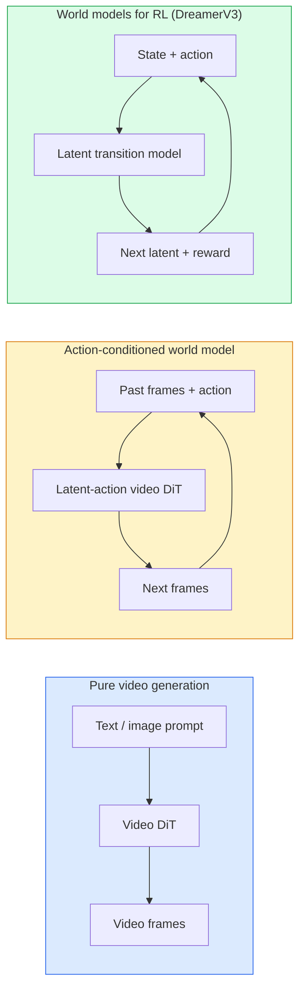

# 월드 모델과 비디오 디퓨전 (World Models & Video Diffusion)

> 장면의 다음 몇 초를 예측하는 비디오 모델(model)은 세계 시뮬레이터다. 그 예측을 동작(action)에 조건화하면 학습된 게임 엔진을 갖게 된다.

**Type:** Learn + Build
**Languages:** Python
**Prerequisites:** Phase 4 Lesson 10 (Diffusion), Phase 4 Lesson 12 (Video Understanding), Phase 4 Lesson 23 (DiT + Rectified Flow)
**Time:** ~75분

## 학습 목표 (Learning Objectives)

- 순수 비디오 생성 모델(Sora 2)과 동작 조건부 월드 모델(action-conditioned world model)(Genie 3, DreamerV3)의 차이를 설명하기
- 비디오 DiT를 서술하기: 시공간 패치(spatio-temporal patch), 3D 위치 인코딩(position encoding), (T, H, W) 토큰(token) 전반의 결합 어텐션(joint attention)
- 월드 모델이 로봇공학에 어떻게 연결되는지 추적하기: VLM 계획 → 비디오 모델 시뮬레이션 → 역동역학(inverse dynamics)이 동작을 방출
- 주어진 사용 사례(창작 비디오, 상호작용 시뮬레이션, 자율주행 합성)에 대해 Sora 2, Genie 3, Runway GWM-1 Worlds, Wan-Video, HunyuanVideo 중에서 고르기

## 문제 (The Problem)

비디오 생성과 월드 모델링은 2026년에 수렴했다. 일관된 1분 비디오를 생성할 수 있는 모델은, 어떤 의미에서 세계가 어떻게 움직이는지를 배운 것이다. 객체 영속성(object permanence), 중력, 인과성, 스타일. 그 예측을 동작(왼쪽으로 걷기, 문 열기)에 조건화하면, 비디오 모델은 게임 엔진, 운전 시뮬레이터, 또는 로봇공학 환경을 대체할 수 있는 학습 가능한 시뮬레이터가 된다.

판돈은 구체적이다. Genie 3는 단일 이미지에서 플레이 가능한 환경을 생성한다. Runway GWM-1 Worlds는 무한히 탐색 가능한 장면을 합성한다. Sora 2는 동기화된 오디오와 모델링된 물리를 가진 1분 길이 비디오를 만든다. NVIDIA Cosmos-Drive, Wayve Gaia-2, Tesla DrivingWorld는 자율주행 차량 학습(training) 데이터를 위한 사실적인 운전 비디오를 생성한다. 월드 모델 패러다임은 로봇공학의 시뮬레이션-투-리얼(sim-to-real)을 조용히 장악하고 있다.

이 레슨은 Phase 4의 "큰 그림" 레슨이다. 이미지 생성, 비디오 이해, 에이전트(agent) 추론을, 주류 연구가 향하고 있는 아키텍처 패턴으로 연결한다.

## 개념 (The Concept)

### 월드 모델링의 세 계열



- **Sora 2**는 프롬프트(prompt)에 조건화된 순수 비디오 생성이다. 동작 인터페이스가 없다. 롤아웃(rollout) 도중에 "조종"할 수 없다.
- **Genie 3**, **GWM-1 Worlds**, **Mirage / Magica**는 동작 조건부 월드 모델이다. 관측된 비디오에서 잠재 동작(latent action)을 추론한 다음, 미래 프레임 예측을 동작에 조건화한다. 상호작용적이다 — 키를 누르거나 카메라를 움직이면 장면이 반응한다.
- **DreamerV3**와 고전적 강화 학습(RL) 월드 모델 계열은 명시적 동작 조건화로 잠재(latent) 공간에서 예측하며, 보상(reward) 신호로 학습된다. 덜 시각적이고; 표본 효율적(sample-efficient) RL에 더 유용하다.

### 비디오 DiT 아키텍처

```
Video latent:          (C, T, H, W)
Patchify (spatial):    grid of P_h x P_w patches per frame
Patchify (temporal):   group P_t frames into a temporal patch
Resulting tokens:      (T / P_t) * (H / P_h) * (W / P_w) tokens
```

위치 인코딩은 3D다. (t, h, w) 좌표마다 회전(rotary) 또는 학습된 임베딩(embedding). 어텐션(attention)은 다음일 수 있다:

- **완전 결합(Full joint)** — 모든 토큰이 모든 토큰에 어텐션한다. N개 토큰에 대해 O(N^2). 긴 비디오에는 감당 불가.
- **분할(Divided)** — 시간 어텐션(같은 공간 위치, 시간 전반: `(H*W) * T^2`)과 공간 어텐션(같은 타임스텝, 공간 전반: `T * (H*W)^2`)을 번갈아 한다. TimeSformer와 대부분의 비디오 DiT가 쓴다.
- **윈도우(Window)** — (t, h, w)의 지역 윈도우. Video Swin이 쓴다.

모든 2026년 비디오 디퓨전(diffusion) 모델은 이 세 패턴 중 하나에 더해 AdaLN 조건화(Lesson 23)와 정류 흐름(rectified flow)을 쓴다.

### 동작에 조건화하기: 잠재 동작 모델

Genie는 연속된 프레임 쌍 사이의 동작을 판별적으로 예측하여 프레임마다 **잠재 동작**을 학습한다. 그러면 모델의 디코더(decoder)는 명시적 키보드 키가 아니라 추론된 잠재 동작에 조건화한다. 추론(inference) 시, 사용자는 잠재 동작을 지정(또는 새 사전(prior)에서 하나를 샘플링)할 수 있고, 모델은 그 동작과 일관된 다음 프레임을 생성한다.

Sora는 동작 인터페이스를 완전히 건너뛴다. 그 디코더는 과거 시공간 토큰에서 다음 시공간 토큰을 예측한다. 프롬프트가 시작을 조건화하고; 생성 도중에는 아무것도 조종하지 않는다.

### 물리적 그럴듯함

Sora 2의 2026년 출시는 **물리적 그럴듯함(physical plausibility)** 을 명시적으로 광고했다. 무게, 균형, 객체 영속성, 인과. 팀이 손으로 매긴 그럴듯함 점수로 측정했으며; 모델은 떨어지는 객체, 충돌하는 캐릭터, 의도된 실패(놓친 점프)에서 Sora 1 대비 눈에 띄게 개선된다.

그럴듯함은 여전히 지배적인 실패 양상이다. 2024-2025년에 스파게티를 먹거나 잔으로 마시는 사람의 비디오는 모델의 지속적 객체 표현 부재를 드러냈다. 2026년 모델(Sora 2, Runway Gen-5, HunyuanVideo)은 이것을 줄이지만 없애지는 못한다.

### 자율주행 월드 모델

운전 월드 모델은 궤적, 경계 상자(bounding box), 또는 내비게이션 지도에 조건화된 사실적 도로 장면을 생성한다. 용도:

- **Cosmos-Drive-Dreams** (NVIDIA) — RL 학습을 위한 몇 분 길이 운전 비디오를 생성.
- **Gaia-2** (Wayve) — 정책 평가를 위한 궤적 조건부 장면 합성.
- **DrivingWorld** (Tesla) — 다양한 날씨, 시간대, 교통 조건을 시뮬레이션.
- **Vista** (ByteDance) — 반응적 운전 장면 합성.

이것들은 코너 케이스(corner case) — 야간 무단횡단 보행자, 빙판 교차로, 특이한 차량 유형 — 에 대한 값비싼 실세계 데이터 수집을 대체한다. 그러지 않으면 수백만 마일의 운전이 필요할 것이다.

### 로봇공학 스택: VLM + 비디오 모델 + 역동역학

떠오르는 세 구성요소 로봇공학 루프:

1. **VLM**이 목표("빨간 컵을 집어라")를 파싱하고, 고수준 동작 시퀀스를 계획한다.
2. **비디오 생성 모델**이 각 동작을 실행하면 어떻게 보일지를 시뮬레이션한다 — N 프레임 앞의 관측을 예측한다.
3. **역동역학 모델(inverse dynamics model)** 이 그 관측을 만들어낼 구체적인 모터 명령을 추출한다.

이것은 보상 설계(reward shaping)와 표본을 많이 쓰는 RL을 대체한다. 월드 모델이 상상을 하고; 역동역학이 구동(actuation)에서 루프를 닫는다. Genie Envisioner가 하나의 구현이며; 많은 연구 그룹이 이 구조로 수렴하고 있다.

### 평가

- **시각 품질** — FVD(Fréchet Video Distance), 사용자 연구.
- **프롬프트 정렬** — 프레임별 CLIPScore, VQA 스타일 평가.
- **물리적 그럴듯함** — 벤치마크(benchmark) 스위트에서 손으로 매김(Sora 2의 내부 벤치마크, VBench).
- **제어 가능성(Controllability)** (상호작용 월드 모델의 경우) — 동작 → 관측 일관성; 이전 상태로 되돌아갈 수 있는가?

### 2026년 모델 지형

| 모델 | 용도 | 파라미터 | 출력 | 라이선스 |
|-------|-----|------------|--------|---------|
| Sora 2 | 텍스트-투-비디오, 오디오 | — | 1분 1080p + 오디오 | API 전용 |
| Runway Gen-5 | 텍스트/이미지-투-비디오 | — | 10초 클립 | API |
| Runway GWM-1 Worlds | 상호작용 월드 | — | 무한 3D 롤아웃 | API |
| Genie 3 | 이미지로부터 상호작용 월드 | 11B+ | 플레이 가능 프레임 | 연구 프리뷰 |
| Wan-Video 2.1 | 오픈 텍스트-투-비디오 | 14B | 고품질 클립 | 비상업용(non-commercial) |
| HunyuanVideo | 오픈 텍스트-투-비디오 | 13B | 10초 클립 | 관대함(permissive) |
| Cosmos / Cosmos-Drive | 자율주행 시뮬레이션 | 7-14B | 운전 장면 | NVIDIA 오픈 |
| Magica / Mirage 2 | AI 네이티브 게임 엔진 | — | 수정 가능 월드 | 제품 |

## 직접 만들기 (Build It)

### 1단계: 비디오를 위한 3D 패치화

```python
import torch
import torch.nn as nn


class VideoPatch3D(nn.Module):
    def __init__(self, in_channels=4, dim=64, patch_t=2, patch_h=2, patch_w=2):
        super().__init__()
        self.proj = nn.Conv3d(
            in_channels, dim,
            kernel_size=(patch_t, patch_h, patch_w),
            stride=(patch_t, patch_h, patch_w),
        )
        self.patch_t = patch_t
        self.patch_h = patch_h
        self.patch_w = patch_w

    def forward(self, x):
        # x: (N, C, T, H, W)
        x = self.proj(x)
        n, c, t, h, w = x.shape
        tokens = x.reshape(n, c, t * h * w).transpose(1, 2)
        return tokens, (t, h, w)
```

커널과 같은 스트라이드(stride)를 가진 3D 합성곱(convolution)이 시공간 패치화기 역할을 한다. `(T, H, W) -> (T/2, H/2, W/2)` 토큰 그리드.

### 2단계: 3D 회전 위치 인코딩

`t`, `h`, `w` 축을 따라 따로 적용되는 회전 위치 임베딩(Rotary Position Embeddings, RoPE):

```python
def rope_3d(tokens, t_dim, h_dim, w_dim, grid):
    """
    tokens: (N, T*H*W, D)
    grid: (T, H, W) sizes
    t_dim + h_dim + w_dim == D
    """
    T, H, W = grid
    n, seq, d = tokens.shape
    if t_dim + h_dim + w_dim != d:
        raise ValueError(f"t_dim+h_dim+w_dim ({t_dim}+{h_dim}+{w_dim}) must equal D={d}")
    assert seq == T * H * W
    t_idx = torch.arange(T, device=tokens.device).repeat_interleave(H * W)
    h_idx = torch.arange(H, device=tokens.device).repeat_interleave(W).repeat(T)
    w_idx = torch.arange(W, device=tokens.device).repeat(T * H)
    # Simplified: just scale channels by frequencies. Real RoPE rotates pairs.
    freqs_t = torch.exp(-torch.log(torch.tensor(10000.0)) * torch.arange(t_dim // 2, device=tokens.device) / (t_dim // 2))
    freqs_h = torch.exp(-torch.log(torch.tensor(10000.0)) * torch.arange(h_dim // 2, device=tokens.device) / (h_dim // 2))
    freqs_w = torch.exp(-torch.log(torch.tensor(10000.0)) * torch.arange(w_dim // 2, device=tokens.device) / (w_dim // 2))
    emb_t = torch.cat([torch.sin(t_idx[:, None] * freqs_t), torch.cos(t_idx[:, None] * freqs_t)], dim=-1)
    emb_h = torch.cat([torch.sin(h_idx[:, None] * freqs_h), torch.cos(h_idx[:, None] * freqs_h)], dim=-1)
    emb_w = torch.cat([torch.sin(w_idx[:, None] * freqs_w), torch.cos(w_idx[:, None] * freqs_w)], dim=-1)
    return tokens + torch.cat([emb_t, emb_h, emb_w], dim=-1)
```

단순화된 덧셈 형태다. 실제 RoPE는 주파수로 쌍을 이룬 채널을 회전시킨다; 위치 정보는 같다.

### 3단계: 분할 어텐션 블록

```python
class DividedAttentionBlock(nn.Module):
    def __init__(self, dim=64, heads=2):
        super().__init__()
        self.time_attn = nn.MultiheadAttention(dim, heads, batch_first=True)
        self.space_attn = nn.MultiheadAttention(dim, heads, batch_first=True)
        self.ln1 = nn.LayerNorm(dim)
        self.ln2 = nn.LayerNorm(dim)
        self.ln3 = nn.LayerNorm(dim)
        self.mlp = nn.Sequential(nn.Linear(dim, 4 * dim), nn.GELU(), nn.Linear(4 * dim, dim))

    def forward(self, x, grid):
        T, H, W = grid
        n, seq, d = x.shape
        # time attention: same (h, w), across t
        xt = x.view(n, T, H * W, d).permute(0, 2, 1, 3).reshape(n * H * W, T, d)
        a, _ = self.time_attn(self.ln1(xt), self.ln1(xt), self.ln1(xt), need_weights=False)
        xt = (xt + a).reshape(n, H * W, T, d).permute(0, 2, 1, 3).reshape(n, seq, d)
        # space attention: same t, across (h, w)
        xs = xt.view(n, T, H * W, d).reshape(n * T, H * W, d)
        a, _ = self.space_attn(self.ln2(xs), self.ln2(xs), self.ln2(xs), need_weights=False)
        xs = (xs + a).reshape(n, T, H * W, d).reshape(n, seq, d)
        xs = xs + self.mlp(self.ln3(xs))
        return xs
```

시간 어텐션은 각 공간 위치 내에서 시간 전반에 어텐션하고; 공간 어텐션은 각 프레임 내에서 위치 전반에 어텐션한다. 하나의 O((THW)^2) 대신 두 개의 O(T^2 + (HW)^2) 연산이다. 이것이 TimeSformer와 모든 현대 비디오 DiT의 핵심이다.

### 4단계: 작은 비디오 DiT 구성

```python
class TinyVideoDiT(nn.Module):
    def __init__(self, in_channels=4, dim=64, depth=2, heads=2):
        super().__init__()
        self.patch = VideoPatch3D(in_channels=in_channels, dim=dim, patch_t=2, patch_h=2, patch_w=2)
        self.blocks = nn.ModuleList([DividedAttentionBlock(dim, heads) for _ in range(depth)])
        self.out = nn.Linear(dim, in_channels * 2 * 2 * 2)

    def forward(self, x):
        tokens, grid = self.patch(x)
        for blk in self.blocks:
            tokens = blk(tokens, grid)
        return self.out(tokens), grid
```

작동하는 비디오 생성기가 아니다; 모든 조각이 올바르게 형태를 잡는다는 구조적 데모다.

### 5단계: 형태 확인

```python
vid = torch.randn(1, 4, 8, 16, 16)  # (N, C, T, H, W)
model = TinyVideoDiT()
out, grid = model(vid)
print(f"input  {tuple(vid.shape)}")
print(f"tokens grid {grid}")
print(f"output {tuple(out.shape)}")
```

패치화 후 `grid = (4, 8, 8)`와 `out = (1, 256, 32)`를 기대하라; 그다음 헤드가 토큰별 시공간 패치로 투영하여, 비디오로 다시 역패치화(un-patchify)될 준비가 된다.

## 라이브러리로 써보기 (Use It)

2026년 프로덕션 접근 패턴:

- **Sora 2 API** (OpenAI) — 텍스트-투-비디오, 동기화된 오디오. 프리미엄 가격.
- **Runway Gen-5 / GWM-1** (Runway) — 이미지-투-비디오, 상호작용 월드.
- **Wan-Video 2.1 / HunyuanVideo** — 오픈소스 자체 호스팅.
- **Cosmos / Cosmos-Drive** (NVIDIA) — 운전 시뮬레이션 오픈 가중치(weight).
- **Genie 3** — 연구 프리뷰, 접근 요청.

상호작용 월드 모델 데모를 만들려면: 품질을 위해 Wan-Video로 시작하고, 상호작용성을 위해 잠재 동작 어댑터를 얹는다. 자율주행 시뮬레이션을 위해서는: Cosmos-Drive가 2026년 오픈 레퍼런스다.

로봇공학의 경우, 실제 현장의 스택:

1. 언어 목표 -> VLM (Qwen3-VL) -> 고수준 계획.
2. 계획 -> 잠재 동작 비디오 모델 -> 상상된 롤아웃.
3. 롤아웃 -> 역동역학 모델 -> 저수준 동작.
4. 실행된 동작 -> 관측이 1단계로 피드백.

## 산출물 (Ship It)

이 레슨은 다음을 만든다:

- `outputs/prompt-video-model-picker.md` — 과제, 라이선스, 지연 시간(latency)에 따라 Sora 2 / Runway / Wan / HunyuanVideo / Cosmos 중에서 고른다.
- `outputs/skill-physical-plausibility-checks.md` — 산출 전에 임의의 생성 비디오에 실행할 자동 검사(객체 영속성, 중력, 연속성)를 정의하는 스킬.

## 연습 문제 (Exercises)

1. **(쉬움)** patch-t=2, patch-h=8, patch-w=8에서 5초 360p 비디오의 토큰 개수를 계산하라. 이 크기에서 어텐션을 위한 메모리에 대해 추론하라.
2. **(중간)** 위의 분할 어텐션 블록을 완전 결합 어텐션 블록으로 교체하고 형태와 파라미터 개수를 측정하라. 실제 비디오 모델에 분할 어텐션이 왜 필요한지 설명하라.
3. **(어려움)** 최소 잠재 동작 비디오 모델을 만들라: (frame_t, action_t, frame_{t+1}) 세 쌍의 데이터셋(임의의 단순한 2D 게임)을 가져와, 동작 임베딩에 조건화된 작은 비디오 DiT를 학습하고, 다른 동작이 다른 다음 프레임을 만든다는 것을 보여라.

## 핵심 용어 (Key Terms)

| 용어 | 사람들이 말하는 것 | 실제 의미 |
|------|----------------|----------------------|
| 월드 모델(World model) | "학습된 시뮬레이터" | 상태와 동작이 주어지면 미래 관측을 예측하는 모델 |
| 비디오 DiT(Video DiT) | "시공간 트랜스포머" | 3D 패치화와 분할 어텐션을 가진 디퓨전 트랜스포머 |
| 잠재 동작(Latent action) | "추론된 제어" | 프레임 쌍에서 추론된 이산 또는 연속 동작 잠재; 다음 프레임 생성을 조건화하는 데 사용 |
| 분할 어텐션(Divided attention) | "시간 다음 공간" | O(N^2)을 감당 가능하게 유지하기 위한 블록당 두 어텐션 연산 — 시간 전반 다음 공간 전반 |
| 객체 영속성(Object permanence) | "사물은 실재로 남는다" | 비디오 모델이 학습해야 하는 장면 속성; 음식, 유리 제품에서 고전적 실패 양상 |
| FVD | "Fréchet Video Distance" | FID의 비디오 등가물; 주요 시각 품질 메트릭 |
| 역동역학 모델(Inverse dynamics model) | "관측에서 동작으로" | (상태, 다음 상태)가 주어지면, 그것들을 잇는 동작을 출력; 로봇공학 루프를 닫음 |
| Cosmos-Drive | "NVIDIA 운전 시뮬레이션" | RL과 평가를 위한 오픈 가중치 자율주행 월드 모델 |

## 더 읽을거리 (Further Reading)

- [Sora technical report (OpenAI)](https://openai.com/index/video-generation-models-as-world-simulators/)
- [Genie: Generative Interactive Environments (Bruce et al., 2024)](https://arxiv.org/abs/2402.15391) — 잠재 동작 월드 모델
- [TimeSformer (Bertasius et al., 2021)](https://arxiv.org/abs/2102.05095) — 비디오 트랜스포머를 위한 분할 어텐션
- [DreamerV3 (Hafner et al., 2023)](https://arxiv.org/abs/2301.04104) — RL을 위한 월드 모델
- [Cosmos-Drive-Dreams (NVIDIA, 2025)](https://research.nvidia.com/labs/toronto-ai/cosmos-drive-dreams/) — 운전 월드 모델
- [Top 10 Video Generation Models 2026 (DataCamp)](https://www.datacamp.com/blog/top-video-generation-models)
- [From Video Generation to World Model — survey repo](https://github.com/ziqihuangg/Awesome-From-Video-Generation-to-World-Model/)
