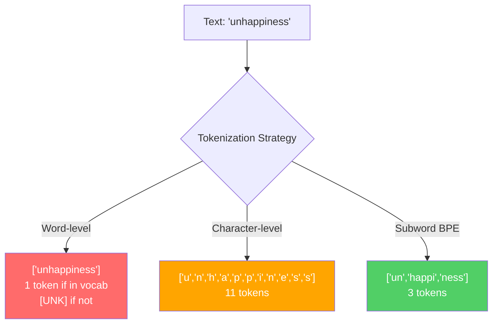
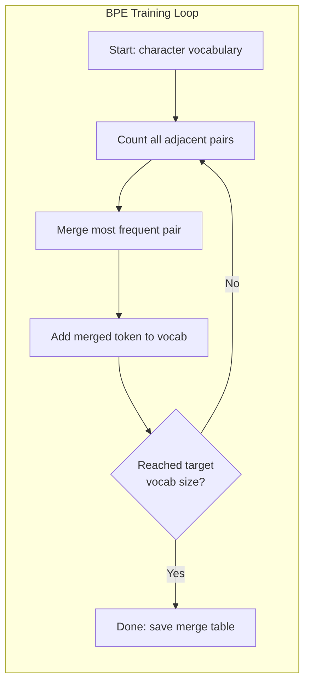
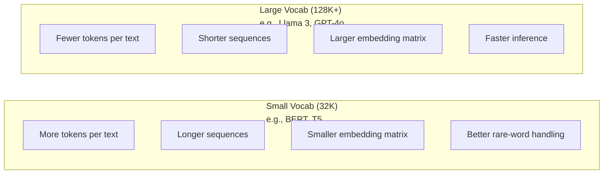

# 토크나이저(Tokenizers): BPE, WordPiece, SentencePiece

> 당신의 LLM은 영어를 읽지 못한다. 정수를 읽는다. 그 정수가 의미를 담을지 낭비할지는 토크나이저(tokenizer)가 결정한다.

**Type:** Build
**Languages:** Python
**Prerequisites:** Phase 05 (NLP Foundations)
**Time:** ~90분

## 학습 목표 (Learning Objectives)

- BPE, WordPiece, Unigram 토큰화(tokenization) 알고리즘을 밑바닥부터 구현하고 그 병합(merge) 전략을 비교하기
- 어휘 크기(vocabulary size)가 모델 효율에 어떻게 영향을 주는지 설명하기: 너무 작으면 시퀀스가 길어지고, 너무 크면 임베딩(embedding) 파라미터(parameter)를 낭비한다
- 여러 언어와 코드에 걸친 토큰화 아티팩트(artifact)를 분석하고, 특정 토크나이저가 어디서 무너지는지 식별하기
- tiktoken과 sentencepiece 라이브러리를 사용해 텍스트를 토큰화하고 그 결과 토큰 ID를 살펴보기

## 문제 (The Problem)

당신의 LLM은 영어를 읽지 못한다. 어떤 언어도 읽지 못한다. 숫자를 읽는다.

"Hello, world!"와 [15496, 11, 995, 0] 사이의 간극이 바로 토크나이저다. 모든 단어, 모든 공백, 모든 구두점은 모델이 처리하기 전에 정수로 변환되어야 한다. 이 변환은 중립적이지 않다. 나중에 되돌릴 수 없는 가정들을 모델에 새겨 넣는다.

이걸 잘못하면 모델은 흔한 단어를 여러 토큰으로 인코딩하느라 용량을 낭비한다. "unfortunately"가 1개가 아니라 4개의 토큰이 된다. 다음절 단어가 많은 텍스트라면 당신의 128K 컨텍스트 윈도우(context window)는 방금 75%나 줄어든 셈이다. 이걸 잘하면 같은 컨텍스트 윈도우에 두 배의 의미를 담을 수 있다. "이 모델은 코드를 잘 다룬다"와 "이 모델은 Python에서 막힌다"의 차이는 흔히 토크나이저가 어떻게 학습되었는지로 귀결된다.

GPT-4나 Claude에 보내는 모든 API 호출은 토큰 단위로 과금된다. 모델이 생성하는 모든 토큰은 연산 비용을 발생시킨다. 출력을 표현하는 데 필요한 토큰이 적을수록 종단 간(end-to-end) 추론(inference)이 빨라진다. 토큰화는 전처리가 아니다. 아키텍처다.

## 개념 (The Concept)

### 실패한 세 가지 접근법 (그리고 승리한 하나)

텍스트를 숫자로 변환하는 명백한 방법은 세 가지가 있다. 그중 둘은 대규모에서 작동하지 않는다.

**단어 수준 토큰화(Word-level tokenization)**는 공백과 구두점을 기준으로 나눈다. "The cat sat"은 ["The", "cat", "sat"]이 된다. 간단하다. 하지만 "tokenization"은? 또는 "GPT-4o"는? 또는 "Geschwindigkeitsbegrenzung" 같은 독일어 복합어는? 단어 수준 방식은 모든 언어의 모든 단어를 망라하려면 거대한 어휘가 필요하다. 단어 하나를 놓치면 그 무시무시한 `[UNK]` 토큰을 얻는다 -- 모델이 "이게 뭔지 전혀 모르겠다"고 말하는 방식이다. 영어만 해도 백만 개가 넘는 단어 형태가 있다. 여기에 코드, URL, 과학적 표기법, 그리고 다른 100개 언어를 더하면 무한한 어휘가 필요해진다.

**문자 수준 토큰화(Character-level tokenization)**는 반대 방향으로 간다. "hello"는 ["h", "e", "l", "l", "o"]가 된다. 어휘가 아주 작다(문자 수백 개). 알 수 없는 토큰이 절대 생기지 않는다. 하지만 시퀀스가 극도로 길어진다. 단어 수준이라면 토큰 10개일 문장이 문자 수준에서는 50개가 된다. 모델은 "t", "h", "e"가 함께 "the"를 뜻한다는 것을 학습해야 한다 -- 사람이 세 살에 배우는 것에 어텐션(attention) 용량을 태우는 셈이다.

**서브워드 토큰화(Subword tokenization)**는 적절한 균형점을 찾는다. 흔한 단어는 통째로 남는다: "the"는 토큰 하나다. 드문 단어는 의미 있는 조각으로 분해된다: "unhappiness"는 ["un", "happi", "ness"]가 된다. 어휘는 관리 가능한 수준(30K~128K 토큰)으로 유지된다. 시퀀스는 짧게 유지된다. 어떤 단어든 서브워드 조각으로 만들 수 있으므로 알 수 없는 토큰은 사실상 사라진다.

모든 현대 LLM은 서브워드 토큰화를 사용한다. GPT-2, GPT-4, BERT, Llama 3, Claude -- 전부 그렇다. 문제는 어떤 알고리즘이냐다.



### BPE: 바이트 쌍 인코딩 (Byte Pair Encoding)

BPE는 토큰화에 재활용된 탐욕적(greedy) 압축 알고리즘이다. 그 아이디어는 색인 카드 한 장에 들어갈 만큼 단순하다.

개별 문자에서 시작한다. 학습 말뭉치(corpus)에서 인접한 모든 쌍을 센다. 가장 빈번한 쌍을 새 토큰으로 병합한다. 목표 어휘 크기에 도달할 때까지 반복한다.

다음은 "lower", "lowest", "newest"라는 단어로 이루어진 작은 말뭉치에서 BPE가 동작하는 모습이다:

```
Corpus (with word frequencies):
  "lower"  x5
  "lowest" x2
  "newest" x6

Step 0 -- Start with characters:
  l o w e r       (x5)
  l o w e s t     (x2)
  n e w e s t     (x6)

Step 1 -- Count adjacent pairs:
  (e,s): 8    (s,t): 8    (l,o): 7    (o,w): 7
  (w,e): 13   (e,r): 5    (n,e): 6    ...

Step 2 -- Merge most frequent pair (w,e) -> "we":
  l o we r        (x5)
  l o we s t      (x2)
  n e we s t      (x6)

Step 3 -- Recount and merge (e,s) -> "es":
  l o we r        (x5)
  l o we s t      (x2)    <- 'es' only forms from 'e'+'s', not 'we'+'s'
  n e we s t      (x6)    <- wait, the 'e' before 'we' and 's' after 'we'

Actually tracking this precisely:
  After "we" merge, remaining pairs:
  (l,o): 7   (o,we): 7   (we,r): 5   (we,s): 8
  (s,t): 8   (n,e): 6    (e,we): 6

Step 3 -- Merge (we,s) -> "wes" or (s,t) -> "st" (tied at 8, pick first):
  Merge (we,s) -> "wes":
  l o we r        (x5)
  l o wes t       (x2)
  n e wes t       (x6)

Step 4 -- Merge (wes,t) -> "west":
  l o we r        (x5)
  l o west        (x2)
  n e west        (x6)

...continue until target vocab size reached.
```

병합 테이블(merge table)이 곧 토크나이저다. 새 텍스트를 인코딩하려면 병합을 학습된 순서대로 적용한다. 학습 말뭉치가 어떤 병합이 존재하는지를 결정하며, 그 선택은 모델이 보게 될 것을 영구적으로 형성한다.



### 바이트 수준 BPE (GPT-2, GPT-3, GPT-4)

표준 BPE는 유니코드(Unicode) 문자 위에서 동작한다. 바이트 수준 BPE(Byte-level BPE)는 원시 바이트(0-255) 위에서 동작한다. 이렇게 하면 정확히 256개의 기본 어휘를 갖게 되고, 어떤 언어나 인코딩이든 처리할 수 있으며, 알 수 없는 토큰을 절대 만들지 않는다.

GPT-2가 이 접근법을 도입했다. 기본 어휘가 가능한 모든 바이트를 망라한다. BPE 병합이 그 위에 쌓인다. OpenAI의 tiktoken 라이브러리는 다음 어휘 크기로 바이트 수준 BPE를 구현한다:

- GPT-2: 50,257 토큰
- GPT-3.5/GPT-4: ~100,256 토큰 (cl100k_base 인코딩)
- GPT-4o: 200,019 토큰 (o200k_base 인코딩)

### WordPiece (BERT)

WordPiece는 BPE와 비슷해 보이지만 병합을 다르게 선택한다. 원시 빈도 대신, 학습 데이터의 가능도(likelihood)를 최대화한다:

```
BPE merge criterion:      count(A, B)
WordPiece merge criterion: count(AB) / (count(A) * count(B))
```

BPE는 묻는다: "어떤 쌍이 가장 자주 나타나는가?" WordPiece는 묻는다: "어떤 쌍이 우연히 기대되는 것보다 더 자주 함께 나타나는가?" 이 미묘한 차이가 서로 다른 어휘를 만들어 낸다. WordPiece는 단지 빈번하기만 한 것이 아니라 공동 출현(co-occurrence)이 놀라운 병합을 선호한다.

WordPiece는 또한 연속 서브워드에 "##" 접두사를 사용한다:

```
"unhappiness" -> ["un", "##happi", "##ness"]
"embedding"   -> ["em", "##bed", "##ding"]
```

"##" 접두사는 이 조각이 이전 토큰을 이어간다는 것을 알려준다. BERT는 어휘 30,522 토큰으로 WordPiece를 사용한다. 모든 BERT 변형 -- DistilBERT, RoBERTa의 토크나이저는 실제로는 BPE지만, BERT 자체는 WordPiece다.

### SentencePiece (Llama, T5)

SentencePiece는 입력을 공백을 포함한 유니코드 문자의 원시 스트림으로 취급한다. 사전 토큰화(pre-tokenization) 단계가 없다. 단어 경계에 대한 언어별 규칙도 없다. 이 덕분에 진정으로 언어 독립적(language-agnostic)이다 -- 공백이 단어를 구분하지 않는 중국어, 일본어, 태국어 및 기타 언어에서도 동작한다.

SentencePiece는 두 가지 알고리즘을 지원한다:
- **BPE 모드**: 표준 BPE와 동일한 병합 로직을 원시 문자 시퀀스에 적용한다
- **Unigram 모드**: 큰 어휘에서 시작해, 전체 가능도에 가장 적게 영향을 주는 토큰을 반복적으로 제거한다. BPE의 반대다 -- 병합하는 대신 가지치기(prune)한다.

Llama 2는 어휘 32,000 토큰으로 SentencePiece BPE를 사용한다. T5는 어휘 32,000 토큰으로 SentencePiece Unigram을 사용한다. 참고: Llama 3는 어휘 128,256 토큰의 tiktoken 기반 바이트 수준 BPE 토크나이저로 전환했다.

### 어휘 크기 트레이드오프 (Vocabulary Size Tradeoffs)

이것은 측정 가능한 결과를 동반하는 실제 엔지니어링 결정이다.



구체적인 숫자를 보자. 4,096차원 임베딩을 가진 128K 어휘의 경우, 임베딩 행렬(matrix)만으로 128,000 x 4,096 = 5억 2,400만 파라미터다. 32K 어휘의 경우 1억 3,100만 파라미터다. 토크나이저 선택만으로 4억 개의 파라미터 차이가 난다.

하지만 더 큰 어휘는 텍스트를 더 공격적으로 압축한다. 32K 어휘로 100 토큰이 드는 동일한 영어 문단이 128K 어휘로는 70 토큰이 들 수 있다. 이는 생성 중 순방향 패스(forward pass)가 30% 적다는 뜻이다. 수백만 건의 요청을 처리하는 모델에게 이것은 연산 비용의 직접적인 절감이다.

추세는 분명하다: 어휘 크기는 커지고 있다. GPT-2는 50,257을 썼다. GPT-4는 ~100K를 쓴다. Llama 3는 128K를 쓴다. GPT-4o는 200K를 쓴다.

| 모델 | 어휘 크기 | 토크나이저 유형 | 영어 단어당 평균 토큰 수 |
|-------|-----------|----------------|---------------------------|
| BERT | 30,522 | WordPiece | ~1.4 |
| GPT-2 | 50,257 | 바이트 수준 BPE | ~1.3 |
| Llama 2 | 32,000 | SentencePiece BPE | ~1.4 |
| GPT-4 | ~100,256 | 바이트 수준 BPE | ~1.2 |
| Llama 3 | 128,256 | 바이트 수준 BPE (tiktoken) | ~1.1 |
| GPT-4o | 200,019 | 바이트 수준 BPE | ~1.0 |

### 다국어 세금 (The Multilingual Tax)

주로 영어로 학습된 토크나이저는 다른 언어에 가혹하다. GPT-2의 토크나이저에서 한국어 텍스트는 단어당 평균 2~3 토큰이다. 중국어는 더 나쁠 수 있다. 이는 한국어 사용자가 사실상 영어 사용자의 절반 크기인 컨텍스트 윈도우를 가진다는 뜻이다 -- 더 적은 정보 밀도에 같은 값을 치르는 셈이다.

이것이 Llama 3가 어휘를 32K에서 128K로 네 배 늘린 이유다. 비영어 문자에 더 많은 토큰을 할당한다는 것은 언어 간 더 공정한 압축을 의미한다.

## 직접 만들기 (Build It)

### 1단계: 문자 수준 토크나이저

기초부터 시작한다. 문자 수준 토크나이저는 각 문자를 그 유니코드 코드 포인트(code point)로 매핑한다. 학습이 필요 없다. 알 수 없는 토큰도 없다. 그냥 직접적인 매핑이다.

```python
class CharTokenizer:
    def encode(self, text):
        return [ord(c) for c in text]

    def decode(self, tokens):
        return "".join(chr(t) for t in tokens)
```

"hello"는 [104, 101, 108, 108, 111]이 된다. 모든 문자가 각자 하나의 토큰이다. 이것이 우리가 개선해 나갈 베이스라인(baseline)이다.

### 2단계: 밑바닥부터 만드는 BPE 토크나이저

진짜 구현이다. (GPT-2처럼) 원시 바이트 위에서 학습하고, 쌍을 세고, 가장 빈번한 것을 병합하고, 모든 병합을 순서대로 기록한다. 병합 테이블이 곧 토크나이저다.

```python
from collections import Counter

class BPETokenizer:
    def __init__(self):
        self.merges = {}
        self.vocab = {}

    def _get_pairs(self, tokens):
        pairs = Counter()
        for i in range(len(tokens) - 1):
            pairs[(tokens[i], tokens[i + 1])] += 1
        return pairs

    def _merge_pair(self, tokens, pair, new_token):
        merged = []
        i = 0
        while i < len(tokens):
            if i < len(tokens) - 1 and tokens[i] == pair[0] and tokens[i + 1] == pair[1]:
                merged.append(new_token)
                i += 2
            else:
                merged.append(tokens[i])
                i += 1
        return merged

    def train(self, text, num_merges):
        tokens = list(text.encode("utf-8"))
        self.vocab = {i: bytes([i]) for i in range(256)}

        for i in range(num_merges):
            pairs = self._get_pairs(tokens)
            if not pairs:
                break
            best_pair = max(pairs, key=pairs.get)
            new_token = 256 + i
            tokens = self._merge_pair(tokens, best_pair, new_token)
            self.merges[best_pair] = new_token
            self.vocab[new_token] = self.vocab[best_pair[0]] + self.vocab[best_pair[1]]

        return self

    def encode(self, text):
        tokens = list(text.encode("utf-8"))
        for pair, new_token in self.merges.items():
            tokens = self._merge_pair(tokens, pair, new_token)
        return tokens

    def decode(self, tokens):
        byte_sequence = b"".join(self.vocab[t] for t in tokens)
        return byte_sequence.decode("utf-8", errors="replace")
```

학습 루프가 BPE의 핵심이다: 쌍을 세고, 승자를 병합하고, 반복한다. 각 병합은 전체 토큰 수를 줄인다. `num_merges`번 반복하면 어휘가 256개(기본 바이트)에서 256 + num_merges개로 늘어난다.

인코딩은 병합을 학습된 정확한 순서대로 적용한다. 이것이 중요하다. 병합 1이 "th"를 만들고 병합 5가 "the"를 만들었다면, "the"가 병합 5에서 "th" + "e"로 형성될 수 있도록 인코딩은 병합 1을 먼저 적용해야 한다.

디코딩은 그 역이다: 각 토큰 ID를 어휘에서 찾고, 바이트를 이어 붙이고, UTF-8로 디코딩한다.

### 3단계: 인코딩과 디코딩 왕복

```python
corpus = (
    "The cat sat on the mat. The cat ate the rat. "
    "The dog sat on the log. The dog ate the frog. "
    "Natural language processing is the study of how computers "
    "understand and generate human language. "
    "Tokenization is the first step in any NLP pipeline."
)

tokenizer = BPETokenizer()
tokenizer.train(corpus, num_merges=40)

test_sentences = [
    "The cat sat on the mat.",
    "Natural language processing",
    "tokenization pipeline",
    "unhappiness",
]

for sentence in test_sentences:
    encoded = tokenizer.encode(sentence)
    decoded = tokenizer.decode(encoded)
    raw_bytes = len(sentence.encode("utf-8"))
    ratio = len(encoded) / raw_bytes
    print(f"'{sentence}'")
    print(f"  Tokens: {len(encoded)} (from {raw_bytes} bytes) -- ratio: {ratio:.2f}")
    print(f"  Roundtrip: {'PASS' if decoded == sentence else 'FAIL'}")
```

압축비(compression ratio)는 토크나이저가 얼마나 효과적인지를 알려준다. 0.50의 비율은 토크나이저가 텍스트를 원시 바이트의 절반 수만큼의 토큰으로 압축했다는 뜻이다. 낮을수록 좋다. 학습 말뭉치에서는 비율이 좋을 것이다. (말뭉치에 나타나지 않는) "unhappiness" 같은 분포 밖(out-of-distribution) 텍스트에서는 비율이 나빠진다 -- 토크나이저는 본 적 없는 패턴에 대해 문자 수준 인코딩으로 되돌아간다.

### 4단계: tiktoken과 비교

```python
import tiktoken

enc = tiktoken.get_encoding("cl100k_base")

texts = [
    "The cat sat on the mat.",
    "unhappiness",
    "Hello, world!",
    "def fibonacci(n): return n if n < 2 else fibonacci(n-1) + fibonacci(n-2)",
    "Geschwindigkeitsbegrenzung",
]

for text in texts:
    our_tokens = tokenizer.encode(text)
    tiktoken_tokens = enc.encode(text)
    tiktoken_pieces = [enc.decode([t]) for t in tiktoken_tokens]
    print(f"'{text}'")
    print(f"  Our BPE:   {len(our_tokens)} tokens")
    print(f"  tiktoken:  {len(tiktoken_tokens)} tokens -> {tiktoken_pieces}")
```

tiktoken은 정확히 같은 알고리즘을 사용하지만 수백 기가바이트의 텍스트에서 10만 번의 병합으로 학습되었다. 알고리즘은 동일하다. 차이는 학습 데이터와 병합 횟수다. 문단 하나에서 40번의 병합으로 학습한 당신의 토크나이저는 거대한 말뭉치에서 10만 번 병합한 tiktoken과 경쟁할 수 없다. 하지만 메커니즘은 같다.

### 5단계: 어휘 분석

```python
def analyze_vocabulary(tokenizer, test_texts):
    total_tokens = 0
    total_chars = 0
    token_usage = Counter()

    for text in test_texts:
        encoded = tokenizer.encode(text)
        total_tokens += len(encoded)
        total_chars += len(text)
        for t in encoded:
            token_usage[t] += 1

    print(f"Vocabulary size: {len(tokenizer.vocab)}")
    print(f"Total tokens across all texts: {total_tokens}")
    print(f"Total characters: {total_chars}")
    print(f"Avg tokens per character: {total_tokens / total_chars:.2f}")

    print(f"\nMost used tokens:")
    for token_id, count in token_usage.most_common(10):
        token_bytes = tokenizer.vocab[token_id]
        display = token_bytes.decode("utf-8", errors="replace")
        print(f"  Token {token_id:4d}: '{display}' (used {count} times)")

    unused = [t for t in tokenizer.vocab if t not in token_usage]
    print(f"\nUnused tokens: {len(unused)} out of {len(tokenizer.vocab)}")
```

이것은 당신의 어휘에 있는 지프 분포(Zipf distribution)를 드러낸다. 소수의 토큰이 지배한다(공백, "the", "e"). 대부분의 토큰은 거의 쓰이지 않는다. 프로덕션(production) 토크나이저는 이 분포에 맞춰 최적화한다 -- 흔한 패턴은 짧은 토큰 ID를 얻고, 드문 패턴은 더 긴 표현을 얻는다.

## 라이브러리로 써보기 (Use It)

당신의 밑바닥 BPE가 작동한다. 이제 프로덕션 도구가 어떤 모습인지 보자.

### tiktoken (OpenAI)

```python
import tiktoken

enc = tiktoken.get_encoding("cl100k_base")

text = "Tokenizers convert text to integers"
tokens = enc.encode(text)
print(f"Tokens: {tokens}")
print(f"Pieces: {[enc.decode([t]) for t in tokens]}")
print(f"Roundtrip: {enc.decode(tokens)}")
```

tiktoken은 Python 바인딩을 가진 Rust로 작성되었다. 초당 수백만 토큰을 인코딩한다. 같은 BPE 알고리즘, 산업 강도의 구현이다.

### Hugging Face tokenizers

```python
from tokenizers import Tokenizer
from tokenizers.models import BPE
from tokenizers.trainers import BpeTrainer
from tokenizers.pre_tokenizers import ByteLevel

tokenizer = Tokenizer(BPE())
tokenizer.pre_tokenizer = ByteLevel()

trainer = BpeTrainer(vocab_size=1000, special_tokens=["<pad>", "<eos>", "<unk>"])
tokenizer.train(["corpus.txt"], trainer)

output = tokenizer.encode("The cat sat on the mat.")
print(f"Tokens: {output.tokens}")
print(f"IDs: {output.ids}")
```

Hugging Face tokenizers 라이브러리도 내부적으로 Rust다. 기가바이트 규모의 말뭉치에서 몇 초 만에 BPE를 학습한다. 자신의 모델을 학습시킬 때 쓰는 것이 바로 이것이다.

### Llama의 토크나이저 불러오기

```python
from transformers import AutoTokenizer

tokenizer = AutoTokenizer.from_pretrained("meta-llama/Llama-3.1-8B")

text = "Tokenizers are the unsung heroes of LLMs"
tokens = tokenizer.encode(text)
print(f"Token IDs: {tokens}")
print(f"Tokens: {tokenizer.convert_ids_to_tokens(tokens)}")
print(f"Vocab size: {tokenizer.vocab_size}")

multilingual = ["Hello world", "Hola mundo", "Bonjour le monde"]
for text in multilingual:
    ids = tokenizer.encode(text)
    print(f"'{text}' -> {len(ids)} tokens")
```

Llama 3의 128K 어휘는 비영어 텍스트를 GPT-2의 50K 어휘보다 훨씬 더 잘 압축한다. 이것은 직접 확인할 수 있다 -- 같은 문장을 여러 언어로 인코딩하고 토큰 수를 세어 보라.

## 산출물 (Ship It)

이 레슨은 `outputs/prompt-tokenizer-analyzer.md`를 만든다 -- 임의의 텍스트와 모델 조합에 대해 토큰화 효율을 분석하는 재사용 가능한 프롬프트(prompt)다. 텍스트 샘플을 입력하면 어느 모델의 토크나이저가 그것을 가장 잘 다루는지 알려준다.

## 연습 문제 (Exercises)

1. BPE 토크나이저를 수정해 각 병합 단계마다 어휘를 출력하게 하라. "t" + "h"가 "th"가 되고, 그다음 "th" + "e"가 "the"가 되는 과정을 지켜보라. 흔한 영어 단어가 조각 단위로 어떻게 조립되는지 추적하라.

2. BPE 토크나이저에 특수 토큰(`<pad>`, `<eos>`, `<unk>`)을 추가하라. 그것들에 ID 0, 1, 2를 할당하고 다른 모든 토큰을 그에 맞게 이동시켜라. BPE를 실행하기 전에 공백으로 나누는 사전 토큰화 단계를 구현하라.

3. WordPiece 병합 기준(빈도 대신 가능도 비율)을 구현하라. 같은 말뭉치에서 같은 병합 횟수로 BPE와 WordPiece를 둘 다 학습시켜라. 결과 어휘를 비교하라 -- 어느 쪽이 언어적으로 더 의미 있는 서브워드를 만드는가?

4. 다국어 토크나이저 효율 벤치마크(benchmark)를 만들어라. 영어, 스페인어, 중국어, 한국어, 아랍어로 된 10개 문장을 가져와라. 각각을 tiktoken(cl100k_base)으로 토큰화하고 문자당 평균 토큰 수를 측정하라. 각 언어의 "다국어 세금"을 정량화하라.

5. 더 큰 말뭉치(위키백과 문서 하나를 내려받아)에서 BPE 토크나이저를 학습시켜라. 같은 텍스트에서 tiktoken의 압축비와 10% 이내의 압축비를 달성하도록 병합 횟수를 조정하라. 이것은 말뭉치 크기, 병합 횟수, 압축 품질 사이의 관계를 이해하게 만든다.

## 핵심 용어 (Key Terms)

| 용어 | 사람들이 말하는 것 | 실제 의미 |
|------|----------------|----------------------|
| 토큰(Token) | "단어" | 모델 어휘에 있는 하나의 단위 -- 문자, 서브워드, 단어, 또는 여러 단어로 된 덩어리일 수 있다 |
| BPE | "어떤 압축 같은 것" | 바이트 쌍 인코딩(Byte Pair Encoding) -- 목표 어휘 크기에 도달할 때까지 가장 빈번한 인접 토큰 쌍을 반복적으로 병합한다 |
| WordPiece | "BERT의 토크나이저" | BPE와 비슷하지만 병합이 원시 빈도 대신 가능도 비율 count(AB)/(count(A)*count(B))를 최대화한다 |
| SentencePiece | "토크나이저 라이브러리" | 사전 토큰화 없이 원시 유니코드 위에서 동작하는 언어 독립적 토크나이저로, BPE와 Unigram 알고리즘을 지원한다 |
| 어휘 크기(Vocabulary size) | "아는 단어 수" | 고유한 토큰의 총 개수: GPT-2는 50,257개, BERT는 30,522개, Llama 3는 128,256개를 가진다 |
| 다산성(Fertility) | "토크나이저 용어가 아닌데" | 단어당 평균 토큰 수 -- 언어 간 토크나이저 효율을 측정한다(1.0이 완벽, 3.0은 모델이 세 배 더 힘들게 일한다는 뜻) |
| 바이트 수준 BPE(Byte-level BPE) | "GPT의 토크나이저" | 유니코드 문자가 아니라 원시 바이트(0-255) 위에서 동작하는 BPE로, 어떤 입력에 대해서도 알 수 없는 토큰이 없음을 보장한다 |
| 병합 테이블(Merge table) | "토크나이저 파일" | 학습 중 학습된 쌍 병합의 순서 있는 목록 -- 이것이 곧 토크나이저이며, 순서가 중요하다 |
| 사전 토큰화(Pre-tokenization) | "공백으로 나누기" | 서브워드 토큰화 전에 적용되는 규칙: 공백 분할, 숫자 분리, 구두점 처리 |
| 압축비(Compression ratio) | "토크나이저가 얼마나 효율적인가" | 생성된 토큰을 입력 바이트로 나눈 값 -- 낮을수록 더 나은 압축과 더 빠른 추론을 뜻한다 |

## 더 읽을거리 (Further Reading)

- [Sennrich et al., 2016 -- "Neural Machine Translation of Rare Words with Subword Units"](https://arxiv.org/abs/1508.07909) -- NLP에 BPE를 도입한 논문으로, 1994년의 압축 알고리즘을 현대 토큰화의 기반으로 바꿔 놓았다
- [Kudo & Richardson, 2018 -- "SentencePiece: A simple and language independent subword tokenizer"](https://arxiv.org/abs/1808.06226) -- 다국어 모델을 실용적으로 만든 언어 독립적 토큰화
- [OpenAI tiktoken repository](https://github.com/openai/tiktoken) -- GPT-3.5/4/4o에서 사용되는, Python 바인딩을 가진 Rust로 된 프로덕션 BPE 구현
- [Hugging Face Tokenizers documentation](https://huggingface.co/docs/tokenizers) -- Rust 성능을 갖춘 프로덕션 등급 토크나이저 학습
