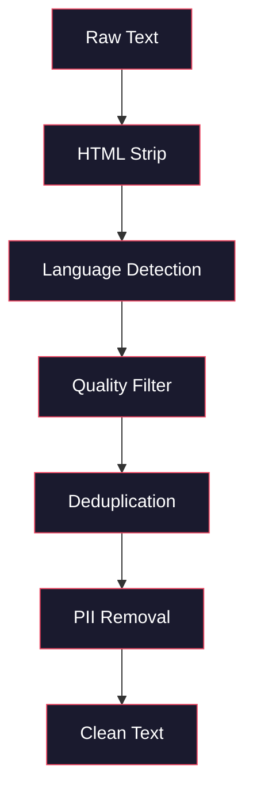
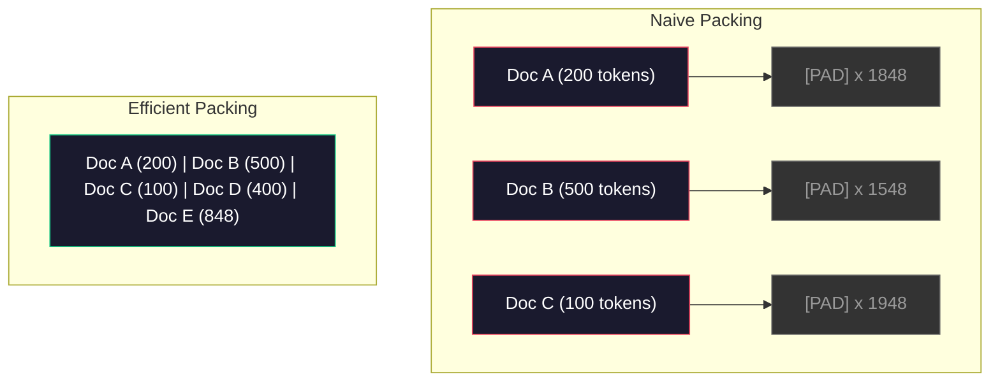

# 사전 학습을 위한 데이터 파이프라인

> 모델은 거울이다. 당신이 먹이는 데이터가 무엇이든 그대로 비춘다. 쓰레기를 먹이면, 완벽한 유창함으로 쓰레기를 비춘다.

**Type:** Build
**Languages:** Python
**Prerequisites:** Phase 10, Lessons 01-02 (Tokenizers, Building a Tokenizer)
**Time:** ~90분

## 학습 목표 (Learning Objectives)

- 테라바이트 규모의 텍스트를 전부 메모리에 올리지 않고도 토큰화(tokenize)하고, 청크로 나누고, 셔플하고, 배치(batch)로 묶는 스트리밍 데이터 파이프라인(pipeline) 만들기
- 실제 사전 학습(pre-training) 파이프라인에서 쓰이는 데이터 품질 필터(중복 제거, 언어 감지, 콘텐츠 필터링) 구현하기
- 올바른 어텐션 마스크(attention mask)와 문서 경계 처리를 갖춘 고정 길이 학습 시퀀스 만들기
- 데이터로더(dataloader)가 GPU 학습 속도를 따라잡는지 보장하기 위해 파이프라인 처리량(throughput) 프로파일링하기

## 문제 (The Problem)

당신에게는 토크나이저(tokenizer)가 있다. 이제 데이터가 필요하다.

데이터셋(dataset)이 아니다. CSV 파일이 아니다. 테라바이트 규모의 텍스트다 -- 정제되고, 중복 제거되고, 품질로 필터링되고, 고정 길이 시퀀스로 토큰화되고, 당신의 8-GPU 클러스터가 다음 배치를 기다리는 일이 절대 없을 만큼 빠르게 무작위 배치로 제공되는.

대부분의 사람은 LLM 학습이 모델 아키텍처에 관한 것이라고 생각한다. 아니다. Llama 3는 15.6조 토큰을 썼다. GPT-3는 3,000억을 썼다. DeepSeek-V2는 8.1조를 썼다. 셋 모두의 아키텍처는 대략 같다: 어텐션(attention)과 피드포워드(feedforward) 층(layer)을 쌓은 트랜스포머(transformer) 블록. 출력 품질의 차이는 압도적으로 데이터에서 온다.

DeepMind의 Chinchilla 논문이 이를 정밀하게 만들었다. 주어진 연산 예산에서, 모델 파라미터(parameter)와 학습 토큰의 최적 비율이 존재한다. Chinchilla는 2022년의 대부분 모델이 극도로 과소 학습(undertrained)되었음을 보였다 -- 본 데이터 양에 비해 파라미터가 너무 많았다. 1.4조 토큰으로 학습된 700억 파라미터 모델(Chinchilla 최적)이 3,000억 토큰으로 학습된 2,800억 모델(Gopher)을 능가했다.

당신의 데이터 파이프라인은 모델이 언어를 배울지 잡음을 배울지를 결정한다.

## 개념 (The Concept)

### 데이터는 어디서 오는가

모든 대형 언어 모델은 출처의 혼합으로 학습된다. 정확한 구성은 대부분의 연구소에서 철저히 지키는 비밀이지만, 우리는 그 범주를 이해할 만큼은 안다.

| 출처 | 크기 | 품질 | 사용처 |
|--------|------|---------|---------|
| Common Crawl | ~250 TB 원시 | 낮음 (무거운 필터링 필요) | GPT-3, Llama, 대부분의 오픈 모델 |
| Wikipedia | ~20 GB | 높음 | 모든 주요 LLM |
| GitHub 코드 | ~1 TB+ | 중간 (중복과 죽은 코드가 많음) | StarCoder, CodeLlama, DeepSeek-Coder |
| 책 (BookCorpus, Pile) | ~100 GB | 높음 | GPT-2, GPT-3, 초기 모델 |
| 학술 논문 (arXiv, S2ORC) | ~100 GB | STEM에 높음 | Llama, Galactica |
| StackOverflow, Reddit | ~100 GB | 중간 | Llama, Falcon |
| 큐레이션된 웹 (C4, RefinedWeb) | ~5 TB | 중간-높음 (사전 필터링됨) | T5, Falcon |

Llama 3는 자신의 데이터 혼합을 공개했다: 대략 50% 웹 데이터, 25% 코드, 13% 책과 학술 논문, 8% 수학 데이터, 4% 다국어 웹 데이터. 총합은 5 TB가 넘는 원시 텍스트 출처로부터 나온 15.6조 토큰이었다.

비율은 총 크기만큼 중요하다. 웹 데이터가 너무 많으면 모델은 Reddit 앵무새가 된다. 코드가 너무 적으면 프로그래밍을 할 수 없다. 수학이 너무 적으면 추론에 실패한다. 이 혼합을 제대로 맞추는 것은 LLM 학습에서 가장 어려운 부분 중 하나이며, 공식은 없다 -- 실험과 평가가 필요하다.

### 데이터 정제 (Data Cleaning)

원시 웹 데이터는 더럽다. 전형적인 Common Crawl 덤프는 다음을 포함한다:

- HTML 태그와 JavaScript
- 상용구 헤더, 푸터, 내비게이션 메뉴
- 중복 페이지(완전 중복과 근사 중복)
- 기계 생성 스팸
- 개인 식별 정보(PII)
- 저품질 텍스트(키워드 목록, SEO 스팸)
- 텍스트로 인코딩된 비텍스트 콘텐츠

이것을 정제하는 것은 선택이 아니다. 일관된 문단을 생성하는 모델과 제품 목록이 섞인 HTML 태그를 출력하는 모델 사이의 차이다.



각 단계는 잡음의 한 범주를 제거한다:

**HTML 제거:** 모든 마크업을 제거한다. 보이는 텍스트 콘텐츠만 남긴다. `trafilatura`나 `readability` 같은 라이브러리는 내비게이션, 광고, 상용구를 버리면서 기사 콘텐츠를 추출한다.

**언어 감지:** fastText의 언어 식별 모델(lid.176.bin)을 사용해 각 문서를 분류한다. 목표 언어로 필터링한다. 0.8 미만의 신뢰도로 영어로 분류된 문서는 아마 깨끗한 영어가 아닐 것이다.

**품질 필터링:** 여기서 흥미로워진다. (Falcon 뒤에 있는 데이터셋인) RefinedWeb은 펄플렉서티(perplexity) 기반 필터를 사용한다: Wikipedia로 작은 언어 모델을 학습시킨 뒤 각 문서를 점수 매긴다. 높은 펄플렉서티는 그 문서가 Wikipedia와 다르다는 뜻이다 -- 스팸, 키워드 목록, 또는 기계 생성 콘텐츠일 가능성이 높다. 임계값 이상의 펄플렉서티를 가진 문서는 제거된다.

**중복 제거:** 단연코 가장 영향력 있는 정제 단계다. Common Crawl은 엄청난 수의 중복 페이지를 포함한다 -- 법적 면책 조항, 쿠키 고지, 이용 약관. 중복으로 학습하면 연산을 낭비하고 모델이 특정 구절을 그대로 외워 토해 내게 만들 수 있다.

**PII 제거:** 이름, 이메일 주소, 전화번호, 사회보장번호. 구조화된 PII에는 정규식 기반 감지를, 문맥 속 이름에는 NER 모델을 사용한다.

### MinHash를 이용한 중복 제거

완전 중복 제거는 쉽다: 각 문서를 해시하고 중복을 제거한다. 하지만 근사 중복이 진짜 문제다. 주변 광고가 약간 다른 같은 뉴스 기사의 두 사본은 근사 중복이다. 콘텐츠는 95% 동일하지만, 바이트 단위로는 다르다.

MinHash + 지역성 민감 해싱(Locality-Sensitive Hashing, LSH)이 이를 효율적으로 해결한다.


아이디어:

1. **싱글링(Shingling):** 각 문서를 n-gram 집합으로 변환한다(예: 단어 또는 문자의 5-gram). "the quick brown fox"는 3-단어 싱글로 {"the quick brown", "quick brown fox"}가 된다.

2. **MinHash:** 각 문서의 싱글 집합에 대해 k개의 해시 값을 계산한다. 각 해시 값은 서로 다른 해시 함수 아래에서 모든 싱글에 걸친 최소 해시다. 이것은 임의의 두 문서 사이의 자카드 유사도(Jaccard similarity)를 근사하는 고정 크기 "시그니처(signature)"를 만든다.

3. **LSH:** MinHash 시그니처의 밴드를 기준으로 문서를 버킷(bucket)으로 묶는다. 같은 버킷에 있는 문서는 후보 근사 중복이다. 이는 모든 쌍을 비교하는 것을 피한다 -- 후보만 비교한다.

4. **검증:** 각 후보 쌍에 대해 정확한 자카드 유사도를 계산한다. 유사도가 임계값(보통 0.8)을 넘으면 한 사본을 제거한다.

Llama 팀은 중복 제거를 통해 웹 데이터의 약 38%를 제거했다고 보고했다. 작은 숫자가 아니다. Common Crawl의 3분의 1 이상이 중복이거나 근사 중복 콘텐츠다.

### 시퀀스 패킹 (Sequence Packing)

당신의 모델은 고정 길이 입력 시퀀스를 기대한다. 당신의 문서는 가변 길이다. 어떤 것은 50 토큰이다. 어떤 것은 50,000 토큰이다.

순진한 접근법: 모든 문서를 최대 시퀀스 길이까지 패딩한다. 이는 학습에 아무 기여도 하지 않는 패딩 토큰에 엄청난 연산을 낭비한다.

더 나은 접근법: 여러 문서를 시퀀스 끝(end-of-sequence) 토큰으로 구분해 하나의 시퀀스에 패킹한다. 2048-토큰 시퀀스는 그 사이에 [EOS] 토큰을 두고 연결된 세 개의 짧은 문서를 담을 수 있다.



어텐션 마스크는 올바르게 설정되어야 한다. 같은 패킹된 시퀀스 안에서 문서 A의 토큰은 문서 B의 토큰에 어텐션하면 안 된다. 이는 블록 대각(block-diagonal) 어텐션 마스크를 요구한다.

긴 문서는 시퀀스 경계에서 잘리거나 청크로 나뉜다. 분할 지점이 중요하다: 문장 중간에서 나누면 모델이 불완전한 생각을 보게 된다. 일부 파이프라인은 가능할 때 분할을 문단이나 문장 경계에 맞춘다.

### Chinchilla 스케일링 법칙

(FLOPs로 측정되는) 고정된 연산 예산 C에 대해, 최적 모델 크기 N과 데이터셋 크기 D는 다음을 따른다:

```
N_opt ~ C^0.5
D_opt ~ C^0.5
```

실제로 이는 모델 크기와 데이터셋 크기를 대략 똑같이 키워야 한다는 뜻이다. 파라미터가 10배 많은 모델은 같은 손실(loss)에 도달하려면 대략 10배 많은 학습 토큰이 필요하다.

| 모델 | 파라미터 | 학습 토큰 | Chinchilla 최적? |
|-------|-----------|----------------|-------------------|
| GPT-3 | 175B | 300B | 아니오 (3~4배 과소 학습) |
| Chinchilla | 70B | 1.4T | 예 (의도적으로) |
| Llama 2 | 70B | 2T | 과대 학습 (의도적으로) |
| Llama 3 | 70B | 15T | 심하게 과대 학습 |

Llama 3는 의도적으로 Chinchilla 법칙을 위반한다. Meta는 더 많은 데이터로 과대 학습(overtraining)하는 것이 -- 연산 최적 비율을 훨씬 넘어 -- 추론(inference)에 더 나은 모델을 만든다는 것을 발견했다. 추가 학습 비용은 한 번 치러지지만, 더 작은 모델은 영원히 더 싸게 서빙된다. 이것은 때때로 "추론 최적(inference-optimal)" 스케일링 접근법이라 불리며, 2024년 이후 업계 표준이 되었다.

## 직접 만들기 (Build It)

### 1단계: 텍스트 정제

HTML을 제거하고, 공백을 정규화하고, 비텍스트 콘텐츠를 제거한다. 작은 말뭉치(corpus)로 퍼블릭 도메인 텍스트(Project Gutenberg)를 사용한다.

```python
import re

def clean_text(text):
    text = re.sub(r"<[^>]+>", "", text)
    text = re.sub(r"http\S+", "", text)
    text = re.sub(r"[^\x20-\x7E\n]", "", text)
    text = re.sub(r"\n{3,}", "\n\n", text)
    text = re.sub(r" {2,}", " ", text)
    return text.strip()

def quality_filter(text, min_words=50, max_ratio_caps=0.3, max_ratio_special=0.1):
    words = text.split()
    if len(words) < min_words:
        return False
    caps_ratio = sum(1 for w in words if w.isupper()) / len(words)
    if caps_ratio > max_ratio_caps:
        return False
    special_chars = sum(1 for c in text if not c.isalnum() and not c.isspace())
    if special_chars / max(len(text), 1) > max_ratio_special:
        return False
    return True
```

품질 필터는 SEO 스팸(전부 대문자), 기계 생성 잡음(높은 특수 문자 비율), 스텁 페이지(너무 짧음)를 잡아낸다. 이 세 가지 검사만으로도 웹 크롤에서 놀라울 만큼 많은 쓰레기를 제거한다.

### 2단계: MinHash 중복 제거

MinHash를 밑바닥부터 구현한다. 외부 라이브러리가 필요 없다 -- `hashlib`만 있으면 된다.

```python
import hashlib
from collections import defaultdict

def get_shingles(text, k=5):
    words = text.lower().split()
    if len(words) < k:
        return set()
    return {" ".join(words[i:i+k]) for i in range(len(words) - k + 1)}

def minhash_signature(shingles, num_hashes=128):
    signature = []
    for i in range(num_hashes):
        min_hash = float("inf")
        for shingle in shingles:
            h = int(hashlib.sha256(f"{i}:{shingle}".encode()).hexdigest(), 16)
            min_hash = min(min_hash, h)
        signature.append(min_hash)
    return signature

def lsh_buckets(signature, bands=16):
    rows_per_band = len(signature) // bands
    buckets = []
    for b in range(bands):
        start = b * rows_per_band
        band_data = tuple(signature[start:start + rows_per_band])
        bucket_hash = hashlib.md5(str(band_data).encode()).hexdigest()
        buckets.append((b, bucket_hash))
    return buckets

def deduplicate(documents, threshold=0.8, num_hashes=128, bands=16):
    signatures = []
    shingle_sets = []
    for doc in documents:
        shingles = get_shingles(doc)
        shingle_sets.append(shingles)
        signatures.append(minhash_signature(shingles, num_hashes))

    bucket_map = defaultdict(list)
    for doc_idx, sig in enumerate(signatures):
        for band_id, bucket_hash in lsh_buckets(sig, bands):
            bucket_map[(band_id, bucket_hash)].append(doc_idx)

    duplicate_pairs = set()
    for bucket_docs in bucket_map.values():
        if len(bucket_docs) < 2:
            continue
        for i in range(len(bucket_docs)):
            for j in range(i + 1, len(bucket_docs)):
                duplicate_pairs.add((bucket_docs[i], bucket_docs[j]))

    removed = set()
    for i, j in duplicate_pairs:
        if i in removed or j in removed:
            continue
        s1, s2 = shingle_sets[i], shingle_sets[j]
        if not s1 or not s2:
            continue
        jaccard = len(s1 & s2) / len(s1 | s2)
        if jaccard >= threshold:
            removed.add(j)

    return [doc for idx, doc in enumerate(documents) if idx not in removed], len(removed)
```

`num_hashes=128`과 `bands=16` 파라미터는 정밀도-재현율 트레이드오프(trade-off)를 제어한다. 더 많은 해시는 더 정확한 유사도 추정을 준다. 더 많은 밴드는 더 많은 거짓 양성을 대가로 재현율을 높인다(더 많은 중복을 잡음). 이 값들은 전형적인 웹 텍스트에 잘 작동한다.

### 3단계: 시퀀스 토큰화와 패킹

깨끗하고 중복 제거된 텍스트를 가져와 토큰화하고 학습을 위해 고정 길이 시퀀스로 패킹한다.

```python
def tokenize_corpus(documents, tokenizer):
    all_tokens = []
    for doc in documents:
        tokens = tokenizer.encode(doc)
        all_tokens.extend(tokens)
        all_tokens.append(tokenizer.eos_id)
    return all_tokens

def pack_sequences(token_ids, seq_length, pad_id=0):
    sequences = []
    attention_masks = []
    for i in range(0, len(token_ids), seq_length):
        seq = token_ids[i:i + seq_length]
        mask = [1] * len(seq)
        if len(seq) < seq_length:
            pad_count = seq_length - len(seq)
            seq = seq + [pad_id] * pad_count
            mask = mask + [0] * pad_count
        sequences.append(seq)
        attention_masks.append(mask)
    return sequences, attention_masks
```

### 4단계: 학습용 DataLoader

패킹된 시퀀스의 무작위 배치를 산출한다. 이것이 학습 루프가 소비하는 것이다.

```python
import random

class PreTrainingDataLoader:
    def __init__(self, sequences, attention_masks, batch_size, shuffle=True):
        self.sequences = sequences
        self.attention_masks = attention_masks
        self.batch_size = batch_size
        self.shuffle = shuffle

    def __len__(self):
        return (len(self.sequences) + self.batch_size - 1) // self.batch_size

    def __iter__(self):
        indices = list(range(len(self.sequences)))
        if self.shuffle:
            random.shuffle(indices)
        for start in range(0, len(indices), self.batch_size):
            batch_idx = indices[start:start + self.batch_size]
            batch_seqs = [self.sequences[i] for i in batch_idx]
            batch_masks = [self.attention_masks[i] for i in batch_idx]
            yield batch_seqs, batch_masks
```

### 5단계: 데이터셋 통계

중요한 숫자들을 계산한다: 전체 토큰, 고유 토큰, 압축비(compression ratio), 문서 길이 분포.

```python
from collections import Counter

def compute_statistics(documents, token_ids, sequences, tokenizer_vocab_size):
    total_chars = sum(len(d) for d in documents)
    total_tokens = len(token_ids)
    unique_tokens = len(set(token_ids))
    compression_ratio = total_chars / total_tokens

    doc_lengths = [len(d.split()) for d in documents]
    avg_doc_length = sum(doc_lengths) / max(len(doc_lengths), 1)
    max_doc_length = max(doc_lengths) if doc_lengths else 0
    min_doc_length = min(doc_lengths) if doc_lengths else 0

    token_counts = Counter(token_ids)
    top_tokens = token_counts.most_common(10)

    non_pad_tokens = sum(sum(1 for t in seq if t != 0) for seq in sequences)
    total_positions = sum(len(seq) for seq in sequences)
    utilization = non_pad_tokens / max(total_positions, 1)

    stats = {
        "total_documents": len(documents),
        "total_characters": total_chars,
        "total_tokens": total_tokens,
        "unique_tokens": unique_tokens,
        "vocab_utilization": unique_tokens / tokenizer_vocab_size,
        "compression_ratio": compression_ratio,
        "avg_doc_length_words": avg_doc_length,
        "max_doc_length_words": max_doc_length,
        "min_doc_length_words": min_doc_length,
        "num_sequences": len(sequences),
        "sequence_utilization": utilization,
        "top_10_tokens": top_tokens,
    }
    return stats
```

압축비는 이 말뭉치에서 토크나이저가 얼마나 효율적인지를 알려준다. 영어 텍스트는 보통 토큰당 약 3~4 문자로 압축된다. 토큰당 1.5 문자를 본다면, 토크나이저가 너무 공격적으로 나누고 있다. 8 이상을 본다면, 매우 도메인 특화된 병합을 학습한 것이다.

시퀀스 활용도는 패킹된 시퀀스 중 얼마나가 패딩이 아닌 실제 데이터인지 알려준다. 90% 미만은 패킹이 비효율적이라는 뜻이다 -- 패딩 토큰에 연산을 낭비하고 있다.

## 라이브러리로 써보기 (Use It)

### HuggingFace Datasets와 비교

HuggingFace의 datasets 라이브러리를 통해 같은 말뭉치를 불러오고 파이프라인 속도를 비교한다.

```python
from datasets import load_dataset
from transformers import AutoTokenizer

ds = load_dataset("wikitext", "wikitext-2-raw-v1", split="train")
tokenizer = AutoTokenizer.from_pretrained("meta-llama/Meta-Llama-3-8B")

import time

start = time.time()
tokenized = ds.map(
    lambda x: tokenizer(x["text"], truncation=True, max_length=2048),
    batched=True,
    num_proc=4,
)
hf_time = time.time() - start
total_tokens = sum(len(t) for t in tokenized["input_ids"])
print(f"HuggingFace: {total_tokens:,} tokens in {hf_time:.2f}s ({total_tokens/hf_time:,.0f} tokens/sec)")
```

HuggingFace 파이프라인은 내부적으로 Rust 토크나이저와 4코어에 걸친 병렬 처리를 사용한다. 당신의 순수 Python 파이프라인은 10~50배 느릴 것이다. 그 격차가 프로덕션 팀이 컴파일된 토크나이저를 쓰는 이유다. 알고리즘은 같다. 구현 언어가 차이다.

## 산출물 (Ship It)

이 레슨은 LLM 학습 파이프라인에서 데이터 품질을 검증하고 디버깅하기 위한 프롬프트(prompt)를 만든다. `outputs/prompt-data-quality-checker.md`를 보라.

## 연습 문제 (Exercises)

1. **쉬움:** 간단한 휴리스틱(문자 집합 분석)을 사용해 정제 파이프라인에 언어 감지를 추가하라. 영어 문서로만 필터링하고 얼마나 많은 문서가 제거되는지 측정하라.
2. **중간:** MinHash 근사 중복 제거와 나란히 SHA-256 해시를 사용한 완전 중복 제거를 구현하라. 웹 스크래핑한 말뭉치에서 각 방법이 잡아낸 중복 수를 비교하라.
3. **어려움:** 펄플렉서티 기반 품질 필터를 만들어라. Wikipedia 텍스트로 작은 바이그램(bigram) 언어 모델을 학습시키고, 각 문서를 펄플렉서티로 점수 매기고, 하위 20%를 제거하라. 필터링된 데이터와 필터링되지 않은 데이터로 학습할 때 모델 출력 품질을 비교하라.

## 핵심 용어 (Key Terms)

| 용어 | 사람들이 말하는 것 | 실제 의미 |
|------|----------------|----------------------|
| Common Crawl | "인터넷" | 매월 웹을 크롤링하는 비영리 단체 -- ~250TB 원시, 대부분의 LLM 학습 데이터의 출발점 |
| MinHash | "어떤 해싱 트릭" | 고정 크기 시그니처를 사용해 집합 간 자카드 유사도를 추정하는 기법 -- 대규모에서 근사 중복 감지를 가능하게 한다 |
| LSH | "지역성 민감 해싱" | 유사한 항목을 같은 버킷으로 묶는 방법 -- 쌍 비교를 O(n^2)에서 거의 선형으로 줄인다 |
| 시퀀스 패킹(Sequence packing) | "문서 연결하기" | 올바른 어텐션 마스크와 함께 여러 문서를 고정 길이 시퀀스에 맞추기 -- 패딩 낭비를 제거한다 |
| Chinchilla 스케일링 | "더 많은 데이터로 학습" | 고정된 연산 예산에서, 최적 성능은 모델 크기와 학습 토큰을 대략 똑같이 키울 것을 요구한다 |
| 다산성(Fertility) | "단어당 토큰" | 단어당 평균 토큰 수 -- GPT-4의 영어는 1.3, 비라틴 문자는 더 높다 |
| 데이터 혼합(Data mixing) | "학습 데이터 고르기" | 코드 대 텍스트 대 수학 대 다국어 데이터의 비율 -- 공식이 없고 실험이 필요하다 |
| 펄플렉서티 필터(Perplexity filter) | "품질 점수 매기기" | 작은 언어 모델로 문서를 점수 매기기 -- 높은 펄플렉서티는 텍스트가 깨끗한 참조 데이터와 다르다는 뜻이다 |
| 중복 제거(Deduplication) | "사본 제거하기" | 완전 중복과 근사 중복 문서를 제거하기 -- 보통 원시 웹 데이터의 30~40%를 제거한다 |
| 어텐션 마스크(Attention mask) | "어떤 토큰을 볼지" | 패킹된 시퀀스에서 문서 경계를 넘는 어텐션을 막는 이진 마스크 |

## 더 읽을거리 (Further Reading)

- [Hoffmann et al., 2022 -- Training Compute-Optimal Large Language Models (Chinchilla)](https://arxiv.org/abs/2203.15556) -- 데이터 규모에 대한 우리의 사고방식을 바꾼 논문
- [Penedo et al., 2023 -- The RefinedWeb Dataset for Falcon LLM](https://arxiv.org/abs/2306.01116) -- Common Crawl을 고품질로 필터링하는 방법
- [Touvron et al., 2023 -- Llama 2: Open Foundation and Fine-Tuned Chat Models](https://arxiv.org/abs/2307.09288) -- Llama 2의 데이터 파이프라인 세부 사항
- [Lee et al., 2022 -- Deduplicating Training Data Makes Language Models Better](https://arxiv.org/abs/2107.06499) -- 중복 제거가 생각보다 더 중요한 이유
- [Broder, 1997 -- On the Resemblance and Containment of Documents](https://ieeexplore.ieee.org/document/666900) -- 원본 MinHash 논문
- [Meta, 2024 -- Llama 3 Technical Report](https://arxiv.org/abs/2407.21783) -- 15.6T 토큰, 데이터 혼합 비율, 필터링 파이프라인
