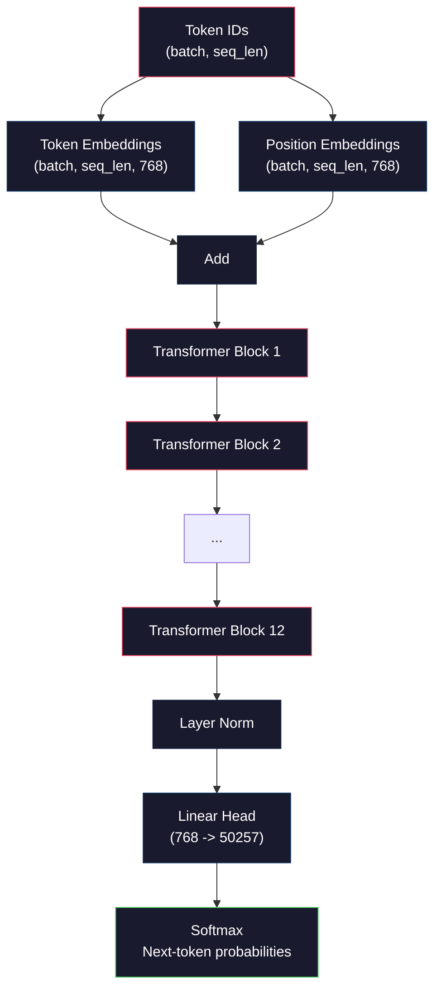
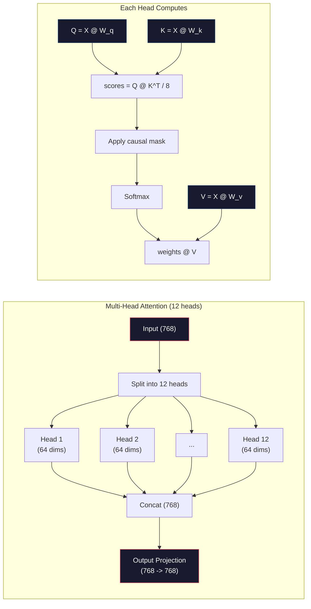
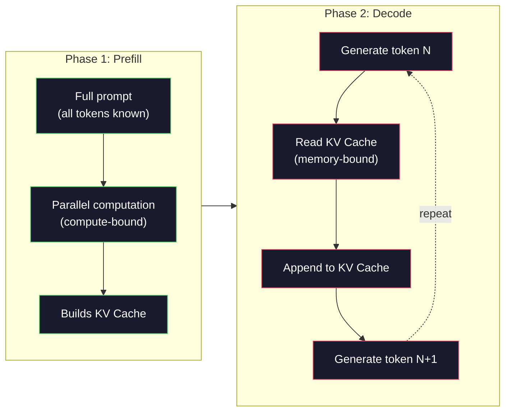

# 미니 GPT 사전 학습하기 (1억 2,400만 파라미터)

> GPT-2 Small의 파라미터(parameter)는 1억 2,400만 개다. 12개의 트랜스포머(transformer) 층(layer), 12개의 어텐션 헤드(attention head), 768차원 임베딩(embedding)으로 이뤄진다. 단일 GPU에서 몇 시간이면 밑바닥부터 학습시킬 수 있다. 대부분의 사람은 이 일을 직접 하지 않는다. 사전 학습된 체크포인트를 쓴다. 하지만 직접 하나를 학습시켜 보지 않으면, 제품을 만드는 데 쓰는 그 모델 내부에서 무슨 일이 일어나는지 사실 이해하지 못한 것이다.

**Type:** Build
**Languages:** Python (with numpy)
**Prerequisites:** Phase 10, Lessons 01-03 (Tokenizers, Building a Tokenizer, Data Pipelines)
**Time:** ~120분

## 학습 목표 (Learning Objectives)

- 전체 GPT-2 아키텍처(1억 2,400만 파라미터)를 밑바닥부터 구현하기: 토큰 임베딩, 위치 임베딩, 트랜스포머 블록, 그리고 언어 모델 헤드
- 교차 엔트로피 손실(cross-entropy loss)을 사용한 다음 토큰 예측(next-token prediction)으로 텍스트 말뭉치(corpus)에서 GPT 모델 학습시키기
- 온도 샘플링(temperature sampling)과 top-k/top-p 필터링을 사용한 자기회귀(autoregressive) 텍스트 생성 구현하기
- 학습 손실(loss) 곡선을 모니터링하고 모델이 일관된 언어 패턴을 학습하는지 검증하기

## 문제 (The Problem)

당신은 트랜스포머가 무엇인지 안다. 다이어그램도 읽었다. "attention is all you need"를 읊을 수 있고 화이트보드에 "Multi-Head Attention"이라고 쓴 상자를 그릴 수 있다.

하지만 그중 어느 것도 모델이 텍스트를 생성할 때 무슨 일이 일어나는지 당신이 이해한다는 뜻은 아니다.

GPT-2 Small에는 (가중치 묶기(weight tying)와 함께) 124,438,272개의 파라미터가 있다. 그 하나하나가 순방향 패스(forward pass), 손실 계산, 역방향 패스(backward pass), 가중치 갱신으로 이어지는 학습 루프를 돌려 설정된 값이다. 12개의 트랜스포머 블록, 블록당 12개의 어텐션 헤드, 768차원 임베딩 공간, 50,257개 토큰의 어휘. 모델이 토큰을 생성할 때마다 1억 2,400만 개의 파라미터 전부가 하나의 행렬 곱셈 연쇄에 참여해, 토큰 ID 시퀀스를 받아 다음 토큰에 대한 확률 분포(probability distribution)를 만들어 낸다.

이것을 직접 만들어 본 적이 없다면 블랙박스를 다루는 셈이다. API를 쓸 수도 있고 파인튜닝(fine-tuning)을 할 수도 있다. 하지만 모델이 환각하거나, 같은 말을 반복하거나, 지시를 따르기를 거부하는 식으로 뭔가 잘못될 때, *왜* 그런지에 대한 정신적 모델이 없다.

이 레슨은 GPT-2 Small을 밑바닥부터 만든다. PyTorch가 아니라 numpy로. 모든 행렬 곱셈이 눈에 보이고, 모든 그래디언트(gradient)를 당신의 코드로 계산한다. 1억 2,400만 개의 숫자가 어떻게 맞물려 다음 단어를 예측하는지 정확히 보게 된다.

## 개념 (The Concept)

### GPT 아키텍처

GPT는 자기회귀 언어 모델이다. "자기회귀(Autoregressive)"란 한 번에 토큰 하나를 생성하며 각각이 모든 이전 토큰에 조건부라는 뜻이다. 아키텍처는 트랜스포머 디코더(decoder) 블록을 쌓은 스택이다.

다음은 토큰 ID에서 다음 토큰 확률까지의 전체 계산 그래프(computation graph)다:

1. 토큰 ID가 들어온다. 형태(shape): (batch_size, seq_len).
2. 토큰 임베딩 조회. 각 ID가 768차원 벡터(vector)로 매핑된다. 형태: (batch_size, seq_len, 768).
3. 위치 임베딩 조회. 각 위치(0, 1, 2, ...)가 768차원 벡터로 매핑된다. 같은 형태.
4. 토큰 임베딩 + 위치 임베딩을 더한다.
5. 12개의 트랜스포머 블록을 통과시킨다.
6. 최종 층 정규화(layer normalization).
7. 어휘 크기로 선형 투영(linear projection). 형태: (batch_size, seq_len, vocab_size).
8. 확률을 얻기 위한 소프트맥스(softmax).

이것이 모델 전체다. 합성곱(convolution)도 없고 순환(recurrence)도 없다. 그저 임베딩, 어텐션, 피드포워드(feedforward) 신경망(neural network), 층 정규화를 12번 쌓은 것이다.



### 트랜스포머 블록

12개의 블록 각각은 같은 패턴을 따른다. 프리-노름(pre-norm) 아키텍처다(GPT-2는 원조 트랜스포머처럼 포스트-노름이 아니라 프리-노름을 쓴다):

1. LayerNorm
2. 멀티헤드 셀프 어텐션(Multi-Head Self-Attention)
3. 잔차 연결(residual connection) (입력을 다시 더함)
4. LayerNorm
5. 피드포워드 신경망(Feed-Forward Network, MLP)
6. 잔차 연결 (입력을 다시 더함)

잔차 연결은 결정적으로 중요하다. 이것이 없으면 역전파(backpropagation) 동안 그래디언트가 블록 1에 도달할 즈음에는 소실된다. 잔차 연결이 있으면 그래디언트가 "스킵(skip)" 경로를 통해 손실에서 임의의 층으로 직접 흐른다. 12개, 32개, 심지어 96개의 블록(GPT-4는 120개를 쓴다는 소문이 있다)까지 쌓을 수 있는 이유가 여기에 있다.

### 어텐션: 핵심 메커니즘

셀프 어텐션(self-attention)은 모든 토큰이 모든 이전 토큰을 보고 각각에 얼마나 어텐션할지 결정하게 한다. 수식은 다음과 같다.

각 토큰 위치에 대해, 입력으로부터 세 개의 벡터를 계산한다:
- **쿼리(Query, Q)**: "나는 무엇을 찾고 있는가?"
- **키(Key, K)**: "나는 무엇을 담고 있는가?"
- **값(Value, V)**: "나는 어떤 정보를 운반하는가?"

```
Q = input @ W_q    (768 -> 768)
K = input @ W_k    (768 -> 768)
V = input @ W_v    (768 -> 768)

attention_scores = Q @ K^T / sqrt(d_k)
attention_scores = mask(attention_scores)   # causal mask: -inf for future positions
attention_weights = softmax(attention_scores)
output = attention_weights @ V
```

GPT를 자기회귀로 만드는 것이 바로 인과 마스크(causal mask)다. 위치 5는 위치 0-5에 어텐션할 수 있지만 6, 7, 8 등에는 어텐션하지 못한다. 이렇게 해서 학습 중 모델이 미래 토큰을 봄으로써 "부정행위"하는 것을 막는다.

**멀티헤드 어텐션(Multi-head attention)**은 768차원 공간을 각각 64차원인 12개의 헤드로 나눈다. 각 헤드는 서로 다른 어텐션 패턴을 학습한다. 한 헤드는 구문적 관계(주어-동사 일치)를, 다른 헤드는 의미적 유사성(동의어)을, 또 다른 헤드는 위치적 근접성(가까운 단어)을 추적한다. 12개 헤드 전부의 출력은 연결(concat)되어 768차원으로 다시 투영된다.



sqrt(d_k), 즉 sqrt(64) = 8로 나누는 것은 스케일링이다. 이것이 없으면 고차원 벡터에서 내적(dot product)이 커져 소프트맥스를 그래디언트가 거의 0인 영역으로 밀어 넣는다. 원조 "Attention Is All You Need" 논문의 핵심 통찰 중 하나였다.

### KV 캐시: 추론이 빠른 이유

학습 중에는 전체 시퀀스를 한 번에 처리한다. 추론(inference) 중에는 한 번에 토큰 하나를 생성한다. 최적화 없이 토큰 N을 생성하려면 이전의 N-1개 토큰 전부에 대해 어텐션을 다시 계산해야 한다. 생성된 토큰당 O(N^2)이고, 길이 N 시퀀스에 대해 총 O(N^3)이다.

KV 캐시(KV Cache)가 이를 해결한다. 각 토큰에 대해 K와 V를 계산한 뒤 저장한다. 토큰 N+1을 생성할 때는 새 토큰에 대한 Q만 계산하고 모든 이전 토큰의 캐시된 K와 V를 조회하면 된다. 이렇게 K와 V 계산의 토큰당 비용이 O(N)에서 O(1)로 줄어든다. 모든 이전 위치에 어텐션하므로 어텐션 점수 계산은 여전히 O(N)이지만, 입력에 대한 중복 행렬 곱셈은 피한다.

층 12개와 헤드 12개를 가진 GPT-2라면, KV 캐시는 토큰당 2 (K + V) x 12 layers x 12 heads x 64 dims = 18,432개의 값을 저장한다. 1024-토큰 시퀀스라면 FP32에서 약 75MB다. 층 128개를 가진 Llama 3 405B라면, 단일 시퀀스의 KV 캐시가 10GB를 넘기도 한다. 긴 컨텍스트 추론이 메모리 한정(memory-bound)인 이유가 여기에 있다.

### 프리필 대 디코드: 추론의 두 단계

LLM에 프롬프트(prompt)를 보낼 때, 추론은 뚜렷이 구분되는 두 단계로 일어난다.

**프리필(Prefill)**은 프롬프트 전체를 병렬로 처리한다. 모든 토큰이 알려져 있으므로 모델은 모든 위치에 대한 어텐션을 동시에 계산한다. 이 단계는 연산 한정(compute-bound)이다. GPU가 최대 처리량으로 행렬 곱셈을 한다. A100에서 1000-토큰 프롬프트라면 프리필에 대략 20~50ms가 걸린다.

**디코드(Decode)**는 한 번에 토큰 하나를 생성한다. 새 토큰마다 모든 이전 토큰에 의존한다. 이 단계는 메모리 한정이다. 병목은 행렬 연산 자체가 아니라 GPU 메모리에서 모델 가중치와 KV 캐시를 읽는 데 있다. GPU의 연산 코어는 메모리 읽기를 기다리며 대부분 놀고 있다. GPT-2라면 메모리 대역폭(bandwidth)이 제약이기 때문에, 각 디코드 스텝은 행렬곱이 요구하는 FLOPs 수와 상관없이 거의 같은 시간이 걸린다.

이 구분은 프로덕션(production) 시스템에서 중요하다. 프리필 처리량(throughput)은 GPU 연산에 비례한다(더 많은 FLOPS = 더 빠른 프리필). 디코드 처리량은 메모리 대역폭에 비례한다(더 빠른 메모리 = 더 빠른 디코드). NVIDIA의 H100이 A100보다 메모리 대역폭 개선에 집중한 이유가 여기에 있다. 토큰 생성을 직접 빠르게 만들기 때문이다.



### 학습 루프

LLM 학습은 곧 다음 토큰 예측이다. 토큰 [0, 1, 2, ..., N-1]이 주어지면 토큰 [1, 2, 3, ..., N]을 예측한다. 손실 함수(loss function)는 모델이 예측한 확률 분포와 실제 다음 토큰 사이의 교차 엔트로피다.

한 번의 학습 스텝:

1. **순방향 패스**: 배치를 12개 블록 전부에 통과시킨다. 각 위치에 대한 로짓(logits, 소프트맥스 이전 점수)을 얻는다.
2. **손실 계산**: 로짓과 (한 위치만큼 이동한 입력인) 목표 토큰 사이의 교차 엔트로피.
3. **역방향 패스**: 역전파를 사용해 1억 2,400만 개 파라미터 전부에 대한 그래디언트를 계산한다.
4. **옵티마이저(optimizer) 스텝**: 가중치를 갱신한다. GPT-2는 학습률(learning rate) 워밍업(warmup)과 코사인 감쇠(cosine decay)를 가진 Adam을 쓴다.

학습률 스케줄(schedule)은 생각보다 더 중요하다. GPT-2는 처음 2,000 스텝에 걸쳐 0에서 정점 학습률까지 워밍업한 뒤 코사인 곡선을 따라 감쇠한다. 높은 학습률로 시작하면 모델이 발산하고, 일정하게 높은 학습률을 유지하면 후반 학습에서 진동이 생긴다. 워밍업 후 감쇠 패턴은 모든 주요 LLM이 쓴다.

### GPT-2 Small: 숫자들

| 구성 요소 | 형태 | 파라미터 |
|-----------|-------|------------|
| 토큰 임베딩 | (50257, 768) | 38,597,376 |
| 위치 임베딩 | (1024, 768) | 786,432 |
| 블록당 어텐션 (W_q, W_k, W_v, W_out) | 4 x (768, 768) | 2,359,296 |
| 블록당 FFN (up + down) | (768, 3072) + (3072, 768) | 4,718,592 |
| 블록당 LayerNorm (2개) | 2 x 768 x 2 | 3,072 |
| 최종 LayerNorm | 768 x 2 | 1,536 |
| **블록당 총합** | | **7,080,960** |
| **총합 (12개 블록)** | | **85,054,464 + 39,383,808 = 124,438,272** |

출력 투영(로짓 헤드)은 토큰 임베딩 행렬과 가중치를 공유한다. 이것을 가중치 묶기라고 한다. 파라미터 수를 3,800만 줄이고, 모델이 입력과 출력에 같은 표현 공간을 쓰도록 강제하기 때문에 성능도 개선한다.

## 직접 만들기 (Build It)

### 1단계: 임베딩 층

토큰 임베딩은 50,257개의 가능한 토큰 각각을 768차원 벡터로 매핑한다. 위치 임베딩은 각 토큰이 시퀀스에서 어디에 위치하는지에 대한 정보를 더한다. 둘은 합산된다.

```python
import numpy as np

class Embedding:
    def __init__(self, vocab_size, embed_dim, max_seq_len):
        self.token_embed = np.random.randn(vocab_size, embed_dim) * 0.02
        self.pos_embed = np.random.randn(max_seq_len, embed_dim) * 0.02

    def forward(self, token_ids):
        seq_len = token_ids.shape[-1]
        tok_emb = self.token_embed[token_ids]
        pos_emb = self.pos_embed[:seq_len]
        return tok_emb + pos_emb
```

초기화에 쓰는 0.02 표준편차는 GPT-2 논문에서 가져왔다. 너무 크면 초기 순방향 패스가 학습을 불안정하게 만드는 극단적인 값을 만들고, 너무 작으면 초기 출력이 모든 입력에 대해 거의 동일해져 초기 그래디언트 신호가 쓸모없어진다.

### 2단계: 인과 마스크를 가진 셀프 어텐션

먼저 단일 헤드 어텐션이다. 인과 마스크는 소프트맥스 전에 미래 위치를 음의 무한대로 설정해, 각 위치가 자신과 더 이른 위치에만 어텐션하도록 한다.

```python
def attention(Q, K, V, mask=None):
    d_k = Q.shape[-1]
    scores = Q @ K.transpose(0, -1, -2 if Q.ndim == 4 else 1) / np.sqrt(d_k)
    if mask is not None:
        scores = scores + mask
    weights = np.exp(scores - scores.max(axis=-1, keepdims=True))
    weights = weights / weights.sum(axis=-1, keepdims=True)
    return weights @ V
```

소프트맥스 구현은 지수화 전에 최댓값을 뺀다. 이것이 없으면 exp(large_number)가 무한대로 오버플로(overflow)된다. 임의의 상수 c에 대해 softmax(x - c) = softmax(x)이므로 출력을 바꾸지 않는, 수치 안정성 트릭이다.

### 3단계: 멀티헤드 어텐션

768차원 입력을 각각 64차원인 12개의 헤드로 나눈다. 각 헤드는 독립적으로 어텐션을 계산한다. 결과를 연결하고 768차원으로 다시 투영한다.

```python
class MultiHeadAttention:
    def __init__(self, embed_dim, num_heads):
        self.num_heads = num_heads
        self.head_dim = embed_dim // num_heads
        self.W_q = np.random.randn(embed_dim, embed_dim) * 0.02
        self.W_k = np.random.randn(embed_dim, embed_dim) * 0.02
        self.W_v = np.random.randn(embed_dim, embed_dim) * 0.02
        self.W_out = np.random.randn(embed_dim, embed_dim) * 0.02

    def forward(self, x, mask=None):
        batch, seq_len, d = x.shape
        Q = (x @ self.W_q).reshape(batch, seq_len, self.num_heads, self.head_dim).transpose(0, 2, 1, 3)
        K = (x @ self.W_k).reshape(batch, seq_len, self.num_heads, self.head_dim).transpose(0, 2, 1, 3)
        V = (x @ self.W_v).reshape(batch, seq_len, self.num_heads, self.head_dim).transpose(0, 2, 1, 3)

        scores = Q @ K.transpose(0, 1, 3, 2) / np.sqrt(self.head_dim)
        if mask is not None:
            scores = scores + mask
        weights = np.exp(scores - scores.max(axis=-1, keepdims=True))
        weights = weights / weights.sum(axis=-1, keepdims=True)
        attn_out = weights @ V

        attn_out = attn_out.transpose(0, 2, 1, 3).reshape(batch, seq_len, d)
        return attn_out @ self.W_out
```

reshape-transpose-reshape 춤은 멀티헤드 어텐션에서 가장 헷갈리는 부분이다. 여기서 일어나는 일은 이렇다. (batch, seq_len, 768) 텐서(tensor)가 (batch, seq_len, 12, 64)가 되고, 그다음 (batch, 12, seq_len, 64)가 된다. 이제 12개 헤드 각각이 어텐션을 실행할 자신만의 (seq_len, 64) 행렬을 가진다. 어텐션을 마치면 과정을 역으로 돌린다. (batch, 12, seq_len, 64)가 (batch, seq_len, 12, 64)가 되고 다시 (batch, seq_len, 768)이 된다.

### 4단계: 트랜스포머 블록

하나의 완전한 트랜스포머 블록: LayerNorm, 잔차를 가진 멀티헤드 어텐션, LayerNorm, 잔차를 가진 피드포워드.

```python
class LayerNorm:
    def __init__(self, dim, eps=1e-5):
        self.gamma = np.ones(dim)
        self.beta = np.zeros(dim)
        self.eps = eps

    def forward(self, x):
        mean = x.mean(axis=-1, keepdims=True)
        var = x.var(axis=-1, keepdims=True)
        return self.gamma * (x - mean) / np.sqrt(var + self.eps) + self.beta


class FeedForward:
    def __init__(self, embed_dim, ff_dim):
        self.W1 = np.random.randn(embed_dim, ff_dim) * 0.02
        self.b1 = np.zeros(ff_dim)
        self.W2 = np.random.randn(ff_dim, embed_dim) * 0.02
        self.b2 = np.zeros(embed_dim)

    def forward(self, x):
        h = x @ self.W1 + self.b1
        h = np.maximum(0, h)  # GELU approximation: ReLU for simplicity
        return h @ self.W2 + self.b2


class TransformerBlock:
    def __init__(self, embed_dim, num_heads, ff_dim):
        self.ln1 = LayerNorm(embed_dim)
        self.attn = MultiHeadAttention(embed_dim, num_heads)
        self.ln2 = LayerNorm(embed_dim)
        self.ffn = FeedForward(embed_dim, ff_dim)

    def forward(self, x, mask=None):
        x = x + self.attn.forward(self.ln1.forward(x), mask)
        x = x + self.ffn.forward(self.ln2.forward(x))
        return x
```

피드포워드 신경망은 768차원 입력을 3,072차원(4배)으로 확장하고 비선형성을 적용한 뒤 768차원으로 다시 투영한다. 이 확장-수축 패턴은 각 위치에서 작업할 "더 넓은" 내부 표현을 모델에 준다. GPT-2는 GELU 활성화를 쓰지만 여기서는 단순함을 위해 ReLU를 쓴다. 아키텍처를 이해하는 데에는 그 차이가 미미하다.

### 5단계: 전체 GPT 모델

12개의 트랜스포머 블록을 쌓는다. 앞에 임베딩 층을, 뒤에 출력 투영을 추가한다.

```python
class MiniGPT:
    def __init__(self, vocab_size=50257, embed_dim=768, num_heads=12,
                 num_layers=12, max_seq_len=1024, ff_dim=3072):
        self.embedding = Embedding(vocab_size, embed_dim, max_seq_len)
        self.blocks = [
            TransformerBlock(embed_dim, num_heads, ff_dim)
            for _ in range(num_layers)
        ]
        self.ln_f = LayerNorm(embed_dim)
        self.vocab_size = vocab_size
        self.embed_dim = embed_dim

    def forward(self, token_ids):
        seq_len = token_ids.shape[-1]
        mask = np.triu(np.full((seq_len, seq_len), -1e9), k=1)

        x = self.embedding.forward(token_ids)
        for block in self.blocks:
            x = block.forward(x, mask)
        x = self.ln_f.forward(x)

        logits = x @ self.embedding.token_embed.T
        return logits

    def count_parameters(self):
        total = 0
        total += self.embedding.token_embed.size
        total += self.embedding.pos_embed.size
        for block in self.blocks:
            total += block.attn.W_q.size + block.attn.W_k.size
            total += block.attn.W_v.size + block.attn.W_out.size
            total += block.ffn.W1.size + block.ffn.b1.size
            total += block.ffn.W2.size + block.ffn.b2.size
            total += block.ln1.gamma.size + block.ln1.beta.size
            total += block.ln2.gamma.size + block.ln2.beta.size
        total += self.ln_f.gamma.size + self.ln_f.beta.size
        return total
```

가중치 묶기에 주목하라. `logits = x @ self.embedding.token_embed.T`에서 출력 투영은 (전치된) 토큰 임베딩 행렬을 재사용한다. 단지 파라미터를 아끼는 트릭이 아니라, 모델이 토큰을 이해하는 일(임베딩)과 예측하는 일(출력)에 같은 벡터 공간을 쓴다는 뜻이다.

### 6단계: 학습 루프

1억 2,400만 파라미터를 실제로 학습시키려면 GPU와 PyTorch가 필요하다. 이 학습 루프는 순수 numpy로 실행되는 작은 모델에서 그 메커니즘을 보여 준다. 다룰 만하게 하려고 아주 작은 모델(4 층, 4 헤드, 128 차원)을 쓴다.

```python
def cross_entropy_loss(logits, targets):
    batch, seq_len, vocab_size = logits.shape
    logits_flat = logits.reshape(-1, vocab_size)
    targets_flat = targets.reshape(-1)

    max_logits = logits_flat.max(axis=-1, keepdims=True)
    log_softmax = logits_flat - max_logits - np.log(
        np.exp(logits_flat - max_logits).sum(axis=-1, keepdims=True)
    )

    loss = -log_softmax[np.arange(len(targets_flat)), targets_flat].mean()
    return loss


def train_mini_gpt(text, vocab_size=256, embed_dim=128, num_heads=4,
                   num_layers=4, seq_len=64, num_steps=200, lr=3e-4):
    tokens = np.array(list(text.encode("utf-8")[:2048]))
    model = MiniGPT(
        vocab_size=vocab_size, embed_dim=embed_dim, num_heads=num_heads,
        num_layers=num_layers, max_seq_len=seq_len, ff_dim=embed_dim * 4
    )

    print(f"Model parameters: {model.count_parameters():,}")
    print(f"Training tokens: {len(tokens):,}")
    print(f"Config: {num_layers} layers, {num_heads} heads, {embed_dim} dims")
    print()

    for step in range(num_steps):
        start_idx = np.random.randint(0, max(1, len(tokens) - seq_len - 1))
        batch_tokens = tokens[start_idx:start_idx + seq_len + 1]

        input_ids = batch_tokens[:-1].reshape(1, -1)
        target_ids = batch_tokens[1:].reshape(1, -1)

        logits = model.forward(input_ids)
        loss = cross_entropy_loss(logits, target_ids)

        if step % 20 == 0:
            print(f"Step {step:4d} | Loss: {loss:.4f}")

    return model
```

손실은 ln(vocab_size) 근처에서 시작한다. 256-토큰 바이트 수준 어휘라면 ln(256) = 5.55다. 무작위 모델은 모든 토큰에 동일한 확률을 할당한다. 학습이 진행되면 모델이 "t" 뒤의 "th", 마침표 뒤의 공백 같은 흔한 패턴을 예측하도록 학습하기 때문에 손실이 떨어진다.

프로덕션에서는 그래디언트 누적(gradient accumulation), 학습률 워밍업, 그래디언트 클리핑(clipping)을 갖춘 Adam 옵티마이저를 쓴다. 순방향-패스-손실-역방향-갱신 루프는 동일하다. 옵티마이저가 더 정교할 뿐이다.

### 7단계: 텍스트 생성

생성은 학습된 모델을 사용해 한 번에 토큰 하나를 예측한다. 각 예측은 출력 분포에서 샘플링되거나(또는 argmax로 탐욕적으로 취해진다).

```python
def generate(model, prompt_tokens, max_new_tokens=100, temperature=0.8):
    tokens = list(prompt_tokens)
    seq_len = model.embedding.pos_embed.shape[0]

    for _ in range(max_new_tokens):
        context = np.array(tokens[-seq_len:]).reshape(1, -1)
        logits = model.forward(context)
        next_logits = logits[0, -1, :]

        next_logits = next_logits / temperature
        probs = np.exp(next_logits - next_logits.max())
        probs = probs / probs.sum()

        next_token = np.random.choice(len(probs), p=probs)
        tokens.append(next_token)

    return tokens
```

온도(temperature)는 무작위성을 제어한다. 온도 1.0은 원시 분포를 그대로 쓴다. 온도 0.5는 분포를 날카롭게 만든다(더 결정론적이어서 모델이 최상위 선택을 더 자주 고른다). 온도 1.5는 분포를 평평하게 만든다(더 무작위여서 낮은 확률의 토큰이 더 큰 기회를 얻는다). 온도 0.0은 탐욕적 디코딩(greedy decoding)으로, 항상 가장 높은 확률의 토큰을 고른다.

`tokens[-seq_len:]` 윈도우가 필요한 까닭은 모델의 최대 컨텍스트 길이가 정해져 있기 때문이다(GPT-2라면 1024). 이를 초과하면 가장 오래된 토큰을 버려야 한다. 이것이 모두가 이야기하는 "컨텍스트 윈도우(context window)"다.

## 라이브러리로 써보기 (Use It)

### 전체 학습 및 생성 데모

```python
corpus = """The transformer architecture has revolutionized natural language processing.
Attention mechanisms allow the model to focus on relevant parts of the input.
Self-attention computes relationships between all pairs of positions in a sequence.
Multi-head attention splits the representation into multiple subspaces.
Each attention head can learn different types of relationships.
The feedforward network provides nonlinear transformations at each position.
Residual connections enable gradient flow through deep networks.
Layer normalization stabilizes training by normalizing activations.
Position embeddings give the model information about token ordering.
The causal mask ensures autoregressive generation during training.
Pre-training on large text corpora teaches the model general language understanding.
Fine-tuning adapts the pre-trained model to specific downstream tasks."""

model = train_mini_gpt(corpus, num_steps=200)

prompt = list("The transformer".encode("utf-8"))
output_tokens = generate(model, prompt, max_new_tokens=100, temperature=0.8)
generated_text = bytes(output_tokens).decode("utf-8", errors="replace")
print(f"\nGenerated: {generated_text}")
```

작은 모델로 작은 말뭉치에서 학습하면, 생성된 텍스트는 잘해야 반쯤 일관된 수준이다. 학습 텍스트에서 약간의 바이트 수준 패턴은 학습하지만, 40GB의 학습 데이터와 전체 1억 2,400만 파라미터 아키텍처를 가진 GPT-2처럼 일반화하지는 못한다. 요점은 출력 품질이 아니라, 임베딩 조회, 어텐션 계산, 피드포워드 변환, 로짓 투영, 소프트맥스, 샘플링까지 모든 스텝을 당신이 추적할 수 있다는 것이다. 모든 연산이 눈에 보인다.

## 산출물 (Ship It)

이 레슨은 `outputs/prompt-gpt-architecture-analyzer.md`를 만든다. 임의의 GPT 스타일 모델의 아키텍처 선택을 분석하는 프롬프트다. 모델 카드나 기술 보고서를 입력하면 파라미터 할당, 어텐션 설계, 스케일링 결정을 분석해 준다.

## 연습 문제 (Exercises)

1. 12/12 대신 24개 층과 16개 헤드를 쓰도록 모델을 수정하라. 파라미터를 세어라. 깊이를 두 배로 하는 것이 너비(임베딩 차원)를 두 배로 하는 것과 어떻게 비교되는가?

2. GELU 활성화 함수(GELU(x) = x * 0.5 * (1 + erf(x / sqrt(2))))를 구현하고 피드포워드 신경망의 ReLU를 대체하라. 각 활성화로 500 스텝 학습을 실행하고 최종 손실을 비교하라.

3. 생성 함수에 KV 캐시를 추가하라. 첫 순방향 패스 후 각 층의 K와 V 텐서를 저장하고, 후속 토큰에 그것들을 재사용하라. 속도 향상을 측정하라: 캐시가 있을 때와 없을 때 200 토큰을 생성하고 실제 경과 시간(wall-clock time)을 비교하라.

4. top-k 샘플링(가장 높은 확률의 k개 토큰만 고려)과 top-p 샘플링(뉴클리어스(nucleus) 샘플링: 누적 확률이 p를 넘는 가장 작은 토큰 집합을 고려)을 구현하라. 온도 0.8에서 top-k=50과 top-p=0.95의 출력 품질을 비교하라.

5. 학습 손실 곡선 플로터를 만들어라. 모델을 1000 스텝 학습시키고 손실 대 스텝을 플롯하라. 세 단계를 식별하라: 빠른 초기 하강(흔한 바이트 학습), 더 느린 중간 단계(바이트 패턴 학습), 그리고 정체(작은 말뭉치에 대한 과적합(overfitting)). 이 곡선의 모양은 128차원 모델을 학습하든 GPT-4를 학습하든 동일하다.

## 핵심 용어 (Key Terms)

| 용어 | 사람들이 말하는 것 | 실제 의미 |
|------|----------------|----------------------|
| 자기회귀(Autoregressive) | "한 번에 한 단어씩 생성한다" | 각 출력 토큰이 모든 이전 토큰에 조건부다 -- 모델은 P(token_n \| token_0, ..., token_{n-1})을 예측한다 |
| 인과 마스크(Causal mask) | "미래를 볼 수 없다" | 학습 중 미래 위치로의 어텐션을 막는, -infinity 값의 상삼각 행렬 |
| 멀티헤드 어텐션(Multi-head attention) | "여러 어텐션 패턴" | Q, K, V를 병렬 헤드로 나누기(예: GPT-2의 경우 각 64차원의 12개 헤드)로 각 헤드가 서로 다른 관계 유형을 학습할 수 있게 한다 |
| KV 캐시(KV Cache) | "속도를 위한 캐싱" | 자기회귀 생성 동안 중복 계산을 피하기 위해 이전 토큰에서 계산된 키와 값 텐서를 저장하기 |
| 프리필(Prefill) | "프롬프트 처리" | 모든 프롬프트 토큰이 병렬로 처리되는 첫 추론 단계 -- GPU FLOPS에 연산 한정 |
| 디코드(Decode) | "토큰 생성" | 토큰이 한 번에 하나씩 생성되는 두 번째 추론 단계 -- GPU 대역폭에 메모리 한정 |
| 가중치 묶기(Weight tying) | "임베딩 공유" | 입력 토큰 임베딩과 출력 투영 헤드에 같은 행렬을 쓰기 -- GPT-2에서 3,800만 파라미터를 아낀다 |
| 잔차 연결(Residual connection) | "스킵 연결" | 입력을 하위 층의 출력에 직접 더하기(x + sublayer(x)) -- 깊은 신경망에서 그래디언트 흐름을 가능하게 한다 |
| 층 정규화(Layer normalization) | "활성값 정규화" | 학습 가능한 스케일과 편향(bias) 파라미터와 함께, 특성 차원에 걸쳐 평균 0과 분산 1로 정규화하기 |
| 교차 엔트로피 손실(Cross-entropy loss) | "예측이 얼마나 틀렸는가" | -log(올바른 다음 토큰에 할당된 확률), 모든 위치에 걸쳐 평균낸 것 -- 표준 LLM 학습 목표 |

## 더 읽을거리 (Further Reading)

- [Radford et al., 2019 -- "Language Models are Unsupervised Multitask Learners" (GPT-2)](https://cdn.openai.com/better-language-models/language_models_are_unsupervised_multitask_learners.pdf) -- 1억 2,400만에서 15억 파라미터 계열을 도입한 GPT-2 논문
- [Vaswani et al., 2017 -- "Attention Is All You Need"](https://arxiv.org/abs/1706.03762) -- 스케일드 내적 어텐션과 멀티헤드 어텐션을 가진 원조 트랜스포머 논문
- [Llama 3 Technical Report](https://arxiv.org/abs/2407.21783) -- Meta가 1만 6,000개 GPU로 GPT 아키텍처를 405B 파라미터까지 스케일링한 방법
- [Pope et al., 2022 -- "Efficiently Scaling Transformer Inference"](https://arxiv.org/abs/2211.05102) -- 프리필 대 디코드와 KV 캐시 분석을 정식화한 논문
