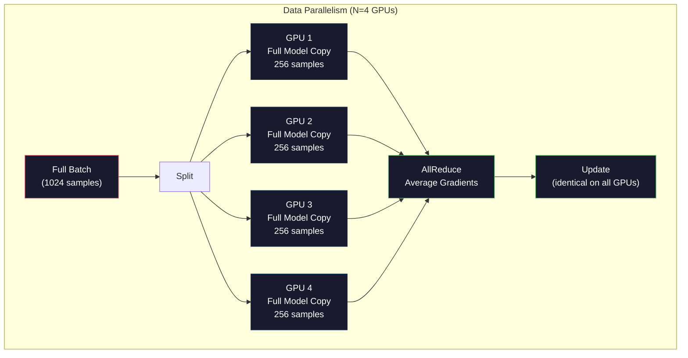
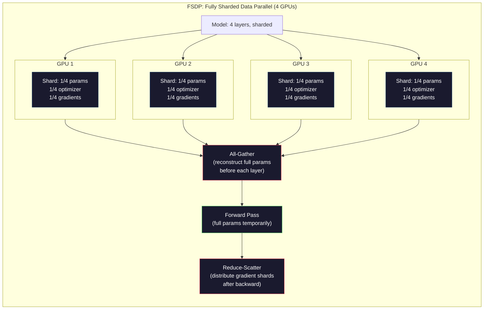
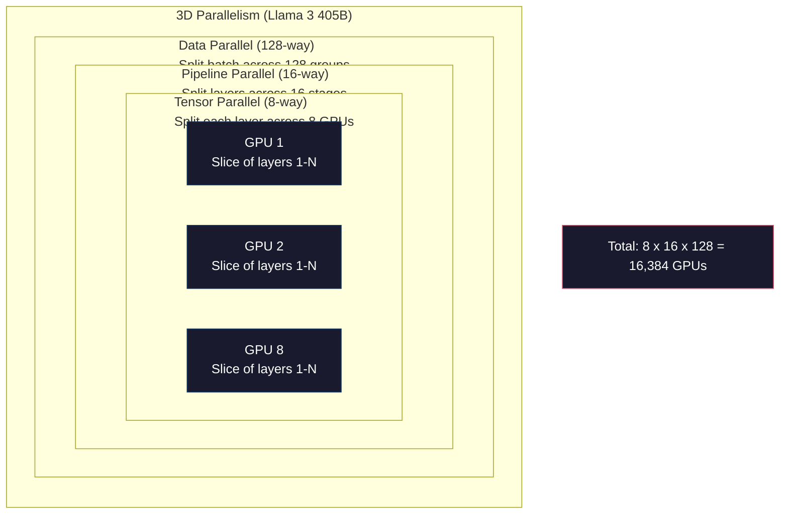

# 스케일링: 분산 학습, FSDP, DeepSpeed

> 당신의 1억 2,400만 모델은 GPU 하나에서 학습되었다. 이제 70억 파라미터(parameter)를 시도해 보라. 모델이 메모리에 들어가지 않는다. 단일 머신에서 데이터를 처리하는 데 몇 주가 걸린다. 대규모에서 분산 학습(distributed training)은 선택이 아니다. 앞으로 나아가는 유일한 길이다.

**Type:** Build
**Languages:** Python
**Prerequisites:** Phase 10, Lesson 04 (Pre-Training a Mini GPT)
**Time:** ~120분

## 학습 목표 (Learning Objectives)

- 세 가지 유형의 병렬성(데이터, 텐서, 파이프라인)과 모델 및 클러스터 크기에 따라 각각이 언제 필요한지 설명하기
- 여러 GPU에 걸친 그래디언트(gradient) 동기화를 사용해 PyTorch DDP로 데이터 병렬(data-parallel) 학습 구현하기
- 주어진 모델 크기(가중치(weight) + 옵티마이저(optimizer) 상태 + 그래디언트 + 활성값(activation))에 대한 메모리 예산을 계산해 최소 하드웨어 결정하기
- 단일 GPU 메모리를 초과하는 모델을 맞추기 위해 GPU에 걸쳐 모델 상태를 분할(shard)하도록 FSDP 또는 DeepSpeed ZeRO 단계 구성하기

## 문제 (The Problem)

FP16의 70억 파라미터 모델은 가중치만으로 14GB가 필요하다. Adam 옵티마이저는 모든 파라미터의 추가 사본 두 개(1차 모멘트와 2차 모멘트 추정치)를 저장한다. 그것이 또 28GB다. 역전파(backpropagation) 중 그래디언트가 14GB를 더한다. 단 하나의 활성값을 저장하기도 전에 56GB에 도달한다.

NVIDIA A100은 80GB의 메모리를 가진다.

80GB 중 56GB가 소비되었다. 그것은 활성값에 24GB를 남긴다 -- 순방향 패스(forward pass) 중 계산되어 역전파를 위해 살아 있어야 하는 중간값들이다. 4096차원 모델로 2048-토큰 시퀀스의 경우, 단일 층(layer)의 활성값은 약 64MB를 쓴다. 32개 층이면, 샘플당 2GB가 필요하다. 배치(batch) 크기 8은 16GB를 요구한다. 당신에게는 24GB가 있다. 배치 크기 12는 터진다.

이제 700억 파라미터를 시도해 보라. 가중치만으로: FP16에서 140GB. GPU 하나에 들어가지 않는다. 가중치를 담기만 하려 해도 최소 2개의 A100(2 x 80GB = 160GB)이 필요하다. 옵티마이저 상태와 그래디언트를 더하면 훨씬 더 필요하다: 최소 3개 이상의 GPU, 그리고 분할 전략에 따라 현실적으로 8~16개.

Llama 3 405B는 16,384개의 NVIDIA H100 GPU에서 학습되었다. 그 학습 실행은 연산 비용으로 추정 1억 달러가 들었다. DeepSeek V3는 아키텍처(전문가 혼합(Mixture of Experts)은 토큰당 파라미터의 일부만 활성화된다는 뜻)와 학습 효율에 영리했던 덕분에 비슷한 모델을 대략 560만 달러로 학습했다.

이 레슨은 대규모 학습을 가능하게 하는 네 가지 전략을 다룬다: 데이터 병렬성, 텐서 병렬성, 파이프라인 병렬성, 그리고 완전 분할 데이터 병렬성. 분산 학습 프레임워크를 건드리기도 전에 메커니즘을 이해하기 위해 각각을 순수 Python으로 시뮬레이션하게 된다.

## 개념 (The Concept)

### 왜 분산이 필요한가

실제 모델에 대한 메모리 계산은 다음과 같다. 모든 숫자는 추정이 아니라 계산된 것이다.

| 모델 | 파라미터 | 가중치 (FP16) | Adam 상태 | 그래디언트 (FP16) | 총합 (활성값 제외) |
|-------|--------|----------------|-------------|------------------|----------------------|
| GPT-2 Small | 124M | 248 MB | 992 MB | 248 MB | 1.5 GB |
| Llama 3 8B | 8B | 16 GB | 64 GB | 16 GB | 96 GB |
| Llama 3 70B | 70B | 140 GB | 560 GB | 140 GB | 840 GB |
| Llama 3 405B | 405B | 810 GB | 3,240 GB | 810 GB | 4,860 GB |

"Adam 상태" 열이 결정타다. Adam은 모든 파라미터에 대해 실행 평균(m)과 실행 분산(v)을 둘 다 FP32로 저장한다. 700억 모델의 경우, 그것은 70B x 4 bytes x 2 = 560GB다. 옵티마이저만으로 7개의 A100이 필요하다.

단일 H100은 80GB를 가진다. Llama 3 405B는 가중치, 옵티마이저, 그래디언트를 담으려면 최소 61개의 H100이 필요하다. 활성값을 더하면 숫자는 더 커진다. Meta가 16,384개의 GPU를 쓴 것은 원해서가 아니다 -- 그래야만 했기 때문이다.

### 데이터 병렬성 (Data Parallelism)

가장 단순한 분산 전략이다. 전체 모델을 N개의 GPU에 복사한다. 각 학습 배치를 N개의 동일한 부분으로 나눈다. 각 GPU는 자기 데이터 조각에 대해 순방향과 역방향 패스를 실행한다. 역방향 패스 후, 모든 GPU에 걸쳐 그래디언트를 평균한다. 모든 GPU가 같은 평균 그래디언트로 자신의 가중치 사본을 갱신하여, 모든 사본을 동기화 상태로 유지한다.

**장점:** 선형 처리량(throughput) 스케일링. N개의 GPU가 스텝당 N배 많은 데이터를 처리한다. 통신은 계산과 겹치는 그래디언트 평균화로 제한된다.

**단점:** 모든 GPU가 모델, 옵티마이저 상태, 그래디언트의 완전한 사본을 가진다. 700억 모델의 경우, 각 GPU는 840GB가 필요하다. 데이터 병렬성은 GPU당 메모리를 줄이는 데 아무것도 하지 않는다. 학습 시간만 줄인다.

**계산:** 유효 배치 크기 = per_gpu_batch_size x N. GPU당 배치 16인 N=64 GPU의 경우, 유효 배치는 1,024다. Llama 3는 스텝당 1,600만 토큰의 유효 배치 크기를 썼다.



### 텐서 병렬성 (Tensor Parallelism)

개별 층을 GPU에 걸쳐 나눈다. 단일 행렬 곱셈이 GPU들 사이에서 나뉘어, 각각이 결과의 일부를 계산한다.

피드포워드(feedforward) 층의 (8192, 8192) 형태 가중치 행렬을 생각해 보자. 4-way 텐서 병렬성으로, 각 GPU는 (8192, 2048) 조각을 가진다. 각 GPU는 입력을 자기 조각과 곱해 부분 결과를 만든다. 부분 결과들은 (all-reduce나 all-gather를 통해) 결합되어 전체 출력을 만든다.

**장점:** 모델 가중치에 대한 GPU당 메모리를 줄인다. 8개 GPU에 걸쳐 나뉜 700억 모델은 각 GPU가 ~87.5억 파라미터어치의 가중치를 가진다는 뜻이다.

**단점:** 모든 층 후에 빠른 GPU 간 통신이 필요하다. 각 행렬곱 후의 all-reduce가 지연 시간(latency)을 더한다. 이것은 (같은 노드의 GPU 간 900 GB/s인) NVLink로는 잘 작동하지만 (400 Gb/s, 약 50 GB/s인) InfiniBand로 연결된 노드 간에는 잘 안 된다. 텐서 병렬성은 거의 항상 단일 노드(8개 GPU) 안으로 제한된다.

**실제 사용:** Megatron-LM이 텐서 병렬성을 개척했다. Llama 3 405B는 각 노드 안에서 8-way 텐서 병렬성을 쓴다.

### 파이프라인 병렬성 (Pipeline Parallelism)

모델을 층별로 나눈다. GPU 1은 층 1-8을 실행한다. GPU 2는 층 9-16을 실행한다. GPU 3은 층 17-24를 실행한다. GPU 4는 층 25-32를 실행한다. 데이터가 파이프라인(pipeline)을 통해 흐른다: GPU 1이 자기 층을 계산하고 활성값을 GPU 2로 보내면, GPU 2가 자기 층을 계산하고 GPU 3으로 보내고, 이런 식이다.

**장점:** GPU 간 최소한의 통신 -- 그래디언트나 가중치에 비해 작은, 층 경계의 활성값만 보낸다. 대역폭(bandwidth) 요구가 낮기 때문에 노드 간에도 작동한다.

**단점:** 파이프라인 버블(pipeline bubble). GPU 4가 마이크로배치(micro-batch) 1에 대한 순방향 패스를 계산하고 있을 때, GPU 1, 2, 3은 놀고 있다(그들은 이미 자기 부분을 순방향으로 보냈다). 역방향 패스 동안 패턴이 반대로 된다. 순진한 파이프라이닝으로는 N개의 파이프라인 단계에 대해 GPU 활용도가 1/N에 불과하다.

**GPipe와 PipeDream**은 배치를 마이크로배치로 나눔으로써 버블 문제를 해결한다. GPU 1은 마이크로배치 1을 순방향으로 보내는 것을 끝내자마자 마이크로배치 2를 시작한다. 이것은 파이프라인 단계에 걸쳐 계산을 겹친다. M개의 마이크로배치와 N개의 단계로, 버블 비율은 (N-1)/M로 떨어진다. N=4 단계로 M=16 마이크로배치를 쓰면 버블은 3/16 = 18.75% 유휴 시간이다.

### FSDP: 완전 분할 데이터 병렬 (Fully Sharded Data Parallel)

FSDP는 데이터 병렬성의 확장성과 분할의 메모리 효율을 결합한다. 각 GPU가 모델의 완전한 사본을 가지는 대신, 각 GPU는 파라미터, 그래디언트, 옵티마이저 상태의 1/N만 가진다.

층의 순방향 패스 전에, FSDP는 **all-gather**를 실행해 모든 GPU로부터 전체 파라미터를 각 GPU의 메모리로 모은다. 순방향 패스 후, 각 GPU는 비로컬 파라미터를 버린다. 역방향 동안, 그래디언트 계산을 위해 파라미터를 재구성하려고 all-gather가 다시 실행된다. 역방향 패스 후, **reduce-scatter**가 그래디언트 조각을 분배해 각 GPU가 그래디언트의 1/N만 저장하게 한다.

**8개 GPU에서 700억 모델에 대한 계산:**

| 구성 요소 | FSDP 없음 | FSDP 있음 |
|-----------|-------------|-----------|
| 가중치 (FP16) | GPU당 140 GB | GPU당 17.5 GB |
| Adam 상태 (FP32) | GPU당 560 GB | GPU당 70 GB |
| 그래디언트 (FP16) | GPU당 140 GB | GPU당 17.5 GB |
| **총합** | **GPU당 840 GB** | **GPU당 105 GB** |

FSDP 없이는 700억 모델을 단일 80GB GPU에 맞출 수 없다. 8개 GPU에서 FSDP로, 각 GPU는 105GB를 쓴다 -- 잠깐, 그것도 여전히 안 들어간다. GPU당 80GB 아래로 가려면 최소 16개의 GPU가 필요하거나, FSDP를 활성값 체크포인팅(activation checkpointing)(활성값을 저장하는 대신 역방향 동안 재계산)과 결합해야 한다.

각 층 전의 all-gather 때문에 통신 비용이 바닐라 데이터 병렬성보다 높다. 하지만 메모리 절감이 이전에 불가능했던 학습 실행을 가능하게 만든다.



### DeepSpeed ZeRO

DeepSpeed의 ZeRO(Zero Redundancy Optimizer)는 개념적으로 FSDP와 동일하지만 Microsoft가 독립적으로 개발했다. 각각 더 공격적으로 분할하는 세 단계를 정의한다:

| 단계 | 분할 대상 | 메모리 절감 | 통신 |
|-------|--------|---------------|---------------|
| ZeRO-1 | 옵티마이저 상태만 | ~4배 감소 | 데이터 병렬과 동일 |
| ZeRO-2 | + 그래디언트 | ~8배 감소 | 약간 더 많음 |
| ZeRO-3 | + 파라미터 | ~N배 감소 (N개 GPU) | 층당 all-gather |

ZeRO-3은 FSDP와 동등하다. 명명이 다를 뿐, 메커니즘은 같다. PyTorch는 DeepSpeed가 개념을 증명한 후 FSDP를 네이티브 구현으로 추가했다.

DeepSpeed는 또한 ZeRO-Offload(옵티마이저 상태를 더 싸고 큰 CPU RAM으로 오프로드)와 ZeRO-Infinity(NVMe SSD로 오프로드)를 도입했다. 이것들은 메모리 용량을 위해 연산 속도를 거래한다 -- 오프로드된 연산은 더 느리지만 GPU 메모리를 해방한다.

### 혼합 정밀도 학습 (Mixed Precision Training)

현대 학습은 여러 부동소수점 형식을 동시에 쓴다:

- **순방향 패스**: FP16 또는 BF16(16비트). FP32의 절반 메모리. 텐서 코어에서 행렬곱이 2배 빠르게 실행된다.
- **마스터 가중치**: FP32(32비트). 가중치 갱신 동안 수치 정밀도를 위해 옵티마이저가 유지한다.
- **손실 스케일링**: FP16 그래디언트가 0으로 언더플로(underflow)되는 것을 막기 위해 역방향 패스 전에 손실(loss)에 큰 상수를 곱한다. 옵티마이저 스텝 전에 같은 상수로 나눈다.

BF16(Brain Float 16)은 FP32와 같은 지수 범위(지수 비트 8개)를 가지지만 정밀도가 줄어들었다(가수 비트 7개 대 FP32의 23개). 같은 범위의 값을 표현할 수 있기 때문에 손실 스케일링이 거의 필요 없다. FP16은 지수 비트 5개와 가수 비트 10개를 가진다 -- 세밀한 값을 표현할 수 있지만 극단적인 크기에서 오버플로/언더플로된다.

Google의 TPU는 BF16을 네이티브로 쓴다. NVIDIA의 A100과 H100은 FP16과 BF16을 모두 지원한다. 업계는 손실 스케일링의 골칫거리를 없애기 때문에 대체로 BF16으로 옮겨갔다.

**70억 모델에 대한 메모리 비교:**

| 정밀도 | 가중치 | 옵티마이저 | 그래디언트 | 총합 |
|-----------|---------|-----------|-----------|-------|
| 전부 FP32 | 28 GB | 56 GB | 28 GB | 112 GB |
| 혼합 (BF16 + FP32 마스터) | 14 GB | 56 GB | 14 GB | 84 GB |

혼합 정밀도는 이 모델에서 28GB를 절약한다. 옵티마이저 상태는 무엇이든 FP32로 유지된다 -- 여기가 대부분의 메모리가 가는 곳이다.

### Megatron-LM과 3D 병렬성

실제 대규모 학습은 세 병렬성을 모두 결합한다:

- 노드 그룹 간 **데이터 병렬성** (배치 크기 스케일링)
- 노드 안 **텐서 병렬성** (8개 GPU에 걸쳐 층 나누기)
- 노드 간 **파이프라인 병렬성** (머신 간 층 그룹 나누기)

16,384개의 H100에서 Llama 3 405B:
- 각 노드 안 8-way 텐서 병렬성 (노드당 8개 GPU)
- 노드 간 16-way 파이프라인 병렬성 (16개 파이프라인 단계)
- 나머지 차원에 걸친 128-way 데이터 병렬성 (16,384 / 8 / 16 = 128)

이 3D 분해(8 x 16 x 128 = 16,384)가 수천 개의 GPU로 스케일링하는 방법이다. 각 GPU는 서로 다른 데이터 조각을 보고(데이터 병렬), 각 층의 한 조각을 가지며(텐서 병렬), 서로 다른 층 집합을 계산한다(파이프라인 병렬).

DeepSeek V3는 다른 접근법을 취했다. 그들의 전문가 혼합(Mixture of Experts) 아키텍처는 토큰당 6,710억 중 370억 파라미터만 활성화한다. 이는 각 GPU가 활성 파라미터만 계산(하고 그에 대한 활성값을 저장)하면 된다는 뜻이다. 그들은 2,048개의 H800 GPU -- Meta의 GPU 수의 1/8 미만 -- 로 560만 달러에 학습했다(Meta의 추정 1억 달러 대비).



## 직접 만들기 (Build It)

### 1단계: 데이터 병렬성 시뮬레이션

배치를 시뮬레이션된 GPU에 걸쳐 나눈다. 각 GPU는 자기 조각에 대해 순방향 패스를 계산한다. "그래디언트"(손실 값으로 시뮬레이션)를 평균한다.

```python
import numpy as np

def simulate_data_parallelism(data, num_gpus, model_fn):
    batch_size = len(data)
    shard_size = batch_size // num_gpus
    remainder = batch_size % num_gpus

    gpu_losses = []
    gpu_gradients = []

    offset = 0
    for gpu_id in range(num_gpus):
        extra = 1 if gpu_id < remainder else 0
        shard = data[offset:offset + shard_size + extra]
        offset += shard_size + extra

        loss, grad = model_fn(shard)
        gpu_losses.append(loss)
        gpu_gradients.append(grad)

    avg_loss = np.mean(gpu_losses)
    avg_gradient = np.mean(gpu_gradients, axis=0)

    return avg_loss, avg_gradient
```

all-reduce 연산(그래디언트 평균화)은 데이터 병렬성에서 유일한 통신이다. 실제로 이것은 NVIDIA GPU에서 ring all-reduce를 구현하는 NCCL 라이브러리를 쓴다: 각 GPU는 그래디언트의 1/N을 이웃에게 보내고, 다른 이웃으로부터 1/N을 받으며, N-1 스텝 후 모든 GPU가 완전한 평균을 갖는다. 총 통신량: 2 x gradient_size x (N-1)/N, 큰 N에 대해 그래디언트 크기의 2배에 접근한다.

### 2단계: 텐서 병렬성 시뮬레이션

가중치 행렬을 GPU에 걸쳐 나눈다. 각 GPU는 부분 행렬 곱셈을 계산한다. 결과를 결합한다.

```python
def simulate_tensor_parallelism(input_data, weight_matrix, num_gpus):
    d_in, d_out = weight_matrix.shape
    assert d_out % num_gpus == 0, f"d_out {d_out} not divisible by num_gpus {num_gpus}"
    shard_size = d_out // num_gpus

    partial_results = []
    for gpu_id in range(num_gpus):
        start = gpu_id * shard_size
        end = start + shard_size
        weight_shard = weight_matrix[:, start:end]

        partial = input_data @ weight_shard
        partial_results.append(partial)

    full_output = np.concatenate(partial_results, axis=-1)

    direct_output = input_data @ weight_matrix
    error = np.abs(full_output - direct_output).max()

    return full_output, error
```

오차는 정확히 0(또는 머신 엡실론)이어야 한다. 텐서 병렬성은 수학적으로 정확하다 -- 하나의 GPU에서 전체 행렬곱을 계산하는 것과 같은 결과를 만든다. 분할은 출력 차원을 따라 이뤄지므로, 각 GPU가 서로 다른 열 덩어리를 만들고, 연결(concatenation)이 전체 결과를 재구성한다.

열 병렬(column-parallel) 선형 층(출력 차원 나누기)에는 연결한다. 행 병렬(row-parallel)(입력 차원 나누기)에는 합산한다. 트랜스포머(transformer) FFN에서, 첫 선형(확장)은 열 병렬을 쓰고 두 번째 선형(수축)은 행 병렬을 쓴다. 이는 두 층 사이의 all-reduce를 피한다.

### 3단계: 파이프라인 병렬성 시뮬레이션

모델의 층을 가상 GPU에 걸쳐 나눈다. 나중 단계가 계산하는 동안 이른 단계가 놀고 있는 버블 문제를 보여 준다.

```python
def simulate_pipeline_parallelism(num_layers, num_stages, num_microbatches):
    layers_per_stage = num_layers // num_stages

    timeline = {}
    clock = 0

    for mb in range(num_microbatches):
        for stage in range(num_stages):
            start_time = max(
                timeline.get((stage, mb - 1, "fwd"), (0, 0))[1] if mb > 0 else 0,
                timeline.get((stage - 1, mb, "fwd"), (0, 0))[1] if stage > 0 else 0,
            )
            end_time = start_time + layers_per_stage
            timeline[(stage, mb, "fwd")] = (start_time, end_time)

    last_fwd_end = max(v[1] for v in timeline.values())

    for mb in range(num_microbatches - 1, -1, -1):
        for stage in range(num_stages - 1, -1, -1):
            deps = [last_fwd_end]
            if mb < num_microbatches - 1 and (stage, mb + 1, "bwd") in timeline:
                deps.append(timeline[(stage, mb + 1, "bwd")][1])
            if stage < num_stages - 1 and (stage + 1, mb, "bwd") in timeline:
                deps.append(timeline[(stage + 1, mb, "bwd")][1])
            start_time = max(deps)
            end_time = start_time + layers_per_stage
            timeline[(stage, mb, "bwd")] = (start_time, end_time)

    total_time = max(v[1] for v in timeline.values())
    compute_time = num_microbatches * num_stages * layers_per_stage * 2
    bubble_fraction = 1.0 - compute_time / (total_time * num_stages)

    return timeline, total_time, bubble_fraction
```

4개 단계와 1개 마이크로배치로, 버블 비율은 75%다 -- 언제든 네 개 중 세 개의 GPU가 놀고 있다. 16개 마이크로배치로, 그것은 약 19%로 떨어진다. 버블을 없애는 비용은 메모리다: 진행 중인 모든 마이크로배치에 대한 활성값을 동시에 저장해야 한다.

### 4단계: 메모리 계산기

임의의 모델 크기를 학습하는 데 필요한 정확한 메모리 요구량을 계산한다.

```python
def memory_calculator(
    params_billions,
    precision_bytes=2,
    optimizer="adam",
    num_gpus=1,
    sharding="none",
    sequence_length=2048,
    batch_size_per_gpu=1,
    hidden_dim=None,
    num_layers=None,
):
    params = params_billions * 1e9

    weight_memory = params * precision_bytes

    if optimizer == "adam":
        optimizer_memory = params * 4 * 2
    elif optimizer == "sgd":
        optimizer_memory = params * 4
    else:
        optimizer_memory = 0

    gradient_memory = params * precision_bytes

    total_no_activation = weight_memory + optimizer_memory + gradient_memory

    if hidden_dim and num_layers:
        activation_per_layer = (
            sequence_length * batch_size_per_gpu * hidden_dim * precision_bytes * 4
        )
        activation_memory = activation_per_layer * num_layers
    else:
        activation_memory = params * precision_bytes * 0.5

    if sharding == "fsdp" or sharding == "zero3":
        weight_memory /= num_gpus
        optimizer_memory /= num_gpus
        gradient_memory /= num_gpus
    elif sharding == "zero2":
        optimizer_memory /= num_gpus
        gradient_memory /= num_gpus
    elif sharding == "zero1":
        optimizer_memory /= num_gpus

    per_gpu_total = weight_memory + optimizer_memory + gradient_memory + activation_memory

    return {
        "params_billions": params_billions,
        "weights_gb": weight_memory / 1e9,
        "optimizer_gb": optimizer_memory / 1e9,
        "gradients_gb": gradient_memory / 1e9,
        "activations_gb": activation_memory / 1e9,
        "per_gpu_total_gb": per_gpu_total / 1e9,
        "total_across_gpus_gb": per_gpu_total * num_gpus / 1e9,
        "fits_on_80gb": per_gpu_total / 1e9 <= 80,
        "num_gpus": num_gpus,
        "sharding": sharding,
    }
```

이 계산기는 모든 ML 엔지니어가 묻는 질문에 답한다: "GPU가 몇 개 필요한가?" 모델 크기를 입력하고 들어가는지 보라. GPU당 총합이 80GB 아래로 떨어질 때까지 분할 전략을 조정하라.

### 5단계: 혼합 정밀도 시뮬레이션

FP32, FP16, 혼합 정밀도 학습 간 메모리 사용을 비교한다.

```python
def mixed_precision_comparison(params_billions):
    params = params_billions * 1e9

    fp32_weights = params * 4
    fp32_optimizer = params * 4 * 2
    fp32_gradients = params * 4
    fp32_total = fp32_weights + fp32_optimizer + fp32_gradients

    fp16_weights = params * 2
    fp16_master = params * 4
    fp16_optimizer = params * 4 * 2
    fp16_gradients = params * 2
    fp16_total = fp16_weights + fp16_master + fp16_optimizer + fp16_gradients

    mixed_weights = params * 2
    mixed_optimizer = params * 4 * 2
    mixed_gradients = params * 2
    mixed_total = mixed_weights + mixed_optimizer + mixed_gradients

    return {
        "fp32_total_gb": fp32_total / 1e9,
        "fp16_with_master_gb": fp16_total / 1e9,
        "mixed_bf16_gb": mixed_total / 1e9,
        "savings_vs_fp32": 1 - mixed_total / fp32_total,
    }
```

대부분의 사람에게 가장 큰 놀라움: 혼합 정밀도는 메모리를 절반으로 만들지 않는다. 옵티마이저 상태(Adam의 m과 v)는 정밀도와 상관없이 FP32로 유지된다. 70억 모델의 경우, FP32 학습은 112GB를 쓴다. 혼합 정밀도는 84GB를 쓴다. 그것은 50%가 아니라 25% 감소다. 옵티마이저가 지배한다.

## 라이브러리로 써보기 (Use It)

### 모든 시뮬레이션 실행

```python
def run_all_demos():
    print("=" * 70)
    print("DATA PARALLELISM SIMULATION")
    print("=" * 70)

    np.random.seed(42)
    data = np.random.randn(64, 32)
    weight = np.random.randn(32, 16)

    def model_fn(batch):
        output = batch @ weight
        loss = np.mean(output ** 2)
        grad = 2 * batch.T @ (batch @ weight) / len(batch)
        return loss, grad

    for n_gpus in [1, 2, 4, 8]:
        loss, grad = simulate_data_parallelism(data, n_gpus, model_fn)
        print(f"  {n_gpus} GPUs: loss={loss:.4f}, grad_norm={np.linalg.norm(grad):.4f}")

    print()
    print("=" * 70)
    print("TENSOR PARALLELISM SIMULATION")
    print("=" * 70)

    x = np.random.randn(4, 8192)
    W = np.random.randn(8192, 8192)

    for n_gpus in [1, 2, 4, 8]:
        output, error = simulate_tensor_parallelism(x, W, n_gpus)
        print(f"  {n_gpus} GPUs: output_shape={output.shape}, max_error={error:.2e}")

    print()
    print("=" * 70)
    print("PIPELINE PARALLELISM SIMULATION")
    print("=" * 70)

    for n_mb in [1, 4, 8, 16, 32]:
        _, total_t, bubble = simulate_pipeline_parallelism(32, 4, n_mb)
        print(f"  {n_mb:2d} micro-batches: total_time={total_t:4d}, bubble={bubble:.1%}")

    print()
    print("=" * 70)
    print("MEMORY CALCULATOR")
    print("=" * 70)

    configs = [
        (7, "none", 1),
        (7, "fsdp", 8),
        (70, "none", 1),
        (70, "fsdp", 8),
        (70, "fsdp", 16),
        (405, "fsdp", 64),
        (405, "fsdp", 128),
    ]

    print(f"  {'Model':>8} {'Sharding':>8} {'GPUs':>5} {'Per-GPU':>10} {'Fits 80GB':>10}")
    print("  " + "-" * 50)
    for params, shard, gpus in configs:
        result = memory_calculator(params, num_gpus=gpus, sharding=shard)
        fits = "Yes" if result["fits_on_80gb"] else "No"
        print(f"  {params:>6}B {shard:>8} {gpus:>5} {result['per_gpu_total_gb']:>8.1f}GB {fits:>10}")

    print()
    print("=" * 70)
    print("MIXED PRECISION COMPARISON")
    print("=" * 70)

    for params_b in [7, 13, 70, 405]:
        result = mixed_precision_comparison(params_b)
        print(f"  {params_b}B: FP32={result['fp32_total_gb']:.0f}GB, "
              f"Mixed BF16={result['mixed_bf16_gb']:.0f}GB, "
              f"Savings={result['savings_vs_fp32']:.0%}")
```

## 산출물 (Ship It)

이 레슨은 `outputs/prompt-distributed-training-planner.md`를 만든다 -- 모델 크기와 사용 가능한 하드웨어를 받아 완전한 분산 학습 계획을 만드는 프롬프트(prompt)다: 병렬성 전략, 메모리 예산, 통신 오버헤드, 예상 처리량.

## 연습 문제 (Exercises)

1. 활성값 체크포인팅을 포함하도록 메모리 계산기를 수정하라. 체크포인팅으로, K번째 층마다만 활성값을 저장한다(전형적으로 K=1, 즉 모두 재계산). 메모리-연산 트레이드오프(trade-off)를 보여라: 체크포인팅이 얼마나 메모리를 절약하고, 학습을 얼마나 느리게 하는가(전체 체크포인팅의 경우 대략 33% 더 많은 연산)?

2. PipeDream이 쓰는 1F1B(one forward, one backward) 스케줄(schedule)을 구현하도록 파이프라인 병렬성 시뮬레이션을 확장하라. 4개 단계와 8개 마이크로배치에 대해 순진한 스케줄과 버블 비율을 비교하라. 1F1B 스케줄은 역방향 패스를 더 일찍 시작하기 때문에 더 작은 정점 메모리를 가져야 한다.

3. 그래디언트 누적(gradient accumulation) 시뮬레이터를 구현하라. 모든 마이크로배치 후 all-reduce하는 대신, K 스텝 동안 그래디언트를 로컬에서 누적한 뒤 all-reduce하라. 이것이 통신을 K배 줄이면서도 동일한 최종 그래디언트(따라서 동일한 학습)를 만든다는 것을 보여라.

4. 비용 추정기를 만들어라. 모델 크기, 목표 토큰 수, GPU 유형(시간당 $2인 A100, 시간당 $3.50인 H100), 병렬성 전략이 주어지면, 총 학습 비용을 달러로 추정하라. 알려진 비용과 검증하라: Llama 3 405B는 ~$100M, DeepSeek V3는 ~$5.6M가 들었다고 보고되었다.

5. 메모리 계산기에 ZeRO-Offload를 추가하라. CPU RAM이 노드당 512GB이고 NVMe가 2TB라고 가정하라. 옵티마이저 상태를 CPU로 오프로드하는 것이 30~50% 느린 옵티마이저 스텝을 대가로 700억 모델을 16개가 아닌 4개의 GPU에서 학습하게 하는 방법을 보여라.

## 핵심 용어 (Key Terms)

| 용어 | 사람들이 말하는 것 | 실제 의미 |
|------|----------------|----------------------|
| 데이터 병렬성(Data parallelism) | "모든 GPU에 모델 복사" | 각 GPU가 서로 다른 데이터 조각을 처리한다; 각 스텝 후 그래디언트가 all-reduce를 통해 평균된다 |
| 텐서 병렬성(Tensor parallelism) | "층을 GPU에 걸쳐 나누기" | 가중치 행렬을 분할해 각 GPU가 행렬곱의 일부를 계산한다; 빠른 NVLink 상호 연결이 필요하다 |
| 파이프라인 병렬성(Pipeline parallelism) | "층을 GPU에 걸쳐 나누기" | 각 GPU가 서로 다른 층 그룹을 실행한다; 버블을 줄이기 위해 마이크로배치와 함께 데이터가 파이프라인을 통해 흐른다 |
| FSDP | "모든 것 분할" | 완전 분할 데이터 병렬 -- 각 GPU가 가중치, 그래디언트, 옵티마이저 상태의 1/N을 가진다; 연산 전 all-gather |
| ZeRO | "DeepSpeed 버전의 FSDP" | 3단계를 가진 Zero Redundancy Optimizer: 옵티마이저 분할(1단계), + 그래디언트(2단계), + 파라미터(3단계) |
| All-reduce | "GPU 간 평균" | 모든 GPU가 모든 GPU 입력의 합(또는 평균)으로 끝나는 집합 연산 -- 보통 ring all-reduce로 구현된다 |
| All-gather | "모든 GPU에서 모으기" | 모든 GPU가 모든 GPU 데이터의 연결로 끝나는 집합 연산 -- 전체 파라미터 재구성을 위해 FSDP에서 쓰인다 |
| Reduce-scatter | "합산하고 분배" | 데이터를 줄이고(합산하고) 서로 다른 덩어리를 서로 다른 GPU에 흩뿌리는 집합 연산 -- 그래디언트 분할을 위해 FSDP에서 쓰인다 |
| 혼합 정밀도(Mixed precision) | "반정밀도로 학습" | 순방향/역방향에 FP16/BF16을, 옵티마이저 상태에 FP32를 쓰기 -- 옵티마이저가 지배하기 때문에 50%가 아니라 ~25% 메모리를 절약한다 |
| 파이프라인 버블(Pipeline bubble) | "파이프라인의 유휴 시간" | GPU가 이전 단계의 데이터를 기다리며 노는 시간의 비율 -- 더 많은 마이크로배치를 써서 줄인다 |

## 더 읽을거리 (Further Reading)

- [Rajbhandari et al., 2020 -- "ZeRO: Memory Optimizations Toward Training Trillion Parameter Models"](https://arxiv.org/abs/1910.02054) -- 세 분할 단계를 정의한 DeepSpeed ZeRO 논문
- [Shoeybi et al., 2020 -- "Megatron-LM: Training Multi-Billion Parameter Language Models Using Model Parallelism"](https://arxiv.org/abs/1909.08053) -- 트랜스포머를 위한 NVIDIA의 텐서 병렬성
- [Narayanan et al., 2021 -- "Efficient Large-Scale Language Model Training on GPU Clusters Using Megatron-LM"](https://arxiv.org/abs/2104.04473) -- 데이터, 텐서, 파이프라인을 결합한 3D 병렬성
- [Zhao et al., 2023 -- "PyTorch FSDP: Experiences on Scaling Fully Sharded Data Parallel"](https://arxiv.org/abs/2304.11277) -- PyTorch의 네이티브 FSDP 구현
- [Llama 3 Technical Report](https://arxiv.org/abs/2407.21783) -- 3D 병렬성 세부 사항을 가진 16,384 GPU 학습
- [DeepSeek-V3 Technical Report](https://arxiv.org/abs/2412.19437) -- MoE 아키텍처가 학습 비용을 한 자릿수만큼 줄이는 방법
