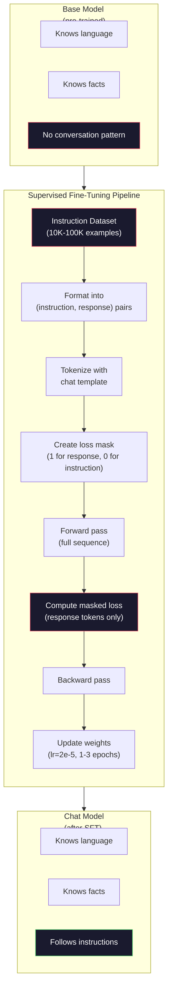

# 인스트럭션 튜닝 (SFT)

> 베이스 모델은 다음 토큰을 예측한다. 그게 전부다. 지시를 따르지도, 질문에 답하지도, 유해한 요청을 거부하지도 않는다. SFT는 토큰 예측기와 유용한 어시스턴트 사이의 다리다. 당신이 대화해 본 모든 모델 -- Claude, GPT, Llama Chat -- 은 이 단계를 거쳤다.

**Type:** Build
**Languages:** Python (with numpy)
**Prerequisites:** Phase 10, Lesson 04 (Pre-Training a Mini GPT)
**Time:** ~90분

## 학습 목표 (Learning Objectives)

- 베이스 언어 모델을 지시를 따르는 어시스턴트로 변환하는 지도 파인튜닝(supervised fine-tuning, SFT) 구현하기
- 시스템, 사용자, 어시스턴트 역할을 가진 채팅 템플릿(chat template)을 사용해 학습 데이터를 포맷하고, 어시스턴트가 아닌 토큰에 대한 손실(loss)을 마스킹하기
- SFT가 왜 필요한지 설명하기: 베이스 모델은 질문에 답하는 대신 텍스트를 이어간다
- 보류된 인스트럭션 집합에서 베이스 모델과 파인튜닝된 모델의 응답을 비교해 SFT 품질 평가하기

## 문제 (The Problem)

당신은 Lesson 04에서 모델을 학습시켰다. 그것은 시퀀스가 주어지면 다음 토큰을 예측할 수 있다. "The transformer architecture"를 입력하면 "has revolutionized natural language processing."으로 이어갈 수 있다. 다음 토큰 예측기치고는 인상적이다.

이제 이걸 시도해 보라: "What is the capital of France?"를 입력하라. 베이스 모델은 "Paris."라고 답하지 않는다. 패턴을 이어간다. 질문 목록을 담은 문서에서 학습했기 때문에 "What is the capital of Germany? What is the capital of Spain?"을 만들 수 있다. 또는 그것이 그럴듯한 다음 토큰 이어감이기 때문에 "is a question that many people ask"를 만들 수도 있다. 모델은 *답하기*라는 개념이 없다. *이어가기*만 안다.

이것이 (베이스 모델, 2020년 6월 출시인) GPT-3와 (인스트럭션 튜닝된, 2022년 11월 출시인) ChatGPT 사이의 간극이다. 같은 아키텍처. 같은 사전 학습(pre-training). 차이는 모델에게 대화 패턴을 따르도록 가르친 2만에서 10만 개의 정성껏 만든 (지시, 응답) 쌍이다.

Stanford Alpaca는 수백만 개의 예시가 필요 없음을 증명했다. 2023년 3월, 그들은 GPT-3.5가 생성한 단 52,000개의 인스트럭션-응답 쌍으로 Llama 7B를 파인튜닝(fine-tuning)했다. 총 비용: $600. 결과는 지시를 따르고, 질문에 답하고, 대화를 나눌 수 있는 챗봇이었다. ChatGPT만큼 좋지는 않았지만, $600와 몇 시간의 학습치고는 충격적으로 가까웠다.

Meta의 Llama 2 Chat은 초기 SFT 단계에 단 ~27,000개의 고품질 예시만 썼다. 핵심 통찰: 양보다 질이 더 중요하다. 숙련된 어노테이터(annotator)가 작성한 27,000개의 예시가 인터넷에서 긁어모은 100만 개의 잡음 섞인 예시를 이긴다.

## 개념 (The Concept)

### SFT가 실제로 하는 일

지도 파인튜닝은 사전 학습과 같은 학습 루프를 이어간다 -- 순방향 패스(forward pass), 손실 계산, 역방향 패스(backward pass), 가중치(weight) 갱신 -- 하지만 다른 종류의 데이터에 대해서다. 원시 텍스트 대신, 구조화된 대화로 학습한다:

```json
{
  "system": "You are a helpful assistant.",
  "user": "What is the capital of France?",
  "assistant": "The capital of France is Paris."
}
```

모델은 이미 파리가 프랑스의 수도임을 안다. 사전 학습 동안 Wikipedia, 교과서, 웹 페이지에서 이것을 학습했다. SFT는 모델에게 새로운 사실을 가르치지 않는다. 모델에게 새로운 *행동*을 가르친다: 질문을 보면, 답을 만들어라. 지시를 보면, 완성을 만들어라. 유해한 요청을 보면, 거부를 만들어라.

이렇게 생각하라. 사전 학습은 모델에게 지식을 준다. SFT는 모델에게 예의를 준다.

### 데이터 형식 (Data Formats)

세 가지 형식이 업계를 지배한다. 각각은 같은 정보 -- 누가 무엇을 말했는지 -- 를 서로 다른 구분자로 인코딩한다.

**Alpaca 형식** (Stanford, 2023년 3월):

```json
{
  "instruction": "Summarize the following article in 3 sentences.",
  "input": "The European Central Bank raised interest rates...",
  "output": "The ECB increased rates by 25 basis points..."
}
```

단순하고 널리 쓰인다. `input` 필드는 선택 사항이다 -- 많은 지시는 추가 맥락이 필요 없다. Stanford는 GPT-3.5로 $600에 생성한 이 형식의 52,000개 예시를 공개했다. 이것이 오픈소스 인스트럭션 튜닝 운동을 촉발했다.

**ShareGPT 형식** (커뮤니티, 2023):

```json
{
  "conversations": [
    {"from": "system", "value": "You are a helpful assistant."},
    {"from": "human", "value": "What causes tides?"},
    {"from": "gpt", "value": "Tides are caused by the gravitational pull of the Moon..."},
    {"from": "human", "value": "How often do they occur?"},
    {"from": "gpt", "value": "Most coastal areas experience two high tides and two low tides per day..."}
  ]
}
```

다중 턴(multi-turn) 대화를 지원한다. "from" 필드는 실제 모델과 상관없이 관례상 "human"과 "gpt"를 쓴다. Vicuna는 사용자가 공유한 ChatGPT 기록에서 긁어모은 70,000개의 ShareGPT 대화로 학습되었다.

**ChatML 형식** (OpenAI, 많은 오픈소스 모델이 사용):

```
<|im_start|>system
You are a helpful assistant.<|im_end|>
<|im_start|>user
What is the capital of France?<|im_end|>
<|im_start|>assistant
The capital of France is Paris.<|im_end|>
```

역할을 구분하기 위해 특수 토큰(`<|im_start|>`, `<|im_end|>`)을 쓴다. 이 토큰들은 파인튜닝 동안 토크나이저(tokenizer)의 어휘에 추가된다. Qwen, Yi, 그리고 많은 다른 모델이 ChatML을 쓴다.

세 형식 모두 같은 것을 달성한다: 모델에게 "이것이 지시, 이것이 응답, 이 패턴을 학습하라"고 말한다.

### 왜 작동하는가

모델은 사전 학습으로 이미 언어를 안다. 질문 뒤에 답이 오는, 지시 뒤에 완성이 오는, 사람들 사이의 대화의 수십억 개 예시를 봤다. 패턴은 이미 가중치에 인코딩되어 있다.

SFT는 이 잠재된 능력을 집중시킨다. 모델이 질문에 답해야 할지 문서를 이어가야 할지 맥락에서 알아내야 하는 대신, SFT는 대화 패턴을 명시적으로 학습한다. 몇천 개의 예시 후, 모델은 학습한다: 어시스턴트 역할 마커를 보면, 도움이 되는 응답을 만들어라.

이것이 27,000개의 예시면 충분한 이유다. 당신은 모델에게 영어를 가르치는 게 아니다. 세상에 대한 사실을 가르치는 게 아니다. 한 가지 단순한 행동을 가르친다: 지시에 응답하라. 지식은 이미 거기 있었다.

### 마스킹된 손실 (The Masked Loss)

이것은 SFT에서 가장 중요한 기술적 세부 사항이며, 대부분의 튜토리얼이 건너뛴다.

사전 학습 동안에는 모든 토큰에 대해 손실을 계산한다. 모델은 시퀀스의 모든 다음 토큰을 예측하도록 학습한다. SFT 동안에는 *응답* 토큰에 대해서만 손실을 계산한다. 지시 토큰은 맥락을 위해 있지만, 모델은 그것들을 잘못 "예측"한 것에 대해 벌받지 않는다.

왜? 모델이 지시를 *생성*하도록 학습하기를 원하지 않기 때문이다. 지시에 *응답*하도록 학습하기를 원한다. 지시 토큰에 손실을 계산하면, 마치 모델이 질문하는 쪽인 것처럼 "What is the capital of France?"를 예측하도록 학습시키는 셈이다. 그것은 그래디언트(gradient) 신호를 낭비하고 모델이 자기 역할에 대해 혼란스러워하게 만들 수 있다.

실제로, 손실 마스크(loss mask)를 만든다: 응답 토큰에는 1, 지시 토큰에는 0. 평균을 내기 전에 토큰별 손실에 이 마스크를 곱한다.

```
Tokens:    [SYS] You are helpful [USER] What is the capital? [ASST] Paris is the capital [EOS]
Loss mask:   0    0    0     0      0     0   0  0     0       1     1    1   1     1      1
```

`[ASST]` 뒤의 토큰만 손실에 기여한다. 모델은 순방향 패스 동안 전체 대화를 보지만(올바른 응답을 만들려면 지시가 필요하다) 응답을 얼마나 잘 예측했는지에만 기반해 가중치를 갱신한다.

### 학습 하이퍼파라미터 (Training Hyperparameters)

SFT는 사전 학습과 극적으로 다른 하이퍼파라미터(hyperparameter)를 쓴다. 밑바닥부터 학습하는 게 아니다. 이미 작동하는 모델을 조정하는 것이다.

| 파라미터 | 사전 학습 (Llama 2 7B) | SFT (Llama 2 Chat) |
|-----------|---------------------------|---------------------|
| 학습률(Learning rate) | 3e-4 (정점) | 2e-5 |
| 에폭(Epochs) | 1 (데이터 1회 통과) | 2 |
| 배치 크기(Batch size) | 400만 토큰 | 64 예시 |
| 워밍업 스텝(Warmup steps) | 2,000 | 0-100 |
| 가중치 감쇠(Weight decay) | 0.1 | 0.0-0.1 |
| 데이터 크기 | 2T 토큰 | 27,000 예시 |

학습률(learning rate)은 SFT에서 15배 낮다. 이것이 결정적이다. 파인튜닝 동안 높은 학습률은 사전 학습된 지식을 파괴한다. 모델은 학습한 것을 "잊고" 작은 파인튜닝 데이터셋(dataset)에 과적합(overfitting)한다. 이것이 치명적 망각(catastrophic forgetting)이다.

두 에폭은 모델이 각 학습 예시를 두 번 본다는 뜻이다. 작은 데이터셋에서 3 에폭을 넘기면 암기로 이어진다 -- 모델이 일반화하는 대신 학습 예시를 그대로 재생산하기 시작한다.

### 치명적 망각 (Catastrophic Forgetting)

파인튜닝은 일반 능력을 파괴할 수 있다. 인스트럭션 따르기 데이터로 너무 오래 학습하면 모델은 코드를 쓰고, 수학을 하고, 창의적인 텍스트를 만드는 능력을 잃는다. 학습 데이터의 특정 형식에는 아주 능숙해지지만 그 외 모든 것에는 형편없어진다.

세 가지 완화책:

1. **낮은 학습률.** 1e-5에서 5e-5. 더 작은 갱신은 사전 학습된 특성(feature)의 파괴가 적다는 뜻이다.

2. **짧은 학습.** 1~3 에폭. 모델이 과적합하기 전에 멈춘다.

3. **사전 학습 데이터 섞기.** Llama 2 Chat은 SFT 데이터셋에 소량(2~5%)의 원시 사전 학습 데이터를 섞었다. 이것은 새로운 인스트럭션 따르기 행동을 학습하는 동안 모델에게 일반 능력을 "상기"시킨다.

### 실제 숫자

10,000개의 고품질 인스트럭션 쌍으로 70억 모델을 파인튜닝하면 단일 NVIDIA A100 80GB GPU에서 약 1시간이 걸린다. 계산은 이렇다:

- 10,000 예시 x 평균 512 토큰 = 512만 토큰
- 2 에폭 = 총 1,024만 토큰
- 70억 모델 파인튜닝에 대한 A100 처리량(throughput): ~3,000 토큰/초
- 10.24M / 3,000 = ~3,400초 = ~57분

우리의 미니 GPT(4 층(layer), 128 차원)의 경우, 학습은 거의 즉각적이다. 요점은 규모가 아니라 메커니즘을 이해하는 것이다.



## 직접 만들기 (Build It)

### 1단계: 인스트럭션 데이터셋

합성 인스트럭션 데이터셋을 만든다. 프로덕션(production)에서는 Scale AI나 Anthropic 같은 회사가 사람 어노테이터를 고용해 이것들을 작성한다. 우리는 형식을 보여 주기 위해 프로그램적으로 만든다.

```python
import numpy as np

INSTRUCTION_DATA = [
    {
        "instruction": "What is the capital of France?",
        "response": "The capital of France is Paris."
    },
    {
        "instruction": "Explain gravity in one sentence.",
        "response": "Gravity is the force that attracts objects with mass toward each other."
    },
    {
        "instruction": "Write a haiku about the ocean.",
        "response": "Waves crash on the shore, salt and foam beneath the sun, endless blue expanse."
    },
    {
        "instruction": "What is 15 multiplied by 7?",
        "response": "15 multiplied by 7 is 105."
    },
    {
        "instruction": "Name three programming languages.",
        "response": "Three programming languages are Python, Rust, and TypeScript."
    },
    {
        "instruction": "Summarize photosynthesis.",
        "response": "Photosynthesis converts sunlight, water, and carbon dioxide into glucose and oxygen."
    },
    {
        "instruction": "What year did World War II end?",
        "response": "World War II ended in 1945."
    },
    {
        "instruction": "Define machine learning.",
        "response": "Machine learning is a field where algorithms learn patterns from data to make predictions."
    },
]
```

여덟 개의 예시는 아주 작다. Stanford Alpaca는 52,000개를 썼다. 하지만 메커니즘은 8개든 52,000개든 동일하다: 토큰화하고, 마스킹하고, 응답에만 손실을 계산한다.

### 2단계: 채팅 템플릿으로 토큰화

인스트럭션-응답 쌍을 특수 역할 마커를 가진 토큰 시퀀스로 변환한다. 마커는 모델에게 지시가 어디서 끝나고 응답이 어디서 시작되는지 알려준다.

```python
SPECIAL_TOKENS = {
    "INST_START": 253,
    "INST_END": 254,
    "RESP_START": 255,
}


def tokenize_instruction_pair(instruction, response, vocab_size=256):
    inst_tokens = list(instruction.encode("utf-8"))
    resp_tokens = list(response.encode("utf-8"))

    inst_tokens = [min(t, vocab_size - 4) for t in inst_tokens]
    resp_tokens = [min(t, vocab_size - 4) for t in resp_tokens]

    tokens = (
        [SPECIAL_TOKENS["INST_START"]]
        + inst_tokens
        + [SPECIAL_TOKENS["INST_END"]]
        + [SPECIAL_TOKENS["RESP_START"]]
        + resp_tokens
    )

    return tokens


def create_loss_mask(tokens):
    mask = np.zeros(len(tokens), dtype=np.float32)
    in_response = False

    for i, token in enumerate(tokens):
        if token == SPECIAL_TOKENS["RESP_START"]:
            in_response = True
            continue
        if in_response:
            mask[i] = 1.0

    return mask
```

손실 마스크는 지시 토큰에는 전부 0, 응답 토큰에는 전부 1이다. `RESP_START` 토큰 자체는 응답 내용의 일부가 아니라 구분자이기 때문에 마스크 0을 받는다.

### 3단계: 마스킹된 교차 엔트로피 손실

표준 교차 엔트로피지만, 손실 마스크를 곱한다. 응답 토큰만 그래디언트에 기여한다.

```python
def masked_cross_entropy_loss(logits, targets, loss_mask):
    batch, seq_len, vocab_size = logits.shape
    logits_flat = logits.reshape(-1, vocab_size)
    targets_flat = targets.reshape(-1)
    mask_flat = loss_mask.reshape(-1)

    max_logits = logits_flat.max(axis=-1, keepdims=True)
    log_softmax = logits_flat - max_logits - np.log(
        np.exp(logits_flat - max_logits).sum(axis=-1, keepdims=True)
    )

    per_token_loss = -log_softmax[np.arange(len(targets_flat)), targets_flat]

    masked_loss = per_token_loss * mask_flat
    num_response_tokens = mask_flat.sum()
    if num_response_tokens == 0:
        return 0.0
    loss = masked_loss.sum() / num_response_tokens

    return loss
```

분모는 `seq_len`이 아니라 `num_response_tokens`다. 전체 시퀀스 길이로 나누면, 더 긴 지시가 그래디언트 신호를 희석시킨다. 응답 토큰 수로 나누면 지시 길이와 상관없이 응답 토큰당 동일한 가중치를 보장한다.

### 4단계: SFT 학습 루프

Lesson 04의 MiniGPT를 재사용한다. 학습 루프는 사전 학습과 거의 동일해 보이지만, 인스트럭션 포맷팅과 마스킹된 손실을 쓴다.

```python
import sys
import os
sys.path.insert(0, os.path.join(os.path.dirname(__file__), "..", "..", "04-pre-training-mini-gpt", "code"))
from main import MiniGPT, LayerNorm, FeedForward, MultiHeadAttention, TransformerBlock, Embedding


def sft_train(model, dataset, num_epochs=2, lr=2e-5, seq_len=64):
    formatted_data = []
    for example in dataset:
        tokens = tokenize_instruction_pair(example["instruction"], example["response"])
        mask = create_loss_mask(tokens)
        formatted_data.append((tokens, mask))

    print(f"SFT Training: {len(formatted_data)} examples, {num_epochs} epochs, lr={lr}")
    print(f"Total tokens: {sum(len(t) for t, _ in formatted_data):,}")
    print()

    losses = []

    for epoch in range(num_epochs):
        epoch_loss = 0.0
        num_batches = 0

        indices = np.random.permutation(len(formatted_data))

        for idx in indices:
            tokens, mask = formatted_data[idx]

            if len(tokens) < 3:
                continue
            if len(tokens) > seq_len:
                tokens = tokens[:seq_len]
                mask = mask[:seq_len]

            input_ids = np.array(tokens[:-1]).reshape(1, -1)
            target_ids = np.array(tokens[1:]).reshape(1, -1)
            loss_mask = np.array(mask[1:]).reshape(1, -1)

            logits = model.forward(input_ids)
            loss = masked_cross_entropy_loss(logits, target_ids, loss_mask)

            batch_size, s_len, v_size = logits.shape
            probs = np.exp(logits - logits.max(axis=-1, keepdims=True))
            probs = probs / probs.sum(axis=-1, keepdims=True)
            dlogits = probs.copy()
            dlogits[np.arange(batch_size)[:, None], np.arange(s_len), target_ids] -= 1.0

            mask_expanded = loss_mask[:, :, np.newaxis]
            num_resp = loss_mask.sum()
            if num_resp > 0:
                dlogits = dlogits * mask_expanded / num_resp

            for block in model.blocks:
                block.ffn.W1 -= lr * np.random.randn(*block.ffn.W1.shape) * 0.01
                block.ffn.W2 -= lr * np.random.randn(*block.ffn.W2.shape) * 0.01
                block.ffn.b1 -= lr * np.random.randn(*block.ffn.b1.shape) * 0.01
                block.ffn.b2 -= lr * np.random.randn(*block.ffn.b2.shape) * 0.01

            epoch_loss += loss
            num_batches += 1
            losses.append(loss)

        avg_loss = epoch_loss / max(num_batches, 1)
        print(f"Epoch {epoch + 1}/{num_epochs} | Avg Loss: {avg_loss:.4f}")

    return model, losses
```

학습률은 Llama 2 Chat과 일치하는 2e-5다. 이것을 사전 학습에서 쓰인 3e-4와 비교하라 -- 15배 작다. 그래디언트는 마스킹된다: 지시 토큰은 0 그래디언트를 만든다. 응답 토큰만 가중치를 밀어낸다.

### 5단계: 베이스 모델과 SFT 모델 비교

SFT의 전체 요점은 행동 변화다. 모델이 인스트럭션 형식의 입력에 대해 어떻게 응답하는지를 원시 텍스트 이어감과 비교해 측정하자.

```python
def generate_response(model, prompt_tokens, max_new_tokens=50, temperature=0.8):
    tokens = list(prompt_tokens)
    seq_len = model.embedding.pos_embed.shape[0]

    for _ in range(max_new_tokens):
        context = np.array(tokens[-seq_len:]).reshape(1, -1)
        logits = model.forward(context)
        next_logits = logits[0, -1, :]

        next_logits = next_logits / max(temperature, 1e-8)
        probs = np.exp(next_logits - next_logits.max())
        probs = probs / probs.sum()
        probs = np.clip(probs, 1e-10, 1.0)
        probs = probs / probs.sum()

        next_token = np.random.choice(len(probs), p=probs)
        tokens.append(int(next_token))

    return tokens


def evaluate_instruction_following(model, instructions):
    print("Evaluating instruction following:")
    print("-" * 50)

    for instruction in instructions:
        tokens = (
            [SPECIAL_TOKENS["INST_START"]]
            + [min(t, 252) for t in list(instruction.encode("utf-8"))]
            + [SPECIAL_TOKENS["INST_END"]]
            + [SPECIAL_TOKENS["RESP_START"]]
        )

        output = generate_response(model, tokens, max_new_tokens=30, temperature=0.6)
        response_start = len(tokens)
        response_tokens = output[response_start:]
        response_bytes = bytes([t for t in response_tokens if t < 128])
        response_text = response_bytes.decode("utf-8", errors="replace")

        print(f"  Q: {instruction}")
        print(f"  A: {response_text[:80]}")
        print()
```

8개 예시를 가진 아주 작은 모델에서는 응답이 의미 있지 않을 것이다. 그것은 예상된 일이다. 중요한 것은 *구조*다: 모델은 더 많은 지시를 계속 생성하는 대신 응답 마커 뒤에 출력을 만드는 것을 학습한다.

### 6단계: 치명적 망각 측정

SFT 전후로 모델의 다음 토큰 예측 능력을 비교한다. SFT가 일반 능력을 손상시키면, 원시 텍스트에 대한 손실이 증가할 것이다.

```python
def measure_forgetting(model, test_text, seq_len=64):
    tokens = np.array(list(test_text.encode("utf-8")[:512]))

    total_loss = 0.0
    num_windows = 0

    for start in range(0, len(tokens) - seq_len - 1, seq_len):
        input_ids = tokens[start:start + seq_len].reshape(1, -1)
        target_ids = tokens[start + 1:start + seq_len + 1].reshape(1, -1)

        logits = model.forward(input_ids)

        batch, s_len, vocab_size = logits.shape
        logits_flat = logits.reshape(-1, vocab_size)
        targets_flat = target_ids.reshape(-1)

        max_logits = logits_flat.max(axis=-1, keepdims=True)
        log_softmax = logits_flat - max_logits - np.log(
            np.exp(logits_flat - max_logits).sum(axis=-1, keepdims=True)
        )

        loss = -log_softmax[np.arange(len(targets_flat)), targets_flat].mean()
        total_loss += loss
        num_windows += 1

    return total_loss / max(num_windows, 1)
```

실제 파인튜닝에서는 학습 내내 이 지표를 추적할 것이다. 원시 텍스트 손실이 10~15% 넘게 증가하면, 당신의 SFT는 너무 공격적이다. 학습률을 낮추거나 에폭 수를 줄여라.

## 라이브러리로 써보기 (Use It)

### 전체 SFT 파이프라인 데모

```python
if __name__ == "__main__":
    np.random.seed(42)

    test_text = """The transformer architecture processes sequences through self-attention.
Each layer applies multi-head attention followed by a feedforward network.
Residual connections and layer normalization stabilize deep networks.
The model learns to predict the next token given all previous tokens."""

    print("=" * 70)
    print("INSTRUCTION TUNING (SFT) DEMO")
    print("=" * 70)
    print()

    model = MiniGPT(
        vocab_size=256, embed_dim=128, num_heads=4,
        num_layers=4, max_seq_len=128, ff_dim=512
    )
    print(f"Model: {model.count_parameters():,} parameters")
    print(f"Config: 4 layers, 4 heads, 128 dims (mini GPT from Lesson 04)")
    print()

    print("PRE-SFT: Measuring base model loss on raw text")
    base_loss = measure_forgetting(model, test_text)
    print(f"  Base model loss: {base_loss:.4f}")
    print()

    print("=" * 70)
    print("SFT TRAINING")
    print("=" * 70)

    model, losses = sft_train(
        model, INSTRUCTION_DATA, num_epochs=3, lr=2e-5, seq_len=128
    )

    print()
    print("POST-SFT: Measuring fine-tuned model loss on raw text")
    sft_loss = measure_forgetting(model, test_text)
    print(f"  SFT model loss: {sft_loss:.4f}")
    print(f"  Change: {((sft_loss - base_loss) / base_loss * 100):+.1f}%")
    if abs(sft_loss - base_loss) / base_loss < 0.15:
        print("  Minimal forgetting (< 15% change)")
    else:
        print("  Significant forgetting detected")
    print()

    print("=" * 70)
    print("INSTRUCTION FOLLOWING EVALUATION")
    print("=" * 70)
    print()

    test_instructions = [
        "What is the capital of France?",
        "Name a programming language.",
        "Define gravity.",
    ]
    evaluate_instruction_following(model, test_instructions)

    print("=" * 70)
    print("DATA FORMAT EXAMPLES")
    print("=" * 70)
    print()

    for i, example in enumerate(INSTRUCTION_DATA[:3]):
        tokens = tokenize_instruction_pair(example["instruction"], example["response"])
        mask = create_loss_mask(tokens)
        resp_count = int(mask.sum())
        total_count = len(tokens)
        print(f"  Example {i + 1}: {total_count} tokens, {resp_count} response tokens ({resp_count/total_count:.0%} of sequence)")
        print(f"    Instruction: {example['instruction']}")
        print(f"    Response: {example['response']}")
        print()

    print("=" * 70)
    print("TRAINING LOSS CURVE")
    print("=" * 70)
    print()

    if losses:
        window = max(1, len(losses) // 5)
        for i in range(0, len(losses), window):
            chunk = losses[i:i + window]
            avg = sum(chunk) / len(chunk)
            print(f"  Steps {i:3d}-{i + len(chunk) - 1:3d}: avg loss = {avg:.4f}")
```

## 산출물 (Ship It)

이 레슨은 `outputs/prompt-sft-data-curator.md`를 만든다 -- SFT를 위한 인스트럭션 데이터셋을 설계하고 큐레이션하도록 돕는 프롬프트(prompt)다. 목표 능력(코드 생성, 수학, 대화)이 주어지면, 형식 명세, 품질 기준, 다양성 요구를 갖춘 데이터 수집 계획을 만든다.

## 연습 문제 (Exercises)

1. 시스템 프롬프트 지원을 추가하라. `tokenize_instruction_pair`가 시스템 메시지를 받아 지시 앞에 붙이도록 수정하라. 서로 다른 시스템 프롬프트("You are a poet", "You are a math tutor")를 가진 5개의 예시를 만들고 학습 동안 모델이 서로 다른 시스템 프롬프트를 보는지 검증하라.

2. 데이터 섞기를 구현하라. SFT 데이터셋과 원시 텍스트 말뭉치(corpus)를 받아, 예시의 5%가 원시 텍스트(마스킹 없음)이고 95%가 인스트럭션 쌍(마스킹됨)인 학습 배치를 만드는 함수를 만들어라. 3 에폭을 실행하고 순수 SFT 학습과 망각 지표를 비교하라.

3. 데이터 품질 점수기를 만들어라. 각 인스트럭션-응답 쌍에 대해 다음을 계산하라: (a) 토큰 단위 응답 길이, (b) 지시-대-응답 비율, (c) 어휘 다양성(고유 토큰 / 전체 토큰). 응답 길이 < 10 토큰이거나 다양성 < 0.3인 예시를 걸러내라. 필터링이 최종 손실에 어떻게 영향을 주는지 보여라.

4. 다중 턴 대화 학습을 구현하라. 토큰화를 3턴 대화(user-assistant-user-assistant-user-assistant)를 처리하도록 확장하라. 손실 마스크는 세 어시스턴트 턴을 모두 덮어야 한다. 한 예시에 대해 토큰-마스크 정렬을 출력해 마스크가 올바른지 검증하라.

5. 학습률을 비교하라. 같은 모델을 lr=1e-4, lr=2e-5, lr=1e-6으로 세 번 학습시켜라. 손실 곡선을 플롯하라. 1e-4 실행은 빠른 초기 하강을 보이지만 더 높은 최종 손실(과적합)을 보여야 한다. 1e-6 실행은 거의 움직이지 않아야 한다. 2e-5 실행이 적절한 균형점이어야 한다.

## 핵심 용어 (Key Terms)

| 용어 | 사람들이 말하는 것 | 실제 의미 |
|------|----------------|----------------------|
| SFT | "대화로 파인튜닝" | 지도 파인튜닝(Supervised Fine-Tuning): 응답 토큰에만 계산된 손실로 (지시, 응답) 쌍에 대해 학습을 이어가기 |
| 인스트럭션 튜닝(Instruction tuning) | "모델에게 지시를 따르도록 가르치기" | 베이스 모델이 새로운 지식이 아니라 대화 패턴을 학습하도록 명시적인 지시-응답 쌍으로 학습하기 |
| 손실 마스킹(Loss masking) | "프롬프트 무시하기" | 그래디언트가 응답 토큰 예측에서만 흐르도록 지시 토큰의 손실을 0으로 설정하기 |
| ChatML | "Chat Markup Language" | 대화 데이터에서 화자 역할을 표시하기 위해 `<\|im_start\|>`와 `<\|im_end\|>` 구분자를 쓰는 토큰 형식 |
| Alpaca 형식(Alpaca format) | "Stanford의 형식" | instruction/input/output 필드를 가진 JSON 형식으로, $600가 든 52K개의 GPT-3.5 생성 예시에 쓰였다 |
| 치명적 망각(Catastrophic forgetting) | "모델이 멍청해진다" | 그래디언트 갱신이 일반 지식을 작업 특화 패턴으로 덮어쓰기 때문에 파인튜닝이 사전 학습된 능력을 파괴한다 |
| 가중치 묶기(Weight tying) | "임베딩 공유" | 입력 토큰 임베딩과 출력 예측 헤드에 같은 행렬을 써서 파라미터를 아끼고 일관성을 개선하기 |
| 채팅 템플릿(Chat template) | "프롬프트를 포맷하는 방식" | 모델을 위해 대화를 구조화하는 특정 토큰 시퀀스(역할 마커, 구분자) |

## 더 읽을거리 (Further Reading)

- [Ouyang et al., 2022 -- "Training language models to follow instructions with human feedback" (InstructGPT)](https://arxiv.org/abs/2203.02155) -- OpenAI에서 인스트럭션 튜닝 + RLHF를 도입한 논문
- [Taori et al., 2023 -- "Stanford Alpaca: An Instruction-following LLaMA Model"](https://github.com/tatsu-lab/stanford_alpaca) -- $600에 52K개 인스트럭션 예시, SFT가 작은 데이터셋에서 작동함을 증명
- [Touvron et al., 2023 -- "Llama 2: Open Foundation and Fine-Tuned Chat Models"](https://arxiv.org/abs/2307.09288) -- 27K개 고품질 예시를 가진 Meta의 SFT + RLHF 파이프라인
- [Chiang et al., 2023 -- "Vicuna: An Open-Source Chatbot Impressing GPT-4"](https://lmsys.org/blog/2023-03-30-vicuna/) -- 70K개 ShareGPT 대화로 학습
- [Zhou et al., 2023 -- "LIMA: Less Is More for Alignment"](https://arxiv.org/abs/2305.11206) -- 정성껏 큐레이션된 1,000개 예시가 훨씬 큰 데이터셋의 SFT와 맞먹을 수 있음을 증명
