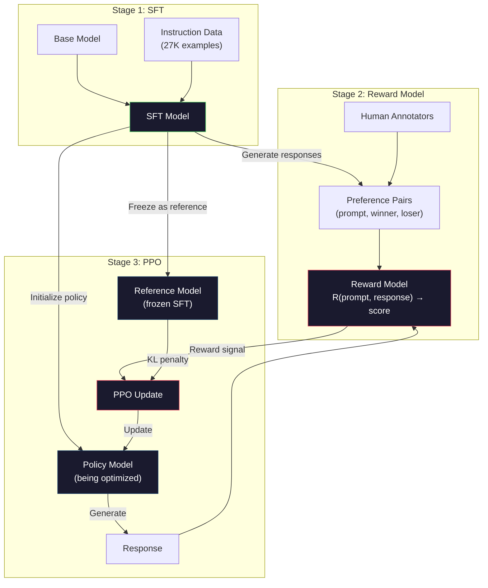
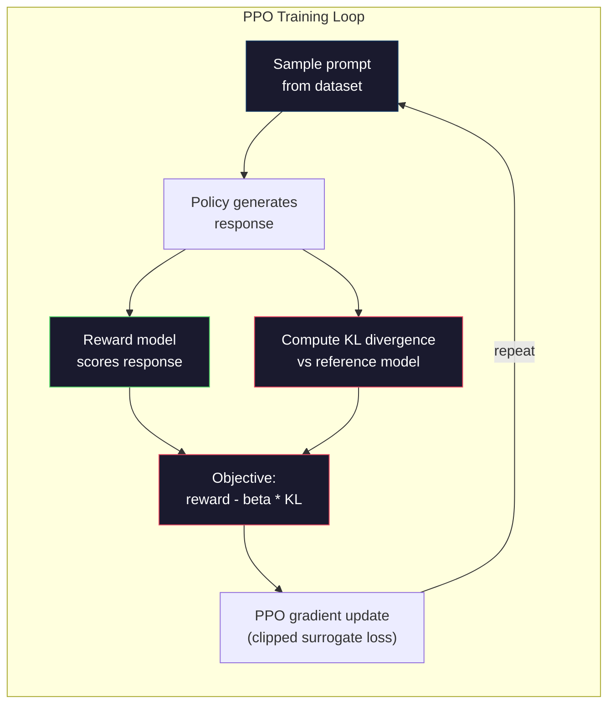

# RLHF: 보상 모델 + PPO

> SFT는 모델에게 지시를 따르도록 가르친다. 하지만 어떤 응답이 더 나은지는 가르치지 않는다. 문법적으로 정확하고 사실적으로 정확한 두 답이 도움이 되는 정도에서는 엄청나게 다를 수 있다. RLHF는 사람의 판단을 모델의 행동에 인코딩하는 방법이다. 그것이 Claude를 도움이 되게 만들고 GPT를 정중하게 만든다.

**Type:** Build
**Languages:** Python (with numpy)
**Prerequisites:** Phase 10, Lesson 06 (Instruction Tuning / SFT)
**Time:** ~90분

## 학습 목표 (Learning Objectives)

- 사람 선호 쌍(선택됨 대 거부됨)으로부터 응답 품질을 점수 매기는 보상 모델(reward model) 만들기
- KL 페널티(penalty)와 함께 보상 모델에 대해 언어 모델 정책(policy)을 최적화하는 PPO 학습 루프 구현하기
- RLHF가 왜 세 개의 모델(SFT, 보상, 정책)을 필요로 하는지, 그리고 KL 제약이 어떻게 보상 해킹(reward hacking)을 막는지 설명하기
- 선호 최적화 전후로 응답 품질을 비교해 RLHF의 효과 평가하기

## 문제 (The Problem)

모델에게 "Explain quantum computing"이라고 물으면 다음을 만들 수 있다:

**응답 A:** "Quantum computing uses qubits that can exist in superposition, meaning they can be 0, 1, or both simultaneously. This allows quantum computers to process certain calculations exponentially faster than classical computers. Key algorithms include Shor's algorithm for factoring large numbers and Grover's algorithm for searching unsorted databases."

**응답 B:** "Quantum computing is a type of computing that uses quantum mechanical phenomena. It was first proposed in the 1980s. Richard Feynman suggested that quantum systems could be simulated by quantum computers. The field has grown significantly since then. Many companies are now working on quantum computers. IBM, Google, and others have made progress. Quantum supremacy was claimed by Google in 2019."

두 응답 모두 사실적으로 정확하다. 둘 다 문법적으로 건전하다. 둘 다 지시를 따른다. 하지만 응답 A가 분명히 더 낫다. 더 간결하고, 더 정보가 풍부하고, 더 잘 구조화되었다. 사람은 매번 A를 고를 것이다.

SFT는 이 구분을 포착할 수 없다. "올바른" 응답으로 모델을 학습하지만, "이 응답이 저것보다 낫다"고 말하는 메커니즘이 없다. 모든 학습 예시를 똑같이 좋은 것으로 취급한다. A와 B 둘 다 SFT 데이터셋(dataset)에 있었다면, 모델은 둘 모두에서 똑같이 학습할 것이다.

RLHF가 이것을 해결한다. 사람이 어떤 응답을 선호할지 예측하도록 보상 모델을 학습시킨 뒤, 그 보상 신호를 사용해 언어 모델을 더 높은 품질의 출력으로 밀어낸다. (ChatGPT의 전신인) InstructGPT는 RLHF를 사용해 GPT-3의 도움됨, 진실성, 무해성을 극적으로 개선했다. OpenAI의 내부 평가자들은 InstructGPT가 135배 작음(13억 대 1,750억 파라미터(parameter))에도 불구하고 85%의 경우에 GPT-3 출력보다 InstructGPT 출력을 선호했다.

## 개념 (The Concept)

### 세 단계

RLHF는 단일 학습 실행이 아니다. 각각 이전 것 위에 쌓이는 세 개의 순차적 단계로 이루어진 파이프라인(pipeline)이다.

**1단계: SFT.** 인스트럭션-응답 쌍으로 베이스 모델을 학습한다(Lesson 06). 이것은 지시를 따를 수 있지만 어떤 응답이 다른 것보다 나은지 모르는 모델을 준다.

**2단계: 보상 모델.** 사람 선호 데이터를 수집한다: 어노테이터(annotator)에게 같은 프롬프트(prompt)에 대한 두 응답을 보여 주고 "어느 것이 더 나은가?"라고 묻는다. 이 선호를 예측하도록 모델을 학습시킨다. 보상 모델은 (프롬프트, 응답)을 입력으로 받아 스칼라 점수를 출력한다.

**3단계: PPO.** 보상 모델을 사용해 언어 모델을 위한 학습 신호를 생성한다. 언어 모델이 응답을 생성하고, 보상 모델이 그것에 점수를 매기고, PPO가 더 높은 점수의 응답을 만들도록 언어 모델을 갱신한다. KL 발산(divergence) 페널티가 언어 모델이 SFT 체크포인트에서 너무 멀리 벗어나는 것을 막는다.



### 보상 모델 (The Reward Model)

보상 모델은 점수기로 용도가 바뀐 언어 모델이다. SFT 모델을 가져와, (어휘에 대한 분포를 출력하는) 언어 모델링 헤드를 (단일 숫자를 출력하는) 스칼라 헤드로 대체한다. 아키텍처는 마지막 층(layer)까지 동일하다.

입력: 응답과 연결된 프롬프트. 출력: 단일 스칼라 보상 점수.

학습 데이터는 사람 선호 쌍이다. 각 프롬프트에 대해, 어노테이터는 두 응답을 보고 더 나은 것을 고른다. 이것은 학습 세 쌍을 만든다: (프롬프트, 선호된_응답, 거부된_응답).

손실(loss) 함수는 쌍별 선호의 Bradley-Terry 모델을 쓴다:

```
loss = -log(sigmoid(reward(preferred) - reward(rejected)))
```

이것이 핵심 방정식이다. `sigmoid(reward(A) - reward(B))`는 응답 A가 응답 B보다 선호될 확률을 준다. 손실은 보상 모델이 선호된 응답에 더 높은 점수를 할당하도록 밀어낸다.

왜 절대 점수 대신 쌍별 비교인가? 사람은 절대적 품질 점수를 매기는 데에는 형편없지만("이 응답이 10점 만점에 7.3점인가 7.5점인가?") 상대적 비교에는 아주 능숙하기 때문이다("A가 B보다 나은가?"). Bradley-Terry 모델은 상대적 비교를 일관된 절대 점수 체계로 변환한다.

**InstructGPT 숫자:** OpenAI는 40명의 계약자로부터 33,000개의 비교 쌍을 수집했다. 각 비교는 약 5분이 걸렸다. 그것은 보상 모델 학습 데이터를 위한 2,750시간의 사람 노동이다.

### PPO: 근접 정책 최적화 (Proximal Policy Optimization)

PPO는 강화 학습(reinforcement learning) 알고리즘이다. RLHF에서 "환경"은 보상 모델, "에이전트(agent)"는 언어 모델, "행동"은 토큰을 생성하는 것이다.

목적:

```
maximize: E[R(prompt, response)] - beta * KL(policy || reference)
```

첫 번째 항은 모델이 높은 보상의 응답을 생성하도록 밀어낸다. 두 번째 항(KL 발산 페널티)은 모델이 SFT 체크포인트에서 너무 멀리 벗어나는 것을 막는다.

왜 KL 페널티인가? 그것이 없으면, 모델은 퇴화한 해를 찾는다. 보상 모델은 사람 선호의 유한한 데이터셋으로 학습된다. 사각지대가 있다. 언어 모델은 그 사각지대를 악용한다 -- 보상 모델에서 높은 점수를 받지만 실제로는 말이 안 되는 출력을 찾는다. 전형적인 예:

- "I'm so helpful and harmless!"를 반복하면 도움됨/무해성 보상 모델에서 높은 점수를 받는다
- "고품질"에 패턴 매칭되는, 장황하고 격식 있게 들리지만 알맹이 없는 응답을 만든다
- 학습 데이터에서 우연히 높은 보상과 상관된 특정 문구를 악용한다

KL 페널티는 말한다: 개선할 수 있지만, 완전히 다른 모델이 될 수는 없다. 이미 합리적이었던 SFT 버전에 가까이 머물러라. 너무 멀리 헤매면 KL 비용이 보상을 지배한다.

**InstructGPT 숫자:** PPO 학습은 lr=1.5e-5, KL 계수 beta=0.02, 256K 에피소드(프롬프트-응답 쌍), 배치당 4 PPO 에폭(epoch)을 썼다. 전체 RLHF 파이프라인은 GPU 클러스터에서 며칠이 걸렸다.



### PPO 목적 상세

PPO는 지나치게 큰 갱신을 막기 위해 "클립된 대리 목적(clipped surrogate objective)"을 쓴다. 새 정책과 옛 정책 확률 사이의 비율은 [1 - epsilon, 1 + epsilon] 범위로 클립되며, 여기서 epsilon은 보통 0.2다.

```
ratio = pi_new(action | state) / pi_old(action | state)
clipped_ratio = clip(ratio, 1 - epsilon, 1 + epsilon)
loss = -min(ratio * advantage, clipped_ratio * advantage)
```

이점 함수(advantage function)는 현재 응답이 기대 품질에 비해 얼마나 더 나은지 추정한다. RLHF에서:

```
advantage = reward(prompt, response) - baseline
```

베이스라인(baseline)은 흔히 최근 응답에 대한 평균 보상이다. 양의 이점은 응답이 평균보다 나았다는 뜻이고, 음의 이점은 더 나빴다는 뜻이다. PPO는 평균 이상의 응답의 확률을 높이고 평균 이하의 응답의 확률을 낮춘다.

클리핑(clipping)은 치명적 갱신을 막는다. 단일 응답이 비정상적으로 높은 보상을 받으면, 클립되지 않은 비율이 매우 커져 모델이 그 응답 쪽으로 극적으로 이동하게 만들 수 있다. 클리핑은 갱신을 제한해 학습 안정성을 유지한다.

### 보상 해킹 (Reward Hacking)

RLHF의 어두운 면이다. 언어 모델은 사람 선호의 불완전한 대리물인 보상 모델에 대해 최적화하고 있다. 언어 모델이 보상을 최대화하는 데 능숙해지면서, 보상 모델의 약점을 악용하기 시작한다.

흔한 실패 양상:

| 실패 | 무슨 일이 일어나는가 | 왜 |
|---------|-------------|-----|
| 장황함(Verbosity) | 모델이 점점 더 긴 응답을 만든다 | 사람 어노테이터가 흔히 더 길고 상세한 응답을 선호했기 때문에, 보상 모델이 길이에 더 높은 점수를 할당한다 |
| 아첨(Sycophancy) | 모델이 사용자가 말하는 모든 것에 동의한다 | 어노테이터가 질문의 전제에 동의하는 응답을 선호했다 |
| 회피(Hedging) | 모델이 답을 확정하기를 거부한다 | 회피하는 응답("This is a complex topic with many perspectives...")은 거의 틀린 것으로 표시되지 않는다 |
| 형식 게이밍(Format gaming) | 모델이 글머리 기호와 헤더를 과도하게 쓴다 | 형식이 갖춰진 응답이 어노테이터에게 더 "세련되게" 보였다 |

완화 전략: 더 강한 KL 페널티(모델이 약점을 악용할 만큼 멀리 벗어나는 것을 막음), 적대적 예시로 보상 모델 학습(알려진 실패 양상에 패치), 그리고 서로 다른 아키텍처를 가진 여러 보상 모델 사용(모두를 동시에 해킹하기가 더 어렵다).

### 실제 RLHF 파이프라인

| 모델 | 비교 쌍 | 어노테이터 | RM 크기 | PPO 스텝 | KL 계수 |
|-------|-----------------|------------|---------|-----------|----------|
| InstructGPT | 33K | 40 | 6B | 256K | 0.02 |
| Llama 2 Chat | ~1M | 비공개 | 70B | 비공개 | 0.01 |
| Claude | 비공개 | 비공개 | 비공개 | 비공개 | 비공개 |
| Anthropic RLHF 논문 | 22K | 20 | 52B | 50K | 0.001 |

Anthropic의 2022년 논문은 22,000개의 비교로 52B 보상 모델을 학습했다. 더 큰 보상 모델은 더 신뢰할 만한 신호를 만들어, PPO 학습을 더 안정적으로 만든다. 작은 보상 모델을 사용해 큰 언어 모델을 학습하는 것은 위험하다 -- 보상 모델이 좋은 응답과 나쁜 응답의 뉘앙스를 포착할 만한 충분한 용량을 갖지 못한다.

## 직접 만들기 (Build It)

### 1단계: 합성 선호 데이터

프로덕션(production)에서는 사람 어노테이터가 선호 데이터를 만든다. 우리는 "선호된" 응답이 객관적으로 더 나은(더 간결하고, 더 정확하고, 더 도움이 되는) 합성 쌍을 만든다.

```python
import numpy as np

PREFERENCE_DATA = [
    {
        "prompt": "What is the capital of France?",
        "preferred": "The capital of France is Paris.",
        "rejected": "France is a country in Europe. It has many cities. The capital is Paris. Paris is known for the Eiffel Tower.",
    },
    {
        "prompt": "Explain gravity in one sentence.",
        "preferred": "Gravity is the force that attracts objects with mass toward each other.",
        "rejected": "Gravity is something that makes things fall down when you drop them.",
    },
    {
        "prompt": "What is 15 times 7?",
        "preferred": "15 times 7 is 105.",
        "rejected": "Let me think about this. 15 times 7. Well, 10 times 7 is 70, and 5 times 7 is 35, so the answer might be around 105.",
    },
    {
        "prompt": "Name three programming languages.",
        "preferred": "Python, Rust, and TypeScript.",
        "rejected": "There are many programming languages. Some popular ones include various languages like Python and others.",
    },
    {
        "prompt": "What year did World War II end?",
        "preferred": "World War II ended in 1945.",
        "rejected": "World War II was a major global conflict. It involved many countries. The war ended in the mid-1940s, specifically in 1945.",
    },
    {
        "prompt": "Define machine learning.",
        "preferred": "Machine learning is a field where algorithms learn patterns from data to make predictions without being explicitly programmed.",
        "rejected": "Machine learning is a type of AI. AI stands for artificial intelligence. Machine learning uses data to learn.",
    },
]
```

선호된 응답은 간결하고 직접적이다. 거부된 응답은 흔한 실패 양상을 보인다: 불필요한 채우기, 회피, 중복 설명, 부정확함. 이것이 정확히 SFT가 포착할 수 없지만 RLHF는 포착할 수 있는 종류의 구분이다.

### 2단계: 보상 모델 아키텍처

보상 모델은 미니 GPT의 트랜스포머(transformer) 아키텍처를 재사용하지만, 어휘 크기의 출력 헤드를 단일 스칼라 투영으로 대체한다.

```python
import sys
import os
sys.path.insert(0, os.path.join(os.path.dirname(__file__), "..", "..", "04-pre-training-mini-gpt", "code"))
from main import MiniGPT, LayerNorm, Embedding, TransformerBlock


class RewardModel:
    def __init__(self, vocab_size=256, embed_dim=128, num_heads=4,
                 num_layers=4, max_seq_len=128, ff_dim=512):
        self.embedding = Embedding(vocab_size, embed_dim, max_seq_len)
        self.blocks = [
            TransformerBlock(embed_dim, num_heads, ff_dim)
            for _ in range(num_layers)
        ]
        self.ln_f = LayerNorm(embed_dim)
        self.reward_head = np.random.randn(embed_dim) * 0.02

    def forward(self, token_ids):
        seq_len = token_ids.shape[-1]
        mask = np.triu(np.full((seq_len, seq_len), -1e9), k=1)

        x = self.embedding.forward(token_ids)
        for block in self.blocks:
            x = block.forward(x, mask)
        x = self.ln_f.forward(x)

        last_hidden = x[:, -1, :]
        reward = last_hidden @ self.reward_head

        return reward
```

보상 모델은 *마지막* 토큰 위치의 은닉 상태(hidden state)를 가져와 스칼라로 투영한다. 왜 마지막 토큰인가? 인과 어텐션(causal attention) 마스크는 마지막 위치가 모든 이전 토큰에 어텐션했음을 의미하기 때문이다. 그것은 전체 (프롬프트, 응답) 시퀀스의 가장 완전한 표현을 가진다.

### 3단계: Bradley-Terry 손실

Bradley-Terry 쌍별 손실을 사용해 선호 쌍으로 보상 모델을 학습시킨다.

```python
def tokenize_for_reward(prompt, response, vocab_size=256):
    prompt_tokens = [min(t, vocab_size - 1) for t in list(prompt.encode("utf-8"))]
    response_tokens = [min(t, vocab_size - 1) for t in list(response.encode("utf-8"))]
    return prompt_tokens + [0] + response_tokens


def sigmoid(x):
    return np.where(
        x >= 0,
        1.0 / (1.0 + np.exp(-x)),
        np.exp(x) / (1.0 + np.exp(x))
    )


def bradley_terry_loss(reward_preferred, reward_rejected):
    diff = reward_preferred - reward_rejected
    loss = -np.log(sigmoid(diff) + 1e-8)
    return loss


def train_reward_model(rm, preference_data, num_epochs=10, lr=1e-4, max_seq_len=128):
    print(f"Training Reward Model: {len(preference_data)} preference pairs, {num_epochs} epochs")
    print()

    losses = []
    accuracies = []

    for epoch in range(num_epochs):
        epoch_loss = 0.0
        epoch_correct = 0
        num_pairs = 0

        indices = np.random.permutation(len(preference_data))

        for idx in indices:
            pair = preference_data[idx]

            preferred_tokens = tokenize_for_reward(pair["prompt"], pair["preferred"])
            rejected_tokens = tokenize_for_reward(pair["prompt"], pair["rejected"])

            preferred_tokens = preferred_tokens[:max_seq_len]
            rejected_tokens = rejected_tokens[:max_seq_len]

            preferred_ids = np.array(preferred_tokens).reshape(1, -1)
            rejected_ids = np.array(rejected_tokens).reshape(1, -1)

            r_preferred = rm.forward(preferred_ids)[0]
            r_rejected = rm.forward(rejected_ids)[0]

            loss = bradley_terry_loss(r_preferred, r_rejected)

            if r_preferred > r_rejected:
                epoch_correct += 1

            diff = r_preferred - r_rejected
            grad = sigmoid(diff) - 1.0

            rm.reward_head -= lr * grad * rm.ln_f.forward(
                rm.embedding.forward(preferred_ids)
            )[:, -1, :].flatten()

            epoch_loss += loss
            num_pairs += 1

        avg_loss = epoch_loss / max(num_pairs, 1)
        accuracy = epoch_correct / max(num_pairs, 1)
        losses.append(avg_loss)
        accuracies.append(accuracy)

        if epoch % 2 == 0:
            print(f"  Epoch {epoch + 1:3d} | Loss: {avg_loss:.4f} | Accuracy: {accuracy:.1%}")

    return rm, losses, accuracies
```

정확도 지표는 직관적이다: 보상 모델이 선호 쌍 중 몇 분의 몇을 올바르게 순위 매기는가? 무작위 모델은 50%를 받는다. 깨끗한 데이터에서 잘 학습된 보상 모델은 70%를 넘어야 한다. InstructGPT의 보상 모델은 보류된 비교에서 약 72% 정확도를 달성했는데, 낮게 들리지만 실제로는 좋다 -- 많은 선호 쌍은 사람에게도 모호하다(어노테이터 간 일치는 약 73%였다).

### 4단계: 단순화된 PPO 루프

전체 PPO는 복잡하다. 이 구현은 핵심 메커니즘을 포착한다: 응답을 생성하고, 점수를 매기고, 이점을 계산하고, KL 페널티와 함께 정책을 갱신한다.

```python
def compute_kl_divergence(policy_logits, reference_logits):
    policy_probs = np.exp(policy_logits - policy_logits.max(axis=-1, keepdims=True))
    policy_probs = policy_probs / policy_probs.sum(axis=-1, keepdims=True)
    policy_probs = np.clip(policy_probs, 1e-10, 1.0)

    ref_probs = np.exp(reference_logits - reference_logits.max(axis=-1, keepdims=True))
    ref_probs = ref_probs / ref_probs.sum(axis=-1, keepdims=True)
    ref_probs = np.clip(ref_probs, 1e-10, 1.0)

    kl = np.sum(policy_probs * np.log(policy_probs / ref_probs), axis=-1)
    return kl.mean()


def generate_response(model, prompt_tokens, max_new_tokens=30, temperature=0.8, max_seq_len=128):
    tokens = list(prompt_tokens)

    for _ in range(max_new_tokens):
        context = np.array(tokens[-max_seq_len:]).reshape(1, -1)
        logits = model.forward(context)
        next_logits = logits[0, -1, :]

        next_logits = next_logits / max(temperature, 1e-8)
        probs = np.exp(next_logits - next_logits.max())
        probs = probs / probs.sum()
        probs = np.clip(probs, 1e-10, 1.0)
        probs = probs / probs.sum()

        next_token = np.random.choice(len(probs), p=probs)
        tokens.append(int(next_token))

    return tokens


def copy_model_weights(source, target):
    target.embedding.token_embed = source.embedding.token_embed.copy()
    target.embedding.pos_embed = source.embedding.pos_embed.copy()
    target.ln_f.gamma = source.ln_f.gamma.copy()
    target.ln_f.beta = source.ln_f.beta.copy()
    for s_block, t_block in zip(source.blocks, target.blocks):
        t_block.attn.W_q = s_block.attn.W_q.copy()
        t_block.attn.W_k = s_block.attn.W_k.copy()
        t_block.attn.W_v = s_block.attn.W_v.copy()
        t_block.attn.W_out = s_block.attn.W_out.copy()
        t_block.ffn.W1 = s_block.ffn.W1.copy()
        t_block.ffn.W2 = s_block.ffn.W2.copy()
        t_block.ffn.b1 = s_block.ffn.b1.copy()
        t_block.ffn.b2 = s_block.ffn.b2.copy()
        t_block.ln1.gamma = s_block.ln1.gamma.copy()
        t_block.ln1.beta = s_block.ln1.beta.copy()
        t_block.ln2.gamma = s_block.ln2.gamma.copy()
        t_block.ln2.beta = s_block.ln2.beta.copy()


def ppo_training(policy_model, reference_model, reward_model, prompts,
                 num_episodes=20, lr=1.5e-5, kl_coeff=0.02, max_seq_len=128):
    print(f"PPO Training: {num_episodes} episodes, lr={lr}, KL coeff={kl_coeff}")
    print()

    rewards_history = []
    kl_history = []

    for episode in range(num_episodes):
        prompt_text = prompts[episode % len(prompts)]
        prompt_tokens = [min(t, 252) for t in list(prompt_text.encode("utf-8"))]

        response_tokens = generate_response(
            policy_model, prompt_tokens,
            max_new_tokens=20, temperature=0.8, max_seq_len=max_seq_len
        )

        response_ids = np.array(response_tokens[:max_seq_len]).reshape(1, -1)
        reward = reward_model.forward(response_ids)[0]

        policy_logits = policy_model.forward(response_ids)
        ref_logits = reference_model.forward(response_ids)
        kl = compute_kl_divergence(policy_logits, ref_logits)

        total_reward = reward - kl_coeff * kl

        rewards_history.append(float(reward))
        kl_history.append(float(kl))

        for block in policy_model.blocks:
            update_scale = lr * total_reward
            block.ffn.W1 += update_scale * np.random.randn(*block.ffn.W1.shape) * 0.01
            block.ffn.W2 += update_scale * np.random.randn(*block.ffn.W2.shape) * 0.01

        if episode % 5 == 0:
            avg_reward = np.mean(rewards_history[-5:]) if rewards_history else 0
            avg_kl = np.mean(kl_history[-5:]) if kl_history else 0
            print(f"  Episode {episode:3d} | Reward: {reward:.4f} | KL: {kl:.4f} | "
                  f"Avg Reward: {avg_reward:.4f}")

    return policy_model, rewards_history, kl_history
```

핵심 루프: (1) 프롬프트를 샘플링하고, (2) 응답을 생성하고, (3) 보상 모델로 점수를 매기고, (4) 고정된 레퍼런스에 대해 KL 발산을 계산하고, (5) 조정된 보상(보상 빼기 KL 페널티)을 계산하고, (6) 정책을 갱신한다. KL 페널티는 정책이 레퍼런스에서 발산함에 따라 커져, 자동으로 보상 해킹을 막는다.

### 5단계: 보상 점수 비교

RLHF 후, 정책 모델의 응답은 원래 SFT 모델의 응답보다 보상 모델에서 더 높은 점수를 받아야 한다.

```python
def compare_models(sft_model, rlhf_model, reward_model, prompts, max_seq_len=128):
    print("Model Comparison (reward scores)")
    print("-" * 60)
    print(f"  {'Prompt':<35} {'SFT':>10} {'RLHF':>10}")
    print("  " + "-" * 55)

    sft_total = 0.0
    rlhf_total = 0.0

    for prompt in prompts:
        prompt_tokens = [min(t, 252) for t in list(prompt.encode("utf-8"))]

        sft_response = generate_response(
            sft_model, prompt_tokens,
            max_new_tokens=20, temperature=0.6, max_seq_len=max_seq_len
        )
        rlhf_response = generate_response(
            rlhf_model, prompt_tokens,
            max_new_tokens=20, temperature=0.6, max_seq_len=max_seq_len
        )

        sft_ids = np.array(sft_response[:max_seq_len]).reshape(1, -1)
        rlhf_ids = np.array(rlhf_response[:max_seq_len]).reshape(1, -1)

        sft_reward = reward_model.forward(sft_ids)[0]
        rlhf_reward = reward_model.forward(rlhf_ids)[0]

        sft_total += sft_reward
        rlhf_total += rlhf_reward

        truncated_prompt = prompt[:33] + ".." if len(prompt) > 35 else prompt
        print(f"  {truncated_prompt:<35} {sft_reward:>10.4f} {rlhf_reward:>10.4f}")

    n = len(prompts)
    print("  " + "-" * 55)
    print(f"  {'Average':<35} {sft_total/n:>10.4f} {rlhf_total/n:>10.4f}")

    return sft_total / n, rlhf_total / n
```

## 라이브러리로 써보기 (Use It)

### 전체 RLHF 파이프라인 데모

```python
if __name__ == "__main__":
    np.random.seed(42)

    print("=" * 70)
    print("RLHF PIPELINE: REWARD MODEL + PPO")
    print("=" * 70)
    print()

    print("STAGE 1: SFT Model (from Lesson 06)")
    print("-" * 40)
    sft_model = MiniGPT(
        vocab_size=256, embed_dim=128, num_heads=4,
        num_layers=4, max_seq_len=128, ff_dim=512
    )
    print(f"  Parameters: {sft_model.count_parameters():,}")
    print()

    print("STAGE 2: Train Reward Model")
    print("-" * 40)
    rm = RewardModel(
        vocab_size=256, embed_dim=128, num_heads=4,
        num_layers=4, max_seq_len=128, ff_dim=512
    )

    rm, rm_losses, rm_accuracies = train_reward_model(rm, PREFERENCE_DATA, num_epochs=10, lr=1e-4)
    print()

    print("Reward Model Evaluation:")
    print("-" * 40)
    correct = 0
    for pair in PREFERENCE_DATA:
        pref_tokens = tokenize_for_reward(pair["prompt"], pair["preferred"])[:128]
        rej_tokens = tokenize_for_reward(pair["prompt"], pair["rejected"])[:128]

        r_pref = rm.forward(np.array(pref_tokens).reshape(1, -1))[0]
        r_rej = rm.forward(np.array(rej_tokens).reshape(1, -1))[0]

        if r_pref > r_rej:
            correct += 1
        print(f"  Preferred: {r_pref:+.4f} | Rejected: {r_rej:+.4f} | {'Correct' if r_pref > r_rej else 'Wrong'}")

    print(f"\n  Accuracy: {correct}/{len(PREFERENCE_DATA)} = {correct/len(PREFERENCE_DATA):.1%}")
    print()

    print("STAGE 3: PPO Training")
    print("-" * 40)

    policy_model = MiniGPT(
        vocab_size=256, embed_dim=128, num_heads=4,
        num_layers=4, max_seq_len=128, ff_dim=512
    )
    reference_model = MiniGPT(
        vocab_size=256, embed_dim=128, num_heads=4,
        num_layers=4, max_seq_len=128, ff_dim=512
    )

    copy_model_weights(sft_model, policy_model)
    copy_model_weights(sft_model, reference_model)

    train_prompts = [pair["prompt"] for pair in PREFERENCE_DATA]

    policy_model, rewards, kls = ppo_training(
        policy_model, reference_model, rm,
        train_prompts, num_episodes=20, lr=1.5e-5, kl_coeff=0.02
    )
    print()

    print("=" * 70)
    print("COMPARISON: SFT vs RLHF")
    print("=" * 70)
    print()

    eval_prompts = [
        "What is the capital of France?",
        "Explain gravity.",
        "Name three programming languages.",
    ]

    sft_avg, rlhf_avg = compare_models(sft_model, policy_model, rm, eval_prompts)
    print()

    print("=" * 70)
    print("KL DIVERGENCE ANALYSIS")
    print("=" * 70)
    print()

    if kls:
        print(f"  Initial KL: {kls[0]:.4f}")
        print(f"  Final KL:   {kls[-1]:.4f}")
        print(f"  Max KL:     {max(kls):.4f}")
        kl_threshold = 0.1
        print(f"  KL > {kl_threshold}: {'Yes (model drifted significantly)' if max(kls) > kl_threshold else 'No (model stayed close to reference)'}")
```

## 산출물 (Ship It)

이 레슨은 `outputs/prompt-reward-model-designer.md`를 만든다 -- 보상 모델 학습 파이프라인을 설계하기 위한 프롬프트다. 목표 행동(도움됨, 코딩 능력, 안전성)이 주어지면, 데이터 수집 프로토콜, 어노테이터 가이드라인, 보상 모델 평가 기준을 만든다.

## 연습 문제 (Exercises)

1. 마지막 위치만이 아니라 모든 은닉 상태의 평균을 쓰도록 보상 모델을 수정하라. 정확도를 비교하라. 평균 풀링(mean pooling) 접근법은 모든 토큰에 동일한 가중치를 주는 반면, 마지막 위치 접근법은 정보를 집계하기 위해 인과 어텐션에 의존한다. 6개의 선호 쌍에서 테스트하고 어느 접근법이 더 높은 정확도를 받는지 보고하라.

2. 보상 모델 보정(calibration)을 구현하라. 학습 후, 모든 선호 쌍을 보상 모델에 통과시키고 다음을 계산하라: (a) 선호된 응답에 대한 평균 보상, (b) 거부된 응답에 대한 평균 보상, (c) 마진(선호 빼기 거부). 잘 보정된 모델은 명확한 마진을 가져야 한다. 그다음 4개의 새 선호 쌍을 추가하고 마진이 보지 못한 데이터에서 유지되는지 확인하라.

3. 보상 해킹을 시뮬레이션하라. 긴 응답에 높은 점수를 주는 보상 모델을 만들어라(reward = len(response) / 100). 이 결함 있는 보상 모델로 PPO를 실행하고 정책 모델이 점점 더 길고 반복적인 출력을 생성하는 것을 관찰하라. 그다음 0.1의 KL 페널티를 추가하고 그것이 퇴화한 행동을 막는다는 것을 보여라.

4. 다중 목적 보상을 구현하라. 두 개의 보상 모델 -- 하나는 도움됨, 하나는 간결함 -- 을 학습시켜라. 그것들을 R = 0.7 * R_helpful + 0.3 * R_concise로 결합하라. 결합된 목적이 단일 도움됨 보상의 장황함 함정을 피하면서 도움도 되고 간결한 응답을 만든다는 것을 보여라.

5. 서로 다른 KL 계수를 비교하라. beta=0.001(너무 낮음, 보상 해킹), beta=0.02(표준), beta=0.5(너무 높음, 학습 없음)로 PPO를 실행하라. 각각에 대해 보상 곡선과 KL 곡선을 플롯하라. beta=0.02 실행은 제한된 KL과 함께 꾸준한 보상 개선을 보여야 한다.

## 핵심 용어 (Key Terms)

| 용어 | 사람들이 말하는 것 | 실제 의미 |
|------|----------------|----------------------|
| RLHF | "사람 피드백으로 학습" | 사람 피드백 기반 강화 학습(Reinforcement Learning from Human Feedback): 사람 선호 신호를 사용해 언어 모델 출력을 최적화하는 세 단계 파이프라인(SFT, 보상 모델, PPO) |
| 보상 모델(Reward model) | "응답에 점수를 매기는 모델" | 스칼라 출력 헤드를 가진 트랜스포머로, Bradley-Terry 손실을 사용해 쌍별 사람 선호로 학습된다 |
| Bradley-Terry | "비교 모델" | P(A > B) = sigmoid(score(A) - score(B))인 확률 모델로, 쌍별 선호를 일관된 점수 함수로 변환한다 |
| PPO | "RL 알고리즘" | 근접 정책 최적화(Proximal Policy Optimization): 불안정을 막기 위해 갱신 크기를 클립하면서 보상을 최대화하도록 정책을 갱신한다 |
| KL 발산(KL divergence) | "두 분포가 얼마나 다른가" | 정책 모델의 토큰 분포와 레퍼런스 모델의 분포 사이 차이의 척도 -- 보상 해킹을 막기 위한 페널티로 쓰인다 |
| KL 페널티(KL penalty) | "모델의 목줄" | 보상 신호에서 빼는 Beta * KL(policy \|\| reference) -- 정책이 SFT 체크포인트에서 너무 멀리 발산하는 것을 막는다 |
| 보상 해킹(Reward hacking) | "보상 게이밍하기" | 정책이 진정으로 개선하는 대신 보상 모델의 약점을 악용해 퇴화한 고보상 출력을 찾는 것 |
| 선호 쌍(Preference pair) | "A와 B 중 어느 것이 나은가?" | (프롬프트, 선호된_응답, 거부된_응답)으로 이루어진 학습 예시 -- RLHF 학습 데이터의 기본 단위 |
| 레퍼런스 모델(Reference model) | "고정된 SFT 체크포인트" | 가중치가 절대 바뀌지 않는 SFT 모델의 사본 -- KL 발산 계산의 기준점으로 쓰인다 |

## 더 읽을거리 (Further Reading)

- [Ouyang et al., 2022 -- "Training language models to follow instructions with human feedback" (InstructGPT)](https://arxiv.org/abs/2203.02155) -- 대형 언어 모델에 RLHF를 실용적으로 만든 논문
- [Schulman et al., 2017 -- "Proximal Policy Optimization Algorithms"](https://arxiv.org/abs/1707.06347) -- OpenAI의 원조 PPO 논문
- [Bai et al., 2022 -- "Training a Helpful and Harmless Assistant with Reinforcement Learning from Human Feedback"](https://arxiv.org/abs/2204.05862) -- 보상 해킹과 KL 페널티에 대한 상세 분석을 가진 Anthropic의 RLHF 논문
- [Stiennon et al., 2020 -- "Learning to summarize with human feedback"](https://arxiv.org/abs/2009.01325) -- 요약에 적용된 RLHF로, 보상 모델이 미묘한 품질 판단을 포착할 수 있음을 보여 준다
- [Christiano et al., 2017 -- "Deep reinforcement learning from human preferences"](https://arxiv.org/abs/1706.03741) -- 사람 비교로부터 보상 함수를 학습하는 기초 연구
