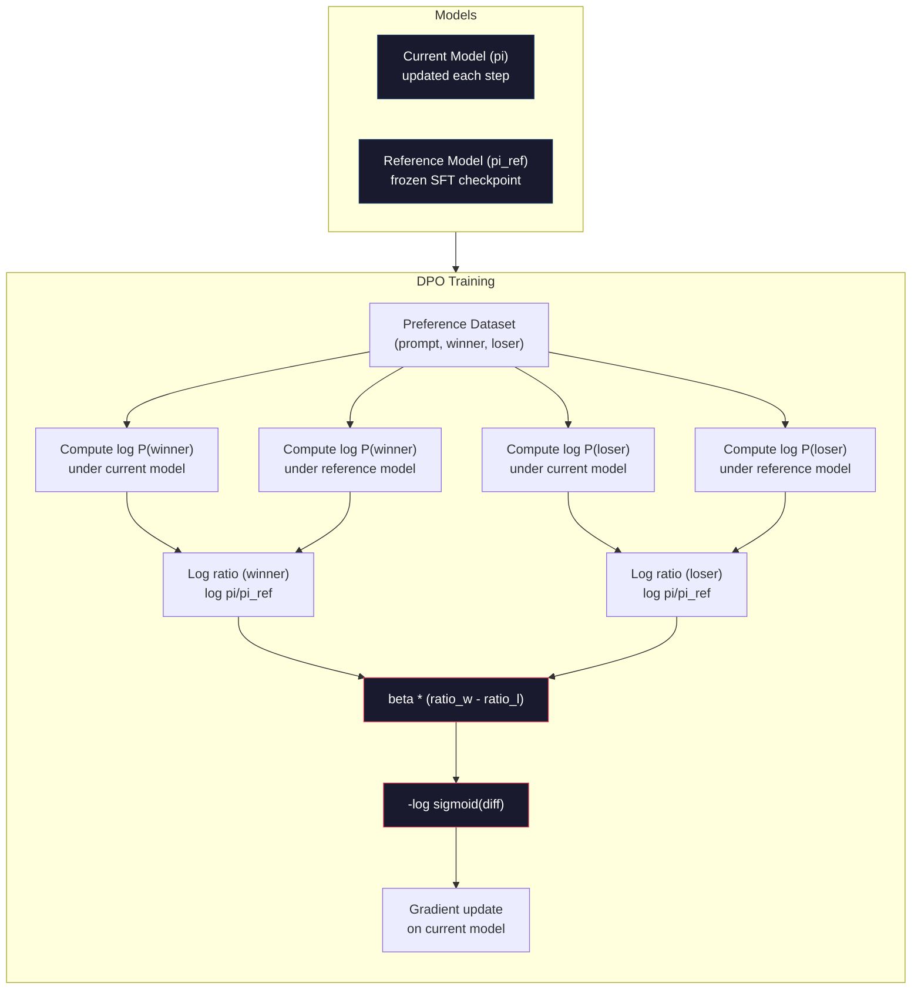

# DPO: 직접 선호 최적화 (Direct Preference Optimization)

> RLHF는 작동한다. 또한 세 개의 모델(SFT, 보상 모델, 정책)을 학습시키고, PPO의 불안정성을 관리하고, KL 페널티(penalty)를 조정하는 것을 요구한다. DPO는 묻는다: 그 모든 것을 건너뛸 수 있다면 어떨까? DPO는 선호 쌍에 대해 언어 모델을 직접 최적화한다. 보상 모델 없음. PPO 없음. 하나의 학습 루프. 같은 결과.

**Type:** Build
**Languages:** Python (with numpy)
**Prerequisites:** Phase 10, Lesson 07 (RLHF)
**Time:** ~90분

## 학습 목표 (Learning Objectives)

- 별도의 보상 모델(reward model) 없이 선호 쌍에 대해 언어 모델을 직접 최적화하는 DPO 학습 구현하기
- DPO 손실(loss) 함수를 유도하고, 그것이 정책(policy)의 로그 확률(log probability)을 통해 어떻게 보상 모델을 암묵적으로 표현하는지 설명하기
- 학습 안정성, 연산 비용, 필요한 모델 수의 관점에서 DPO와 RLHF 비교하기
- 학습된 정책이 레퍼런스 모델(reference model)에서 얼마나 멀리 발산하는지 제어하기 위해 beta 파라미터(parameter) 조정하기

## 문제 (The Problem)

당신은 Lesson 07에서 RLHF 파이프라인(pipeline)을 만들었다. 세 단계. 세 모델. SFT 모델, 보상 모델, 그리고 PPO로 최적화된 정책 모델. 보상 모델만으로도 수천 개의 사람 선호 쌍과 별도의 학습 루프가 필요했다. PPO는 KL 계수, 학습률(learning rate), 클립 비율, 에폭(epoch) 수의 세심한 조정을 요구했다.

실제로 PPO 학습은 악명 높게 불안정하다. 작은 하이퍼파라미터(hyperparameter) 변경이 학습을 발산하게 만든다. 보상 모델은 사람 선호의 불완전한 대리물이며, 정책은 그 약점을 악용할 방법을 찾는다. KL 페널티가 돕지만 자체적인 조정을 요구한다 -- 너무 낮으면 보상 해킹(reward hacking)을 얻고, 너무 높으면 모델이 거의 학습하지 못한다.

이 복잡성이 InstructGPT가 발표된 후 수년간 대부분의 오픈소스 모델이 RLHF에 고전한 이유다. 세 단계 파이프라인은 취약하다. 각 단계가 자체 실패 양상을 가지며, 오류가 누적된다.

2023년 5월, Rafael Rafailov, Archit Sharma, 그리고 Stanford의 동료들이 "Direct Preference Optimization: Your Language Model is Secretly a Reward Model"을 발표했다. 핵심 통찰: 별도의 보상 모델이 필요 없다. 최적 보상 함수는 언어 모델 자신의 토큰 확률에 의해 수학적으로 결정된다. 보상 모델을 완전히 건너뛰고 선호 쌍에 대해 언어 모델을 직접 최적화할 수 있다.

DPO는 RLHF를 단일 지도 학습(supervised learning) 단계로 축소한다. 하나의 모델. 하나의 손실 함수. 하나의 학습 루프. 강화 학습(reinforcement learning) 없음. DPO를 대규모로 사용한 첫 모델 중 하나인 Zephyr-7B는 여러 벤치마크(benchmark)에서 전체 RLHF로 학습된 모델과 맞먹거나 이겼다. Meta는 Llama 3의 정렬(alignment) 파이프라인의 일부로 DPO를 썼다. Anthropic은 정렬 연구에서 DPO 스타일 방법을 인용했다.

## 개념 (The Concept)

### 핵심 통찰

RLHF는 이 목적을 최적화한다:

```
maximize: E[R(x, y)] - beta * KL(pi || pi_ref)
```

여기서 R은 보상 모델, pi는 정책, pi_ref는 레퍼런스 모델, beta는 KL 계수다.

DPO 논문은 이 목적이 닫힌 형식(closed-form)의 최적해를 갖는다는 것을 보였다. 임의의 보상 함수 R에 대해, 최적 정책은:

```
pi*(y | x) = pi_ref(y | x) * exp(R(x, y) / beta) / Z(x)
```

여기서 Z(x)는 정규화 상수다. 재배열하면:

```
R(x, y) = beta * log(pi*(y | x) / pi_ref(y | x)) + beta * log Z(x)
```

이것이 돌파구다. 보상이 전적으로 정책 모델의 확률과 레퍼런스 모델의 확률의 관점에서 표현된다. 별도의 보상 모델을 학습할 필요가 없다. 보상은 확률 비율에 *암묵적*으로 들어 있다.

이것을 Bradley-Terry 선호 모델에 대입하면:

```
P(y_w > y_l | x) = sigmoid(R(x, y_w) - R(x, y_l))
                  = sigmoid(beta * (log pi(y_w|x)/pi_ref(y_w|x) - log pi(y_l|x)/pi_ref(y_l|x)))
```

두 응답이 같은 프롬프트(prompt) x에 조건부이기 때문에 Z(x) 항이 상쇄된다. 남는 것은 선호된 응답과 거부된 응답에 대한 정책 모델의 로그 확률과 레퍼런스 모델의 로그 확률만의 함수다.

### DPO 손실 (The DPO Loss)

```
L_DPO = -log(sigmoid(beta * (log pi(y_w|x)/pi_ref(y_w|x) - log pi(y_l|x)/pi_ref(y_l|x))))
```

각 조각을 풀어 보자:

- **y_w** = 선호된(이긴) 응답
- **y_l** = 거부된(진) 응답
- **x** = 프롬프트
- **pi** = 현재 모델(학습 중)
- **pi_ref** = 레퍼런스 모델(고정된 SFT 체크포인트)
- **beta** = 레퍼런스로부터의 일탈을 제어하는 온도 파라미터(보통 0.1에서 0.5)

비율 `log pi(y|x) / pi_ref(y|x)`는 로그 확률 비율이다. 이 비율이 양수일 때, 현재 모델은 응답 y에 레퍼런스보다 더 높은 확률을 할당한다. 음수일 때, 현재 모델은 더 낮은 확률을 할당한다.

DPO 손실은 모델이 선호된 응답에 대해 로그 확률 비율을 높이고 거부된 응답에 대해 낮추도록 밀어낸다. beta 파라미터는 모델이 레퍼런스에서 얼마나 공격적으로 일탈할 수 있는지 제어한다 -- 작은 beta는 큰 일탈을 허용하고, 큰 beta는 모델을 레퍼런스에 가깝게 유지한다.



### 왜 DPO가 더 단순한가

| 측면 | RLHF (PPO) | DPO |
|--------|-----------|-----|
| 학습할 모델 | 3 (SFT + 보상 + 정책) | 1 (정책만) |
| 학습 루프 | 3 (SFT, RM 학습, PPO) | 2 (SFT, DPO) |
| 하이퍼파라미터 | lr, KL 계수, 클립 비율, RM lr, 에폭 x3 | lr, beta, 에폭 |
| 보상 모델 | 필수 (별도 학습) | 모델 확률에 암묵적 |
| RL 알고리즘 | PPO (복잡, 불안정) | 지도 학습 (안정) |
| GPU 메모리 | PPO 동안 메모리에 3~4개 모델 | 2개 모델 (현재 + 레퍼런스) |
| 학습 안정성 | 하이퍼파라미터에 민감 | 견고, SFT와 비슷 |

DPO는 학습 동안 메모리에 두 개의 모델이 필요하다 -- 현재 모델과 고정된 레퍼런스. RLHF는 셋이나 넷이 필요하다: 정책, 레퍼런스, 보상 모델, 그리고 선택적으로 가치 함수 베이스라인(baseline). 700억 모델의 경우, 각 사본은 FP16에서 140GB를 차지한다. 보상 모델 제거로 인한 메모리 절감이 상당하다.

### DPO가 RLHF를 이길 때

**작은 데이터셋.** 5,000~20,000개의 선호 쌍으로, DPO는 흔히 RLHF와 맞먹거나 능가한다. RLHF의 보상 모델은 일반화하려면 충분한 데이터가 필요하다 -- 제한된 데이터로는 과적합(overfitting)하고 신뢰할 수 없는 보상 신호를 만든다. DPO는 보상 모델이 전혀 필요 없음으로써 이 문제를 우회한다.

**제한된 연산.** DPO는 전체 RLHF의 대략 3분의 1 연산(세 개 대신 하나의 학습 루프)을 요구한다. 큰 GPU 클러스터가 없는 팀에게 이것은 실용적인 선택이다.

**빠른 반복.** 어느 것이 최고의 모델을 만드는지 보려고 10개의 서로 다른 선호 데이터셋을 시도하고 싶은가? DPO는 각 실험을 몇 시간 안에 실행하게 해 준다. RLHF는 각 데이터셋마다 보상 모델을 재학습해야 한다.

### RLHF가 DPO를 이길 때

**대규모 학습.** GPT-4나 Claude의 규모에서, RLHF의 별도 보상 모델은 더 미묘한 선호 신호를 포착할 수 있다. 보상 모델은 복잡한 품질 기준에 적응하는 학습된 손실 함수 역할을 한다.

**복잡한 보상 신호.** "더 나음"이 여러 차원(도움됨, 무해성, 정직성)을 포함할 때, 보상 모델은 이 다중 목적 트레이드오프(trade-off)를 학습할 수 있다. DPO는 각 선호 쌍을 이진 신호로 취급한다 -- 하나는 더 낫고, 하나는 더 나쁘다 -- 왜 그런지 모델링하지 않는다.

**반복적 정렬.** RLHF 파이프라인은 현재 정책으로 새 응답을 생성하고, 사람이 그것을 평가하게 하고, 온라인 루프에서 보상 모델을 재학습할 수 있다. DPO는 선호 쌍의 고정된 데이터셋에서 작동한다. (Anthropic의 접근법인) Constitutional AI는 RLHF의 이 반복적 속성을 광범위하게 쓴다.

### DPO를 넘어서: KTO, ORPO, SimPO

DPO는 단순화된 정렬 방법들의 계열에 영감을 줬다.

**KTO (Kahneman-Tversky Optimization, 2024):** 쌍이 필요하지도 않다. KTO는 쌍이 아닌 피드백으로 작동한다 -- 대안과 비교하지 않고 각 응답을 그냥 "좋음" 또는 "나쁨"으로 레이블(label)한다. 이는 데이터 수집을 극적으로 단순화한다. 어노테이터(annotator)에게 두 응답을 보여 주며 "어느 것이 더 나은가?"라고 묻는 대신, 하나의 응답을 보여 주며 "이것이 좋은가?"라고 묻는다. 손실 함수는 전망 이론(prospect theory)의 손실 회피(loss aversion)를 적용한다: 나쁜 응답은 좋은 응답이 보상받는 것보다 더 많이 벌받는다.

**ORPO (Odds Ratio Preference Optimization, 2024):** SFT와 정렬을 단일 학습 단계로 결합한다. 먼저 SFT를 하고 그다음 DPO를 하는 대신, ORPO는 선호 신호를 포함하도록 SFT 손실을 수정한다. 손실은 두 항을 가진다: 선호된 응답에 대한 표준 다음 토큰 예측 손실, 더하기 선호된 응답과 거부된 응답 확률 사이의 격차를 키우는 승산비(odds ratio) 항. 두 개 대신 하나의 학습 루프다.

**SimPO (Simple Preference Optimization, 2024):** 레퍼런스 모델을 완전히 제거한다. 고정된 레퍼런스에 대해 로그 확률 비율을 계산하는 대신, SimPO는 (길이로 정규화된) 응답의 평균 로그 확률을 암묵적 보상으로 쓴다. 이것은 메모리를 절약하고(레퍼런스 모델 불필요) 학습을 단순화한다. 길이 정규화(length normalization)는 모델이 더 짧은 응답을 선호하는 것을 막는다.

| 방법 | 연도 | 메모리 내 모델 | 쌍이 필요한가? | 레퍼런스가 필요한가? | 학습 루프 |
|--------|------|-----------------|-------------|-----------------|----------------|
| RLHF | 2022 | 3-4 | 예 (RM용) | 예 | 3 |
| DPO | 2023 | 2 | 예 | 예 | 2 |
| KTO | 2024 | 2 | 아니오 (쌍 아님) | 예 | 2 |
| ORPO | 2024 | 1 | 예 | 아니오 | 1 |
| SimPO | 2024 | 1 | 예 | 아니오 | 1 |

추세는 분명하다: 각 방법은 복잡성의 한 조각씩을 더 제거한다. RLHF는 보상 모델과 PPO가 필요했다. DPO는 둘 다 제거했다. KTO는 쌍 데이터를 제거했다. ORPO는 별도의 SFT 단계를 제거했다. SimPO는 레퍼런스 모델을 제거했다. 정렬 세금(alignment tax) -- 베이스 모델에서 정렬된 모델로 가는 연산과 복잡성 비용 -- 은 계속 떨어진다.

### 실제 DPO 배포

**Zephyr-7B (HuggingFace, 2023년 10월):** Mistral 7B 베이스, UltraChat(20만 예시)에 SFT, 그다음 UltraFeedback(6만 선호 쌍)에 DPO. MT-Bench에서 6.47을 받았다 -- 당시 최고의 7B 모델이었다. 비교하자면, Llama 2 Chat 70B는 6.86을 받았는데, 이는 Zephyr가 DPO 정렬만 사용해 자기보다 10배 큰 모델의 6% 이내로 들어갔다는 뜻이다.

**Llama 3 (Meta, 2024년 4월):** 초기 RLHF 단계 후 DPO를 썼다. 이 조합은 DPO와 RLHF가 상호 보완적일 수 있음을 시사한다 -- 광범위한 정렬에는 RLHF, 표적화된 다듬기에는 DPO.

**Neural Magic / nm-chat (2024):** 여러 오픈소스 모델에 DPO를 적용해, SFT만 한 베이스라인 대비 정렬 벤치마크에서 일관되게 5~15% 개선을 보였다.

## 직접 만들기 (Build It)

### 1단계: 선호 데이터셋

RLHF와 같은 형식 -- (프롬프트, 선호됨, 거부됨) 세 쌍. DPO는 중간 보상 모델 없이 이 데이터를 직접 소비한다.

```python
import numpy as np
import sys
import os
sys.path.insert(0, os.path.join(os.path.dirname(__file__), "..", "..", "04-pre-training-mini-gpt", "code"))
from main import MiniGPT, LayerNorm, Embedding, TransformerBlock

PREFERENCE_DATA = [
    {
        "prompt": "What is the capital of France?",
        "preferred": "The capital of France is Paris.",
        "rejected": "France is a country in Europe. It has many cities. The capital is Paris. Paris is known for the Eiffel Tower.",
    },
    {
        "prompt": "Explain gravity in one sentence.",
        "preferred": "Gravity is the force that attracts objects with mass toward each other.",
        "rejected": "Gravity is something that makes things fall down when you drop them.",
    },
    {
        "prompt": "What is 15 times 7?",
        "preferred": "15 times 7 is 105.",
        "rejected": "Let me think about this. 15 times 7. Well, 10 times 7 is 70, and 5 times 7 is 35, so the answer might be around 105.",
    },
    {
        "prompt": "Name three programming languages.",
        "preferred": "Python, Rust, and TypeScript.",
        "rejected": "There are many programming languages. Some popular ones include various languages like Python and others.",
    },
    {
        "prompt": "What year did World War II end?",
        "preferred": "World War II ended in 1945.",
        "rejected": "World War II was a major global conflict. It involved many countries. The war ended in the mid-1940s, specifically in 1945.",
    },
    {
        "prompt": "Define machine learning.",
        "preferred": "Machine learning is a field where algorithms learn patterns from data to make predictions without being explicitly programmed.",
        "rejected": "Machine learning is a type of AI. AI stands for artificial intelligence. Machine learning uses data to learn.",
    },
]
```

### 2단계: 시퀀스 로그 확률

DPO 손실은 프롬프트가 주어진 응답의 전체 로그 확률을 계산할 것을 요구한다. 이는 전체 (프롬프트 + 응답) 시퀀스에 대해 모델을 실행하고 각 응답 토큰의 로그 확률을 합산하는 것을 뜻한다.

```python
def tokenize_sequence(text, vocab_size=256):
    return [min(t, vocab_size - 1) for t in list(text.encode("utf-8"))]


def compute_sequence_log_prob(model, prompt_tokens, response_tokens, max_seq_len=128):
    full_sequence = prompt_tokens + response_tokens
    if len(full_sequence) > max_seq_len:
        full_sequence = full_sequence[:max_seq_len]

    if len(full_sequence) < 2:
        return 0.0

    input_ids = np.array(full_sequence[:-1]).reshape(1, -1)
    target_ids = np.array(full_sequence[1:])

    logits = model.forward(input_ids)
    logits = logits[0]

    max_logits = logits.max(axis=-1, keepdims=True)
    log_probs = logits - max_logits - np.log(
        np.exp(logits - max_logits).sum(axis=-1, keepdims=True)
    )

    prompt_len = len(prompt_tokens)
    response_start = max(0, prompt_len - 1)
    response_end = len(target_ids)

    if response_start >= response_end:
        return 0.0

    response_log_probs = log_probs[response_start:response_end, :]
    response_targets = target_ids[response_start:response_end]

    total_log_prob = 0.0
    for i, target in enumerate(response_targets):
        total_log_prob += response_log_probs[i, target]

    return total_log_prob
```

이 함수는 DPO의 일꾼이다. 각 선호 쌍에 대해 네 번 실행된다: 선호된 응답에 대한 모델, 거부된 응답에 대한 모델, 선호된 응답에 대한 레퍼런스, 거부된 응답에 대한 레퍼런스. 그것은 학습 예시당 4번의 순방향 패스(forward pass)로, RLHF의 생성 + 보상 점수 + 가치 추정 + PPO 갱신과 대비된다. 더 단순하고, 더 빠르고, 더 안정적이다.

### 3단계: DPO 손실

논문의 핵심을 코드로. 하나의 함수. 하나의 손실. 보상 모델 없음.

```python
def sigmoid(x):
    return np.where(
        x >= 0,
        1.0 / (1.0 + np.exp(-x)),
        np.exp(x) / (1.0 + np.exp(x))
    )


def dpo_loss(policy_logprob_preferred, policy_logprob_rejected,
             ref_logprob_preferred, ref_logprob_rejected, beta=0.1):
    preferred_ratio = policy_logprob_preferred - ref_logprob_preferred
    rejected_ratio = policy_logprob_rejected - ref_logprob_rejected

    logit = beta * (preferred_ratio - rejected_ratio)

    loss = -np.log(sigmoid(logit) + 1e-8)

    preferred_reward = beta * preferred_ratio
    rejected_reward = beta * rejected_ratio

    return loss, {
        "preferred_ratio": float(preferred_ratio),
        "rejected_ratio": float(rejected_ratio),
        "logit": float(logit),
        "implicit_preferred_reward": float(preferred_reward),
        "implicit_rejected_reward": float(rejected_reward),
        "reward_margin": float(preferred_reward - rejected_reward),
    }
```

`preferred_ratio`와 `rejected_ratio`는 DPO 유도에서 나온 로그 확률 비율이다. 현재 모델이 (레퍼런스에 비해) 선호된 응답에 더 높은 확률을 할당하고 거부된 응답에 더 낮은 확률을 할당할 때, 로짓은 양수이고 손실은 낮다. 학습 신호는 모델을 정확히 이 방향으로 밀어낸다.

`implicit_preferred_reward`와 `implicit_rejected_reward`는 DPO 손실이 암묵적으로 할당하는 보상이다. 학습이 작동하는지 검증하기 위해 그것들을 추출할 수 있다 -- 선호와 거부 보상 사이의 마진은 학습에 걸쳐 증가해야 한다.

### 4단계: DPO 학습 루프

표준 지도 학습 루프다. PPO 없음. 보상 모델 없음. 그저 순방향 패스와 그래디언트(gradient) 갱신.

```python
def copy_model_weights(source, target):
    target.embedding.token_embed = source.embedding.token_embed.copy()
    target.embedding.pos_embed = source.embedding.pos_embed.copy()
    target.ln_f.gamma = source.ln_f.gamma.copy()
    target.ln_f.beta = source.ln_f.beta.copy()
    for s_block, t_block in zip(source.blocks, target.blocks):
        t_block.attn.W_q = s_block.attn.W_q.copy()
        t_block.attn.W_k = s_block.attn.W_k.copy()
        t_block.attn.W_v = s_block.attn.W_v.copy()
        t_block.attn.W_out = s_block.attn.W_out.copy()
        t_block.ffn.W1 = s_block.ffn.W1.copy()
        t_block.ffn.W2 = s_block.ffn.W2.copy()
        t_block.ffn.b1 = s_block.ffn.b1.copy()
        t_block.ffn.b2 = s_block.ffn.b2.copy()
        t_block.ln1.gamma = s_block.ln1.gamma.copy()
        t_block.ln1.beta = s_block.ln1.beta.copy()
        t_block.ln2.gamma = s_block.ln2.gamma.copy()
        t_block.ln2.beta = s_block.ln2.beta.copy()


def dpo_train(policy_model, reference_model, preference_data,
              num_epochs=5, lr=5e-6, beta=0.1, max_seq_len=128):
    print(f"DPO Training: {len(preference_data)} pairs, {num_epochs} epochs, "
          f"lr={lr}, beta={beta}")
    print()

    losses = []
    margins = []

    for epoch in range(num_epochs):
        epoch_loss = 0.0
        epoch_margin = 0.0
        num_examples = 0

        indices = np.random.permutation(len(preference_data))

        for idx in indices:
            pair = preference_data[idx]

            prompt_tokens = tokenize_sequence(pair["prompt"])
            preferred_tokens = tokenize_sequence(pair["preferred"])
            rejected_tokens = tokenize_sequence(pair["rejected"])

            pi_logprob_w = compute_sequence_log_prob(
                policy_model, prompt_tokens, preferred_tokens, max_seq_len
            )
            pi_logprob_l = compute_sequence_log_prob(
                policy_model, prompt_tokens, rejected_tokens, max_seq_len
            )
            ref_logprob_w = compute_sequence_log_prob(
                reference_model, prompt_tokens, preferred_tokens, max_seq_len
            )
            ref_logprob_l = compute_sequence_log_prob(
                reference_model, prompt_tokens, rejected_tokens, max_seq_len
            )

            loss, metrics = dpo_loss(
                pi_logprob_w, pi_logprob_l,
                ref_logprob_w, ref_logprob_l, beta
            )

            update_direction = 1.0 if metrics["logit"] < 0 else -0.1
            for block in policy_model.blocks:
                block.ffn.W1 += lr * update_direction * np.random.randn(*block.ffn.W1.shape) * 0.01
                block.ffn.W2 += lr * update_direction * np.random.randn(*block.ffn.W2.shape) * 0.01

            epoch_loss += loss
            epoch_margin += metrics["reward_margin"]
            num_examples += 1
            losses.append(float(loss))
            margins.append(metrics["reward_margin"])

        avg_loss = epoch_loss / max(num_examples, 1)
        avg_margin = epoch_margin / max(num_examples, 1)

        print(f"  Epoch {epoch + 1}/{num_epochs} | Loss: {avg_loss:.4f} | "
              f"Avg Margin: {avg_margin:.4f}")

    return policy_model, losses, margins
```

학습 루프는 RLHF에 비해 시원할 만큼 단순하다. 각 선호 쌍에 대해: 네 개의 로그 확률(두 모델, 두 응답)을 계산하고, 그것들을 DPO 손실에 넣고, 그래디언트를 계산하고, 정책을 갱신한다. 생성 단계 없음. 보상 모델 추론 없음. 이점(advantage) 추정 없음. 클리핑 없음.

### 5단계: DPO와 RLHF 비교

암묵적 보상 마진과 로그 확률 이동을 측정해 Lesson 07의 RLHF 모델과 DPO를 비교한다.

```python
def evaluate_preference_accuracy(model, reference_model, preference_data, beta=0.1, max_seq_len=128):
    correct = 0
    total = 0

    for pair in preference_data:
        prompt_tokens = tokenize_sequence(pair["prompt"])
        preferred_tokens = tokenize_sequence(pair["preferred"])
        rejected_tokens = tokenize_sequence(pair["rejected"])

        pi_w = compute_sequence_log_prob(model, prompt_tokens, preferred_tokens, max_seq_len)
        pi_l = compute_sequence_log_prob(model, prompt_tokens, rejected_tokens, max_seq_len)
        ref_w = compute_sequence_log_prob(reference_model, prompt_tokens, preferred_tokens, max_seq_len)
        ref_l = compute_sequence_log_prob(reference_model, prompt_tokens, rejected_tokens, max_seq_len)

        preferred_reward = beta * (pi_w - ref_w)
        rejected_reward = beta * (pi_l - ref_l)

        if preferred_reward > rejected_reward:
            correct += 1
        total += 1

    return correct / max(total, 1)


def analyze_implicit_rewards(model, reference_model, preference_data, beta=0.1, max_seq_len=128):
    print("Implicit Reward Analysis:")
    print("-" * 65)
    print(f"  {'Prompt':<30} {'Pref Reward':>12} {'Rej Reward':>12} {'Margin':>10}")
    print("  " + "-" * 60)

    for pair in preference_data:
        prompt_tokens = tokenize_sequence(pair["prompt"])
        preferred_tokens = tokenize_sequence(pair["preferred"])
        rejected_tokens = tokenize_sequence(pair["rejected"])

        pi_w = compute_sequence_log_prob(model, prompt_tokens, preferred_tokens, max_seq_len)
        pi_l = compute_sequence_log_prob(model, prompt_tokens, rejected_tokens, max_seq_len)
        ref_w = compute_sequence_log_prob(reference_model, prompt_tokens, preferred_tokens, max_seq_len)
        ref_l = compute_sequence_log_prob(reference_model, prompt_tokens, rejected_tokens, max_seq_len)

        pref_reward = beta * (pi_w - ref_w)
        rej_reward = beta * (pi_l - ref_l)
        margin = pref_reward - rej_reward

        truncated = pair["prompt"][:28] + ".." if len(pair["prompt"]) > 30 else pair["prompt"]
        print(f"  {truncated:<30} {pref_reward:>12.4f} {rej_reward:>12.4f} {margin:>10.4f}")

    print()
```

### 6단계: Beta 민감도 분석

beta 파라미터는 RLHF에서 KL 계수에 해당하는 DPO의 것이다. 모델이 레퍼런스에서 얼마나 일탈할 수 있는지 제어한다. 이 실험은 그 효과를 보여 준다.

```python
def beta_sensitivity_analysis(sft_model, preference_data, betas, max_seq_len=128):
    print("Beta Sensitivity Analysis")
    print("-" * 60)
    print(f"  {'Beta':>8} {'Final Loss':>12} {'Final Margin':>14} {'Accuracy':>10}")
    print("  " + "-" * 55)

    results = []

    for beta in betas:
        policy = MiniGPT(
            vocab_size=256, embed_dim=128, num_heads=4,
            num_layers=4, max_seq_len=max_seq_len, ff_dim=512
        )
        reference = MiniGPT(
            vocab_size=256, embed_dim=128, num_heads=4,
            num_layers=4, max_seq_len=max_seq_len, ff_dim=512
        )
        copy_model_weights(sft_model, policy)
        copy_model_weights(sft_model, reference)

        policy, losses, margins_list = dpo_train(
            policy, reference, preference_data,
            num_epochs=3, lr=5e-6, beta=beta, max_seq_len=max_seq_len
        )

        accuracy = evaluate_preference_accuracy(
            policy, reference, preference_data, beta, max_seq_len
        )

        final_loss = losses[-1] if losses else 0
        final_margin = margins_list[-1] if margins_list else 0

        print(f"  {beta:>8.3f} {final_loss:>12.4f} {final_margin:>14.4f} {accuracy:>10.1%}")
        results.append({
            "beta": beta,
            "final_loss": final_loss,
            "final_margin": final_margin,
            "accuracy": accuracy,
        })

        print()

    return results
```

작은 beta(0.01)는 모델이 레퍼런스에서 자유롭게 일탈하게 한다 -- 빠른 학습이지만 퇴화한 해의 위험. 큰 beta(1.0)는 모델을 레퍼런스에 가깝게 유지한다 -- 안정적이지만 느린 학습. 대부분의 응용에 적절한 균형점은 0.1에서 0.3이다.

## 라이브러리로 써보기 (Use It)

### 전체 DPO 파이프라인 데모

```python
if __name__ == "__main__":
    np.random.seed(42)

    print("=" * 70)
    print("DPO: DIRECT PREFERENCE OPTIMIZATION")
    print("=" * 70)
    print()

    print("STEP 1: Initialize SFT Model (from Lesson 06)")
    print("-" * 50)
    sft_model = MiniGPT(
        vocab_size=256, embed_dim=128, num_heads=4,
        num_layers=4, max_seq_len=128, ff_dim=512
    )
    print(f"  Parameters: {sft_model.count_parameters():,}")
    print()

    print("STEP 2: DPO Training")
    print("-" * 50)

    policy_model = MiniGPT(
        vocab_size=256, embed_dim=128, num_heads=4,
        num_layers=4, max_seq_len=128, ff_dim=512
    )
    reference_model = MiniGPT(
        vocab_size=256, embed_dim=128, num_heads=4,
        num_layers=4, max_seq_len=128, ff_dim=512
    )
    copy_model_weights(sft_model, policy_model)
    copy_model_weights(sft_model, reference_model)

    policy_model, losses, margins = dpo_train(
        policy_model, reference_model, PREFERENCE_DATA,
        num_epochs=5, lr=5e-6, beta=0.1
    )
    print()

    print("=" * 70)
    print("STEP 3: Evaluate")
    print("=" * 70)
    print()

    pre_accuracy = evaluate_preference_accuracy(
        sft_model, reference_model, PREFERENCE_DATA, beta=0.1
    )
    post_accuracy = evaluate_preference_accuracy(
        policy_model, reference_model, PREFERENCE_DATA, beta=0.1
    )

    print(f"  Preference accuracy (pre-DPO):  {pre_accuracy:.1%}")
    print(f"  Preference accuracy (post-DPO): {post_accuracy:.1%}")
    print()

    analyze_implicit_rewards(policy_model, reference_model, PREFERENCE_DATA, beta=0.1)

    print("=" * 70)
    print("STEP 4: Training Dynamics")
    print("=" * 70)
    print()

    if losses:
        print("  Loss curve:")
        window = max(1, len(losses) // 5)
        for i in range(0, len(losses), window):
            chunk = losses[i:i + window]
            avg = sum(chunk) / len(chunk)
            print(f"    Steps {i:3d}-{i + len(chunk) - 1:3d}: loss = {avg:.4f}")
        print()

    if margins:
        print("  Reward margin curve:")
        window = max(1, len(margins) // 5)
        for i in range(0, len(margins), window):
            chunk = margins[i:i + window]
            avg = sum(chunk) / len(chunk)
            print(f"    Steps {i:3d}-{i + len(chunk) - 1:3d}: margin = {avg:.4f}")
        print()

    print("=" * 70)
    print("STEP 5: Beta Sensitivity")
    print("=" * 70)
    print()

    beta_results = beta_sensitivity_analysis(
        sft_model, PREFERENCE_DATA, betas=[0.01, 0.1, 0.3, 1.0]
    )

    print("=" * 70)
    print("DPO vs RLHF COMPARISON")
    print("=" * 70)
    print()
    print("  DPO advantages:")
    print("    - 1 training loop (vs 3 for RLHF)")
    print("    - 2 models in memory (vs 3-4 for RLHF)")
    print("    - Supervised learning (vs RL, more stable)")
    print("    - No reward model to train or maintain")
    print()
    print("  RLHF advantages:")
    print("    - Separate reward model captures complex preferences")
    print("    - Online learning: generate, rate, retrain")
    print("    - Better for multi-objective alignment")
    print("    - Proven at largest scales (GPT-4, Claude)")
    print()
    print("  Practical guidance:")
    print("    - Start with DPO. It's simpler and often sufficient.")
    print("    - Switch to RLHF if DPO plateaus on your eval metrics.")
    print("    - Many production systems use both: RLHF first, DPO to refine.")
```

## 산출물 (Ship It)

이 레슨은 `outputs/prompt-alignment-method-selector.md`를 만든다 -- 당신의 사용 사례에 맞는 올바른 정렬 방법(SFT, RLHF, DPO, KTO, ORPO, SimPO)을 고르도록 돕는 프롬프트다. 당신의 데이터 가용성, 연산 예산, 정렬 목표가 주어지면, 방법과 학습 계획을 추천한다.

## 연습 문제 (Exercises)

1. KTO(Kahneman-Tversky Optimization)를 구현하라. KTO는 쌍이 필요 없다 -- 각 응답을 그냥 "좋음" 또는 "나쁨"으로 레이블한다. 좋은 응답의 손실은 `-log(sigmoid(beta * log_ratio))`이고 나쁜 응답의 손실은 나쁜 응답 손실에 손실 회피 승수(보통 1.5배)를 곱한 `-log(1 - sigmoid(beta * log_ratio))`다. 같은 데이터로 학습하고(선호를 "좋음"으로, 거부를 "나쁨"으로 독립적으로 취급) DPO와 정확도를 비교하라.

2. 길이 정규화 DPO를 구현하라. 원시 로그 확률 대신, 응답 토큰 수로 나눠라: `normalized_logprob = total_logprob / num_tokens`. 이것은 모델이 (더 높은 전체 로그 확률을 가지는) 더 짧은 응답을 선호하는 것을 막는다. 정규화가 있을 때와 없을 때 암묵적 보상 마진을 비교하라.

3. ORPO 스타일 결합 손실을 만들어라. 선호된 응답에 대한 표준 다음 토큰 예측 손실을 DPO 손실에 더하라: `L = L_sft(preferred) + alpha * L_dpo`. alpha 값을 0.1, 0.5, 1.0으로 시도하라. 결합된 손실은 (SFT 항으로부터) 지시를 따르고 (DPO 항으로부터) 더 나은 응답을 선호하는 모델을 만들어, 별도의 SFT 단계의 필요를 없애야 한다.

4. 반복적 DPO를 구현하라. DPO를 3 에폭 실행한 뒤, 학습된 모델에서 새 응답을 생성하고, 그것들을 원래의 선호된 응답과 짝지어 새 선호 쌍으로 만들고, DPO를 다시 실행하라. 이 "셀프 플레이(self-play)" 과정을 두 라운드. 라운드 1과 라운드 2 후의 선호 정확도를 비교해 반복적 다듬기가 도움이 되는지 보라.

5. 서로 다른 레퍼런스 모델로 DPO를 비교하라. SFT 체크포인트를 레퍼런스로 쓰는 대신, 다음을 시도하라: (a) 베이스 모델(SFT 전), (b) DPO의 에폭 1 체크포인트, (c) 정책 모델의 지수 이동 평균. 어느 레퍼런스가 가장 높은 선호 정확도와 가장 안정적인 학습 곡선을 만드는지 보고하라.

## 핵심 용어 (Key Terms)

| 용어 | 사람들이 말하는 것 | 실제 의미 |
|------|----------------|----------------------|
| DPO | "RL 없는 RLHF" | 직접 선호 최적화(Direct Preference Optimization): 보상 모델과 PPO를 우회하고 선호 쌍에 대해 언어 모델을 직접 최적화하는 지도 학습 알고리즘 |
| 암묵적 보상(Implicit reward) | "보상이 모델 안에 있다" | 보상 함수가 정책과 레퍼런스 모델 사이의 로그 확률 비율에 의해 결정된다 -- 별도의 보상 모델이 필요 없다 |
| Beta (DPO) | "온도" | 정책이 레퍼런스 모델에서 얼마나 멀리 일탈할 수 있는지 제어한다 -- 작은 beta는 큰 일탈을 허용하고, 큰 beta는 모델을 가깝게 유지한다 |
| 로그 확률 비율(Log-probability ratio) | "모델이 얼마나 바뀌었는가" | log pi(y\|x) - log pi_ref(y\|x) -- 양수는 현재 모델이 레퍼런스보다 더 높은 확률을 할당함을 뜻한다 |
| 레퍼런스 모델(Reference model) | "고정된 체크포인트" | 가중치가 절대 바뀌지 않는 SFT 모델의 사본 -- 확률 비율을 계산하는 기준점 역할을 한다 |
| KTO | "쌍 없는 DPO" | Kahneman-Tversky Optimization: 선호 쌍을 요구하는 대신 쌍이 아닌 "좋음" 또는 "나쁨" 레이블로 작동한다 |
| ORPO | "한 단계 정렬" | Odds Ratio Preference Optimization: SFT 손실에 선호 항을 더해 SFT와 정렬을 단일 학습 루프로 결합한다 |
| SimPO | "레퍼런스 불필요" | Simple Preference Optimization: 길이 정규화된 평균 로그 확률을 암묵적 보상으로 써서 레퍼런스 모델을 제거한다 |
| 정렬 세금(Alignment tax) | "모델을 안전하게 만드는 비용" | 베이스 모델에서 정렬된 모델로 가는 데 필요한 추가 연산, 데이터, 복잡성 -- DPO는 이를 상당히 줄인다 |

## 더 읽을거리 (Further Reading)

- [Rafailov et al., 2023 -- "Direct Preference Optimization: Your Language Model is Secretly a Reward Model"](https://arxiv.org/abs/2305.18290) -- 정렬을 RLHF에서 지도 학습으로 단순화한 DPO 논문
- [Tunstall et al., 2023 -- "Zephyr: Direct Distillation of LM Alignment"](https://arxiv.org/abs/2310.16944) -- UltraFeedback에 대한 DPO가 벤치마크에서 RLHF와 맞먹음을 보여 주는 Zephyr-7B
- [Ethayarajh et al., 2024 -- "KTO: Model Alignment as Prospect Theoretic Optimization"](https://arxiv.org/abs/2402.01306) -- 쌍 선호의 필요를 없애기
- [Hong et al., 2024 -- "ORPO: Monolithic Preference Optimization without Reference Model"](https://arxiv.org/abs/2403.07691) -- SFT와 정렬을 한 단계로 결합하기
- [Meng et al., 2024 -- "SimPO: Simple Preference Optimization with a Reference-Free Reward"](https://arxiv.org/abs/2405.14734) -- 레퍼런스 모델을 완전히 제거하기
- [Llama 3 Technical Report](https://arxiv.org/abs/2407.21783) -- RLHF와 DPO를 결합한 Meta의 정렬 파이프라인
