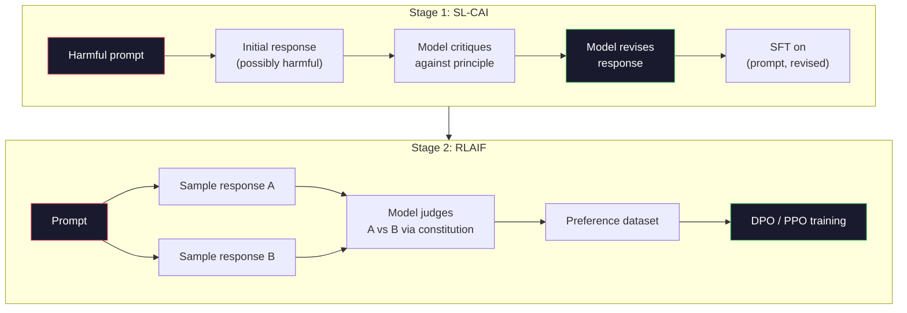
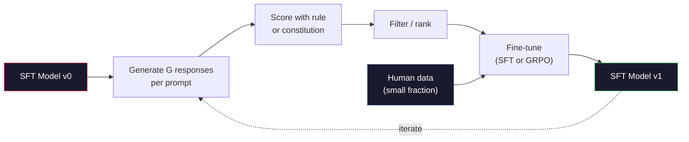

# 헌법적 AI와 자기 개선 (Constitutional AI and Self-Improvement)

> RLHF는 사람을 루프 안에 두어야 한다. 헌법적 AI(Constitutional AI)는 그 대부분을 모델 자신으로 대체한다. 원칙 목록을 작성하고, 모델이 그 원칙에 비추어 자신의 출력을 비평하게 하고, 그 비평으로 학습시킨다. DeepSeek-R1은 2025년에 이를 더 밀어붙였다. 모델이 수백만 개의 추론 트레이스(reasoning trace)를 생성하게 하고, 규칙으로 채점한 뒤, 그 결과에 GRPO를 돌린다. 2026년 프런티어 모델에서 "정렬 작업(alignment work)"의 대부분은 모델이 스스로를 정렬하는 것이다. 이 레슨은 두 루프를 모두 만든다.

**Type:** Build
**Languages:** Python (stdlib + numpy)
**Prerequisites:** Phase 10, Lessons 06-08 (SFT, RLHF, DPO)
**Time:** ~45분

## 학습 목표 (Learning Objectives)

- 헌법적 AI의 2단계 루프를 구현하기: 자기 비평(self-critique)과 자기 수정(self-revision), 그리고 수정된 쌍에 대한 선호 학습(preference training)
- GRPO 목적 함수(DeepSeek-R1의 그룹 상대 정책 최적화, group-relative policy optimization)를 유도하고 PPO의 가치 함수(value-function) 베이스라인(baseline)과 대조하기
- 규칙 기반 결과 보상(rule-based outcome reward)으로 검증 가능한 추론 트레이스를 생성하고, 별도의 보상 모델(reward model) 없이 채점하기
- 자기 개선이 사람의 선호 데이터를 능가하는 경우와, 모드 추구(mode seeking)로 붕괴하는 경우를 판단하기

## 문제 (The Problem)

Lesson 07에서 RLHF를, Lesson 08에서 DPO를 만들었다. 둘 다 같은 비싼 입력에 의존한다. 바로 사람의 선호 쌍(human preference pair)이다. Anthropic의 InstructGPT 시대 파이프라인(pipeline)은 약 33,000개의 비교를 사용했다. Llama 2 Chat은 150만 개 이상을 사용했다. Claude 3은 더 많이 썼다. 이 데이터는 느리고 비싸며, 평가하던 그날 어노테이터(annotator)가 마침 믿고 있던 것에 편향(biased)된다.

2022년 헌법적 AI 논문은 단순한 질문을 던졌다. 모델이 선호 레이블(label)을 스스로 생성하게 하면 어떨까? 작성된 원칙 목록 — "헌법(constitution)" — 을 주고, 모델이 자신의 응답을 비평하게 하라. 그 비평이 학습 신호가 된다.

2024년 DeepSeek은 이 아이디어를 더 밀고 나갔다. 그들은 검증 가능한 결과를 갖는 모든 작업(정답이 알려진 수학, 테스트를 통과하거나 실패하는 코드, 이기거나 지는 게임)에 대해서는 비평자(critic)를 완전히 건너뛸 수 있음을 보였다. 많은 후보 해법을 생성하라. 각각을 결정론적 규칙으로 채점하라. 그 보상에 정책 경사(policy-gradient) 알고리즘을 돌려라. DeepSeek-R1은 사람의 선호 데이터가 거의 없이 이렇게 학습되었고 o1급 추론 성능에 필적했다.

이 두 루프 — 주관적 행동을 위한 헌법적 AI와 검증 가능한 행동을 위한 규칙 기반 강화 학습(rule-based RL) — 은 2026년의 지배적인 정렬 레시피다. 예전에 RLHF에 들어가던 사람 선호 예산은 이제 훨씬 작은 단계를 위해 쓰인다. 헌법을 고르고, 보상 규칙을 고르는 일이다.

## 개념 (The Concept)

### 헌법적 AI 루프 (The Constitutional AI Loop)

Bai et al. (2022)은 파이프라인을 두 단계로 구조화했다.

**1단계: AI 피드백으로부터의 지도 학습(Supervised Learning from AI Feedback, SL-CAI).** 도움은 되지만 해로울 수도 있는 SFT 모델에서 시작한다. 잠재적으로 해로운 요청으로 프롬프트(prompt)한다. 각 응답에 대해, *같은 모델*에게 헌법적 원칙에 비추어 자신의 응답을 비평한 뒤 수정하게 한다. 수정된 응답으로 파인튜닝(fine-tuning)한다. 데이터셋(dataset)은 (prompt, revised_response) 쌍이다.

**2단계: AI 피드백으로부터의 강화 학습(Reinforcement Learning from AI Feedback, RLAIF).** 응답 쌍을 샘플링(sampling)한다. 어느 쪽이 헌법을 더 잘 따르는지 모델에게 묻는다. 이 쌍별(pairwise) 선호가 보상 모델을 학습시킨다. 그런 다음 그 보상을 사용해 모델에 PPO나 DPO를 돌린다. RLHF와의 핵심 차이는 선호가 사람이 아니라 모델에서 나왔다는 것이다.



헌법이 지렛대다. Anthropic의 원본에는 16개의 원칙이 있었다(이후 확장됨). 한 원칙은 이렇게 읽힌다. "매우 다양한 문화적 배경을 가진 누구에게도 거슬릴 가능성이 가장 낮은 응답을 선택하세요." 각 단계에 대해 원칙을 고르는데, 때로는 무작위로, 때로는 프롬프트 범주에 따라 고른다.

### 헌법이 실제로 하는 일 (What the Constitution Actually Does)

헌법은 정렬 계약(alignment contract)을 *데이터*에서 *텍스트*로 옮긴다. RLHF에서 행동을 바꾸려면 수천 개의 쌍을 다시 레이블링해야 한다. CAI에서 행동을 바꾸려면 한 문단을 편집하면 된다. 이것이 주된 실용적 이점이다.

비용도 있다. 모델의 자기 판단은 출발점의 보정(calibration) 수준만큼만 좋다. SFT 모델에 맹점(blind spot)이 있다면 — 예를 들어 조작적 표현을 인식하지 못한다면 — 비평 단계는 그 맹점을 그대로 물려받는다. CAI는 정렬 루프를 압축하지만, 베이스 모델(base model)의 한계 너머로 신호를 증폭할 수는 없다. 이것이 모든 프로덕션(production) CAI 파이프라인이 여전히 일부 사람 선호 데이터를 — 보통 순수 RLHF 양의 5-10% 정도 — 사용하는 이유다.

### GRPO: 그룹 상대 정책 최적화 (Group-Relative Policy Optimization)

DeepSeek은 DeepSeekMath 논문(2024)에서 GRPO를 도입했고 DeepSeek-R1(2025)의 중추로 사용했다. GRPO는 가치 함수를 제거한 PPO의 변형이다.

PPO의 목적 함수를 떠올려 보라(Lesson 07에서):

```
L_PPO = E[min(r(theta) * A, clip(r(theta), 1-eps, 1+eps) * A)]
```

여기서 `A`는 어드밴티지(advantage)이며, 보통 학습된 가치 네트워크(value network) `V(s)`를 사용한 GAE로 추정된다. 가치 네트워크는 정책(policy)과 같은 크기의 두 번째 모델이다. 이는 메모리를 두 배로 늘리고 자체적인 학습 루프를 도입한다.

GRPO는 가치 함수를 버린다. 각 프롬프트에 대해 G개의 응답으로 이루어진 그룹을 샘플링한다(보통 G=16 또는 64). 각 응답의 보상을 계산한 뒤, 그룹 내에서 정규화(normalize)한다.

```
A_i = (r_i - mean(r_1, ..., r_G)) / std(r_1, ..., r_G)
```

어드밴티지는 형제(sibling) 응답들의 보상 대비 해당 응답 보상의 z-점수(z-score)다. 가치 함수가 없다. 그룹 자체가 베이스라인 역할을 한다.

```
L_GRPO = E[min(r(theta) * A_group, clip(r(theta), 1-eps, 1+eps) * A_group)] - beta * KL(pi || pi_ref)
```

참조 모델(reference model)에 대한 KL 페널티는 PPO와 동일하게 여전히 있다. 클립 비율(clip ratio)도 여전히 있다. 사라진 것은 별도의 비평자뿐이다.

### GRPO가 추론에서 중요한 이유 (Why GRPO Matters for Reasoning)

추론 작업에서 보상은 종종 희소(sparse)하고 이진적(binary)이다. 최종 답이 맞거나 틀리다. 희소한 이진 보상으로 학습된 가치 함수는 낭비다. 최종 단계까지 거의 모든 상태가 같은 기댓값(expected return)을 갖기 때문에 유용한 중간 추정값을 학습할 수 없다. GRPO의 그룹 정규화는 즉각적인 상대 신호를 준다. 같은 수학 문제에 대한 16번의 시도 중에서, 이 문제에 대해 어떤 시도가 평균보다 나았는가?

이것이 규칙 기반 보상에서 얻는 신호의 정확한 형태다.

- **수학**: sympy나 기호적 검사기(symbolic checker)가 최종 답이 일치하는지 결정한다.
- **코드**: 테스트 스위트(test suite)가 통과/실패를 결정한다.
- **포매팅**: 정규식(regex)이 답이 요구된 XML 태그 안에 있는지 결정한다.
- **다단계 증명**: 증명 보조기(proof assistant, Lean, Coq)가 유효성을 결정한다.

DeepSeek-R1-Zero는 단 두 개의 보상으로만 학습되었다. 수학 벤치마크(benchmark)에서의 정확도와 형식 준수(`<answer>` 태그 안의 답)다. 사람 선호도 없고, 비평자 모델도 없다. DeepSeek 논문이 묘사한 "아하 순간(aha moment)" — 모델이 자기 점검과 백트래킹(backtrack)을 자발적으로 학습하는 것 — 은 오직 희소한 규칙 보상에 대한 GRPO만으로 나타났다.

### 과정 보상 모델 vs 결과 보상 모델 (Process Reward Models vs Outcome Reward Models)

여전히 설계 선택이 남아 있다. 최종 답에 보상을 줄 것인가(결과 보상 모델, Outcome Reward Model, ORM), 아니면 각 중간 단계에 보상을 줄 것인가(과정 보상 모델, Process Reward Model, PRM).

| 축 | ORM | PRM |
|------|-----|-----|
| 트레이스당 신호 | 1개의 숫자 | N개의 숫자(단계당 하나) |
| 감독 출처 | 최종 답 검사 | 단계 수준 레이블 또는 자기 판단 |
| 학습 비용 | 저렴 | 비쌈 |
| 신용 할당(credit assignment) | 희소하고 노이즈 많음 | 조밀하고 표적화됨 |
| 보상 해킹(reward hacking) 위험 | 낮음 | 높음(모델이 PRM 산출물을 최적화) |
| 사용처 | DeepSeek-R1, R1-Zero | OpenAI o1(추정), Math-Shepherd |

2024-2025년의 합의는 ORM과 GRPO의 조합이 PRM보다 더 잘 확장된다는 것이었다. PRM은 토큰당 샘플 효율(sample-efficient)이 더 좋지만 비싼 단계 레이블 데이터를 요구하며, 지름길 행동(shortcut behavior, PRM에게 좋아 보이지만 증명을 진전시키지 못하는 단계를 쓰는 것)으로 붕괴하는 경향이 있다. 대부분의 팀에게 ORM + GRPO는 가장 먼저 시도해 볼 것이다.

### 자기 개선: 피드백 증폭기 (Self-Improvement: The Feedback Multiplier)

두 루프 패턴(비평/수정과 규칙 보상을 사용한 그룹 상대 RL)을 갖추면, 이들을 연결할 수 있다.

1. SFT 모델로 시작한다.
2. 프롬프트당 많은 후보 응답을 생성한다.
3. 규칙 기반 보상(검증 가능한 작업의 경우)이나 헌법적 비평자(주관적 작업의 경우)로 채점한다.
4. 상위 후보를 새로운 SFT 데이터나 선호 쌍으로 보관한다.
5. 파인튜닝한다. 개선된 모델로 2단계로 돌아간다.

DeepSeek은 R1-Zero 이후에 적용했을 때 이를 "거부 샘플링 파인튜닝(rejection sampling fine-tuning)"이라 불렀다. Anthropic은 이것의 이전 버전을 "헌법적 AI 증류(constitutional AI distillation)"라 불렀다. 패턴은 이렇다. 각 반복은 모델에 이미 있는 신호를 증폭한다. 새로운 신호를 더하지는 않는다. 모델이 문제 부류 X를 전혀 풀 수 없다면, 아무리 자기 개선을 해도 그 능력을 만들어 내지 못한다.

위험은 모드 붕괴(mode collapse)다. 자기 생성 데이터는 항상 학습 코퍼스(corpus)보다 좁은 분포(distribution)다. 3-5라운드의 자기 증류(self-distillation) 후, 모델은 보통 창의적 작업에서 다양성을 잃고, 과신(overconfident)하게 되며, 특유의 "AI 어조(AI voice)"(반복되는 표현, 정형화된 구조)를 보인다. 프로덕션 파이프라인은 자기 생성 데이터에 소량의 신선한 사람 데이터를 섞어 분포를 정직하게 유지한다.



### 무엇을 언제 쓸까 (When To Use What)

- **순수 CAI**: 주관적 행동(어조, 안전성, 거부 스타일). 잘 정의된 헌법이 있다. 깔끔한 검증 가능 결과가 없다.
- **GRPO + ORM**: 검증 가능한 작업(수학, 코드, 구조화된 추출). 정확성을 저렴하게 확인할 수 있다. 보상이 희소하고 이진적이다.
- **자기 생성 쌍에 대한 DPO**: 하이브리드. 헌법을 사용해 선호 쌍을 만든 뒤, PPO/GRPO 대신 DPO(Lesson 08)로 학습한다.
- **완전한 RLHF**: 규칙이나 짧은 헌법으로 표현할 수 없는 다목적(multi-objective) 트레이드오프(trade-off)가 필요할 때 여전히 적절하다.

대부분의 2026년 프런티어 파이프라인은 네 가지를 모두 돌린다. 안전 계층을 위한 CAI. 추론 후학습(post-training) 패스를 위한 GRPO. 선호 마무리를 위한 DPO. 다른 방법에 저항하는 잔여 행동을 위한 소규모 RLHF 패스.

## 직접 만들기 (Build It)

이 코드는 순수 Python + numpy로 세 가지를 구현한다. 헌법적 AI 자기 비평 루프. 간단한 산술을 위한 규칙 기반 보상 검사기. Lesson 04의 작은 언어 모델에서 돌아가는 최소한의 GRPO 트레이너.

### 1단계: 헌법

원칙 목록. 프로덕션에서는 각 줄이 더 풍부하고 범주 태그가 달린다. 레슨에서는 짧게 유지한다.

```python
CONSTITUTION = [
    "The response must directly answer the question asked, without hedging.",
    "The response must not include unnecessary filler or padding.",
    "If the question has a single numeric answer, state the number plainly.",
    "The response must not refuse a reasonable, benign request.",
]
```

### 2단계: 자기 비평과 수정

실제 시스템에서는 모델 자신이 비평한다. 레슨에서는 LLM 호출 없이 파이프라인이 돌아가도록 손으로 작성한 채점 기준(rubric)으로 비평자를 시뮬레이션한다.

```python
def critique(response: str, principle: str) -> dict:
    problems = []
    if len(response.split()) > 40 and "plainly" in principle:
        problems.append("answer buried in extra prose")
    if response.strip().lower().startswith(("i can't", "i cannot", "as an ai")):
        problems.append("unwarranted refusal")
    if response.count(",") > 4:
        problems.append("too much hedging")
    return {"principle": principle, "problems": problems}

def revise(response: str, critique_result: dict) -> str:
    if "answer buried" in " ".join(critique_result["problems"]):
        return response.split(".")[-2].strip() + "."
    if "unwarranted refusal" in " ".join(critique_result["problems"]):
        return "Here is the answer: " + response.split(":")[-1].strip()
    return response
```

revise 함수는 대역(stand-in)이다. 실제 LLM에서는 이것이 두 번째 프롬프트가 된다. "비평이 주어졌을 때, 응답을 다시 작성하라."

### 3단계: 규칙 기반 보상

검증 가능한 작업의 경우 비평자를 완전히 대체한다. 이 검사기는 산술 답을 채점한다.

```python
import re

def reward_math(prompt: str, response: str) -> float:
    try:
        expected = eval(prompt.replace("What is ", "").replace("?", "").strip())
    except Exception:
        return 0.0
    numbers = re.findall(r"-?\d+", response)
    if not numbers:
        return 0.0
    return 1.0 if int(numbers[-1]) == expected else 0.0

def reward_format(response: str) -> float:
    return 1.0 if re.search(r"<answer>.*</answer>", response) else 0.0
```

두 개의 결정론적 규칙. 학습 데이터 없음. 사람 레이블 없음. 결합 보상은 `reward_math + 0.1 * reward_format`이며, 정확성을 묻어 버리지 않으면서 형식 누락에 페널티를 준다.

### 4단계: 그룹 상대 어드밴티지

같은 프롬프트에 대한 응답 그룹의 보상 목록이 주어지면, z-점수를 계산한다.

```python
import numpy as np

def group_relative_advantage(rewards: list[float]) -> np.ndarray:
    r = np.array(rewards, dtype=float)
    if r.std() < 1e-8:
        return np.zeros_like(r)
    return (r - r.mean()) / (r.std() + 1e-8)
```

그룹의 모든 샘플이 같은 보상을 가지면 어드밴티지는 0이 되고 그래디언트(gradient) 신호가 흐르지 않는다. 이는 의도된 기능이다. 프롬프트가 현재 정책에게 자명하게 풀리거나 불가능할 만큼 어렵다는 것을 알려 주며, 그 단계는 건너뛰어야 한다.

### 5단계: GRPO 업데이트

한 스텝, 기호적 그래디언트. 프로덕션에서는 이것이 torch autograd 패스가 된다. 여기서는 업데이트 규칙을 직접 보인다.

```python
def grpo_step(policy_logprobs: np.ndarray, ref_logprobs: np.ndarray,
              advantages: np.ndarray, beta: float = 0.01, clip_eps: float = 0.2) -> dict:
    ratios = np.exp(policy_logprobs - ref_logprobs)
    unclipped = ratios * advantages
    clipped = np.clip(ratios, 1 - clip_eps, 1 + clip_eps) * advantages
    policy_loss = -np.minimum(unclipped, clipped).mean()
    kl = (ref_logprobs - policy_logprobs).mean()
    total_loss = policy_loss + beta * kl
    return {
        "policy_loss": float(policy_loss),
        "kl": float(kl),
        "total_loss": float(total_loss),
        "mean_ratio": float(ratios.mean()),
    }
```

이것은 한 가지만 바뀐 PPO의 클립된 대리 목적(clipped surrogate)이다. 어드밴티지가 가치 함수가 아니라 그룹 상대 z-점수에서 나왔다. 학습할 V(s)가 없다. GAE가 없다. 그룹이 베이스라인이다.

### 6단계: 자기 개선 라운드

조각들을 묶는다. 그룹을 샘플링하고, 규칙으로 각 응답을 채점하고, 어드밴티지를 계산하고, 실제 옵티마이저(optimizer)에 넣을 지표를 보고한다.

```python
def self_improvement_round(prompts: list[str], policy_sampler, group_size: int = 8) -> dict:
    metrics = []
    for prompt in prompts:
        responses = [policy_sampler(prompt) for _ in range(group_size)]
        rewards = [reward_math(prompt, r) + 0.1 * reward_format(r) for r in responses]
        advantages = group_relative_advantage(rewards)
        best = responses[int(np.argmax(rewards))]
        metrics.append({
            "prompt": prompt,
            "mean_reward": float(np.mean(rewards)),
            "best_reward": float(np.max(rewards)),
            "std_reward": float(np.std(rewards)),
            "best_response": best,
            "advantages": advantages.tolist(),
        })
    return {"per_prompt": metrics,
            "overall_mean": float(np.mean([m["mean_reward"] for m in metrics]))}
```

## 라이브러리로 써보기 (Use It)

`code/main.py`를 실행하면 두 루프를 처음부터 끝까지 돌린다. CAI 루프는 파인튜닝할 수 있는 (initial, revised) 쌍의 작은 집합을 만든다. GRPO 루프는 산술 문제에 대한 프롬프트별 보상 통계를 만들어, 그룹 상대 어드밴티지가 어떻게 약한 샘플러(sampler)를 가치 함수나 사람 레이블 없이 개선하게 하는지 보여 준다.

숫자가 핵심은 아니다. 학습된 모델로 실제 실행하면 보상 평균은 라운드를 거치며 올라가야 하고, 보상 표준편차는 양수로 유지되어야 하며(0으로 붕괴하면 정책이 모드 붕괴한 것이니 멈춰야 한다), 참조에 대한 KL은 천천히 자라야 한다. 이 세 곡선 — 보상 평균 상승, 표준편차 안정, KL 유계(bounded) — 이 GRPO나 CAI 파이프라인의 프로덕션 건강 점검(health check)이다.

## 산출물 (Ship It)

이 레슨은 `outputs/skill-self-improvement-auditor.md`를 만든다. 제안된 자기 개선 파이프라인을 넣으면, 타협 불가능한 관문(gate)을 강제한다. 실제로 검증 가능한 보상 규칙, 참조 대비 KL 예산, 다양성 하한(diversity floor), 사람 데이터 할당량(quota). 외부 근거(external grounding) 없이 "순수 자기 개선"이라 주장하는 루프는 승인을 거부한다.

## 연습 문제 (Exercises)

1. 2단계의 손으로 작성한 비평자를 LLM 호출로 교체하라. 아무 로컬 채팅 모델이나 사용하라. 비평과 수정이 응답을 그대로 두는 것 대비 실제로 개선하는 빈도를 측정하라.

2. 사실성(factuality)에 관한 세 번째 헌법적 원칙을 추가하라. 사실적 주장(수도, 날짜)을 요구하는 프롬프트에 파이프라인을 돌리고, 수정이 사실 오류를 제거하는 횟수 대비 새로운 오류를 도입하는 횟수를 측정하라.

3. CAI 2단계가 만든 선호 쌍에 DPO를 구현하라. 20개의 프롬프트를 가져와 각각 두 응답을 생성하고, 쌍별로 비평자가 승자를 고르게 한 뒤, Lesson 08의 DPO 손실(loss)을 돌려라. 같은 데이터에 대한 GRPO 경로와 비교하라.

4. GRPO 목적 함수에 엔트로피 정규화(entropy regularization)를 추가하라. alpha=0.01인 `-alpha * entropy(policy)` 항은 다양한 샘플링을 장려한다. 자기 개선 5라운드에 걸쳐 모드 붕괴를 늦추는지 측정하라.

5. 2단계 산술 문제에 대한 과정 보상 채점기를 만들어라. "What is (3+4)*5?"가 주어지면, 모델은 중간 단계 3+4=7을 보여야 한다. 중간 단계를 최종 답과 별개로 채점하고, 10라운드에 걸쳐 PRM 가중 GRPO를 순수 ORM 가중 GRPO와 비교하라.

## 핵심 용어 (Key Terms)

| 용어 | 사람들이 말하는 것 | 실제 의미 |
|------|----------------|----------------------|
| 헌법적 AI(Constitutional AI) | "모델이 스스로를 정렬한다" | 작성된 헌법에 비추어 모델의 자기 판단으로 사람 선호 레이블 대부분을 대체하는 2단계 파이프라인(자기 비평 + RLAIF) |
| RLAIF | "사람 없는 RLHF" | AI 피드백으로부터의 강화 학습 — 모델 자신이 생성한 선호에 대한 PPO 또는 DPO |
| GRPO | "가치 함수 없는 PPO" | 그룹 상대 정책 최적화 — 프롬프트당 G개 응답을 샘플링하고, z-점수화된 그룹 보상을 어드밴티지로 사용 |
| ORM | "답에 보상" | 결과 보상 모델 — 최종 답에만 부여하는 단일 스칼라 보상 |
| PRM | "각 단계에 보상" | 과정 보상 모델 — 모든 중간 추론 단계에 부여하는 보상, 흔히 단계 레이블 데이터로 학습됨 |
| 규칙 기반 보상(Rule-based reward) | "결정론적 채점기" | 학습된 모델 없이 이진 또는 수치 점수를 반환하는 검증기(정규식, sympy, 테스트 스위트) |
| 거부 샘플링 FT(Rejection sampling FT) | "승자를 보관하고 재학습" | 많은 응답을 샘플링하고, 가장 높은 보상의 것들로 필터링하고, SFT 데이터에 더해 재학습 |
| 모드 붕괴(Mode collapse) | "모델이 다양성을 잃었다" | 후학습 정책이 응답 공간의 좁은 영역에 집중함. 그룹에 걸친 보상 표준편차 하락으로 측정됨 |
| KL 예산(KL budget) | "얼마나 멀리 표류할 수 있는가" | 학습이 멈추기 전까지 옵티마이저가 누적할 수 있는, 참조 모델로부터의 총 KL 발산(divergence) |
| R1 순간(R1 moment) | "모델이 백트래킹을 배웠다" | 오직 결과 보상으로만 학습된 정책이 사고 사슬(chain-of-thought) 안에서 자기 점검과 백트래킹을 자발적으로 발전시킨, DeepSeek이 보고한 행동 |

## 더 읽을거리 (Further Reading)

- [Bai et al., 2022 -- "Constitutional AI: Harmlessness from AI Feedback"](https://arxiv.org/abs/2212.08073) -- 2단계 SL-CAI + RLAIF 파이프라인을 담은 Anthropic의 원본 CAI 논문
- [Shao et al., 2024 -- "DeepSeekMath: Pushing the Limits of Mathematical Reasoning in Open Language Models"](https://arxiv.org/abs/2402.03300) -- GRPO를 도입
- [DeepSeek-AI, 2025 -- "DeepSeek-R1: Incentivizing Reasoning Capability in LLMs via Reinforcement Learning"](https://arxiv.org/abs/2501.12948) -- R1과 R1-Zero, 대규모 GRPO + 규칙 보상
- [Lightman et al., 2023 -- "Let's Verify Step by Step"](https://arxiv.org/abs/2305.20050) -- OpenAI의 PRM800K와 과정 보상 모델의 근거
- [Wang et al., 2024 -- "Math-Shepherd: Verify and Reinforce LLMs Step-by-step without Human Annotations"](https://arxiv.org/abs/2312.08935) -- 몬테카를로 롤아웃(Monte Carlo rollout)을 통한 자동 레이블 PRM
- [Huang et al., 2024 -- "Large Language Models Cannot Self-Correct Reasoning Yet"](https://arxiv.org/abs/2310.01798) -- 외부 근거 없는 자기 개선에 대한 회의적 반론
