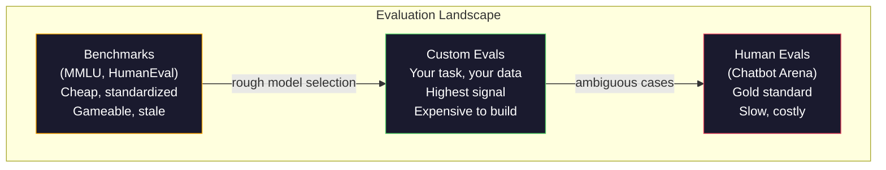
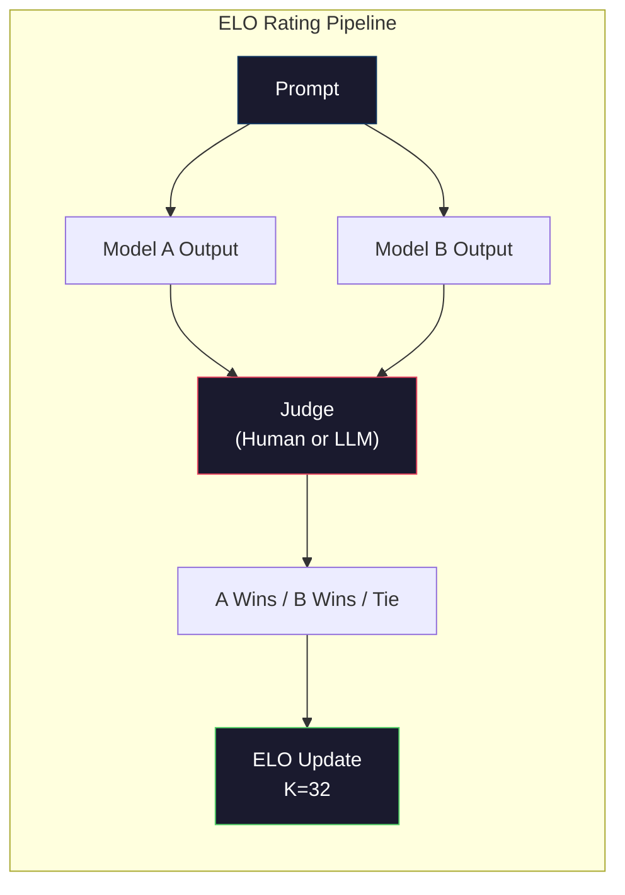

# 평가: 벤치마크, 평가, LM Harness (Evaluation: Benchmarks, Evals, LM Harness)

> 굿하트의 법칙(Goodhart's Law): 어떤 측정값이 목표가 되면, 그것은 더 이상 좋은 측정값이 아니게 된다. 모든 프런티어 랩(frontier lab)은 벤치마크(benchmark)를 농간한다. MMLU 점수는 올라가지만 모델은 여전히 "strawberry"에 들어 있는 R의 개수를 안정적으로 세지 못한다. 유일하게 중요한 평가는 당신의 평가다 — 당신의 작업에서, 당신의 데이터로.

**Type:** Build
**Languages:** Python
**Prerequisites:** Phase 10, Lessons 01-05 (LLMs from Scratch)
**Time:** ~90분

## 학습 목표 (Learning Objectives)

- 언어 모델에 대해 객관식과 개방형 벤치마크를 돌리는 커스텀 평가 하니스(evaluation harness)를 만들기
- 표준 벤치마크(MMLU, HumanEval)가 왜 포화(saturate)하고 프런티어 모델을 변별하지 못하는지 설명하기
- 적절한 지표(exact match, F1, BLEU, LLM-as-judge 채점)로 작업별 평가를 구현하기
- 공개 리더보드(leaderboard)에만 의존하지 않고 당신의 구체적인 사용 사례를 겨냥한 커스텀 평가 스위트(evaluation suite)를 설계하기

## 문제 (The Problem)

MMLU는 2020년에 57개 과목에 걸친 15,908개의 문제로 발표되었다. 3년 안에 프런티어 모델은 이를 포화시켰다. GPT-4는 86.4%를 기록했다. Claude 3 Opus는 86.8%를 기록했다. Llama 3 405B는 88.6%를 기록했다. 리더보드는 3점 범위로 압축되었고, 그 차이는 실제 능력 격차가 아니라 통계적 노이즈(noise)다.

한편, 그 같은 모델들은 10살짜리 아이가 생각 없이 처리하는 작업에서 실패한다. MMLU에서 88.7%를 기록한 Claude 3.5 Sonnet은 처음에 "strawberry"의 글자를 세지 못했다 — 이는 세계 지식도 추론도 전혀 필요 없고, 그저 문자 수준의 반복(iteration)만 필요한 작업이다. HumanEval은 164개의 문제로 코드 생성을 테스트한다. 모델은 여기서 90% 이상을 기록하면서도, 신입 개발자라면 누구나 잡아낼 엣지 케이스(edge case)에서 충돌하는 코드를 여전히 만들어 낸다.

벤치마크 성능과 실세계 신뢰성 사이의 간극이 LLM 평가의 핵심 문제다. 벤치마크는 모델이 그 벤치마크에서 어떻게 수행하는지를 알려 준다. 그 모델이 당신의 구체적인 작업에서, 당신의 구체적인 데이터로, 당신의 구체적인 실패 모드(failure mode) 아래에서 어떻게 수행할지에 대해서는 거의 아무것도 알려 주지 않는다. 고객 지원 봇을 만든다면 MMLU는 무관하다. 코드 어시스턴트를 만든다면 HumanEval은 함수 수준 생성만 다룬다 — 디버깅, 리팩터링, 파일 전반에 걸친 코드 설명에 대해서는 아무 말도 하지 않는다.

당신에게는 커스텀 평가가 필요하다. 벤치마크가 쓸모없어서가 아니라(대략적인 모델 선택에는 유용하다), 최종 평가는 당신의 배포(deployment) 조건과 정확히 일치해야 하기 때문이다.

## 개념 (The Concept)

### 평가 지형 (The Eval Landscape)

평가에는 세 가지 범주가 있으며, 각각 비용과 신호 품질이 다르다.

**벤치마크(Benchmarks)** 는 표준화된 테스트 스위트다. MMLU, HumanEval, SWE-bench, MATH, ARC, HellaSwag. 모델을 벤치마크에 돌려 점수를 얻는다. 장점: 모두가 같은 테스트를 쓰므로 모델을 비교할 수 있다. 단점: 모델과 학습 데이터가 이 벤치마크를 점점 오염(contaminate)시킨다. 랩들은 벤치마크 문제를 포함하는 데이터로 학습한다. 점수는 올라간다. 능력은 그렇지 않을 수 있다.

**커스텀 평가(Custom evals)** 는 당신의 구체적인 사용 사례를 위해 만드는 테스트 스위트다. 입력, 기대 출력, 채점 함수를 당신이 정의한다. 법률 문서 요약기는 법률 문서로 평가된다. SQL 생성기는 당신의 데이터베이스 스키마로 평가된다. 이것들은 만들기 비싸지만 프로덕션(production) 성능을 예측하는 유일한 평가다.

**사람 평가(Human evals)** 는 유급 어노테이터(annotator)를 써서 모델 출력을 유용성, 정확성, 유창성, 안전성 같은 기준으로 판단한다. 자동 채점이 실패하는 개방형 작업의 황금 표준(gold standard)이다. Chatbot Arena는 100개 이상의 모델에 걸쳐 200만 표 이상의 사람 선호 투표를 모았다. 단점: 비용(판단당 $0.10-$2.00)과 속도(수 시간에서 수일).



### 벤치마크가 망가지는 이유 (Why Benchmarks Break)

벤치마크 점수가 실제 능력을 반영하기를 멈추게 하는 세 가지 메커니즘이 있다.

**데이터 오염(Data contamination).** 학습 코퍼스(corpus)는 인터넷을 스크래핑(scrape)한다. 벤치마크 문제는 인터넷에 존재한다. 모델은 학습 중에 답을 본다. 이는 전통적 의미의 부정행위가 아니다 — 랩들이 의도적으로 벤치마크 데이터를 포함하지는 않는다. 그러나 웹 규모의 스크래핑은 이를 배제하기를 거의 불가능하게 만든다.

**시험에 맞춰 가르치기(Teaching to the test).** 랩들은 벤치마크 성능을 위해 학습 혼합(training mixture)을 최적화한다. 학습 혼합의 5%가 MMLU 스타일 객관식이라면, 모델은 형식과 답 분포(answer distribution)를 학습한다. MMLU는 4지선다 객관식이다. 모델은 답 분포가 A/B/C/D에 걸쳐 대략 균등(uniform)하다는 것을 학습하며, 이는 모델이 답을 모를 때조차 도움이 된다.

**포화(Saturation).** 모든 프런티어 모델이 벤치마크에서 85-90%를 기록하면, 벤치마크는 변별을 멈춘다. 남은 10-15%의 문제는 모호하거나, 잘못 레이블링되었거나, 난해한 도메인 지식을 요구할 수 있다. MMLU에서 87%에서 89%로 개선되는 것은 모델이 더 똑똑해진 것이 아니라 난해한 문제 두 개를 더 암기했다는 뜻일 수 있다.

### 퍼플렉시티: 빠른 건강 점검 (Perplexity: A Quick Health Check)

퍼플렉시티(perplexity)는 모델이 토큰(token) 시퀀스에 얼마나 놀라는지를 측정한다. 형식적으로, 이는 지수화된 평균 음의 로그 우도(exponentiated average negative log-likelihood)다.

```
PPL = exp(-1/N * sum(log P(token_i | context)))
```

퍼플렉시티 10은 모델이 평균적으로 각 토큰 위치에서 10개의 선택지 중 균등하게 고르는 것만큼 불확실하다는 뜻이다. 낮을수록 좋다. GPT-2는 WikiText-103에서 약 30의 퍼플렉시티를 얻는다. GPT-3은 약 20을 얻는다. Llama 3 8B는 약 7을 얻는다.

퍼플렉시티는 같은 테스트 세트에서 모델을 비교하는 데 유용하지만, 맹점이 있다. 모델은 흔한 패턴을 잘 예측하면서도 드물지만 중요한 패턴에는 형편없음으로써 낮은 퍼플렉시티를 가질 수 있다. 또한 지시 따르기, 추론, 사실 정확성에 대해서는 아무 말도 하지 않는다. 최종 판정이 아니라 온전성 점검(sanity check)으로 사용하라.

### LLM-as-Judge

강한 모델을 사용해 약한 모델의 출력을 평가한다. 아이디어는 단순하다. GPT-4o나 Claude Sonnet에게 정확성, 유용성, 안전성에 대해 응답을 1-5 척도로 평가하게 한다. 이는 GPT-4o-mini로 판단당 약 $0.01의 비용이 들고, 사람 판단과 놀랍도록 잘 상관한다 — 대부분의 작업에서 약 80% 일치.

채점 프롬프트(prompt)가 모델보다 더 중요하다. 모호한 프롬프트("이 응답을 평가하라")는 노이즈가 많은 점수를 만든다. 채점 기준(rubric)이 있는 구조화된 프롬프트("답이 사실적으로 정확하고 출처를 인용하면 5점, 정확하지만 출처가 없으면 4점, 부분적으로 정확하면 3점...")는 일관되고 재현 가능한 점수를 만든다.

실패 모드: 판단 모델은 위치 편향(position bias, 쌍별 비교에서 첫 번째 응답을 선호), 장황함 편향(verbosity bias, 더 긴 응답을 선호), 자기 선호(self-preference, GPT-4가 동등한 Claude 출력보다 GPT-4 출력을 더 높게 평가)를 보인다. 완화책: 순서를 무작위화하고, 길이로 정규화(normalize)하고, 평가 대상 모델과 다른 판단자를 사용하라.

### 쌍별 비교로부터의 ELO 레이팅 (ELO Ratings from Pairwise Comparisons)

Chatbot Arena의 접근법이다. 서로 다른 모델이 같은 프롬프트에 대해 낸 두 응답을 보여 준다. 사람(또는 LLM 판단자)이 더 나은 것을 고른다. 수천 번의 이런 비교로부터, 각 모델의 ELO 레이팅(rating)을 계산한다 — 체스에서 쓰는 것과 같은 시스템이다.

ELO의 장점: 상대 순위가 절대 채점보다 더 신뢰할 만하고, 무승부를 우아하게 처리하며, 모든 출력을 독립적으로 채점하는 것보다 적은 비교로 수렴(converge)한다. 2026년 초 기준, Chatbot Arena 순위는 GPT-4o, Claude 3.5 Sonnet, Gemini 1.5 Pro가 상위권에서 서로 20 ELO 점 이내에 있음을 보여 준다.



### 평가 프레임워크 (Eval Frameworks)

**lm-evaluation-harness** (EleutherAI): 표준 오픈소스 평가 프레임워크. 200개 이상의 벤치마크를 지원한다. 아무 Hugging Face 모델이나 MMLU, HellaSwag, ARC 등에 한 명령으로 돌린다. Open LLM Leaderboard가 사용한다.

**RAGAS**: RAG 파이프라인(pipeline) 전용 평가 프레임워크. 충실성(faithfulness, 답이 검색된 컨텍스트와 일치하는가?), 관련성(relevance, 검색된 컨텍스트가 질문과 관련 있는가?), 답 정확성을 측정한다.

**promptfoo**: 프롬프트 엔지니어링(prompt engineering)을 위한 설정 주도(config-driven) 평가. YAML로 테스트 케이스를 정의하고, 여러 모델에 돌려, 통과/실패 보고서를 얻는다. 프롬프트 회귀 테스트(regression testing)에 유용하다 — 프롬프트 변경이 기존 테스트 케이스를 깨뜨리지 않는지 확인한다.

### 커스텀 평가 만들기 (Building Custom Evals)

프로덕션에 중요한 유일한 평가다. 절차는 다음과 같다.

1. **작업을 정의한다.** 모델이 정확히 무엇을 해야 하는가? 정밀하게 하라. "질문에 답하라"는 너무 모호하다. "고객 불만 이메일이 주어지면, 제품명, 이슈 범주, 감성(sentiment)을 추출하라"는 평가할 수 있는 작업이다.

2. **테스트 케이스를 만든다.** 프로토타입 평가에는 최소 50개, 프로덕션에는 200개 이상. 각 테스트 케이스는 (input, expected_output) 쌍이다. 엣지 케이스를 포함하라: 빈 입력, 적대적(adversarial) 입력, 모호한 입력, 다른 언어의 입력.

3. **채점을 정의한다.** 구조화된 출력에는 exact match. 텍스트 유사성에는 BLEU/ROUGE. 개방형 품질에는 LLM-as-judge. 추출 작업에는 F1. 여러 지표를 가중치로 결합하라.

4. **자동화한다.** 모든 평가가 한 명령으로 돌아간다. 수동 단계 없음. 시간에 걸친 비교를 가능하게 하는 형식으로 결과를 저장한다.

5. **시간에 걸쳐 추적한다.** 평가 점수는 단독으로는 무의미하다. 추세선(trendline)이 필요하다. 마지막 프롬프트 변경 후 점수가 개선되었는가? 모델 전환 후 퇴보했는가? 평가를 프롬프트와 함께 버전 관리하라.

| 평가 유형 | 판단당 비용 | 사람과의 일치도 | 적합한 용도 |
|-----------|------------------|----------------------|----------|
| Exact match | ~$0 | 100%(적용 가능할 때) | 구조화된 출력, 분류 |
| BLEU/ROUGE | ~$0 | ~60% | 번역, 요약 |
| LLM-as-judge | ~$0.01 | ~80% | 개방형 생성 |
| 사람 평가 | $0.10-$2.00 | 해당 없음(이것이 정답) | 모호하고 고위험인 작업 |

## 직접 만들기 (Build It)

### 1단계: 최소한의 평가 프레임워크

핵심 추상화를 정의한다. 평가 케이스는 입력, 기대 출력, 선택적 메타데이터 딕셔너리를 갖는다. 채점기는 예측과 참조를 받아 0과 1 사이의 점수를 반환한다.

```python
import json
from collections import Counter

class EvalCase:
    def __init__(self, input_text, expected, metadata=None):
        self.input_text = input_text
        self.expected = expected
        self.metadata = metadata or {}

class EvalSuite:
    def __init__(self, name, cases, scorers):
        self.name = name
        self.cases = cases
        self.scorers = scorers

    def run(self, model_fn):
        results = []
        for case in self.cases:
            prediction = model_fn(case.input_text)
            scores = {}
            for scorer_name, scorer_fn in self.scorers.items():
                scores[scorer_name] = scorer_fn(prediction, case.expected)
            results.append({
                "input": case.input_text,
                "expected": case.expected,
                "prediction": prediction,
                "scores": scores,
            })
        return results
```

### 2단계: 채점 함수

exact match, 토큰 F1, 시뮬레이션된 LLM-as-judge 채점기를 만든다.

```python
def exact_match(prediction, expected):
    return 1.0 if prediction.strip().lower() == expected.strip().lower() else 0.0

def token_f1(prediction, expected):
    pred_tokens = set(prediction.lower().split())
    exp_tokens = set(expected.lower().split())
    if not pred_tokens or not exp_tokens:
        return 0.0
    common = pred_tokens & exp_tokens
    precision = len(common) / len(pred_tokens)
    recall = len(common) / len(exp_tokens)
    if precision + recall == 0:
        return 0.0
    return 2 * (precision * recall) / (precision + recall)

def llm_judge_simulated(prediction, expected):
    pred_words = set(prediction.lower().split())
    exp_words = set(expected.lower().split())
    if not exp_words:
        return 0.0
    overlap = len(pred_words & exp_words) / len(exp_words)
    length_penalty = min(1.0, len(prediction) / max(len(expected), 1))
    return round(overlap * 0.7 + length_penalty * 0.3, 3)
```

### 3단계: ELO 레이팅 시스템

ELO 업데이트로 쌍별 비교를 구현한다. 이는 정확히 Chatbot Arena가 모델 순위를 매기는 데 쓰는 시스템이다.

```python
class ELOTracker:
    def __init__(self, k=32, initial_rating=1500):
        self.ratings = {}
        self.k = k
        self.initial_rating = initial_rating
        self.history = []

    def _ensure_player(self, name):
        if name not in self.ratings:
            self.ratings[name] = self.initial_rating

    def expected_score(self, rating_a, rating_b):
        return 1 / (1 + 10 ** ((rating_b - rating_a) / 400))

    def record_match(self, player_a, player_b, outcome):
        self._ensure_player(player_a)
        self._ensure_player(player_b)

        ea = self.expected_score(self.ratings[player_a], self.ratings[player_b])
        eb = 1 - ea

        if outcome == "a":
            sa, sb = 1.0, 0.0
        elif outcome == "b":
            sa, sb = 0.0, 1.0
        else:
            sa, sb = 0.5, 0.5

        self.ratings[player_a] += self.k * (sa - ea)
        self.ratings[player_b] += self.k * (sb - eb)

        self.history.append({
            "a": player_a, "b": player_b,
            "outcome": outcome,
            "rating_a": round(self.ratings[player_a], 1),
            "rating_b": round(self.ratings[player_b], 1),
        })

    def leaderboard(self):
        return sorted(self.ratings.items(), key=lambda x: -x[1])
```

### 4단계: 퍼플렉시티 계산

토큰 확률을 사용해 퍼플렉시티를 계산한다. 실제로는 이것을 모델의 로짓(logit)에서 얻는다. 여기서는 확률 분포로 시뮬레이션한다.

```python
import numpy as np

def perplexity(log_probs):
    if not log_probs:
        return float("inf")
    avg_neg_log_prob = -np.mean(log_probs)
    return float(np.exp(avg_neg_log_prob))

def token_log_probs_simulated(text, model_quality=0.8):
    np.random.seed(hash(text) % 2**31)
    tokens = text.split()
    log_probs = []
    for i, token in enumerate(tokens):
        base_prob = model_quality
        if len(token) > 8:
            base_prob *= 0.6
        if i == 0:
            base_prob *= 0.7
        prob = np.clip(base_prob + np.random.normal(0, 0.1), 0.01, 0.99)
        log_probs.append(float(np.log(prob)))
    return log_probs
```

### 5단계: 결과 집계

평가 실행 전반에 걸친 요약 통계를 계산한다: 평균, 중앙값, 임곗값에서의 통과율, 지표별 분해.

```python
def summarize_results(results, threshold=0.8):
    all_scores = {}
    for r in results:
        for metric, score in r["scores"].items():
            all_scores.setdefault(metric, []).append(score)

    summary = {}
    for metric, scores in all_scores.items():
        arr = np.array(scores)
        summary[metric] = {
            "mean": round(float(np.mean(arr)), 3),
            "median": round(float(np.median(arr)), 3),
            "std": round(float(np.std(arr)), 3),
            "min": round(float(np.min(arr)), 3),
            "max": round(float(np.max(arr)), 3),
            "pass_rate": round(float(np.mean(arr >= threshold)), 3),
            "n": len(scores),
        }
    return summary

def print_summary(summary, suite_name="Eval"):
    print(f"\n{'=' * 60}")
    print(f"  {suite_name} Summary")
    print(f"{'=' * 60}")
    for metric, stats in summary.items():
        print(f"\n  {metric}:")
        print(f"    Mean:      {stats['mean']:.3f}")
        print(f"    Median:    {stats['median']:.3f}")
        print(f"    Std:       {stats['std']:.3f}")
        print(f"    Range:     [{stats['min']:.3f}, {stats['max']:.3f}]")
        print(f"    Pass rate: {stats['pass_rate']:.1%} (threshold >= 0.8)")
        print(f"    N:         {stats['n']}")
```

### 6단계: 전체 파이프라인 실행

모든 것을 연결한다. 작업을 정의하고, 테스트 케이스를 만들고, 두 모델을 시뮬레이션하고, 평가를 돌리고, 쌍별 비교로부터 ELO를 계산하고, 리더보드를 출력한다.

```python
def demo_model_good(prompt):
    responses = {
        "What is the capital of France?": "Paris",
        "What is 2 + 2?": "4",
        "Who wrote Hamlet?": "William Shakespeare",
        "What language is PyTorch written in?": "Python and C++",
        "What is the boiling point of water?": "100 degrees Celsius",
    }
    return responses.get(prompt, "I don't know")

def demo_model_bad(prompt):
    responses = {
        "What is the capital of France?": "Paris is the capital city of France",
        "What is 2 + 2?": "The answer is four",
        "Who wrote Hamlet?": "Shakespeare",
        "What language is PyTorch written in?": "Python",
        "What is the boiling point of water?": "212 Fahrenheit",
    }
    return responses.get(prompt, "Unknown")

cases = [
    EvalCase("What is the capital of France?", "Paris"),
    EvalCase("What is 2 + 2?", "4"),
    EvalCase("Who wrote Hamlet?", "William Shakespeare"),
    EvalCase("What language is PyTorch written in?", "Python and C++"),
    EvalCase("What is the boiling point of water?", "100 degrees Celsius"),
]

suite = EvalSuite(
    name="General Knowledge",
    cases=cases,
    scorers={
        "exact_match": exact_match,
        "token_f1": token_f1,
        "llm_judge": llm_judge_simulated,
    },
)

results_good = suite.run(demo_model_good)
results_bad = suite.run(demo_model_bad)

print_summary(summarize_results(results_good), "Model A (concise)")
print_summary(summarize_results(results_bad), "Model B (verbose)")
```

"좋은" 모델은 정확한 답을 준다. "나쁜" 모델은 장황한 의역(paraphrase)을 준다. Exact match는 장황한 모델을 가혹하게 처벌한다. 토큰 F1과 LLM-as-judge는 더 관대하다. 이는 지표 선택이 왜 중요한지를 보여 준다. 같은 모델이 어떻게 채점하느냐에 따라 훌륭해 보이기도 하고 형편없어 보이기도 한다.

### 7단계: ELO 토너먼트

여러 라운드에 걸쳐 모델 간 쌍별 비교를 돌린다.

```python
elo = ELOTracker(k=32)

for case in cases:
    pred_a = demo_model_good(case.input_text)
    pred_b = demo_model_bad(case.input_text)

    score_a = token_f1(pred_a, case.expected)
    score_b = token_f1(pred_b, case.expected)

    if score_a > score_b:
        outcome = "a"
    elif score_b > score_a:
        outcome = "b"
    else:
        outcome = "tie"

    elo.record_match("model_a_concise", "model_b_verbose", outcome)

print("\nELO Leaderboard:")
for name, rating in elo.leaderboard():
    print(f"  {name}: {rating:.0f}")
```

### 8단계: 퍼플렉시티 비교

서로 다른 품질 수준의 "모델" 전반에 걸쳐 퍼플렉시티를 비교한다.

```python
test_text = "The quick brown fox jumps over the lazy dog in the garden"

for quality, label in [(0.9, "Strong model"), (0.7, "Medium model"), (0.4, "Weak model")]:
    log_probs = token_log_probs_simulated(test_text, model_quality=quality)
    ppl = perplexity(log_probs)
    print(f"  {label} (quality={quality}): perplexity = {ppl:.2f}")
```

## 라이브러리로 써보기 (Use It)

### lm-evaluation-harness (EleutherAI)

아무 모델에서나 벤치마크를 돌리는 표준 도구다.

```python
# pip install lm-eval
# Command line:
# lm_eval --model hf --model_args pretrained=meta-llama/Llama-3.1-8B --tasks mmlu --batch_size 8

# Python API:
# import lm_eval
# results = lm_eval.simple_evaluate(
#     model="hf",
#     model_args="pretrained=meta-llama/Llama-3.1-8B",
#     tasks=["mmlu", "hellaswag", "arc_easy"],
#     batch_size=8,
# )
# print(results["results"])
```

### promptfoo

프롬프트 엔지니어링을 위한 설정 주도 평가. YAML로 테스트를 정의하고 여러 제공자(provider)에 돌린다.

```yaml
# promptfoo.yaml
providers:
  - openai:gpt-4o-mini
  - anthropic:claude-3-haiku

prompts:
  - "Answer in one word: {{question}}"

tests:
  - vars:
      question: "What is the capital of France?"
    assert:
      - type: contains
        value: "Paris"
  - vars:
      question: "What is 2 + 2?"
    assert:
      - type: equals
        value: "4"
```

### RAG 평가를 위한 RAGAS

```python
# pip install ragas
# from ragas import evaluate
# from ragas.metrics import faithfulness, answer_relevancy, context_precision
#
# result = evaluate(
#     dataset,
#     metrics=[faithfulness, answer_relevancy, context_precision],
# )
# print(result)
```

RAGAS는 일반 평가가 놓치는 것을 측정한다. 답이 추상적으로 "정확"한지가 아니라, 모델의 답이 검색된 컨텍스트에 근거(grounded)하는지를 측정한다.

## 산출물 (Ship It)

이 레슨은 `outputs/prompt-eval-designer.md`를 만든다 — 어떤 작업에 대해서든 커스텀 평가 스위트를 설계하는 재사용 가능한 프롬프트다. 작업 설명을 주면 테스트 케이스, 채점 함수, 통과/실패 임곗값 권장안을 생성한다.

또한 `outputs/skill-llm-evaluation.md`를 만든다 — 작업 유형, 예산, 지연 시간(latency) 요구사항에 따라 올바른 평가 전략을 고르는 의사 결정 프레임워크다.

## 연습 문제 (Exercises)

1. 같은 입력을 모델에 5번 돌려 출력이 얼마나 자주 일치하는지 측정하는 "일관성(consistency)" 채점기를 추가하라. 결정론적 입력에 대한 비일관적 답은 취약한 프롬프트나 높은 temperature 설정을 드러낸다.

2. ELO 트래커를 확장해 여러 판단 함수(exact match, F1, LLM-as-judge)를 지원하고 가중치를 두라. exact match를 크게 가중할 때와 F1을 크게 가중할 때 리더보드가 어떻게 바뀌는지 비교하라.

3. 특정 작업을 위한 평가 스위트를 만들어라: 이메일을 5개 범주로 분류하기. 엣지 케이스(여러 범주에 속할 수 있는 이메일, 빈 이메일, 다른 언어의 이메일)를 포함한 다양한 예제로 100개의 테스트 케이스를 만들어라. 서로 다른 "모델"(규칙 기반, 키워드 매칭, 시뮬레이션된 LLM)이 어떻게 수행하는지 측정하라.

4. 오염 탐지를 구현하라: 평가 문제 집합과 학습 코퍼스가 주어지면, 평가 문제(또는 유사한 의역)의 몇 퍼센트가 학습 데이터에 나타나는지 확인하라. 이것이 연구자들이 벤치마크 타당성을 감사하는 방법이다.

5. "모델 diff" 도구를 만들어라. 두 모델 버전의 평가 결과가 주어지면, 어떤 구체적인 테스트 케이스가 개선되었는지, 퇴보했는지, 그대로인지를 강조하라. 이는 코드 diff의 평가 버전이다 — 변경이 도움이 되었는지 해가 되었는지 이해하는 데 필수적이다.

## 핵심 용어 (Key Terms)

| 용어 | 사람들이 말하는 것 | 실제 의미 |
|------|----------------|----------------------|
| MMLU | "그 벤치마크" | Massive Multitask Language Understanding — 57개 과목에 걸친 15,908개의 객관식 문제, 2025년까지 88% 위로 포화됨 |
| HumanEval | "코드 평가" | OpenAI의 164개 Python 함수 완성 문제, 고립된 함수 생성만 테스트함 |
| SWE-bench | "진짜 코딩 평가" | 12개 Python 저장소의 2,294개 GitHub 이슈, 테스트 생성을 포함한 엔드투엔드 버그 수정을 측정함 |
| 퍼플렉시티(Perplexity) | "모델이 얼마나 혼란스러운지" | exp(-avg(log P(token_i given context))) — 낮을수록 모델이 실제 토큰에 더 높은 확률을 할당함 |
| ELO 레이팅(ELO rating) | "모델용 체스 랭킹" | 쌍별 승/패 기록으로부터 계산된 상대 실력 레이팅, Chatbot Arena가 100개 이상의 모델 순위를 매기는 데 사용함 |
| LLM-as-judge | "AI로 AI 채점하기" | 강한 모델이 채점 기준에 비추어 약한 모델의 출력을 채점함, 판단당 약 $0.01에 사람 판단자와 약 80% 일치 |
| 데이터 오염(Data contamination) | "모델이 시험을 봤다" | 학습 데이터가 벤치마크 문제를 포함해, 실제 능력 향상 없이 점수를 부풀림 |
| 평가 스위트(Eval suite) | "테스트 묶음" | 특정 능력을 측정하는 (input, expected_output, scorer) 트리플의 버전 관리된 모음 |
| 통과율(Pass rate) | "몇 퍼센트를 맞히는지" | 임곗값 위로 채점된 평가 케이스의 비율 — 신뢰성을 측정하므로 평균 점수보다 더 실행 가능함 |
| Chatbot Arena | "모델 랭킹 웹사이트" | 200만 표 이상의 사람 선호 투표를 가진 LMSYS 플랫폼, ELO 레이팅을 통해 가장 신뢰받는 LLM 리더보드를 생성함 |

## 더 읽을거리 (Further Reading)

- [Hendrycks et al., 2021 -- "Measuring Massive Multitask Language Understanding"](https://arxiv.org/abs/2009.03300) -- MMLU 논문, 포화에도 불구하고 여전히 가장 많이 인용되는 LLM 벤치마크
- [Chen et al., 2021 -- "Evaluating Large Language Models Trained on Code"](https://arxiv.org/abs/2107.03374) -- OpenAI의 HumanEval 논문, 코드 생성 평가 방법론을 확립함
- [Zheng et al., 2023 -- "Judging LLM-as-a-Judge"](https://arxiv.org/abs/2306.05685) -- 위치 편향과 장황함 편향 발견을 포함한, LLM으로 LLM을 평가하는 것에 대한 체계적 분석
- [LMSYS Chatbot Arena](https://chat.lmsys.org/) -- 200만 표 이상을 가진 크라우드소싱 모델 비교 플랫폼, 가장 신뢰받는 실세계 LLM 랭킹
