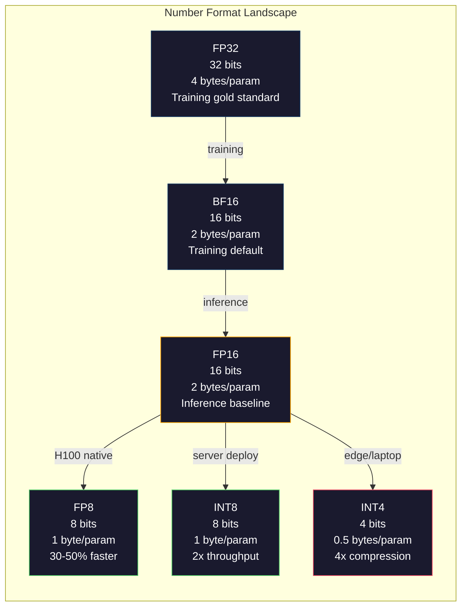
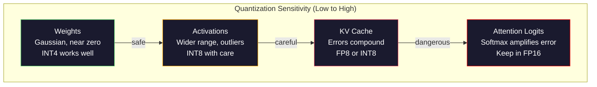
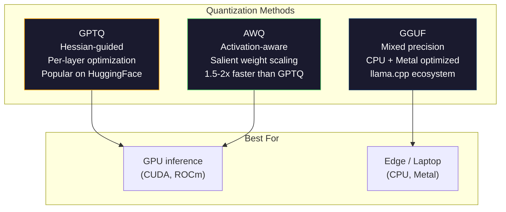

# 양자화: 모델을 맞춰 넣기 (Quantization: Making Models Fit)

> FP16의 70B 모델은 140GB가 필요하다. 가중치만으로 A100 두 장. FP8로 양자화하면: 80GB GPU 한 장. INT4: MacBook.

**Type:** Build
**Languages:** Python (with numpy)
**Prerequisites:** Phase 10, Lessons 01-10 (LLMs from Scratch)
**Time:** ~120분

## 학습 목표 (Learning Objectives)

- per-tensor 및 per-channel 스케일링을 포함해, FP16에서 INT8과 INT4로의 대칭(symmetric) 및 비대칭(asymmetric) 양자화(quantization)를 구현하기
- 양자화로 인한 메모리 절약을 계산하고, 주어진 GPU의 VRAM에 어떤 정밀도(precision)가 맞는지 판단하기
- 사후 학습 양자화(post-training quantization, PTQ)와 양자화 인식 학습(quantization-aware training, QAT)의 차이를 설명하기
- GPTQ나 AWQ를 적용해 실제 모델을 양자화하고, 벤치마크(benchmark)에서 정확도-메모리 트레이드오프(trade-off)를 측정하기

## 문제 (The Problem)

Llama 3 70B에는 700억 개의 파라미터(parameter)가 있다. 각 파라미터는 16비트 부동소수점 수다. 모두 합치면 1,400억 바이트, 곧 140GB다. 단일 A100의 VRAM은 80GB다. 단일 GPU에서는 추론(inference)은커녕 가중치(weight)조차 적재할 수 없다. 모델 하나를 서빙(serve)하려면 시간당 각 $2짜리 A100 두 장이 필요하다.

그러나 파라미터당 16비트는 낭비다. 신경망(neural network)의 대부분 가중치는 0 근처에 모여 있다. FP16의 전체 동적 범위(dynamic range, 0.000000059에서 65,504까지)는 거의 전혀 쓰이지 않는다. Llama 3 70B 가중치의 실제 분포를 측정해 보면 95%가 -0.1과 +0.1 사이에 들어간다. 4비트면 충분히 담을 값을 표현하는 데 16비트를 태우는 셈이다.

양자화는 고정밀 수를 저정밀 수로 대체한다. FP16에서 FP8로 가면 메모리가 절반이 된다. FP16에서 INT4로 가면 4분의 1이 된다. 그 140GB 모델은 35GB가 된다. 단일 소비자용 GPU에 맞는다. 2비트 양자화까지 밀어붙이면(공격적이고, 손실이 크지만, 일부 작업에는 쓸 만하다) 같은 모델이 16GB 노트북에서 돌아간다.

비용은 정확도다. 제거하는 모든 비트는 정보를 파괴한다. 문제는 정확도를 얼마나, 어디서 잃느냐다. 잘 양자화된 INT4 모델은 대부분의 벤치마크에서 원본 품질의 95-99%를 유지한다. INT4로의 순진한 양자화는 모델을 통째로 망가뜨릴 수 있다. 차이는 기법이다.

GPTQ로 Llama 3를 INT4로 양자화한 커뮤니티 버전은 WikiText에서 약 1-2 퍼플렉시티(perplexity) 포인트의 손실을 보인다. Mistral은 MMLU에서 측정 가능한 품질 손실이 전혀 없는 Mixtral 8x22B의 FP8 체크포인트(checkpoint)를 공개했다. GGUF 형식은 llama.cpp를 구동하며, M 시리즈 칩이 달린 MacBook에서 70B 모델을 돌린다. 양자화는 꼼수가 아니다. 7B보다 큰 모든 모델의 표준 배포 경로다.

## 개념 (The Concept)

### 수 형식: 각 비트가 하는 일 (Number Formats: What Each Bit Does)

모든 부동소수점 수는 세 부분으로 이루어진다. 부호(sign), 지수(exponent), 가수(mantissa, significand라고도 함). 부호는 1비트다. 지수는 범위(수가 얼마나 크거나 작을 수 있는지)를 결정한다. 가수는 정밀도(소수 자릿수를 몇 개 얻는지)를 결정한다.

```
FP32:  [1 sign] [8 exponent] [23 mantissa]  = 32 bits
FP16:  [1 sign] [5 exponent] [10 mantissa]  = 16 bits
BF16:  [1 sign] [8 exponent] [7  mantissa]  = 16 bits
FP8:   [1 sign] [4 exponent] [3  mantissa]  = 8  bits (E4M3)
FP8:   [1 sign] [5 exponent] [2  mantissa]  = 8  bits (E5M2)
INT8:  [1 sign] [7 value]                   = 8  bits (uniform steps)
INT4:  [1 sign] [3 value]                   = 4  bits (16 levels total)
```

**FP32** 는 완전 정밀도다. 23개의 가수 비트는 약 7개의 십진 자릿수 정밀도를 준다. 범위: 대략 1.2 x 10^-38에서 3.4 x 10^38. 학습(training)은 예전에 오로지 FP32에서만 이루어졌다. 지금도 누적(accumulation, 행렬 곱셈 중의 누적 합)에는 여전히 그렇다.

**FP16** 은 비트를 절반으로 줄인다. 10개의 가수 비트는 약 3.3개의 십진 자릿수를 준다. 지수는 5비트로 줄어 범위를 극적으로 축소한다(최댓값 ~65,504). 이는 가중치(0 근처에 모임)에는 괜찮지만, 학습 중 급등할 수 있는 활성값(activation)과 그래디언트(gradient)에는 위험하다. FP16 학습은 언더플로(underflow)를 방지하기 위해 손실 스케일링(loss scaling)을 필요로 한다.

**BF16** (Brain Float 16)은 FP32의 8비트 지수를 유지하되 가수를 7비트로 줄인다. FP32와 같은 범위, FP16보다 낮은 정밀도. Google이 딥러닝(deep learning)을 위해 특별히 설계했다. 직관: 신경망에는 정밀도보다 범위가 더 중요하다. FP16에서 0으로 언더플로하는 10^-20의 그래디언트가 BF16에서는 살아남는다. BF16에서 0.0734로 반올림되는 0.07342의 가중치는 충분히 가깝다. 모든 현대적 학습 실행은 BF16이나 BF16/FP32 혼합을 사용한다.

**FP8** 은 두 가지 종류로 나온다. E4M3(지수 4, 가수 3)은 추론 중 가중치와 활성값에 사용된다. E5M2(지수 5, 가수 2)는 정밀도보다 범위가 더 중요한 학습 중 그래디언트에 사용된다. H100 GPU에서의 FP8 추론은 무시할 만한 품질 손실로 FP16 대비 30-50%의 속도 향상을 달성한다.

**INT8** 은 정수 형식이다. 지수도, 가수도 없다. -128에서 127까지 256개의 균등 간격 값뿐이다. 부동소수점 가중치를 이 범위로 매핑하려면 스케일 팩터(scale factor)가 필요하다. 장점: 정수 산술은 부동소수점보다 더 빠르고 전력 효율이 좋다. A100에서 INT8 행렬 곱셈은 FP16의 312 TFLOPS 대비 624 TOPS로 돌아간다.

**INT4** 는 더 밀어붙인다. 가능한 값이 16개뿐이다. 스케일 팩터가 무거운 일을 한다. 품질은 스케일을 어떻게 고르고 어떤 가중치를 양자화하느냐에 전적으로 달려 있다. 최신(state-of-the-art) INT4 방법(GPTQ, AWQ)은 원본 모델 품질의 95% 이상을 유지한다.



### 양자화는 어떻게 작동하는가 (How Quantization Works)

핵심 연산은 단순하다. 부동소수점 값의 텐서(tensor)를 가져와, 스케일 팩터를 찾고, 곱하고, 가장 가까운 정수로 반올림하고, 정수와 스케일 팩터를 저장한다.

**양자화(Quantize):**
```
scale = max(abs(tensor)) / max_int_value
quantized = round(tensor / scale)
```

**역양자화(Dequantize):**
```
reconstructed = quantized * scale
```

대칭 범위(-127에서 127)의 INT8의 경우:
```
scale = max(abs(tensor)) / 127
quantized = clamp(round(tensor / scale), -128, 127)
```

오차는 반올림 오차다. 각 값은 최대 `scale / 2`만큼 어긋날 수 있다. 한 층(layer)에 걸친 총 오차는 가중치가 몇 개인지, 그리고 모델이 그 가중치의 섭동(perturbation)에 얼마나 민감한지에 달려 있다.

**Per-tensor vs per-channel 양자화.** Per-tensor는 전체 가중치 행렬(matrix)에 하나의 스케일 팩터를 쓴다. 단순하지만 손실이 크다. 한 열은 큰 값을, 다른 열은 작은 값을 가지면, 작은 값들은 정밀도 대부분을 잃는다. Per-channel은 출력 채널당(가중치 행렬의 행 또는 열당) 하나의 스케일 팩터를 쓴다. 오버헤드가 더 크지만(1개 대신 N개의 스케일 팩터를 저장) 품질은 극적으로 더 좋다. 모든 프로덕션 양자화 방법은 per-channel 또는 더 세밀한 입도(granularity)를 쓴다.

**비대칭 양자화(Asymmetric quantization)** 는 영점 오프셋(zero-point offset)을 추가한다. `quantized = round(tensor / scale) + zero_point`. 이는 0을 중심으로 하지 않는 분포를 다룬다. 예를 들어 ReLU 활성값은 항상 음수가 아니다. 대칭 양자화는 결코 나타나지 않는 음수 값에 정수 범위의 절반을 낭비한다. 비대칭 양자화는 실제 범위 [min, max]를 전체 정수 범위로 매핑한다.

### 민감도 위계 (Sensitivity Hierarchy)

모델의 모든 것이 양자화를 똑같이 견디지는 않는다. 명확한 위계가 있다.

**가중치(가장 견고).** 모델 가중치는 학습 중 천천히 변하며 0 근처를 중심으로 대략 가우시안(Gaussian) 분포를 따른다. 잘 양자화된다. per-channel 스케일을 가진 INT8 가중치는 거의 무손실 결과를 낸다. INT4는 더 정교한 방법을 필요로 하지만 작동한다.

**활성값(중간 민감도).** 활성값은 추론 중 신경망을 통해 흐르는 중간값이다. 가중치보다 동적 범위가 넓고 이상치(outlier)를 포함한다. 단일 어텐션 헤드(attention head)는 평균보다 100배 큰 활성값을 만들 수 있다. 이 이상치는 모델 품질에 결정적이다. 순진하게 양자화하면 정보를 파괴한다. 해법: 이상치 채널을 더 높은 정밀도로 유지(LLM.int8())하거나, per-token 또는 per-channel 활성값 스케일을 사용한다.

**KV 캐시(높은 민감도).** 키-값 캐시(key-value cache)는 이전 모든 토큰(token)에 대한 어텐션 상태를 저장한다. 긴 컨텍스트 길이에서 KV 캐시는 메모리를 지배한다. 32K 컨텍스트의 70B 모델의 경우, KV 캐시만으로 FP16에서 40GB다. KV 캐시를 FP8이나 INT8로 양자화하면 막대한 메모리를 절약하지만, 어떤 오차든 미래의 모든 어텐션 계산에 걸쳐 누적된다. 품질 영향은 시퀀스 길이에 비례해 커진다.

**어텐션 로짓(가장 민감).** 어텐션의 소프트맥스(softmax)는 입력의 작은 변화에 매우 민감하다. 소프트맥스 이전 로짓에서 0.01의 양자화 오차가 어텐션 분포를 유의미하게 이동시킬 수 있다. 대부분의 양자화 방식은 다른 모든 것이 양자화되더라도 어텐션 계산을 더 높은 정밀도(FP16 또는 BF16)로 유지한다.



### PTQ vs QAT

**사후 학습 양자화(Post-Training Quantization, PTQ)** 는 이미 학습된 모델을 양자화한다. 재학습 없음. FP16 가중치를 가져와, 스케일 팩터를 계산하고, 반올림하고, 배포한다. 빠르고(분에서 시간) 저렴하다. INT8과 FP8에 잘 작동한다. INT4의 경우, 순진한 PTQ는 반올림 오차가 누적되어 종종 심하게 실패한다. 고급 PTQ 방법(GPTQ, AWQ)은 보정 데이터(calibration data)를 사용해 양자화 오차를 최소화한다.

**양자화 인식 학습(Quantization-Aware Training, QAT)** 은 학습 중 순방향 패스(forward pass)에 가짜 양자화(fake quantization) 연산을 삽입한다. 모델은 반올림 오차가 작은 곳에 가중치를 두도록 학습한다. 그래디언트는 직통 추정기(straight-through estimator, STE)를 사용해 가짜 양자화를 통과한다. 반올림 연산의 그래디언트가 1인 척하는 것이다. QAT는 PTQ보다 더 나은 INT4 및 INT2 모델을 만들지만 완전한 학습 실행을 필요로 한다. Google은 Gemini의 효율적 서빙에 QAT를 사용했다. Meta는 일부 Llama 배포 대상에 QAT를 사용했다.

| 측면 | PTQ | QAT |
|--------|-----|-----|
| 비용 | 분에서 시간 | 완전한 학습 실행 |
| INT8에서의 품질 | 탁월(< 0.1% 손실) | 탁월 |
| INT4에서의 품질 | GPTQ/AWQ로 양호(1-3% 손실) | 더 나음(< 1% 손실) |
| INT2에서의 품질 | 나쁨 | 일부 작업에 쓸 만함 |
| 보정 데이터 | 128-1024개 예제 | 전체 학습 데이터셋 |
| 사용 시점 | 배포, 반복 | 저비트폭에서 최대 품질 |

### GPTQ, AWQ, GGUF

**GPTQ (GPT Quantization)** 는 원샷(one-shot) PTQ 방법이다. 작은 보정 데이터셋(128개 예제가 일반적)을 사용해 헤시안(Hessian, 출력이 각 가중치에 얼마나 민감한지에 대한 2차 정보)을 측정하면서, 가중치를 한 층씩 양자화한다. 헤시안이 중요하다고 말하는 가중치는 더 신중하게 양자화된다. GPTQ는 LLM에 INT4 양자화를 실용적으로 만든 첫 번째 방법이었다. Hugging Face의 TheBloke는 수백 개 모델의 양자화 버전을 공개해 GPTQ를 대중화했다.

**AWQ (Activation-Aware Weight Quantization)** 는 작은 비율의 가중치(약 1%)가 큰 활성값과 곱해지기 때문에 불균형적으로 중요하다는 것을 관찰한다. AWQ는 보정 데이터를 사용해 이 핵심(salient) 가중치를 식별하고 양자화 전에 그들을 키운다(그런 다음 해당 활성값을 줄인다). 이는 중요한 가중치를 INT4 양자화가 정확한 범위에 유지한다. AWQ는 보통 GPTQ 품질에 필적하거나 약간 능가하면서 적용 속도가 1.5-2배 빠르다.

**GGUF (GPT-Generated Unified Format)** 는 llama.cpp와 그 생태계가 사용하는 파일 형식이다. 혼합 양자화(mixed quantization)를 지원한다. 서로 다른 층이 서로 다른 비트폭을 받는다. 첫 번째와 마지막 층(임베딩과 출력 헤드)은 보통 더 높은 정밀도로 유지된다. 중간 층은 INT4나 INT3을 받는다. GGUF 파일은 자기완결적(self-contained)이다. 가중치, 토크나이저(tokenizer), 메타데이터가 모두 한 파일에 있다. 이 형식은 CPU 추론과 Apple Silicon을 위해 설계되었으며, 전체 모델을 메모리에 적재하고 CPU나 Metal GPU에서 행렬 곱셈을 돌리는 것이 표준 경로다. Q4_K_M은 품질과 크기의 균형을 맞춘, 가장 인기 있는 GGUF 양자화 변형이다.



### 품질 측정 (Quality Measurement)

양자화된 모델이 여전히 좋은지 어떻게 아는가?

**퍼플렉시티(Perplexity).** 가장 흔한 지표다. 낮을수록 좋다. 원본과 양자화 모델 모두에 대해 보류된(held-out) 데이터셋(WikiText-2가 표준)에서 퍼플렉시티를 계산한다. 그 차이가 양자화가 얼마나 많은 정보를 파괴했는지 알려 준다. 경험칙: 차이 < 0.5는 탁월, 0.5-1.0은 양호, 1.0-2.0은 대부분의 작업에 허용 가능, > 2.0은 무언가 잘못된 것이다.

**작업별 벤치마크.** 양자화 모델을 MMLU, HumanEval, GSM8K, 또는 직접 만든 커스텀 평가 스위트(eval suite)에 돌린다. 원본과 비교한다. 양자화는 서로 다른 능력에 고르지 않게 영향을 준다. 수학과 코드 작업은 일반 지식보다 정밀도 손실에 더 민감하다.

**출력 비교.** 같은 프롬프트에 대해 두 모델에서 응답을 생성하고 비교한다. LLM-as-judge(Lesson 10)가 여기서 잘 작동한다. 승률(win rate)을 계산한다. 양자화 모델이 원본과 같거나 능가하는 프롬프트의 비율은 얼마인가?

**지연 시간과 처리량.** 양자화는 모델을 더 빠르고 저렴하게 만들기 위해 존재한다. 초당 토큰(tokens per second), 첫 토큰까지의 시간(time to first token), 메모리 사용량을 측정한다. 원본보다 느린 양자화 모델은 쓸모없는 것보다 더 나쁘다.

| 모델 | 형식 | 크기 | 퍼플렉시티 (WikiText-2) | MMLU | 초당 토큰 (A100) |
|-------|--------|------|------------------------|------|-------------------|
| Llama 3 70B | FP16 | 140GB | 3.12 | 79.5% | 38 |
| Llama 3 70B | FP8 | 70GB | 3.14 | 79.3% | 55 |
| Llama 3 70B | GPTQ INT4 | 35GB | 4.32 | 77.8% | 72 |
| Llama 3 70B | AWQ INT4 | 35GB | 4.18 | 78.1% | 75 |
| Llama 3 70B | GGUF Q4_K_M | 40GB | 4.25 | 77.9% | 28 (CPU) |

패턴: FP8은 거의 공짜다. INT4는 MMLU 1-2점의 비용이 들지만 처리량을 두 배로, 메모리를 4분의 1로 만든다. 이 트레이드오프는 거의 모든 배포에서 그럴 가치가 있다.

### 실제 수치 (Real Numbers)

H100에서 FP16에서 FP8로: 30-50% 추론 속도 향상, < 0.1% 품질 손실. 이것은 고민할 필요 없는 양자화다. 모든 H100 배포는 이를 써야 한다.

FP16에서 INT8로(LLM.int8()): 2배 메모리 감소, < 0.5% 품질 손실. 혼합 정밀도(mixed-precision) 접근법은 이상치 특성을 FP16으로 유지하면서 다른 모든 것을 INT8로 양자화한다.

FP16에서 INT4로(GPTQ/AWQ): 4배 메모리 감소, 모델과 방법에 따라 1-3% 품질 손실. 단일 48GB GPU에서 70B 모델을 가능하게 한다.

FP16에서 INT4로(GGUF Q4_K_M): 3.5배 메모리 감소, 1-2% 품질 손실. CPU 추론에 최적화됨. Q4_K_M의 70B 모델은 약 40GB이고 64GB의 M3 Max에서 초당 10-15 토큰으로 돌아간다.

FP16에서 INT2로: 8배 메모리 감소, 5-15% 품질 손실. 저하를 견딜 수 있는 특정 좁은 작업에만 실용적이다. 연구 프런티어이며, 일반 사용에는 프로덕션 준비가 되지 않았다.

## 직접 만들기 (Build It)

### 1단계: 수 형식 표현

부호, 지수, 가수가 정확히 무엇을 하는지 보기 위해 각 형식의 비트 수준 표현을 만든다.

```python
import numpy as np


def float_to_fp32_bits(value):
    bits = np.float32(value).view(np.uint32)
    sign = (bits >> 31) & 1
    exponent = (bits >> 23) & 0xFF
    mantissa = bits & 0x7FFFFF
    return {"sign": int(sign), "exponent": int(exponent), "mantissa": int(mantissa),
            "exponent_bits": format(int(exponent), '08b'),
            "mantissa_bits": format(int(mantissa), '023b'),
            "value": float(value),
            "actual_exponent": int(exponent) - 127}


def float_to_fp16_bits(value):
    fp16 = np.float16(value)
    bits = fp16.view(np.uint16)
    sign = (bits >> 15) & 1
    exponent = (bits >> 10) & 0x1F
    mantissa = bits & 0x3FF
    return {"sign": int(sign), "exponent": int(exponent), "mantissa": int(mantissa),
            "exponent_bits": format(int(exponent), '05b'),
            "mantissa_bits": format(int(mantissa), '010b'),
            "value": float(fp16),
            "actual_exponent": int(exponent) - 15}


def float_to_bf16_bits(value):
    fp32_bits = np.float32(value).view(np.uint32)
    bf16_bits = (fp32_bits >> 16).astype(np.uint16)
    sign = (bf16_bits >> 15) & 1
    exponent = (bf16_bits >> 7) & 0xFF
    mantissa = bf16_bits & 0x7F
    reconstructed = np.uint32(bf16_bits.astype(np.uint32) << 16).view(np.float32)
    return {"sign": int(sign), "exponent": int(exponent), "mantissa": int(mantissa),
            "exponent_bits": format(int(exponent), '08b'),
            "mantissa_bits": format(int(mantissa), '07b'),
            "value": float(reconstructed),
            "actual_exponent": int(exponent) - 127}


def simulate_fp8_e4m3(value):
    sign = 1 if value < 0 else 0
    abs_val = abs(value)
    max_val = 448.0
    abs_val = min(abs_val, max_val)
    if abs_val == 0:
        return {"sign": sign, "exponent": 0, "mantissa": 0, "value": 0.0,
                "exponent_bits": "0000", "mantissa_bits": "000"}
    exp = int(np.floor(np.log2(abs_val)))
    exp = max(-6, min(8, exp))
    mantissa_val = abs_val / (2.0 ** exp) - 1.0
    mantissa_quant = round(mantissa_val * 8) / 8
    mantissa_quant = max(0, min(0.875, mantissa_quant))
    reconstructed = (1.0 + mantissa_quant) * (2.0 ** exp)
    if sign:
        reconstructed = -reconstructed
    mantissa_int = int(round(mantissa_quant * 8))
    return {"sign": sign, "exponent": exp + 7, "mantissa": mantissa_int,
            "exponent_bits": format(exp + 7, '04b'),
            "mantissa_bits": format(mantissa_int, '03b'),
            "value": float(reconstructed),
            "actual_exponent": exp}


def display_format_comparison(value):
    fp32 = float_to_fp32_bits(value)
    fp16 = float_to_fp16_bits(value)
    bf16 = float_to_bf16_bits(value)
    fp8 = simulate_fp8_e4m3(value)

    print(f"\n  Value: {value}")
    print(f"  {'Format':<8} {'Stored Value':>14} {'Error':>12} {'Sign':>5} {'Exp Bits':>10} {'Man Bits':>25}")
    print(f"  {'-'*76}")
    print(f"  {'FP32':<8} {fp32['value']:>14.6f} {abs(fp32['value'] - value):>12.8f} {fp32['sign']:>5} {fp32['exponent_bits']:>10} {fp32['mantissa_bits']:>25}")
    print(f"  {'FP16':<8} {fp16['value']:>14.6f} {abs(fp16['value'] - value):>12.8f} {fp16['sign']:>5} {fp16['exponent_bits']:>10} {fp16['mantissa_bits']:>25}")
    print(f"  {'BF16':<8} {bf16['value']:>14.6f} {abs(bf16['value'] - value):>12.8f} {bf16['sign']:>5} {bf16['exponent_bits']:>10} {bf16['mantissa_bits']:>25}")
    print(f"  {'FP8e4m3':<8} {fp8['value']:>14.6f} {abs(fp8['value'] - value):>12.8f} {fp8['sign']:>5} {fp8['exponent_bits']:>10} {fp8['mantissa_bits']:>25}")
```

### 2단계: 대칭 양자화 (Per-Tensor 및 Per-Channel)

기본 양자화 연산이다. Per-tensor는 전체 행렬에 하나의 스케일을 쓴다. Per-channel은 행 또는 열당 하나의 스케일을 쓴다.

```python
def quantize_symmetric(tensor, num_bits=8):
    qmin = -(2 ** (num_bits - 1))
    qmax = 2 ** (num_bits - 1) - 1
    abs_max = np.max(np.abs(tensor))
    if abs_max == 0:
        return np.zeros_like(tensor, dtype=np.int32), 1.0
    scale = abs_max / qmax
    quantized = np.clip(np.round(tensor / scale), qmin, qmax).astype(np.int32)
    return quantized, float(scale)


def dequantize_symmetric(quantized, scale):
    return quantized.astype(np.float64) * scale


def quantize_per_channel(tensor, num_bits=8, axis=0):
    qmin = -(2 ** (num_bits - 1))
    qmax = 2 ** (num_bits - 1) - 1

    if axis == 0:
        abs_max = np.max(np.abs(tensor), axis=1, keepdims=True)
    else:
        abs_max = np.max(np.abs(tensor), axis=0, keepdims=True)

    abs_max = np.where(abs_max == 0, 1.0, abs_max)
    scales = abs_max / qmax
    quantized = np.clip(np.round(tensor / scales), qmin, qmax).astype(np.int32)
    return quantized, scales.squeeze()


def dequantize_per_channel(quantized, scales, axis=0):
    if axis == 0:
        return quantized.astype(np.float64) * scales.reshape(-1, 1)
    else:
        return quantized.astype(np.float64) * scales.reshape(1, -1)


def quantize_asymmetric(tensor, num_bits=8):
    qmin = 0
    qmax = 2 ** num_bits - 1
    t_min = np.min(tensor)
    t_max = np.max(tensor)
    if t_max == t_min:
        return np.zeros_like(tensor, dtype=np.int32), 1.0, 0
    scale = (t_max - t_min) / (qmax - qmin)
    zero_point = int(np.round(qmin - t_min / scale))
    zero_point = max(qmin, min(qmax, zero_point))
    quantized = np.clip(np.round(tensor / scale + zero_point), qmin, qmax).astype(np.int32)
    return quantized, float(scale), int(zero_point)


def dequantize_asymmetric(quantized, scale, zero_point):
    return (quantized.astype(np.float64) - zero_point) * scale
```

### 3단계: 품질 측정

양자화가 얼마나 많은 정보를 파괴하는지 측정한다. 원본과 복원된 텐서 사이의 평균 제곱 오차(mean squared error), 신호 대 잡음비(signal-to-noise ratio), 코사인 유사도(cosine similarity).

```python
def quantization_error(original, reconstructed):
    diff = original - reconstructed
    mse = float(np.mean(diff ** 2))
    rmse = float(np.sqrt(mse))
    max_error = float(np.max(np.abs(diff)))
    signal_power = float(np.mean(original ** 2))
    snr_db = 10 * np.log10(signal_power / max(mse, 1e-20))

    orig_flat = original.flatten()
    recon_flat = reconstructed.flatten()
    norm_orig = np.linalg.norm(orig_flat)
    norm_recon = np.linalg.norm(recon_flat)
    if norm_orig == 0 or norm_recon == 0:
        cosine_sim = 0.0
    else:
        cosine_sim = float(np.dot(orig_flat, recon_flat) / (norm_orig * norm_recon))

    return {"mse": mse, "rmse": rmse, "max_error": max_error,
            "snr_db": float(snr_db), "cosine_similarity": cosine_sim}


def compare_quantization_methods(tensor, num_bits=8):
    q_pt, s_pt = quantize_symmetric(tensor, num_bits)
    recon_pt = dequantize_symmetric(q_pt, s_pt)
    err_pt = quantization_error(tensor, recon_pt)

    q_pc, s_pc = quantize_per_channel(tensor, num_bits, axis=0)
    recon_pc = dequantize_per_channel(q_pc, s_pc, axis=0)
    err_pc = quantization_error(tensor, recon_pc)

    q_asym, s_asym, zp = quantize_asymmetric(tensor, num_bits)
    recon_asym = dequantize_asymmetric(q_asym, s_asym, zp)
    err_asym = quantization_error(tensor, recon_asym)

    print(f"\n  Quantization Comparison ({num_bits}-bit, tensor shape {tensor.shape}):")
    print(f"  {'Method':<20} {'MSE':>12} {'SNR (dB)':>10} {'Cosine Sim':>12} {'Max Error':>12}")
    print(f"  {'-'*68}")
    print(f"  {'Per-tensor sym':<20} {err_pt['mse']:>12.8f} {err_pt['snr_db']:>10.2f} {err_pt['cosine_similarity']:>12.8f} {err_pt['max_error']:>12.8f}")
    print(f"  {'Per-channel sym':<20} {err_pc['mse']:>12.8f} {err_pc['snr_db']:>10.2f} {err_pc['cosine_similarity']:>12.8f} {err_pc['max_error']:>12.8f}")
    print(f"  {'Asymmetric':<20} {err_asym['mse']:>12.8f} {err_asym['snr_db']:>10.2f} {err_asym['cosine_similarity']:>12.8f} {err_asym['max_error']:>12.8f}")

    return {"per_tensor": err_pt, "per_channel": err_pc, "asymmetric": err_asym}
```

### 4단계: 비트폭 스윕

같은 텐서를 서로 다른 비트폭(2, 3, 4, 8, 16)에서 양자화하고 각 수준에서 품질을 측정한다. 이는 품질 절벽(quality cliff)이 정확히 어디에 있는지 보여 준다.

```python
def bit_width_sweep(tensor):
    print(f"\n  Bit-Width Sweep (tensor shape {tensor.shape}):")
    print(f"  {'Bits':>6} {'Levels':>8} {'MSE':>14} {'SNR (dB)':>10} {'Cosine Sim':>12} {'Compression':>12}")
    print(f"  {'-'*64}")

    results = []
    for bits in [2, 3, 4, 8, 16]:
        q, s = quantize_per_channel(tensor, bits, axis=0)
        recon = dequantize_per_channel(q, s, axis=0)
        err = quantization_error(tensor, recon)
        levels = 2 ** bits
        compression = 32.0 / bits

        print(f"  {bits:>6} {levels:>8} {err['mse']:>14.8f} {err['snr_db']:>10.2f} {err['cosine_similarity']:>12.8f} {compression:>11.1f}x")
        results.append({"bits": bits, "levels": levels, "error": err, "compression": compression})

    return results
```

### 5단계: 민감도 실험

트랜스포머(transformer)의 서로 다른 부분을 양자화하는 것을 시뮬레이션하고 어떤 구성요소가 가장 민감한지 측정한다. 이는 민감도 위계를 보여 준다: 가중치 < 활성값 < KV 캐시 < 어텐션.

```python
def simulate_transformer_layer(input_data, weights, kv_scale=1.0):
    hidden = input_data @ weights["qkv"]
    seq_len = hidden.shape[1]
    d_model = weights["qkv"].shape[1] // 3
    q, k, v = hidden[:, :, :d_model], hidden[:, :, d_model:2*d_model], hidden[:, :, 2*d_model:]

    attn_scores = (q @ k.transpose(0, 2, 1)) / np.sqrt(d_model) * kv_scale
    attn_max = np.max(attn_scores, axis=-1, keepdims=True)
    attn_exp = np.exp(attn_scores - attn_max)
    attn_weights = attn_exp / np.sum(attn_exp, axis=-1, keepdims=True)

    attn_output = attn_weights @ v
    output = attn_output @ weights["out"]
    return output, {"q": q, "k": k, "v": v, "attn_scores": attn_scores,
                    "attn_weights": attn_weights, "attn_output": attn_output}


def sensitivity_experiment(batch_size=2, seq_len=16, d_model=64, num_bits=8):
    np.random.seed(42)
    input_data = np.random.randn(batch_size, seq_len, d_model) * 0.1

    weights = {
        "qkv": np.random.randn(d_model, 3 * d_model) * (2.0 / d_model) ** 0.5,
        "out": np.random.randn(d_model, d_model) * (2.0 / d_model) ** 0.5,
    }

    baseline_output, baseline_internals = simulate_transformer_layer(input_data, weights)

    experiments = {}

    q_qkv, s_qkv = quantize_per_channel(weights["qkv"], num_bits, axis=0)
    q_out, s_out = quantize_per_channel(weights["out"], num_bits, axis=0)
    quantized_weights = {
        "qkv": dequantize_per_channel(q_qkv, s_qkv, axis=0),
        "out": dequantize_per_channel(q_out, s_out, axis=0),
    }
    weight_quant_output, _ = simulate_transformer_layer(input_data, quantized_weights)
    experiments["Weights only"] = quantization_error(baseline_output, weight_quant_output)

    _, fresh_internals = simulate_transformer_layer(input_data, weights)
    q_act, s_act = quantize_per_channel(
        fresh_internals["attn_output"].reshape(-1, d_model), num_bits, axis=0
    )
    quant_attn_out = dequantize_per_channel(q_act, s_act, axis=0).reshape(batch_size, seq_len, d_model)
    act_quant_output = quant_attn_out @ weights["out"]
    experiments["Activations only"] = quantization_error(baseline_output, act_quant_output)

    q_k, s_k = quantize_per_channel(fresh_internals["k"].reshape(-1, d_model), num_bits, axis=0)
    q_v, s_v = quantize_per_channel(fresh_internals["v"].reshape(-1, d_model), num_bits, axis=0)
    quant_k = dequantize_per_channel(q_k, s_k, axis=0).reshape(batch_size, seq_len, d_model)
    quant_v = dequantize_per_channel(q_v, s_v, axis=0).reshape(batch_size, seq_len, d_model)
    attn_scores_kv = (fresh_internals["q"] @ quant_k.transpose(0, 2, 1)) / np.sqrt(d_model)
    attn_max_kv = np.max(attn_scores_kv, axis=-1, keepdims=True)
    attn_exp_kv = np.exp(attn_scores_kv - attn_max_kv)
    attn_weights_kv = attn_exp_kv / np.sum(attn_exp_kv, axis=-1, keepdims=True)
    kv_quant_output = (attn_weights_kv @ quant_v) @ weights["out"]
    experiments["KV cache only"] = quantization_error(baseline_output, kv_quant_output)

    noise_scale = np.std(fresh_internals["attn_scores"]) * 0.05
    noisy_scores = fresh_internals["attn_scores"] + np.random.randn(*fresh_internals["attn_scores"].shape) * noise_scale
    noisy_max = np.max(noisy_scores, axis=-1, keepdims=True)
    noisy_exp = np.exp(noisy_scores - noisy_max)
    noisy_weights = noisy_exp / np.sum(noisy_exp, axis=-1, keepdims=True)
    attn_quant_output = (noisy_weights @ fresh_internals["v"]) @ weights["out"]
    experiments["Attention logits (5% noise)"] = quantization_error(baseline_output, attn_quant_output)

    print(f"\n  Sensitivity Experiment ({num_bits}-bit quantization):")
    print(f"  {'Component':<30} {'MSE':>14} {'SNR (dB)':>10} {'Cosine Sim':>12}")
    print(f"  {'-'*68}")
    for name, err in sorted(experiments.items(), key=lambda x: x[1]["mse"]):
        print(f"  {name:<30} {err['mse']:>14.8f} {err['snr_db']:>10.2f} {err['cosine_similarity']:>12.8f}")

    return experiments
```

### 6단계: 시뮬레이션된 GPTQ

GPTQ는 헤시안을 사용해 반올림 오차를 어떻게 분배할지 결정하면서, 한 번에 한 열씩 양자화한다. 이것은 핵심 아이디어를 포착한 단순화된 버전이다. 보정 데이터를 사용해 가중치 중요도를 측정한 다음, 가장 덜 중요한 가중치를 더 공격적으로 양자화한다.

```python
def simulated_gptq(weight_matrix, calibration_inputs, num_bits=4):
    n_in, n_out = weight_matrix.shape
    qmin = -(2 ** (num_bits - 1))
    qmax = 2 ** (num_bits - 1) - 1

    H = np.zeros((n_in, n_in))
    for x in calibration_inputs:
        x = x.reshape(-1, 1) if x.ndim == 1 else x
        for row in range(x.shape[0]):
            xi = x[row].reshape(-1, 1)
            H += xi @ xi.T
    H /= len(calibration_inputs)
    H += np.eye(n_in) * 1e-4

    weight_importance = np.diag(H)

    quantized = np.zeros_like(weight_matrix, dtype=np.int32)
    scales = np.zeros(n_out)
    errors = np.zeros(n_out)

    W = weight_matrix.copy()

    for col in range(n_out):
        w_col = W[:, col]
        abs_max = np.max(np.abs(w_col))
        if abs_max == 0:
            scales[col] = 1.0
            continue
        scale = abs_max / qmax
        scales[col] = scale

        q_col = np.clip(np.round(w_col / scale), qmin, qmax).astype(np.int32)
        quantized[:, col] = q_col

        quant_error = w_col - q_col * scale
        errors[col] = np.sqrt(np.mean(quant_error ** 2))

        if col < n_out - 1:
            importance_weights = weight_importance / (np.max(weight_importance) + 1e-10)
            for next_col in range(col + 1, min(col + 4, n_out)):
                compensation = quant_error * importance_weights * 0.1
                W[:, next_col] += compensation

    return quantized, scales, {"column_errors": errors,
                               "mean_error": float(np.mean(errors)),
                               "max_error": float(np.max(errors))}


def dequantize_gptq(quantized, scales):
    result = np.zeros_like(quantized, dtype=np.float64)
    for col in range(quantized.shape[1]):
        result[:, col] = quantized[:, col] * scales[col]
    return result
```

### 7단계: AWQ 시뮬레이션

AWQ는 핵심 가중치(큰 활성값과 곱해지는 것들)를 식별하고 양자화 전에 스케일링하여 그들을 보호한다.

```python
def simulated_awq(weight_matrix, calibration_inputs, num_bits=4, salient_fraction=0.01):
    n_in, n_out = weight_matrix.shape
    qmin = -(2 ** (num_bits - 1))
    qmax = 2 ** (num_bits - 1) - 1

    activation_magnitudes = np.zeros(n_in)
    for x in calibration_inputs:
        if x.ndim == 1:
            activation_magnitudes += np.abs(x)
        else:
            activation_magnitudes += np.mean(np.abs(x), axis=0)
    activation_magnitudes /= len(calibration_inputs)

    n_salient = max(1, int(n_in * salient_fraction))
    salient_indices = np.argsort(activation_magnitudes)[-n_salient:]

    scale_factors = np.ones(n_in)
    for idx in salient_indices:
        col_max = np.max(np.abs(weight_matrix[idx, :]))
        if col_max > 0:
            scale_factors[idx] = min(4.0, 1.0 / (col_max + 1e-8) * np.mean(np.abs(weight_matrix)))

    scaled_weights = weight_matrix * scale_factors.reshape(-1, 1)

    quantized, scales = quantize_per_channel(scaled_weights, num_bits, axis=0)
    dequantized = dequantize_per_channel(quantized, scales, axis=0)

    result = dequantized / scale_factors.reshape(-1, 1)

    err = quantization_error(weight_matrix, result)

    return result, {"salient_indices": salient_indices,
                    "scale_factors": scale_factors[salient_indices],
                    "error": err,
                    "n_salient": n_salient}
```

### 8단계: 전체 파이프라인

모든 것을 연결한다. 같은 가중치 행렬에서 순진한 양자화, per-channel, GPTQ, AWQ를 비교한다.

```python
def full_quantization_comparison(d_in=256, d_out=512, num_bits=4, n_calibration=32):
    np.random.seed(42)

    weight = np.random.randn(d_in, d_out) * 0.02
    outlier_rows = np.random.choice(d_in, size=5, replace=False)
    weight[outlier_rows] *= 10

    calibration = [np.random.randn(8, d_in) * 0.1 for _ in range(n_calibration)]

    q_naive, s_naive = quantize_symmetric(weight, num_bits)
    recon_naive = dequantize_symmetric(q_naive, s_naive)
    err_naive = quantization_error(weight, recon_naive)

    q_pc, s_pc = quantize_per_channel(weight, num_bits, axis=0)
    recon_pc = dequantize_per_channel(q_pc, s_pc, axis=0)
    err_pc = quantization_error(weight, recon_pc)

    q_gptq, s_gptq, gptq_info = simulated_gptq(weight, calibration, num_bits)
    recon_gptq = dequantize_gptq(q_gptq, s_gptq)
    err_gptq = quantization_error(weight, recon_gptq)

    recon_awq, awq_info = simulated_awq(weight, calibration, num_bits)
    err_awq = awq_info["error"]

    print(f"\n  Full Quantization Comparison ({num_bits}-bit, {d_in}x{d_out} matrix)")
    print(f"  Matrix has {len(outlier_rows)} outlier rows (10x scale)")
    print()
    print(f"  {'Method':<20} {'MSE':>14} {'SNR (dB)':>10} {'Cosine Sim':>12}")
    print(f"  {'-'*58}")
    print(f"  {'Naive per-tensor':<20} {err_naive['mse']:>14.8f} {err_naive['snr_db']:>10.2f} {err_naive['cosine_similarity']:>12.8f}")
    print(f"  {'Per-channel':<20} {err_pc['mse']:>14.8f} {err_pc['snr_db']:>10.2f} {err_pc['cosine_similarity']:>12.8f}")
    print(f"  {'Simulated GPTQ':<20} {err_gptq['mse']:>14.8f} {err_gptq['snr_db']:>10.2f} {err_gptq['cosine_similarity']:>12.8f}")
    print(f"  {'Simulated AWQ':<20} {err_awq['mse']:>14.8f} {err_awq['snr_db']:>10.2f} {err_awq['cosine_similarity']:>12.8f}")

    test_input = np.random.randn(4, d_in) * 0.1
    baseline = test_input @ weight
    output_naive = test_input @ recon_naive
    output_pc = test_input @ recon_pc
    output_gptq = test_input @ recon_gptq
    output_awq = test_input @ recon_awq

    print(f"\n  End-to-End Output Error (matmul with test input):")
    print(f"  {'Method':<20} {'Output MSE':>14} {'Output Cosine':>14}")
    print(f"  {'-'*50}")
    for name, output in [("Naive", output_naive), ("Per-channel", output_pc),
                          ("GPTQ", output_gptq), ("AWQ", output_awq)]:
        out_err = quantization_error(baseline, output)
        print(f"  {name:<20} {out_err['mse']:>14.8f} {out_err['cosine_similarity']:>14.8f}")

    return {"naive": err_naive, "per_channel": err_pc, "gptq": err_gptq, "awq": err_awq}


def memory_calculator(num_params_billions, bits_per_param):
    bytes_per_param = bits_per_param / 8
    total_bytes = num_params_billions * 1e9 * bytes_per_param
    total_gb = total_bytes / (1024 ** 3)
    return total_gb


def print_memory_table():
    print("\n  Memory Requirements by Model and Precision:")
    print(f"  {'Model':<15} {'FP32':>8} {'FP16':>8} {'FP8':>8} {'INT8':>8} {'INT4':>8} {'INT2':>8}")
    print(f"  {'-'*64}")
    for name, params in [("7B", 7), ("13B", 13), ("34B", 34), ("70B", 70), ("405B", 405)]:
        fp32 = memory_calculator(params, 32)
        fp16 = memory_calculator(params, 16)
        fp8 = memory_calculator(params, 8)
        int8 = memory_calculator(params, 8)
        int4 = memory_calculator(params, 4)
        int2 = memory_calculator(params, 2)
        print(f"  {name:<15} {fp32:>7.1f}G {fp16:>7.1f}G {fp8:>7.1f}G {int8:>7.1f}G {int4:>7.1f}G {int2:>7.1f}G")


if __name__ == "__main__":
    np.random.seed(42)

    print("=" * 70)
    print("QUANTIZATION: MAKING MODELS FIT")
    print("=" * 70)

    print("\nSTEP 1: Number Format Comparison")
    print("-" * 50)
    for val in [0.1, 3.14159, -0.00073, 42.5, 0.0000012]:
        display_format_comparison(val)

    print("\n\nSTEP 2: Memory Requirements")
    print("-" * 50)
    print_memory_table()

    print("\n\nSTEP 3: Quantization Methods Comparison")
    print("-" * 50)
    weight_matrix = np.random.randn(128, 256) * 0.02
    weight_matrix[0] *= 15
    weight_matrix[42] *= 8
    compare_quantization_methods(weight_matrix, num_bits=8)
    compare_quantization_methods(weight_matrix, num_bits=4)

    print("\n\nSTEP 4: Bit-Width Sweep")
    print("-" * 50)
    sweep_tensor = np.random.randn(64, 128) * 0.05
    bit_width_sweep(sweep_tensor)

    print("\n\nSTEP 5: Sensitivity Experiment")
    print("-" * 50)
    print("\n  INT8:")
    sensitivity_experiment(num_bits=8)
    print("\n  INT4:")
    sensitivity_experiment(num_bits=4)

    print("\n\nSTEP 6: GPTQ vs AWQ vs Naive (INT4)")
    print("-" * 50)
    full_quantization_comparison(d_in=256, d_out=512, num_bits=4)

    print("\n\nSTEP 7: Distribution Analysis")
    print("-" * 50)
    np.random.seed(0)
    simulated_weights = np.random.randn(1000) * 0.02
    abs_vals = np.abs(simulated_weights)
    pct_in_range = np.mean(abs_vals < 0.1) * 100
    print(f"\n  Simulated weight distribution (1000 params, std=0.02):")
    print(f"  Weights in [-0.1, 0.1]: {pct_in_range:.1f}%")
    print(f"  Weights in [-0.05, 0.05]: {np.mean(abs_vals < 0.05) * 100:.1f}%")
    print(f"  Weights in [-0.01, 0.01]: {np.mean(abs_vals < 0.01) * 100:.1f}%")
    print(f"  Max absolute value: {np.max(abs_vals):.6f}")
    print(f"  Mean absolute value: {np.mean(abs_vals):.6f}")

    histogram = np.histogram(simulated_weights, bins=20)
    print(f"\n  Weight histogram:")
    max_count = max(histogram[0])
    for i in range(len(histogram[0])):
        bar_len = int(histogram[0][i] / max_count * 40)
        lo = histogram[1][i]
        hi = histogram[1][i + 1]
        print(f"  [{lo:>7.4f}, {hi:>7.4f}] {'#' * bar_len} ({histogram[0][i]})")

    print("\n\n" + "=" * 70)
    print("DONE")
    print("=" * 70)
```

## 라이브러리로 써보기 (Use It)

### AutoGPTQ로 양자화하기

```python
# pip install auto-gptq transformers
# from auto_gptq import AutoGPTQForCausalLM, BaseQuantizeConfig
# from transformers import AutoTokenizer
#
# model_id = "meta-llama/Llama-3.1-8B"
# quantize_config = BaseQuantizeConfig(
#     bits=4,
#     group_size=128,
#     desc_act=False,
# )
#
# tokenizer = AutoTokenizer.from_pretrained(model_id)
# model = AutoGPTQForCausalLM.from_pretrained(model_id, quantize_config)
#
# calibration = [tokenizer(t, return_tensors="pt") for t in calibration_texts[:128]]
# model.quantize(calibration)
# model.save_quantized("llama-8b-gptq-int4")
```

### AutoAWQ로 양자화하기

```python
# pip install autoawq
# from awq import AutoAWQForCausalLM
# from transformers import AutoTokenizer
#
# model_id = "meta-llama/Llama-3.1-8B"
# model = AutoAWQForCausalLM.from_pretrained(model_id)
# tokenizer = AutoTokenizer.from_pretrained(model_id)
#
# model.quantize(tokenizer, quant_config={"zero_point": True, "q_group_size": 128, "w_bit": 4})
# model.save_quantized("llama-8b-awq-int4")
```

### GGUF로 변환하기

```bash
# pip install llama-cpp-python
# python convert_hf_to_gguf.py meta-llama/Llama-3.1-8B --outtype q4_k_m --outfile llama-8b-q4km.gguf
# llama-server -m llama-8b-q4km.gguf -c 4096 -ngl 99
```

### vLLM으로 서빙하기

```python
# pip install vllm
# vllm serve model-awq --quantization awq --dtype half --max-model-len 8192
```

vLLM은 AWQ와 GPTQ 모델을 기본적으로 지원한다. 행렬 곱셈 중 역양자화를 처리하고 KV 캐시에 페이지드 어텐션(paged attention)을 사용한다. H100에서 FP8을 쓰려면 `--dtype float8_e4m3fn`을 추가한다.

## 산출물 (Ship It)

이 레슨은 `outputs/skill-quantization.md`를 만든다. 올바른 양자화 전략을 고르는 의사 결정 프레임워크다. 모델 크기, 대상 하드웨어, 품질 요구사항을 입력하면, 어떤 형식과 방법, 검증 단계를 써야 하는지 알려 준다. 메모리 예산 계산, 구성요소별 정밀도 권장안, vLLM, llama.cpp, TensorRT-LLM을 위한 배포 레시피를 포함한다.

## 연습 문제 (Exercises)

1. 그룹 양자화(group quantization)를 구현하라. 채널당 하나의 스케일 대신, 채널 내 128개 가중치 그룹당 하나의 스케일을 쓴다. 이것이 GPTQ와 AWQ가 실제로 쓰는 것이다. 같은 가중치 행렬에서 32, 64, 128, 256의 그룹 크기를 비교하라. 더 작은 그룹은 더 나은 품질을 주지만 스케일 팩터에 대한 저장 오버헤드가 더 크다.

2. 혼합 정밀도 양자화기를 만들어라. 다층 신경망의 첫 번째와 마지막 층을 INT8로 양자화하면서 중간 층을 INT4로 양자화하라. 균일한 INT4 및 균일한 INT8 대비 엔드투엔드 출력 품질을 비교하라. 전부 INT8 대비 메모리 절약을 측정하라.

3. 양자화 인식 학습을 위한 직통 추정기(STE)를 구현하라. 회귀(regression) 작업으로 학습되는 간단한 2층 신경망의 순방향 패스에 가짜 양자화/역양자화 연산을 삽입하라. 정상적으로 학습된(그 후 INT4로 PTQ) 모델과 처음부터 QAT로 학습된 모델 사이의 최종 손실(loss)을 비교하라.

4. LLM.int8()에서 영감을 받은 이상치 인식(outlier-aware) 양자화기를 만들어라. 활성값 크기가 평균의 6배를 초과하는 채널을 탐지하라. 그 채널을 FP16으로 유지하고 다른 모든 것을 INT8로 양자화하라. 서로 다른 이상치 임곗값(3x, 6x, 10x)으로 5단계의 트랜스포머 층에서 엔드투엔드 품질을 측정하라.

5. 양자화 품질 대시보드를 구현하라. 가중치 행렬이 주어지면, 다음을 계산하고 표시하라: 가중치 분포 히스토그램, 양자화 오차 분포, per-channel 스케일 팩터, 가장 나쁘게 양자화된 채널(가장 높은 복원 오차), 100개의 무작위 입력에 걸친 원본과 양자화 출력 사이의 코사인 유사도. 어떤 채널이 더 높은 정밀도로 유지되어야 하는지 식별하라.

## 핵심 용어 (Key Terms)

| 용어 | 사람들이 말하는 것 | 실제 의미 |
|------|----------------|----------------------|
| FP16 | "절반 정밀도" | 5개의 지수 비트와 10개의 가수 비트를 가진 16비트 부동소수점, 최댓값 65,504, 표준 추론 형식 |
| BF16 | "Brain float" | 8개의 지수 비트(FP32와 같은 범위)와 7개의 가수 비트를 가진 16비트 부동소수점, Google이 학습을 위해 설계 |
| FP8 | "8비트 부동소수점" | 두 변형: E4M3(추론, 더 높은 정밀도)와 E5M2(학습, 더 넓은 범위), H100에서 네이티브 |
| INT8 | "8비트 정수" | -128에서 127까지 256개의 균등 간격 값, 부동소수점에서 매핑하려면 스케일 팩터 필요 |
| INT4 | "4비트 정수" | 총 16단계, 품질 유지를 위해 정교한 방법(GPTQ, AWQ) 필요 |
| Per-channel 양자화 | "행당 하나의 스케일" | 전체 텐서에 하나가 아니라 각 출력 채널에 별도의 스케일 팩터를 사용, 오차를 극적으로 줄임 |
| GPTQ | "헤시안 방법" | 출력 오차를 최소화하기 위해 2차 정보를 사용하는, 한 번에 한 층씩의 사후 학습 양자화 |
| AWQ | "활성값 인식" | 양자화 전에 핵심 가중치(큰 활성값과 곱해지는 것들)를 스케일링하여 그들을 보호 |
| GGUF | "llama.cpp 형식" | 혼합 정밀도 층을 가진 자기완결적 모델 파일, CPU와 Apple Silicon 추론에 최적화 |
| PTQ | "학습 후 양자화" | 재학습 없이 학습된 모델의 가중치를 더 낮은 정밀도로 변환, 빠르지만 극단적 압축에는 한계 |
| QAT | "학습 중 양자화" | 순방향 패스에 가짜 양자화를 삽입해 모델이 반올림을 견디도록 학습, INT4/INT2에서 더 나음 |
| 보정 데이터(Calibration data) | "그 128개 예제" | 스케일 팩터 설정을 위해 활성값 통계를 계산하려고 모델에 돌리는 작은 데이터셋 |
| 스케일 팩터(Scale factor) | "그 곱수" | 부동소수점 범위와 정수 범위 사이를 변환: `float_val = int_val * scale` |
| 퍼플렉시티 차이(Perplexity delta) | "얼마나 나빠졌는지" | 원본과 양자화 모델 사이의 퍼플렉시티 차이, < 0.5는 탁월, > 2.0은 문제 |

## 더 읽을거리 (Further Reading)

- [Frantar et al., 2022 -- "GPTQ: Accurate Post-Training Quantization for Generative Pre-trained Transformers"](https://arxiv.org/abs/2210.17323) -- 헤시안 유도 가중치 반올림을 사용해 LLM에 INT4 양자화를 실용적으로 만든 논문
- [Lin et al., 2023 -- "AWQ: Activation-aware Weight Quantization for LLM Compression and Acceleration"](https://arxiv.org/abs/2306.00978) -- 양자화 전에 스케일링하여 핵심 가중치를 보호, GPTQ에 필적하거나 능가
- [Dettmers et al., 2022 -- "LLM.int8(): 8-bit Matrix Multiplication for Transformers at Scale"](https://arxiv.org/abs/2208.07339) -- 이상치 특성을 FP16으로 유지하는 혼합 정밀도 INT8, 품질 손실 없이 INT8 추론을 가능하게 함
- [Xiao et al., 2023 -- "SmoothQuant: Accurate and Efficient Post-Training Quantization for Large Language Models"](https://arxiv.org/abs/2211.10438) -- W8A8 배포를 위해 양자화 난이도를 활성값에서 가중치로 이전
- [Micikevicius et al., 2022 -- "FP8 Formats for Deep Learning"](https://arxiv.org/abs/2209.05433) -- 이제 H100에서 네이티브인 E4M3와 E5M2 형식을 정의한 NVIDIA/ARM/Intel 논문
