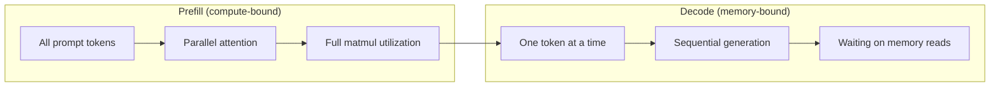
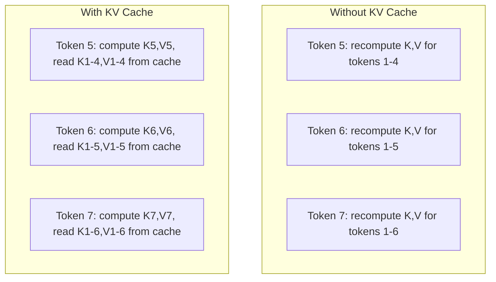
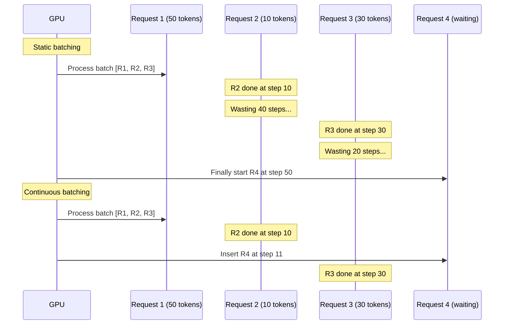
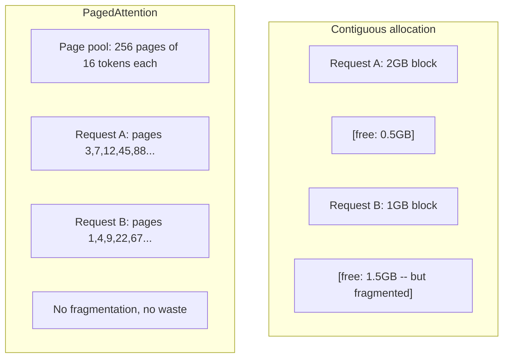
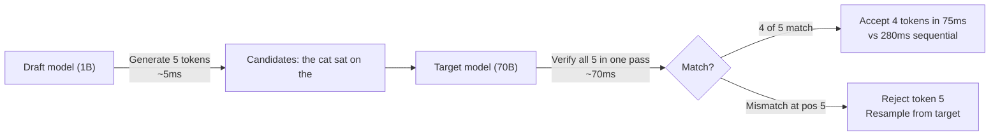

# 추론 최적화 (Inference Optimization)

> 두 단계가 LLM 추론(inference)을 정의한다. 프리필(prefill)은 프롬프트(prompt)를 병렬로 처리한다 — 연산 제약(compute-bound). 디코드(decode)는 토큰(token)을 한 번에 하나씩 생성한다 — 메모리 제약(memory-bound). 모든 최적화는 둘 중 하나 또는 둘 다를 겨냥한다.

**Type:** Build
**Languages:** Python
**Prerequisites:** Phase 10, Lessons 01-08 (Transformer architecture, attention)
**Time:** ~120분

## 학습 목표 (Learning Objectives)

- 자기회귀(autoregressive) 토큰 생성 중 중복 계산을 제거하는 KV 캐시(KV-cache)를 구현하기
- LLM 추론의 프리필 단계와 디코드 단계를 설명하고, 각각이 왜 다른 병목(연산 제약 vs 메모리 제약)을 갖는지 설명하기
- 동시 요청 하에 GPU 활용도를 극대화하는 연속 배칭(continuous batching)과 PagedAttention 개념을 구현하기
- 추론 최적화 기법(KV 캐시, 추측 디코딩, flash attention)과 그 처리량/지연 시간 트레이드오프(trade-off)를 비교하기

## 문제 (The Problem)

Llama 3 70B를 4xA100 GPU에 배포한다. 단일 사용자는 초당 약 50 토큰을 얻는다. 빠르게 느껴진다. 그러다 100명의 사용자가 동시에 엔드포인트에 도달한다. 처리량(throughput)이 사용자당 초당 3 토큰으로 떨어진다. 월 $25,000짜리 GPU 청구서가 사람이 타이핑하는 것보다 느린 응답을 서빙(serving)한다.

모델 자체는 사용자 1명과 100명 사이에서 바뀌지 않는다. 같은 가중치(weight), 같은 아키텍처, 같은 수학이다. 바뀌는 것은 작업을 어떻게 스케줄링(schedule)하느냐다. 순진한 추론은 가용 GPU 연산의 90% 이상을 낭비한다. 토큰 47번을 기다리는 사용자는 전체 배치 슬롯(batch slot)을 열어 둔 채로, GPU 메모리 버스가 행렬 곱셈(matmul) 사이에 놀고 있게 한다. 한편, 새 사용자의 2,000 토큰 프롬프트가 그 죽은 시간을 유용한 연산으로 채울 수 있다.

이는 확장(scaling) 문제가 아니다. 스케줄링 문제다. 이 레슨의 기법 — KV 캐싱, 연속 배칭, PagedAttention, 추측 디코딩(speculative decoding), 접두사 캐싱(prefix caching) — 이 같은 트래픽을 서빙하는 월 $25k짜리 추론 청구서와 월 $5k짜리를 가르는 것이다.

4xA100-80GB에서 Llama 3 70B를 서빙하는 vLLM은 낮은 동시성에서 사용자당 초당 약 50 토큰을 달성하고, 연속 배칭과 PagedAttention을 통해 100개의 동시 요청에서 사용자당 15-25 TPS를 유지한다. 이런 최적화가 없으면, 같은 하드웨어는 그 동시성에서 사용자당 5 TPS를 서빙한다. 같은 GPU, 같은 모델, 4배의 처리량.

## 개념 (The Concept)

### 프리필 vs 디코드 (Prefill vs Decode)

모든 LLM 추론 요청은 두 개의 뚜렷한 단계를 갖는다.

**프리필(Prefill)** 은 전체 입력 프롬프트를 처리한다. 모든 토큰이 알려져 있으므로, 어텐션(attention)을 전체 시퀀스에 걸쳐 병렬로 계산할 수 있다. 이는 큰 행렬 곱셈이다 — GPU 코어가 바쁘게 유지된다. 병목은 연산이다. 하드웨어가 초당 얼마나 많은 FLOPS를 낼 수 있는가. A100은 312 TFLOPS(BF16)를 한다. 70B 모델에서 4,096 토큰 프롬프트에 대한 프리필은 단일 A100에서 약 400ms가 걸린다.

**디코드(Decode)** 는 출력 토큰을 한 번에 하나씩 생성한다. 각 새 토큰은 이전의 모든 토큰에 어텐션하지만, 순방향 패스(forward pass)당 토큰 하나만 생성된다. 가중치 행렬은 프리필 때와 같은 크기지만, 행렬 대신 단일 벡터(vector)에 곱한다. GPU 코어는 마이크로초 안에 끝난 뒤, 다음 가중치 배치가 메모리에서 도착하기를 기다린다. 병목은 메모리 대역폭(memory bandwidth)이다. 모델 가중치를 HBM에서 연산 유닛으로 얼마나 빨리 스트리밍할 수 있는가. A100은 2 TB/s 대역폭을 가진다. FP16의 70B 모델은 140 GB다. 전체 모델을 한 번 읽는 데 70ms가 걸린다 — 그것이 단일 디코드 스텝의 하한이다.



**ops:byte 비율**(산술 강도, arithmetic intensity라고도 함)이 이 트레이드오프를 포착한다. 메모리에서 적재한 바이트당 몇 번의 연산을 수행하는지를 측정한다.

```
ops:byte ratio = FLOPs per token / bytes read from memory
```

4,096 토큰 배치로 프리필하는 동안, 적재된 가중치당 약 4,096번의 곱셈-누적(multiply-accumulate) 연산을 수행한다. 비율이 높다 — 연산 제약이다. 배치 크기 1로 디코드하는 동안, 적재된 가중치당 약 1번의 연산을 수행한다. 비율이 낮다 — 메모리 제약이다.

근본적 통찰: *디코드는 단일 토큰을 생성하려고 전체 모델을 읽기 때문에 메모리 제약이다*. 아래의 모든 최적화는 읽는 것을 줄이거나, 읽기당 처리되는 토큰 배치를 늘리거나, 읽기를 아예 피한다.

### KV 캐시 (KV Cache)

어텐션 중, 각 토큰의 쿼리(query)는 이전 모든 토큰의 키(key)와 값(value) 벡터에 어텐션한다. 캐싱이 없으면, 토큰 N을 생성하려면 앞선 N-1개 모든 토큰에 대한 키와 값 투영(projection)을 다시 계산해야 한다. 토큰 1은 토큰 2를 생성할 때 투영되고, 토큰 3을 위해 또, 토큰 4를 위해 또 투영된다. 토큰 1,000번이 되면, 토큰 1을 총 999번 투영한 것이다.

KV 캐시는 이전 모든 토큰의 키와 값 투영을 저장한다. 토큰 N을 생성할 때, 토큰 N에 대한 키와 값만 계산한 다음, 토큰 1부터 N-1까지의 캐시된 K/V와 연결(concatenate)한다.



**KV 캐시의 메모리 공식:**

```
KV cache size = 2 * num_layers * num_kv_heads * head_dim * seq_len * bytes_per_param
```

Llama 3 70B(80개 층, GQA로 8개 KV 헤드, head_dim=128, BF16)의 경우:

```
per token: 2 * 80 * 8 * 128 * 2 bytes = 327,680 bytes = 320 KB
at 4,096 tokens: 320 KB * 4,096 = 1.28 GB
at 128K tokens: 320 KB * 131,072 = 40 GB
```

Llama 3 70B의 단일 128K 컨텍스트(context) 대화는 40 GB의 KV 캐시를 소비한다 — A100 메모리의 절반이다. 각각 4K 토큰의 100명 동시 사용자라면, KV 캐시만으로 128 GB가 필요하다. 이것이 KV 캐시 관리가 추론 최적화의 핵심 과제인 이유다.

### 연속 배칭 (Continuous Batching)

정적 배칭(static batching)은 N개의 요청 배치가 도착할 때까지 기다리고, 함께 처리하고, *모두* 끝날 때까지 기다린 뒤 새 요청을 받는다. 한 요청이 500 토큰을 필요로 하고 다른 요청이 10 토큰을 필요로 하면, 짧은 요청은 끝난 뒤 490 디코드 스텝 동안 놀고 있는다.

연속 배칭(반복 수준 배칭, iteration-level batching이라고도 함)은 어떤 요청이든 완료되자마자 배치에 새 요청을 삽입한다. 배치는 매 디코드 스텝마다 재평가된다. 10 토큰 후에 끝나는 요청은 즉시 대기 중인 요청으로 대체된다.



처리량 개선은 출력 길이가 얼마나 다양한지에 달려 있다. 균일한 길이에서는 연속 배칭이 정적 배칭과 같다. 가변 길이(흔한 경우)에서는, GPU 슬롯이 결코 비지 않기 때문에 연속 배칭이 2-5배 높은 처리량을 낼 수 있다.

### PagedAttention

각 요청의 KV 캐시는 연속된(contiguous) 메모리 블록이다. 요청이 도착하고 떠나면서 메모리가 단편화된다 — 운영체제의 RAM 단편화와 정확히 같다. 4K 토큰 요청은 1.28 GB의 연속 메모리를 필요로 한다. 총 2 GB가 비어 있어도, 1.28 GB의 *연속* 공간이 없을 수 있다. 메모리를 낭비하거나 요청을 거부하게 된다.

PagedAttention(vLLM에서)은 OS 스타일의 가상 메모리(virtual memory)를 KV 캐시에 적용한다. 요청당 하나의 연속 블록을 할당하는 대신, 고정 크기 "페이지(page)"(보통 각 16 토큰)를 할당한다. 페이지는 물리 GPU 메모리 어디에나 있을 수 있다. 페이지 테이블(page table)이 각 요청의 논리적 시퀀스 위치를 물리 페이지 위치로 매핑한다.



PagedAttention은 또한 공유된 접두사(shared prefix)에 대한 **쓰기 시 복사(copy-on-write)** 를 가능하게 한다. 50개의 요청이 같은 시스템 프롬프트를 공유하면, 그 시스템 프롬프트의 KV 캐시 페이지는 한 번만 저장되고 50개 요청 모두가 참조한다. 요청이 분기할 때(다른 사용자 메시지)만 자신의 페이지를 받는다. 이는 공유된 시스템 프롬프트를 가진 애플리케이션의 메모리 사용량을 극적으로 줄인다.

vLLM은 PagedAttention을 통해 거의 0에 가까운 메모리 낭비(순진한 할당의 약 60-80% 대비 약 4%)를 보고한다.

### 추측 디코딩 (Speculative Decoding)

디코드는 순차적이기 때문에 느리다 — 토큰 하나를 생성하고, 되먹이고, 다음을 생성한다. 그런데 다음 5개 토큰을 저렴하게 추측한 다음, 그들을 한꺼번에 검증할 수 있다면?

추측 디코딩은 작고 빠른 **드래프트 모델(draft model)** 을 사용해 K개의 후보 토큰을 생성한다. 그런 다음 큰 **타깃 모델(target model)** 이 단일 순방향 패스에서 K개의 후보를 모두 처리한다(이는 프리필처럼 보인다 — 병렬, 연산 제약, 효율적). 타깃 모델이 드래프트 모델의 예측에 동의하면, 타깃 순방향 패스 하나의 시간에 K개 토큰을 모두 받아들인다. 위치 j에서 동의하지 않으면, 토큰 1부터 j-1까지 받아들이고 나머지는 버린다.



속도 향상은 **수락률(acceptance rate)** 에 달려 있다 — 드래프트 모델의 예측이 타깃과 얼마나 자주 일치하는가. Llama 3 70B를 위해 드래프트하는 Llama 3 8B의 경우, 자연어에서 70-85%의 수락률이 일반적이다. 이는 2-3배의 디코드 속도 향상으로 이어진다.

추측 디코딩에 대한 세 가지 접근법:

| 방법 | 드래프트 출처 | 수락률 | 오버헤드 |
|--------|-------------|-----------------|----------|
| 드래프트-타깃(Leviathan et al.) | 별도의 작은 모델 | 70-85% | 드래프트 모델 메모리 |
| EAGLE(Li et al.) | 타깃 위의 경량 헤드 | 75-90% | 약 1% 추가 파라미터 |
| N-gram 조회 | 토큰 n-gram 테이블 | 40-60% | 무시할 만함 |

**EAGLE** 은 타깃 모델의 은닉 상태(hidden state) 위에 작은 자기회귀 헤드(head)를 학습시킨다. 타깃 모델의 끝에서 두 번째 층 특성을 사용해 다음 토큰의 임베딩(embedding)을 예측한다. 별도 모델이 아니라 타깃 모델 자신의 표현(representation)에서 작동하기 때문에, 최소한의 추가 메모리로 더 높은 수락률을 달성한다. EAGLE-2는 컨텍스트에 따라 후보 수를 조정하는 동적 드래프트 트리(dynamic draft tree)를 추가한다.

**N-gram 추측 디코딩** 은 현재 컨텍스트나 미리 구축된 코퍼스(corpus)로부터 n-gram 연속을 담은 테이블을 유지한다. 드래프트가 같은 대화에서 이전에 나타난 것(반복 패턴, 코드, 구조화된 출력)과 일치하면, 신경망 오버헤드 없이 발동한다. 평균적으로 수락률은 낮지만 추측당 비용은 본질적으로 공짜다.

추측 디코딩은 *수학적으로 정확하다* — 출력 분포(distribution)가 타깃 모델의 분포와 동일하다. 근사가 아니다. 검증 단계는 받아들여진 모든 토큰이 타깃 모델이 할당했을 정확한 확률을 갖도록 보장한다.

### 접두사 캐싱 (Prefix Caching)

많은 요청이 같은 접두사를 공유한다. 챗봇 시스템 프롬프트. RAG 컨텍스트 블록. 퓨샷(few-shot) 예제 집합. 접두사 캐싱이 없으면, 모든 요청이 이 공유 토큰에 대한 KV 캐시를 처음부터 다시 계산한다.

접두사 캐싱은 흔한 접두사에 대한 KV 캐시를 저장하고 요청 전반에 걸쳐 재사용한다. 알려진 접두사를 가진 새 요청이 도착하면, 시스템은 캐시된 KV 항목을 복사(또는 참조)하고 고유한 접미사(suffix)에 대한 KV만 계산한다.

모든 요청에 걸쳐 공유되는 2,000 토큰 시스템 프롬프트의 경우, 접두사 캐싱은 요청당 약 400ms의 프리필을 제거한다. 초당 100개 요청에서, 이는 초당 40초의 GPU 연산을 절약한다 — GPU 하나치 이상의 작업이다.

SGLang의 RadixAttention은 접두사를 토큰 내용으로 인덱싱하는 라딕스 트리(radix tree, trie)로 접두사 캐싱을 구현한다. 저장된 접두사와 일치하는 모든 요청은 KV 캐시를 공짜로 얻는다. 트리는 부분 접두사 일치를 가능하게 한다 — 캐시된 항목과 2,000개 접두사 토큰 중 1,500개를 공유하면, 그 1,500개를 재사용하고 500개만 다시 계산한다.

### 추론 엔진 (Inference Engines)

세 엔진이 프로덕션 LLM 서빙을 지배한다:

| 엔진 | 핵심 혁신 | 적합한 용도 |
|--------|---------------|----------|
| vLLM | PagedAttention, 연속 배칭 | 범용 서빙, 최고의 호환성 |
| SGLang | RadixAttention(접두사 캐싱), 구조화된 생성 | 멀티턴 챗봇, 제약 디코딩 |
| TensorRT-LLM | NVIDIA 커널 융합(kernel fusion), FP8 양자화 | NVIDIA 하드웨어에서 최대 단일 GPU 처리량 |

**vLLM** 은 기본 출발점이다. 가장 넓은 범위의 모델을 지원하고, 모든 GPU 벤더(NVIDIA, AMD, Intel)에서 돌아가며, PagedAttention + 연속 배칭을 통해 강력한 처리량을 달성한다. OpenAI 호환 API는 어떤 OpenAI API 호출이든 대체물로 끼워 넣을 수 있다는 뜻이다.

**SGLang** 은 vLLM과 같은 토대 위에 구축되지만 접두사 캐싱을 위한 RadixAttention과 구조화된 LLM 프로그램을 위한 도메인 특화 언어(domain-specific language)를 추가한다. 워크로드가 멀티턴 대화, 도구 사용, 제약 디코딩(JSON 출력, 정규식 유도 생성)을 포함하면, SGLang은 종종 접두사 재사용을 통해 vLLM을 2-5배 능가한다.

**TensorRT-LLM** 은 모델을 최적화된 NVIDIA GPU 커널로 컴파일한다. 연산을 융합하고(어텐션 + 선형 + 활성화를 한 커널에), H100 GPU에서 FP8을 사용하며, 프로덕션 배포를 위해 NVIDIA Triton Inference Server와 통합된다. NVIDIA 하드웨어에서 최고의 단일 GPU 처리량을 달성하지만 더 많은 설정이 필요하고 NVIDIA GPU에서만 작동한다.

Llama 3 70B의 실세계 수치(4xA100-80GB, BF16):

| 지표 | vLLM | SGLang | TensorRT-LLM |
|--------|------|--------|---------------|
| 처리량(1명 사용자) | ~50 TPS | ~55 TPS | ~65 TPS |
| 처리량(100명 사용자) | 총 ~2,500 TPS | 총 ~3,200 TPS | 총 ~3,000 TPS |
| 첫 토큰까지의 시간 | ~400ms | ~300ms(접두사 적중) | ~350ms |
| 최대 컨텍스트 | 128K | 128K | 128K |

### Ops:Byte 프레임워크 (The Ops:Byte Framework)

측정하지 않는 것은 최적화할 수 없다. ops:byte 비율은 연산 제약인지 메모리 제약인지 알려 주며, 이는 어떤 최적화가 중요한지를 결정한다.

```
Compute roof: peak FLOPS of the GPU
Memory roof:  peak bandwidth * ops:byte ratio
```

ops:byte가 낮으면(디코드, 작은 배치), 메모리 대역폭 천장(roof)에 부딪힌다. 연산을 더하는 것(더 높은 클럭, 더 많은 코어)은 도움이 안 된다. 메모리 읽기를 줄이거나(양자화, KV 캐시 압축) 배치 크기를 늘려 읽기를 더 많은 유용한 작업에 분산시켜야 한다.

ops:byte가 높으면(프리필, 큰 배치), 연산 천장에 부딪힌다. 메모리 대역폭 최적화는 도움이 안 된다. 더 많은 FLOPS를 짜내기 위해 더 빠른 GPU, 커널 융합, 또는 정밀도 감소가 필요하다.

| 시나리오 | ops:byte | 제약 | 최적화 방법 |
|----------|----------|-------|---------------|
| 프리필, batch=1 | ~4,096 | 연산 | 커널 융합, FP8 |
| 디코드, batch=1 | ~1 | 메모리 | 양자화, KV 압축 |
| 디코드, batch=32 | ~32 | 메모리 | 더 큰 배치, 연속 배칭 |
| 디코드, batch=256 | ~256 | 전환 중 | 둘 다 중요 |
| 디코드, batch=1024 | ~1,024 | 연산 | 커널 융합, 텐서 병렬화(tensor parallelism) |

A100의 교차점(crossover)은 ops:byte = 156 부근이다(312 TFLOPS / 2 TB/s). 156 미만이면 메모리 제약이다. 156 초과면 연산 제약이다. 연속 배칭은 반복당 더 많은 토큰을 채워 디코드를 이 교차점 쪽으로 민다.

## 직접 만들기 (Build It)

### 1단계: 밑바닥부터 만드는 KV 캐시

층마다, 헤드마다 키와 값 투영을 저장하고 메모리 증가 패턴을 보여 주는 멀티헤드 KV 캐시를 만든다.

```python
import numpy as np

class KVCache:
    def __init__(self, num_layers, num_heads, head_dim, max_seq_len, dtype=np.float16):
        self.num_layers = num_layers
        self.num_heads = num_heads
        self.head_dim = head_dim
        self.max_seq_len = max_seq_len
        self.dtype = dtype

        self.k_cache = np.zeros(
            (num_layers, num_heads, max_seq_len, head_dim), dtype=dtype
        )
        self.v_cache = np.zeros(
            (num_layers, num_heads, max_seq_len, head_dim), dtype=dtype
        )
        self.seq_len = 0

    def update(self, layer_idx, new_keys, new_values):
        num_new = new_keys.shape[1]
        end = self.seq_len + num_new
        self.k_cache[layer_idx, :, self.seq_len:end, :] = new_keys
        self.v_cache[layer_idx, :, self.seq_len:end, :] = new_values
        return (
            self.k_cache[layer_idx, :, :end, :],
            self.v_cache[layer_idx, :, :end, :]
        )

    def advance(self, num_tokens):
        self.seq_len += num_tokens

    def memory_bytes(self):
        return self.k_cache.nbytes + self.v_cache.nbytes

    def used_bytes(self):
        per_token = 2 * self.num_layers * self.num_heads * self.head_dim * np.dtype(self.dtype).itemsize
        return per_token * self.seq_len
```

### 2단계: KV 캐시를 사용한 어텐션

디코드 스텝에 KV 캐시를 사용하는 단순화된 멀티헤드 어텐션이다.

```python
def scaled_dot_product_attention(query, keys, values):
    head_dim = query.shape[-1]
    scores = np.matmul(query, keys.transpose(0, 1, 3, 2)) / np.sqrt(head_dim)
    seq_len_q = scores.shape[-2]
    seq_len_k = scores.shape[-1]
    if seq_len_q > 1:
        mask = np.triu(np.ones((seq_len_q, seq_len_k), dtype=np.float32), k=seq_len_k - seq_len_q + 1)
        scores = scores + mask * (-1e9)
    max_scores = np.max(scores, axis=-1, keepdims=True)
    exp_scores = np.exp(scores - max_scores)
    attn_weights = exp_scores / np.sum(exp_scores, axis=-1, keepdims=True)
    return np.matmul(attn_weights, values)


class MultiHeadAttention:
    def __init__(self, d_model, num_heads):
        self.num_heads = num_heads
        self.head_dim = d_model // num_heads
        scale = np.sqrt(2.0 / d_model)
        self.W_q = np.random.randn(d_model, d_model).astype(np.float32) * scale
        self.W_k = np.random.randn(d_model, d_model).astype(np.float32) * scale
        self.W_v = np.random.randn(d_model, d_model).astype(np.float32) * scale
        self.W_o = np.random.randn(d_model, d_model).astype(np.float32) * scale

    def forward(self, x, kv_cache=None, layer_idx=0):
        batch, seq_len, d_model = x.shape
        Q = np.matmul(x, self.W_q).reshape(batch, seq_len, self.num_heads, self.head_dim).transpose(0, 2, 1, 3)
        K = np.matmul(x, self.W_k).reshape(batch, seq_len, self.num_heads, self.head_dim).transpose(0, 2, 1, 3)
        V = np.matmul(x, self.W_v).reshape(batch, seq_len, self.num_heads, self.head_dim).transpose(0, 2, 1, 3)

        if kv_cache is not None:
            K_full, V_full = kv_cache.update(layer_idx, K[0], V[0])
            K = K_full[np.newaxis, :, :, :]
            V = V_full[np.newaxis, :, :, :]
            if seq_len == 1:
                kv_cache.advance(1)

        attn_out = scaled_dot_product_attention(Q, K, V)
        attn_out = attn_out.transpose(0, 2, 1, 3).reshape(batch, -1, d_model)
        return np.matmul(attn_out, self.W_o)
```

### 3단계: 연속 배칭 시뮬레이터

이것은 정적 배칭과 연속 배칭 사이의 스케줄링 차이를 시뮬레이션한다.

```python
import heapq

class Request:
    def __init__(self, request_id, prompt_tokens, output_tokens, arrival_step):
        self.request_id = request_id
        self.prompt_tokens = prompt_tokens
        self.output_tokens = output_tokens
        self.arrival_step = arrival_step
        self.tokens_generated = 0
        self.start_step = None
        self.end_step = None

    def is_done(self):
        return self.tokens_generated >= self.output_tokens


def simulate_static_batching(requests, batch_size):
    step = 0
    completed = []
    queue = list(requests)
    queue.sort(key=lambda r: r.arrival_step)

    while queue:
        batch = []
        while queue and len(batch) < batch_size:
            r = queue.pop(0)
            r.start_step = max(step, r.arrival_step)
            batch.append(r)

        if batch:
            step = max(step, max(r.start_step for r in batch))
            max_output = max(r.output_tokens for r in batch)
            for r in batch:
                r.tokens_generated = r.output_tokens
                r.end_step = step + max_output
            step += max_output
            completed.extend(batch)

    return completed


def simulate_continuous_batching(requests, batch_size):
    step = 0
    completed = []
    queue = sorted(requests, key=lambda r: r.arrival_step)
    queue_idx = 0
    active = []
    waiting = []

    while queue_idx < len(queue) or active or waiting:
        while queue_idx < len(queue) and queue[queue_idx].arrival_step <= step:
            waiting.append(queue[queue_idx])
            queue_idx += 1

        while waiting and len(active) < batch_size:
            r = waiting.pop(0)
            r.start_step = step
            active.append(r)

        if not active:
            if waiting:
                step += 1
                continue
            elif queue_idx < len(queue):
                step = queue[queue_idx].arrival_step
                continue
            else:
                break

        for r in active:
            r.tokens_generated += 1

        done = [r for r in active if r.is_done()]
        for r in done:
            r.end_step = step + 1
            completed.append(r)
        active = [r for r in active if not r.is_done()]

        step += 1

    return completed


def batching_stats(completed):
    latencies = [r.end_step - r.arrival_step for r in completed]
    total_time = max(r.end_step for r in completed) - min(r.arrival_step for r in completed)
    total_tokens = sum(r.output_tokens for r in completed)
    return {
        "avg_latency": np.mean(latencies),
        "p50_latency": np.median(latencies),
        "p99_latency": np.percentile(latencies, 99),
        "total_time": total_time,
        "throughput": total_tokens / total_time if total_time > 0 else 0,
    }
```

### 4단계: 접두사 캐시

공유된 접두사에 대한 KV 항목을 저장하는 트라이(trie) 기반 접두사 캐시다.

```python
class TrieNode:
    def __init__(self):
        self.children = {}
        self.kv_data = None
        self.hit_count = 0


class PrefixCache:
    def __init__(self, max_entries=1000):
        self.root = TrieNode()
        self.max_entries = max_entries
        self.total_entries = 0
        self.hits = 0
        self.misses = 0

    def _walk(self, token_ids):
        node = self.root
        depth = 0
        for tid in token_ids:
            if tid not in node.children:
                break
            node = node.children[tid]
            depth += 1
        return node, depth

    def lookup(self, token_ids):
        node, depth = self._walk(token_ids)
        if depth > 0:
            self.hits += 1
            current = self.root
            for tid in token_ids[:depth]:
                current = current.children[tid]
                current.hit_count += 1
            kv_entries = []
            current = self.root
            for tid in token_ids[:depth]:
                current = current.children[tid]
                if current.kv_data is not None:
                    kv_entries.append(current.kv_data)
            return depth, kv_entries
        self.misses += 1
        return 0, []

    def insert(self, token_ids, kv_per_token):
        node = self.root
        for i, tid in enumerate(token_ids):
            if tid not in node.children:
                if self.total_entries >= self.max_entries:
                    return i
                node.children[tid] = TrieNode()
                self.total_entries += 1
            node = node.children[tid]
            if i < len(kv_per_token):
                node.kv_data = kv_per_token[i]
        return len(token_ids)

    def hit_rate(self):
        total = self.hits + self.misses
        return self.hits / total if total > 0 else 0.0
```

### 5단계: 추측 디코딩 시뮬레이터

설정 가능한 수락률로 드래프트-타깃 추측 디코딩을 시뮬레이션한다.

```python
class DraftModel:
    def __init__(self, vocab_size, acceptance_rate=0.8):
        self.vocab_size = vocab_size
        self.acceptance_rate = acceptance_rate

    def generate(self, context, num_tokens):
        tokens = np.random.randint(0, self.vocab_size, size=num_tokens)
        return tokens

    def get_probs(self, context, token):
        probs = np.random.dirichlet(np.ones(self.vocab_size))
        return probs


class TargetModel:
    def __init__(self, vocab_size):
        self.vocab_size = vocab_size

    def get_probs(self, context, tokens=None):
        if tokens is not None:
            return [np.random.dirichlet(np.ones(self.vocab_size)) for _ in tokens]
        return np.random.dirichlet(np.ones(self.vocab_size))


def speculative_decode(draft_model, target_model, context, num_speculative=5,
                       draft_cost=1.0, target_cost=10.0, verify_cost=12.0):
    total_tokens = 0
    total_cost = 0.0
    accepted_counts = []
    context = list(context)

    max_tokens = 100

    while total_tokens < max_tokens:
        draft_tokens = draft_model.generate(context, num_speculative)
        total_cost += draft_cost * num_speculative

        target_probs = target_model.get_probs(context, draft_tokens)
        total_cost += verify_cost

        accepted = 0
        for i, token in enumerate(draft_tokens):
            draft_p = draft_model.get_probs(context + list(draft_tokens[:i]), token)
            target_p = target_probs[i]

            r = np.random.random()
            acceptance_prob = min(1.0, target_p[token] / (draft_p[token] + 1e-10))

            if r < draft_model.acceptance_rate:
                accepted += 1
                context.append(token)
                total_tokens += 1
            else:
                new_token = np.random.choice(draft_model.vocab_size, p=target_p)
                context.append(new_token)
                total_tokens += 1
                break

        accepted_counts.append(accepted)

        if accepted == num_speculative:
            bonus_probs = target_model.get_probs(context)
            bonus_token = np.random.choice(draft_model.vocab_size, p=bonus_probs)
            context.append(bonus_token)
            total_tokens += 1

    sequential_cost = total_tokens * target_cost
    return {
        "total_tokens": total_tokens,
        "speculative_cost": total_cost,
        "sequential_cost": sequential_cost,
        "speedup": sequential_cost / total_cost if total_cost > 0 else 1.0,
        "avg_accepted": np.mean(accepted_counts),
        "acceptance_rate": np.mean(accepted_counts) / num_speculative,
    }


def compare_speculation_strategies(vocab_size=1000, num_trials=20):
    results = {}

    for name, acceptance_rate, spec_tokens in [
        ("Draft-target (8B->70B)", 0.78, 5),
        ("EAGLE", 0.85, 6),
        ("N-gram", 0.50, 4),
        ("No speculation", 0.0, 0),
    ]:
        if spec_tokens == 0:
            results[name] = {
                "speedup": 1.0,
                "acceptance_rate": 0.0,
                "avg_accepted": 0.0,
            }
            continue

        trial_results = []
        for _ in range(num_trials):
            draft = DraftModel(vocab_size, acceptance_rate=acceptance_rate)
            target = TargetModel(vocab_size)
            context = list(np.random.randint(0, vocab_size, size=10))
            result = speculative_decode(draft, target, context, num_speculative=spec_tokens)
            trial_results.append(result)

        results[name] = {
            "speedup": np.mean([r["speedup"] for r in trial_results]),
            "acceptance_rate": np.mean([r["acceptance_rate"] for r in trial_results]),
            "avg_accepted": np.mean([r["avg_accepted"] for r in trial_results]),
        }

    return results
```

### 6단계: KV 캐시 메모리 프로파일러

실제 모델 구성에 대한 KV 캐시 메모리 요구량을 계산한다.

```python
MODEL_CONFIGS = {
    "Llama-3-8B": {
        "num_layers": 32, "num_kv_heads": 8, "head_dim": 128,
        "model_params_b": 8, "gqa": True,
    },
    "Llama-3-70B": {
        "num_layers": 80, "num_kv_heads": 8, "head_dim": 128,
        "model_params_b": 70, "gqa": True,
    },
    "Llama-3-405B": {
        "num_layers": 126, "num_kv_heads": 8, "head_dim": 128,
        "model_params_b": 405, "gqa": True,
    },
    "Mistral-7B": {
        "num_layers": 32, "num_kv_heads": 8, "head_dim": 128,
        "model_params_b": 7, "gqa": True,
    },
    "GPT-4-est": {
        "num_layers": 120, "num_kv_heads": 96, "head_dim": 128,
        "model_params_b": 1800, "gqa": False,
    },
}


def kv_cache_memory(config, seq_len, dtype_bytes=2):
    per_token = 2 * config["num_layers"] * config["num_kv_heads"] * config["head_dim"] * dtype_bytes
    total = per_token * seq_len
    return {
        "per_token_bytes": per_token,
        "per_token_kb": per_token / 1024,
        "total_bytes": total,
        "total_mb": total / (1024 ** 2),
        "total_gb": total / (1024 ** 3),
    }


def memory_budget(config, gpu_memory_gb, model_dtype_bytes=2, kv_dtype_bytes=2):
    model_memory_gb = config["model_params_b"] * 1e9 * model_dtype_bytes / (1024 ** 3)
    overhead_gb = gpu_memory_gb * 0.1
    available_for_kv = gpu_memory_gb - model_memory_gb - overhead_gb

    if available_for_kv <= 0:
        return {"error": "Model does not fit in GPU memory", "model_memory_gb": model_memory_gb}

    per_token = 2 * config["num_layers"] * config["num_kv_heads"] * config["head_dim"] * kv_dtype_bytes
    max_tokens = int(available_for_kv * (1024 ** 3) / per_token)

    return {
        "gpu_memory_gb": gpu_memory_gb,
        "model_memory_gb": round(model_memory_gb, 1),
        "overhead_gb": round(overhead_gb, 1),
        "available_for_kv_gb": round(available_for_kv, 1),
        "max_total_tokens": max_tokens,
        "max_users_at_2k": max_tokens // 2048,
        "max_users_at_4k": max_tokens // 4096,
        "max_users_at_32k": max_tokens // 32768,
    }
```

## 라이브러리로 써보기 (Use It)

vLLM으로:

```python
from vllm import LLM, SamplingParams

llm = LLM(
    model="meta-llama/Llama-3-70B-Instruct",
    tensor_parallel_size=4,
    enable_prefix_caching=True,
    max_model_len=8192,
    gpu_memory_utilization=0.9,
)

params = SamplingParams(temperature=0.7, max_tokens=256)
outputs = llm.generate(["Explain inference optimization in one paragraph."], params)
```

접두사 캐싱 + 구조화된 출력을 위한 SGLang으로:

```python
import sglang as sgl

@sgl.function
def classify(s, text):
    s += sgl.system("You are a classifier. Output JSON only.")
    s += sgl.user(f"Classify this text: {text}")
    s += sgl.assistant(sgl.gen("result", regex=r'\{"label": "(positive|negative|neutral)"\}'))

runtime = sgl.Runtime(model_path="meta-llama/Llama-3-70B-Instruct", tp_size=4)
sgl.set_default_backend(runtime)

results = classify.run_batch([
    {"text": "This product is amazing!"},
    {"text": "Terrible experience."},
    {"text": "It was okay I guess."},
])
```

TensorRT-LLM으로:

```python
import tensorrt_llm
from tensorrt_llm.runtime import ModelRunner

runner = ModelRunner.from_dir("./llama-70b-trt-engine/", rank=0)

outputs = runner.generate(
    batch_input_ids=[tokenizer.encode("Explain KV caching.")],
    max_new_tokens=256,
    temperature=0.7,
)
```

## 산출물 (Ship It)

이 레슨은 다음을 만든다:
- `outputs/skill-inference-optimization.md` -- LLM 추론 서빙을 진단하고 최적화하기 위한 스킬

## 연습 문제 (Exercises)

1. KV 캐시 프로파일러를 수정해 FP16 vs FP8 vs INT4 KV 캐시 양자화를 비교하라. 4K 컨텍스트의 Llama 3 70B에 대해, 4xA100-80GB에서 각각의 최대 동시 사용자 수를 계산하라. INT4로의 KV 양자화는 사용자 수용량을 대략 4배로 늘려야 한다.

2. 연속 배칭 시뮬레이터를 확장해 GPU 활용도(스텝당 채워진 배치 슬롯의 비율)를 추적하라. 출력 길이가 파레토 분포(Pareto distribution, shape=1.5, scale=20)를 따르는 50개 요청에 대해, 정적 배칭과 연속 배칭 모두에서 시간에 따른 활용도를 그려라. 연속 배칭은 80% 이상의 활용도를 유지해야 한다.

3. `num_kv_heads < num_query_heads`인 그룹 쿼리 어텐션(grouped-query attention, GQA) 버전의 KV 캐시를 구현하라. Llama 3 70B는 64개의 쿼리 헤드를 쓰지만 KV 헤드는 8개뿐이다. 완전한 멀티헤드 어텐션 대비 메모리 절약을 계산하라(KV 캐시 크기 8배 감소).

4. LRU 축출(eviction)을 사용하는 접두사 캐시를 만들어라. max_entries를 500으로 설정하고, 60%가 5개의 흔한 접두사 중 하나를 공유하는 1,000개의 요청을 생성하라. 적중률을 측정하고 무제한 캐시와 비교하라. 좋은 축출이면, 적중률은 55% 이상을 유지해야 한다.

5. 추측 디코딩 시뮬레이터를 확장해 트리 기반 추측(EAGLE-2 스타일)을 구현하라. K개 드래프트 토큰의 단일 사슬 대신, 후보의 트리를 생성하라(예: 3개 수준 각각에 2개 분기 = 8개 리프 후보). 선형 추측 대비 검증 라운드당 받아들여진 총 토큰을 비교하라.

## 핵심 용어 (Key Terms)

| 용어 | 사람들이 말하는 것 | 실제 의미 |
|------|----------------|----------------------|
| 프리필(Prefill) | "프롬프트 처리" | 모든 입력 토큰에 대한 어텐션을 병렬로 계산 — 전체 행렬 곱셈이 GPU 코어를 바쁘게 유지하므로 연산 제약 |
| 디코드(Decode) | "토큰 생성" | 순방향 패스당 토큰 하나를 생성하며, 매번 전체 모델 가중치를 읽음 — 다음 가중치가 도착하기 전에 연산이 끝나므로 메모리 제약 |
| KV 캐시(KV cache) | "어텐션 상태 캐싱" | 이전 모든 토큰의 키와 값 투영을 저장해 각 디코드 스텝에서 다시 계산하지 않게 함 — 연산을 메모리와 맞바꿈 |
| 연속 배칭(Continuous batching) | "동적 배칭" | 전체 배치를 기다리는 대신 매 디코드 반복에서 평가하여, 어떤 요청이든 끝나자마자 실행 중인 배치에 새 요청을 삽입 |
| PagedAttention | "KV 캐시용 가상 메모리" | KV 캐시를 연속 블록 대신 고정 크기 페이지로 할당하여, 메모리 단편화를 제거하고 공유 접두사에 대한 쓰기 시 복사를 가능하게 함 |
| 추측 디코딩(Speculative decoding) | "드래프트하고 검증" | 빠른 드래프트 모델로 여러 토큰을 제안한 뒤, 한 번의 타깃 모델 순방향 패스로 모두 검증 — 수학적으로 정확, 2-3배 속도 향상 |
| EAGLE | "자기 추측 디코딩" | 타깃 모델 자신의 은닉 상태에 경량 헤드를 학습시켜, 별도 드래프트 모델보다 높은 수락률을 달성하는 추측 디코딩 변형 |
| 접두사 캐싱(Prefix caching) | "시스템 프롬프트 KV 재사용" | 흔한 접두사(시스템 프롬프트, 퓨샷 예제)에 대해 계산된 KV 캐시 항목을 저장하고 요청 전반에 재사용하여 중복 프리필을 건너뜀 |
| Ops:byte 비율 | "산술 강도" | 연산 횟수 대 읽은 메모리 바이트의 비율 — 워크로드가 연산 제약(높은 비율)인지 메모리 제약(낮은 비율)인지를 결정 |
| 첫 토큰까지의 시간(Time to first token) | "TTFT" | 요청 수신부터 첫 출력 토큰 생성까지의 지연 시간 — 긴 프롬프트에서는 프리필 시간이 지배함 |

## 더 읽을거리 (Further Reading)

- Kwon et al., "Efficient Memory Management for Large Language Model Serving with PagedAttention" (2023) -- 페이지드 KV 캐시 관리를 도입한 vLLM 논문, 이제 추론 서빙의 업계 표준
- Leviathan et al., "Fast Inference from Transformers via Speculative Decoding" (2023) -- 드래프트-검증 추측이 2-3배 속도 향상을 달성하면서 정확한 타깃 모델 분포를 생성함을 증명한 기초 논문
- Li et al., "EAGLE: Speculative Sampling Requires Rethinking Feature Uncertainty" (2024) -- 별도 드래프트 모델을 쓰는 대신 타깃 모델 자신의 특성에 헤드를 학습시켜 더 높은 수락률을 달성
- Zheng et al., "SGLang: Efficient Execution of Structured Language Model Programs" (2024) -- 접두사 캐싱을 위한 RadixAttention과 다중 호출 LLM 프로그램을 위한 프로그래밍 모델을 도입
- Williams et al., "Roofline: An Insightful Visual Performance Model for Multicore Architectures" (2009) -- 연산 대 메모리 병목을 추론하기 위한 ops:byte 프레임워크를 정형화한 원조 루프라인(roofline) 논문
