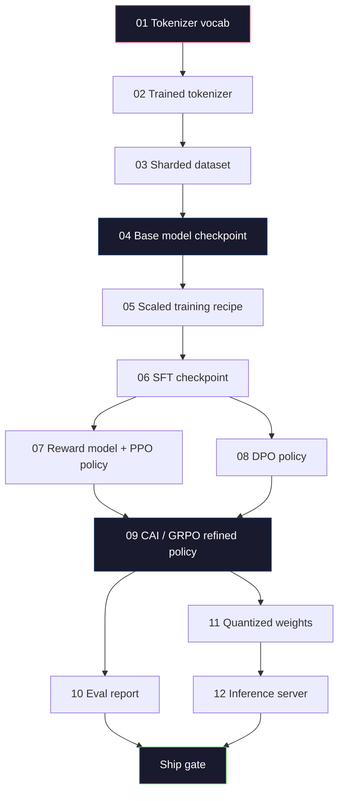
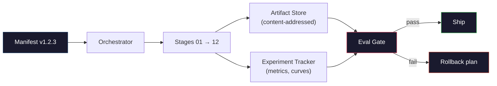

# 완전한 LLM 파이프라인 만들기 (Building a Complete LLM Pipeline)

> Lesson 01부터 12까지의 모든 것은 하나의 파이프라인(pipeline)의 한 단계다. 이 레슨은 그 단계들을 하나의 엔드투엔드 실행으로 바꾸는 골격(scaffold)이다. 토큰화, 사전 학습, 확장, SFT, 정렬(align), 평가, 양자화, 서빙. 노트북에서 70B 모델을 학습시키지는 않는다. 2026년 프런티어 팀이 무엇을 출시할지 결정하는 데 쓰는 오케스트레이션(orchestration) 계층, 매니페스트(manifest), 평가 관문(eval gate), 롤백(rollback) 계획을 만든다. 이것이 캡스톤(capstone)이다.

**Type:** Build
**Languages:** Python (stdlib)
**Prerequisites:** All Phase 10 lessons 01-12
**Time:** ~120분

## 학습 목표 (Learning Objectives)

- 앞선 열한 개 레슨(토크나이저, 데이터, 사전 학습, 확장, SFT, RLHF, DPO, CAI, 평가, 양자화, 추론)을 하나의 재현 가능한 파이프라인 명세로 구성하기
- 단계 간 산출물 계약(artifact contract)을 정의하기: 각 단계가 무엇을 소비하고, 무엇을 생산하며, 다음 단계가 입력을 어떻게 검증하는가
- 실험을 추적하고, 산출물을 해시(hash)하며, 평가 임곗값에 출시 결정을 거는 오케스트레이터(orchestrator)를 만들기
- 롤백 계획을 설계하기: 어떤 산출물이 재실행하기 저렴하고, 어떤 것이 비싸며, 손상된 체크포인트(checkpoint)는 얼마의 비용이 드는가

## 문제 (The Problem)

앞선 레슨들은 각각 작동한다. 토크나이저(tokenizer)가 학습되었다. 작은 GPT가 사전 학습(pre-trained)되었다. SFT 데이터셋(dataset)이 조립되었다. 보상 모델(reward model)이 학습되었다. DPO가 실행되었다. 평가가 측정되었다. 양자화된 가중치(weight)가 내보내졌다. 추론(inference) 서버가 띄워졌다. 각각 하나의 노트북이다. 각각 자체 관례, 자체 출력 경로, 자체 시드(seed)를 가진다.

프런티어 학습 실행은 노트북이 아니다. Llama 3 405B는 약 54일에 걸쳐 3천만 H100 시간이 걸렸다. DeepSeek-V3은 약 280만 H800 시간을 썼다. 그 시간 동안, 하나의 손상된 체크포인트, 하나의 데이터 오염(data contamination), 하나의 평가 퇴보(eval regression)가 팀에게 한 주의 실제 시간과 한 달의 GPU 예산을 날릴 수 있다. 팀이 이를 견디는 방법은 파이프라인 위생(pipeline hygiene)을 통해서다. 모든 단계는 결정론적 입력, 결정론적 출력, 매니페스트, 해시, 관문을 가진다.

이것이 캡스톤이다. 노트북에서 파이프라인을 엔드투엔드로 실행하지는 않는다. 단계를 조율하는 오케스트레이터, 실행을 기술하는 매니페스트, 출시 결정을 거르는 검증기, 그리고 제3자가 단일 파일에서 당신의 작업을 재실행하게 하는 재현 계획을 작성한다. 코드는 작지만, 규율은 크다.

이 패턴은 100M에서 1T 파라미터(parameter)까지 변함없이 확장된다. 같은 네 구성요소 — 매니페스트, 오케스트레이터, 평가 관문, 산출물 저장소(artifact store) — 가 Llama 3를 돌리고 당신의 취미용 GPT도 돌린다. 차이는 각 단계 설정 안의 숫자 크기이지, 파이프라인의 모양이 아니다.

## 개념 (The Concept)

### 열두 개의 단계 (The Twelve Stages)

모든 Phase 10 레슨은 하나의 단계다. 전체 의존성 그래프(dependency graph)는 다음과 같다.



07단계와 08단계는 병렬로 실행될 수 있다. 다른 모든 것은 강한 의존성이다. 02단계(토크나이저)의 변경은 모든 하류(downstream) 산출물을 무효화한다. 10단계(평가)의 변경은 출시 결정만 무효화한다.

### 매니페스트 (The Manifest)

매니페스트는 실행을 재현하기에 충분할 만큼 완전하게 기술하는 단일 파일이다. 파이프라인이 생산하는 그 무엇도 매니페스트에 없는 상태에 의존해서는 안 된다. 필드는 지루하고 필수적이다.

```
pipeline_version: 1.2.3
seed: 42
git_commit: a1b2c3d4
stages:
  01_tokenizer:
    recipe: bpe_32k
    input_hash: sha256:...
    output_hash: sha256:...
    wall_clock_sec: 3600
    cost_usd: 12
```

N단계의 출력 해시는 N+1단계의 입력 해시다. 어떤 편차든 있으면 파이프라인이 멈춘다. 이것이 데이터 손상을 일찍 잡는 방법이다. 또한 다른 대륙의 동료가 그들의 재현이 당신의 것과 같은 산출물을 만들었는지 검증하는 방법이기도 하다.

실제로 팀은 작은 YAML 스키마와, 이전 성공 실행과 차이를 비교하는 매니페스트 검사기를 쓴다. 예상 필드(비용, 실제 시간) 밖의 어떤 차이든 위험 신호다.

### 산출물 타이핑 (Artifact Typing)

각 단계의 출력은 타입이 지정된 산출물이다. 디렉터리 블롭도, pickle도 아니라, 알려진 스키마를 가진 이름 붙은 타입이다.

| 단계 | 산출물 타입 | 핵심 필드 |
|-------|--------------|-----------|
| 01-02 | 토크나이저(Tokenizer) | vocab.json, merges.txt, config.json, hash |
| 03 | 데이터셋(Dataset) | shards[], 행 수, 토큰 수, 중복 제거(dedup) 통계 |
| 04-05 | 체크포인트(Checkpoint) | weights.safetensors, config.json, 옵티마이저 상태, 스텝 수 |
| 06 | SFT 모델(SFT Model) | 체크포인트 + SFT 레시피 + 데이터 혼합(data mix) |
| 07 | 보상 모델(Reward Model) | RM 체크포인트 + 선호 데이터 해시 |
| 08-09 | 정책(Policy) | 체크포인트 + 참조 해시 + beta + 소비된 KL 예산 |
| 10 | 평가 보고서(Eval Report) | 벤치마크 점수 + 퇴보 차이 + 평가 데이터 해시 |
| 11 | 양자화 모델(Quantized Model) | 양자화 가중치 + 보정 데이터 + FP16 대비 정확도 차이 |
| 12 | 서버 명세(Server Spec) | 엔드포인트 + 모델 해시 + 설정 + 관측성(observability) 후크 |

타이핑은 가장 흔한 실패 모드를 방지한다. 08단계 출력을 06단계 입력으로 쓰는 것, DPO로 학습된 모델을 SFT 경로로 출시하는 것. 타입이 지정된 산출물과 타입이 지정된 단계 시그니처(signature)는 이런 오류를 5일째의 실패가 아니라 컴파일 타임(compile-time) 실패로 만든다.

### 평가 관문 (The Eval Gate)

출시는 "학습 완료"가 아니다. 출시는 "학습 완료 그리고 평가 관문 통과"다. 관문은 실행이 시작되기 전에 정의된다.

```
gates:
  mmlu:      >= baseline + 0.5   # no regression
  humaneval: >= baseline + 1.0
  truthfulqa: >= baseline         # no drop
  safety_refusal_rate: <= 0.05
  kl_from_reference: <= 25.0
  cost_total_usd: <= 50000
```

모든 관문은 수치 임곗값이다. "좋아 보인다" 관문은 없다. 주관적 승인은 없다. 모든 관문이 통과하면, 산출물은 출시 가능(shippable)으로 표시된다. 어떤 관문이든 실패하면, 실행은 지명된 검토자의 명시적 재정의(override)를 기다리며 보류되고, 이 재정의 자체가 매니페스트에 기록된다.

두 관문이 대부분의 재앙을 잡는다. *퇴보* 관문(새 모델은 핵심 벤치마크에서 이전 모델만큼 좋아야 함)은 학습 버그를 잡는다. *KL 예산* 관문(정렬된 정책은 참조로부터 X보다 멀리 표류하면 안 됨)은 정렬 과조리(alignment overcooking)를 잡는다. 모든 프로덕션 파이프라인은 둘 다 가진다.

### 오케스트레이터 (The Orchestrator)

매니페스트를 읽고, 단계를 디스패치(dispatch)하고, 산출물을 추적하고, 어떤 계약 위반에도 멈추는 작은 코드 조각이다. 이것은 Airflow가 아니다. 이것은 Kubeflow가 아니다. 파이프라인 위생을 위해서는 당신이 직접 작성한 지루한 무언가를 원한다.

오케스트레이터의 일은 좁다:

1. 매니페스트에서 DAG를 해결(resolve)한다.
2. 각 단계에 대해, 예상 출력이 올바른 해시로 이미 존재하는지 확인한다(존재하면 건너뜀).
3. 단계를 실행하고, stdout/stderr를 캡처하고, 실제 시간과 비용을 측정한다.
4. 출력 해시를 하류 단계의 예상 입력 해시와 대조해 검증한다.
5. 실패 시, 정확한 실패 단계를 담은 부분 매니페스트를 쓰고 0이 아닌 값으로 종료한다.

그것은 200줄의 Python이다. 이 레슨의 `code/main.py` 파일처럼 보일 것이다. 내부적으로는 실제 파이프라인이 개별 단계를 클러스터에서 실행하기 위해 `torchrun`이나 `ray`를 쓰지만, 오케스트레이터 자체는 단일 머신에서 돌아간다.

### 실험 추적과 산출물 저장 (Experiment Tracking and Artifact Storage)

두 외부 시스템이 파이프라인을 고정한다.

**실험 추적기(experiment tracker, wandb, neptune, mlflow).** 단계별로 손실(loss) 곡선, 평가 지표, 시스템 텔레메트리(telemetry)를 기록한다. 추적기는 3주 후에 실행 A를 실행 B와 비교해야 할 때 가는 곳이다. 팀은 거의 항상 이를 위해 호스팅된 추적기를 쓴다 — 직접 만드는 것은 학습에 들어가야 할 시간을 잃는다.

**산출물 저장소(artifact store, S3, R2, GCS).** 체크포인트, 데이터셋, 토크나이저, 평가 보고서를 위한 불변(immutable) 객체 저장소. 산출물은 파일명이 아니라 해시로 주소가 지정된다. `latest.pt` 같은 파일명은 자기 발등 찍기다. `ckpt-7b-step-20000-sha256:abc123.safetensors`는 계약이다.

오케스트레이터는 둘 다에 쓴다. 추적기는 차트를 보는 사람을 위한 것이다. 산출물 저장소는 입력을 조회하는 다음 단계를 위한 것이다.

### 비용 산정 (Costing)

프런티어 실행에는 달러 숫자가 붙는다. 예산 규율은 두 곳에서 일어난다.

**실행 전 추정.** 매니페스트로부터, 예상 FLOPs(사전 학습의 경우: 6 x params x tokens), 예상 GPU 시간(FLOPs / 최대 처리량 / 활용도), 그리고 현재 임대 요율의 달러 비용을 계산한다. 추정이 예산 관문을 초과하면, 파이프라인은 시작을 거부한다.

**실행 중 추적.** 단계별 실제 시간과 비용이 매니페스트에 기록된다. 모든 단계 후, 남은 예산이 확인된다. 한 단계가 초과 실행되면, 다음 단계의 관문은 새 남은 예산으로 평가된다. VC가 전화할 때 돈이 다 떨어졌다는 것을 알게 되지는 않는다.

Llama 3의 보고된 비용은 $61M이었다. DeepSeek-V3은 주 사전 학습 실행에 대해 $5.6M을 보고했다. 그 비율은 대부분 하드웨어 효율성 더하기 전문가 혼합(mixture-of-experts)이다 — 하지만 구체적 비용이 보이는 것은 두 팀 모두 실행별이 아니라 단계별로 추적했기 때문이다.

### 재현성 vs 결정론 (Reproducibility vs Determinism)

이 둘은 같지 않다. *재현 가능(reproducible)* 은 같은 매니페스트 더하기 같은 코드 더하기 같은 인프라가 동등한 하류 지표를 가진 체크포인트를 생산한다는 뜻이다. *결정론적(deterministic)* 은 비트 단위로 동일한 출력을 뜻한다.

현대 LLM 학습은 재현 가능하지만 결정론적이지는 않다. 분산 학습(distributed training)의 리듀스(reduce) 순서, GPU 커널 비결정성(cuBLAS, flash-attn), 혼합 정밀도(mixed precision) 반올림이 결합되어 실행 간 1e-5 수준에서 다른 부동소수점을 만든다. 이는 움직이지 않는 최종 지표에는 괜찮다. 비트 수준 차이로 디버깅하려 한다면 치명적이다. 치료법은 모든 단계의 입력 해시, 출력 해시, 핵심(headline) 지표를 기록하는 것이다 — 그것들이 일치하면, 가중치가 비트 단위로 동일하지 않더라도 실행은 "재현됨"이다.



### 롤백 계획 (Rollback Plan)

실행이 시작되기 전에, 각 단계의 실패 시 무슨 일이 일어나는지 적어 둔다. 세 가지 범주.

- **재실행하기 저렴**(시간 단위): 토크나이저, 평가, 양자화, 추론 서버. 그냥 재실행한다.
- **중간**(일 단위): SFT, DPO, CAI. 베이스 모델(base model)을 유지한다. 정렬 단계만 재실행한다.
- **비쌈**(주 단위와 수백만 달러): 사전 학습. 여기서 롤백 계획은 "재실행"이 아니다. "마지막으로 좋은 체크포인트를 쓰고 수정된 데이터로 더 저렴한 하류 단계를 재실행"이다.

단계 의존성이 타입이 지정되고 해시되기 때문에, 오케스트레이터는 롤백 집합을 자동으로 계산할 수 있다. 실패한 단계와 모든 자손을 무효화한다. 06단계(SFT)의 실패는 06, 07, 08, 09, 10, 11, 12를 무효화한다. 11단계(양자화)의 실패는 11과 12만 무효화한다. 이를 미리 명명하면 팀이 새벽 4시에 지쳐 있을 때 즉흥적으로 만드는 것을 피한다.

### 2026년에 관찰된 프로덕션 레시피 (Production Recipes Observed in 2026)

대부분의 프런티어 팀이 같은 골격으로 수렴했다.

- 토크나이저: 바이트 폴백(byte fallback)이 있는 128k BPE. 작고 균형 잡힌 다국어 슬라이스로 학습.
- 사전 학습: 10-20T 토큰, 대부분 웹 더하기 코드 더하기 합성(synthetic). Muon이나 AdamW 옵티마이저. FSDP2나 DeepSpeed ZeRO-3. 그래디언트 체크포인팅(gradient checkpointing). BF16 가중치, FP32 마스터.
- SFT: 50만-200만 개의 지시(instruction) 쌍, 사람과 합성 혼합, 평가 세트에 대한 엄격한 중복 제거.
- 정렬: DPO나 CAI + GRPO. 선호 신호가 DPO로 다루기에 너무 다차원적인 경우에만 RLHF.
- 평가: MMLU-Pro, MATH, HumanEval+, GPQA, SWE-Bench Verified, LiveBench, 그리고 대중이 절대 보지 못하는 비공개 보류 세트.
- 양자화: 서빙용 4비트 GPTQ나 AWQ, 정확도 차이가 중요한 안전 평가용 8비트.
- 서빙: vLLM, TensorRT-LLM, 또는 자체 제작. 연속 배칭(continuous batching). 추측 디코딩(speculative decoding). KV 캐시 축출.

숫자는 6개월마다 바뀐다. 골격은 그렇지 않다.

## 직접 만들기 (Build It)

이 레슨의 코드는 열두 개의 학습 스크립트가 아니라 오케스트레이터와 매니페스트 검사기다. 각 단계는 올바른 모양과 해시를 가진 출력 산출물을 생산하는 플레이스홀더(placeholder)로 시뮬레이션된다. 오케스트레이터를 엔드투엔드로 실행하면 실제 단계에 GPU 돈을 태우기 전에 파이프라인의 배관(plumbing)이 작동함을 증명한다.

전체 구현은 `code/main.py`를 보라. 핵심 조각:

- `Manifest` 데이터클래스: 파이프라인 버전, 시드, git 커밋, 단계, 관문.
- `Stage` 데이터클래스: 이름, 타입, 입력(해시), 출력(해시), 실제 시간, 비용.
- `Orchestrator.run()`: DAG를 해결하고, 단계를 디스패치하고, 해시를 검증하고, 매니페스트를 갱신한다.
- `EvalGate.check()`: 임곗값을 읽고, 최신 평가 보고서와 비교하고, 통과/실패를 반환한다.
- `ArtifactStore`(인메모리 스텁): 해시로 put/get, S3를 시뮬레이션한다.
- `CostTracker`: 단계별 및 누적, 상한 초과 시 멈춘다.

`main.py`의 파이프라인은 열두 개의 플레이스홀더 단계를 실행하고, 매니페스트를 생산하며, 실패하는 평가 관문을 작동시켜 보류된 실행이 어떤 모습인지 보여 준다. 각 플레이스홀더를 해당 레슨의 실제 학습 스크립트로 바꾸면 실제 프런티어 파이프라인이 쓰는 골격을 갖게 된다.

## 라이브러리로 써보기 (Use It)

표준 워크플로에는 세 개의 명령이 있다.

```
python code/main.py plan    # validate manifest, compute cost estimate, print DAG
python code/main.py run     # execute stages, writing to manifest.out.yaml
python code/main.py gate    # read manifest.out.yaml, apply eval gates, ship-or-hold
```

매번 `plan`을 먼저 실행하라. 대부분의 파이프라인 버그는 plan 시점에 나타난다 — 누락된 관문 임곗값, 낡은 해시, 예산 초과. `plan` 실행은 공짜다. `run` 실행은 비싸다. 싼 쪽에서 버그를 잡아 돈을 아껴라.

`gate`의 출력은 `SHIP` 또는 `HOLD: <reason>` 둘 중 하나다. 보류된 실행은 실패가 아니다. 결정 지점이다. 지명된 검토자가 재정의하거나(그리고 재정의가 기록됨), 롤백을 승인한다.

## 산출물 (Ship It)

이 레슨은 `outputs/skill-llm-pipeline-reviewer.md`를 만든다. 제안된 파이프라인 매니페스트를 넣으면 모든 계약을 점검한다. 단계 타이핑, 해시 사슬, 관문, 롤백 계획, 비용 추정. 누락된 평가 관문, 무계 KL 예산, 또는 평가와 학습 데이터를 섞는 실행이 있는 매니페스트는 승인을 거부한다.

## 연습 문제 (Exercises)

1. 오케스트레이터를 확장해 07단계와 08단계의 병렬 실행을 지원하라. stdlib `concurrent.futures` 모듈을 써라. 최종 매니페스트가 두 단계의 출력을 모두 기록하고 09단계의 입력 해시가 둘의 결정론적 조합임을 확인하라.

2. "오염 검사" 관문을 추가하라. 평가 데이터셋 해시와 학습 데이터셋 샤드(shard)가 주어지면, 겹침(정확한 문자열 일치 또는 13-gram 일치)을 계산하라. 겹침이 0.1%를 초과하면 관문이 실패한다. 오염된 학습 세트를 넣고 관문이 실행을 보류하는지 확인하라.

3. 원리에서 출발한 비용 추정기를 구현하라. 04단계(사전 학습)의 경우, FLOPs를 6 x params x tokens로 추정하고, H100에서 989 TFLOPs BF16의 40% MFU(model FLOPs utilization)를, GPU 시간당 $2.50으로 가정하라. 2T 토큰으로 학습된 7B 모델의 추정치를 보고하라. 공개된 Llama 2 수치와 비교하라.

4. 부분 롤백을 만들어라. 09단계(CAI)에서 실패를 시뮬레이션한 다음, 01-08을 캐시된 채로 두면서 09부터 12까지의 단계를 재실행하라. 오케스트레이터는 해시로 캐시된 산출물을 감지하고 건너뛰어야 한다. 전체 재실행 대비 절약된 실제 시간을 측정하라.

5. 관측성을 추가하라. 각 단계에 대해 OpenTelemetry 스팬(span)을 방출하고, params, 본 토큰 수, 손실, 비용에 대한 속성을 담아라. 스팬을 로컬 컬렉터(collector)로 보내라. 핵심은 대시보드가 아니다. 핵심은 모든 단계의 건강이 단일 트레이스 ID로 추적 가능하다는 것이다.

## 핵심 용어 (Key Terms)

| 용어 | 사람들이 말하는 것 | 실제 의미 |
|------|----------------|----------------------|
| 매니페스트(Manifest) | "그 레시피 파일" | 파이프라인 버전, 시드, 단계별 설정, 관문 임곗값을 기술하는 YAML 또는 JSON — 실행을 재현하기에 충분함 |
| 콘텐츠 주소 지정(Content-addressed) | "이름이 아니라 해시로" | 내용의 SHA-256으로 저장된 산출물, 그래서 버전 A와 버전 B를 절대 혼동할 수 없음 |
| 평가 관문(Eval gate) | "출시 기준" | 산출물이 출시 가능으로 표시되기 전에 통과해야 하는 벤치마크 지표와 안전 점수에 대한 수치 임곗값 |
| KL 예산(KL budget) | "정렬이 얼마나 표류했는지" | 정렬 단계 전반에 걸친 누적 KL(policy \|\| reference)에 대한 상한, 관문으로 강제됨 |
| MFU | "GPU를 얼마나 썼는지" | Model FLOPs Utilization — 달성한 FLOPs를 이론적 최댓값으로 나눈 값. 70B 규모에서 40%, 7B에서 55%가 일반적 |
| 롤백 계획(Rollback plan) | "고장 났을 때 우리가 하는 것" | 실패 시 단계별로 미리 작성된 행동 집합: 재실행, 폴백(fall back), 수정된 입력으로 재학습 |
| 오케스트레이터(Orchestrator) | "지휘자" | 매니페스트를 읽고, 단계를 디스패치하고, 해시를 검증하고, 어떤 계약 위반에도 멈추는 프로세스 |
| 산출물 저장소(Artifact store) | "가중치용 버전 관리 S3" | 불변 콘텐츠 주소 지정 객체 저장소 — 체크포인트, 데이터셋, 평가 보고서의 단일 진실 원천 |
| 재현 가능(Reproducible) | "재현 시 같은 지표" | 비트 수준 가중치는 다르지만 동등한 하류 지표 — 분산 LLM 학습의 현실적 목표 |
| 비용 관문(Cost gate) | "X를 초과할 수 없음" | 실행 전 비용 추정 더하기 실행 중 추적기 — 추정이 예산을 초과하면 파이프라인이 시작을 거부 |

## 더 읽을거리 (Further Reading)

- [Dubey et al., 2024 -- "The Llama 3 Herd of Models"](https://arxiv.org/abs/2407.21783) -- 데이터, 학습, 정렬, 평가를 포함한 프런티어 파이프라인의 가장 상세한 공개 기술
- [DeepSeek-AI, 2024 -- "DeepSeek-V3 Technical Report"](https://arxiv.org/abs/2412.19437) -- Llama 3급 학습의 대략 1/10 비용에서의 효율 우선 파이프라인
- [Kaplan et al., 2020 -- "Scaling Laws for Neural Language Models"](https://arxiv.org/abs/2001.08361) -- 원조 연산-데이터-파라미터 확장 관계
- [Hoffmann et al., 2022 -- "Training Compute-Optimal Large Language Models (Chinchilla)"](https://arxiv.org/abs/2203.15556) -- 현대 데이터 예산을 재보정한 Kaplan에 대한 수정
- [PyTorch FSDP2 documentation](https://pytorch.org/docs/stable/fsdp.html) -- PyTorch 2.4+에서 FSDP1을 대체하는 분산 학습 기본 요소
- [Weights & Biases LLM Reports](https://wandb.ai/site/llms) -- 오픈소스 LLM 실행을 위한 실제 매니페스트와 실험 추적기 출력, 표절 가능한 템플릿으로 유용함
