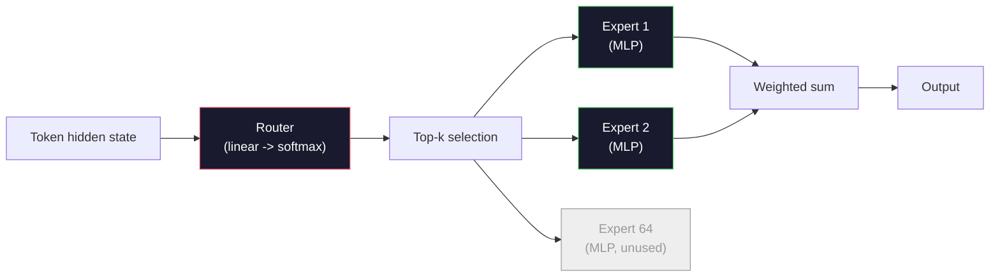

# 오픈 모델: 아키텍처 둘러보기 (Open Models: Architecture Walkthroughs)

> Lesson 04에서 GPT-2 Small을 밑바닥부터 만들었다. 2026년의 프런티어 오픈 모델은 구체적 변경 다섯 또는 여섯 개를 더한 같은 가족이다. LayerNorm 대신 RMSNorm. GELU 대신 SwiGLU. 학습된 위치 대신 RoPE. 완전한 MHA 대신 GQA나 MLA. 규모에서의 전문가 혼합(Mixture-of-Experts). 이미 아는 수학이 그중 95%를 다룬다. 이 레슨은 Llama 3, DeepSeek-V3, Mixtral, Qwen, Gemma를 나란히 읽고 각 아키텍처가 갈라지는 정확한 줄을 짚는다.

**Type:** Learn
**Languages:** Python (stdlib)
**Prerequisites:** Phase 10, Lessons 04, 05, 12 (Pre-training, Scaling, Inference)
**Time:** ~45분

## 학습 목표 (Learning Objectives)

- Llama 3, Mistral, Mixtral, Gemma 2, Qwen 2.5, DeepSeek-V3의 config.json을 읽고 모든 필드를 설명하기
- 각 모델이 GPT-2 Small 대비 한 구체적 아키텍처 변경을 짚고 원리에서 출발해 정당화하기
- 어떤 오픈 모델이든 설정만으로 파라미터(parameter) 수, KV 캐시(KV cache) 크기, 활성값(activation) 메모리를 계산하기
- 지연 시간(latency), 메모리, 능력 제약이 주어진 배포(deployment) 대상에 맞는 올바른 오픈 모델 고르기

## 문제 (The Problem)

Lesson 04에서 numpy 350줄을 작성해 GPT-2 모양의 모델을 만들었다. Llama 3 405B에는 200페이지짜리 기술 보고서가 딸려 있다. 둘이 서로 다른 짐승이라는 직감이 들겠지만, 그렇지 않다. 그 200페이지는 충분히 동기 부여된 수정 다섯 또는 여섯 개에 확장에 관한 천 개의 구현 세부사항을 더한 같은 객체를 기술한다. 골격 — 임베딩(embedding), 트랜스포머 블록, 어텐션(attention), MLP, 정규화(norm), 헤드(head) — 은 변하지 않는다.

이 레슨은 하나의 diff다. 주요 오픈 모델 가족마다 GPT-2에서 무엇이 바뀌었는지, 왜, 무엇을 대가로 치렀는지 정확히 나열한다. 끝나면 새 모델 카드를 읽고 그것을 머릿속에서 GPT-2 베이스라인(baseline)으로 되번역할 수 있다.

실용적 보상은, Meta가 Llama 5를 내놓거나 DeepSeek이 V4를 내놓을 때 새로운 사고 모델이 필요하지 않다는 것이다. 설정을 보고 잘 알려진 손잡이(knob) 중 어느 것이 움직였는지 확인하면 하류 함의가 무엇인지 안다. 2026년 아키텍처는 유한한 도구 상자다. 새 모델마다 다른 부분집합을 고른다.

## 개념 (The Concept)

### 불변의 핵심 (The Invariant Core)

모든 자기회귀(autoregressive) 오픈 모델은 다음을 공유한다:

- 토큰 임베딩 행렬(vocab_size x hidden_dim).
- N개의 디코더(decoder) 블록 스택: 정규화, 셀프 어텐션(self-attention), 잔차(residual), 정규화, MLP, 잔차.
- vocab_size로 투영하는 최종 정규화와 선형 헤드(흔히 임베딩과 가중치 묶임, weight-tied).
- 인과 마스크(causal mask), 다음 토큰 교차 엔트로피(cross-entropy) 손실.

그것이 모양이다. 나머지는 손잡이다.

### 실제로 움직이는 여섯 개의 손잡이 (The Six Knobs That Actually Move)

모든 2024-2026년 프런티어 오픈 모델에 걸쳐, 같은 여섯 개의 설계 선택이 반복해서 선택된다:

1. **정규화(Normalization).** LayerNorm -> RMSNorm.
2. **위치 인코딩(Positional encoding).** 학습된 절대 위치 -> RoPE(더하기 변형: YaRN, NTK).
3. **활성화(Activation).** GELU -> SwiGLU(또는 GeGLU).
4. **어텐션 헤드 공유(Attention head sharing).** MHA -> GQA -> MQA -> MLA.
5. **밀집 vs 희소 MLP(Dense vs sparse MLP).** 밀집(Dense) -> 전문가 혼합(Mixture-of-Experts).
6. **사전 정규화 배치(Pre-norm placement).** 사전 정규화(Pre-norm)가 남는다. 사후 정규화(Post-norm)는 사라졌다.

다른 모든 것(학습률 스케줄, 데이터 혼합, 배치 크기, 컨텍스트 길이)은 아키텍처가 아니라 학습 설정에 산다. 여섯 개의 손잡이.

### 손잡이 1: RMSNorm

LayerNorm은 평균을 빼고, 표준편차로 나누고, 스케일링하고, 이동시킨다. RMSNorm은 스케일만 유지한다:

```
RMSNorm(x) = x / sqrt(mean(x^2) + eps) * gamma
```

평균 빼기 없음. 편향(bias) 없음. 토큰당 행렬 곱셈 하나 적음. Zhang과 Sennrich (2019)는 기계 번역에서 LayerNorm에 필적하면서 10% 더 빠르다고 주장했다. 모든 현대 오픈 모델이 이를 돌린다.

비용: 없음. 이점: 작은 처리량 이득, 더 단순한 코드.

### 손잡이 2: RoPE

학습된 위치 임베딩은 GPT-2에서 1024 슬롯짜리 룩업 테이블이었다. 컨텍스트 1025는 테이블 끝을 벗어난다. 모델은 학습 길이를 넘어 외삽(extrapolate)할 수 없다.

회전 위치 임베딩(Rotary Position Embedding, RoPE, Su et al. 2021)은 어텐션 내적(dot product) 전에 각 Q와 K 벡터를 쌍으로 회전시켜 위치를 주입한다. 회전 각도는 위치의 결정론적 함수이므로, 학습되는 것도 없고 바닥날 것도 없다. 스케일링 기법(NTK 인식 보간, YaRN)을 쓰면, 8k 컨텍스트로 학습된 모델이 추론에서 적당한 정확도 손실로 128k까지 늘어날 수 있다.

```
q_rotated = rotate(q, angle(pos))
k_rotated = rotate(k, angle(pos))
score = q_rotated . k_rotated
```

모든 Llama, Mistral, Qwen, DeepSeek, Gemma가 RoPE를 쓴다. Gemma 2는 하이브리드를 쓴다(대부분의 층에 RoPE, 다른 층에 국소 슬라이딩 윈도우 어텐션, local sliding-window attention).

### 손잡이 3: SwiGLU

GPT-2의 MLP는 `x -> gelu(xW1 + b1) -> (...)W2 + b2`다. SwiGLU(Shazeer 2020)는 활성화를 게이트된 곱(gated product)으로 대체한다:

```
SwiGLU(x) = (xW1) * sigmoid(xW1) * xV
```

하나가 아니라 두 개의 투영(projection)이 병렬로, Swish 활성화로 게이트된다. 파라미터당 퍼플렉시티(perplexity)에서 경험적으로 더 강하다. Llama 2가 채택했고, 모두가 따랐다. MLP의 은닉 크기는 보통 총 파라미터 수가 원래 밀집 MLP와 일치하도록 설정된다. GPT-2가 `ff_dim = 4 * hidden`을 썼다면, SwiGLU는 `ff_dim = (2/3) * 4 * hidden = 8/3 * hidden`을 쓴다.

### 손잡이 4: 어텐션 헤드 공유 (Attention Head Sharing)

GPT-2는 **멀티헤드 어텐션(Multi-Head Attention, MHA)** 을 썼다. 모든 헤드가 자체 Q, K, V 투영을 가진다.

**멀티쿼리 어텐션(Multi-Query Attention, MQA, Shazeer 2019)** 은 모든 헤드에 걸쳐 하나의 K와 하나의 V를 공유한다. KV 캐시를 num_heads만큼 줄이는데, 이는 일반적 모델에서 12배에서 32배 감소다. 어려운 벤치마크(benchmark)에서 정확도가 약간 떨어진다.

**그룹 쿼리 어텐션(Grouped-Query Attention, GQA, Ainslie et al. 2023)** 은 중간 지대다. G개 그룹의 Q 헤드가 하나의 K와 하나의 V를 공유한다. Llama 3 8B는 32개 Q 헤드와 8개 KV 헤드(G=8)로 GQA를 쓰므로, KV 캐시가 완전한 MHA 대비 4배 줄어든다.

**멀티헤드 잠재 어텐션(Multi-Head Latent Attention, MLA, DeepSeek 2024)** 은 K와 V를 공유된 저랭크(low-rank) 잠재(latent)로 압축하고, 헤드별로 다시 위로 투영한다. 헤드별 표현력을 보존하면서 KV 캐시를 더 줄인다. DeepSeek-V2와 V3은 긴 컨텍스트 성능을 위해 이에 의존한다.

| 방식 | KV 헤드 | KV 캐시 | 정확도 |
|--------|----------|----------|----------|
| MHA    | num_heads | 완전 | 최고 |
| GQA    | num_groups (G < num_heads) | num_heads / G 감소 | MHA에 근접 |
| MQA    | 1 | num_heads 감소 | 약간의 손실 |
| MLA    | 잠재, 헤드별 압축 해제 | MQA보다 작음 | MHA에 근접 |

약 13B 파라미터 이상의 모든 모델에서 GQA나 MLA는 사실상 필수다. 규모가 커진 뒤의 완전한 MHA는 KV 캐시 재앙이다.

### 손잡이 5: 전문가 혼합 (Mixture of Experts)

밀집 MLP는 모든 토큰에 대해 모든 파라미터를 활성화한다. MoE MLP는 블록당 K개의 전문가(expert)와, 토큰당 상위 k개 전문가를 고르는 라우터(router)를 가진다(보통 top-2). 그 토큰에 대해 그 전문가들의 가중치만 순방향 패스(forward pass)를 본다.

```
router_logits = xW_r
indices, weights = top_k(router_logits, k=2)
output = sum_i weights[i] * expert[indices[i]](x)
```

매력: 각 크기 7B인 전문가 64개를 둘 수 있으면서(그래서 총 파라미터 수가 거대함) 토큰당 그중 2개만 돌린다(그래서 토큰당 연산이 밀집 7B 모델과 일치함). Mixtral 8x7B는 총 파라미터가 47B지만 토큰당 13B만 활성화한다. DeepSeek-V3은 총 파라미터가 671B지만 토큰당 37B만 활성화한다.



장점: 같은 연산, 더 많은 파라미터, 더 나은 용량. 단점: 전문가 메모리는 여전히 어딘가에 살아야 하고(그래서 서빙은 밀집 등가물보다 더 많은 VRAM이 필요함), 라우터의 부하 분산(load-balancing)이 어려우며, 정렬(alignment) 중 라우터를 파인튜닝(fine-tuning)하는 것은 그 자체로 하나의 연구 영역이다.

### 손잡이 6: 사전 정규화가 남는다 (Pre-norm stays)

원조 트랜스포머는 각 서브레이어(sublayer) 후에 층 정규화를 적용했다. GPT-2 이후 모든 오픈 모델은 그것을 각 서브레이어 *전에* 둔다. 사전 정규화는 깊이에서 학습하기가 엄밀히 더 쉽다. 논쟁할 것이 없다.

### 모델별 Diff (Model-by-Model Diff)

이 모든 것을 구체적으로 만드는 표는 다음과 같다.

| 모델 | 연도 | 총 파라미터 | 활성 파라미터 | 정규화 | 활성화 | 위치 | 어텐션 | MoE | 컨텍스트 |
|-------|------|-------------|---------------|------|-----------|----------|-----------|-----|---------|
| GPT-2 Small | 2019 | 124M | 124M | LayerNorm | GELU | 학습됨 | MHA (12 heads) | 아니오 | 1k |
| Llama 3 8B | 2024 | 8B | 8B | RMSNorm | SwiGLU | RoPE | GQA (32/8) | 아니오 | 128k |
| Llama 3 70B | 2024 | 70B | 70B | RMSNorm | SwiGLU | RoPE | GQA (64/8) | 아니오 | 128k |
| Llama 3 405B | 2024 | 405B | 405B | RMSNorm | SwiGLU | RoPE | GQA (128/16) | 아니오 | 128k |
| Mistral 7B | 2023 | 7.2B | 7.2B | RMSNorm | SwiGLU | RoPE | GQA | 아니오 | 32k |
| Mixtral 8x7B | 2023 | 47B | 13B | RMSNorm | SwiGLU | RoPE | GQA | 예 (8 experts, top-2) | 32k |
| Gemma 2 9B | 2024 | 9B | 9B | RMSNorm (pre+post) | GeGLU | RoPE + sliding | GQA | 아니오 | 8k |
| Qwen 2.5 72B | 2024 | 72B | 72B | RMSNorm | SwiGLU | RoPE (YaRN) | GQA (64/8) | 아니오 | 128k |
| DeepSeek V2 236B | 2024 | 236B | 21B | RMSNorm | SwiGLU | RoPE | MLA | 예 (160 experts, top-6) | 128k |
| DeepSeek V3 | 2024 | 671B | 37B | RMSNorm | SwiGLU | RoPE | MLA | 예 (256 experts, top-8) | 128k |

열을 훑어보라. RMSNorm은 보편적이다. SwiGLU나 그 사촌 GeGLU는 보편적이다. RoPE는 보편적이다. GQA는 MLA로 대체될 때를 제외하고 7B 이상에서 보편적이다. MoE는 최상위에서의 차별화 요소다.

### config.json 읽기 (Reading a config.json)

Llama 3 8B 설정:

```
{
  "hidden_size": 4096,
  "intermediate_size": 14336,
  "num_hidden_layers": 32,
  "num_attention_heads": 32,
  "num_key_value_heads": 8,
  "max_position_embeddings": 131072,
  "rope_theta": 500000.0,
  "rms_norm_eps": 1e-5,
  "vocab_size": 128256
}
```

모든 필드는 이미 구현해 본 무언가에 대응한다.

- `hidden_size`: 임베딩 차원.
- `intermediate_size`: MLP 은닉 크기(hidden의 3.5배 -- SwiGLU 수학).
- `num_hidden_layers`: 스택 깊이.
- `num_attention_heads`: Q 헤드.
- `num_key_value_heads`: KV 헤드(GQA).
- `max_position_embeddings`: 학습 컨텍스트 길이.
- `rope_theta`: RoPE 기본 주파수. Meta는 긴 컨텍스트 외삽을 위해 기본 10k에서 500k로 확장했다.
- `rms_norm_eps`: 수치 안정성.
- `vocab_size`: 토큰.

이것들만으로 총 파라미터, KV 캐시, 최대 활성값 메모리를 계산한다. 정확한 공식은 `code/main.py`를 보라.

### 활성값 메모리 예산 (Activation memory budget)

몇십억 파라미터 이상에서 활성값은 학습 메모리를 지배한다. 사전 학습의 경험칙(그래디언트 체크포인팅, gradient checkpointing 포함):

```
activation_mem ~ batch_size * seq_len * hidden_size * num_layers * bytes_per_element
```

batch 1, seq 8192, BF16, 32개 층, hidden 4096의 Llama 3 8B의 경우: 체크포인팅을 쓰면 활성값만으로 대략 8 GB, 쓰지 않으면 40 GB. 이것이 flash-attention과 ring-attention이 중요한 이유다 — 그것들은 활성값이 맞도록 어텐션 계산을 다시 쓴다.

### KV 캐시 예산 (KV Cache budget)

최대 컨텍스트에서의 추론의 경우:

```
kv_cache = 2 * num_layers * num_kv_heads * head_dim * max_seq_len * bytes_per_element
```

128k 컨텍스트, BF16, head_dim = hidden / num_heads = 128의 Llama 3 8B:
시퀀스당 `2 * 32 * 8 * 128 * 131072 * 2 = 17.2 GB`.

8B 가중치는 BF16에서 16 GB다. 단일 128k 시퀀스의 KV 캐시가 가중치보다 크다. 이것이 GQA, MLA, KV 캐시 양자화 연구를 추동하는 메모리 압박이다.

### 각 모델이 이기는 경우 (When Each Model Wins)

- **단일 80GB GPU, MoE 없음**: Llama 3 8B, Mistral 7B, Gemma 2 9B. 서빙하기 쉽고, 넓은 도구.
- **단일 노드(8x80GB), 큰 용량**: Llama 3 70B, Qwen 2.5 72B. 최고의 밀집 오픈 능력.
- **가장 큰 오픈 능력, MoE 복잡성 수용**: DeepSeek V3, Mixtral 8x22B. 활성 FLOP당 최고의 능력.
- **긴 컨텍스트 필요**: Llama 3(RoPE 스케일링으로 128k), DeepSeek(MLA 이점).
- **저지연 서빙**: Gemma 2 9B(슬라이딩 윈도우가 긴 컨텍스트 연산을 줄임).

## 직접 만들기 (Build It)

이 레슨의 코드는 계산기다. 어떤 config.json이든 주어지면, 구성요소별 파라미터 수, 최대 컨텍스트에서의 KV 캐시, SwiGLU MLP 비율, 그리고 아키텍처에 대한 짧은 판정(밀집 / GQA / MLA / MoE)을 출력한다.

```python
config = {
    "hidden_size": 4096, "intermediate_size": 14336,
    "num_hidden_layers": 32, "num_attention_heads": 32,
    "num_key_value_heads": 8, "vocab_size": 128256,
    "max_position_embeddings": 131072,
}
```

스크립트는 아키텍처를 필드별로 훑으며, 임베딩, 어텐션(GQA 감소 포함), MLP(SwiGLU 확장 포함), layernorm, 헤드에 대한 파라미터 수를 계산한다. 그런 다음 명시된 컨텍스트 길이에서의 KV 캐시를 계산하고 요약을 출력한다.

구현은 `code/main.py`를 보라.

## 라이브러리로 써보기 (Use It)

스크립트에 묶여 있는 Llama 3 8B, Mistral 7B, Mixtral 8x7B, DeepSeek V3 설정에서 계산기를 실행하라. 파라미터 분해를 비교하라. MoE 모델은 총 파라미터 수가 밀집 모델을 압도하지만 활성 파라미터 수는 종종 더 작다는 점에 주목하라. DeepSeek V3은 총 파라미터가 더 많은데도 KV 캐시는 Llama 3 405B보다 작다는 점에도 주목하라 — 그것이 MLA의 작동이다.

그런 다음 로컬에 있는 아무 모델의 설정이나 넣고, 요약을 읽고, GPU에 맞는지 결정하라.

## 산출물 (Ship It)

이 레슨은 `outputs/skill-open-model-picker.md`를 만든다. 배포 대상(GPU 유형, VRAM, 컨텍스트 길이, 지연 시간 예산)과 작업 프로필(채팅, 코드, 추론, 긴 컨텍스트)이 주어지면, 여섯 개 아키텍처 손잡이에 대한 명시적 추론과 함께 오픈 모델, Lesson 11의 양자화 방식, Lesson 12의 추론 스택을 추천한다.

## 연습 문제 (Exercises)

1. HuggingFace에서 Qwen 2.5 72B 설정을 읽어라. 총 파라미터를 밑바닥부터 계산하라. HF가 보고한 값과 비교하고 어떤 차이가 어디서 오는지 식별하라(head dim 반올림, KV 공유 인자 등).

2. DeepSeek V3은 top-8 라우팅으로 256개 전문가를 쓴다. 활성화된 전문가 대 총 전문가의 비율을 계산하고 Mixtral 8x7B의 8개 중 top-2와 비교하라. 희소(25%)에서 더 조밀한 희소(3%)로의 이동이 FLOP당 용량에 대해 무엇을 함의하는가?

3. 128k 컨텍스트의 Llama 3 405B에 대해 FP8과 BF16에서 KV 캐시를 계산하라. FP8에서는 BF16 숫자의 절반이다. 단일 8xH100 노드(각 80GB = 총 640GB, 가중치 메모리 제외)에서 몇 개의 병렬 시퀀스를 서빙할 수 있는가?

4. Gemma 2는 완전 어텐션과 슬라이딩 윈도우 어텐션 층을 번갈아 쓴다. 절반의 층이 완전 컨텍스트 대신 4096 토큰 슬라이딩 윈도우를 쓸 때의 KV 캐시 수학을 작성하라. 8k 총 컨텍스트에서 그것이 얼마나 많은 메모리를 절약하는가?

5. 이 레슨이 작성된 후에 출시된 최근 프런티어 오픈 모델을 찾아라. 그것이 여섯 손잡이 중 어느 것을 골랐는지, 그리고 일곱 번째 손잡이를 도입했는지 식별하라. 새 아키텍처가 출시되는 순간 커리큘럼은 시대에 뒤떨어진 느낌이 들 것이다 — 목표는 사고 모델을 다시 만들지 않고 표를 갱신하는 것이다.

## 핵심 용어 (Key Terms)

| 용어 | 사람들이 말하는 것 | 실제 의미 |
|------|----------------|----------------------|
| RMSNorm | "평균 없는 LayerNorm" | 학습된 스케일과 함께 제곱 평균 제곱근(root mean square)으로만 정규화 — LayerNorm보다 저렴하고 비슷함 |
| RoPE | "회전 위치" | 위치에 따라 달라지는 각도로 각 Q와 K 벡터를 2D 쌍으로 회전 — 스케일링 기법으로 학습 길이를 넘어 외삽 |
| SwiGLU | "새로운 MLP 활성화" | Swish를 사용한 게이트 선형 유닛: `(xW1) * sigmoid(xW1) * xV` — 모든 2024+ 오픈 모델의 표준 |
| GQA | "중간 지대 어텐션" | 그룹 쿼리 어텐션: G개 그룹의 Q 헤드가 하나의 K와 하나의 V 헤드를 공유 — MQA의 정확도 손실 없이 KV 캐시를 줄임 |
| MLA | "DeepSeek의 어텐션" | 멀티헤드 잠재 어텐션: K/V를 공유 저랭크 잠재로 압축하고 헤드별로 압축 해제 — 큰 모델에 대한 가장 작은 KV 캐시 |
| MoE | "희소 전문가" | 전문가 혼합: 블록당 N개의 MLP, 라우터가 토큰당 top-k를 고름 — 거대한 총 파라미터, 작은 활성 파라미터 |
| Top-k 라우팅 | "토큰당 k개 전문가 고르기" | 라우터가 전문가당 점수를 계산하고 가장 높은 k개를 활성화 — 일반적 k는 2(Mixtral)에서 8(DeepSeek) |
| YaRN | "RoPE 늘이기" | 또 하나의 RoPE 확장 — 추론 시 컨텍스트를 8k에서 128k+로 확장하기 위해 회전 각도를 보간 |
| 슬라이딩 윈도우 어텐션(Sliding-window attention) | "모든 것에 어텐션하지 않기" | 각 토큰이 마지막 W개 토큰에만 어텐션 — 토큰당 어텐션 비용을 O(W)로 제한, Gemma 2와 초기 Mistral에서 사용 |
| 활성 파라미터(Active params) | "토큰당 실행되는 것" | MoE 모델의 경우, 토큰당 순방향 패스를 보는 파라미터 수(총 파라미터보다 훨씬 작음) — 토큰당 FLOPs를 좌우함 |

## 더 읽을거리 (Further Reading)

- [Dubey et al., 2024 -- "The Llama 3 Herd of Models"](https://arxiv.org/abs/2407.21783) -- 밀집 Llama 3 가족의 아키텍처 및 학습 참조
- [DeepSeek-AI, 2024 -- "DeepSeek-V3 Technical Report"](https://arxiv.org/abs/2412.19437) -- MLA 더하기 보조 손실 없는 부하 분산 더하기 671B MoE
- [Jiang et al., 2024 -- "Mixtral of Experts"](https://arxiv.org/abs/2401.04088) -- 표준적인 MoE 오픈 모델 논문
- [Su et al., 2021 -- "RoFormer: Enhanced Transformer with Rotary Position Embedding"](https://arxiv.org/abs/2104.09864) -- RoPE 논문
- [Shazeer, 2020 -- "GLU Variants Improve Transformer"](https://arxiv.org/abs/2002.05202) -- SwiGLU, GeGLU, 그리고 친구들
- [Ainslie et al., 2023 -- "GQA: Training Generalized Multi-Query Transformer Models"](https://arxiv.org/abs/2305.13245) -- GQA 논문
- [Gemma 2 Team, 2024 -- "Gemma 2: Improving Open Language Models at a Practical Size"](https://arxiv.org/abs/2408.00118) -- 하이브리드 완전+슬라이딩 어텐션, 사전+사후 정규화
- [Qwen Team, 2024 -- "Qwen 2.5 Technical Report"](https://arxiv.org/abs/2412.15115) -- YaRN 컨텍스트 확장과 긴 컨텍스트 학습 레시피
