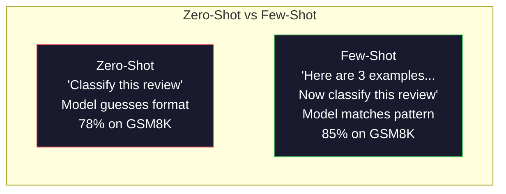
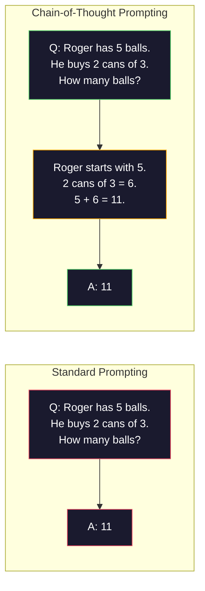
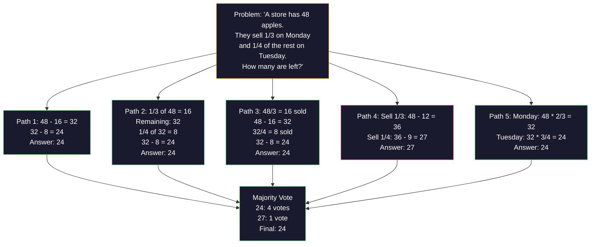
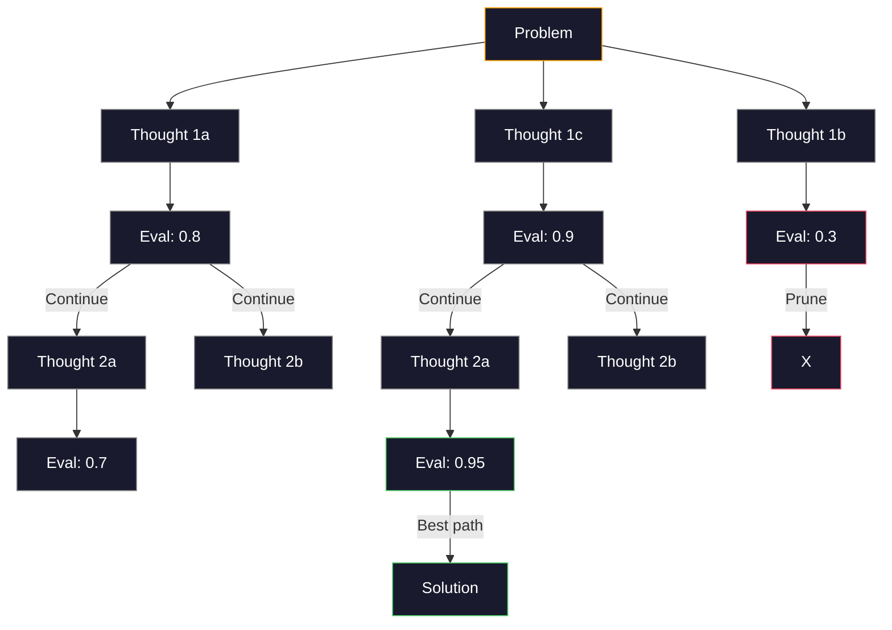
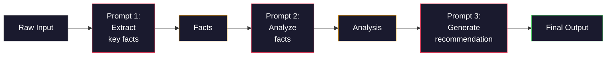

# 퓨샷(Few-Shot), 사고 연쇄(Chain-of-Thought), 사고 트리(Tree-of-Thought)

> 모델에게 무엇을 하라고 말하는 것은 프롬프팅이다. 어떻게 생각하라고 보여주는 것은 엔지니어링이다. 같은 모델, 같은 작업, 같은 데이터에서 정확도 78%와 91%의 차이는 더 나은 모델이 아니다. 더 나은 추론 전략이다.

**Type:** Build
**Languages:** Python
**Prerequisites:** Lesson 11.01 (Prompt Engineering)
**Time:** ~45분

## 학습 목표 (Learning Objectives)

- 작업 정확도를 극대화하는 예시 시연을 선택하고 형식화해 퓨샷 프롬프팅(few-shot prompting) 구현하기
- 수학 문장제 같은 다단계 문제의 정확도를 높이기 위해 사고 연쇄(chain-of-thought, CoT) 추론 적용하기
- 여러 추론 경로를 탐색하고 가장 좋은 것을 선택하는 사고 트리(tree-of-thought) 프롬프트 만들기
- 표준 벤치마크(benchmark)에서 제로샷(zero-shot) vs 퓨샷 vs CoT의 정확도 향상 측정하기

## 문제 (The Problem)

수학 과외 앱을 만든다고 하자. 프롬프트는 "Solve this word problem"이라고만 한다. GPT-5는 표준 초등 수학 벤치마크인 GSM8K에서 94%의 정답률을 보인다. 이미 정점에 올랐다고 생각하기 쉽다. 아니다 — 사고 연쇄는 여전히 3-4점을 더한다.

다섯 단어 — "Let's think step by step" — 를 더하면 정확도가 91%로 뛴다. 풀이 예시 몇 개를 더하면 95%에 도달한다. 같은 모델. 같은 온도. 같은 API 비용. 유일한 차이는 모델에게 연습장을 줬다는 것이다.

이것은 잔재주가 아니다. 추론이 작동하는 방식이다. 인간은 다단계 문제를 한 번의 정신적 도약으로 풀지 않는다. 트랜스포머(transformer)도 그렇지 않다. 모델에게 중간 토큰(token)을 생성하도록 강제하면, 그 토큰들은 다음 토큰을 위한 맥락의 일부가 된다. 각 추론 단계가 다음 단계에 입력으로 들어간다. 모델은 말 그대로 답에 이르는 길을 계산해낸다.

그러나 "think step by step"은 시작이지 끝이 아니다. 다섯 개의 추론 경로를 샘플링해 다수결을 취하면 어떨까? 모델이 가능성의 트리를 탐색하면서 가지를 평가하고 가지치기하게 하면 어떨까? 추론과 도구 사용을 번갈아 가게 하면 어떨까? 이것들은 가설이 아니다. 측정된 향상을 갖춘, 이미 발표된 기법들이며, 이 레슨에서 모두 직접 만들어 본다.

## 개념 (The Concept)

### 제로샷 vs 퓨샷: 예시가 지시를 이길 때 (Zero-Shot vs Few-Shot: When Examples Beat Instructions)

제로샷 프롬프팅은 모델에게 작업만 주고 그 외에는 아무것도 주지 않는다. 퓨샷 프롬프팅은 먼저 예시를 준다.

Wei et al. (2022)는 8개 벤치마크에 걸쳐 이를 측정했다. 감성 분류(sentiment classification) 같은 단순한 작업에서는 제로샷과 퓨샷이 서로 2% 이내의 성능을 보였다. 다단계 산술과 기호 추론 같은 복잡한 작업에서는 퓨샷이 정확도를 10-25% 높였다.

직관: 예시는 압축된 지시다. 출력 형식을 묘사하는 대신 보여준다. 추론 과정을 설명하는 대신 시연한다. 모델은 추상적 지시를 해석할 때보다 예시에 패턴을 맞출 때 더 안정적으로 작동한다.



**퓨샷이 이길 때:** 형식에 민감한 작업, 분류(classification), 구조화된 추출, 도메인 특화 전문 용어, 모델이 특정 패턴에 매칭해야 하는 모든 작업.

**제로샷이 이길 때:** 단순한 사실 질문, 예시가 창의성을 제약하는 창작 작업, 좋은 예시를 찾는 것이 좋은 지시를 쓰는 것보다 더 어려운 작업.

### 예시 선택: 유사한 것이 무작위를 이긴다 (Example Selection: Similar Beats Random)

모든 예시가 동등하지는 않다. 대상 입력과 유사한 예시를 고르는 것이 무작위 선택보다 분류 작업에서 5-15% 더 좋은 성능을 낸다(Liu et al., 2022). 세 가지 원칙:

1. **의미적 유사성(Semantic similarity)**: 임베딩(embedding) 공간에서 입력과 가장 가까운 예시를 고른다
2. **레이블 다양성(Label diversity)**: 예시에서 모든 출력 범주를 포괄한다
3. **난이도 일치(Difficulty matching)**: 대상 문제의 복잡도 수준에 맞춘다

대부분의 작업에서 최적의 예시 개수는 3-5개다. 3개 미만이면 모델은 패턴을 추출할 만한 신호가 부족하다. 5개를 넘으면 수확 체감에 부딪히고 컨텍스트 윈도우(context window) 토큰을 낭비한다. 레이블이 많은 분류에서는 레이블당 하나의 예시를 사용하라.

### 사고 연쇄: 모델에게 연습장 주기 (Chain-of-Thought: Giving Models Scratch Paper)

사고 연쇄(Chain-of-Thought, CoT) 프롬프팅은 Google Brain의 Wei et al. (2022)에 의해 도입되었다. 아이디어는 단순하다: 모델에게 답만 요청하는 대신, 추론 단계를 먼저 보이도록 요청하는 것이다.



이것이 메커니즘적으로 왜 작동하는가? 트랜스포머가 생성하는 각 토큰은 다음 토큰의 맥락이 된다. CoT 없이는 모델이 모든 추론을 단일 순방향 패스(forward pass)의 은닉 상태(hidden state)로 압축해야 한다. CoT가 있으면 모델은 중간 계산을 토큰으로 외부화한다. 각 추론 토큰이 유효 계산 깊이를 확장한다.

**GSM8K 벤치마크 (초등 수학, 8.5K 문제):**

| Model | Zero-Shot | Zero-Shot CoT | Few-Shot CoT |
|-------|-----------|---------------|--------------|
| GPT-4o | 78% | 91% | 95% |
| GPT-5 | 94% | 97% | 98% |
| o4-mini (reasoning) | 97% | — | — |
| Claude Opus 4.7 | 93% | 97% | 98% |
| Gemini 3 Pro | 92% | 96% | 98% |
| Llama 4 70B | 80% | 89% | 94% |
| DeepSeek-V3.1 | 89% | 94% | 96% |

**추론 모델에 대한 주의.** OpenAI의 o 시리즈(o3, o4-mini)와 DeepSeek-R1 같은 모델은 답을 내보내기 전에 내부적으로 사고 연쇄를 실행한다. 추론 모델에 "Let's think step by step"을 더하는 것은 중복이며 때로는 역효과를 낸다 — 이미 그것을 했기 때문이다.

CoT의 두 가지 변형:

**제로샷 CoT(Zero-shot CoT)**: 프롬프트에 "Let's think step by step"을 덧붙인다. 예시가 필요 없다. Kojima et al. (2022)는 이 한 문장이 산술, 상식, 기호 추론 작업에 걸쳐 정확도를 높인다는 것을 보였다.

**퓨샷 CoT(Few-shot CoT)**: 추론 단계를 포함하는 예시를 제공한다. 모델이 기대하는 추론 형식을 그대로 보기 때문에 제로샷 CoT보다 효과적이다.

**CoT가 해로울 때**: 단순한 사실 회상("What is the capital of France?"), 단일 단계 분류, 정확도보다 속도가 더 중요한 작업. CoT는 쿼리당 50-200토큰의 추론 오버헤드를 더한다. 고처리량·저복잡도 작업에서는 그것이 낭비되는 비용이다.

### 자기 일관성: 많이 샘플링하고, 한 번 투표 (Self-Consistency: Sample Many, Vote Once)

Wang et al. (2023)는 자기 일관성(self-consistency)을 도입했다. 통찰: 단일 CoT 경로는 추론 오류를 포함할 수 있다. 그러나 N개의 독립적인 추론 경로를 샘플링하고(temperature > 0 사용) 최종 답에 대해 다수결을 취하면, 오류가 상쇄된다.



자기 일관성은 원래 PaLM 540B 실험에서 N=40으로 GSM8K 정확도를 56.5%(단일 CoT)에서 74.4%로 높였다. GPT-5에서는 기본 정확도가 이미 포화(saturation)되어 있어 향상이 작다(97%에서 98%). 이 기법은 기본 CoT 정확도가 60-85%인 모델에서 가장 빛난다 — 단일 경로 오류가 잦지만 체계적이지는 않은 최적 지점이다. 추론 모델(o 시리즈, R1)의 경우 자기 일관성은 내장된 내부 샘플링에 포섭된다.

트레이드오프(trade-off): N개의 샘플은 N배의 API 비용과 지연 시간(latency)을 뜻한다. 실제로는 N=5가 이점의 대부분을 포착한다. N=3은 의미 있는 투표를 위한 최소값이다. 대부분의 작업에서 N > 10은 수확이 체감한다.

### 사고 트리: 분기 탐색 (Tree-of-Thought: Branching Exploration)

Yao et al. (2023)는 사고 트리(Tree-of-Thought, ToT)를 도입했다. CoT가 하나의 선형 추론 경로를 따르는 반면, ToT는 여러 가지를 탐색하고 계속하기 전에 어느 것이 가장 유망한지 평가한다.



ToT에는 세 가지 구성 요소가 있다:

1. **사고 생성(Thought generation)**: 여러 후보 다음 단계를 만든다
2. **상태 평가(State evaluation)**: 각 후보를 채점한다(LLM 자체를 평가자로 쓸 수 있다)
3. **탐색 알고리즘(Search algorithm)**: 트리를 BFS 또는 DFS로 탐색하며 점수가 낮은 가지를 가지치기한다

Game of 24 작업(산술을 사용해 숫자 4개를 결합해 24를 만들기)에서 표준 프롬프팅을 쓴 GPT-4는 문제의 7.3%를 푼다. CoT로는 4.0%다(여기서는 탐색 공간이 넓어 CoT가 오히려 해롭다). ToT로는 74%다.

ToT는 비싸다. 트리의 각 노드는 LLM 호출을 필요로 한다. 분기 계수 3, 깊이 3의 트리는 최대 39번의 LLM 호출을 필요로 한다. 탐색 공간이 크지만 평가 가능한 문제에만 사용하라 — 계획 수립, 퍼즐 풀이, 제약이 있는 창의적 문제 해결.

### ReAct: 생각하기 + 행동하기 (ReAct: Thinking + Doing)

Yao et al. (2022)는 추론 자취를 행동과 결합했다. 모델은 생각하기(추론 생성)와 행동하기(도구 호출, 검색, 계산)를 번갈아 한다.

```mermaid
graph LR
    Q["Question:\nWhat is the\npopulation of the\ncountry where\nthe Eiffel Tower\nis located?"]
    T1["Thought: I need to\nfind which country\nhas the Eiffel Tower"]
    A1["Action: search\n'Eiffel Tower location'"]
    O1["Observation:\nParis, France"]
    T2["Thought: Now I need\nFrance's population"]
    A2["Action: search\n'France population 2024'"]
    O2["Observation:\n68.4 million"]
    T3["Thought: I have\nthe answer"]
    F["Answer:\n68.4 million"]

    Q --> T1 --> A1 --> O1 --> T2 --> A2 --> O2 --> T3 --> F

    style Q fill:#1a1a2e,stroke:#ffa500,color:#fff
    style T1 fill:#1a1a2e,stroke:#51cf66,color:#fff
    style A1 fill:#1a1a2e,stroke:#e94560,color:#fff
    style O1 fill:#1a1a2e,stroke:#808080,color:#fff
    style T2 fill:#1a1a2e,stroke:#51cf66,color:#fff
    style A2 fill:#1a1a2e,stroke:#e94560,color:#fff
    style O2 fill:#1a1a2e,stroke:#808080,color:#fff
    style T3 fill:#1a1a2e,stroke:#51cf66,color:#fff
    style F fill:#1a1a2e,stroke:#51cf66,color:#fff
```



ReAct는 추론을 실제 데이터에 근거시킬 수 있기 때문에 지식 집약적 작업에서 순수 CoT를 능가한다. HotpotQA(다중 홉 질의응답)에서 GPT-4를 쓴 ReAct는 CoT 단독의 29.4%에 비해 35.1%의 정확 일치(exact match)를 달성한다. 진짜 힘은 관찰(observation)이 추론 오류를 교정한다는 데 있다 — 모델은 실행 중간에 계획을 갱신할 수 있다.

ReAct는 현대 AI 에이전트(agent)의 기초다. 모든 에이전트 프레임워크(LangChain, CrewAI, AutoGen)는 Thought-Action-Observation 루프의 어떤 변형을 구현한다. 완전한 에이전트는 Phase 14에서 만들 것이다. 이 레슨은 프롬프팅 패턴을 다룬다.

### 구조화된 프롬프팅: XML 태그, 구분자, 헤더 (Structured Prompting: XML Tags, Delimiters, Headers)

프롬프트가 복잡해지면, 구조는 모델이 섹션을 혼동하지 않게 막는다. 세 가지 접근법:

**XML 태그** (Claude에서 가장 잘 작동하고, 어디서나 견실함):
```
<context>
You are reviewing a pull request.
The codebase uses TypeScript and React.
</context>

<task>
Review the following diff for bugs, security issues, and style violations.
</task>

<diff>
{diff_content}
</diff>

<output_format>
List each issue with: file, line, severity (critical/warning/info), description.
</output_format>
```

**Markdown 헤더** (보편적):
```
## Role
Senior security engineer at a fintech company.

## Task
Analyze this API endpoint for vulnerabilities.

## Input
{api_code}

## Rules
- Focus on OWASP Top 10
- Rate each finding: critical, high, medium, low
- Include remediation steps
```

**구분자(Delimiters)** (최소한이지만 효과적):
```
---INPUT---
{user_text}
---END INPUT---

---INSTRUCTIONS---
Summarize the above in 3 bullet points.
---END INSTRUCTIONS---
```

### 프롬프트 체이닝: 순차적 분해 (Prompt Chaining: Sequential Decomposition)

일부 작업은 단일 프롬프트로 다루기에는 너무 복잡하다. 프롬프트 체이닝(prompt chaining)은 그것들을 단계로 나누며, 한 프롬프트의 출력이 다음의 입력이 된다.



체이닝이 단일 프롬프트를 이기는 세 가지 이유:

1. **각 단계가 더 단순하다**: 모델은 모든 것을 한꺼번에 다루는 대신 하나의 집중된 작업을 처리한다
2. **중간 출력을 검사할 수 있다**: 단계 사이에서 검증하고 교정할 수 있다
3. **단계마다 다른 모델을 쓸 수 있다**: 추출에는 저렴한 모델을, 추론에는 비싼 모델을 쓴다

### 성능 비교 (Performance Comparison)

| 기법 | 적합한 용도 | GSM8K 정확도 (GPT-5) | API 호출 | 토큰 오버헤드 | 복잡도 |
|-----------|----------|------------------------|-----------|----------------|------------|
| Zero-Shot | 단순 작업 | 94% | 1 | None | Trivial |
| Few-Shot | 형식 매칭 | 96% | 1 | 200-500 tokens | Low |
| Zero-Shot CoT | 빠른 추론 향상 | 97% | 1 | 50-200 tokens | Trivial |
| Few-Shot CoT | 단일 호출 최대 정확도 | 98% | 1 | 300-600 tokens | Low |
| Self-Consistency (N=5) | 고위험 추론 | 98.5% | 5 | 5x token cost | Medium |
| Reasoning model (o4-mini) | 드롭인 CoT 대체 | 97% | 1 | hidden (2-10x internal) | Trivial |
| Tree-of-Thought | 탐색/계획 문제 | N/A (74% on Game of 24) | 10-40+ | 10-40x token cost | High |
| ReAct | 지식 근거 추론 | N/A (35.1% on HotpotQA) | 3-10+ | Variable | High |
| Prompt Chaining | 복잡한 다단계 작업 | 96% (pipeline) | 2-5 | 2-5x token cost | Medium |

올바른 기법은 세 가지 요인에 달려 있다: 정확도 요구, 지연 예산, 비용 허용치. 대부분의 프로덕션 시스템에서 3-샘플 자기 일관성 폴백을 갖춘 퓨샷 CoT가 사용 사례의 90%를 포괄한다.

## 직접 만들기 (Build It)

우리는 퓨샷 프롬프팅, 사고 연쇄 추론, 자기 일관성 투표를 하나의 파이프라인(pipeline)으로 결합한 수학 문제 풀이기를 만들 것이다. 그다음 어려운 문제를 위해 사고 트리를 추가한다.

전체 구현은 `code/advanced_prompting.py`에 있다. 핵심 구성 요소는 다음과 같다.

### 1단계: 퓨샷 예시 저장소

첫 번째 구성 요소는 퓨샷 예시를 관리하고 주어진 문제에 가장 관련 있는 것들을 선택한다.

```python
GSM8K_EXAMPLES = [
    {
        "question": "Janet's ducks lay 16 eggs per day. She eats three for breakfast every morning and bakes muffins for her friends every day with four. She sells every egg at the farmers' market for $2. How much does she make every day at the farmers' market?",
        "reasoning": "Janet's ducks lay 16 eggs per day. She eats 3 and bakes 4, using 3 + 4 = 7 eggs. So she has 16 - 7 = 9 eggs left. She sells each for $2, so she makes 9 * 2 = $18 per day.",
        "answer": "18"
    },
    ...
]
```

각 예시에는 세 부분이 있다: 질문, 추론 연쇄, 최종 답. 추론 연쇄가 일반 퓨샷 예시를 CoT 퓨샷 예시로 변환하는 것이다.

### 2단계: 사고 연쇄 프롬프트 빌더

프롬프트 빌더는 시스템 메시지, 추론 연쇄가 있는 퓨샷 예시, 대상 질문을 하나의 프롬프트로 조립한다.

```python
def build_cot_prompt(question, examples, num_examples=3):
    system = (
        "You are a math problem solver. "
        "For each problem, show your step-by-step reasoning, "
        "then give the final numerical answer on the last line "
        "in the format: 'The answer is [number]'."
    )

    example_text = ""
    for ex in examples[:num_examples]:
        example_text += f"Q: {ex['question']}\n"
        example_text += f"A: {ex['reasoning']} The answer is {ex['answer']}.\n\n"

    user = f"{example_text}Q: {question}\nA:"
    return system, user
```

형식 제약("The answer is [number]")이 결정적이다. 그것이 없으면 자기 일관성은 샘플 전반에서 답을 추출하고 비교할 수 없다.

### 3단계: 자기 일관성 투표

N개의 추론 경로를 샘플링하고 다수결 답을 취한다.

```python
def self_consistency_solve(question, examples, client, model, n_samples=5):
    system, user = build_cot_prompt(question, examples)

    answers = []
    reasonings = []
    for _ in range(n_samples):
        response = client.chat.completions.create(
            model=model,
            messages=[
                {"role": "system", "content": system},
                {"role": "user", "content": user}
            ],
            temperature=0.7
        )
        text = response.choices[0].message.content
        reasonings.append(text)
        answer = extract_answer(text)
        if answer is not None:
            answers.append(answer)

    vote_counts = Counter(answers)
    best_answer = vote_counts.most_common(1)[0][0] if vote_counts else None
    confidence = vote_counts[best_answer] / len(answers) if best_answer else 0

    return best_answer, confidence, reasonings, vote_counts
```

온도 0.7이 중요하다. 온도 0.0에서는 N개의 모든 샘플이 동일해져, 목적을 무산시킨다. 다양한 추론 경로를 위한 충분한 무작위성이 필요하지만, 모델이 횡설수설을 만들 만큼 많아서는 안 된다.

### 4단계: 사고 트리 풀이기

선형 추론이 실패하는 문제에서, ToT는 여러 접근법을 탐색하고 어느 방향이 가장 유망한지 평가한다.

```python
def tree_of_thought_solve(question, client, model, breadth=3, depth=3):
    thoughts = generate_initial_thoughts(question, client, model, breadth)
    scored = [(t, evaluate_thought(t, question, client, model)) for t in thoughts]
    scored.sort(key=lambda x: x[1], reverse=True)

    for current_depth in range(1, depth):
        next_thoughts = []
        for thought, score in scored[:2]:
            extensions = extend_thought(thought, question, client, model, breadth)
            for ext in extensions:
                ext_score = evaluate_thought(ext, question, client, model)
                next_thoughts.append((ext, ext_score))
        scored = sorted(next_thoughts, key=lambda x: x[1], reverse=True)

    best_thought = scored[0][0] if scored else ""
    return extract_answer(best_thought), best_thought
```

평가자 자체가 LLM 호출이다. 모델에게 묻는다: "On a scale of 0.0 to 1.0, how promising is this reasoning path for solving the problem?" 이것이 ToT의 핵심 통찰이다 — 모델이 자기 자신의 부분 해를 평가한다.

### 5단계: 전체 파이프라인

파이프라인은 에스컬레이션 전략으로 모든 기법을 결합한다.

```python
def solve_with_escalation(question, examples, client, model):
    system, user = build_cot_prompt(question, examples)
    single_response = call_llm(client, model, system, user, temperature=0.0)
    single_answer = extract_answer(single_response)

    sc_answer, confidence, _, _ = self_consistency_solve(
        question, examples, client, model, n_samples=5
    )

    if confidence >= 0.8:
        return sc_answer, "self_consistency", confidence

    tot_answer, _ = tree_of_thought_solve(question, client, model)
    return tot_answer, "tree_of_thought", None
```

에스컬레이션 로직: 저렴한 것(단일 CoT)을 먼저 시도한다. 자기 일관성 신뢰도가 0.8 미만이면(5개 샘플 중 4개 미만이 일치), ToT로 에스컬레이션한다. 이것은 비용과 정확도의 균형을 맞춘다 — 대부분의 문제는 저렴하게 풀리고, 어려운 문제는 더 많은 연산을 받는다.

## 라이브러리로 써보기 (Use It)

### LangChain으로

LangChain은 퓨샷과 CoT 패턴을 단순화하는 프롬프트 템플릿과 출력 파싱을 기본 제공한다:

```python
from langchain_core.prompts import FewShotPromptTemplate, PromptTemplate
from langchain_openai import ChatOpenAI

example_prompt = PromptTemplate(
    input_variables=["question", "reasoning", "answer"],
    template="Q: {question}\nA: {reasoning} The answer is {answer}."
)

few_shot_prompt = FewShotPromptTemplate(
    examples=examples,
    example_prompt=example_prompt,
    suffix="Q: {input}\nA: Let's think step by step.",
    input_variables=["input"]
)

llm = ChatOpenAI(model="gpt-4o", temperature=0.7)
chain = few_shot_prompt | llm
result = chain.invoke({"input": "If a train travels 120 km in 2 hours..."})
```

LangChain에는 의미적 유사도 선택을 위한 `ExampleSelector` 클래스도 있다:

```python
from langchain_core.example_selectors import SemanticSimilarityExampleSelector
from langchain_openai import OpenAIEmbeddings

selector = SemanticSimilarityExampleSelector.from_examples(
    examples,
    OpenAIEmbeddings(),
    k=3
)
```

### DSPy로

DSPy는 프롬프팅 전략을 최적화 가능한 모듈로 취급한다. CoT 프롬프트를 손으로 만드는 대신, 시그니처를 정의하고 DSPy가 프롬프트를 최적화하게 한다:

```python
import dspy

dspy.configure(lm=dspy.LM("openai/gpt-4o", temperature=0.7))

class MathSolver(dspy.Module):
    def __init__(self):
        self.solve = dspy.ChainOfThought("question -> answer")

    def forward(self, question):
        return self.solve(question=question)

solver = MathSolver()
result = solver(question="Janet's ducks lay 16 eggs per day...")
```

DSPy의 `ChainOfThought`는 추론 자취를 자동으로 더한다. `dspy.majority`는 자기 일관성을 구현한다:

```python
result = dspy.majority(
    [solver(question=q) for _ in range(5)],
    field="answer"
)
```

### 비교: 밑바닥부터 vs 프레임워크

| 기능 | 밑바닥부터 (이 레슨) | LangChain | DSPy |
|---------|--------------------------|-----------|------|
| 프롬프트 형식 제어 | Full | Template-based | Automatic |
| 자기 일관성 | Manual voting | Manual | Built-in (`dspy.majority`) |
| 예시 선택 | Custom logic | `ExampleSelector` | `dspy.BootstrapFewShot` |
| 사고 트리 | Custom tree search | Community chains | Not built-in |
| 프롬프트 최적화 | Manual iteration | Manual | Automatic compilation |
| 적합한 용도 | 학습, 맞춤 파이프라인 | 표준 워크플로 | 연구, 최적화 |

## 산출물 (Ship It)

이 레슨은 두 가지 산출물을 만든다.

**1. 추론 연쇄 프롬프트** (`outputs/prompt-reasoning-chain.md`): 자기 일관성을 갖춘 퓨샷 CoT를 위한 프로덕션 준비 완료 프롬프트 템플릿. 자신의 예시와 문제 도메인을 끼워 넣으면 된다.

**2. CoT 패턴 선택 스킬** (`outputs/skill-cot-patterns.md`): 작업 유형, 정확도 요구, 비용 제약에 따라 올바른 추론 기법을 고르기 위한 의사결정 프레임워크.

## 연습 문제 (Exercises)

1. **간극 측정하기**: GSM8K 문제 10개를 가져오라. 각각을 제로샷, 퓨샷, 제로샷 CoT, 퓨샷 CoT로 풀어라. 각각의 정확도를 기록하라. 자신의 모델에서 어느 기법이 가장 큰 상승을 주는가?

2. **예시 선택 실험**: 같은 10개 문제에 대해 무작위 예시 선택 vs 손으로 고른 유사 예시를 비교하라. 정확도 차이를 측정하라. 어느 지점에서 예시 품질이 예시 수량보다 더 중요해지는가?

3. **자기 일관성 비용 곡선**: 20개 GSM8K 문제에서 N=1, 3, 5, 7, 10으로 자기 일관성을 실행하라. 정확도 vs 비용(총 토큰)을 그래프로 그려라. 자신의 모델에서 곡선의 무릎은 어디인가?

4. **ReAct 루프 만들기**: 계산기 도구로 파이프라인을 확장하라. 모델이 수식을 생성하면, Python의 `eval()`로(샌드박스에서) 실행하고 결과를 다시 입력하라. 도구에 근거한 추론이 순수 CoT를 능가하는지 측정하라.

5. **창의적 작업을 위한 ToT**: 사고 트리 풀이기를 창의적 글쓰기 작업에 맞춰라: "Write a 6-word story that is both funny and sad." LLM을 평가자로 사용하라. 분기 탐색이 단일 샷 생성보다 더 나은 창의적 출력을 만드는가?

## 핵심 용어 (Key Terms)

| 용어 | 사람들이 말하는 것 | 실제 의미 |
|------|----------------|----------------------|
| 퓨샷 프롬프팅(Few-shot prompting) | "예시 좀 줘" | 모델의 출력 형식과 행동을 고정하기 위해 프롬프트에 입력-출력 시연을 포함하는 것 |
| 사고 연쇄(Chain-of-Thought) | "단계별로 생각하게 해" | 최종 답을 내기 전에 모델의 유효 계산을 확장하는 중간 추론 토큰을 끌어내는 것 |
| 자기 일관성(Self-Consistency) | "여러 번 돌려" | temperature > 0에서 N개의 다양한 추론 경로를 샘플링하고 다수결로 가장 흔한 최종 답을 선택하는 것 |
| 사고 트리(Tree-of-Thought) | "선택지를 탐색하게 해" | 각 부분 해가 평가되고 유망한 경로만 확장되는, 추론 가지에 대한 구조화된 탐색 |
| ReAct | "생각하기 + 도구 사용" | Thought-Action-Observation 루프에서 추론 자취를 외부 행동(검색, 계산, API 호출)과 번갈아 하는 것 |
| 프롬프트 체이닝(Prompt chaining) | "단계로 나눠" | 복잡한 작업을 순차적 프롬프트로 분해해 각 출력이 다음 입력에 들어가게 하는 것 |
| 제로샷 CoT(Zero-shot CoT) | "그냥 'think step by step'을 더해" | 예시 없이 추론 트리거 문구를 프롬프트에 덧붙여 모델의 잠재 추론 능력에 의존하는 것 |

## 더 읽을거리 (Further Reading)

- [Chain-of-Thought Prompting Elicits Reasoning in Large Language Models](https://arxiv.org/abs/2201.11903) -- Wei et al. 2022. Google Brain의 원조 CoT 논문. 핵심 결과는 2-3절을 읽어라.
- [Self-Consistency Improves Chain of Thought Reasoning in Language Models](https://arxiv.org/abs/2203.11171) -- Wang et al. 2023. 자기 일관성 논문. Table 1에 필요한 모든 수치가 있다.
- [Tree of Thoughts: Deliberate Problem Solving with Large Language Models](https://arxiv.org/abs/2305.10601) -- Yao et al. 2023. ToT 논문. 4절의 Game of 24 결과가 백미다.
- [ReAct: Synergizing Reasoning and Acting in Language Models](https://arxiv.org/abs/2210.03629) -- Yao et al. 2022. 현대 AI 에이전트의 기초. 3절이 Thought-Action-Observation 루프를 설명한다.
- [Large Language Models are Zero-Shot Reasoners](https://arxiv.org/abs/2205.11916) -- Kojima et al. 2022. "Let's think step by step" 논문. 그 단순함에 비해 놀랍도록 효과적이다.
- [DSPy: Compiling Declarative Language Model Calls into Self-Improving Pipelines](https://arxiv.org/abs/2310.03714) -- Khattab et al. 2023. 프롬프팅을 컴파일 문제로 취급한다. 손수 하는 프롬프트 엔지니어링을 넘어서고 싶다면 읽어라.
- [OpenAI — Reasoning models guide](https://platform.openai.com/docs/guides/reasoning) -- 사고 연쇄가 프롬프트 수준의 잔재주 대신 토큰당 가격이 매겨지는 내부 "reasoning" 모드가 되는 시점에 대한 벤더 가이드.
- [Lightman et al., "Let's Verify Step by Step" (2023)](https://arxiv.org/abs/2305.20050) -- 연쇄의 각 단계를 채점하는 프로세스 보상 모델(process reward model, PRM); 결과만 보는 보상을 능가하는 추론 감독 신호.
- [Snell et al., "Scaling LLM Test-Time Compute Optimally" (2024)](https://arxiv.org/abs/2408.03314) -- CoT 길이, 자기 일관성 샘플링, MCTS에 대한 체계적 연구; 정확도가 지연 시간보다 더 중요할 때 "think step by step"이 향하는 곳.
